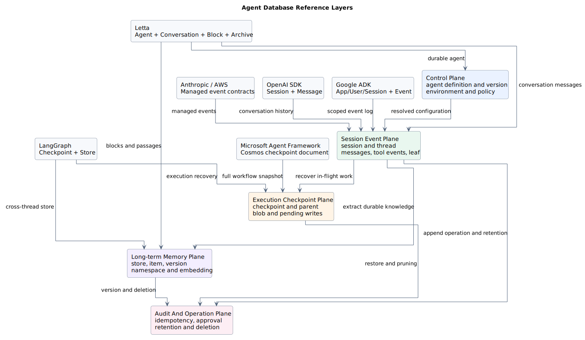
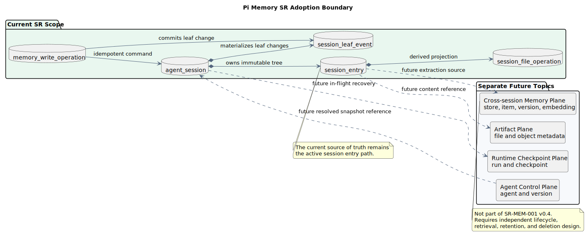

# 主流 Agent 数据库模式拆解与 pi-mono Java 采纳边界

> 文档编号：`SR-DB-REF-001`
> 版本：`v0.1.0`
> 日期：`2026-07-20`
> 状态：参考设计
> pi 源码基线：[`216e672e7c9fc65682553394b74e483c0c9e47f7`](https://github.com/badlogic/pi-mono/tree/216e672e7c9fc65682553394b74e483c0c9e47f7)
> Java 源码基线：无；本文采纳建议均为 target-only design

## 1. 结论

主流 Agent 系统并不存在一套可以整体照搬的统一数据库。公开实现实际覆盖五种不同生命周期的数据：

1. Agent 定义、版本、环境和策略属于控制面。
2. Session、Thread、Message、Tool Event 和当前分支属于会话事件面。
3. Run、Checkpoint、Blob 和 Pending Write 属于执行恢复面。
4. Memory Store、Memory Item、Version 和 Embedding 属于跨会话长期记忆面。
5. 幂等、审批、审计、保留和删除属于操作治理面。

这些数据的写入频率、不可变性、查询方式、保留期限和权限边界不同。Java 目标设计应拆开建模，不应把它们合并到一张通用 `messages` 或 `memory` 表。

对现有 [`SR-MEM-001`](../memory-jsonl-to-gaussdb.md) 的本轮采纳结论是：

- 保留 `agent_session` + `session_entry` 会话树作为 pi context rebuild 的事实源。
- 吸收 Google ADK 的全链路作用域键和复合外键思路。
- 吸收 Anthropic、AWS 的不可变事件与可变状态投影分离思路。
- 吸收 OpenAI Agents SDK 的稳定列 + 原始 JSON payload 思路。
- 不在当前 SR 中加入 LangGraph/Microsoft 的 runtime checkpoint 表；pi 当前恢复语义不是 workflow superstep checkpoint。
- 不在当前 SR 中加入 Letta/AWS/LangGraph 的跨会话长期记忆表；其抽取、召回、保留和删除生命周期需要独立 SR。



PlantUML：[查看源码](./diagram.puml#L4)

## 2. 证据边界与源码基线

### 2.1 公开源码基线

| 系统 | 分析提交 | 仓库相对路径与符号 |
|---|---|---|
| OpenAI Agents SDK | [`2fa463571e76dae8ff267622f1018eaf06ffeb9f`](https://github.com/openai/openai-agents-python/tree/2fa463571e76dae8ff267622f1018eaf06ffeb9f) | [`src/agents/memory/sqlite_session.py`](https://github.com/openai/openai-agents-python/blob/2fa463571e76dae8ff267622f1018eaf06ffeb9f/src/agents/memory/sqlite_session.py#L143-L175) `SQLiteSession._init_db_for_connection`；[`src/agents/extensions/memory/sqlalchemy_session.py`](https://github.com/openai/openai-agents-python/blob/2fa463571e76dae8ff267622f1018eaf06ffeb9f/src/agents/extensions/memory/sqlalchemy_session.py#L168-L211) `SQLAlchemySession` 表定义；[`src/agents/extensions/memory/advanced_sqlite_session.py`](https://github.com/openai/openai-agents-python/blob/2fa463571e76dae8ff267622f1018eaf06ffeb9f/src/agents/extensions/memory/advanced_sqlite_session.py#L87-L154) `AdvancedSQLiteSession._init_structure_tables` |
| LangGraph | [`49ae27c2ae983cfb92091b0dea9f7bc37a716479`](https://github.com/langchain-ai/langgraph/tree/49ae27c2ae983cfb92091b0dea9f7bc37a716479) | [`libs/checkpoint-postgres/langgraph/checkpoint/postgres/base.py`](https://github.com/langchain-ai/langgraph/blob/49ae27c2ae983cfb92091b0dea9f7bc37a716479/libs/checkpoint-postgres/langgraph/checkpoint/postgres/base.py#L39-L91) `MIGRATIONS`；[`libs/checkpoint-postgres/langgraph/store/postgres/base.py`](https://github.com/langchain-ai/langgraph/blob/49ae27c2ae983cfb92091b0dea9f7bc37a716479/libs/checkpoint-postgres/langgraph/store/postgres/base.py#L62-L144) `MIGRATIONS` / `VECTOR_MIGRATIONS` |
| Google ADK | [`be5828f317c7430411df29974cd9ccfa875e90de`](https://github.com/google/adk-python/tree/be5828f317c7430411df29974cd9ccfa875e90de) | [`src/google/adk/sessions/schemas/v1.py`](https://github.com/google/adk-python/blob/be5828f317c7430411df29974cd9ccfa875e90de/src/google/adk/sessions/schemas/v1.py#L57-L278) `StorageMetadata`、`StorageSession`、`StorageEvent`、`StorageAppState`、`StorageUserState` |
| Microsoft Agent Framework | [`7c6b1e975f75193ace223a05c6535b8556f93ee4`](https://github.com/microsoft/agent-framework/tree/7c6b1e975f75193ace223a05c6535b8556f93ee4) | [`python/packages/azure-cosmos/agent_framework_azure_cosmos/_checkpoint_storage.py`](https://github.com/microsoft/agent-framework/blob/7c6b1e975f75193ace223a05c6535b8556f93ee4/python/packages/azure-cosmos/agent_framework_azure_cosmos/_checkpoint_storage.py#L35-L77) `CosmosCheckpointStorage`；[`python/packages/core/agent_framework/_workflows/_checkpoint.py`](https://github.com/microsoft/agent-framework/blob/7c6b1e975f75193ace223a05c6535b8556f93ee4/python/packages/core/agent_framework/_workflows/_checkpoint.py#L30-L98) `WorkflowCheckpoint` |
| Letta | [`b76da9092518cbaa2d09042e52fdcbde69243e18`](https://github.com/letta-ai/letta/tree/b76da9092518cbaa2d09042e52fdcbde69243e18) | [`letta/orm/agent.py`](https://github.com/letta-ai/letta/blob/b76da9092518cbaa2d09042e52fdcbde69243e18/letta/orm/agent.py#L45-L203) `Agent`；[`letta/orm/conversation_messages.py`](https://github.com/letta-ai/letta/blob/b76da9092518cbaa2d09042e52fdcbde69243e18/letta/orm/conversation_messages.py#L15-L73) `ConversationMessage`；[`letta/orm/block.py`](https://github.com/letta-ai/letta/blob/b76da9092518cbaa2d09042e52fdcbde69243e18/letta/orm/block.py#L20-L61) `Block`；[`letta/orm/passage.py`](https://github.com/letta-ai/letta/blob/b76da9092518cbaa2d09042e52fdcbde69243e18/letta/orm/passage.py#L21-L103) `BasePassage` / `ArchivalPassage` |

### 2.2 托管服务事实基线

托管服务未公开内部数据库提交或表结构。本文只记录其公开资源与持久化语义：

| 系统 | 官方来源 | 可观察事实 |
|---|---|---|
| Anthropic Managed Agents | [Engineering architecture](https://www.anthropic.com/engineering/managed-agents)、[Managed Agents overview](https://platform.claude.com/docs/en/managed-agents/overview)、[Memory Store](https://platform.claude.com/docs/en/managed-agents/memory) | Session 是追加式事件日志；Session 保存服务端历史和沙箱状态；Memory Store 是跨 Session 文本文档集合并产生不可变版本 |
| AWS AgentCore Memory | [Memory terminology](https://docs.aws.amazon.com/bedrock-agentcore/latest/devguide/memory-terminology.html)、[CreateEvent](https://docs.aws.amazon.com/bedrock-agentcore/latest/APIReference/API_CreateEvent.html)、[MemoryRecord](https://docs.aws.amazon.com/bedrock-agentcore/latest/APIReference/API_MemoryRecord.html) | Event 按 Actor + Session 组织且不可变；Strategy 把短期事件转换为 Namespace 下的长期 Memory Record |
| Vertex AI Agent Engine | [Agent Engine overview](https://cloud.google.com/vertex-ai/generative-ai/docs/reasoning-engine/overview)、[Memory Bank](https://cloud.google.com/vertex-ai/generative-ai/docs/agent-engine/memory-bank/fetch-memories) | 托管 Session 保存交互；Memory Bank 按 Scope 保存和相似度检索长期记忆 |
| Microsoft Foundry Agent Service | [Runtime components](https://learn.microsoft.com/en-us/azure/foundry/agents/concepts/runtime-components)、[Hosted agents](https://learn.microsoft.com/en-us/azure/foundry/agents/concepts/hosted-agents) | Agent 是持久版本资源；Conversation 独立于计算保存历史；托管内部数据库未公开 |

不存在对应开源实现时，本文不会把逻辑 API 资源推断成物理表，也不会猜测托管方使用 PostgreSQL、DynamoDB、Cosmos DB 或对象存储。

## 3. 五类数据平面

### 3.1 Agent 控制面

典型对象：

```text
agent_definition
agent_version
environment
tool_binding
permission_policy
credential_reference
```

主要语义：低频更新、版本锁定、发布和回滚。Session 应引用已解析版本或不可变 snapshot，不能在历史运行恢复时静默使用最新配置。

来源与理由：Anthropic 和 Microsoft Foundry 都公开了版本化 Agent 与运行时 Session/Conversation 的分离。Letta 则把 Agent 本身保存为长期领域对象。现有 pi Memory SR 只负责 Session Entry，不应顺带承担 Agent 元数据版本化。

### 3.2 Session 事件面

典型对象：

```text
session
session_thread
session_event
message
tool_call
tool_result
leaf_event
```

主要语义：高频追加、稳定顺序、父子关系、当前分支和上下文重建。Event 通常不可变；当前状态使用独立物化列或投影。

来源与理由：OpenAI 用 Session + Message 保存顺序历史；Google ADK 使用 App/User/Session 复合键和 Event JSON；Anthropic 与 AWS 公开不可变事件流。pi 的 `SessionEntry` 树属于这一层。

### 3.3 执行 Checkpoint 面

典型对象：

```text
run
checkpoint
checkpoint_blob
checkpoint_write
pending_request
```

主要语义：保存某个执行步骤的完整或增量状态，以便暂停、恢复、时间旅行和故障重试。Checkpoint 可以拥有 parent，并与普通对话事件使用不同保留策略。

来源与理由：LangGraph 将 checkpoint、channel blob 和 pending write 分表；Microsoft Agent Framework 把完整 `WorkflowCheckpoint` 保存为以 `workflow_name` 分区的 Cosmos 文档。

这不是当前 pi context rebuild 的同义词。pi compaction entry 是对模型上下文的语义摘要，不是进程执行栈或工具调用中间状态的 runtime checkpoint。

### 3.4 跨会话长期记忆面

典型对象：

```text
memory_store
memory_item
memory_version
memory_embedding
memory_source_link
```

主要语义：从一个或多个 Session 抽取稳定事实、偏好或经验，跨 Session 召回，并独立执行版本、纠错、删除、TTL 和向量索引。

来源与理由：LangGraph 的 Store 与 Checkpointer 分离；AWS 用 Strategy + Namespace + Memory Record；Anthropic Memory Store 产生不可变版本；Letta 把核心 Block、Block History、Archive 和 Passage 分开。

长期记忆不能直接复用 `session_entry`：它拥有不同的所有者、生命周期、召回方式和删除语义。

### 3.5 操作治理面

典型对象：

```text
write_operation
approval_decision
audit_event
retention_policy
deletion_job
```

主要语义：幂等、审批、审计、配额、合规删除和生命周期执行。治理数据可以引用其他四个数据面，但不能成为 LLM context 的隐式输入。

## 4. 各系统拆解

### 4.1 OpenAI Agents SDK

观察到的实现：

```text
agent_sessions(session_id, created_at, updated_at)
agent_messages(id, session_id, message_data, created_at)
```

`agent_messages` 使用外键级联删除和 `(session_id, id)` 顺序索引。SQLAlchemy 版本保持同样的两表语义，并允许 PostgreSQL、MySQL 或 SQLite。

扩展 `AdvancedSQLiteSession` 另建 `message_structure` 与 `turn_usage`，使用 `branch_id`、`sequence_number` 和 turn number 表达分支成员与用量投影；底层消息仍由独立 message 行保存。

可借鉴：

- 原始消息保持 JSON，避免每种 provider content block 都成为 nullable 列。
- Session header 与顺序消息分表。
- 使用稳定顺序列，而不是仅依赖时间戳。

不直接采纳：

- 两表结构不足以表达 pi 的 entry tree、current leaf、compaction boundary 和 branch summary。
- SDK Session 是客户端存储实现，不能代表 OpenAI 托管 Conversations 的内部数据库。

### 4.2 LangGraph

观察到的实现分为两套：

- Checkpointer：`checkpoints`、`checkpoint_blobs`、`checkpoint_writes`、`checkpoint_migrations`。
- Long-term Store：`store`、`store_vectors`，并包含 TTL 与向量索引。

可借鉴：

- 执行恢复状态与长期记忆物理分离。
- 大块二进制状态与可查询 JSON metadata 分离。
- Checkpoint parent 和 pending write 允许恢复并行节点的中间状态。

不直接采纳：

- 当前 pi 基线没有 LangGraph superstep/channel 语义。
- 把 `session_entry.payload` 拆成 channel blob 会增加 parity 实现复杂度，却不能改善当前 context rebuild。

### 4.3 Google ADK

观察到的实现：

- `sessions` 使用 `(app_name, user_id, id)` 复合主键。
- `events` 的主键和外键都带 `app_name`、`user_id`、`session_id`。
- App State、User State、Session State 分开保存。
- Event 易变字段归并为 `event_data` JSON，并对 Session 时间序查询建立复合索引。

可借鉴：

- 认证作用域必须进入主键、外键、唯一约束和索引，而不是查询后补过滤。
- 不同生命周期的状态作用域分表。
- Event JSON 与固定查询列并存。

当前 SR 采纳：为 `session_entry`、leaf event、幂等操作补齐到 `agent_session` 的复合外键，并继续要求所有递归查询绑定 `tenant_id + session_id`。

### 4.4 Microsoft Agent Framework

观察到的实现：

- Cosmos Container 分区键为 `/workflow_name`。
- 每个文档保存完整 Workflow Checkpoint。
- Checkpoint 包含 graph signature、previous checkpoint、messages、state、pending events、iteration 和 version。

可借鉴：

- Checkpoint 必须记录兼容性版本或 graph signature。
- 恢复点应具有显式 parent 和稳定 ID。

不直接采纳：

- 对每个会话 entry 保存完整 Java Agent 状态会产生写放大。
- pi 当前以 entry tree 重放上下文，完整快照不能替代不可变 entry 事实。

### 4.5 AWS AgentCore Memory

观察到的公开契约：

- Event 是短期记忆基本单位，按 `memoryId + actorId + sessionId` 组织。
- Event 不可变、带时间戳，可携带 payload、metadata 和 branch。
- Strategy 从 Event 提取长期 Memory Record。
- Namespace 同时承担组织、检索范围和权限条件。
- Raw Event 与长期 Memory Record 可以拥有不同过期策略。

可借鉴：

- Session 事件与抽取后的长期事实不能使用同一生命周期。
- Namespace/Scope 必须从授权主体推导。
- 原始事件保留期和长期记忆保留期应分开配置。

不直接采纳：AWS 没有公开物理表、分区键或索引，本文不把 API 路径机械翻译成 GaussDB DDL。

### 4.6 Anthropic Managed Agents

观察到的公开契约：

- Session 是追加式事件日志，并持久化 conversation history、sandbox state 和 outputs。
- Agent 是版本化可复用配置；Session 保存已解析 snapshot。
- Multiagent 中每个 Thread 拥有独立 context 和 event stream。
- Memory Store 是 Workspace 级文本文档集合，每次修改产生不可变版本。

可借鉴：

- Agent 配置版本、Session 运行状态、Thread 对话和 Memory Store 是不同资源。
- Session snapshot 保证运行不受 Agent 后续更新影响。
- 长期记忆修改需要审计版本和回滚能力。

不直接采纳：Anthropic 未公开内部数据库，Memory 文档路径和 Session event API 不是可直接复制的表设计。

### 4.7 Letta

观察到的实现：

- `agents` 保存 system、model、embedding、tool rule 和 Agent 状态。
- `conversations` 与 `messages` 分开，`conversation_messages` 保存位置与 `in_context` 投影。
- `block` 表示核心可编辑记忆；`block_history` 保存版本快照并使用乐观版本。
- `archives` 与 `archival_passages` 保存可共享长期记忆，PostgreSQL 下使用 pgvector。

可借鉴：

- 上下文窗口成员资格是可重建投影，不应改变原消息事实。
- 可编辑长期记忆需要独立版本历史。
- Agent、Conversation、核心记忆和归档记忆具有明确关系。

不直接采纳：Letta 是完整持久化 Agent 产品，其 `agents`、Block 和 Archive 超出当前 JSONL-to-GaussDB SR 的范围。

## 5. 比较矩阵

| 设计问题 | OpenAI SDK | Google ADK | LangGraph | Microsoft AF | AWS / Anthropic | Letta | 当前 SR 选择 |
|---|---|---|---|---|---|---|---|
| 顺序会话历史 | 自增 message id | timestamp index | checkpoint id | checkpoint timestamp | event timestamp/id | sequence id | `append_seq` |
| 分支关系 | 高级 Session 支持 | Event branch 字段较弱 | checkpoint parent | previous checkpoint | API 公开 branch/thread | Conversation 与消息关系 | `parent_entry_id` + durable leaf |
| 原始 payload | JSON text | Event JSON | JSONB + BYTEA | JSON document | API payload/content | 结构列 + 自定义列 | JSONB payload |
| 执行恢复 | 非主要目标 | Session replay | 完整 checkpointer | Workflow snapshot | 托管恢复 | Run/Step 状态 | 独立后续 SR |
| 跨会话记忆 | 自定义 backend | Memory Bank | Store + Vector | Provider 扩展 | Memory Store/Record | Block + Archive | 独立后续 SR |
| 多租户作用域 | 由应用决定 | app + user + session | thread namespace | workflow partition | actor/workspace namespace | organization/project | tenant + session |
| 版本与审计 | 高级 Session usage/branch | schema metadata | migrations/checkpoint history | checkpoint version | Agent/Memory versions | block history | entry immutable + leaf audit |
| TTL/保留 | backend 决定 | 服务/应用决定 | Store TTL | Cosmos policy可配置 | 明确事件/记忆生命周期 | 应用策略 | 后续 retention SR |

## 6. 当前 Memory SR 的采纳边界



PlantUML：[查看源码](./diagram.puml#L75)

### 6.1 当前必须保留

- `session_entry` 是不可变事实源。
- `parent_entry_id` 表达上下文树，`append_seq` 只表达稳定追加顺序。
- `agent_session.current_leaf_entry_id` 是当前 leaf 的物化状态。
- compaction 和 branch summary 仍是 entry，而不是单独长期记忆记录。
- Java `ContextRebuilder` 负责 prompt 语义，SQL 只返回稳定 active path。

这些决定直接来自 pi `SessionEntry`、`_appendEntry()`、`buildContextEntries()` 和 tree navigation 行为。

### 6.2 本轮吸收

| 来源 | 吸收内容 | 落点 | 差异分类 |
|---|---|---|---|
| Google ADK | 作用域键进入完整关系约束 | Session、Entry、Leaf Event、Write Operation 复合外键 | 安全强化 |
| OpenAI SDK / Google ADK | 固定查询列 + 原始 JSON | `session_entry` 固定树列和 JSONB payload | Java 实现选择 |
| Anthropic / AWS | 不可变 event + 可变 projection | immutable entry/leaf event + materialized current leaf | 架构改造 |
| LangGraph | 将 checkpoint 与 memory store 分开 | 当前 SR 明确排除二者，分别后续设计 | 架构边界 |
| Letta / Anthropic | 长期记忆需要版本 | 后续 Memory Store SR 必须包含 version/audit | 后续约束 |

### 6.3 当前明确不吸收

- 不增加 `runtime_checkpoint*` 表，除非 Java Runtime 明确需要恢复工具调用中的执行状态。
- 不增加 `memory_store*`、`memory_embedding*` 表，除非跨 Session 记忆的抽取和召回需求已确定。
- 不把 Agent Definition、Tool Binding、Credential 放入 `agent_session.metadata`。
- 不将 session file path、prompt 或 tool result 直接复制到审计日志。
- 不用完整状态快照替换不可变 entry tree。

## 7. 后续独立设计顺序

1. `SR-RUN-001`：Java Agent Run/Step/Checkpoint，先明确可恢复的中断点和工具幂等语义。
2. `SR-LTM-001`：跨会话长期记忆，定义 owner、scope、source、version、extraction、recall、TTL 和删除。
3. `SR-AGENT-DB-001`：Agent Definition/Version/Snapshot 与 Environment、Tool Binding 的关系。
4. `SR-ARTIFACT-001`：文件、对象存储、内容 hash、租户权限和生命周期。

在对应需求和 Java 运行时实现出现前，上述表只属于 target-only 候选模型，不应写成现有 pi 行为。

## 8. 版本历史

| 版本 | 日期 | 变更 |
|---|---|---|
| `v0.1.0` | 2026-07-20 | 拆解 OpenAI Agents SDK、LangGraph、Google ADK、Microsoft Agent Framework、AWS AgentCore、Anthropic Managed Agents 和 Letta 的公开数据库/持久化模式；建立五类数据平面与当前 pi Memory SR 采纳边界 |
