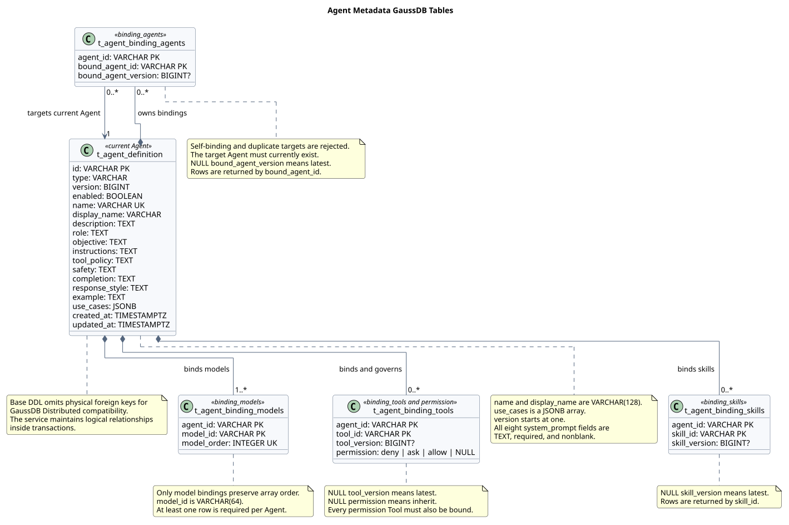

# Agent 元数据 GaussDB 表设计

> 文档编号：`SR-AGENT-DB-001`<br>
> 版本：`v0.15.0`<br>
> 日期：`2026-08-07`<br>
> 状态：目标设计 / Java Service 同步实现<br>
> 设计仓库分析基线：`4afb0e50b15365fec34b2e299e97c8fab7c25460`<br>
> Java 实现分析基线：`mate-service@737bccfbe825ad6db025e90f5577fdf172bf975b`<br>
> 输入 JSON 工作区 SHA-256：`b9aa4376e1b0859e698a69a487a2aca9c4bc73911d0f9fa5da89532229f6adf9`

## 1. 结论

基于当前 [`AGENT元数据设计.json`](../AGENT元数据设计.json)，Agent 当前元数据使用 5 张表：

1. `t_agent_definition`：标量字段、System Prompt 展开字段和 `use_cases`。
2. `t_agent_binding_models`：`binding_models[]`，保留数组顺序。
3. `t_agent_binding_tools`：合并 `binding_tools[]` 与 `permission`。
4. `t_agent_binding_skills`：`binding_skills[]`，按 Skill ID 稳定输出。
5. `t_agent_binding_agents`：`binding_agents[]`，按目标 Agent ID 稳定输出。

模型绑定全链路统一使用：元数据 `binding_models`、Java `bindingModels`、数据库 `t_agent_binding_models`、数据层 `AgentModelBindingDTO` / `AgentModelBindingMapper`。不保留 `model` 或 `models` 兼容别名。

System Prompt 的八个细分字段均为可空软约束。数据库不强制非空或非空白；响应只返回具有值的细分字段，管理前端按实际返回字段动态展示。

完整初始化 DDL 维护在 [`schema.sql`](./schema.sql)，本文不重复嵌入完整 SQL。

## 2. 来源证据与设计边界

### 2.1 输入元数据

- 基本字段、状态和名称：[`AGENT元数据设计.json` 第 2–10 行](../AGENT元数据设计.json#L2)。
- 模型绑定和 System Prompt：[`第 11–21 行`](../AGENT元数据设计.json#L11)。
- Use Cases、Tool、Skill、Agent 绑定及权限：[`第 22–53 行`](../AGENT元数据设计.json#L22)。

### 2.2 Java 基线

本次分析的 Java 提交为 `mate-service@737bccfbe825ad6db025e90f5577fdf172bf975b`，相关路径：

- `src/main/java/com/huawei/hicampus/mate/agentdefinition/service/AgentDefinitionService.java`
- `src/main/java/com/huawei/hicampus/mate/agentdefinition/service/impl/AgentDefinitionServiceImpl.java`
- `src/main/java/com/huawei/hicampus/mate/agentdefinition/validation/ResourceIdRules.java`
- `src/main/java/com/huawei/hicampus/mate/agentdefinition/vo/UpdateAgentRequestVO.java`
- `src/main/java/com/huawei/hicampus/mate/agentdefinition/vo/SystemPromptResponseVO.java`
- `src/main/java/com/huawei/hicampus/mate/agentdefinition/mapper/AgentDefinitionMapper.java`
- `src/main/resources/mapper/AgentDefinitionMapper.xml`
- `src/main/resources/application.yml`
- `src/main/resources/db/schema.sql`
- `src/test/java/com/huawei/hicampus/mate/agentdefinition/vo/AgentInfoJsonTest.java`

该基线只保留 `listAgents`、`getAgent`、`updateAgent` 三项 Service 能力，实现五表聚合、批量列表查询以及最后写入生效的模型替换。初始化、旧管理查询、旧运行时查询和乐观锁模型替换能力及其 Controller、VO、异常和 Mapper 语句均已删除。模型绑定顺序列和 DTO 属性使用 `model_order` / `modelOrder`；可变 Request VO 和 DTO 使用 Lombok `@Data`；Java 注释和 Javadoc 使用中文。

本文只保存当前 JSON 字段，不增加多租户、历史版本、审计、Outbox、Session 或 Memory 表。Agent 固定版本只存储和展示，不查询不存在的历史表。

## 3. 表关系



PlantUML：[查看源码](./diagram.puml#L6)

所有绑定表通过 `agent_id` 逻辑关联 `t_agent_definition.id`。表名统一使用小写 snake_case 和 `t_` 前缀。

## 4. 主表 `t_agent_definition`

| JSON 字段 | 数据库字段 | 类型 | 可空 | 规则 |
|---|---|---|---:|---|
| `id` | `id` | `VARCHAR(64)` | 否 | 主键；应用层格式为 `agent-` 加 32 位十六进制 UUID |
| `type` | `type` | `VARCHAR(16)` | 否 | 固定为 `agent` |
| `version` | `version` | `BIGINT` | 否 | 从 1 开始 |
| `enabled` | `enabled` | `BOOLEAN` | 否 | 默认启用 |
| `name` | `name` | `VARCHAR(128)` | 否 | 唯一；管理前端只读 |
| `display_name` | `display_name` | `VARCHAR(128)` | 否 | 管理前端只读 |
| `description` | `description` | `TEXT` | 否 | 管理前端只读 |
| `system_prompt.role` | `role` | `TEXT` | 是 | 可选；软约束 |
| `system_prompt.objective` | `objective` | `TEXT` | 是 | 可选；软约束 |
| `system_prompt.instructions` | `instructions` | `TEXT` | 是 | 可选；软约束 |
| `system_prompt.tool_policy` | `tool_policy` | `TEXT` | 是 | 可选；软约束 |
| `system_prompt.safety` | `safety` | `TEXT` | 是 | 可选；软约束 |
| `system_prompt.completion` | `completion` | `TEXT` | 是 | 可选；软约束 |
| `system_prompt.response_style` | `response_style` | `TEXT` | 是 | 可选；软约束 |
| `system_prompt.example` | `example` | `TEXT` | 是 | 可选；软约束 |
| `use_cases` | `use_cases` | `JSONB` | 否 | JSON 数组 |
| `created_at` | `created_at` | `TIMESTAMPTZ` | 否 | 创建时间 |
| `updated_at` | `updated_at` | `TIMESTAMPTZ` | 否 | 更新时间 |

### 4.1 Agent ID

资源 ID 统一采用类型前缀加 `SecureRandomUtils.generateUUID()` 返回的 32 位 UUID 字符串：Agent 使用 `agent-`，Model 使用 `model-`，Tool 使用 `tool-`，Skill 使用 `skill-`。例如：`agent-550e8400e29b41d4a716446655440000`。当前仓库没有 Create Agent 接口和 `SecureRandomUtils` 实现；未来落地创建接口时由各资源所属 Service 生成 ID，请求方不传入 ID。

Agent 路径参数、更新请求体和模型更新数组元素直接使用 Jakarta `@NotBlank` 与 `@Pattern`，正则引用 `ResourceIdRules` 中的公共常量，不定义只包装标准约束的自定义注解。Tool 和 Skill 没有写接口，Service 在列表及详情聚合时校验数据库中的 `toolId`、`skillId`，同时校验持久化的 Agent、Model 和绑定 Agent 标识；格式错误按数据损坏处理。只有资源主表在创建资源时产生 ID，各绑定表均引用既有 ID，不重新生成。数据库继续使用 `VARCHAR(64)`，不把当前长度固化为列长度，以保留生成算法演进空间。

### 4.2 System Prompt

八个 System Prompt 字段是可选的提示词组成部分：数据库使用可空 `TEXT`，不设置 `NOT NULL` 或非空白 `CHECK`。当前三个接口不写 System Prompt，因此不保留对应 Request VO；未来增加写入口时，不对这些字段增加 `@NotBlank`，管理界面可以提示建议填写，但不得阻止保存。本版仍不设置数据库或 Java 最大长度。

应用使用 Jackson `NON_NULL` 输出策略，值为 `NULL` 的细分字段不出现在响应 JSON 中，管理前端按实际返回字段动态展示。未来写入时建议把空白字符串规范化为 `NULL`，避免同时保存 `NULL`、空字符串和纯空白字符串；该规范化属于数据清理，不构成必填校验。

### 4.3 Use Cases

`use_cases` 使用 `JSONB NOT NULL DEFAULT '[]'::jsonb`，并约束 `jsonb_typeof(use_cases) = 'array'`。相较保留原始 JSON 文本，本场景更关注解析后的字符串数组，JSONB 更适合读取、校验以及后续操作符或索引扩展。

Service 聚合读取时校验每项为非空字符串且不可重复；当前没有确定数组数量和单项长度上限。

GaussDB JSON/JSONB 类型参考：[Huawei Cloud GaussDB JSON/JSONB Types](https://support.huaweicloud.com/intl/en-us/distributed-devg-v8-gaussdb/gaussdb-12-0327.html)。

## 5. 绑定表

### 5.1 模型绑定 `t_agent_binding_models`

| 字段 | 类型 | 规则 |
|---|---|---|
| `agent_id` | `VARCHAR(64)` | 逻辑关联主表 |
| `model_id` | `VARCHAR(64)` | 模型网关 ID；非空白 |
| `model_order` | `INTEGER` | 从 0 开始 |

主键为 `(agent_id, model_id)`，并对 `(agent_id, model_order)` 建唯一约束。模型绑定是唯一保存输入数组顺序的绑定；一个 Agent 至少需要一个模型，由 Service 在同一事务中保证。

模型 ID 必须符合 `^model-[0-9a-fA-F]{32}$` 且不可重复。当前没有模型网关目录查询接口，因此不校验模型是否存在。

### 5.2 Tool 绑定 `t_agent_binding_tools`

`binding_tools[]` 与 `permission.deny/ask/allow` 合并保存。主键为 `(agent_id, tool_id)`；`tool_version = NULL` 表示最新版本，`permission = NULL` 表示继承 Tool 权限。

同一 Tool 只能出现在一个权限数组，权限引用必须对应已绑定 Tool。输出按 `tool_id` 排序。

Tool ID 必须符合 `^tool-[0-9a-fA-F]{32}$`；当前三接口没有 Tool 写入请求，Service 在读取完整聚合时执行数据完整性校验。

### 5.3 Skill 绑定 `t_agent_binding_skills`

主键为 `(agent_id, skill_id)`。`skill_version = NULL` 表示最新版本；不保存顺序，输出按 `skill_id` 排序。

Skill ID 必须符合 `^skill-[0-9a-fA-F]{32}$`；当前三接口没有 Skill 写入请求，Service 在读取完整聚合时执行数据完整性校验。

### 5.4 Agent 绑定 `t_agent_binding_agents`

| 字段 | 类型 | 可空 | 规则 |
|---|---|---:|---|
| `agent_id` | `VARCHAR(64)` | 否 | 当前 Agent |
| `bound_agent_id` | `VARCHAR(64)` | 否 | 被绑定 Agent |
| `bound_agent_version` | `BIGINT` | 是 | 空表示最新；非空时大于等于 1 |

主键为 `(agent_id, bound_agent_id)`，禁止自绑定，并建立 `(bound_agent_id, agent_id)` 反向索引；固定版本不校验历史版本可用性。输出按 `bound_agent_id` 排序。

当前三接口不写入 Agent 绑定；读取时校验 `agent_id` 和 `bound_agent_id` 均符合 Agent ID 格式。未来增加写接口时，应在 Service 中继续校验目标 Agent 存在且不可重复绑定。

## 6. Service 与目标接口

Java Service 提供：

```text
listAgents(ListAgentRequestVO) -> ListAgentResultResponseVO
getAgent(String agentId) -> AgentInfoResponseVO
updateAgent(String agentId, UpdateAgentRequestVO) -> void
```

目标 Controller 契约：

```text
GET  /mate-service/v1/agents
GET  /mate-service/v1/agents/{agentId}
POST /mate-service/v1/agents/{agentId}
```

Controller 和 `resCode` / `resMsg` / `result` 统一包装由接入工程实现。Java 仓库不保留旧 Controller，Service 接口严格只有上述三个方法。

### 6.1 List Agents

请求参数：`pageIndex`、`pageSize`、`name`、`displayName`、`enabled`、`version`。

- `pageIndex` 从 1 开始，默认 1。
- `pageSize` 默认 20，最大 100。
- `name`、`displayName` 为大小写不敏感的字面包含查询。
- `enabled`、`version` 精确匹配。
- 主表按 `updated_at DESC, id ASC` 稳定分页。

Service 先查询总数和当前页主表，再按页内 Agent ID 分别批量读取四种绑定，避免逐 Agent 查询造成 N+1。

Service 结果：

```json
{
  "data": [],
  "total": 0,
  "pageIndex": 1
}
```

### 6.2 Get Agent

`AgentInfo` 展示完整 Agent 元数据，顶层使用 `agentId`，其余字段包括 `bindingModels`、`systemPrompt`、`useCases`、`bindingTools`、`bindingSkills`、`bindingAgents`、`permission` 和时间字段。新接口及嵌套对象固定使用 camelCase。

### 6.3 Update Agent

```json
{
  "agentId": "agent-550e8400e29b41d4a716446655440000",
  "bindingModels": [
    "model-550e8400e29b41d4a716446655440000",
    "model-550e8400e29b41d4a716446655440001"
  ]
}
```

路径与请求体 `agentId` 必须一致，并符合 `agent-` 加 32 位十六进制 UUID 的格式。`bindingModels` 必填、非空、元素不可重复，每个元素必须符合 `model-` 加 32 位十六进制 UUID 的格式。

更新采用最后写入生效：事务中锁定 Agent 当前行，删除旧模型绑定，按请求顺序插入新绑定，然后基于锁定行的当前版本将 `version` 递增一次。客户端不提交期望版本；即使模型列表未变化，成功请求仍递增一次版本。

稳定错误码为：`AGENT_INVALID_PARAMETER`、`AGENT_NOT_FOUND`、`AGENT_DATA_CORRUPTION`。

## 7. GaussDB 与事务

初始化 DDL 使用 `"{dbUser}"."t_xx"` Schema 限定名、行存兼容类型、主键、唯一约束、`CHECK` 和普通索引；COMMENT 使用简洁中文。每张表的 `DROP TABLE IF EXISTS` 必须紧邻并位于对应 `CREATE TABLE` 之前。脚本适用于初始化或重建，不作为生产增量迁移脚本。

GaussDB Distributed 不支持物理外键，因此基础 DDL 使用逻辑关系。当前 Service 在事务内锁定主表、替换模型绑定并递增版本；集中式部署确认支持外键后，可启用 DDL 末尾的可选外键块。

读取完整聚合与列表使用 `REPEATABLE_READ` 只读事务。不要用一个 Join 同时连接多个一对多绑定表，否则会产生笛卡尔行数放大。

## 8. 对象分层

- Request/Response VO：Service 或 Controller 边界对象，字段校验位于 Request VO。
- DTO：Mapper 与数据库交互对象。
- Service：负责 VO/DTO 转换、跨字段和跨表校验、事务与聚合。
- Mapper：只使用 DTO、标量条件和受影响行数。
- 不引入 PO、DO 或 Entity。
- 可变 Request VO 和 DTO 使用 Lombok `@Data`；只读 Response VO 使用 `@Getter` 和不可变字段。
- 必填资源标识使用公共正则常量配合 Jakarta `@NotBlank` 与 `@Pattern`，不增加只包装标准约束的组合注解。
- Java 注释和 Javadoc 使用中文；标识符、注解名、固定字面量和产品名按需保留英文。

Mapper 只保留三个接口可达的操作：主表查询、分页、行锁和版本递增；Model 绑定查询、删除和批量插入；Tool、Skill、Agent 绑定仅保留单个 Agent 查询和页内 Agent 集合批量查询。`AgentBindingMapper`、`AgentToolBindingMapper`、`AgentSkillBindingMapper` 不提供 `insertBatch`。

模型绑定类命名为 `AgentModelBindingDTO` 和 `AgentModelBindingMapper`，与 `AgentToolBindingDTO`、`AgentSkillBindingDTO` 风格一致。

## 9. 图表生成与验证

图源维护在 [`diagram.puml`](./diagram.puml#L6)，内容只使用英文和 ASCII：

```bash
cd agent-metadata-gaussdb-design
plantuml -tsvg diagram.puml
```

SVG 是生成物，不手工修改。

## 10. 版本历史

| 版本 | 日期 | 变更 |
|---|---|---|
| `v0.15.0` | 2026-08-07 | System Prompt 八个细分字段改为可空软约束；删除数据库非空和非空白硬约束；响应省略空字段并由管理前端动态展示 |
| `v0.14.0` | 2026-08-06 | Service 严格收敛为列表、详情、更新三个方法；删除旧 Controller、VO、异常和不可达 Mapper 语句；Model、Tool、Skill ID 增加前缀加 32 位 UUID 校验；Java 与 SQL 代码注释改为中文 |
| `v0.13.0` | 2026-08-06 | Agent ID 统一约束为 `agent-` 加 32 位十六进制 UUID；请求 VO、Controller 和 Service 使用 `@AgentId`；可变 Request VO 和 DTO 统一使用 `@Data` |
| `v0.12.2` | 2026-08-06 | 恢复逐表 `DROP TABLE IF EXISTS` 后立即 `CREATE TABLE` 的 DDL 结构，并增加自动化顺序检查 |
| `v0.12.1` | 2026-08-06 | 将模型绑定顺序列由 `sort_order` 更名为 `model_order`，DTO 属性同步更名为 `modelOrder`；排序语义和外部 JSON 保持不变 |
| `v0.12.0` | 2026-08-06 | 模型全链路统一为 `binding_models` / `bindingModels` / `t_agent_binding_models`；新增 Agent 绑定表；增加列表、详情和模型更新 Service 设计；System Prompt 增加非空白检查且不限制长度；DDL、Java 实现和图表同步 |
| `v0.11.0` | 2026-08-06 | 初始化 DDL 改为 `"{dbUser}"` Schema 限定和先删后建；COMMENT 统一为简洁中文；记录管理前端只允许修改模型配置 |
| `v0.10.0` | 2026-08-05 | 以输入元数据的 `system_prompt` 对象为准，恢复 8 个数据库展开列并全部设为 `TEXT NOT NULL`；前端固定展示全部字段；同步源 JSON、README、DDL 和图表 |
| `v0.9.0` | 2026-08-05 | 删除 README 中重复的 SQL 语句章节，`schema.sql` 作为唯一完整 DDL 来源 |
| `v0.8.0` | 2026-08-04 | 将八个 System Prompt 子列收敛为单一必填 `system TEXT`，后续版本已撤销 |
| `v0.7.0` | 2026-08-04 | 定义 System Prompt 必填、可空和前端展示规则；将 `resource_type` 更名为 `type` |
| `v0.6.0` | 2026-08-04 | 增加 SQL 语句章节，后续改由独立 `schema.sql` 维护 |
| `v0.5.0` | 2026-08-04 | 表名统一采用 `t_` 前缀和小写 snake_case |
| `v0.4.0` | 2026-07-29 | 增加 `enabled BOOLEAN NOT NULL DEFAULT TRUE` 及管理面、运行时语义 |
| `v0.3.0` | 2026-07-29 | 主表 ID 对齐元数据；统一 ID 长度；`use_cases` 改为 JSONB；合并 Tool 绑定与权限 |
| `v0.2.0` | 2026-07-29 | 按 Agent JSON 收敛关系表并增加 GaussDB DDL |
| `v0.1.0` | 2026-07-28 | 初版扩展设计 |
