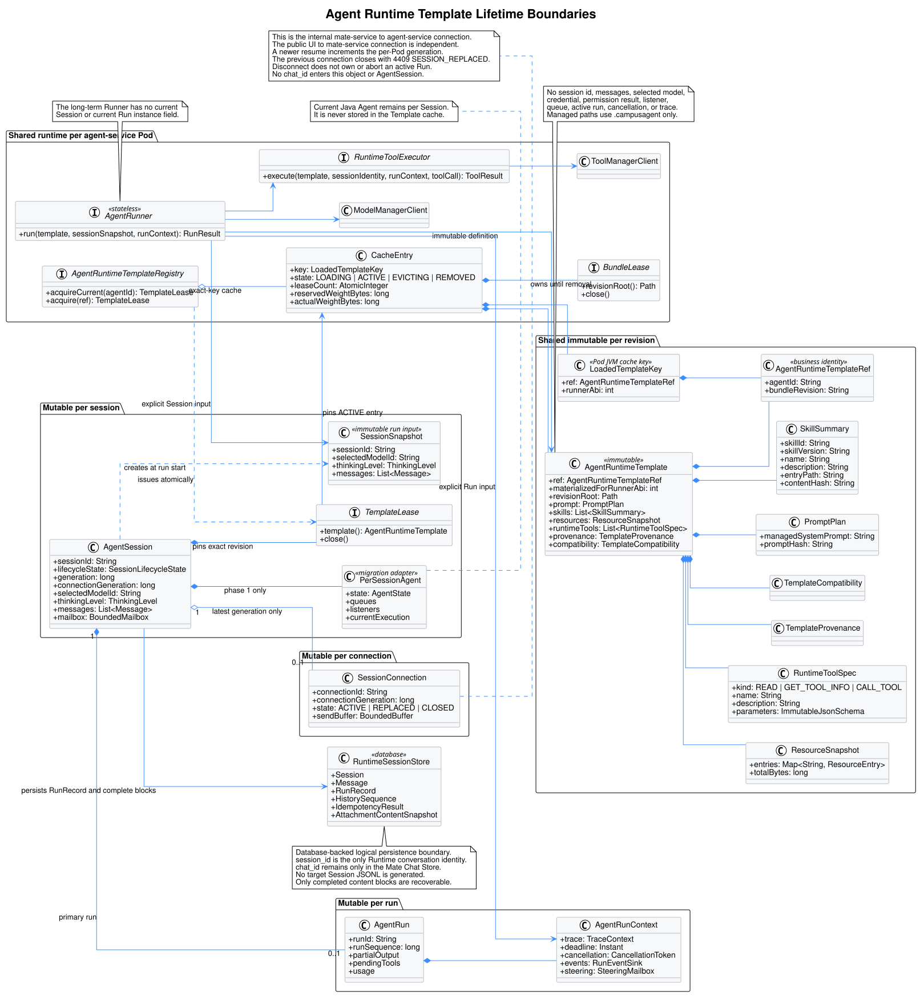
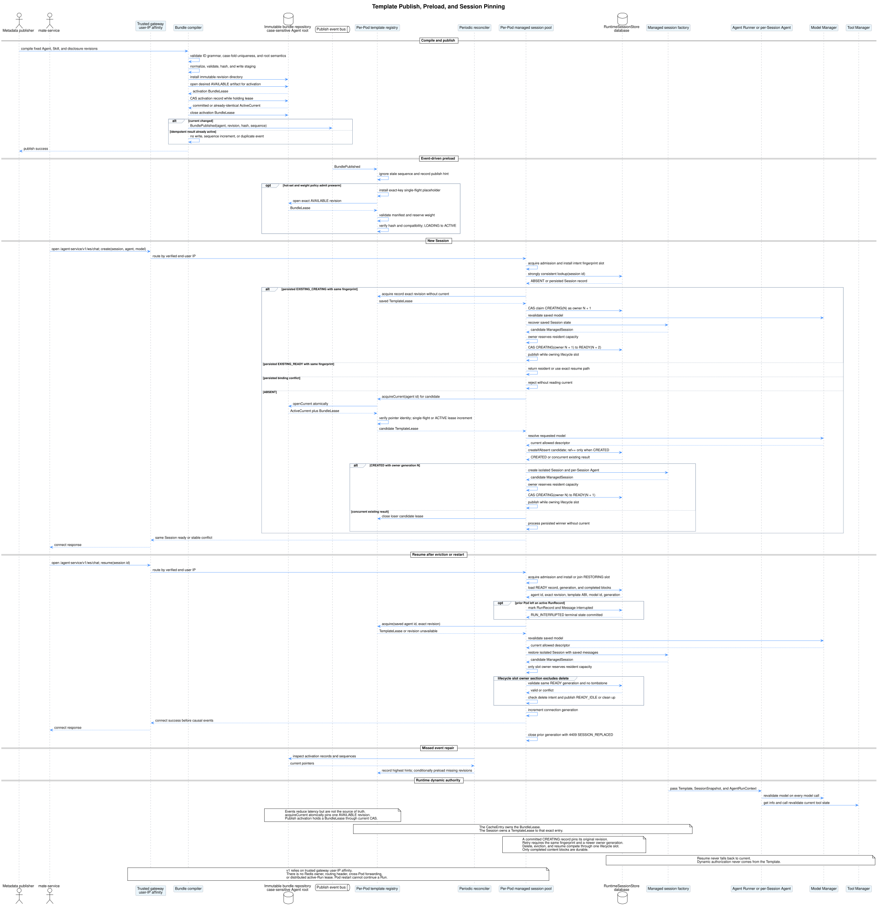
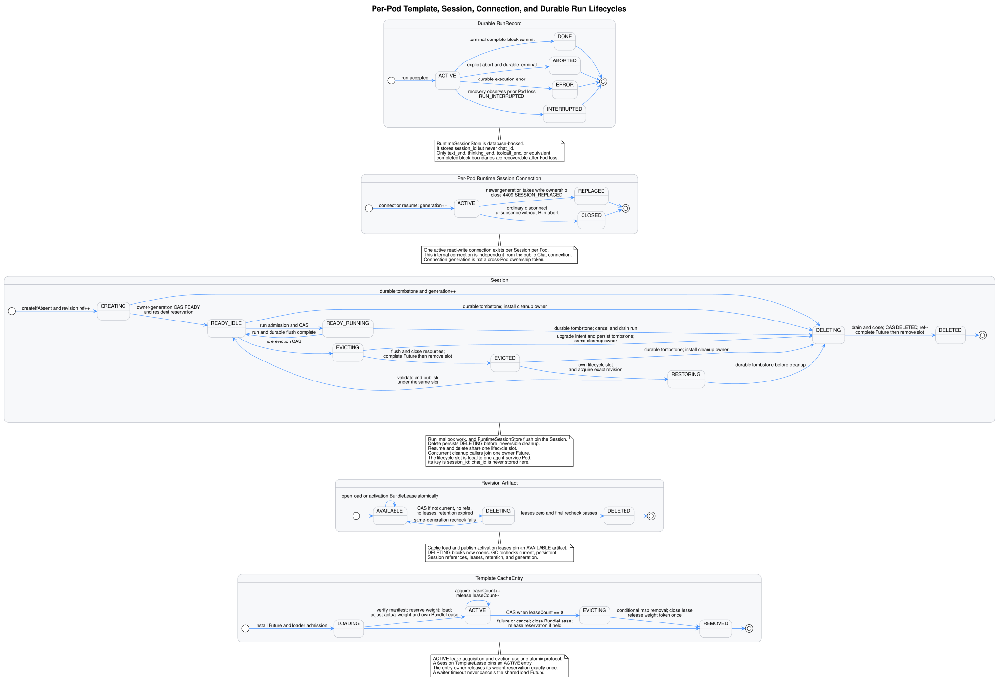

# CampusAgent Runtime：AgentRuntimeTemplate 不可变运行模板设计

| 属性 | 值 |
|---|---|
| 文档版本 | 1.2.0 |
| 状态 | 目标设计，尚未实施 |
| 更新日期 | 2026-08-03 |
| pi-mono 源码基线 | `f0deb8dd8e9611e89b5bc4145ca92c03ae6ed4ee` |
| pi-mono-java 源码基线 | `1f7a5423219edfa4519d8719f1cc8a188ed72873` |
| 关联设计 | [`pi-mono-java-manager-driven-multi-agent-runtime`](../pi-mono-java-manager-driven-multi-agent-runtime/README.md) |
| 关联设计分析基线 | `2b2aee5ad11867f53af7fc379426e5fec6fd1d17` |
| 规范性优先级 | 在 Template、revision/current、Session pinning、相关恢复/GC、Managed 元数据暴露和动态权威发生冲突时，以本文为关联设计的规范性增补 |
| 运行形态 | `agent-service` 多副本；每 Pod 单 JVM、多 Agent、多 Session；同 Session 单主 run 与单活动读写连接 |

## 1. 结论

CampusAgent Runtime 中的 `AgentRuntimeTemplate` 应定义为：

> 一个已发布 Agent bundle revision 的、不可变、可校验、可跨 Session 共享的
> 运行构造快照。

它预加载 Session 间重复的静态工作：解析 bundle manifest、加载并校验
`SYSTEM.md`、解析 Skill frontmatter、建立资源索引、构建 Managed Prompt、
准备 `read/get_tool_info/call_tool` 三个通用工具的模型协议定义。

它不是共享 `Agent`，也不是把 Session 状态放入缓存。每个 Session 仍独占：

```text
AgentSession + Session state + Agent compatibility adapter
```

每个 run 仍独占：

```text
AgentRun + cancellation + trace + partial output + pending tools
```

长期目标中的 `AgentRunner` 可以是 JVM 级无状态共享对象，但当前
pi-mono-java 的 `Agent` 不能直接充当该对象。当前 `Agent` 持有 messages、
streaming state、steering/follow-up queue、listeners、execution lock、当前
Future 和 cancellation signal；跨 Session 共享会造成历史串用、事件串线和
全局单飞。

核心原则是：

```text
share Agent definition, not Agent state
cache immutable templates, not stateful Agents
pin a Session to one bundle revision
revalidate dynamic authority on every relevant call
```

`RuntimeSessionStore` 以 `session_id` 作为 Runtime Session 隔离键，记录内的
Template pinning 引用固定为：

```text
(agent_id, bundle_revision)
```

Registry 的每 Pod 进程内 materialization cache key 为：

```text
(agent_id, bundle_revision, runner_abi)
```

`AGENT.version` 只作为来源版本和审计信息，不能单独充当模板版本。一个 Agent
依赖的 Skill、静态 Tool 摘要、Prompt profile 或编译规则发生变化时，即使
`AGENT.version` 没变，也必须产生新的 `bundle_revision`。

## 2. 范围与设计分类

本文定义：

- `AgentRuntimeTemplate` 的字段、不可变约束和排除项；
- bundle revision、manifest、不可变目录和 current pointer；
- compile、publish、load、acquire 和 release API；
- single-flight 预加载、容量限制、淘汰和物理制品回收；
- 发布事件、建 Session 校验和周期 reconciliation 三层变更感知；
- 新建、恢复 Session 时的 revision 固定规则；
- `RuntimeSessionStore` 的逻辑持久化边界、完整内容块提交与
  `interrupted` 恢复语义；
- `agent-service` 多副本下每 Pod Template/Session 所有权、单活动
  连接接管与可信网关用户 IP 粘性路由的限制；
- 与现有每 Session 独立 `Agent` 的迁移路径，以及与无状态
  `AgentRunner` 的长期关系。

本文不定义 WebSocket Frame、Tool Manager/Model Manager 的内部实现，也不
要求本阶段立即把当前 Java `Agent` 重构为无状态 Runner。

| 分类 | 本文内容 |
|---|---|
| 观察到的行为 | pi-mono 和 pi-mono-java 当前都把 Session、消息和 active run 状态放在有状态 Agent 周围 |
| 目标设计 | 新增不可变 `AgentRuntimeTemplate`、每 Pod Template Registry、revision 目录、数据库 Session pinning 和单连接接管 |
| 架构改造 | 从“每 Session 扫描并组装静态资源”改为“每 revision 加载一次、每 Session 绑定一次” |
| 安全加固 | 模板不保存凭据和权限结果；Model/Tool 动态状态在运行时重新校验 |
| 产品约束 | 同一 Session 同时最多一个主 run 和一条活动读写 WebSocket；不同 Session 可以并发 |
| 兼容要求 | Legacy CLI 可保留现有本地资源加载；Managed 路径采用模板 |

## 3. 源码基线与事实

### 3.1 pi-mono

源码仓库与分析基线：

```text
repository: /Users/z/pi-mono
commit:     f0deb8dd8e9611e89b5bc4145ca92c03ae6ed4ee
```

| 源码证据 | 观察到的行为 | 对模板设计的约束 |
|---|---|---|
| [`packages/agent/src/agent.ts#L171-L208`](https://github.com/badlogic/pi-mono/blob/f0deb8dd8e9611e89b5bc4145ca92c03ae6ed4ee/packages/agent/src/agent.ts#L171-L208) `Agent`、`ActiveRun`、`PendingMessageQueue` | `Agent` 保存 transcript、active run、两条队列和 listeners；并拒绝第二个并发 prompt | 不得把当前 `Agent` 放进跨 Session 模板 |
| [`packages/agent/src/types.ts#L327-L382`](https://github.com/badlogic/pi-mono/blob/f0deb8dd8e9611e89b5bc4145ca92c03ae6ed4ee/packages/agent/src/types.ts#L327-L382) `AgentState`、`AgentContext` | system prompt、model、tools、messages 与流状态位于同一状态对象；每次 loop 使用上下文快照 | 模板只提供静态 prompt/tool/resource 部分，messages 和 run state 必须留在 Session/Run |
| [`agent-session-services.ts#L134-L180`](https://github.com/badlogic/pi-mono/blob/f0deb8dd8e9611e89b5bc4145ca92c03ae6ed4ee/packages/coding-agent/src/core/agent-session-services.ts#L134-L180) `createAgentSessionServices()` | 每次默认创建或加载 ModelRuntime、SettingsManager、ResourceLoader，并执行 reload | 预加载应提升资源解析和 Prompt 构建，不以节省 `new Agent` 为主要收益 |
| [`sdk.ts#L169-L398`](https://github.com/badlogic/pi-mono/blob/f0deb8dd8e9611e89b5bc4145ca92c03ae6ed4ee/packages/coding-agent/src/core/sdk.ts#L169-L398) `createAgentSession()` | 先恢复 Session、解析模型和工具，再创建 `Agent` 与 `AgentSession` | Template 是 Session 构造输入，不是 Session 本身 |
| [`agent-session.ts#L303-L400`](https://github.com/badlogic/pi-mono/blob/f0deb8dd8e9611e89b5bc4145ca92c03ae6ed4ee/packages/coding-agent/src/core/agent-session.ts#L303-L400) constructor、[`_rebuildSystemPrompt()`](https://github.com/badlogic/pi-mono/blob/f0deb8dd8e9611e89b5bc4145ca92c03ae6ed4ee/packages/coding-agent/src/core/agent-session.ts#L1021-L1050)、[`_buildRuntime()`](https://github.com/badlogic/pi-mono/blob/f0deb8dd8e9611e89b5bc4145ca92c03ae6ed4ee/packages/coding-agent/src/core/agent-session.ts#L2548-L2600) | AgentSession 绑定 ResourceLoader/ExtensionRunner，构建 Tool registry 和 system prompt | Mutable ResourceLoader/ExtensionRuntime 不能原样跨 Session 共享；必须复制为不可变投影 |

### 3.2 pi-mono-java

源码仓库与分析基线：

```text
repository: /Users/z/pi-mono-java
commit:     1f7a5423219edfa4519d8719f1cc8a188ed72873
```

| 源码证据 | 观察到的行为 | 对模板设计的约束 |
|---|---|---|
| [`AgentSession.java#L114-L161`](https://github.com/superheromeZzh/pi-mono-java/blob/1f7a5423219edfa4519d8719f1cc8a188ed72873/modules/coding-agent-cli/src/main/java/com/campusclaw/codingagent/session/AgentSession.java#L114-L161) `initialize()` | 每个 Session 解析 Model、刷新 Tool、加载 Skill/context/template、构建 system prompt，再创建 Agent | 可把固定资源加载和 Prompt 构建前移到 Template Loader |
| [`Agent.java#L56-L76`](https://github.com/superheromeZzh/pi-mono-java/blob/1f7a5423219edfa4519d8719f1cc8a188ed72873/modules/agent-core/src/main/java/com/campusclaw/agent/Agent.java#L56-L76) fields、[`startExecution()`](https://github.com/superheromeZzh/pi-mono-java/blob/1f7a5423219edfa4519d8719f1cc8a188ed72873/modules/agent-core/src/main/java/com/campusclaw/agent/Agent.java#L218-L268) | `Agent` 持有 AgentState、queues、listeners、execution lock、current execution/signal；一个 Agent 同时只运行一次 | 当前 Agent 跨 Session 共享会把所有 Session 串行化并混用状态 |
| [`AgentState.java#L24-L36`](https://github.com/superheromeZzh/pi-mono-java/blob/1f7a5423219edfa4519d8719f1cc8a188ed72873/modules/agent-core/src/main/java/com/campusclaw/agent/state/AgentState.java#L24-L36) `AgentState` | 静态配置、messages、streaming、partial message、pending Tool 和 error 混在同一可变对象 | 不能把 AgentState 放入 Template；模板字段必须重新分类 |
| [`AgentLoop.java#L65-L80`](https://github.com/superheromeZzh/pi-mono-java/blob/1f7a5423219edfa4519d8719f1cc8a188ed72873/modules/agent-core/src/main/java/com/campusclaw/agent/loop/AgentLoop.java#L65-L80) constructor、[`invokeModel()`](https://github.com/superheromeZzh/pi-mono-java/blob/1f7a5423219edfa4519d8719f1cc8a188ed72873/modules/agent-core/src/main/java/com/campusclaw/agent/loop/AgentLoop.java#L209-L219) | 每次 execution 新建 AgentLoop；每轮用 system prompt、messages 和 tools 构造 Context | `AgentRun` 可以持有 loop 局部状态，Template 只供应静态输入 |
| [`ReadTool.java#L45-L64`](https://github.com/superheromeZzh/pi-mono-java/blob/1f7a5423219edfa4519d8719f1cc8a188ed72873/modules/coding-agent-cli/src/main/java/com/campusclaw/codingagent/tool/read/ReadTool.java#L45-L64) constructor、`cwd` | 当前 read Tool 实例捕获一个 cwd | Template 只缓存 Tool spec；Managed 路径必须把 read 绑定到 Session 固定的 revision root |
| [`SessionPool.java#L186-L201`](https://github.com/superheromeZzh/pi-mono-java/blob/1f7a5423219edfa4519d8719f1cc8a188ed72873/modules/coding-agent-cli/src/main/java/com/campusclaw/codingagent/mode/server/SessionPool.java#L186-L201) `getOrCreate()` | Session 冷创建同步执行完整恢复和初始化；相同 ID 使用 check-then-create | Template Registry 和 SessionPool 分别需要 exact-key single-flight |
| [`ContextFileLoader.java#L84-L103`](https://github.com/superheromeZzh/pi-mono-java/blob/1f7a5423219edfa4519d8719f1cc8a188ed72873/modules/coding-agent-cli/src/main/java/com/campusclaw/codingagent/context/ContextFileLoader.java#L84-L103) `loadSystemPrompt()` | 当前实现优先读取 `<cwd>/.campusclaw/SYSTEM.md` | `.campusclaw` 是 Legacy/源码现状；Managed Loader 的 `.campusagent` 是目标架构改造 |
| [`AgentSession.java#L545-L560`](https://github.com/superheromeZzh/pi-mono-java/blob/1f7a5423219edfa4519d8719f1cc8a188ed72873/modules/coding-agent-cli/src/main/java/com/campusclaw/codingagent/session/AgentSession.java#L545-L560) `loadSkills()` | 当前从 `<cwd>/.campusclaw/skills` 加载项目 Skill | Managed Loader 只索引 revision 中的 `.campusagent/skills`，不设计双读或回退 |

### 3.3 与关联设计的关系

关联设计已经规定 Managed 模式只有三个通用工具、Model Manager 和 Tool
Manager 保持运行时权威、运行中的 Session 保持创建时快照。本文补齐该设计中
尚未显式定义的模板层。

关联设计当前“原子替换 `<agent-id>` 目录”与“运行 Session 保持创建时快照”
不能同时成立：旧 Session 后续调用 `read` 时会读到替换后的 Skill 文件。本文
把目录改为不可变 revision，加一个原子 current pointer。这是架构改造，不是
当前 pi 或 Java 已有行为。

仓库中的早期 [`ManagedAgentInstance` 方案](../managed-agent-session/README.md)
把 `resolvedModels/resolvedTools/resolvedSkills` 放入一个按 `agentVersion` 标识的
构造对象。本文不把两者视为同一合约：当前 Manager-driven 方案只向模型注册
三个通用工具，业务 Tool Schema/permission 和 Model 状态保持动态权威；同时
Template 必须固定完整 bundle 闭包和资源 revision。因此后续实现
`AgentRuntimeTemplate` 时，以本文的 `bundle_revision + resource snapshot +
generic tool spec` 边界为准。这属于对早期目标方案的架构演进。

本版与 CampusAgent Manager-driven 运行设计、WebSocket v2 规范和
客户端指南按以下边界同步：

| 关联文件/符号 | 统一后的规范性结论 |
|---|---|
| `pi-mono-java-manager-driven-multi-agent-runtime/README.md` 的 revision/cwd 恢复 | 不可变 `revisions/<revision>`、原子 current activation record、`.campusagent` 逻辑路径和 exact revision pinning |
| `pi-mono-java-manager-driven-multi-agent-runtime/chat-ws-v2.asyncapi.yaml` 的 methods | Template v1 不对 Managed Client 暴露 `prompt_templates.list` 或 `skills.list`；Skill 展示由 `mate-service`/元数据 REST 承载 |
| `pi-mono-java-manager-driven-multi-agent-runtime/chat-ws-v2-client-integration.md` 的恢复 | `mate-service` 通过 `agent-service` WebSocket 接管单活动连接；跨 Pod active run 不在 v1 承诺内 |

## 4. 生命周期边界



[PlantUML 源码](diagram.puml#L1)

五个核心对象的生命周期如下：

| 对象 | 数量与生命周期 | 可变性 | 主要内容 |
|---|---|---|---|
| `AgentRuntimeTemplate` | 每 Pod 对 `(agent_id, bundle_revision, runner_abi)` loaded materialization 一份，可被该 Pod 内多个固定同 revision 的 Session 引用 | 深度不可变 | Prompt、Skill 摘要、资源索引、三个通用 Tool spec、来源与兼容信息 |
| `AgentRunner` | 每 `agent-service` Pod 少量常驻实例 | 无会话状态 | 模型调用、Tool 分发、Context 转换等执行算法和共享 Manager client |
| `AgentSession` | 每 Pod 对 resident `session_id` 一份，持久化投影位于数据库 | 可变、单写者 | template lease、模型选择、thinking、messages、持久化游标、mailbox、active run 引用 |
| `AgentRun` | 每 `run_id` 一份，仅由当前 Pod 内 Session 持有 | 可变、仅属于一个 Session | trace、deadline、cancel、partial output、pending tools、usage、run sequence |
| `SessionConnection` | 每 Pod 对 `session_id` 最多一条活动读写连接 | 可变、按 `connection_generation` fencing | Frame 订阅、背压缓冲和连接关闭；不拥有 Session 或 run |

该拆分是逻辑职责，不要求第一阶段立即删除 Java `Agent`。迁移阶段可以保持：

```text
AgentSession -> per-session Agent -> per-run AgentLoop
```

但 `Agent` 的静态构造输入来自 `AgentRuntimeTemplate`，不再逐 Session 扫描资源。
完成状态外置后，才替换为：

```text
AgentSession -> AgentRun
AgentRunner.run(template, sessionSnapshot, runContext)
```

两个阶段复用同一个 Template 合约。

### 4.1 多副本、连接与持久化边界

CampusAgent Runtime 以 `agent-service` 多副本部署，但 Template
Registry、SessionPool、active run 和 `connection_generation` 都是每 Pod 进程内
状态。`mate-service` 等获授权服务端调用方通过规范地址
`wss://api.example.com/agent-service/v1/ws/chat` 连接；浏览器到
`mate-service` 的协议不在本文定义。v1 依赖可信网关使用已验证的
最终用户 IP 做粘性路由，使
`mate-service` 对同一 Session 的连接尽量回到同一 Pod。不使用
Redis owner、Session 路由 Header、Pod 间转发或分布式 active-run lease。

这是有意识的 v1 产品约束，不是强一致路由协议：如果网关只看到
`mate-service`/NAT IP、最终用户 IP 变化或 Pod 重启，同一 active run
不能无缝跨 Pod 继续。数据库的唯一约束和 CAS 保护持久化记录，但不
构成分布式 Session owner。

`RuntimeSessionStore` 是 Session 持久化的唯一逻辑边界，使用数据库
保存 Session、Message、RunRecord、history sequence、幂等结果、
Agent/Model/bundle revision 和 attachment claim。目标设计不生成
Session JSONL；物理表结构不在本文定义。

同一 Pod 内，新的 `resume` 在 Session lifecycle slot 上原子增加
`connection_generation`，先取得新连接的读写权，再用私有关闭语义
`4409 SESSION_REPLACED` 关闭旧连接。普通断线只解除订阅，不终止该 Pod 内
active run。

Pod 重启后，新进程从 `RuntimeSessionStore` 按 exact bundle revision
重建 AgentSession 和每 Session Agent。恢复方一旦发现前一个 Pod 留下的
active RunRecord，必须把 RunRecord 及相关 Message 稳定标记为
`interrupted`。Runtime 只在 `text_end`、`thinking_end`、`toolcall_end`
等完整内容块边界持久化；未到完整块边界的尾部不承诺保存。

## 5. AgentRuntimeTemplate 数据合约

### 5.1 Java 合约模板

以下是规范性概念接口。包名和具体不可变 JSON 类型可在实现阶段调整，但字段
边界和生命周期不得改变。

```java
public record AgentRuntimeTemplateRef(
        String agentId,
        String bundleRevision) {}

record LoadedTemplateKey(
        AgentRuntimeTemplateRef template,
        int runnerAbi) {}

public record AgentRuntimeTemplate(
        AgentRuntimeTemplateRef ref,
        int materializedForRunnerAbi,
        TemplateCompatibility compatibility,
        TemplateProvenance provenance,
        Path revisionRoot,
        PromptPlan prompt,
        List<SkillSummary> skills,
        ResourceSnapshot resources,
        List<RuntimeToolSpec> runtimeTools) {}

public record TemplateCompatibility(
        int templateAbi,
        int bundleSchemaVersion,
        int promptProfileVersion,
        int toolProtocolVersion,
        int minimumRunnerAbi,
        int maximumRunnerAbi) {}

public record TemplateProvenance(
        String agentVersion,
        String contentHash,
        String sourceLockHash,
        String compilerVersion) {}

public record PromptPlan(
        String managedSystemPrompt,
        String promptHash) {}

public record SkillSummary(
        String skillId,
        String skillVersion,
        String name,
        String description,
        String entryPath,
        String contentHash) {}

public record ResourceSnapshot(
        Map<String, ResourceEntry> entries,
        long totalBytes) {}

public record ResourceEntry(
        String logicalPath,
        String contentHash,
        long sizeBytes,
        String mediaType,
        ResourceKind kind) {}

public record RuntimeToolSpec(
        RuntimeToolKind kind,
        String name,
        String description,
        ImmutableJsonSchema parameters) {}

public enum RuntimeToolKind {
    READ,
    GET_TOOL_INFO,
    CALL_TOOL
}
```

CampusAgent 资源标识采用独立、封闭的目标契约：`agent_id` 必须匹配
`^agent_[0-9A-Za-z]{24}$`，`model_id` 必须匹配
`^model_[0-9A-Za-z]{24}$`，二者总长度均为 30。它们大小写敏感且不可解析；
调用方、Template Registry 和缓存键必须按原始字节比较，不得转小写、截取后缀
或推断创建时间。`agent_id` 由 Agent 元数据服务签发，`model_id` 由 CampusModel
`model-service` 签发；`AgentRuntimeTemplate` 只保存前者，Session 保存的
`model_id` 仍由 Model Manager 映射到实际 Provider model ID 并在
create/resume/invoke 时重新校验。
由于 `<agent-id>` 是物理目录名，Repository 的编译与运行根目录必须位于
大小写敏感文件系统，启动和发布前验证失败即 fail closed。Agent 管理面和
Repository 还必须拒绝 ASCII lowercase collision key 相同的两个 ID；该 key
只用于碰撞检测，不参与查找或回写。打开制品后，目录项、current、manifest
和 `ref.agentId()` 必须按原始 ASCII 字节完全一致。

Java `record` 只提供浅层不可变。实现必须在 canonical constructor 中执行：

- 校验 `ref.agentId()` 精确匹配 `^agent_[0-9A-Za-z]{24}$`，且不做大小写归一化；
- `List.copyOf()` 和 `Map.copyOf()`；
- 对嵌套值做 defensive copy；
- 使用真正不可变的 JSON Schema 表示，不能直接暴露可修改的 Jackson
  `JsonNode`；
- 规范化并校验 `revisionRoot`，确认它是大小写敏感文件系统上对应 revision
  的只读目录，且 manifest `agent.id` 与 `ref.agentId()` 字节完全一致；
- 校验 Tool name 恰好是 `read/get_tool_info/call_tool` 且不重复；
- 校验 Skill name、entry path 和资源索引一一对应；
- 校验所有文件 hash、Prompt hash 和 manifest 的 `content_hash`。

这里的 `AgentRuntimeTemplate` 是每个 `agent-service` Pod/JVM 中的
loaded object，不是跨节点直接序列化
的制品；bundle 文件和 manifest 才是可移植制品。Managed Prompt 只能披露稳定
逻辑路径或 bundle-relative path，例如
`.campusagent/skills/refund/SKILL.md`，不得注入节点绝对 revision path。`read`
wrapper 在服务端把逻辑路径映射到 `revisionRoot`。因此同一 revision 在不同节点
具有相同 `managedSystemPrompt/promptHash`，Session 漂移或恢复不会改变 Prompt
字节。Managed `AgentRuntimeTemplateLoader` 只读取 `.campusagent`，不回退
或双读 `.campusclaw`。Legacy CLI 仍按当前源码保留 `.campusclaw` 和物理
cwd 语义；本版不定义目录迁移。

### 5.2 模板应包含什么

| 字段类别 | 内容 | 原因 |
|---|---|---|
| 身份 | `agent_id + bundle_revision`，以及仅供本 JVM materialization 的 Runner ABI | Session pinning 与进程内兼容缓存职责分离 |
| 来源 | Agent/Skill/Tool 静态来源锁、compiler/profile 版本、content hash | 审计、校验和精确恢复 |
| 资源根 | 指向不可变 revision 的 canonical `revisionRoot` | 保证旧 Session 的 read 不会漂移到新版本 |
| Prompt | 已构建 Managed system prompt 和 hash | 消除每 Session 重复拼装 |
| Skill 索引 | 固定 id/version/name/description/entry path/hash | 初始摘要预加载，正文继续渐进读取 |
| 资源索引 | allowlisted path、hash、size、media type | read 快速定位并防路径越界 |
| 通用 Tool spec | 三个工具的 name/description/schema/kind | 模型协议固定，执行上下文稍后绑定 |
| 兼容信息 | bundle schema、Prompt profile、Tool protocol、Runner ABI 区间 | 防止新 Runner 错读旧模板或反之 |

缓存权重不属于 Template 内容合约。Registry 的 CacheEntry 单独保存
`reservedWeightBytes/actualWeightBytes`；惰性 resource body 的重量由独立 Resource
cache 统计，不能回写不可变 Template。

### 5.3 模板绝不能包含什么

| 排除项 | 所属生命周期 | 原因 |
|---|---|---|
| `session_id`、业务 user/tenant、service principal | Session/调用 | 模板会被多个 Session 共享 |
| messages、branch、compaction、`RuntimeSessionStore` record/transaction/cursor | Session | 对话状态必须隔离且单写 |
| 当前 `model_id`、thinking level、ModelDescriptor | Session/调用 | 模型状态由 Model Manager 在建 Session、恢复和调用时校验 |
| Agent、AgentState、listeners、steering/follow-up queue | Session | 当前实现均为可变且与对话绑定 |
| run id、Future、CancellationToken、trace、deadline | Run | 每次执行独立，不能跨请求复用 |
| partial message、pending ToolCall、error、usage | Run | 属于恢复和事件状态 |
| Connection、WebSocket、subscription、send buffer | Connection | 连接断开不应改变模板或 run 所有权 |
| Manager client credential、API key、base URL、header | Runner/调用 | 凭据会轮换，且不能进入 Agent 数据 |
| Tool 当前 Schema、status、permission、approval result | 调用 | Tool Manager 是实时权威；缓存结果不能授予权限 |
| 捕获 SessionContext 的 `AgentTool.execute()` closure | Session | 会把 agent/session/trace/授权上下文串到其他 Session |
| 指向 `current` 的可变 cwd 或 symlink | 发布别名 | 发布后路径目标会变化，破坏 Session pinning |

### 5.4 通用 Tool 的绑定方式

Template 保存 `RuntimeToolSpec`，不保存已经绑定执行闭包的 `AgentTool`。规范性
执行接口显式接收 Session 和 Run 上下文：

```java
public interface RuntimeToolExecutor {
    CompletionStage<ToolResult> execute(
            AgentRuntimeTemplate template,
            ImmutableSessionIdentity sessionIdentity,
            AgentRunContext runContext,
            ToolCall toolCall);
}
```

执行器的职责是：

- `read` 固定读取 `template.revisionRoot` 下、`resources` 索引允许的文件；
- `get_tool_info` 在每次调用时注入不可变 `agent_id/session_id` 和显式传入的
  `run_id/trace/deadline/cancel`，向 Tool Manager 获取当前 descriptor；
- `call_tool` 在每次调用时注入同样上下文，并由 Tool Manager 重新执行绑定、
  status、Schema 和权限校验。

当前 `AgentTool.execute()` 尚无 `AgentRunContext` 参数时，可以增加一个仅供迁移
的 per-session adapter。adapter 在每次 execute 开始时从 Session actor 原子
capture 一份不可变 RunContext；旧 run 的全部 Tool Future 终止前，不得安装下一
run。不得使用进程级 ThreadLocal，也不得把 adapter/provider 保存进 Template。
目标实现应修改核心接口或由 Runner 直接调用上述显式执行器。

长期无状态 Runner 阶段可不再创建 Session-bound Tool 对象，而是用
`RuntimeToolKind + SessionSnapshot + AgentRunContext` 显式分发。Template 合约
不需要改变。

### 5.5 预加载深度

预加载不等于把所有 Skill 正文永久放进 Java heap。推荐三层：

| 层级 | 内容 | 时机 |
|---|---|---|
| eager template | manifest、SYSTEM、Skill frontmatter/摘要、资源索引、Prompt、三个 Tool spec | publish 预热或第一次 acquire |
| immutable resource cache | Skill 正文、`references/tools.json` 等字节，按 content hash 和 weight 缓存 | 首次 read，之后跨 Session 复用 |
| live manager data | Model 可用性、Tool Schema/status/permission、凭据 | 每次相应运行调用 |

这样既减少冷 Session 的目录扫描和 Prompt 构建，也避免 Agent 数量乘以全部 Skill
正文大小。

### 5.6 Managed 元数据展示与运行策略

当前 bundle 输入只有 Agent、Skill 和 Tool 元数据，没有 Prompt Template
元数据或受控制品，因此 Template v1 不加载 Java 本地
`prompts/*.md`。Managed WebSocket 不披露 `prompt_templates.list` 或
`skills.list`；Skill 展示信息由 `mate-service`/元数据 REST 提供，
`/skill:name` 仍是 AgentSession 对 `chat.send.message` 的执行时展开语义。

如果产品后续增加 Prompt Template 元数据，应把固定版本摘要、entry path 和文件
hash 纳入 manifest、ResourceSnapshot 和新 bundle revision，并在后续
协议版本另行定义 method；当前版本不保留或宣告该 method。
Session thinking level、Thinking 披露 feature、调用服务授权和动态有效限额仍属于
Session/Connection/Run，不进入 Template。Template 只允许保存有明确发布来源的
声明性静态上限，且该上限不能替代运行时授权。

## 6. Bundle revision 与不可变目录

### 6.1 目录布局

目标物理布局为：

```text
<agent-runtime-root>/
└── <agent-id>/
    ├── current.json
    └── revisions/
        └── <bundle-revision>/
            ├── manifest.json
            └── .campusagent/
                ├── SYSTEM.md
                └── skills/
                    └── <skill-name>/
                        ├── SKILL.md
                        └── references/
                            └── tools.json
```

规则：

1. `revisions/<bundle-revision>` 一旦发布，内容永不原地修改；
   同一 `agent_id + bundle_revision` 重复安装仅在 manifest 和 content hash 完全相同
   时幂等成功，否则返回完整性冲突；
2. `current.json` 是可变激活记录，保存 status、revision、content hash、template
   ABI、单调 publish sequence、activated time 和 CAS etag；
3. 发布先完整安装 revision，再对目标 artifact 原子取得 activation `BundleLease`；
   只有 AVAILABLE 能取得，lease 必须持有到 expected generation/etag 的 current CAS
   提交或失败，DELETING/DELETED 一律拒绝激活。本地原子 rename 只保证读者看不到
   半文件，多 Publisher 场景还必须使用进程锁、数据库事务或对象存储 conditional
   put 实现真正 CAS；
4. `withdraw` 不删除 current，而是写入带更高 sequence 的 `WITHDRAWN` tombstone
   并发送事件，防止旧事件或旧 Publisher 复活 Agent；
5. Template Loader 通过 Repository `openCurrent` 同时固定 pointer 和 canonical
   revision lease，运行中不再解引用 current；
6. 不使用可被替换目标的 symlink 作为 Session cwd；
7. Repository 启动和发布时验证根目录大小写敏感，并拒绝 ASCII lowercase
   collision key 相同的 Agent；
8. 运行账号对 revision 目录只读，发布账号与运行账号分权。

current 激活记录示例：

```json
{
  "agent_id": "agent_011CZkYqphY8vELVzwCUpqiQ",
  "status": "ACTIVE",
  "bundle_revision": "01K1RUNTIME7MPLATE0000000000",
  "content_hash": "sha256:...",
  "template_abi": 1,
  "publish_sequence": 42,
  "activated_at": "2026-08-03T10:00:00Z",
  "etag": "opaque-cas-token"
}
```

current 中的 `content_hash/template_abi` 是为 CAS、事件路由和快速拒绝而复制的
不可变校验字段，不是第二份 Template 内容权威。bundle manifest 和实际 files 才是
物化权威；`openCurrent`/Registry 必须校验 pointer 的 `agent_id`、
`bundle_revision`、`content_hash`、`template_abi` 与已打开 manifest 完全一致。
任一不一致都返回
`TEMPLATE_INTEGRITY_FAILED`，不得进入 cache、发放 lease 或把 pointer 值写入
Session record。Session record 的 schema/ABI/provenance 只能从校验成功的 Template
复制。

### 6.2 Manifest

manifest 至少包含：

```json
{
  "bundle_schema_version": 1,
  "template_abi": 1,
  "runner_abi_compatibility": {
    "minimum": 1,
    "maximum": 2
  },
  "prompt_profile_version": 1,
  "tool_protocol_version": 1,
  "agent": {
    "id": "agent_011CZkYqphY8vELVzwCUpqiQ",
    "version": "12"
  },
  "bundle_revision": "01K1RUNTIME7MPLATE0000000000",
  "content_hash": "sha256:...",
  "source_lock_hash": "sha256:...",
  "compiler_version": "runtime-bundle-1.0.0",
  "dependencies": {
    "skills": [
      {"id": "refund", "version": "3", "content_hash": "sha256:..."}
    ],
    "tool_disclosures": [
      {"id": "order-query", "version": "7", "content_hash": "sha256:..."}
    ]
  },
  "files": [
    {
      "path": ".campusagent/SYSTEM.md",
      "size": 1420,
      "content_hash": "sha256:..."
    }
  ]
}
```

`bundle_revision` 是不可变发布 ID；`content_hash` 校验规范化内容 manifest 和
全部文件内容。计算 hash 时必须排除 `bundle_revision` 和 `content_hash` 以避免
循环依赖；`publish_sequence/activated_at/etag/status` 根本不属于 revision
manifest，而属于 current 激活记录。允许平台使用内容寻址 revision，但 Runtime
不能假设 revision 本身一定是 hash。

manifest 的 `template_abi`、`bundle_schema_version`、`prompt_profile_version`、
`tool_protocol_version`、`runner_abi_compatibility` 必须逐项映射到
`TemplateCompatibility`；Loader 接收的当前 JVM Runner ABI 只有落在闭区间
`[minimum, maximum]` 时才能物化该 revision。

revision 输入必须覆盖：

- 固定 Agent 元数据版本；
- 完整 Skill 依赖锁和每个制品 hash；
- 写入 SYSTEM/Skill 资源的 Tool 静态摘要版本；
- 所有生成文件的逻辑路径和 bytes hash；
- bundle schema、Template ABI、Runner 兼容区间、Prompt profile、Tool protocol 和
  compiler 版本。

以下内容不得进入 revision：

- publish time 和文件 mtime；
- Manager 凭据；
- Tool 当前 status、实时 permission 结果或审批结果；
- Model 当前健康状态和路由；
- Session、Run 或连接字段。

## 7. Compile、Publish、Load 与 Registry API

### 7.1 接口

```java
public interface AgentBundleCompiler {
    CompletionStage<CompiledAgentBundle> compile(
            CompileAgentBundleCommand command);
}

public interface AgentBundlePublisher {
    ActiveCurrent publish(
            CompiledAgentBundle bundle,
            ExpectedCurrent expectedCurrent);

    WithdrawnCurrent withdraw(
            String agentId,
            ExpectExact expectedCurrent);
}

public sealed interface ExpectedCurrent
        permits ExpectAbsent, ExpectExact {}

public record ExpectAbsent() implements ExpectedCurrent {}

public record ExpectExact(
        CurrentPointer current) implements ExpectedCurrent {}

public interface AgentBundleRepository {
    CompletionStage<CurrentBundleLease> openCurrent(
            String agentId);

    CompletionStage<BundleLease> open(
            String agentId,
            String bundleRevision);

    CompletionStage<Optional<CurrentPointer>> inspectCurrent(
            String agentId);
}

public interface BundleLease extends AutoCloseable {
    ImmutableBundleManifest manifest();
    Path revisionRoot();
    InputStream open(String logicalPath);
    @Override void close();
}

public sealed interface CurrentPointer
        permits ActiveCurrent, WithdrawnCurrent {
    String agentId();
    long publishSequence();
    Instant activatedAt();
    String etag();
}

public record ActiveCurrent(
        String agentId,
        String bundleRevision,
        String contentHash,
        int templateAbi,
        long publishSequence,
        Instant activatedAt,
        String etag) implements CurrentPointer {}

public record WithdrawnCurrent(
        String agentId,
        long publishSequence,
        Instant activatedAt,
        String etag) implements CurrentPointer {}

public record CurrentBundleLease(
        ActiveCurrent current,
        BundleLease bundle) implements AutoCloseable {
    @Override public void close() {
        bundle.close();
    }
}

public interface AgentRuntimeTemplateLoader {
    AgentRuntimeTemplate load(
            BundleLease bundle,
            int currentRunnerAbi);
}

public interface AgentRuntimeTemplateRegistry {
    CompletionStage<TemplateLease> acquireCurrent(String agentId);

    CompletionStage<TemplateLease> acquire(
            AgentRuntimeTemplateRef ref);
}

public interface TemplateLease extends AutoCloseable {
    AgentRuntimeTemplate template();
    @Override void close();
}
```

`compile()` 只在发布链路执行，不得在 WebSocket/Reactor 请求线程上现场编译。
它解析固定版本、规范化内容、验证路径和闭包、计算 hash，并写 staging。

`ExpectAbsent` 只表示“期望该 Agent 尚无任何 ACTIVE/WITHDRAWN 激活记录”的
compare-and-create，绝不表示 unconditional write；一旦记录存在，发布和 withdraw
都必须传 `ExpectExact`。

`publish()` 幂等安装不可变 revision 后，必须先对目标 artifact 原子取得 activation
`BundleLease`，验证 manifest/hash/ABI 且状态为 AVAILABLE，并持有到 current CAS
完成。GC 的 `AVAILABLE -> DELETING` 与该 lease acquire 使用同一原子状态协议：GC
先赢则 publish 明确失败，publish 先赢则 GC 不能进入 DELETING；CAS 成功并释放
lease 后，后续 GC 会观察到该 revision 已是 current。

current 更新使用 `expectedCurrent` 的完整 CAS token（至少含不可伪造
`etag/generation` 和 `publishSequence`）。Repository 在成功 CAS 中原子分配单调
递增的新 sequence，再发送携带该已提交 sequence 的发布事件。只比较 revision 会在
`A -> B -> A` 回滚后产生 ABA，禁止这样实现。

为覆盖“提交成功但响应丢失”，CAS 发现 expected token 已失效时必须先比较当前结果：
若当前 ACTIVE 的 `agent_id/bundle_revision/content_hash/template_abi` 已与本次目标完全
相同，返回现有 `ActiveCurrent`，不写 current、不增加 sequence、不重复发送事件；
否则返回冲突。`ExpectAbsent` 重试也只允许这个无写入的同结果成功，不能覆盖其他
ACTIVE/WITHDRAWN。`withdraw()` 同理：当前已经是本次目标 Agent 的 WITHDRAWN 时可
返回既有 tombstone，不增加 sequence；否则仍要求完整 token。withdraw 后
`openCurrent()` 必须返回 Agent 未激活，而不是打开旧 revision。

`load()` 显式接收当前 JVM 的 `currentRunnerAbi`，校验 manifest 中 Template ABI、
Runner 兼容区间、路径、hash 和 Tool 协议，再构造深度不可变对象。Registry 必须用
同一个 Runner ABI 形成 `LoadedTemplateKey`，不能从环境中二次隐式读取不同值。

`acquire()` 返回 lease；只要 Session 仍可运行，lease 就阻止该模板从内存淘汰。

`openCurrent(agentId)` 必须在 Repository 的同一原子协议中读取 current 并取得
对应 revision 的 `BundleLease`。不能先 `resolveCurrent` 再 `open(revision)`：
两步之间 current 可能切换，GC 也可能删除旧 revision。

`acquireCurrent(agentId)` 使用 `openCurrent` 取得临时 `CurrentBundleLease`，并由
Registry 对其所有权做唯一一次处理：若本次请求成为 exact-key load owner，就把
其中的 `BundleLease` 转移给新 CacheEntry；若命中/加入已有 ACTIVE entry，则先原子
比较 ActiveCurrent 与缓存 Template 的 ref/content hash/template ABI，完全一致后
才原子取得 TemplateLease，再关闭本次多余的临时 BundleLease；失败、超时或取消
路径也必须关闭临时 lease。CacheEntry 直到真正移出 cache 才关闭自己持有的
BundleLease。

调用方已经持有 exact revision 时使用 `acquire(ref)`：先尝试对已有 ACTIVE entry
原子增加 lease；cache miss 的 single-flight owner 才调用 Repository `open` 固定
物理制品，joiner 不重复 open。`inspectCurrent` 只供 reconciliation 和诊断，不能
用在 Session pinning 正确性路径。

### 7.2 发布、预热和 Session 固定流程



[PlantUML 源码](diagram.puml#L243)

关键顺序：

1. 编译器在 staging 中完整生成、校验和计算 hash；
2. Publisher 安装不可变 revision，取得 AVAILABLE artifact activation lease，并在
   lease 内原子切换 current；
3. current 实际变化时 Publisher 发出带 `publish_sequence` 的事件；幂等重放不重复
   增加 sequence 或发事件；
4. Registry 更新带 sequence 的发布提示；仅在预热策略允许时 single-flight
   加载新 key，校验成功后才标记为 locally ready；
5. create 先强一致查询 `RuntimeSessionStore`；已有 Session 直接使用 record 中的 exact revision，
   不读取 current；
6. 只有 ABSENT 首次创建才通过 `openCurrent` 原子取得 current pointer 和物理
   BundleLease，Registry 再原子取得 CacheEntry lease；
7. `RuntimeSessionStore` 以唯一 CAS 写入 `CREATING` record，并且只在
   CREATED 分支同事务增加
   revision 持久引用；
8. Factory 创建独立 Session/Agent，持 owner generation 完成后 CAS 为 `READY` 才
   对外可见；
9. `mode=resume` 先读 record，再 acquire exact revision，绝不解析 current；
10. Model Manager 在 create/resume 和每次 invoke 时继续重新校验 Model；
11. `get_tool_info/call_tool` 继续读取 Tool Manager 当前状态和权限。

发布事件只用于降低新版本首次访问延迟，不是正确性的唯一来源。

## 8. Template Registry 与高并发

### 8.1 Exact-key single-flight

Registry 使用：

```text
ConcurrentHashMap<LoadedTemplateKey,
                  CompletableFuture<CacheEntry>> inFlightOrLoaded
```

同一 key 的并发 miss 只能触发一次实际 I/O 和解析。实现约束：

- `computeIfAbsent` 只安装 Future，不在 map 锁内执行磁盘或网络 I/O；
- I/O 投递到有界 loader executor；
- 所有等待者共享同一个 Future；
- 失败时使用 `remove(key, sameFuture)`，允许后续重试；
- 可增加很短的失败退避，防止损坏制品导致重试风暴，但不能永久负缓存；
- 加载完成前不标记该 exact revision 为 locally ready；
- 乱序发布事件按 `publish_sequence` 丢弃旧事件。

每个 CacheEntry 使用原子状态机。它与 revision artifact 和 Session 状态机的完整
竞态边界如下：



[PlantUML 源码](diagram.puml#L422)

协议：

- load Future 完成并不等于调用方已经取得 lease；等待者必须对 `ACTIVE` entry
  原子执行 `leaseCount++`，失败则从 Registry 重试；
- evictor 只能 CAS `(ACTIVE, leaseCount=0) -> EVICTING`，再对 map 中实际保存的
  value 执行 `cache.remove(key, sameFuture)`；进入 `EVICTING` 后拒绝新 lease。
  若实现改为 `CacheSlot` holder，load、failure 和 eviction 也必须始终条件删除同一
  holder，不能混用 Future 与 CacheEntry 做 identity compare；
- entry 从 cache 移除并关闭持有的 BundleLease 后才进入 `REMOVED`；
- loader 读到已校验 manifest 后，用 CacheEntry 独占的 reservation token exactly-once
  预留 `reservedWeightBytes`；加载完成时在 hard limit 内原子调整为
  `actualWeightBytes`。load failure、shutdown cancel 或 eviction owner 在关闭
  BundleLease 后、进入 REMOVED 前 exactly-once 释放该 token；joiner 和
  `TemplateLease.close()` 都不能释放 cache weight；
- `TemplateLease.close()` 必须幂等，并且 leaseCount 不能小于零；
- 单个等待者 timeout/cancel 只取消自己的等待，不能 cancel 所有请求共享的 load
  Future；只有 Registry shutdown 或确定无 waiter 的内部策略可以取消实际 load；
- load 失败时只由 entry owner 关闭 BundleLease、完成 Future 并条件删除同一
  Future/holder。

SessionPool 还需要独立的：

```text
session_id -> SessionLifecycleSlot(
    intent,
    future,
    state,
    generation,
    cleanupOwner)
```

`SessionLifecycleSlot` 是单个 `agent-service` Pod/JVM 范围内
create/resume/run/evict/delete 的共同
线性化点，其 Future 提供 single-flight。占位必须同时保存不可变
`SessionOpenIntent`：

```text
session_id
mode
agent_id
requested_model_id for create
other immutable creation options
```

只有 fingerprint 相同的重试可以 join 同一个 Future；同一 `session_id` 但
Agent、Model、mode 或其他不可变选项不同的请求立即返回绑定冲突，不能看到或
复用前一个请求的结果。创建方在 Template load 和 Model Manager RPC 之前安装
占位，避免重复外部负载；delete/evict/run 也必须通过该 slot，而不是直接改 Store
或 Pool map。安装占位前先取得有界 creating-session permit。

Template single-flight 只能防重复加载模板，不能防两个请求为同一个
`session_id` 创建两套 resident Session 和并发数据库写者。

### 8.2 有界加载与过载保护

至少设置：

| 限制 | 推荐处理 |
|---|---|
| 同时加载模板数 | 有界 semaphore/executor；超限返回 `RUNTIME_OVERLOADED` 和 `retry_after_ms` |
| 单模板 manifest/files 数量与总 bytes | 发布和加载双重校验；超限拒绝模板 |
| Template heap cache | 按 CacheEntry 的 reserved/actual weight 限制，不按条目数 |
| pinned Template weight | 加载前按 manifest 预留；无可淘汰空间时拒绝新 acquire，不突破 hard limit |
| Resource body cache | 独立 weight budget；只缓存不可变 content hash |
| acquire 等待时间 | connect deadline 内等待；超时返回 `TEMPLATE_LOADING_TIMEOUT` |
| 发布预热并发 | 与在线冷加载分离预算，在线 create 优先 |
| 正在创建的 Session | global + per-agent permit；占位表和等待队列有硬上限 |
| resident Session | 按 Session、history projection 和 mailbox weight 限制，空闲项按策略淘汰 |
| active run | global + per-agent + Manager/provider admission；同 Session 仍为 0/1 |
| Session mailbox / `RuntimeSessionStore` write queue | 固定容量；满时拒绝或按协议返回 overload，不无界排队 |

启动和发布事件不得无条件把所有 Agent 全量装入 heap。Registry 根据配置的 hot
set、近期访问频率和剩余 weight budget 决定是否预热；未获准预热的事件只更新
带 sequence 的发布提示，新 Session 仍通过权威 current 解析后按需 single-flight
加载。连续发布同一 Agent 时，只保留最高 publish sequence 的待预热任务。

虚拟线程只降低阻塞线程成本，不构成 admission control。Loader、Manager、Store
和 run 都必须有各自容量预算。

permit 的所有权必须可审计：只有成功安装 `SessionLifecycleSlot` 的 owner 持有
creating-session permit，joiner 只占用独立、有界的 waiter 配额。owner 在离开本轮
构造（成功、冲突、失败或把恢复权移交给新 fencing generation）时 exactly-once
释放 creating permit；持久化 `CREATING` 记录本身不永久占用运行时 permit。候选
Session 在 Store CAS 为 READY 和 Pool 发布前，必须先原子预留 resident-session
weight/permit；无法预留就保持不可见并返回过载。成功路径把 creating reservation
转换为 resident reservation，eviction/delete 的唯一 cleanup owner 最终释放
resident reservation。等待者超时不能释放 owner 的 permit。

Template 的 lease 可能让缓存暂时无法淘汰任何 entry，因此 cache max weight 不能
只作为淘汰目标。加载器读取 manifest 后先原子预留目标 weight；若当前 pinned
weight 加新模板会超过 hard limit，直接拒绝本次 acquire。Session 创建和 run
接受同样必须先取得 permit，再安装有界状态；仅拥有全局唯一 session ID 不能
绕过容量控制。

### 8.3 淘汰与回收

内存 Template 淘汰和磁盘 revision GC 是两个生命周期：

- cache 只淘汰 `leaseCount == 0` 的 entry；
- active run 必须 pin 住 Session，Session 再 pin Template；
- Session 内存淘汰后可以释放 Template lease；
- revision 为 current 时不能删除；
- revision 仍被任一可恢复 Session record 引用时不能删除；
- `RuntimeSessionStore` 必须事务性维护可重建的
  `(agent_id, bundle_revision) -> session_count` 持久引用索引；revision 不要求跨
  Agent 全局唯一，创建 record 后增加引用，业务删除进入不可恢复终态后再减少；
- 只有“非 current、无内存 lease、无持久 Session 引用、超过 retention”全部成立
  时，制品 GC 才能删除物理目录；
- revision artifact 使用 `AVAILABLE -> DELETING -> DELETED` 状态；Repository
  `open/openCurrent/publish activation` 只能在 AVAILABLE 上原子增加 BundleLease；
- GC 先 CAS `AVAILABLE -> DELETING` 阻止新 open，再等待所有 BundleLease 归零，
  最后以相同 generation 重查 current、持久引用和 retention 后删除；任一条件
  变化则撤销或放弃本轮删除；
- CacheEntry 只有在成功进入 EVICTING、从 cache 条件移除并且所有 TemplateLease
  已归零后，才能关闭自己持有的 BundleLease。

仅看 JVM refcount 就删除旧 revision，会导致进程重启后无法恢复被淘汰 Session。

## 9. 数据变化如何感知

### 9.1 三层感知

| 层级 | 机制 | 作用 |
|---|---|---|
| 主路径 | `agent_bundle_published(agent_id, revision, content_hash, publish_sequence)` | 发布后立即预热并提示 current 变化 |
| 请求校验 | 仅 Store 判定 ABSENT 的首次创建通过 Repository 原子读取 current activation record 并 pin revision | 捕获漏事件和节点重启期间的发布；已有 Session 始终按 record exact revision |
| 兜底 | 周期 reconciliation 比较每个 Agent 的 publish sequence | 修复长期漂移并产生告警 |

不能只依赖 Java `WatchService`：文件事件可能合并、丢失，容器挂载和多节点也未必
提供一致语义。文件 watch 可以作为同节点加速信号，但不能成为正确性来源。

### 9.2 静态变化与动态变化

| 数据变化 | 是否产生新 Template | 生效规则 |
|---|---|---|
| Agent SYSTEM、静态 Tool 摘要、Skill 版本/正文、Prompt profile | 是 | 发布新 revision；新 Session 使用，旧 Session 保持原 revision |
| compiler、bundle schema、runtime/tool ABI | 是 | 发布兼容 revision；Loader 执行兼容矩阵校验 |
| Agent 允许 Model 集合 | 可触发新 revision 用于审计，但不能替代动态校验 | create/resume/invoke 都由 Model Manager 重新校验 |
| Model 健康、路由、凭据 | 否 | 每次 Manager 调用读取当前值 |
| Tool Schema、status | 否 | `get_tool_info` 获取当前值；可用短 TTL descriptor cache，但不是授权依据 |
| Tool permission、审批、紧急撤权 | 否 | `call_tool` 每次重新授权；紧急撤权可另发控制事件终止 active run |
| Session model/thinking/messages | 否 | 仅更新 Session 状态和持久化记录 |
| run trace/cancel/partial/usage | 否 | 仅属于 AgentRun/RunHub |

### 9.3 一致性选择

新 Session 不允许在发现 current 已指向新 revision 后静默回退到本地旧模板。
如果新 revision 加载或校验失败，应返回明确错误，让运维修复或通过带 CAS 的
发布操作回滚 current。静默回退会让相同时间创建的 Session 获得不可审计的不同
行为。

现有 Session 不受新 revision 加载失败影响，它继续使用自己的 lease。恢复
Session 若找不到 record 中的旧 revision，应返回
`TEMPLATE_REVISION_UNAVAILABLE`，不能隐式升级到 current revision。

## 10. Session 创建、恢复与 AgentRunner

### 10.1 RuntimeSessionStore 的 Session record

新建 Session 对外返回成功前，`RuntimeSessionStore` 的逻辑
Session record 至少包含：

```json
{
  "type": "session",
  "version": 2,
  "id": "01ARZ3NDEKTSV4RRFFQ69G5FAV",
  "lifecycle_state": "CREATING",
  "generation": 1,
  "create_fingerprint": "sha256:...",
  "agent_id": "agent_011CZkYqphY8vELVzwCUpqiQ",
  "agent_version": "12",
  "bundle_revision": "01K1RUNTIME7MPLATE0000000000",
  "bundle_schema_version": 1,
  "template_abi": 1,
  "model_id": "model_011CZq2GkV8aD4NwP7sLmXfR",
  "history_sequence": 0,
  "created_at": "2026-08-03T10:00:00Z"
}
```

绝对 cwd 不是恢复权威。恢复时用 `agent_id + bundle_revision` 重新解析 canonical
revision root；如为兼容保留 cwd，只能作为诊断字段。

`RuntimeSessionStore` 必须由数据库实现，并支持唯一约束、CAS
generation、原子 revision 引用计数和按 history sequence 提交。它逻辑
保存 Session、Message、RunRecord、幂等结果、Agent/Model/bundle
revision 与 attachment claim；目标设计不生成 `<session-id>.jsonl`。
物理表、索引和分区策略留待数据库设计。

run 被接受时先持久化 `active` RunRecord；Message 内容只在内容块
完整结束时与对应 history sequence 原子提交，run 终态再单独提交。
Pod 失联时尚未到 `text_end`、`thinking_end`、`toolcall_end` 等
边界的尾部不承诺恢复。

`generation` 同时是构造/恢复 owner 的 fencing epoch：每次接管未完成的
`CREATING` 都通过 CAS 递增 generation，旧 owner 使用旧 generation 完成 Factory
后也不能提交 READY。`create_fingerprint` 在 Session 整个生命周期内不可修改。

### 10.2 新建 Session

```text
acquire global and per-agent creating-session permit
-> install session_id + SessionOpenIntent fingerprint slot
-> strongly consistent Store lookup by session_id
-> if an existing record is found:
   validate fingerprint/binding and use its exact revision; never read current
-> if ABSENT:
   acquireCurrent(agent_id) atomically opens and pins a candidate bundle
   resolveModel(agent_id, requested_model_id)
   transaction createIfAbsent(candidate CREATING record)
   increment revision reference only when newly created
-> branch on CREATED | EXISTING_CREATING | EXISTING_READY | CONFLICT
-> for CREATED or EXISTING_CREATING, obtain exact TemplateLease and owner generation
-> create per-session state and Agent compatibility adapter
-> reserve resident-session capacity
-> transaction CAS CREATING(owner generation N) to READY(N + 1)
-> publish in-memory Session while still owning SessionLifecycleSlot
```

`RuntimeSessionStore` lookup 和最终 `createIfAbsent` 都必须强一致。
lookup 让已持久化 Session 即使在
Agent WITHDRAWN、current 缺失/损坏或新 current 不兼容时，仍能按 record 恢复；它
不能替代最终唯一约束，因为 ABSENT 后仍可能发生竞争。`createIfAbsent` 的返回分支
是规范性协议：

| 结果 | 必须执行的动作 |
|---|---|
| `CREATED(record, ownerGeneration)` | 保留 ABSENT 分支候选 current 的 TemplateLease；该事务唯一增加 `(agent_id, revision)` 持久引用 |
| `EXISTING_CREATING(record)` 且 fingerprint 相同 | 关闭竞争失败后可能存在的候选 current lease（只有 exact ref 相同才可安全复用），按 record acquire 原 revision；CAS `CREATING(N) -> CREATING(N + 1)` 取得新 owner generation，旧 owner 被 fencing；使用 record 中已固定的 model/options 恢复构造 |
| `EXISTING_READY(record)` 且 fingerprint 相同 | 关闭可能存在的候选 current lease；返回同一 resident Session，或进入按 record exact revision 的 resume 流程；不得再次增加 revision 引用 |
| fingerprint/binding 不同或状态不可创建 | 关闭可能存在的候选 lease 并返回 `SESSION_BINDING_CONFLICT` |

因此 A revision 的 `CREATING/READY` 在崩溃后即使 current 已切到 B 或已
WITHDRAWN，重试也直接按持久 record 恢复 A，不依赖 B/current。只有 lookup
观察到 ABSENT 的首次创建才读取 current；若最终唯一写输给并发创建，再丢弃候选
并使用胜者 record。Factory 和 READY CAS 都必须携带 owner generation；迟到的旧
Factory 结果只能被关闭，不能发布。

在新 `CREATING` 事务提交前失败，可以关闭 lease、移除占位并释放 permit。事务
提交后失败时，Session ID 和 revision 持久引用必须保留，但本轮运行时 creating
permit 仍应 exactly-once 释放；同 fingerprint 的后续 create 重新取得 permit 并
接管构造。只有显式、带 generation 的 tombstone 清理才能终结长期失败的
CREATING 并减少 revision 引用。不得释放 ID 后让第二个数据库
写者重新创建，也不得在进程崩溃后复用该 ID。

发布与 Session 创建并发时，Repository `openCurrent` 原子固定哪个 exact
revision，Session 就使用哪个 revision；后续 current 切换不改变结果。

### 10.3 恢复 Session

```text
acquire bounded resume/open admission
-> atomically install or join session_id SessionLifecycleSlot in RESTORING
-> load READY Session record and generation
-> validate immutable agent binding and no tombstone
-> acquire exact saved TemplateLease
-> revalidate saved model with Model Manager
-> if a prior active RunRecord exists, mark its Run and Message interrupted
-> restore messages and session state
-> create per-session Agent compatibility adapter
-> only the slot owner reserves resident-session capacity
-> while still owning the same lifecycle slot:
   validate same READY generation, no tombstone, and no delete intent
   publish candidate and complete slot as READY_IDLE
```

joiner 只等待共享 Future，不取得 resident permit，也不重复 load/restore。owner 在
任一失败、delete intent、取消或 publish 失败路径 exactly-once 释放自己取得的
TemplateLease 和 resident reservation；单个 joiner 超时不释放 owner 资源。重连到
仍在同一 Pod 内存中的 Session 复用原 lease，不重新读取
current。

新的 `resume` 连接在同一 lifecycle slot 中增加
`connection_generation`。只有最新 generation 可以向该 Session 读写 Frame；
新连接取得权限后，旧连接以 `4409 SESSION_REPLACED` 关闭。这个 generation
是每 Pod 内存 fencing epoch，不是跨 Pod 路由 token。普通断线只取消
Connection 订阅，不调用 active run 的 abort。

Session 内存生命周期使用同一原子状态机和 generation；其与 Template CacheEntry、
物理 revision 回收之间的 pinning 和竞态关系见
[生命周期图](#81-exact-key-single-flight)。

上述线性化范围是单个 `agent-service` Pod/JVM；所有
create/resume/run/evict/delete 必须经过该 Pod 内同一个
`SessionLifecycleSlot`。resume 从进入 RESTORING 到完成 Store 校验和 Pool 发布一直
持有 slot owner 权，delete 只能在同一 slot 上设置/竞争 delete intent，不能在
“校验成功、尚未发布”的间隙直接写 Store。因此候选要么在线性化点前观察到 delete
并转清理，要么先完整发布后再由 delete 清理，不会在 tombstone 之后复活。
v1 不把该 slot 扩展为跨 Pod owner；如果粘性路由失效且旧 Pod
仍在执行，新 Pod 无法协调或停止旧内存 run。这是 v1 不支持的边界，
不得宣称已完成透明跨 Pod 接管。

Pod 重启后的恢复是“持久状态重建”，不是“active run 续跑”。
恢复 owner 事务性把遗留的 active RunRecord 和相关 Message 转为
`interrupted`，再仅使用数据库中已提交的完整内容块重建
AgentSession/每 Session Agent。

`READY_IDLE -> READY_RUNNING` 与 `READY_IDLE -> EVICTING` 通过同一 slot CAS 或单写
mailbox 竞争；进入 EVICTING 后不再接受新 run。首次进入 EVICTING/DELETING 的请求
原子安装唯一 `SessionCleanup(owner, desiredTerminalState, future)`。delete 若在
eviction 清理中到达，只把 desired terminal 从 EVICTED 单调升级为 DELETED 并 join
同一 Future，不再并行关闭资源。

delete 一旦赢得/升级 slot，必须先事务 CAS 持久状态为
`DELETING(generation + 1, tombstone)`，继续保留 revision 引用；该 fencing commit
之后才允许不可逆资源清理。重启看到 DELETING 只能接管 cleanup，不能 resume。
若 Session 正在 READY_RUNNING，delete 在同一 slot 先记录单调 terminal intent、
持久化 DELETING、拒绝新 run、发出 cancellation，再等待 run 终态和 durable flush；
不能越过仍在写 Store 的 run 直接释放数据库写权。DELETING 的
cleanup owner generation 是唯一仍可写 terminal run/flush 记录的写者，
其他旧 generation 全部被 fencing。

唯一 cleanup owner 在 map 中保留 EVICTING/DELETING slot，使后续 resume/delete
只能 join Future；随后依次完成 run drain、flush、释放数据库写权和
TemplateLease，再释放 resident permit。删除路径最后事务 CAS
`DELETING -> DELETED` 并 exactly-once
减少 revision 引用；eviction 路径保持 Store READY 和持久 revision 引用。owner
完成 cleanup Future 后，才执行 `pool.remove(sessionId, sameSlot)`。active run、Store
flush 和 mailbox 都 pin Session，不能被 idle cleaner 越过。

### 10.4 无状态 AgentRunner 合约

状态外置后的长期接口可以是：

```java
public interface AgentRunner {
    CompletionStage<RunResult> run(
            AgentRuntimeTemplate template,
            SessionSnapshot session,
            AgentRunContext run);
}

public record SessionSnapshot(
        String sessionId,
        String agentId,
        String selectedModelId,
        ThinkingLevel thinkingLevel,
        List<Message> messages) {}

public record AgentRunContext(
        String runId,
        TraceContext trace,
        Instant deadline,
        CancellationToken cancellation,
        RunEventSink events,
        SteeringMailbox steering) {}
```

Runner 只能通过参数和返回值访问状态，实例字段只允许保存无状态算法组件、共享
Manager clients、serializer 和受控 executor。不得保存“当前 Session/Run”。

模板本身不依赖 Runner 是否已经重构完成，因此建议先交付 Template，再根据压测
决定是否继续拆现有 Agent。性能收益的首要来源是资源预加载和消除重复解析，不是
省掉一次很轻的 `new Agent()`。

## 11. 失败、安全与可观测性

### 11.1 稳定错误

```text
AGENT_TEMPLATE_NOT_FOUND
TEMPLATE_REVISION_UNAVAILABLE
TEMPLATE_INCOMPATIBLE
TEMPLATE_INTEGRITY_FAILED
TEMPLATE_LOADING_TIMEOUT
TEMPLATE_PUBLISH_CONFLICT
RUNTIME_OVERLOADED
SESSION_BINDING_CONFLICT
RUN_INTERRUPTED
```

错误不得包含 manifest 之外的绝对路径、Manager 响应正文、凭据或 Session
业务身份。`RUN_INTERRUPTED` 是 Pod 重启对账后 RunRecord 的结构化
终态错误，不可重试成原 run。`4409 SESSION_REPLACED` 是新 resume
已在同 Pod 取得更高 `connection_generation` 后的私有 WebSocket
关闭语义，不是 Template 加载错误。

### 11.2 安全边界

- `revisionRoot` 必须规范化并验证仍位于受控 Agent/revision 根目录内；
- manifest path 必须是安全单路径或规范化相对路径，拒绝 NUL、`..`、绝对路径
  和符号链接越界；
- `read` 同时校验 resource index 和 canonical root；
- hash 校验失败的 revision 永不进入 cache 或 locally-ready 状态；
- Prompt 中披露的 `tool_id` 不授予执行权限；
- Template 不保存 Model/Tool Manager credential 或 delegation token；
- Manager 调用的 agent/session/trace 由服务端上下文注入，不接受模型伪造；
- 旧 revision 的静态内容可以继续服务已固定 Session，但动态紧急撤权立即由
  Manager/control plane 生效。

### 11.3 指标

至少暴露：

```text
template_cache_hit_total{agent_id}
template_cache_miss_total{agent_id}
template_singleflight_join_total{agent_id}
template_load_duration_seconds{agent_id,result}
template_load_inflight
template_cache_weight_bytes
template_lease_count{agent_id,revision}
template_current_publish_sequence{agent_id}
template_reconcile_lag_seconds{agent_id}
template_integrity_failure_total{agent_id}
template_revision_unavailable_total{agent_id}
session_create_duration_seconds{cache_result}
```

日志和 trace 至少记录
`agent_id/bundle_revision/template_abi/runner_abi/session_id/run_id`，但
不把 Template 内容、Prompt、凭据或业务消息作为默认标签。

## 12. pi-mono-java 目标适配点

| 当前位置 | 目标改造 | 分类 |
|---|---|---|
| Runtime bundle compiler / AgentDirectoryResolver | 生成带 `.campusagent` 的不可变 revision 目录和 current activation record；增加 exact revision 解析 | 架构改造 |
| Managed `AgentRuntimeTemplateLoader` | 只索引 `.campusagent/SYSTEM.md` 和 `.campusagent/skills`；不双读、不回退 `.campusclaw` | 架构改造 |
| `AgentSession.initialize()` | CampusAgent Managed 路径接收 TemplateLease、ModelDescriptor 和恢复状态，不再扫描/构建静态资源 | 架构改造 |
| `ManagedAgentSessionFactory` | acquire/pin Template；创建 per-session Tool binding 和独立 Agent/Session | 架构改造 |
| `SessionPool.getOrCreate()` | 改为每 Pod `session_id -> SessionLifecycleSlot`，统一 create/resume/run/evict/delete；完成持久化且持有 owner generation 后才发布 ready | 并发修复 |
| `RuntimeSessionStore` | 使用数据库持久化 Session/Message/RunRecord/history sequence/幂等结果/revision/attachment claim；不生成 Session JSONL | 架构改造 |
| WebSocket Session adapter | 同 Pod 只允许一个活动读写连接；resume 递增 `connection_generation` 并以 `4409 SESSION_REPLACED` 关闭旧连接 | 并发修复 |
| `agent-service` 部署 | 每 Pod 独立 Template Registry/SessionPool/RunHub；可信网关按最终用户 IP 粘性路由，不承诺跨 Pod active run 接管 | 产品约束 |
| `Agent` | 第一阶段继续每 Session 创建；静态字段由 Template 注入 | 兼容迁移 |
| `AgentLoop` | 第一阶段保持每 run 创建；长期由无状态 Runner 创建或执行 | 兼容迁移 |
| `AgentTool` | Managed 路径由 spec 创建 per-session wrapper，或扩展 execute 显式接收 `AgentRunContext` | 安全加固 |
| Model Manager Provider | 不进入 Template；create/resume/invoke 均重新校验 | 安全加固 |
| Tool Manager tools | descriptor 可短缓存，permission 和 execution 每次重新校验 | 安全加固 |
| Legacy CLI | 继续使用当前 `.campusclaw` 与本地 cwd/Settings/ResourceLoader 路径 | 兼容要求 |

## 13. 测试与验收

### 13.1 数据合约

- Template 及其嵌套集合和 Schema 深度不可变；
- Managed Loader 只接受 `.campusagent`，`.campusclaw` 仅作为 Legacy/源码现状；
- Template 中不存在 session/message/model selection/credential/permission/run 字段；
- 三个 RuntimeToolSpec 名称、Schema 和 protocol version 确定；
- manifest 同一输入产生相同 canonical hash；
- 任一文件、依赖锁、Prompt profile 或 ABI 变化产生新 revision；
- publish time、mtime 和实时权限变化不改变 revision。

### 13.2 发布和变更感知

- 失败编译不创建 current pointer，也不破坏现有 revision；
- revision 完整落盘后才切 current；
- 同 revision、同 hash 重放幂等成功，同 revision、不同 hash 永远冲突；
- publish 成功但响应丢失后，目标已完全相同的重试返回既有 ActiveCurrent，不增加
  sequence 或重复事件；
- expected-current 完整 token CAS 防止并发发布覆盖，`A -> B -> A` 也不会发生
  revision-only ABA；
- 旧 revision 回滚激活与 GC 竞态中，activation lease 与 AVAILABLE->DELETING 只会
 有一方成功，绝不删除刚成为 current 的 revision；
- `ExpectAbsent` 不能覆盖已有 ACTIVE/WITHDRAWN 记录；
- withdraw tombstone 使用更高 sequence，旧事件和旧 Publisher 不能重新激活 Agent；
- publish event 重复和乱序不回退 observed current sequence；
- 丢失事件后，新 Session 的 current 校验能发现新 revision；
- reconciliation 能修复节点漂移；
- pointer 与 manifest 的 identity/hash/ABI 任一不一致，或 manifest 自身 hash/ABI
  校验失败，模板都不会进入 cache。

### 13.3 并发和容量

- 同一 key 的 1,000 个并发 acquire 只执行一次 load；
- 不同 key 在全局 loader 容量内并行；
- loader 饱和返回稳定过载错误，不形成无界队列；
- 同一 Pod 内同一 `session_id` 并发 create 只创建一个 resident
  Session 和一个有效数据库写 generation；
- 同一 `session_id`、不同 fingerprint 的并发 create/resume 返回绑定冲突，不能 join；
- acquire 与 evict 竞态要么拿到有效 lease，要么重试，绝不返回 EVICTING entry；
- `openCurrent` 与 revision GC 竞态只会返回已 pin 的完整 BundleLease 或明确失败；
- 进程在 revision A 的 CREATING 提交后崩溃、current 切到 B 时，同 fingerprint
  重试关闭候选 B、按数据库 record 恢复 A，且不重复增加 revision 引用；
- A 的已持久 Session 在 Agent WITHDRAWN、current 缺失/损坏或不兼容时仍先命中
  Store，并按 record exact A 恢复；不存在的 Session 才依赖 current；
- CREATING 被新 owner generation 接管后，旧 Factory 迟到完成也不能提交 READY；
- run admission 与 idle eviction 竞态最多一个 CAS 成功，运行中的 Session 不被清理；
- 慢 resume 与 delete 经过同一 lifecycle slot，不能在 validate/publish 间隙复活
  tombstone；
- eviction 与 delete 并发时只安装一个 cleanup owner，delete 只升级 terminal intent，
  数据库写权/lease/permit/refcount 均 exactly-once 清理；
- delete 在资源清理前持久化 DELETING；任一点崩溃后只能续清理，不能 resume；
- READY_RUNNING 上的 delete 先 tombstone/cancel，再等待 run 与 durable flush 后清理；
- cleanup 完成 Store 终态和资源释放前保留 sameSlot，所有后来调用只能 join；
- creating owner/joiner 超时和 resident reservation 转换不泄漏、重复释放或突破 permit；
- resume joiner 不取得 resident permit，owner 各失败路径 exactly-once 释放；
- cache 只淘汰无 lease 模板，weight 始终受预算限制；
- load failure、cancel 和 eviction 都 exactly-once 释放 CacheEntry weight reservation；
- pinned weight、creating Session、resident Session、active run 和 mailbox 都不能突破
  hard limit；
- Resource cache 与 Template cache 分别计量；
- 慢磁盘或损坏 revision 不阻塞网络事件循环。

### 13.4 连接、Pod 与持久化

- 同 Pod 新 resume 在原子接管时递增 `connection_generation`、注册
  订阅并捕获恢复点；connect Response 成功写出后，以
  `4409 SESSION_REPLACED` 关闭旧连接；
- 普通 WebSocket 断开只解除订阅，同 Pod active run 继续执行；
- `RuntimeSessionStore` 保存 Session、Message、RunRecord、history sequence、
  幂等结果、Agent/Model/bundle revision 和 attachment claim，且不生成
  `<session-id>.jsonl`；
- 模拟 Pod 重启后，遗留 active RunRecord 和相关 Message 变为
  `interrupted`，并使用 `RUN_INTERRUPTED`；
- 只有到达 `text_end`、`thinking_end`、`toolcall_end` 等边界的完整块
  可恢复，未完整尾部不出现在权威历史中；
- 验证可信网关用户 IP 粘性能让 `mate-service` 连回同 Pod，并显式
  测试网关仅可见 `mate-service`/NAT IP、用户 IP 变化和 Pod 重启时
  不能继续旧 active run 的限制；
- 没有 Redis owner、Session 路由 Header、Pod 间转发或分布式 run lease
  时，测试不得宣称支持透明跨 Pod 恢复。

### 13.5 Session pinning

- 发布 revision B 后，新 Session 使用 B，已存在 Session A 仍使用 A；
- A 后续 read Skill 仍读 A 的文件，而不是 current B；
- Pod 重启后从数据库 Session record 按 exact revision 恢复 A；
- A 制品缺失时明确失败，不隐式升级 B；
- reconnect 到内存 Session 不重新 acquire current；
- Session create 与 publish 竞态只会固定一个完整 revision；
- 物理 GC 不删除任何持久 Session 仍引用的 revision。

### 13.6 动态权威

- Template 缓存命中不绕过 Model create/resume/invoke 校验；
- Tool Schema 更新无需 Template reload，下一次 `get_tool_info` 可见；
- permission 收紧后，旧 Template 的下一次 `call_tool` 立即被拒绝；
- emergency revoke 可终止 active run，而不等待 bundle 发布；
- Session-bound Tool wrapper 不会把 A 的 session/trace 注入 B。

### 13.7 最终验收标准

只有以下条件全部成立，才可以称为完成：

- 共享的是不可变 Template，不是有状态 Agent；
- 每个 Session 固定并持久化 exact bundle revision；
- Managed 资源只来自 `.campusagent`，不与 Legacy `.campusclaw` 双读；
- Repository 根目录大小写敏感；case-fold 冲突不能发布，错误大小写不能命中
  其他 Agent 的 current、manifest 或 Template cache；
- Session 持久化只经由数据库 `RuntimeSessionStore`，不生成 JSONL；
- 单连接接管、完整块持久化和 Pod 重启 `interrupted` 语义均可验证；
- 每 Pod 缓存/运行所有权与用户 IP 粘性路由限制被明确记录，
  不伪装跨 Pod active run 继续；
- 所有渐进读取都从固定 revision root 读取；
- Template load 和 Session create 都有 exact-key single-flight；
- loader、cache 和 resource body 都有容量与过载边界；
- publish event、请求校验和 reconciliation 共同保证变更可感知；
- 新 Session 不静默使用过期 current，恢复 Session 不静默升级；
- 静态 bundle 版本化，动态 Model/Tool 权威按调用重新校验；
- 内存 lease 和物理 revision retention/GC 分开管理；
- 第一阶段每 Session 独立 Agent 与长期无状态 Runner 都能消费同一 Template。

## 14. 版本历史

| 版本 | 日期 | 变更 |
|---|---|---|
| 1.2.0 | 2026-08-03 | 统一 Agent 与 Model 资源标识：分别使用 `agent_` / `model_` 加 24 位大小写敏感字母数字，明确其为 Manager 签发的 opaque ID，规定 Template、Session 与 Model Manager 的比较和映射边界，并增加大小写敏感 Repository、case-fold 冲突与 manifest 精确匹配门禁 |
| 1.1.0 | 2026-08-03 | 对外统一为 CampusAgent Runtime / `agent-service`；Managed 资源改为 `.campusagent` 且不双读 Legacy `.campusclaw`；Session 持久化改为数据库 `RuntimeSessionStore`；补充每 Pod Template/revision pinning、用户 IP 粘性限制、单连接 generation 接管和 Pod 重启 `interrupted`/完整块恢复语义 |
| 1.0.0 | 2026-08-03 | 首版；定义不可变 AgentRuntimeTemplate、bundle revision、compile/publish/load API、single-flight 预加载、三层变更感知、Session pinning、缓存与 GC，以及向无状态 AgentRunner 的迁移边界 |
