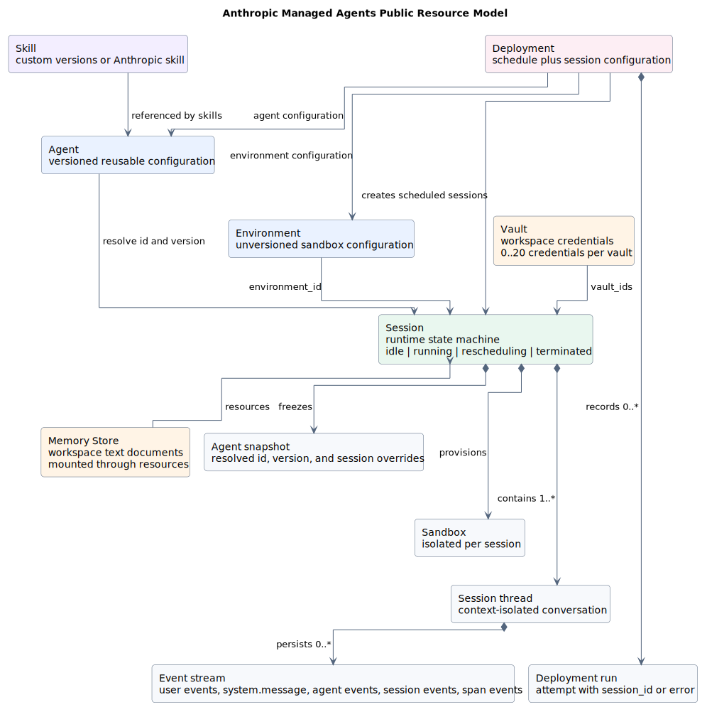
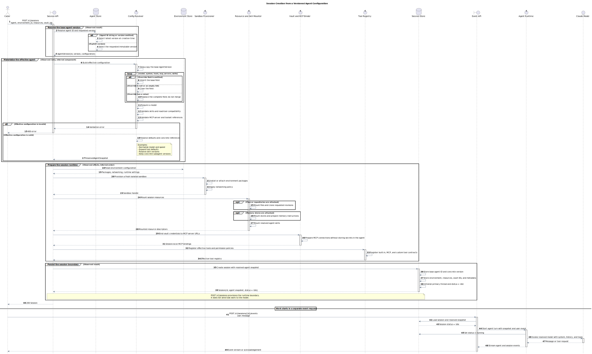
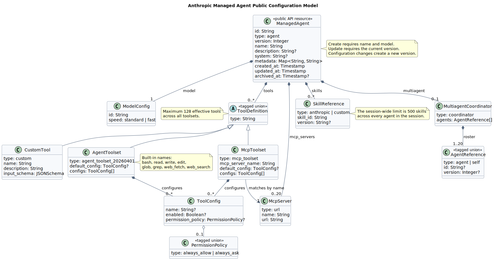
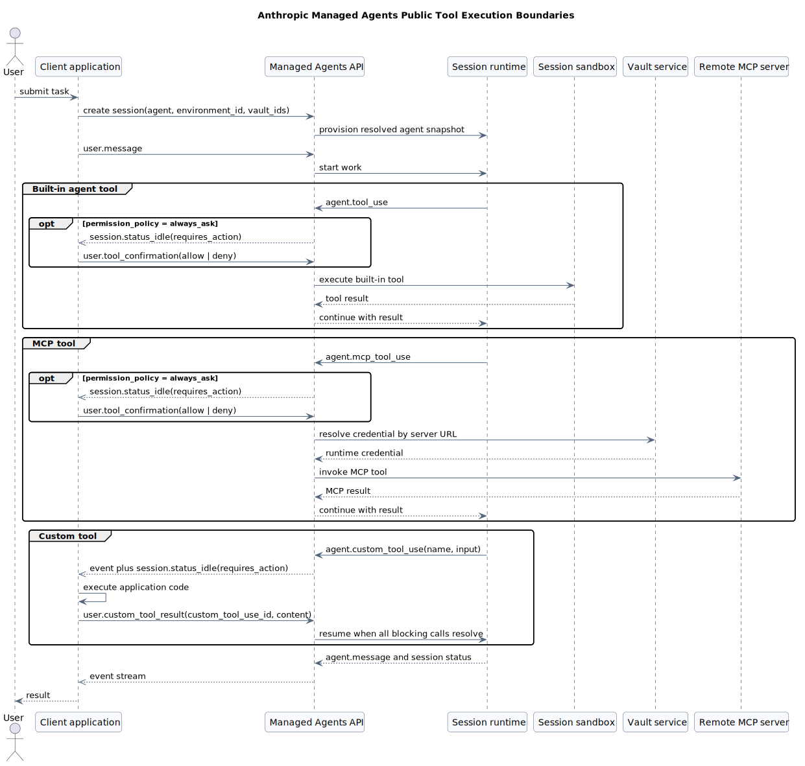

# Anthropic Managed Agents 公开模型（官方契约基线）

> 文档版本：`v0.2.0`<br>
> 状态：公开契约基线，已补充 Session 创建顺序<br>
> 资料核对日期：`2026-07-21`<br>
> 范围：仅提取 Anthropic 公开的 Managed Agents 模型，不掺入我们的 Tool/Agent 元数据设计。

## 1. 本轮结论

Anthropic 公开的 Managed Agents 不是一个单独的 `Agent JSON`，而是一组分层资源和运行时契约：

1. `Agent` 是可复用、可版本化的能力配置。
2. `Environment` 定义沙箱配置，但它本身不版本化。
3. `Session` 把 Agent 的某个已解析版本、Environment、Vault、Memory Store 等组合成一次运行。
4. `tools[]` 是三种公开类型的联合：Anthropic 托管工具集、MCP 工具集、应用侧自定义工具。
5. 工具定义只解决“模型看到什么、可以调用什么”；真正的执行者取决于工具类型，并不共享一种通用可执行实现。

这个结论是对公开契约的结构化归纳，不是我们的目标设计。

## 2. 证据边界

### 2.1 本文记录什么

- 官方文档和 API Reference 公开的资源、字段、枚举、数量约束和运行流程。
- 为了便于讨论而做的类型分组，但不增加 Anthropic 未公开的字段。
- 官方公开的运行时责任边界，例如自定义工具由客户应用执行。

### 2.2 本文暂不记录什么

- 我们将来的通用 `ToolMetadata` 或 `AgentMetadata` Schema。
- 与 pi、Codex、Claude Code、OpenCode 等项目的字段映射。
- 从配置自动生成 Tool/Agent 的工厂、注册表、执行器或数据库设计。
- Anthropic 未公开的内部类、存储表、调度器或沙箱实现。

### 2.3 源码基线

Managed Agents 是 Anthropic 托管服务，本轮没有可对齐的官方开源仓库，因此：

- 源码提交：`N/A`。
- 实现路径和类符号：`N/A`。
- 事实基线：Anthropic 官方文档和 API Reference，访问日期为 `2026-07-18`。

官方当前将 Managed Agents 标为 Beta。常规 Managed Agents 请求使用 `managed-agents-2026-04-01` beta header；Memory Store 端点的官方页面当前显示 `agent-memory-2026-07-22`，Session 挂载 Memory Store 仍属于常规 Managed Agents Session 请求。

## 3. 官方来源

| 主题 | 官方来源 | 本文用途 |
|---|---|---|
| Agent | [Define your agent](https://platform.claude.com/docs/en/managed-agents/agent-setup) | Agent 字段、版本和更新语义 |
| Agent API | [Agents API](https://platform.claude.com/docs/en/api/beta/agents) | 请求/响应类型和字段约束 |
| Tools | [Tools](https://platform.claude.com/docs/en/managed-agents/tools) | 托管工具集与自定义工具 |
| 权限 | [Permission policies](https://platform.claude.com/docs/en/managed-agents/permission-policies) | `always_allow` / `always_ask` 和确认流程 |
| MCP | [MCP connector](https://platform.claude.com/docs/en/managed-agents/mcp-connector) | MCP Server 声明、Toolset 引用和鉴权拆分 |
| Skills | [Skills](https://platform.claude.com/docs/en/managed-agents/skills) | Skill 引用类型、版本和 Session 上限 |
| Environment | [Cloud environment setup](https://platform.claude.com/docs/en/managed-agents/environments) | Environment 生命周期和 Session 沙箱隔离 |
| Environment API | [Environments API](https://platform.claude.com/docs/en/api/beta/environments) | `cloud` / `self_hosted` 配置联合 |
| Session | [Start a session](https://platform.claude.com/docs/en/managed-agents/sessions) | Agent 引用、版本锁定、单次覆盖 |
| Session API | [Create Session API Reference](https://platform.claude.com/docs/en/api/beta/sessions/create) | `POST /v1/sessions` 请求联合类型和解析快照响应 |
| Events | [Session event stream](https://platform.claude.com/docs/en/managed-agents/events-and-streaming) | 任务启动、Tool 调用、确认与回传 |
| Vault | [Authenticate with vaults](https://platform.claude.com/docs/en/managed-agents/vaults) | Session 级凭据、MCP 和环境变量凭据 |
| Memory | [Using agent memory](https://platform.claude.com/docs/en/managed-agents/memory) | Memory Store 资源和 Session 挂载 |
| Multiagent | [Multiagent orchestration](https://platform.claude.com/docs/en/managed-agents/multiagent-orchestration) | Coordinator、Roster、Thread 和共享边界 |
| 定时运行 | [Scheduled deployments](https://platform.claude.com/docs/en/managed-agents/scheduled-deployments) | Deployment 和 Deployment Run |

## 4. 公开资源模型



PlantUML：[查看源码](./diagram.puml#L5)

### 4.1 可复用配置资源

| 资源 | 官方公开含义 | 版本特征 |
|---|---|---|
| `Agent` | 封装 model、system、tools、MCP servers、skills 和 multiagent roster | 版本化；配置变化产生新版本 |
| `Environment` | 定义云沙箱或自托管沙箱配置 | 不版本化 |
| `Skill` | Anthropic 预置 Skill 或 Workspace 内自定义 Skill | 自定义 Skill 可版本化；Agent 引用可锁定版本或 `latest` |

### 4.2 运行时资源

| 资源 | 官方公开含义 |
|---|---|
| `Session` | 运行时状态机；创建时解析 Agent 版本并准备沙箱 |
| `Agent snapshot` | Session 响应中的已解析 Agent 配置；可包含仅对本 Session 生效的覆盖 |
| `Sandbox` | 每个 Session 独立的运行环境和文件系统 |
| `SessionThread` | Multiagent 中一个 Agent 的隔离上下文和事件流 |
| `Event` | 客户端向 Session 发送的 `user.*` / `system.message` 事件，以及服务返回的 `agent.*` / `session.*` / `span.*` 事件 |

Session 创建只准备运行环境，不自动开始任务；客户端发送 `user.message` 后才触发工作。公开状态包括 `idle`、`running`、`rescheduling` 和 `terminated`。

#### 4.2.1 Session 基于 Agent 配置的创建顺序



PlantUML：[查看源码](./diagram.puml#L71)

顺序图将 `POST /v1/sessions` 分为四个逻辑阶段：

1. 根据 Agent ID 解析创建时的最新版本，或读取调用方显式锁定的版本。
2. 深复制基础 Agent 配置，并对 `model`、`system`、`tools`、`mcp_servers`、`skills` 应用 Session 级完整字段替换。
3. 根据 Environment 创建独立 Sandbox，挂载 Session Resources 和已解析 Skills，绑定 Vault 与 MCP，并形成有效 Tool Registry。
4. 保存包含 Agent ID、具体版本和解析配置的 Session 快照，初始化主 Thread，并以 `idle` 状态返回。

`POST /v1/sessions` 本身不发送任务给模型。后续 `POST /v1/sessions/{id}/events` 中的 `user.message` 才使 Session 从 `idle` 进入 `running` 并启动 Agent turn。

图中的版本解析、完整替换、解析快照、独立 Sandbox 和事件启动边界来自公开文档。`Config Resolver`、`Resource and Skill Mounter`、`Tool Registry` 等参与者及其精确先后顺序是用于解释职责的逻辑推断，不表示 Anthropic 已公开这些内部服务或源码符号。

### 4.3 Session 级数据与凭据

| 资源 | 挂载方式 | 主要边界 |
|---|---|---|
| `Vault` | Session 创建时通过 `vault_ids` 引用 | 凭据不写入可复用 Agent；凭据秘密值写入后不返回 |
| `Credential` | 作为 Vault 的子资源 | 公开类型包括 `mcp_oauth`、`static_bearer`、`environment_variable` |
| `MemoryStore` | Session 创建时放入 `resources[]` | 挂载到沙箱 `/mnt/memory/` 下；运行中不支持增删挂载 |
| `Memory` | Memory Store 内的文本文档 | 通过普通文件工具读写；需启用 Agent Toolset |

### 4.4 自动化资源

`Deployment` 保存可创建 Session 的配置、初始 `user.message` 和 cron `schedule`。每次触发产生 `DeploymentRun`；成功的 Run 关联新 Session，失败的 Run 记录错误。这是 Session 的调度层，不是 Agent 定义的一个字段。

## 5. Agent 公开配置

### 5.1 创建字段

| 字段 | 必填 | 官方公开语义 |
|---|---:|---|
| `name` | 是 | 人类可读名称 |
| `model` | 是 | 模型 ID 字符串，或至少含 `id` 的对象；对象形式可表达 `speed` |
| `system` | 否 | Agent 的系统提示 |
| `tools` | 否 | 工具配置数组；所有 Toolset 展开后的有效 Tool 合计最多 128 个 |
| `mcp_servers` | 否 | MCP Server 连接声明，最多 20 个 |
| `skills` | 否 | Anthropic 或自定义 Skill 引用 |
| `multiagent` | 否 | Coordinator 声明和可委派 Agent roster |
| `description` | 否 | Agent 功能描述 |
| `metadata` | 否 | 客户自行跟踪的字符串键值对 |

### 5.2 响应增加的服务端字段

`Agent` 响应还包含 `id`、固定值 `type: "agent"`、`version`、`created_at`、`updated_at` 和 `archived_at`。官方示例中，服务端会将简写的 model 规范化为包含 `id` 和 `speed` 的对象。

### 5.3 版本与更新

- 更新 Agent 必须传入当前 `version`；版本不匹配返回 `409`。
- 配置发生变化时生成新版本；无实际变化时返回现有版本。
- `tools`、`mcp_servers`、`skills` 是数组整体替换，不是按元素合并。
- `multiagent` 整体替换；`metadata` 按键合并。
- 用 Agent ID 字符串创建 Session 时解析最新版本；也可显式指定 Agent ID 和版本。
- Session 可用 `agent_with_overrides` 仅覆盖本次运行的 `model`、`system`、`tools`、`mcp_servers` 和 `skills`，不创建 Agent 新版本。

## 6. Tool 公开配置



PlantUML：[查看源码](./diagram.puml#L235)

### 6.1 `agent_toolset_20260401`

这是 Anthropic 管理的内置工具集。公开工具名为：

- `bash`
- `read`
- `write`
- `edit`
- `glob`
- `grep`
- `web_fetch`
- `web_search`

Toolset 的公开配置结构为：

| 字段 | 语义 |
|---|---|
| `type` | 固定为 `agent_toolset_20260401` |
| `default_config` | 所有内置工具的默认值 |
| `configs[]` | 按 `name` 覆盖单个工具 |
| `enabled` | 是否向该 Agent 开放工具 |
| `permission_policy` | `always_allow` 或 `always_ask` |

该 Toolset 的默认权限策略是 `always_allow`。

### 6.2 `mcp_toolset`

MCP 配置被拆成两个互相校验的部分：

1. Agent `mcp_servers[]` 声明 `{ "type": "url", "name": "...", "url": "..." }`。
2. Agent `tools[]` 中的 `mcp_toolset.mcp_server_name` 必须匹配一个 Server 的 `name`。

`mcp_toolset` 和内置 Toolset 使用相同的 `default_config` / `configs[]` 形状，但其默认权限策略是 `always_ask`。MCP 凭据不放入 Agent，而是在创建 Session 时通过 `vault_ids` 提供。

### 6.3 `custom`

应用侧自定义工具公开字段为：

| 字段 | 语义 |
|---|---|
| `type` | 固定为 `custom` |
| `name` | 模型调用的工具名 |
| `description` | 给模型的工具说明 |
| `input_schema` | 输入参数 JSON Schema |

这些字段定义的是“调用契约”，不包含执行代码、HTTP URL 或函数绑定。模型发出 `agent.custom_tool_use`，客户应用执行对应代码，再通过 `user.custom_tool_result` 回传结果。Custom Tool 不受 `permission_policy` 管理，因为客户应用本身就掌握是否执行。

### 6.4 三类 Tool 的执行所有权



PlantUML：[查看源码](./diagram.puml#L373)

| Tool 类型 | 定义在哪里 | 真正执行者 | 结果如何回到 Agent |
|---|---|---|---|
| Agent Toolset | Agent `tools[]` | Anthropic 管理的 Session 沙箱/服务 | 平台内部将 Tool Result 续接给运行时 |
| MCP Toolset | Agent `tools[]` + `mcp_servers[]` | 远程 MCP Server | Managed Agents 通过 MCP 调用并续接结果 |
| Custom Tool | Agent `tools[]` | 客户应用，或自托管沙箱的 Worker | 客户端发送 `user.custom_tool_result` |

`always_ask` 仅适用于服务端执行的 Agent Toolset 和 MCP Toolset。命中该策略时，Session 发出 Tool Use 事件后进入 `idle/requires_action`；客户端发送 `user.tool_confirmation` 的 `allow` 或 `deny` 后才继续。

## 7. Skills、Memory 和 Multiagent

### 7.1 Skills

Agent `skills[]` 的单个引用包含：

- `type`: `anthropic` 或 `custom`。
- `skill_id`: Anthropic Skill 短名或自定义 `skill_*` ID。
- `version`: 仅对 Custom Skill 有意义，可指定版本或 `latest`，省略时默认为 `latest`。

官方当前公开的限制是：一个 Session 内所有 Agent 合计最多挂载 500 个 Skill。

### 7.2 Memory Store

Memory Store 不是 Agent 字段。它是 Workspace 级文本文档集合，在创建 Session 时使用以下公开形状挂载：

```json
{
  "resources": [
    {
      "type": "memory_store",
      "memory_store_id": "memstore_example",
      "access": "read_write",
      "instructions": "Check project context before starting work."
    }
  ]
}
```

`access` 默认为 `read_write`，也可设为 `read_only`。

### 7.3 Multiagent

Agent 可通过以下形状成为 Coordinator：

```json
{
  "multiagent": {
    "type": "coordinator",
    "agents": [
      { "type": "agent", "id": "agent_example", "version": 3 },
      { "type": "self" }
    ]
  }
}
```

公开运行语义是：

- Roster 在 Coordinator 创建或更新时解析并锁定；被引用 Agent 后续升级不会自动进入旧 Coordinator 版本。
- 一层委派，Roster 最多 20 个唯一 Agent，Session 最多 25 个并发 Thread。
- 同一 Session 内的 Agent 共享沙箱、文件系统和 Vault 凭据，但每个 Agent 拥有独立 Thread、上下文和对话历史。
- 每个 Agent 使用自己的 model、system、tools、MCP servers 和 skills；它们不因共享沙箱而共享工具配置。

## 8. 完整公开形状示例

下面是将官方公开字段组合在一起的 Agent Create 示例。示例中的 URL、ID 和业务名称是占位值；结构是 Anthropic 公开契约，不是我们的目标 Schema。

```json
{
  "name": "Engineering Lead",
  "description": "Coordinates engineering analysis and delivery.",
  "model": {
    "id": "claude-opus-4-8",
    "speed": "standard"
  },
  "system": "Coordinate engineering work and return evidence-backed results.",
  "tools": [
    {
      "type": "agent_toolset_20260401",
      "default_config": {
        "enabled": true,
        "permission_policy": {
          "type": "always_allow"
        }
      },
      "configs": [
        {
          "name": "bash",
          "permission_policy": {
            "type": "always_ask"
          }
        },
        {
          "name": "web_fetch",
          "enabled": false
        }
      ]
    },
    {
      "type": "mcp_toolset",
      "mcp_server_name": "engineering",
      "default_config": {
        "enabled": false,
        "permission_policy": {
          "type": "always_ask"
        }
      },
      "configs": [
        {
          "name": "get_issue",
          "enabled": true
        }
      ]
    },
    {
      "type": "custom",
      "name": "lookup_service_owner",
      "description": "Return the owner of an internal service.",
      "input_schema": {
        "type": "object",
        "properties": {
          "service": {
            "type": "string"
          }
        },
        "required": [
          "service"
        ]
      }
    }
  ],
  "mcp_servers": [
    {
      "type": "url",
      "name": "engineering",
      "url": "https://mcp.example.com/engineering"
    }
  ],
  "skills": [
    {
      "type": "custom",
      "skill_id": "skill_example",
      "version": "latest"
    }
  ],
  "multiagent": {
    "type": "coordinator",
    "agents": [
      {
        "type": "self"
      }
    ]
  },
  "metadata": {
    "team": "platform"
  }
}
```

这个 JSON 创建的是版本化 Agent 配置，不会单独完成以下运行时工作：

- 不会创建 Environment 或 Session。
- 不会向 `mcp_servers` 写入用户凭据。
- 不会实现 `lookup_service_owner` 的执行代码。
- 不会自动启动任务；任务由 Session 的 `user.message` 事件启动。

## 9. 本阶段刻意保留的问题

为了保持“先忠实提取，再做设计”，本版本暂不回答下面的问题：

1. 我们是否直接沿用 Anthropic 的 `tools[]` 联合类型。
2. 我们是否把 Tool 的声明、Binding、Credential、Policy 拆成不同资源。
3. “开发人员只配置元数据就产生 Tool”时，由谁生成并托管真实 Executor。
4. Agent 版本、Session 快照、环境版本和密钥绑定如何映射到我们的 ToB 平台。
5. Anthropic 公共模型与其他 Agent 项目的差异如何统一。

这些问题应在确认本公开基线后，作为下一阶段“目标设计”单独记录，避免把现状与方案混在一起。

## 10. 图表维护与校验

本主题的四个图统一维护在 [diagram.puml](./diagram.puml) 中。图源只使用英文和 ASCII；SVG 是 PlantUML 生成物，不得手工编辑。

标准生成命令：

```bash
plantuml -tsvg diagram.puml
```

## 11. 版本历史

| 版本 | 日期 | 变化 |
|---|---|---|
| `v0.2.0` | 2026-07-21 | 增加 Session 基于版本化 Agent 配置创建的顺序图，区分官方观察行为与服务端逻辑推断；更新根文档索引 |
| `v0.1.0` | 2026-07-18 | 建立 Anthropic Managed Agents 官方公开契约基线；整理资源、Agent 字段、三类 Tool、Session、Vault、Memory、Skill、Multiagent 和 Deployment；未加入目标元数据设计 |
