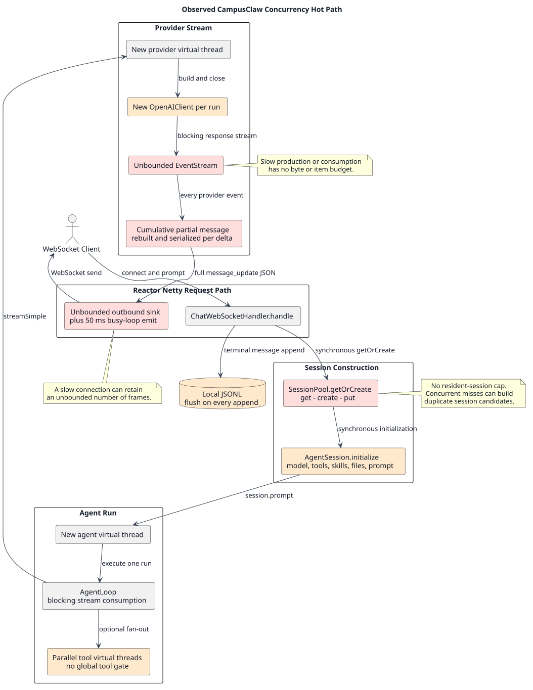
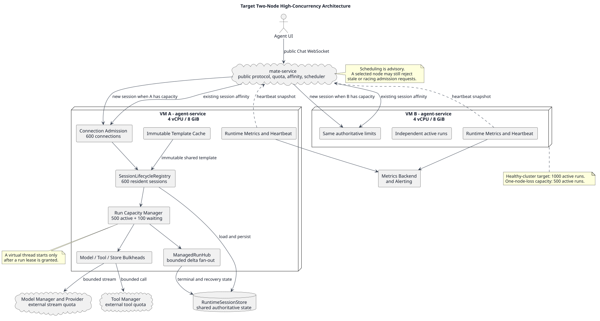
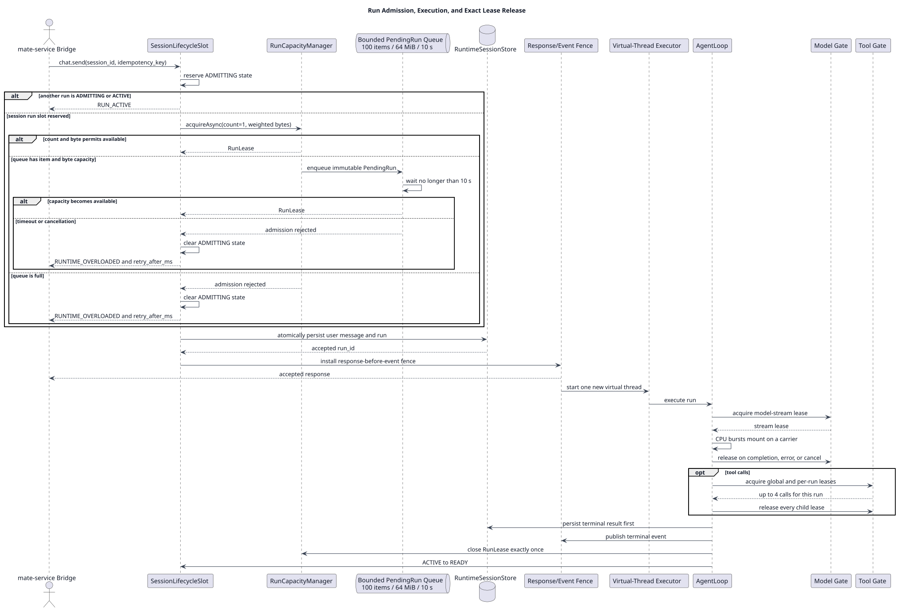
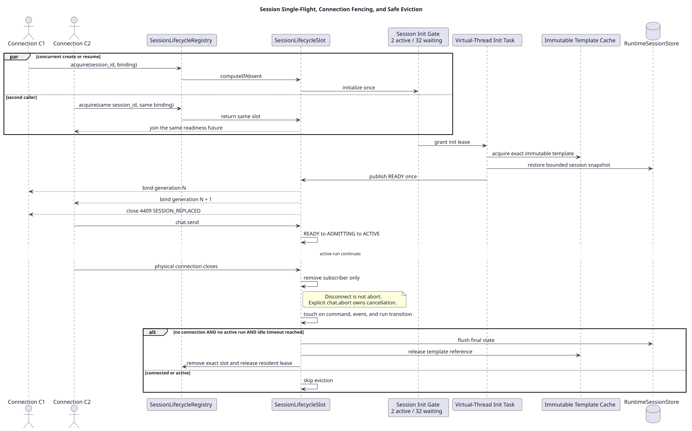
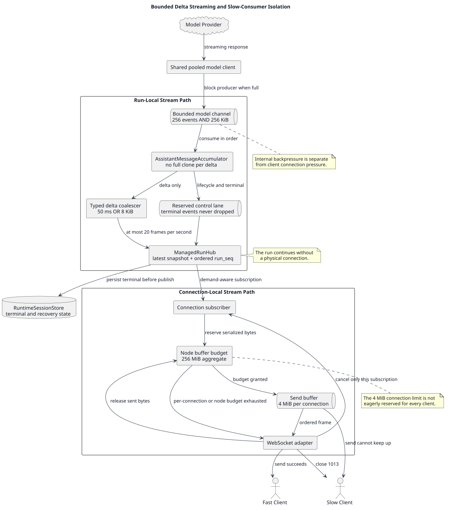

# CampusClaw 两节点高并发治理设计

| 属性 | 值 |
|---|---|
| 文档版本 | 1.0.0 |
| 状态 | 目标设计，尚未实施；容量结论需压测验收 |
| 更新日期 | 2026-08-06 |
| `pi-mono-java` 源码基线 | `1f7a5423219edfa4519d8719f1cc8a188ed72873` |
| `pi-mono-java-design` 分析基线 | `a3148bea154d9efe565ad6cb5d0e707b400b8e03` |
| 部署基线 | 两台仅运行 `agent-service` 的虚机；每台 4 vCPU、8 GiB，合计 8 vCPU、16 GiB |
| v1 容量目标 | 健康双节点下 1,000 个在线 Session、1,000 个 active Agent Run |
| 工作负载基线 | P95 输入不超过 32K token，单轮输出不超过 4K token，合并后每个 Run 不超过 20 个流式 Frame/s |
| 关联设计 | [Manager 驱动的多 Agent Runtime](../pi-mono-java-manager-driven-multi-agent-runtime/README.md)、[不可变 Runtime Template](../agent-runtime-template/README.md)、[Java 21 虚拟线程评估](../java21-virtual-thread-pool-assessment/README.md) |

> [!IMPORTANT]
> 本文所有新增组件、容量数值、错误码和运行行为都是 target-only design，不能
> 表述为当前 `pi-mono-java` 已有能力。当前源码只证明它已经使用虚拟线程，
> 不证明 100、1,000 或 10,000 并发已经通过生产级容量验证。

## 1. 结论

CampusClaw 当前采用“一次 Agent Run 一个虚拟线程”的方向是正确的，但高并发
问题尚未被管理起来。需要建设的不是“虚拟线程池”，而是围绕 Session、Run、
模型流、工具调用、流式缓冲、持久化和节点路由建立一组可计量、可拒绝、可恢复
的容量边界。

对本次三个并发量级的结论如下。

| 场景 | 当前代码结论 | 完成本文设计后 |
|---|---|---|
| 100 个在线但空闲的 AgentSession | 从资源量级看风险较低，但目前没有连接数、Session 数和缓冲字节上限，仍不能直接作生产承诺 | 应作为第一档基线压测，验证连接、心跳、Session 常驻内存和重连 |
| 100 个同时执行的 Agent Run | I/O 等待占比高时有机会运行，但无界缓冲、同步初始化、逐 Run 客户端和缺少下游隔离会使结果依赖模型速度与客户端速度 | 两台节点有充分余量；用于验证治理机制而不是只验证“能跑起来” |
| 1,000 个同时执行的 Agent Run | **当前不能宣称支撑**；两台节点可能先在内存、序列化、连接缓冲、下游配额或 Session 竞争上失稳 | 健康双节点下的目标候选值，每节点最多 500 active Run；必须满足本文验收标准且取得 Model Manager/Provider 的 1,000 路流配额 |
| 10,000 个同时执行的 Agent Run | **两台 4C/8G 明确不支撑** | 不属于 v1；按每节点 500 的已验收上限，名义上至少 20 节点，生产建议至少 24 节点并重新设计控制面、事件存储和上游配额 |

这里的“AgentSession 并发”必须拆开理解：在线连接、常驻 Session、active Run、
在途模型流和在途工具调用不是同一个数字。空闲 Session 主要消耗连接和常驻
状态；active Run 还会消耗上下文、流式累积器、模型连接、事件缓冲、序列化 CPU
和工具容量。本文按更严格的“1,000 个 Session 都有 active Run”设计。

## 2. 目标、约束与非目标

### 2.1 已冻结的目标约束

- 两台虚机每台 4 vCPU、8 GiB，只部署 `agent-service`；mate-service、数据库、
  Model Manager、Tool Manager 和模型 Provider 均在外部。
- v1 只承诺双节点都健康时最多 1,000 个 active Run，目标分布为每节点 500。
- 单节点故障后集群可用 active Run 容量降为 500；不要求剩余节点继续承载
  1,000，也不把故障节点上的 active Run 迁移到另一节点。
- 每个 Session 同时最多一个主 Run；每个 Session 同时最多一条活动读写连接，
  新 generation 接管旧 generation。
- Agent Run 和并行工具任务继续使用“一任务一虚拟线程”；不预创建、借还或
  复用虚拟线程。
- 本容量模型不包含本地 Sandbox 或 Docker sidecar；若以后启用 Sandbox，必须
  另设进程数、CPU 和内存容量，不能复用本文数值。
- 产品工作负载以 P95 32K 输入 token、4K 输出 token 为基线；超出标准档的
  Run 使用更高的内存权重，不能和标准 Run 等价计数。

### 2.2 非目标

- 本文不设计 10,000 active Run 的生产拓扑，也不提供跨 Pod active Run 续跑。
- 本文不重新定义 Agent、Model、Tool、Attachment 和 Session 的业务身份边界。
- 本文不重复定义 `RuntimeSessionStore` 的数据库表；继续使用关联 Runtime 设计
  已定义的权威 Session、Message、RunRecord 和幂等存储，新增表仍须遵守
  `t_` 前缀和 lowercase snake_case 规则。
- 本文不把提高 JDK 虚拟线程载体线程并行度作为扩容方法；CPU 不足时优先减少
  CPU 放大、限流或增加节点。

## 3. 源码基线与已观察行为

### 3.1 证据范围

直接实现基线是
[`pi-mono-java@1f7a5423`](https://github.com/superheromeZzh/pi-mono-java/tree/1f7a5423219edfa4519d8719f1cc8a188ed72873)。
`modules/*` 是源码事实来源；`mate-campusclaw/*` 是同步后的交付镜像，不作为两套
独立实现重复计数。本主题不把 TypeScript `pi` 当作容量事实基线；与 `pi` 的
Session/Template 语义对齐由关联设计负责。

### 3.2 当前并发行为

| 分类 | 源码证据 | 已观察行为 | 并发影响 |
|---|---|---|---|
| Run 执行 | [`Agent.java:60-61`](https://github.com/superheromeZzh/pi-mono-java/blob/1f7a5423219edfa4519d8719f1cc8a188ed72873/modules/agent-core/src/main/java/com/campusclaw/agent/Agent.java#L60-L61)、[`Agent.java:218-268`](https://github.com/superheromeZzh/pi-mono-java/blob/1f7a5423219edfa4519d8719f1cc8a188ed72873/modules/agent-core/src/main/java/com/campusclaw/agent/Agent.java#L218-L268) 中 `VIRTUAL_THREAD_EXECUTOR`、`startExecution` | 第二个并发 Run 被 `executionLock` 拒绝；每个已启动 Run 创建一个新虚拟线程 | 一 Session 一 Run 和一任务一虚拟线程已经成立，但没有节点级 Run 上限 |
| 模型消费 | [`AgentLoop.java:209-276`](https://github.com/superheromeZzh/pi-mono-java/blob/1f7a5423219edfa4519d8719f1cc8a188ed72873/modules/agent-core/src/main/java/com/campusclaw/agent/loop/AgentLoop.java#L209-L276) 中 `invokeModel`、`consumeStream` | Agent 虚拟线程通过 `toIterable()` 阻塞消费模型事件，必要时 `result().block()` | 阻塞适合虚拟线程；每个 delta 又构造 `MessageUpdateEvent(currentMessage,event)` |
| 工具并行 | [`ToolExecutionPipeline.java:178-207`](https://github.com/superheromeZzh/pi-mono-java/blob/1f7a5423219edfa4519d8719f1cc8a188ed72873/modules/agent-core/src/main/java/com/campusclaw/agent/tool/ToolExecutionPipeline.java#L178-L207) 中 `executeSequentially`、`executeInParallel` | 并行模式每组创建 `newVirtualThreadPerTaskExecutor()`，再等待全部 Future | 线程模型正确，但缺少节点级和单 Run 工具调用上限 |
| Provider 线程与客户端 | [`OpenAIResponsesProvider.java:113-175`](https://github.com/superheromeZzh/pi-mono-java/blob/1f7a5423219edfa4519d8719f1cc8a188ed72873/modules/ai/src/main/java/com/campusclaw/ai/provider/openai/OpenAIResponsesProvider.java#L113-L175) 中 `doStream`、`executeStream`、`buildClient` | 每个模型流再启动一个 Provider 虚拟线程，并为每个 Run 创建、关闭一个 `OpenAIClient` | 1,000 Run 会放大 TLS/连接池初始化和客户端对象生命周期，无法共享连接 |
| Provider delta | [`OpenAIResponsesProvider.java:250-350`](https://github.com/superheromeZzh/pi-mono-java/blob/1f7a5423219edfa4519d8719f1cc8a188ed72873/modules/ai/src/main/java/com/campusclaw/ai/provider/openai/OpenAIResponsesProvider.java#L250-L350) 中 `processStream`、`applyTextDelta`、`applyThinkingDelta` | 每个 delta 执行累积器 `toString()`、替换完整 Content，并携带新的 partial Message | 输出越长，累计复制和对象分配越多；总体复制量可能接近平方级放大 |
| 模型事件缓冲 | [`EventStream.java:14-27`](https://github.com/superheromeZzh/pi-mono-java/blob/1f7a5423219edfa4519d8719f1cc8a188ed72873/modules/ai/src/main/java/com/campusclaw/ai/stream/EventStream.java#L14-L27)、[`EventStream.java:54-88`](https://github.com/superheromeZzh/pi-mono-java/blob/1f7a5423219edfa4519d8719f1cc8a188ed72873/modules/ai/src/main/java/com/campusclaw/ai/stream/EventStream.java#L54-L88) 中 `EventStream` | Javadoc 和构造器都明确使用 unbounded unicast buffer | Provider 快于消费端时没有条数或字节上限 |
| 流事件类型 | [`AssistantMessageEvent.java:58-164`](https://github.com/superheromeZzh/pi-mono-java/blob/1f7a5423219edfa4519d8719f1cc8a188ed72873/modules/ai/src/main/java/com/campusclaw/ai/stream/AssistantMessageEvent.java#L58-L164) | Text/Thinking/Tool delta 同时携带增量和完整 partial Message | 内部对象保留与序列化成本随输出长度放大 |
| WebSocket 出站 | [`ChatWebSocketHandler.java:78-186`](https://github.com/superheromeZzh/pi-mono-java/blob/1f7a5423219edfa4519d8719f1cc8a188ed72873/modules/coding-agent-cli/src/main/java/com/campusclaw/codingagent/mode/server/ChatWebSocketHandler.java#L78-L186) 中 `handle`、`forwardSessionEvent`、`buildCloseHook` | 每连接创建无界 multicast sink，竞争时 busy-loop 最多 50 ms；断线会 abort 当前 Run | 慢客户端可积压内存；生产线程可被发送竞争拖住；连接生命周期和 Run 被错误耦合 |
| WebSocket 消息形态 | [`ChatWebSocketHandler.java:422-459`](https://github.com/superheromeZzh/pi-mono-java/blob/1f7a5423219edfa4519d8719f1cc8a188ed72873/modules/coding-agent-cli/src/main/java/com/campusclaw/codingagent/mode/server/ChatWebSocketHandler.java#L422-L459) 中 `buildEventFrame` | `message_update` 序列化整个累计 Message，而不是只发送 typed delta | 高频长输出会放大堆分配、JSON CPU 和网络字节 |
| Session 创建 | [`SessionPool.java:167-202`](https://github.com/superheromeZzh/pi-mono-java/blob/1f7a5423219edfa4519d8719f1cc8a188ed72873/modules/coding-agent-cli/src/main/java/com/campusclaw/codingagent/mode/server/SessionPool.java#L167-L202) 中 `getOrCreate` | `ConcurrentHashMap` 上执行 get、创建、put，没有 single-flight 和总容量 | 同一 ID 并发 miss 可构造多个候选 Session，后写覆盖前写；Session 数无上限 |
| Session 初始化 | [`AgentSession.java:106-162`](https://github.com/superheromeZzh/pi-mono-java/blob/1f7a5423219edfa4519d8719f1cc8a188ed72873/modules/coding-agent-cli/src/main/java/com/campusclaw/codingagent/session/AgentSession.java#L106-L162) 中 `initialize` | 同步解析模型、刷新工具、加载 Skill/上下文文件/Prompt Template 并构建系统 Prompt | 由 [`ChatWebSocketHandler.handle`](https://github.com/superheromeZzh/pi-mono-java/blob/1f7a5423219edfa4519d8719f1cc8a188ed72873/modules/coding-agent-cli/src/main/java/com/campusclaw/codingagent/mode/server/ChatWebSocketHandler.java#L115-L125) 同步调用 `getOrCreate` 的组合可推断：冷启动工作会占用网络回调线程 |
| Session 淘汰 | [`SessionPool.java:388-405`](https://github.com/superheromeZzh/pi-mono-java/blob/1f7a5423219edfa4519d8719f1cc8a188ed72873/modules/coding-agent-cli/src/main/java/com/campusclaw/codingagent/mode/server/SessionPool.java#L388-L405) 中 `evictIdle` | `lastAccess` 只在 `getOrCreate` 更新；淘汰仅检查 `isStreaming`，不检查仍连接的订阅者 | 已连接但暂时不流式输出的 Session 可能被淘汰，后续访问可能产生第二个实例 |
| Session 持久化 | [`SessionManager.java:277-400`](https://github.com/superheromeZzh/pi-mono-java/blob/1f7a5423219edfa4519d8719f1cc8a188ed72873/modules/coding-agent-cli/src/main/java/com/campusclaw/codingagent/session/SessionManager.java#L277-L400) 中 `appendMessage`、`appendRaw` | 本地 JSONL writer 每次 append 都 flush，字段更新和写入没有统一 Session mailbox | 多节点不能共享；高并发频繁 flush 会产生 I/O 压力，连接命令和事件回调还可能竞争同一 writer |
| 节点指标 | [`NodeMetrics.java:8-46`](https://github.com/superheromeZzh/pi-mono-java/blob/1f7a5423219edfa4519d8719f1cc8a188ed72873/modules/agent-core/src/main/java/com/campusclaw/agent/controlplane/domain/NodeMetrics.java#L8-L46) | 已有 `activeAgents`、`queuedTasks`、`cpuLoad`、`memoryUsedMb` 数据结构 | 有承载容量指标的起点，但尚未覆盖连接、Run/字节许可和下游 bulkhead |
| 调度 | [`RuntimeScheduler.java:26-107`](https://github.com/superheromeZzh/pi-mono-java/blob/1f7a5423219edfa4519d8719f1cc8a188ed72873/modules/agent-core/src/main/java/com/campusclaw/agent/controlplane/service/RuntimeScheduler.java#L26-L107) | 先 sticky affinity，否则按能力过滤后 round-robin；没有读取 `NodeMetrics` 做容量选择 | 新 Session 可继续被分配到已经饱和的节点；节点本地必须能拒绝 |
| 注册表 | [`NodeRegistry.java:30-175`](https://github.com/superheromeZzh/pi-mono-java/blob/1f7a5423219edfa4519d8719f1cc8a188ed72873/modules/agent-core/src/main/java/com/campusclaw/agent/controlplane/service/NodeRegistry.java#L30-L175) | 节点注册表是进程内 `ConcurrentHashMap` | 多实例控制面不能只依赖各自本地注册表形成统一调度视图 |
| 可观测性 | [`application.properties:1-33`](https://github.com/superheromeZzh/pi-mono-java/blob/1f7a5423219edfa4519d8719f1cc8a188ed72873/mate-campusclaw/src/main/resources/application.properties#L1-L33) | Metrics 和 Observation 自动配置被排除，Management endpoint 默认关闭 | 当前无法用生产指标证明准入、缓冲、GC 和下游饱和是否受控 |
| 现有压测工具 | [`ws_chat_load_test.py:41-69`](https://github.com/superheromeZzh/pi-mono-java/blob/1f7a5423219edfa4519d8719f1cc8a188ed72873/scripts/ws-chat-load-test/ws_chat_load_test.py#L41-L69)、[`ws_chat_load_test.py:512-734`](https://github.com/superheromeZzh/pi-mono-java/blob/1f7a5423219edfa4519d8719f1cc8a188ed72873/scripts/ws-chat-load-test/ws_chat_load_test.py#L512-L734) | 支持有界客户端并发，记录连接、ACK、TTFT、整轮延迟和错误；每个请求创建新连接并只发送一个 prompt | 可复用为第一阶段负载驱动器，但尚不覆盖长连接、两节点分布、慢消费者、重连和 Run/连接解耦 |

### 3.3 当前热点图



[PlantUML 源码](diagram.puml#L16)

当前最危险的不是虚拟线程数量，而是四类没有上界的乘法：

1. `Session 数 × 每 Session 常驻上下文`；
2. `active Run 数 × 累计 Message/模型事件缓冲`；
3. `连接数 × 未发送 Frame`；
4. `Run 数 × 工具 fan-out/逐 Run 客户端连接`。

## 4. 容量推导与并发量级

### 4.1 虚拟线程能解决什么

Agent Run 虚拟线程在执行 Java 计算、JSON 转换、事件归并或工具参数处理时会
挂载到载体平台线程；发生 JDK 支持的阻塞 I/O、等待队列、`Future.get()` 或
`Semaphore` 等等待时通常卸载。载体线程是平台线程，不等于独占一个 CPU 核；
4 vCPU 节点同一时刻仍只能执行大约 4 路持续 CPU 工作。

因此 500 个 active Run 可以同时存在，是因为大部分时间预计在等待模型、工具
或存储，而不是因为 500 个 Run 可以同时做 CPU 计算。若 500 路模型流同时返回
delta，JSON、累积器、日志、TLS 和 WebSocket 写出会形成 CPU 突发，最终仍受
4 vCPU 限制。

“mounted while computing”是正常执行，不等于 pinning。Pinning 指虚拟线程在
本应等待时无法从载体线程卸载。Java 21 目标继续用 JFR
`jdk.VirtualThreadPinned` 观察高频长时 pinning；不通过扩大载体线程池掩盖问题。
官方采用原则见 [Oracle Java 21 Virtual Threads](https://docs.oracle.com/en/java/javase/21/core/virtual-threads.html)
和 [JEP 444](https://openjdk.org/jeps/444)。

### 4.2 线程状态与容量控制点

| 执行阶段 | 执行线程 | 典型挂载/卸载 | 本设计限制 |
|---|---|---|---|
| WebSocket 解帧、命令校验 | Reactor Netty 平台线程 | 执行解析时占用 event-loop；该线程不能做 Session 冷加载或阻塞存储 | 连接上限 600；阻塞初始化立即转交异步任务 |
| Session 冷初始化 | 独立虚拟线程 | 文件/数据库等待时卸载；Prompt 构建时挂载 | 2 个并行、32 个等待、最多等 3 秒；Template single-flight |
| Agent Run | 每 Run 一个虚拟线程 | 模型/工具等待时卸载；上下文和事件处理时挂载 | 每节点 500 active，另受 2 GiB 加权 Run 内存预算限制 |
| Provider reader | 每个在途模型流最多一个虚拟线程 | 网络读取等待时卸载；SDK 事件解析时挂载 | 模型流 gate 500 或更低的上游配额值；通道 256 条且 256 KiB |
| 并行工具调用 | 每 Tool Call 一个短生命周期虚拟线程 | 远程工具等待时卸载；本地计算时挂载 | 每节点 256、每 Run 4；创建子线程前先取 Tool lease |
| Store 操作 | 虚拟线程或异步驱动任务 | 数据库连接和提交等待时卸载 | 每节点 32 个在途写；每 Session 有序 mailbox |

### 4.3 流式输出的数量级

按“合并后 20 Frame/s/Run、平均 Frame 2 KiB”作说明性估算，500 active Run
会在单节点产生约 10,000 Frame/s、19.5 MiB/s 应用负载；双节点 1,000 Run
约为 20,000 Frame/s、39.1 MiB/s。该 2 KiB 是估算假设，不是实测结果。

10,000 Run 在同一假设下约为 200,000 Frame/s、390.6 MiB/s，尚未计入 TLS、
WebSocket 和 JSON 结构开销。这说明 10,000 active Run 不是把虚拟线程许可从
1,000 改成 10,000，而是网络、序列化、事件存储、下游连接和节点数量的代际变化。

## 5. 目标架构

### 5.1 两节点结构



[PlantUML 源码](diagram.puml#L90)

每个 `agent-service` 节点独立拥有完整的本地保护链：

```text
ConnectionAdmission
  -> SessionLifecycleRegistry
    -> AgentRuntimeCapacityManager
      -> ManagedRunHub
        -> Model / Tool / Store Bulkheads
```

mate-service 只根据最近心跳为新 Session 选择节点，并为已有 Session 保持亲和。
心跳天然可能陈旧，两个请求也可能同时看到同一剩余容量，所以节点本地
`AgentRuntimeCapacityManager` 是最终准入权威。调度器选择成功不等于 Run 已被
接受；只有节点取得本地 Lease 并持久化 accepted Run 后才返回成功。

### 5.2 组件职责

| 组件 | 责任 | 不承担的责任 |
|---|---|---|
| `ConnectionAdmission` | 限制握手后连接数、首帧超时、单 Frame 大小和节点连接缓冲总字节 | 不决定某个 Run 是否能调用模型 |
| `SessionLifecycleRegistry` | `session_id -> SessionLifecycleSlot` single-flight；持有 resident Lease、连接 generation、active Run 和淘汰所有权 | 不跨节点迁移 active Run |
| `AgentRuntimeCapacityManager` | Run count/byte 双重准入、100 项/64 MiB/10 秒异步等待、过载拒绝、精确 Lease 释放 | 不池化虚拟线程，不替代下游配额 |
| `ManagedRunHub` | 在物理连接之外维护 active Run 的 latest snapshot、typed delta、`run_seq` 和终态发布 | 不无限保留所有 delta；长期历史归 Store |
| `RuntimeTemplateCache` | 按不可变 fingerprint single-flight 加载共享 Prompt/Skill/Tool 描述和其他只读模板 | 不共享 `Agent`、transcript、凭据或可变 Session 状态 |
| `ManagerClientRegistry` | 按 endpoint/服务身份配置复用模型、工具和存储客户端及底层连接池 | 不在虚拟线程 `ThreadLocal` 中缓存客户端 |
| Model/Tool/Store bulkhead | 分别约束稀缺下游，在成功、失败、取消、超时路径释放 Lease | 不用一个全局数字掩盖不同下游瓶颈 |
| `RuntimeNodeHeartbeatReporter` | 每 5 秒上报真实本地许可、缓冲和运行状态 | 不代替本地准入，也不携带 Session/Run 高基数标签 |

## 6. Run 准入与虚拟线程上限管理

### 6.1 核心原则

虚拟线程 API 不提供业务所需的“最大虚拟线程数”。本设计限制的是已经接受的
业务工作和稀缺资源：

- 等待容量的请求只保存一个不可变、有界的 `PendingRun` 描述符，不提前创建
  Agent Run 虚拟线程；
- Run Lease 获得后才启动 Run 虚拟线程；
- Provider reader 和 Tool 子任务可以再创建虚拟线程，但必须先获得对应下游
  Lease；
- 所有 Lease 使用幂等 `close()`，由唯一 owner 在 `finally` 中释放，异常、
  Abort、超时和节点优雅关闭都走同一条释放路径。

推荐接口形态如下，名称是目标 API，不是当前源码：

```java
interface AgentRuntimeCapacityManager {
    CompletionStage<RunLease> acquireAsync(RunEstimate estimate, Duration maxWait);
}

interface RunLease extends AutoCloseable {
    String leaseId();
    int memoryUnits();
    @Override void close(); // idempotent and observable
}
```

`acquireAsync` 使用受锁保护的有界描述符队列或等价无等待线程实现，不能让
Reactor Netty event-loop 阻塞 10 秒。实现可用 `CompletableFuture<RunLease>`
表示等待结果；许可释放时由容量管理器直接完成队首 Future。

### 6.2 准入顺序



[PlantUML 源码](diagram.puml#L166)

一次 `chat.send` 按以下顺序处理：

1. 校验身份、Session 绑定、消息大小、附件和幂等键；无效请求不进入队列。
2. `SessionLifecycleSlot` 原子占用 `ADMITTING`，使同一 Session 的第二个请求立即
   得到 `RUN_ACTIVE`。
3. 根据待执行上下文估算 Run 内存权重，同时申请 Run count 和 memory permits。
4. 容量立即可用时返回 Lease；否则只在“100 项和 64 MiB 两个条件都未满”时
   进入 FIFO 队列，最多等待 10 秒。
5. 队列满、动态健康门禁处于 `SHEDDING`、等待超时或请求被取消时，清除
   `ADMITTING`，不写入用户消息和 Run，返回可重试过载错误。
6. 取得 Lease 后，原子持久化用户 Message、RunRecord 和 active Run 绑定，再
   返回 accepted Response；Response 写出栅栏打开后才发布该 Run 的 Event。
7. 创建新的 Agent Run 虚拟线程。Run 进入模型、工具和 Store 前分别申请局部
   Lease，不长期持有已经不用的模型或工具 Lease。
8. 终态先持久化，再发布 terminal Event，最后在 `finally` 中各释放一次局部
   Lease 和 Run Lease，并将 Session 从 `ACTIVE` 变为 `READY`。

若第 6 步的 accepted 持久化失败，服务端不得启动虚拟线程或返回 accepted；它
必须清除 `ADMITTING`、关闭刚取得的 Run Lease，并按既有存储/Runtime 错误契约
返回失败。该分支与正常 terminal 分支使用同一个幂等 Lease 释放实现。

物理 WebSocket 在 accepted Response 前断开时，可以取消仍在等待的
`PendingRun`；accepted 后断开只取消连接订阅，不 Abort Run。调用方重试副作用
命令时必须复用原 `idempotency_key`。

### 6.3 Run 内存权重

Run count 500 不能单独防止 500 个超长上下文耗尽内存，因此同时使用加权字节
预算：

```text
estimated_retained_bytes =
    serialized_context_bytes
  + expected_output_budget_bytes
  + run_accumulator_budget_bytes
  + fixed_run_overhead_bytes

memory_units = max(1, ceil(estimated_retained_bytes / 4 MiB))
```

每节点有 512 个 4 MiB logical units，即 2 GiB Run retained-memory 预算；
同时仍有 500 个 Run count permits。标准档 Run 通常占 1 unit。超出标准档的
上下文会占多个 unit，因而自动降低该节点可同时接受的 Run 数。

这是准入估算，不是假装精确的 JVM 对象大小。实现必须记录
`estimated_retained_bytes` 与终态实测 retained/allocated 指标，并用压测校准
`fixed_run_overhead_bytes`。若误差长期超过 25%，先修正估算或降低 count cap，
不能继续依靠 GC 兜底。

### 6.4 每节点初始容量 Profile

以下数值是两台 4C/8G 节点的首轮压测配置，不是所有部署的通用默认值。

| 资源 | 每节点硬上限 | 等待/超时 | 设计理由 |
|---|---:|---|---|
| 已建立 WebSocket | 600 | 首个 connect Frame 5 秒 | 容纳 500 active + 100 等待；未及时绑定的连接释放名额 |
| resident Session | 600；Session 常驻状态合计 512 MiB | 初始化受单独队列保护 | 必须覆盖 500 active + 100 admission waiting，且防止空闲 Session 无限常驻 |
| Session 冷初始化 | 2 active | 32 waiting、最多 3 秒 | 避免文件/模板/Manager 冷加载风暴占满 4 核和 event-loop |
| active Run | 500 count | 100 waiting、最多 10 秒 | 两节点健康目标共 1,000；等待不靠无界虚拟线程 |
| active Run retained memory | 2 GiB；4 MiB/unit、512 units | 与 Run 队列同生命周期 | 长上下文按权重降低并发，避免只按 Run 个数估算 |
| admission queue | 100 项且 64 MiB | 任一上限先到即拒绝 | 防止少量大请求绕过 item cap，也防止大量小请求无限堆积 |
| 在途模型流 | 500 或上游公布的更低值 | 获取超时纳入 Run 超时 | 最坏情况下每个 active Run 同时等待模型；上游配额优先 |
| 在途工具调用 | 256 global、4/run | 工具自己的 deadline | 限制并行 Tool fan-out；防止一个 Run 占满全节点 |
| 在途 Store 写 | 32 | 有界 per-session mailbox | 保护数据库连接池并保持一个 Session 内顺序 |
| 单 Run 模型事件通道 | 256 事件且 256 KiB | 内部停滞最多 5 秒 | 500 Run 的理论字节上限约 125 MiB；两种上限同时生效 |
| 单 WebSocket 待发送缓冲 | 4 MiB | 满时 1013，只取消订阅 | 保持现有 Runtime WebSocket v2 规范 |
| 节点全部 WebSocket 待发送缓冲 | 256 MiB | 先关闭最慢订阅 | 防止 600 × 4 MiB 形成 2.4 GiB 实际占用；4 MiB 不预留 |
| 单个重组后 Text Message | 1 MiB | 超限 1009 | 保持现有 Runtime WebSocket v2 规范 |
| Delta 合并 | 50 ms 或 8 KiB 先到 | 每 Run 最多 20 Frame/s | 降低 JSON/TLS/系统调用 CPU，不延迟 Tool/终态边界 |

关键不变量为：

```text
resident_session_cap >= active_run_cap + run_queue_item_cap
node_send_buffer_cap <= MaxDirectMemorySize / 2
run_heap_budget + session_heap_budget + stream_heap_budget
    + queue_heap_budget + template_heap_budget <= Xmx * 0.70
```

上表按 600 = 500 + 100 满足第一条；256 MiB 不超过 768 MiB Direct Memory 的
一半；Run 2,048 MiB + Session 512 MiB + 模型通道约 125 MiB + 等待队列
64 MiB + Template Cache 256 MiB，共约 3,005 MiB，为 4,608 MiB heap 留出约
1,603 MiB 给框架、对象波动和安全余量。

容量配置应使用一个显式 Profile，而不是散落的常量。建议的目标配置面为：

```properties
runtime.capacity.profile=two-node-4c8g-v1
runtime.capacity.connections.max=600
runtime.capacity.sessions.max=600
runtime.capacity.sessions.max-bytes=536870912
runtime.capacity.session-init.concurrent=2
runtime.capacity.session-init.queue-items=32
runtime.capacity.session-init.wait-timeout=3s
runtime.capacity.runs.concurrent=500
runtime.capacity.runs.max-bytes=2147483648
runtime.capacity.runs.memory-unit-bytes=4194304
runtime.capacity.runs.queue-items=100
runtime.capacity.runs.queue-bytes=67108864
runtime.capacity.runs.wait-timeout=10s
runtime.capacity.model-streams.concurrent=500
runtime.capacity.tools.concurrent=256
runtime.capacity.tools.per-run=4
runtime.capacity.store-writes.concurrent=32
runtime.stream.model-buffer.max-events=256
runtime.stream.model-buffer.max-bytes=262144
runtime.stream.connection-buffer.max-bytes=4194304
runtime.stream.node-buffer.max-bytes=268435456
runtime.stream.coalesce.max-delay=50ms
runtime.stream.coalesce.max-bytes=8192
```

启动时校验数值不变量；配置非法时拒绝启动，不能静默修正成另一个容量承诺。

### 6.5 动态过载门禁

静态 Semaphore 只能表达配置上限。节点还需要 `RuntimeHealthGate`，以 5 秒采样、
进入连续 3 个窗口、退出连续 12 个窗口的滞回避免抖动：

| 触发条件 | 动作 | 恢复条件 |
|---|---|---|
| old/after-GC heap ≥ 75%，或任意采样 ≥ 85% | 停止接收新的 queued Run；已有 Run 继续 | 连续 60 秒低于 65% |
| direct memory ≥ 75%，或节点连接缓冲 ≥ 90% | 拒绝新连接/Run，优先断开最慢订阅 | 连续 60 秒低于 60%/70% |
| process CPU ≥ 90% 持续 30 秒且 Run 队列非空 | `PRESSURE` 转 `SHEDDING`，新请求快速失败 | CPU 连续 60 秒低于 70% 且队列清空 |
| Provider 429/503 在 1 分钟窗口超过 5% | 打开对应 provider/model circuit；其他 provider 不受影响 | 按退避探测成功率关闭 circuit |
| Store mailbox 或连接池持续饱和 | 停止接受会产生新写入的 Run | backlog 回到 50% 以下并通过健康探测 |

这些阈值是首轮候选值，必须通过基线和故障注入校准。运行状态至少包括
`OPEN`、`PRESSURE`、`SHEDDING`、`DRAINING`；优雅停机进入 `DRAINING` 后不再
接受新 Session/Run，但允许已有 Run 在部署 deadline 内完成。

## 7. Session 生命周期与共享 Template

### 7.1 Single-flight 与连接 generation



[PlantUML 源码](diagram.puml#L319)

`SessionPool` 目标上替换为：

```text
ConcurrentHashMap<SessionId, SessionLifecycleSlot>
```

`SessionLifecycleSlot` 持有一个 readiness future、一个 resident Session Lease、
不可变 binding fingerprint、当前 connection generation、active Run 状态和唯一
cleanup owner。同一 `session_id + binding fingerprint` 的并发 create/resume
加入同一 future；不同 fingerprint 返回绑定冲突，不能 join。

Session 初始化必须从 Reactor Netty event-loop 转交到受 `SessionInitGate`
管理的虚拟线程。初始化时先从 `RuntimeTemplateCache` 取得不可变 Template，再只
创建该 Session 独有的 `Agent`、transcript、队列、Run 状态和连接订阅。

新连接成功 resume 后将 generation 从 N 增为 N+1；旧连接收到
`4409 SESSION_REPLACED` 并失去写权限。所有异步发送、自动重连结果和命令执行
在提交前检查 generation，防止旧连接复活。

### 7.2 活跃度和淘汰

以下动作都刷新 Session 活跃时间：

- 成功绑定、接收合法命令、发送或确认事件；
- Run 从 `ADMITTING -> ACTIVE -> terminal` 的状态转换；
- Store 恢复、幂等结果读取或明确 Session 查询。

只有同时满足“无连接、无 ADMITTING/ACTIVE Run、无 Store 写、超过空闲时间”时
才能进入 `EVICTING`。淘汰先冻结新 acquire，持久化最后状态，取消只读订阅，
释放 Template 引用和 resident Lease，再使用 map 的 key/value 条件删除当前
Slot；不能删除已经被新 acquire 替换的 Slot。

物理连接断开只执行 unsubscribe。显式 `chat.abort`、Session 删除、授权紧急
撤销或进程终止才拥有 Run 取消语义。这是相对当前
`ChatWebSocketHandler.buildCloseHook` 的**架构改造**，并与关联 Runtime v2
设计的“Run 生命周期独立于连接”保持一致。

### 7.3 Template 缓存

共享对象必须是不可变 Template，而不是共享 `AgentSession`：

- key 使用 `agent_id + exact revision/fingerprint + effective model/tool policy`；
- 同一 key 的并发 miss 只执行一次真实 I/O、解析和 Prompt 构建；
- Cache 总预算初始为 256 MiB，淘汰只处理引用数为 0 的 entry；
- 发布新 revision 只增加新的不可变 entry，现有 Session 继续 pin 原 revision；
- Template 不包含 transcript、Session ID、用户输入、凭据、active tools 状态或
  可变 `Agent`。

详细 Template 行为以[不可变 Runtime Template 设计](../agent-runtime-template/README.md)
为准。

## 8. 有界流、Delta 与慢消费者

### 8.1 目标数据流



[PlantUML 源码](diagram.puml#L244)

当前“每个 delta 携带完整 partial Message，再把完整 Message 发给 WebSocket”改为：

1. Provider adapter 发出 `start/text_delta/thinking_delta/toolcall_delta/done/error`
   typed event；delta event 不携带完整 partial Message。
2. `AssistantMessageAccumulator` 在 Run 内维护一份可变构建状态，只在需要 snapshot
   或 terminal Message 时物化完整不可变对象。
3. 同一内容块的连续 text/thinking delta 在 50 ms 或 8 KiB 时 flush，先到者
   触发；Tool start/end、Message start/end、error 和 terminal 不合并、不丢弃。
4. `ManagedRunHub` 为每个 Run 分配递增 `run_seq`，维护有界恢复快照并向连接
   subscriber 传播 demand。
5. 终态先写 `RuntimeSessionStore`，成功后进入保留控制通道，再投影到连接；即使
   此时没有连接或连接刚因 1013 关闭，Run 也能完成并在恢复时读取终态。

`EventStream` 的无界 sink 替换为双上限模型通道：最多 256 个事件且序列化估算
不超过 256 KiB。Provider reader 在通道满时阻塞于虚拟线程，JDK 可以在受支持
的等待上卸载该虚拟线程，并通过 HTTP/TCP 读取速度向上游形成背压。若 Run 内部
消费 5 秒无进展，终止模型流并记录 `RUNTIME_BACKPRESSURE_TIMEOUT`；该错误只
代表内部 Run pipeline 停滞，不用于慢 WebSocket 客户端。

### 8.2 连接缓冲

现有目标协议的 1 MiB 单 Message、4 MiB 单连接发送缓冲、20 秒 Ping、10 秒
Pong timeout 和 5 秒首帧 timeout 保持不变。新增的是每节点 256 MiB 聚合发送
预算：

- Frame 序列化前先按 UTF-8 字节估算申请 node byte Lease；
- 成功写出、连接关闭或 Frame 被取消后立即释放对应字节；
- 4 MiB 是单连接硬上限，不为 600 个连接提前分配；
- 节点聚合预算耗尽时，按 buffered bytes、最老未确认时间选择最慢 subscriber，
  以 1013 关闭并释放其缓冲；
- 关闭只取消这一连接的 subscriber，不能 Abort Run 或丢失 Store 中的 terminal；
- 不使用 busy-loop 争抢 sink；同一连接由单 writer/mailbox 保证顺序。

v1 默认不启用 WebSocket `permessage-deflate`。压缩会减少带宽但增加 4 核节点的
CPU 和每连接压缩上下文；只有真实网络瓶颈压测证明收益后才单独开启并重新核算
内存。

### 8.3 SSE 与其他出口

只修 WebSocket 而保留另一个无界 SSE 出口会绕过容量边界。如果 `/api/chat`
SSE 继续对外提供，它必须复用同一 `ManagedRunHub`、Delta reducer、连接 byte
budget 和断连不 Abort 规则；否则在高并发 Profile 中关闭该入口。

## 9. 下游隔离与客户端复用

### 9.1 Model Manager / Provider

- `OpenAIClient` 或目标 Model Manager 客户端按 endpoint、服务身份和稳定配置
  由单例 Registry 复用，底层 HTTP/2、TLS session 和连接池跨 Run 共享。
- 不能把客户端放入虚拟线程 `ThreadLocal`，也不能每个 Run 创建并关闭连接池。
- 每个模型流必须持有 `ModelStreamLease`；上游公布配额小于 500/节点时，以更低
  数值配置本地 gate，并同步降低集群 active Run 承诺。
- Connect、请求头、首 Token、读空闲和整轮 deadline 分开计量。取消必须关闭
  response body/stream 并释放客户端 dispatcher、连接和 Lease。
- v1 不对已经发出的模型生成请求做透明自动重试。429、503、连接中断和 partial
  stream 映射为明确终态，由上层使用同一业务幂等键决定是否新建 Run。
- circuit breaker 按 provider/model 分区，不能因一个 Provider 429 使全部模型
  不可用。

1,000 路真实并发模型流是本设计最重要的外部前提。目前没有源码或配额凭据证明
Model Manager、Provider、账号、网关和 NAT 同时允许该数量；取得书面/配置证据
并完成真实流压测前，1,000 只能称为 agent-service 目标容量，不能称为端到端
交付容量。

### 9.2 Tool Manager

- Agent Run 在模型 ToolCall fan-out 前先申请每 Run 最多 4 个 permit，再申请
  节点全局 256 permit；顺序固定，避免不同 Run 反向取锁。
- 远程 Tool Manager 还需自己的租户、工具和 QPS 配额；本地 256 只是节点保护，
  不是授权。
- 工具超时、取消、异常都先关闭 I/O，再释放 Lease；只有工具明确声明幂等且调用
  尚未产生副作用时才允许受控重试。
- 大结果不在内存和 WebSocket 中无限展开；Tool 事件使用有界摘要/引用，完整
  结果按既有 Tool Manager 契约处理。

### 9.3 RuntimeSessionStore

本地 JSONL 仅保留 Legacy CLI/单机模式。Managed 两节点模式使用共享
`RuntimeSessionStore`，并满足：

- 一个 Session 的写操作进入同一有界 mailbox，按 `history_seq/run_seq` 或等价
  乐观版本串行提交；
- 节点级同时最多 32 个 Store 写，数据库连接池大小与该上限一致或更小；
- terminal 写优先于非关键 snapshot，且保留独立控制容量，不能被普通 delta
  backlog 饿死；
- Store 不逐 token 持久化完整累计 Message；按关联 Runtime 设计持久化终态、
  幂等结果和有界恢复状态。

## 10. 调度、心跳与节点故障

### 10.1 容量感知调度

当前 `RuntimeScheduler` 的 sticky + round-robin 调整为：

1. 已绑定 Session 始终优先原节点；原节点仍在但本地 Run 已满时，按本地规则
   排队或返回过载，不把同一 resident Session 静默复制到另一节点。
2. 新 Session 只考虑 `ACTIVE`、能力匹配、容量快照不超过 10 秒且状态不是
   `SHEDDING/DRAINING` 的节点。
3. 对候选节点计算最大压力：

   ```text
   pressure = max(
       active_runs / run_capacity,
       resident_sessions / session_capacity,
       queued_runs / queue_capacity,
       heap_after_gc_ratio,
       direct_memory_ratio,
       node_send_buffer_ratio)
   ```

4. 选择 pressure 最低的节点，同值再 round-robin；不只按 CPU 瞬时值排序。
5. 被选节点仍执行本地准入。若返回过载，mate-service 对**新 Session**可用同一
   幂等键尝试另一个候选；已有 Session 不跨节点重试 active Run。

`NodeMetrics` 目标上增加 `activeRuns/runCapacity`、`queuedRuns/queueCapacity`、
`residentSessions/sessionCapacity`、`connections/connectionCapacity`、heap/direct
压力、模型/工具在途数、连接缓冲字节和 admission state。禁止把 `session_id`、
`run_id`、用户或租户放入 metrics label。

Agent 节点每 5 秒由真实 `RuntimeNodeHeartbeatReporter` 采集并上报。现有 30 秒
liveness TTL 可以继续判定节点存活，但超过 10 秒的容量快照不能用于分配新
Session。若调度服务多实例部署，必须使用一个逻辑共享的节点注册表或 leader；
当前每 JVM 一个 `ConcurrentHashMap` 不能形成多实例统一视图。

### 10.2 单节点故障

每节点 500 是硬上限，因此故障语义是明确降级而非隐藏超卖：

- 故障节点上的最多约 500 active Run 终止并最终对账为 `interrupted`；
- 健康节点上已有最多 500 Run 继续，不因另一节点故障被 OOM 或强行扩到 1,000；
- 新请求在健康节点容量满时收到过载并按 `retry_after_ms` 退避；
- 亲和 Session 只有在不存在 active Run、权威 Store 可恢复且目标设计允许重新
  owner 时才能在健康节点重建；不能声称原 active stream 续跑。

## 11. JVM、操作系统与 CPU 策略

### 11.1 每节点初始 JVM 预算

建议作为首轮压测启动参数，而不是未经验证的最终生产值：

```text
-Xms4g
-Xmx4608m
-XX:+UseG1GC
-XX:MaxDirectMemorySize=768m
-XX:MaxMetaspaceSize=384m
-XX:+HeapDumpOnOutOfMemoryError
-XX:StartFlightRecording=filename=/var/log/campusclaw/runtime.jfr,settings=profile,maxsize=1g,maxage=2h,dumponexit=true
```

8 GiB 物理内存预算如下：

| 区域 | 初始预算 |
|---|---:|
| Java heap | 4,608 MiB |
| Direct buffer 上限 | 768 MiB |
| Metaspace 上限 | 384 MiB |
| Code cache、JIT、载体/维护线程栈及其他 native | 约 512 MiB |
| OS、文件缓存和服务运行余量 | 约 1,280 MiB |
| 未分配安全余量 | 约 640 MiB |

若实际部署还有 sidecar、日志代理或安全 Agent，必须从 JVM 预算中扣除，不能挤占
640 MiB 安全余量。本文部署基线明确不含 Docker-in-Docker/Sandbox sidecar。

### 11.2 线程和系统设置

- 不设置更高的 `jdk.virtualThreadScheduler.parallelism` 或
  `jdk.virtualThreadScheduler.maxPoolSize` 来追求吞吐；Java 21 默认载体并行度
  与可用处理器相称。
- 对经 JFR 证明持续超过 10 ms 的纯 CPU 大任务，才考虑独立的 4 线程平台
  Executor 和有界队列；普通 JSON/Reducer 优先消除累计复制并合并 Frame。
- `nofile` 至少 65,536，并验证连接、DNS、TLS、日志和 JFR 文件都计入后仍有
  余量。
- 使用固定上限的日志异步队列；正常 delta 不写逐帧 INFO 日志，错误日志必须
  限速和脱敏。
- 优雅停机 deadline 应大于正常短 Run 的 P95，但不能无限等待；超时 Run 对账为
  `interrupted` 并释放本地资源。

## 12. 过载协议与安全投影

### 12.1 内部错误

目标内部 Runtime 协议增加 `RUNTIME_OVERLOADED`，并为 Run 内部模型通道停滞
增加 `RUNTIME_BACKPRESSURE_TIMEOUT`：

```json
{
  "code": "RUNTIME_OVERLOADED",
  "message": "runtime capacity is temporarily unavailable",
  "retryable": true,
  "retry_after_ms": 2000,
  "details": {
    "resource": "RUN_CAPACITY"
  }
}
```

`resource` 只能取有界枚举，如 `CONNECTION_CAPACITY`、`SESSION_CAPACITY`、
`SESSION_INIT_CAPACITY`、`RUN_CAPACITY`、`MODEL_CAPACITY`、`TOOL_CAPACITY`、
`STORE_CAPACITY`。不得返回内部 host、堆快照、许可证数量、Provider 响应正文、
Prompt、凭据、`session_id` 或其他 Session 的容量信息。

mate-service 将内部 `RUNTIME_OVERLOADED` 投影为现有公共
`RUNTIME_UNAVAILABLE`，保留经过截断的 `retryable/retry_after_ms`，不向 UI
暴露哪台节点或哪个内部资源饱和。这是**安全加固**。

`RUNTIME_BACKPRESSURE_TIMEOUT` 同样投影为公共 `RUNTIME_UNAVAILABLE`，但它是
已接受 Run 的 terminal error，不是 admission rejection；监控和重试决策必须
区分两者。

本文没有直接修改现有 AsyncAPI 文件；在实现这些错误前，必须把内部
`chat-ws-v2.asyncapi.yaml` 升级并将两个错误加入对应的 `connect`、`chat.send`
与 Run terminal 契约，同时
更新内部客户端指南。公共协议已有 `RUNTIME_UNAVAILABLE`，只需记录新的内部
映射来源。协议工件同步是实现合入门禁，不允许代码先返回未入规范的错误码。

### 12.2 重试规则

- 排队超时和本地过载可以重试；副作用请求必须复用同一幂等键。
- `RUN_ACTIVE` 不是容量过载，调用方先查询当前 Run，不按 `retry_after_ms` 盲重试。
- 1013 表示连接订阅过慢或临时不可用，调用方 resume；它不表示 Run 失败。
- Provider partial stream 失败不自动重放模型请求，避免产生重复 ToolCall 或重复
  副作用。

## 13. 可观测性与运行管理

### 13.1 必须暴露的指标

当前交付镜像关闭了 Metrics/Observation 自动配置。高并发 Profile 必须恢复
Micrometer 或提供等价受保护指标端点，至少包含：

| 逻辑指标 | 类型 | 必需维度 |
|---|---|---|
| `campusclaw.runtime.connections.active` | Gauge | node、protocol |
| `campusclaw.runtime.sessions.resident` | Gauge | node |
| `campusclaw.runtime.runs.active` | Gauge | node |
| `campusclaw.runtime.admission.queue.items/bytes` | Gauge | node、resource |
| `campusclaw.runtime.admission.wait` | Histogram | resource、outcome |
| `campusclaw.runtime.admission.rejected` | Counter | resource、reason |
| `campusclaw.runtime.lease.release` | Counter | resource、outcome；检测 double release/leak |
| `campusclaw.runtime.stream.buffer.bytes` | Gauge | model/connection/node scope，不含 ID |
| `campusclaw.runtime.stream.frames` | Counter | event family，不含 run_id |
| `campusclaw.runtime.model.inflight/latency/errors` | Gauge/Histogram/Counter | provider、model family、status class |
| `campusclaw.runtime.tool.inflight/latency/errors` | Gauge/Histogram/Counter | tool class、status class |
| `campusclaw.runtime.store.inflight/backlog/latency` | Gauge/Histogram | operation、outcome |
| JVM CPU、heap after GC、direct memory、GC pause | 标准 JVM 指标 | node、pool |

Metrics、日志和 tracing 中不得以 Session、Run、用户、Prompt、完整模型 ID 或
Tool 参数作无界 label。单请求诊断通过受采样 trace/log correlation 完成。

### 13.2 告警与运行状态

至少配置以下告警：

- Run/Session/连接/byte permit 使用率超过 80% 持续 5 分钟；
- admission queue P95 超过 1 秒或任何 10 秒超时；
- 1013 速率、Provider 429/503、Store backlog 突增；
- after-GC heap 或 direct memory 超过动态门禁阈值；
- Lease acquired 与 released 的长期差值不等于当前 active；
- terminal persisted 数与 terminal published/queried 数对账不一致；
- JFR `jdk.VirtualThreadPinned` 出现高频长时事件；
- 单节点心跳超过 10 秒未更新容量，超过现有 TTL 转 STALE。

运行看板必须同时显示 count 和 bytes。只显示虚拟线程数、CPU 或 activeAgents
中的任意一个，都不足以判断是否可以继续准入。

## 14. 实现落点与交付顺序

### 14.1 源码落点

| 优先级 | 目标改动 | 建议源码位置 |
|---|---|---|
| P0 | `AgentRuntimeCapacityManager`、`RunLease`、有界异步 admission queue、动态健康门禁 | `modules/coding-agent-cli/.../runtime/capacity/`；与 server Session/Run 生命周期同层 |
| P0 | `SessionLifecycleRegistry/Slot` single-flight、resident Lease、generation fencing、断连不 Abort | 替换 `modules/coding-agent-cli/.../mode/server/SessionPool.java` 的并发职责；WebSocket adapter 调用 Slot API |
| P0 | 模型事件双上限通道、typed delta accumulator、50 ms/8 KiB coalescer | `modules/ai/.../stream/` 与 `modules/agent-core/.../loop/` |
| P0 | 单连接 writer、有界 4 MiB 缓冲、节点 256 MiB byte budget、1013 只取消订阅 | `modules/coding-agent-cli/.../mode/server/ChatWebSocketHandler.java` 及共享 transport 层 |
| P0 | 生产指标、Lease 对账、JFR 启动配置 | `modules/coding-agent-cli` 配置与新的 runtime metrics 包；交付镜像 `application.properties` 同步维护 |
| P1 | 共享 Model/Tool 客户端 Registry、500/256 bulkhead、取消和 circuit breaker | `modules/ai/.../provider/` 以及 Manager adapter |
| P1 | 不可变 Template Cache 与 Session 轻量构造 | 依照 `agent-runtime-template` 设计落到 coding-agent Runtime 装配层 |
| P1 | Managed 模式外部 `RuntimeSessionStore`、per-session mailbox、Store gate 32 | Session persistence adapter；本地 `SessionManager` 仅留 Legacy |
| P1 | `NodeMetrics` 扩展、真实 Heartbeat Reporter、capacity-aware scheduler | `modules/agent-core/.../controlplane/` 和 server data-plane wiring |
| P2 | 长连接、慢消费者、重连、双节点、stub/真实 Provider 压测扩展 | `scripts/ws-chat-load-test/` 与新增服务端测试 |

日常修改以 `modules/*` 为源，完成后运行仓库同步脚本生成
`mate-campusclaw/*`，不能直接在镜像包独立演化同一逻辑。手工维护的
`mate-campusclaw/src/main/resources/application.properties` 需要显式同步容量和
观测配置。

### 14.2 实施阶段

1. **建立证据基线**：先恢复指标和 JFR，扩展压测脚本，用 100 并发记录当前
   CPU、heap/direct、GC、TTFT、Frame 数、Provider 429 和失败模式。
2. **建立硬边界**：实现 Run/Session/连接 count+byte Lease、有界队列、超时、
   精确释放和过载错误；所有后续优化都不能绕过这些边界。
3. **消除内存与 CPU 放大**：改 typed delta、有界 EventStream、单 accumulator、
   coalescer、连接 aggregate budget 和 terminal 控制通道。
4. **修复 Session 生命周期**：single-flight、event-loop 隔离、generation、正确
   activity/eviction、断连不 Abort，并接入不可变 Template Cache。
5. **隔离下游**：共享客户端、模型/工具/Store bulkhead、circuit breaker 和外部
   RuntimeSessionStore。
6. **容量感知调度**：接入真实心跳和新 Session 最低压力选择，验证本地拒绝是
   最终权威。
7. **逐级压测与调参**：100 -> 250 -> 500 -> 750 -> 1,000；只有前一级满足
   验收门槛才进入下一级，JVM 参数最后按证据微调。

不应先调大 heap、载体线程数或 Netty 队列，再补治理。没有边界时的“吞吐提升”
可能只是把失败延后到更大的 OOM 或更长的尾延迟。

## 15. 验证方案与验收标准

### 15.1 测试层次

#### 单元与并发正确性

- 501 个并发 acquire 只允许 500 个 Run Lease；其余进入有界队列，active 从不
  瞬时超过 500。
- 601 个等待请求不能越过 100 项/64 MiB queue；等待超时、取消、异常和正常
  结束都使 count/bytes 回到精确值。
- RunLease、ModelLease、ToolLease、StoreLease 在 double close 下只释放一次；
  任意异常注入后无 permit leak。
- 同一 Session 的 1,000 个并发 create/resume 只构造一个 resident Session；
  不同 binding 失败，不覆盖成功 Slot。
- reconnect generation N+1 后，N 不能写命令或事件；断开 N+1 不 Abort active Run。
- evict、resume、delete、terminal persist 并发时只有一个 cleanup owner，不关闭
  新 Slot 或丢 terminal。
- 模型通道同时满足 256 event 和 256 KiB；连接同时满足 4 MiB 和节点 256 MiB。
- 慢消费者收到 1013，其他连接和原 Run 继续；terminal 能通过 resume/history
  观察。
- Text/Thinking/Tool delta reducer 与最终 Message 完全一致，合并不跨生命周期
  边界、不改变顺序。

#### 集成与故障测试

- 使用可控 Provider stub 制造快生产、慢生产、429、503、半流断开、无限等待和
  取消，验证模型 gate、背压、circuit 和终态。
- 使用慢 WebSocket client、停止 read、突发恢复、反复 reconnect 和 generation
  接管验证节点 byte budget。
- Store 注入慢提交、连接耗尽和事务失败，验证 terminal 优先、mailbox 有界和
  Run Lease 最终释放。
- 单节点 kill -9 后，故障节点 Run 对账为 interrupted；健康节点不超过 500、
  不 OOM，过载请求得到明确错误。
- 负载发生器运行在第三台机器，不能占用两台被测 4C/8G 节点 CPU 和网络。

### 15.2 负载矩阵

现有 `scripts/ws-chat-load-test/ws_chat_load_test.py` 保留 connect/ACK/TTFT/整轮
指标，并扩展为以下场景：

| 场景 | 负载 | 持续时间 | 目的 |
|---|---:|---:|---|
| 基线 | 100 active Run | 15 分钟 | 对比改造前后 CPU、分配率、帧率和延迟 |
| 单节点分级 | 250、500 active Run | 各 30 分钟 | 证明每节点 500 硬上限和稳态余量 |
| 双节点分级 | 750、1,000 active Run | 各 30/60 分钟 | 验证调度分布、真实 1,000 active 目标 |
| 在线空闲 | 1,000 WebSocket/Session，无 Run | 60 分钟 | 验证连接、心跳、Session 常驻内存 |
| Soak | 1,000 active Run，持续补充完成请求 | 2 小时 | 发现 Lease、buffer、client 和 Session 泄漏 |
| Burst | 瞬时 1,200 Run | 5 分钟 | 500×2 active、100×2 queue，其余快速过载；无 OOM |
| Slow consumer | 10% 客户端停止读取 | 30 分钟 | 只关闭慢订阅，Run terminal 不丢失 |
| Reconnect churn | 每秒 50 次连接重建 | 30 分钟 | 验证 generation、single-flight 和缓冲释放 |
| Node loss | 1,000 active 时终止一节点 | 一次完整恢复窗口 | 验证容量降为 500和 interrupted 语义，不验证跨节点续跑 |

Stub 测试用于隔离 agent-service 自身上限；最终必须使用真实 Model Manager 和
目标 Provider 重跑 100、500、1,000 三档。真实测试前确认费用、账号和 1,000
并发流授权，避免把 Provider 限流误判为 Runtime 失败。

### 15.3 通过门槛

1,000 active Run 只有同时满足以下条件才验收：

- runtime-induced 成功率不低于 99.9%；所有请求最终都有 done、aborted、error、
  interrupted 或明确 overload，不能悬空；
- active/count/byte/downstream permits 从不超过配置，测试结束全部回零；
- 无 OOM、无跨 Session 数据、无重复 resident Session、无 terminal 丢失；
- 稳态单节点 process CPU 平均不高于 75%，P95 不高于 85%；不通过修改虚拟线程
  scheduler 并行度作弊；
- 稳态无 Full GC，GC pause P99 不高于 100 ms，after-GC heap 和 direct memory
  均不高于各自上限的 70%；
- 合并后每 Run Frame rate 不超过 20/s，Tool/lifecycle/terminal 顺序正确；
- admission queue P95 小于 1 秒；1,000 稳态不应持续排队，1,200 burst 中超过
  active+queue 的请求在 10 秒内收到过载；
- 慢消费者只导致该连接 1013，其他 Run 的 TTFT/terminal 不发生系统性丢失；
- Provider/Model Manager 明确允许集群 1,000 在途流，真实压测不存在不可接受的
  429/503；否则以已证实配额下调目标。

绝对 TTFT 和整轮延迟主要由模型决定，因此以同模型、同输入、同输出限制下的
分档曲线评审；Runtime 排队、序列化和 Store 延迟必须单独测量，不能只看端到端
平均值。

## 16. 10,000 并发演进边界

若未来目标改为 10,000 active Run，在“每节点已验收 500”不变时：

- 名义容量至少 20 个 4C/8G 节点；为预留 20% 容量建议至少 24 节点；
- 若只配置 21 节点，可在一个节点故障后仍有 20×500 的**新流量容量**，但故障
  节点原有 Run 仍会 interrupted，因为 v1 没有模型流 checkpoint/迁移；
- 需要共享、高可用的 Node Registry/调度器，分区 RuntimeSessionStore、分层
  Event Journal、全局 provider/tool quota 和多机压测集群；
- mate-service 公共连接层、agent-service Run 层和长期 Session 状态应能够独立
  横向扩展；大量在线但休眠 Session 可引入 hibernation，不能全部保持 resident；
- 以 20 Frame/s/Run 估算的 200,000 Frame/s 要求独立验证序列化、TLS、网卡、
  网关、日志和观测后端；
- 需要重新定义单节点故障、可用区故障和是否要求 active Run 可恢复，不能沿用
  本文“故障即 interrupted”的 v1 承诺后仍声称无损。

所以 10,000 是水平扩展和状态分层问题，不是虚拟线程数量配置问题。

## 17. 差异分类与决策理由

| 分类 | 本文决策 | 原因 |
|---|---|---|
| 观察到的源码行为 | 当前已使用一任务一虚拟线程、一 Agent 一 active Run；同时存在无界模型/连接缓冲、同步 Session 初始化、逐 Run 客户端和本地 JSONL | 直接来自 `pi-mono-java@1f7a5423`，是改造起点，不是目标能力 |
| 产品约束 | 健康双节点 1,000 active、单节点 500；一 Session 一 Run；一个活动读写连接；单节点故障不维持 1,000 | 把容量承诺、Session 语义和故障降级写成可验证边界 |
| 架构改造 | Run/Session/连接 count+byte admission、single-flight Slot、共享 Template/客户端、外部 Store、delta-only、有界 RunHub、容量感知调度 | 虚拟线程只优化阻塞等待，不能提供内存、下游、背压和生命周期治理 |
| 安全加固 | 旧 generation fencing、外部状态权威、公共错误脱敏、高基数/敏感数据禁止进入指标 | 防止并发接管导致跨 Session 写入、凭据泄露和可观测性侧信道 |
| 运维约束 | 指标/JFR 先行、分级压测、动态 shedding、Lease 对账、固定 JVM/native 预算 | 容量必须由运行证据证明，不能用线程数或单次成功请求替代 |

## 18. 开放前提与决策门禁

以下不是留给实现者自由猜测的可选项，而是 1,000 验收前必须关闭的外部前提：

1. Model Manager 和目标 Provider 的账号、模型、网关、NAT 是否允许 1,000 个
   并发流，以及连接/QPS/token 配额分别是多少；
2. P95 32K 输入、4K 输出在真实 Session 历史和附件场景中的序列化字节、heap
   retained bytes 与 allocation rate；
3. Tool Manager 允许的并发、QPS、结果大小和幂等重试能力；
4. RuntimeSessionStore 的连接池、事务延迟和 1,000 Run terminal 写入吞吐；
5. 实际部署是否存在 sidecar、安全 Agent 或日志代理；若存在，重新划分 8 GiB
   预算；
6. 内部 AsyncAPI 增加 `RUNTIME_OVERLOADED`、`RUNTIME_BACKPRESSURE_TIMEOUT`
   并完成客户端兼容发布。

任一前提不满足时，安全动作是降低本地 capacity profile 或扩容，不是放宽队列、
缓冲和 heap 门禁。

## 19. 版本历史

| 版本 | 日期 | 变更 |
|---|---|---|
| 1.0.0 | 2026-08-06 | 基于 `pi-mono-java@1f7a5423` 首版；定义两台 4C/8G 节点的 1,000 active Run 目标、每节点 count+byte 容量 Profile、Run admission、Session single-flight、有界 Delta/慢消费者、下游 bulkhead、JVM/指标、分级压测和 10,000 演进边界 |
