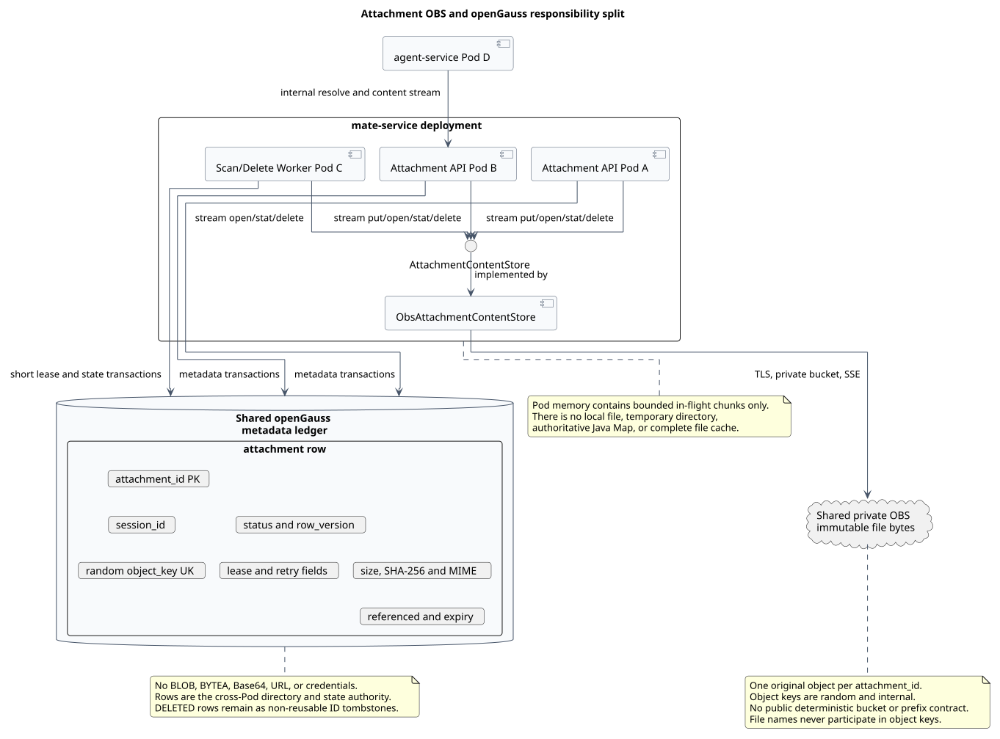
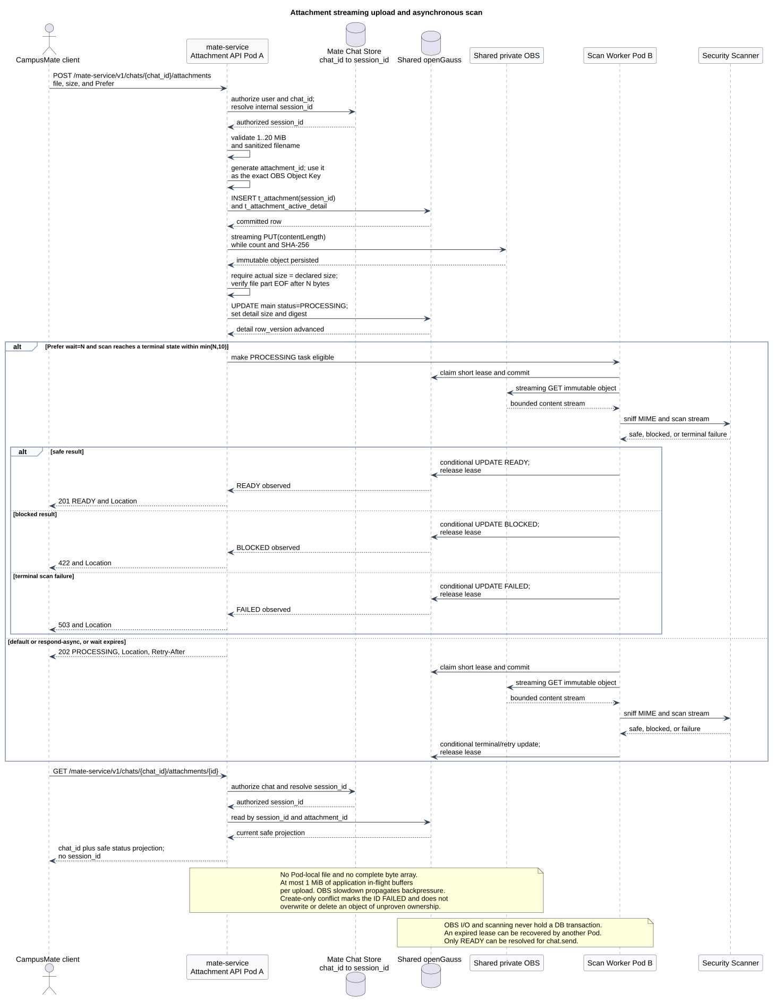
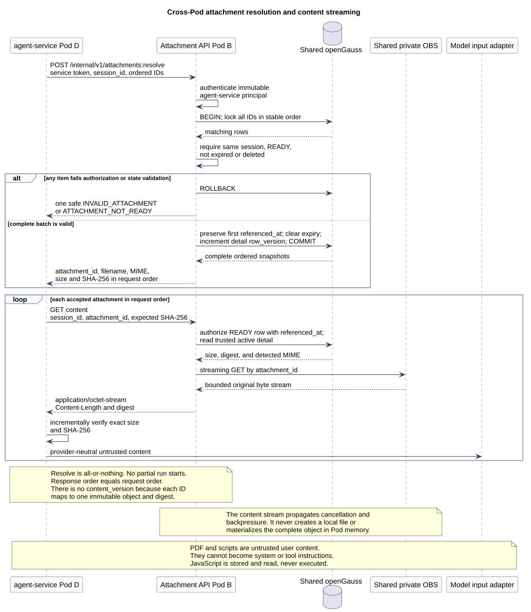
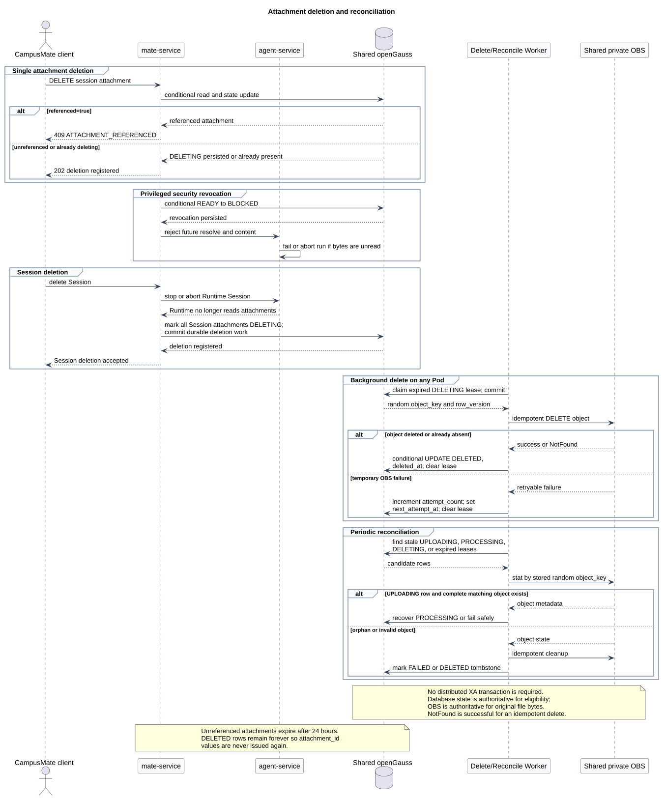

# CampusMate Attachment Service：OBS + openGauss 设计

> 文档编号：`SR-ATTACHMENT-001`<br>
> 版本：`v1.1.0`<br>
> 日期：`2026-08-03`<br>
> 状态：目标设计（target-only）<br>
> 设计仓库基线：`ecf31bc55ca1923dd1c7f90d50ee6763963b7da9`<br>
> pi-mono 基线：`fc85bdd88be93b1e9a6b6bcfa41c684282ec79cc`<br>
> pi-mono-java 基线：`1f7a5423219edfa4519d8719f1cc8a188ed72873`<br>
> OpenClaw 证据基线：`b015925bc30f6a8363f290b07d5f8588e21422b8`

## 1. 结论

CampusMate Attachment Service 采用“文件仓库 + 元数据账本”模型：

```text
OBS           = 文件仓库，保存 PDF、JS 等原始文件字节
openGauss     = 元数据账本，永久身份/状态与活动期运行数据分表保存
attachment_id = 对外唯一附件标识，同时精确作为私有 Bucket 内的 Object Key
```

最终边界如下：

- `mate-service` 承载 Attachment Service，对最终用户提供 HTTP 上传和状态查询；
- 原始文件只保存到共享私有 OBS Bucket，不进入 openGauss；
- openGauss 不保存 Object Key：OBS Object Key 精确等于服务端生成的
  `attachment_id`；
- openGauss 的 `attachment` 主表永久保存身份、Session 归属和状态；
  每个非 `DELETED` 主表行都具有一条 `attachment_active_detail`，包括上传中、
  失败、待删除或正文暂缺的对账状态；只有 `DELETED` tombstone 没有明细；
- `agent-service` 只通过 Attachment Service 内部接口解析和读取附件，不直接访问
  openGauss、OBS 或存储凭据；
- 任意 Pod 都以共享 openGauss 和共享 OBS 为权威来源，Pod 内存只保留有界的在途
  缓冲，不保存附件；
- 不使用 Pod 本地目录、`/tmp`、临时文件或完整 `byte[]`；
- 单文件上限固定为 20 MiB，即 `20 * 1024 * 1024 = 20971520` 字节；
- 一个附件只绑定一个 `session_id`，OBS 内容创建后不可覆盖；重新上传必须生成新的
  `attachment_id`，删除完成后原 ID 仍由主表 tombstone 永久占用；
- PDF、JavaScript 和其他文件均视为不可信用户内容。Attachment Service、
  `mate-service` 和 `agent-service` 都不得执行脚本。

本专题只定义目标接口、数据模型和故障语义，不表示现有 pi、pi-mono-java 或
CampusMate 已经实现这些能力。

## 2. 源码证据与目标设计边界

### 2.1 固定源码观察

| 基线 | 源码证据 | 已观察行为 |
|---|---|---|
| pi-mono `fc85bdd…` | [`packages/agent/src/agent.ts#L336-L395`](https://github.com/badlogic/pi-mono/blob/fc85bdd88be93b1e9a6b6bcfa41c684282ec79cc/packages/agent/src/agent.ts#L336-L395) `prompt()`；[`packages/ai/src/types.ts#L345-L349`](https://github.com/badlogic/pi-mono/blob/fc85bdd88be93b1e9a6b6bcfa41c684282ec79cc/packages/ai/src/types.ts#L345-L349) `ImageContent` | Agent 可接收文本和内联 base64 图片，但没有通用 `attachment_id`、上传状态、OBS 元数据或 Attachment Service |
| pi-mono-java `1f7a542…` | [`UserMessage.java#L20-L31`](https://github.com/superheromeZzh/pi-mono-java/blob/1f7a5423219edfa4519d8719f1cc8a188ed72873/modules/ai/src/main/java/com/campusclaw/ai/types/UserMessage.java#L20-L31)、[`ContentBlock.java#L17-L24`](https://github.com/superheromeZzh/pi-mono-java/blob/1f7a5423219edfa4519d8719f1cc8a188ed72873/modules/ai/src/main/java/com/campusclaw/ai/types/ContentBlock.java#L17-L24)、[`ImageContent.java#L9-L18`](https://github.com/superheromeZzh/pi-mono-java/blob/1f7a5423219edfa4519d8719f1cc8a188ed72873/modules/ai/src/main/java/com/campusclaw/ai/types/ImageContent.java#L9-L18) | `UserMessage` 可以包含封闭的 ContentBlock 联合，但当前只有 text/image/thinking/toolCall；图片仍以内联 base64 表示 |
| pi-mono-java `1f7a542…` | [`docs/plans/ws-chat-followups.md#L12-L37`](https://github.com/superheromeZzh/pi-mono-java/blob/1f7a5423219edfa4519d8719f1cc8a188ed72873/docs/plans/ws-chat-followups.md#L12-L37) | WebSocket 附件输入仍是待设计项，并未实现独立上传和引用协议 |

OpenClaw 基线仅用于同仓库其他 WebSocket 对比文档。本专题没有从 OpenClaw 推导
附件数据面，不把其 Gateway 行为表述为 Attachment Service 现状。

### 2.2 设计分类

| 决策 | 分类 | 原因 |
|---|---|---|
| HTTP 上传、WebSocket 只传 `attachment_id` | 产品约束 | 避免大文件占用 Chat Frame、事件缓冲和重连协议 |
| OBS 保存正文、openGauss 保存元数据 | 架构改造 | 让多 Pod 共享内容，同时避免大对象进入数据库 WAL、主备复制和备份链路 |
| 上传和读取全程流式、无本地文件 | 安全加固 | 限制堆内存和节点磁盘暴露，避免 Pod 路由及重启影响附件可用性 |
| 扫描完成前禁止 `chat.send` | 安全加固 | 模型和下游解析器只能读取经过完整性校验和安全扫描的内容 |
| JS 只读不执行 | 安全加固 | 上传内容不获得代码执行能力，也不能提升为系统指令 |
| 不使用 OBS/openGauss XA | 架构改造 | 通过状态机、条件更新、租约和对账实现可恢复的最终一致性 |

## 3. 部署与跨 Pod 边界



[PlantUML 源码：`attachment_obs_opengauss_storage_split`](./diagram.puml#L108)

跨 Pod 读取不依赖上传 Pod：

```text
CampusMate client
  -> mate-service Pod A
  -> shared private OBS + shared openGauss

agent-service Pod C
  -> mate-service Attachment API Pod B
  -> same shared openGauss
  -> same shared private OBS
```

`AttachmentContentStore` 是 `mate-service` 内的存储端口，不是存储位置。端口的
OBS 适配器运行在每个 Attachment Service Pod 内，所有 Pod 使用相同的 OBS
Endpoint、私有 Bucket 和 openGauss 数据源。每个 Pod 都以同一条纯函数规则
`object_key = attachment_id` 定位正文；不存在需要保存在 Java `Map`、进程缓存、
本地文件或数据库列中的二次映射。

Bucket、Endpoint 和 AK/SK 均为内部实现细节；Object Key 的规范规则是
`attachment_id` 原值：

- AK/SK 从 Kubernetes Secret 或公司既有工作负载身份系统获取；
- 入站用户凭据不得转换为 OBS 长期凭据；
- Bucket 必须私有，通过 TLS 访问并启用服务端加密；
- `attachment_id` 使用密码学安全随机源生成，本身不包含 `session_id`、文件名或
  用户信息；
- OBS 适配器直接把该 ID 作为完整 Object Key，不增加 Bucket Prefix、目录或文件名；
- 不同环境使用独立私有 Bucket，不能通过 Key 前缀区分环境；
- ID 不是访问凭据。每次读取仍必须先通过服务身份、Session 归属、状态和摘要校验；
- Bucket、Endpoint、预签名 URL 和凭据不得进入客户端响应、CampusAgent Prompt、
  WebSocket Frame 或业务日志。

## 4. 标识、归属与不可变性

### 4.1 `attachment_id`

格式固定为：

```text
^attachment_[0-9A-Za-z]{24}$
```

例如：

```text
attachment_011CZm8VpK4rNs6WtY2hDqfB
```

规则如下：

- 只能由 Attachment Service 生成；
- 总长度为 35，大小写敏感，调用方必须逐字节保留；
- openGauss 主键唯一约束是碰撞判断的最终依据；
- 发生碰撞时重新生成，不向调用方返回碰撞值；
- `DELETED` 行永久作为 tombstone 保留，删除 OBS 正文也不能释放 ID；
- ID 不是 Bearer capability。知道格式或值不等于有权读取附件。

### 4.2 Session 单绑定

每个附件在创建时绑定一个全局唯一的 `session_id`，之后不能改绑：

```text
attachment_id -> exactly one session_id -> exactly one immutable OBS object
```

`session_id` 与 CampusAgent Runtime WebSocket 使用同一契约：长度
`1..128`，匹配 `^[A-Za-z0-9][A-Za-z0-9._-]{0,127}$`。Attachment Service
不扩展该字符集，因此不会接受 Runtime 无法创建或恢复的 Session ID。

本设计不保存 `tenant_id` 或 `user_id`。`mate-service` 是 Session 和最终用户授权的
权威服务；Attachment 表只记录 Runtime 所需的 `session_id`。跨 Session 使用同一
文件时必须重新上传并获得新 ID。

本版没有 `content_version`。原因是一个 `attachment_id` 只对应一次不可覆盖的
OBS 内容创建：

- 内容改变时生成新的 `attachment_id`；
- 历史以 `attachment_id + sha256` 固定原始内容；
- 不提供覆盖、回滚、跨 Session 复用或版本选择接口。

## 5. 上传接口和处理流程

### 5.1 HTTP 请求

上传接口由 `mate-service` 提供：

```http
POST /mate-service/v1/sessions/01ARZ3NDEKTSV4RRFFQ69G5FAV/attachments HTTP/1.1
Host: api.example.com
Authorization: Bearer <campusmate-access-token>
Content-Type: multipart/form-data; boundary=...
X-Attachment-Size: 182734
Prefer: respond-async

--...
Content-Disposition: form-data; name="file"; filename="orders.pdf"
Content-Type: application/pdf

<file bytes>
--...--
```

`X-Attachment-Size` 表示单个 `file` part 的字节数，不是整个 multipart HTTP Body
的 `Content-Length`。客户端可从浏览器 `File.size` 或服务端文件元数据取得该值。
v1 不接受无法预先确定正文长度的上传流。

`file` part 的 `Content-Disposition` 必须包含非空 `filename`。服务端先按
Unicode NFC 规范化，再移除控制字符和 `/`、`\` 路径分隔符；规范化结果必须为
`1..512` 个 Unicode code point，否则返回 `400 INVALID_REQUEST`。该值只作为
不可信显示名保存，不能参与 MIME 判断、Object Key、路径或授权。

服务端同时执行三层校验：

1. Header 声明值必须位于 `1..20971520`；
2. OBS 流式上传使用同一 `contentLength`；
3. 计数流观察到的实际字节数必须等于声明值，且不得超过 20 MiB。

仅把声明值传给 OBS SDK 不足以证明长度一致：当客户端小报长度时，
SDK 可能只读取声明的 N 个字节就完成 PUT。因此 PUT 返回后还必须确认
`file` part 已到 EOF；可以由 multipart 框架提供精确 part 长度，或在已读
N 字节后进行有界的一字节探测。如果还有字节，必须删除已写对象并返回
`ATTACHMENT_SIZE_MISMATCH`；如果实际已超过 20 MiB，返回
`ATTACHMENT_TOO_LARGE`。流在 N 字节之前就到 EOF 同样视为长度不匹配。

HTTP `Content-Length` 包含 multipart boundary、文件名和表单头，不能替代
`X-Attachment-Size`。华为云 OBS Java SDK 官方文档说明流式上传以
`java.io.InputStream` 作为对象数据源；其进度文档同时要求流式上传配置对象
`Content-Length`，见[流式上传](https://support.huaweicloud.com/sdk-java-devg-obs/obs_21_0602.html)和
[上传进度](https://support.huaweicloud.com/eu/sdk-java-devg-obs/obs_21_0604.html)。

### 5.2 服务端处理顺序



[PlantUML 源码：`attachment_upload_and_scan_flow`](./diagram.puml#L6)

处理顺序固定为：

```text
authorize user and session
  -> validate multipart and X-Attachment-Size
  -> generate attachment_id; use it as the exact OBS Object Key
  -> INSERT attachment(status=UPLOADING) and attachment_active_detail
  -> stream exactly one file part to OBS
       while counting bytes and calculating SHA-256
  -> require actual bytes == X-Attachment-Size
  -> UPDATE main status=PROCESSING and detail size_bytes/sha256
  -> enqueue/lease asynchronous scan
  -> return according to Prefer
```

只有 OBS 写入成功且 openGauss 已进入 `PROCESSING` 后，上传接口才可以返回
`attachment_id`。如果客户端在上传中断开，服务端停止读取，取消或清理未完成的
OBS 写入，并将数据库记录标记为 `FAILED`；不得把半个文件进入扫描队列。

扫描 Worker 从 OBS 重新流式读取，完成：

- 实际长度和 SHA-256 复核；
- 基于内容的 MIME 嗅探，不信任 multipart 声明；
- 病毒和恶意内容扫描；
- PDF、压缩格式等解析复杂度限制；
- 终态更新为 `READY`、`BLOCKED` 或 `FAILED`。

multipart 声明 MIME 是不可信请求数据，本版不持久化。扫描器只把基于内容嗅探
得到的 `detected_media_type` 持久化为无参数 `type/subtype`，并用
`Locale.ROOT` 规范化为小写。
只有 `READY` 可以用于 CampusAgent `chat.send`。`BLOCKED` 表示内容被安全策略拒绝；
`FAILED` 表示上传、存储或扫描基础设施失败，不能被模型读取。

### 5.3 同步等待与异步返回

`Prefer` 采用 [RFC 7240](https://www.rfc-editor.org/rfc/rfc7240.html) 定义的
`respond-async` 和 `wait` 语义。v1 每次请求只接受一个偏好值：

| 请求 | 行为 |
|---|---|
| 省略 `Prefer` | OBS 写入和 `PROCESSING` 提交完成后立即返回 `202` |
| `Prefer: respond-async` | 同上，返回 `202` 和状态资源位置 |
| `Prefer: wait=N` | `N` 为最多 10 位的非负十进制秒数；服务端最多等待 `min(N, 10)` 秒 |

等待只影响 HTTP 响应时机，不改变后台状态机：

- 等待期间到达 `READY`：返回 `201 Created`；
- 等待期间到达 `BLOCKED`：返回 `422 Unprocessable Content`；
- 等待期结束仍为 `PROCESSING`：返回 `202 Accepted`；
- 扫描依赖暂时不可用时保持 `PROCESSING` 并返回 `202`，由 Worker 重试；
- 上传或存储未能建立可用状态资源，或扫描已进入终态 `FAILED`时，
  返回 `503 Service Unavailable`；如果资源已创建，同时返回 `Location`；
- `202` 必须带 `Location` 和 `Retry-After`；
- `422` 必须带 `Location`，让客户端仍可查询或删除已创建的资源；
- 服务端实际采用偏好时返回 `Preference-Applied`。

这里的“立即”是指服务端已完整接收正文、OBS 持久化成功且 openGauss 已提交
`PROCESSING` 之后立即响应，不是跳过文件上传。

客户端轮询：

```http
GET /mate-service/v1/sessions/{session_id}/attachments/{attachment_id}
```

上传请求不提供同 ID 幂等保证。调用方没有收到确定响应时重新上传，会得到新的
`attachment_id`；旧的未引用附件由 24 小时清理任务回收。

完整公共和内部 HTTP 契约见
[`attachment-api.openapi.yaml`](./attachment-api.openapi.yaml)。

## 6. 状态机

```text
UPLOADING -> PROCESSING -> READY
    |              |          +-> DELETING -> DELETED
    |              +-> BLOCKED -> DELETING -> DELETED
    |              +-> FAILED --> DELETING -> DELETED
    +-> FAILED ----------------> DELETING -> DELETED

READY -- privileged security revocation --> BLOCKED

READY(unreferenced) -> READY(referenced)
READY(referenced)   -> DELETING only through Session deletion
```

状态含义：

| 状态 | 是否可用于 `chat.send` | 说明 |
|---|---:|---|
| `UPLOADING` | 否 | 数据库记录已创建，OBS 写入尚未确认 |
| `PROCESSING` | 否 | OBS 正文已持久化，等待或正在扫描 |
| `READY` | 是 | 完整性和安全扫描通过 |
| `BLOCKED` | 否 | 恶意或策略禁止内容；正文等待安全清理 |
| `FAILED` | 否 | 上传、存储、校验或扫描失败 |
| `DELETING` | 否 | 已阻止新读取，等待删除 OBS 正文 |
| `DELETED` | 否 | 正文已删除，只保留不可复用 tombstone |

所有状态变更都在事务中先锁定 `attachment` 主表，再使用活动明细表的
`row_version` 做条件更新。服务不得仅在内存中改变状态，也不得在 OBS I/O 或
安全扫描期间持有数据库事务。

常规扫描仅执行 `PROCESSING -> READY | BLOCKED | FAILED`。当病毒库、
合规策略或人工处置在事后撤销已就绪内容时，只允许受审计的特权
控制面以条件更新执行 `READY -> BLOCKED`。之后新的 resolve/content 立即
失败；尚未读取该正文的 active run 必须失败或中止。历史保留元数据快照
和撤销状态，但系统无法撤回已经交给模型的字节。已 referenced 正文的
常规单独删除仍返回 `409`，直到 Session 删除流程才进入 `DELETING`。

## 7. openGauss 元数据账本

### 7.1 为什么不把文件正文存进数据库

openGauss 官方文档确实提供 BLOB 和 BYTEA，见
[Binary Types](https://docs.opengauss.org/en/docs/7.0.0-RC3/sql_reference/binary_types.html)。
本设计仍明确不使用这些类型保存附件正文，因为 PDF、脚本等大对象进入数据库会
同时扩大：

- WAL 和主备复制流量；
- 数据库备份、恢复和容灾窗口；
- JDBC 大对象读写及连接占用；
- 热元数据查询与文件 I/O 的资源竞争。

OBS 负责大对象吞吐，openGauss 负责关系约束、状态查询、条件更新和多 Pod 任务
认领。openGauss 支持主键、唯一、`CHECK` 等约束，见
[Constraints](https://docs.opengauss.org/en/docs/latest/sql_reference/constraints.html)。

### 7.2 永久主表与活动明细表

完整 DDL 见 [`schema.sql`](./schema.sql)。两张表都不包含 `BLOB`、`BYTEA`、
Base64、独立 `object_key` 映射列、ETag、上传方声明 MIME 或文件正文；
主键 `attachment_id` 的值本身就是 Object Key。

`attachment` 是永久身份与状态主表：

| 字段 | 类型 | 作用 |
|---|---|---|
| `attachment_id` | `VARCHAR(35)` | 主键、对外 ID，同时精确作为 OBS Object Key；永久不复用 |
| `session_id` | `VARCHAR(128)` | 不可变的 Session 归属，也用于删除后的最小审计 |
| `status` | `VARCHAR(16)` | 上传、扫描、撤销和删除状态机；删除后固定为 `DELETED` |
| `created_at` | `TIMESTAMPTZ(3)` | 附件身份创建时间 |
| `deleted_at` | `TIMESTAMPTZ(3)` | OBS 正文完成删除的时间；只在 `DELETED` 时非空 |

主表永不物理删除。删除完成后，它精确只保留：

```text
attachment_id
session_id
status = DELETED
created_at
deleted_at
```

`attachment_active_detail` 是与主表一对一的活动期明细表。除用于关联的
`attachment_id VARCHAR(35) PRIMARY KEY REFERENCES attachment` 外，只保存以下
运行字段：

| 字段 | 类型 | 具体作用 |
|---|---|---|
| `filename` | `VARCHAR(512)` | 保存清理后的显示名，供状态查询、Runtime resolve 和 Message 元数据快照使用；不参与 MIME 判断或 OBS 定位 |
| `detected_media_type` | `VARCHAR(127)` | 保存扫描器基于正文嗅探出的可信 MIME；用于 `READY` 校验、Runtime 内容类型判断和 Model Provider 能力匹配 |
| `expected_size_bytes` | `BIGINT` | 保存已验证的 `X-Attachment-Size`；用于 20 MiB 准入、OBS 已知长度流式 PUT 和声明长度校验 |
| `size_bytes` | `BIGINT` | 保存服务端实际流式计数；必须等于 `expected_size_bytes`，并用于扫描复核及 Runtime `Content-Length` 校验 |
| `sha256` | `CHAR(64)` | 保存原始正文摘要；上传、扫描、resolve 快照、历史恢复和 Runtime 内容流均用它验证同一份不可变内容 |
| `referenced_at` | `TIMESTAMPTZ(3)` | 首次成功 resolve 的时间；非空本身就表示“已被 Session 引用”，用于拒绝单附件删除，不再另设 `referenced` 布尔列 |
| `expires_at` | `TIMESTAMPTZ(3)` | 未引用附件的清理期限，创建时为 `created_at + 24 hours`；首次引用时清空，供 24 小时清理任务筛选 |
| `error_code` | `VARCHAR(64)` | 保存有界、脱敏的稳定失败码，支持轮询、重试决策和运维诊断；不保存供应商响应正文或秘密 |
| `attempt_count` | `INTEGER` | 记录当前扫描、删除或对账阶段已经尝试的次数，用于退避和告警 |
| `next_attempt_at` | `TIMESTAMPTZ(3)` | 指定当前后台阶段最早可重试时间，避免故障时热点循环 |
| `lease_owner` | `VARCHAR(128)` | 标识当前认领任务的 Worker Pod/实例，只在租约有效期内代表所有权 |
| `lease_until` | `TIMESTAMPTZ(3)` | 租约到期时间；Worker 崩溃后其他 Pod 可据此接管扫描、删除或对账 |
| `row_version` | `BIGINT` | 活动数据的乐观锁版本，防止 resolve、扫描、删除和租约续期互相覆盖 |

这些字段分别支撑五类必需能力：

1. **MIME 和大小校验**：`detected_media_type + expected_size_bytes + size_bytes`；
2. **SHA-256 完整性校验**：`sha256` 与 `size_bytes` 共同固定正文；
3. **是否已被 Session 引用**：`referenced_at IS NOT NULL`，无需重复布尔状态；
4. **24 小时未引用清理**：`referenced_at IS NULL AND expires_at <= now()`，并排除
   `FAILED + OBJECT_KEY_CONFLICT` quarantine；
5. **扫描和删除任务恢复**：`error_code + attempt_count + next_attempt_at +
   lease_owner + lease_until + row_version`。

创建附件时，在同一事务中写入主表和明细表。每个非 `DELETED` 主表记录必须恰有
一条明细；每个 `DELETED` 主表记录必须没有明细。普通外键只能保证“明细一定有
主表”，反向存在性由 Repository 的事务不变量和一致性巡检保证。

关键约束如下：

- `attachment_id` 匹配 `^attachment_[0-9A-Za-z]{24}$`，主表永久占用该 ID；
- `expected_size_bytes` 和 `size_bytes` 均在 `1..20971520`，实际值非空时必须相等；
- `READY` 事务必须保证 `detected_media_type/size_bytes/sha256` 全部非空；
- `referenced_at` 与 `expires_at` 互斥：未引用时前者为空、后者非空，引用后相反；
- `lease_owner` 和 `lease_until` 同时为空或同时非空；
- `DELETED` 必须具有 `deleted_at`，并且明细行已经删除；
- 不保存 `updated_at` 或 `ready_at`。v1 只保留业务所需的创建、首次引用、到期和
  删除时间，后续若需要完整状态审计应增加事件表，而不是扩张永久 tombstone。

索引按两张表职责拆分：主表提供 `(session_id, status)`、`status` 和
`deleted_at`；明细表提供 `next_attempt_at` 和 `expires_at`。Attachment Service
部署使用 UTF-8、大小写敏感的比较语义；上线前必须用实际 openGauss JDBC 驱动
验证 `attachment_A...` 与 `attachment_a...` 不会被错误归一化。

### 7.3 租约认领与阶段恢复

Worker 只在短事务中认领任务，并按固定顺序先锁主表、再锁明细表：

```text
BEGIN
  select attachment and attachment_active_detail; lock in stable ID order
  require eligible status and expired/empty lease
  set lease_owner, lease_until, row_version = row_version + 1
COMMIT

read/scan/delete OBS object by attachment_id without a database transaction

BEGIN
  update status plus terminal/retry fields
  where attachment_id = ? and lease_owner = ? and row_version = ?
COMMIT
```

进入新的后台阶段时，应用按阶段语义重置 `attempt_count`、`next_attempt_at`、
`lease_owner`、`lease_until` 和 `error_code`。Pod 崩溃后 `lease_until` 到期，其他
Pod 可以重新认领；任务和 OBS 操作都必须按 `attachment_id` 幂等，不能依赖某个
Worker 的本地状态。

## 8. OBS 内容仓库和内存边界

目标端口：

```java
interface AttachmentContentStore {
    CompletionStage<StoredObject> put(
        String attachmentId,
        InputStream content,
        long contentLength);

    InputStream open(String attachmentId);

    CompletionStage<ObjectMetadata> stat(String attachmentId);

    CompletionStage<Void> delete(String attachmentId);
}
```

`ObsAttachmentContentStore` 是目标适配器。接口参数必须是服务端已验证格式和授权
上下文的 `attachmentId`；适配器把它原样作为完整 OBS Object Key，不查询映射，
也不添加前缀、目录、Session ID 或文件扩展名。客户端和 agent-service 仍不能
直接调用该存储端口。

每个附件在 OBS 中只有一份原始内容对象。`put` 必须使用“仅创建、不覆盖”的
条件语义。由于主表和明细已在 PUT 前提交、上传流也不可重放，发现同名对象时
不能在同一请求中悄悄换 ID 或覆盖/删除这个来源不明的对象：服务端将当前主表
标记为 `FAILED`，明细写入稳定 `error_code=OBJECT_KEY_CONFLICT`，返回有界的
`ATTACHMENT_STORAGE_UNAVAILABLE`，并要求客户端重新上传以获得新 ID。该记录
不进入普通 24 小时自动删除；运维对账只有在证明对象归属并安全删除或确认
`NotFound` 后，才能删除明细并留下五字段 `DELETED` tombstone。文件名不能参与
Object Key。

内存和本地存储约束：

```text
HTTP multipart stream
  -> bounded mate-service buffers
  -> OBS SDK streaming PUT
  -> shared private OBS
```

- 单上传应用层在途缓冲总量不超过 1 MiB；
- 总内存预算按“最大并发上传数 × 单上传缓冲”配置并监控；
- OBS 变慢时暂停读取客户端，不能无限排队；
- SHA-256、实际大小和有限 MIME 样本在流经时增量计算；
- 扫描器从 OBS 重新流式读取，不保留上传副本；
- 禁止 `Files.createTempFile`、`FilePart.transferTo(Path)`、
  `MultipartFile.getBytes()`、`DataBufferUtils.join()`、`collectList()` 和完整
  `ByteArrayOutputStream`；
- 如果 OBS SDK、扫描器或 Model Provider 只能接受本地文件或完整字节数组，v1
  不得启用该实现或宣称支持对应格式。

允许网络栈和 SDK 短暂持有少量分块缓冲，但不能形成第二份完整、持久化的文件。

## 9. Runtime 批量解析和内容流



[PlantUML 源码：`attachment_cross_pod_resolution_flow`](./diagram.puml#L198)

### 9.1 批量 resolve

内部接口：

```http
POST /mate-service/internal/v1/attachments:resolve
Authorization: Bearer <agent-service-access-token>
Content-Type: application/json

{
  "session_id": "01ARZ3NDEKTSV4RRFFQ69G5FAV",
  "attachment_ids": [
    "attachment_011CZm8VpK4rNs6WtY2hDqfB"
  ]
}
```

Attachment Service 在一个短 openGauss 事务中：

1. 按稳定顺序锁定请求中的全部记录，避免并发 resolve 死锁；
2. 校验 agent-service 的不可变服务身份；
3. 校验每项都绑定当前 `session_id`、状态为 `READY`、未删除且未过期；
4. 不存在、跨 Session、已删除、已过期、`BLOCKED` 或 `FAILED` 统一返回
   `INVALID_ATTACHMENT`；只有在已确认当前 Session 归属后，`UPLOADING/PROCESSING`
   才可以整批返回 `ATTACHMENT_NOT_READY`；任一失败都整体回滚；
5. 全部成功后原子执行
   `referenced_at=COALESCE(referenced_at, now())`、`expires_at=NULL` 并递增
   `row_version`；`referenced_at IS NOT NULL` 是单向的已引用状态，不存在 release；
6. 按请求顺序返回 `attachment_id/filename/media_type/size_bytes/sha256`。

Resolve 返回资源 ID，但不返回 OBS Bucket、Endpoint、URL、凭据或本地路径。
虽然 Object Key 的值恰好等于 `attachment_id`，该 ID 不是访问能力；私有 Bucket
和 Attachment Service 授权仍是强制边界。批量接受是全有或全无；不得启动
“少一个附件”的 run。

Resolve 与 agent-service 的 RuntimeSessionStore 不做 XA。如果 resolve 成功后
模型预检、Message 提交或 run 创建失败，该附件会保守地继续保留，直到
Session 删除；不能把 `referenced_at` 清空而导致已经进入历史的附件被 24 小时
任务误删。这是简化单向标记的有意代价。

### 9.2 内容流

```http
GET /mate-service/internal/v1/sessions/{session_id}/attachments/{attachment_id}/content
Authorization: Bearer <agent-service-access-token>
X-Expected-Attachment-SHA256: <64-lowercase-hex>
```

Attachment Service：

1. 用服务身份、`session_id`、`attachment_id` 和期望 SHA-256 查询 openGauss；
2. 只允许读取 `READY` 且 `referenced_at IS NOT NULL` 的活动明细；
3. 直接使用已验证的 `attachment_id` 作为完整 OBS Object Key；
4. 从 OBS 向 agent-service 流式代理，传播取消和背压；
5. 不在内存或本地磁盘聚合完整文件。

agent-service 仍要按 resolve 快照增量校验实际字节数和 SHA-256。历史重放使用同一
`session_id + attachment_id + expected_sha256`，不会选择“最新版本”，因为本设计
根本不允许覆盖附件内容。

Attachment Resolver 是固定 Runtime 组件，不注册成模型可见 Tool。模型只能看到
Provider 支持的内容块，不能获得 OBS Bucket、Endpoint、读取 Header 或服务凭据。

## 10. 删除和保留

### 10.1 单附件删除

公共接口：

```http
DELETE /mate-service/v1/sessions/{session_id}/attachments/{attachment_id}
```

- `referenced_at IS NULL` 且不是 `FAILED + OBJECT_KEY_CONFLICT`：条件更新为
  `DELETING`，返回 `202`；Worker 异步删除 OBS 正文，再原子删除活动明细并把
  主表更新为 `DELETED`；
- `FAILED + OBJECT_KEY_CONFLICT`：不改变状态并返回有界
  `503 ATTACHMENT_STORAGE_UNAVAILABLE`、`retryable=false`；公共请求不能删除
  来源不明对象；
- `referenced_at IS NOT NULL`：返回 `409 ATTACHMENT_REFERENCED`，避免既有 Session 历史
  失去原始内容；
- 重复删除 `DELETING/DELETED`：返回当前删除状态，保持幂等；
- 单附件删除不可恢复。需要再次使用时重新上传并获得新 ID。

除存储冲突隔离记录外，未引用附件从创建起最多保留 24 小时。到期任务使用
`referenced_at IS NULL AND expires_at <= now()`，并显式排除
`status=FAILED AND error_code=OBJECT_KEY_CONFLICT` 后，才认领并进入 `DELETING`。

### 10.2 Session 删除

Session 是附件保留的唯一业务边界。上层删除 Session 时：

1. `mate-service` 先请求 agent-service 停止或中止该 Runtime Session；
2. Attachment Service 将该 `session_id` 下所有非 `DELETED` 且不是
   `FAILED + OBJECT_KEY_CONFLICT` 的记录条件更新为 `DELETING`；
3. Worker 以 `attachment_id` 为 Key 幂等删除对应 OBS 对象；
4. 在一个 openGauss 事务中删除 `attachment_active_detail`，再把主表更新为
   `DELETED` 并写入 `deleted_at`；
5. 若存在 `OBJECT_KEY_CONFLICT`，Session 立即停止 Runtime 使用并对用户不可见，
   但存储删除状态保持 pending/quarantined、触发高优先级告警，不能宣称所有
   字节已删除；只有受审计 reconciliation 证明对象归属并安全删除或确认
   `NotFound`，再删除明细、写入 tombstone 后，才报告存储清理完成；
6. 没有冲突隔离记录时，Session 删除状态在所有附件删除任务被可靠登记后完成。

本版不提供附件恢复、跨 Session claim、引用计数或合规保留模型。因为每个附件只
属于一个 Session，Session 删除是常规强制清理入口；来源不明的存储冲突必须先
经过受审计 quarantine/reconciliation，不能为追求完成状态而删除未知对象。

## 11. 一致性、补偿和多 Pod 恢复



[PlantUML 源码：`attachment_deletion_and_reconciliation`](./diagram.puml#L281)

OBS 和 openGauss 不参加同一个 XA 事务。服务通过状态机、唯一约束、条件更新、
短租约和周期对账恢复：

| 故障点 | 可观察状态 | 补偿 |
|---|---|---|
| DB 插入成功、OBS 上传失败 | `UPLOADING` 或 `FAILED` | 标记 `FAILED`；只有上传回执或请求上下文能证明对象由本次尝试创建时，才按 `attachment_id` 清理残留对象 |
| create-only PUT 发现同名对象 | `FAILED + OBJECT_KEY_CONFLICT`，来源不明对象仍存在 | 不覆盖、不删除且退出普通清理；客户端新上传，受审计对账确认归属后再安全删除并收束 tombstone |
| OBS 上传成功、DB 更新 `PROCESSING` 失败 | `UPLOADING` + OBS 对象 | 对账任务直接以 `attachment_id` 执行 `stat`；校验成功后恢复为 `PROCESSING`，否则删除对象并失败 |
| 上传响应丢失 | 客户端不知道 ID，服务端可能已 `PROCESSING` | 客户端重新上传获得新 ID；旧的未引用记录 24 小时后清理 |
| 扫描 Pod 崩溃 | `PROCESSING` 且 lease 到期 | 其他 Pod 重新认领并从 OBS 重扫 |
| DB 已 `DELETING`、OBS 删除失败 | `DELETING` | 增加 `attempt_count`、设置 `next_attempt_at` 并退避重试 |
| OBS 已删、DB 收尾事务失败 | `DELETING` + 活动明细，OBS `NotFound` | 将 `NotFound` 视为幂等成功，重试“删除明细 + 主表写入 DELETED/deleted_at”的事务 |
| 上传 Pod 与读取 Pod 不同 | 共享 DB 和 OBS 均可见 | 任意 Pod 校验账本后按 `attachment_id` 从 OBS 流式读取 |

缓存只能保存非权威元数据。缓存未命中或 Pod 重启必须回源 openGauss/OBS；缓存
命中也不能绕过 Session、状态和 SHA-256 校验。

## 12. 安全与日志边界

- 公共接口复用 CampusMate 现有用户认证，内部接口只接受 agent-service 的短期
  service-to-service access token；
- Attachment Service 根据当前认证上下文判断 Session 权限，不接受请求体自报
  tenant/user；
- 不存在、越权、跨 Session、过期或删除统一投影为 `INVALID_ATTACHMENT`；
- 上述统一投影适用于 Runtime `resolve/content` 和无权的公共请求。已通过
  Session 授权的公共状态 GET 可以返回活动期 `DELETING` 状态或仅含五个字段的
  `DELETED` tombstone，便于客户端确认异步删除；
- 文件名在保存前去除控制字符和路径分隔符，UI 显示时仍需转义；
- multipart 声明 MIME 不持久化，Runtime 只使用 `detected_media_type`；
- 日志只记录 `attachment_id`、Session 的受控摘要、状态、大小、耗时和稳定错误码；
- 日志可记录受控的 `attachment_id`，但不得记录 Bucket、Endpoint、AK/SK、
  Authorization、文件正文或原始恶意载荷；
- 病毒扫描结果只保存有界状态和规则标识，不保存扫描器内部秘密；
- JavaScript、Shell、HTML 和 Office 宏等均为不可信字节，不在 mate-service 或
  agent-service 进程内执行；
- 后续若需要代码执行，必须另行设计隔离 Sandbox Tool，不得扩展附件读取路径
  获得执行权限。

## 13. 错误语义

| 错误码 | HTTP | 可重试 | 说明 |
|---|---:|---:|---|
| `INVALID_REQUEST` | 400 | 否 | multipart、Header 或参数无效 |
| `ATTACHMENT_TOO_LARGE` | 413 | 否 | 声明或实际字节数超过 20 MiB |
| `ATTACHMENT_SIZE_MISMATCH` | 400 | 否 | 实际长度与 `X-Attachment-Size` 不同 |
| `SESSION_NOT_FOUND` | 404 | 否 | 公共上传时 Session 不存在或无权访问 |
| `INVALID_ATTACHMENT` | 404 | 否 | ID 不存在、跨 Session、删除、过期或无权访问的统一投影 |
| `ATTACHMENT_NOT_READY` | 409 | 是 | 已授权附件仍为 `UPLOADING/PROCESSING` |
| `ATTACHMENT_BLOCKED` | 422 | 否 | 安全扫描拒绝内容 |
| `ATTACHMENT_REFERENCED` | 409 | 否 | 已进入 Session 消息历史，不能单独删除 |
| `ATTACHMENT_CONTENT_MISMATCH` | 409 | 否 | 内容读取期望 SHA-256 与账本不一致 |
| `ATTACHMENT_STORAGE_UNAVAILABLE` | 503 | 视情况 | OBS 暂时不可用时可按 `Retry-After` 重试；`OBJECT_KEY_CONFLICT` 投影为同一非泄露码但 `retryable=false`，同一 ID 只能等待受审计对账，上传方应新建上传 |
| `ATTACHMENT_SCAN_UNAVAILABLE` | 503 | 是 | 扫描服务暂时不可用 |

错误响应只返回有界、脱敏信息。内部存储错误、Bucket/Endpoint 和供应商响应正文
不得进入 `details`。

## 14. 文档制品和实施端口

本专题包含：

- [`attachment-api.openapi.yaml`](./attachment-api.openapi.yaml)：公共上传、查询、
  删除及内部 resolve/content 的 OpenAPI 3.1 契约；
- [`schema.sql`](./schema.sql)：openGauss 表、约束、索引和注释；
- [`diagram.puml`](./diagram.puml)：四个稳定命名的 PlantUML 图源；
- 四个由 PlantUML 生成的 SVG。

目标 Java 端口：

```java
interface AttachmentContentStore {
    CompletionStage<StoredObject> put(
        String attachmentId,
        InputStream content,
        long contentLength);

    InputStream open(String attachmentId);

    CompletionStage<ObjectMetadata> stat(String attachmentId);

    CompletionStage<Void> delete(String attachmentId);
}
```

Repository 和状态机是独立端口，负责 openGauss 事务、租约、条件更新及
主表/活动明细生命周期。`ObsAttachmentContentStore` 只执行
`Object Key = attachment_id` 的字节操作，不负责用户授权或业务状态转换。

## 15. 验收场景

### 15.1 上传和内存

- 接受 1 字节和 20 MiB 文件；拒绝 0 字节与 `20 MiB + 1 byte`；
- 缺失 filename、NFC 规范化并移除控制字符/路径分隔符后为空或超过 512 个
  code point 时返回 `400`；合法显示名不参与 Object Key；
- 声明长度大于或小于实际长度均失败，不进入 `PROCESSING`；
- create-only PUT 发现同名对象时不覆盖、不删除也不复用上传流；当前 ID 进入
  `FAILED/OBJECT_KEY_CONFLICT` 并退出普通清理，客户端新上传获得新 ID；
- 上传中断不产生可读取的半文件；
- 并发压测中，堆使用量按“并发数 × 1 MiB 上限”增长，而不是按完整文件大小增长；
- Pod 文件系统和 `/tmp` 不出现上传正文；
- OBS 降速时对 HTTP 请求施加背压。

### 15.2 状态与客户端

- 默认和 `respond-async` 返回 `202 + Location + Retry-After`；
- `wait=N` 在 10 秒上限内返回 `201`、`202`、`422` 或 `503`；返回
  `422/503` 且资源已创建时包含 `Location`；
- 轮询能观察 `PROCESSING -> READY/BLOCKED/FAILED`；
- 特权安全撤销能执行 `READY -> BLOCKED`，之后的 resolve/content 均被拒绝；
- 只有 `READY` 能被批量 resolve。

### 15.3 多 Pod 和故障恢复

- Pod A 上传、Pod B 扫描、Pod C 查询、agent-service Pod D 读取均成功；
- 删除或重启任一 Pod 不影响已 `READY` 的共享附件；
- 扫描 lease 到期可被其他 Pod 接管；
- OBS 成功/DB 失败、DB 成功/OBS 失败和删除失败均由对账恢复；
- OBJECT_KEY_CONFLICT 只有经审计确认对象归属并安全删除或确认 NotFound 后，
  才能删除活动明细并转为五字段 `DELETED` tombstone；
- 缓存清空后仍可仅凭共享 DB/OBS 恢复。

### 15.4 授权、完整性和删除

- 跨 Session、错误服务身份、非 READY、过期和删除记录均被拒绝；
- 批量 resolve 要么全部设置首次 `referenced_at` 并清空 `expires_at`，要么全部不变；
- 内容流必须与 `size_bytes + sha256` 一致；
- 未引用且非存储冲突隔离的附件可单独删除，已引用返回 `409`；
- 非隔离的 24 小时未引用附件自动清理；Session 删除不可恢复，隔离行则让
  存储清理保持 pending 直到受审计 reconciliation；
- PDF 和 JS 都按原始不可信字节处理，JS 从不执行。

## 16. 图表生成与验证

在专题目录执行：

```bash
plantuml -tsvg diagram.puml
```

提交前验证：

- OpenAPI 3.1 YAML 可解析，所有 `$ref` 能解析；
- `schema.sql` 只有元数据列，不包含 BLOB/BYTEA；
- `.puml` 只含 ASCII，且没有 Mermaid；
- 四个 SVG 均为有效 XML并与图源同步；
- Markdown 中每个 SVG 路径和 PlantUML 行锚存在；
- `git diff --check` 通过；
- 三份用户元数据 JSON 不进入本专题提交。

## 17. 版本历史

| 版本 | 日期 | 变更 |
|---|---|---|
| `v1.1.0` | 2026-08-03 | Object Key 收敛为 `attachment_id`；openGauss 拆分永久身份/状态主表与非 DELETED 明细表；删除完成后清理明细，只保留五字段 `DELETED` tombstone；移除独立 Object Key、ETag、声明 MIME 和重复引用布尔列；冻结 filename 规范化，并闭合 create-only 冲突的安全对账流程 |
| `v1.0.0` | 2026-08-03 | 首版目标设计；确定 OBS 正文、openGauss 元数据、20 MiB 流式上传、异步扫描、内部批量解析、跨 Pod 读取、租约和补偿边界 |
