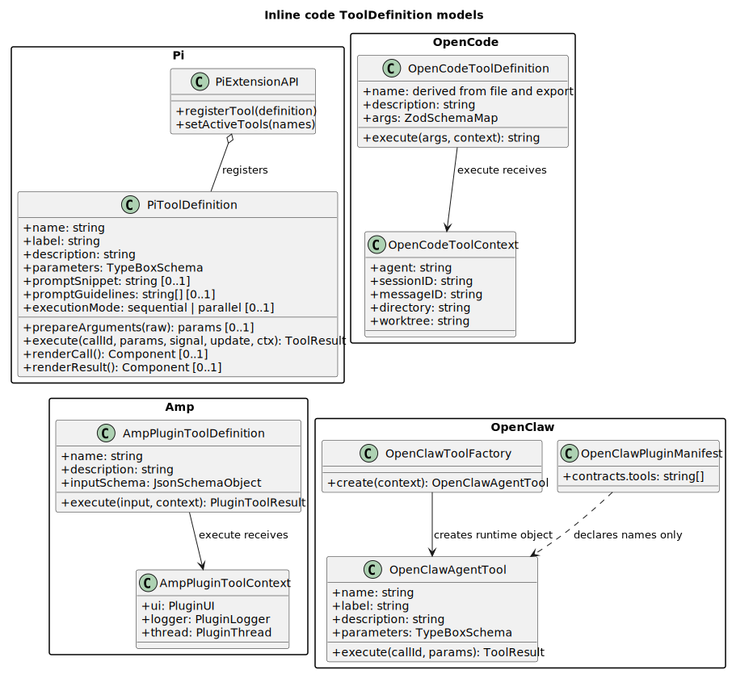
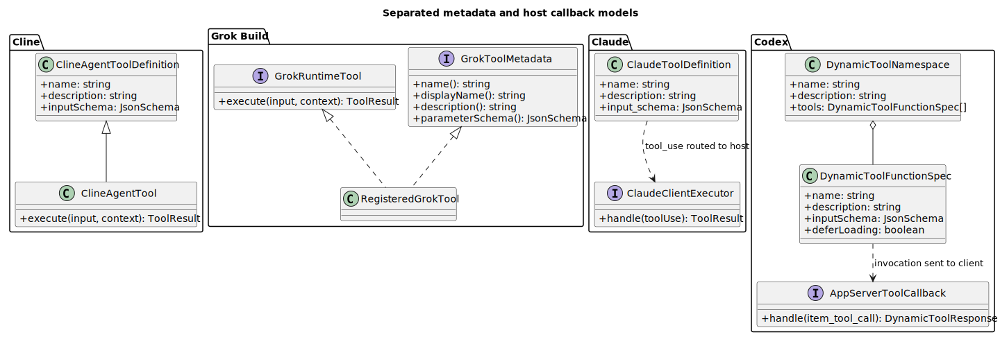
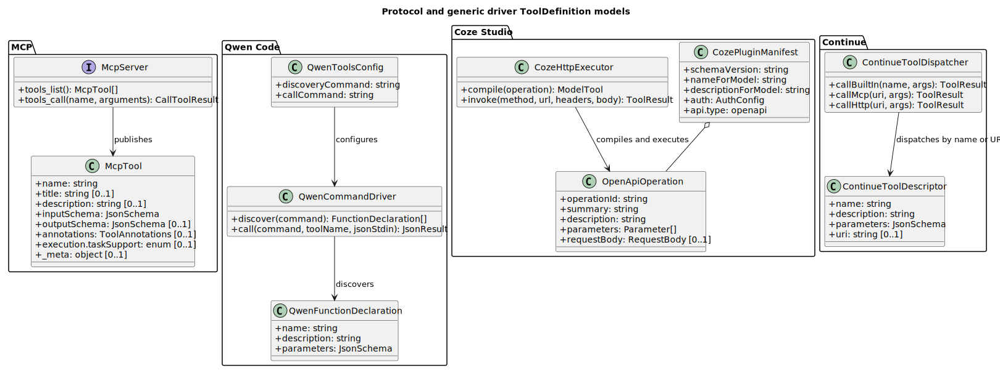
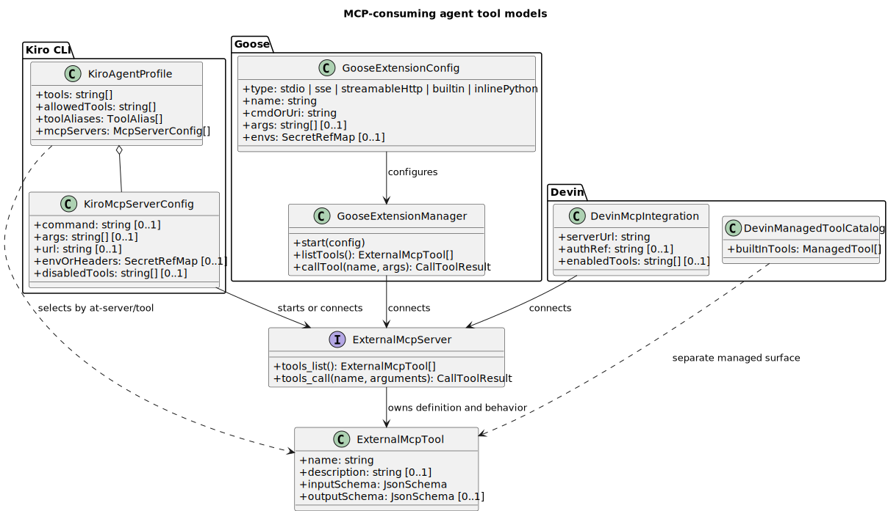
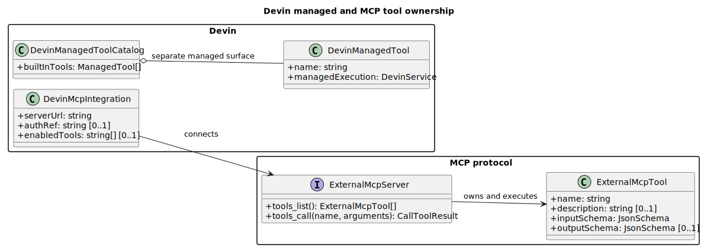

# 主流 Agent 的“配置生成 Tool / Agent”机制调研与统一元数据设计

- 文档版本：1.2.0
- 调研日期：2026-07-17
- 当前结论范围：14 个 Agent/平台样本（Claude Code、Codex、OpenCode、Cline、Qwen Code、Kiro CLI、Amp、Grok Build、OpenClaw、Goose、Coze Studio、Continue、Devin、Pi），补充 Anthropic API/Managed Agents 契约，以及 MCP 协议基线
- 说明：先前写作 `cozy` 的项目按 Coze Studio（扣子开源版）处理

## 1. 结论先行

你的目标可以实现，但必须把“只配置元数据”准确解释为：

> 开发人员不为每个 Tool 或 Agent 编写平台接入代码；平台根据声明式 Manifest，选择一个已经安装且受信任的通用驱动或 Agent Runtime Factory，完成注册、校验、权限控制和运行时装配。

不能把它解释为“只有名称、描述和 JSON Schema，系统就能凭空获得任意业务行为”。名称、描述和输入 Schema 只解决了模型如何调用；真正执行还必须来自以下至少一种实现来源：

1. 平台内置实现；
2. 已存在的 MCP Server；
3. OpenAPI/HTTP 通用驱动；
4. 命令、WASM、脚本或容器制品；
5. 已部署工作流；
6. 另一个 Agent Runtime。

调研得到的最直接答案是：

- **Agent 比 Tool 更容易做到纯配置化。** 因为主流产品已经内置了通用 Agent Loop；配置只需选择模型、提示词、工具、技能、记忆、权限和隔离方式。
- **任意 Tool 不能仅靠描述元数据执行。** Cline、Pi、Amp、OpenCode、Grok Build、OpenClaw 的自定义 Tool 最终都要求 `execute`、`run`、factory 或等价代码。
- **Coze Studio 最接近“配置即 Tool”。** 它读取 Plugin Manifest 和 OpenAPI operation，再由平台通用 HTTP 执行器构造请求、注入认证并执行。
- **Qwen Code 提供另一个很有价值的范式。** `discoveryCommand` 负责输出 Tool 描述，`callCommand` 负责接收 Tool 名称和 JSON 参数；平台因此可以用同一个命令驱动注册多种 Tool。
- **MCP 是“配置即代理”，不是“配置即实现”。** 客户端可根据 MCP Server 配置自动发现并生成代理 Tool，但真实行为仍由 Server 的 `tools/call` 实现。
- **推荐的数据模型不是一个巨大 Tool JSON。** 应拆成 `ToolManifest`、`AgentManifest` 与环境专属 `Binding`；Manifest 可版本化和共享，Binding 保存密钥引用、端点、工作区、身份与制品 pin。

因此，本调研能够支持你的目标，前提是平台实现本文第 6 节的 Driver Registry、Manifest Compiler、Agent Runtime Factory 和 Binding Resolver。随附的 [JSON Schema](./agent-tool-platform.schema.json) 已将这些约束编码。

### 1.1 研究范围、纳入标准与扩展建议

本文是**按 Tool/Agent 实现机制选取的代表性样本**，不是“所有主流 Agent”的穷举榜单。当前样本优先满足四个条件：用户点名；存在可复核的固定源码或官方结构化文档；能补充一种不同的 Tool/Agent 装配机制；在调研截止日仍有活跃产品或可用实现。

| 研究层 | 当前纳入对象 | 用途 |
|---|---|---|
| 交互式编码 Agent | Claude Code、Codex、OpenCode、Cline、Qwen Code、Kiro CLI、Amp、Grok Build、Continue、Pi | 比较本地 Tool registry、插件、MCP、host callback 与 Agent profile |
| Agent 平台/运行时 | OpenClaw、Goose、Coze Studio、Devin、Anthropic Managed Agents | 比较多 Agent、托管资源、通用 Driver、Binding 与隔离 |
| Tool 契约/协议 | Anthropic API Tool contract、MCP | 提取供应商调用契约与跨产品协议基线 |

证据等级在本文中严格区分：`源码确认` 表示固定 commit 的实现证据；`协议定义` 表示固定协议 Schema；`API 契约文档` 表示官方公开字段和调用语义；`行为文档` 表示只能确认产品公开行为，不能反推内部类；`目标设计` 表示本文建议，不能当成现有产品能力。

有必要扩大范围，但应分批进行：

| 优先级 | 候选 | 为什么值得增加 | 本版处理 |
|---|---|---|---|
| P0 | [Gemini CLI](https://github.com/google-gemini/gemini-cli)、[Tools reference](https://github.com/google-gemini/gemini-cli/blob/main/docs/reference/tools.md) | Apache 2.0 开源；公开 `ToolRegistry`、`discoveryCommand`、MCP 与 subagent registry，可验证 Google 系 Agent 的原生模型 | 下一轮纳入完整源码基线，不并入本版结论 |
| P0 | [OpenHands](https://github.com/OpenHands/OpenHands)、[Software Agent SDK custom tool](https://github.com/OpenHands/software-agent-sdk/blob/main/examples/01_standalone_sdk/02_custom_tools.py) | 显式 `ToolDefinition`、Action、Observation、Executor 和 Agent Server，能补足“SDK + 远程 Agent 平台”样本 | 下一轮纳入完整源码基线，不并入本版结论 |
| P1 | [GitHub Copilot CLI](https://docs.github.com/en/copilot/concepts/agents/copilot-cli/tool-search) | MCP、custom agent 与延迟 Tool loading 对大规模 Tool catalog 很有参考价值 | 作为闭源兼容性样本，采用官方行为文档 |
| 独立专题 | OpenAI Agents SDK、Claude Agent SDK、LangGraph、AutoGen、CrewAI、Semantic Kernel | 这些是 Agent SDK/框架，不是与 Claude Code/Codex 同层的终端产品；混入同一矩阵会扭曲结论 | 单独建立“Agent SDK/框架元数据”矩阵 |

[Roo Code](https://github.com/RooCodeInc/Roo-Code/blob/main/README.md) 曾经很有代表性，但其官方仓库已归档，README 明确说明扩展于 2026-05-15 停止，因此不应作为“当前主流活跃 Agent”新增到主基线；如需研究其历史设计，应作为兼容/迁移样本单列。

## 2. 判定标准：避免把“Schema”误判成“可执行 Tool”

### 2.1 Tool 实现等级

| 等级 | 含义 | 是否达到“开发人员只配元数据” |
|---|---|---|
| T0 描述符 | 只有 `name`、`description`、`inputSchema` | 否，只能让模型产生结构化调用 |
| T1 代码注册 | 描述符加 `execute/run/factory` 回调 | 否，开发人员仍需写接入代码 |
| T2 协议代理 | 配置 MCP Server，客户端自动发现和代理 | 有条件达到；Server 必须已实现 |
| T3 通用驱动 | OpenAPI、HTTP、Command 等由平台统一解释执行 | 是，限于驱动覆盖的行为类型 |
| T4 托管工具 | 云平台内置并执行 Tool | 是，限于平台预置 Tool |

### 2.2 Agent 实现等级

| 等级 | 含义 | 是否达到“配置即 Agent” |
|---|---|---|
| A0 会话设置 | 仅覆盖当前会话的 model/prompt/tools | 部分，不是可复用 Agent 资源 |
| A1 可复用 Profile | 文件或配置定义模型、提示词、工具与权限 | 是，可编译为 Agent 实例 |
| A2 版本化托管资源 | 服务端创建 Agent ID/version，再启动 Session | 是，治理能力更完整 |
| A3 隔离、路由、多 Agent | 还定义 workspace、identity、binding、subagent/handoff | 是，但环境数据应与 Manifest 分离 |

### 2.3 本文使用的严格测试

一个项目只有同时满足以下链路，才记为“配置可产生 Tool”：

1. 配置被解析为 Tool 描述；
2. 描述被注册进模型可见工具集合；
3. 调用能被路由到确定的执行驱动；
4. 驱动能把参数映射到真实执行端；
5. 结果能被规范化后返回 Agent；
6. 权限、超时、认证和错误路径有明确归属。

如果只能证明第 1、2 步，结论就是 T0；如果第 3 至 5 步依赖用户写回调，则是 T1。

## 3. 总体对比矩阵

“配置产生新 Tool”列判断的是**新增任意业务 Tool**，不是启用已有内置 Tool。

| 项目 | Tool 的主要机制 | 配置产生新 Tool | Agent 的主要机制 | 配置产生 Agent | 最终判定 |
|---|---|---:|---|---:|---|
| Claude Code | 内置 Tool、MCP | 条件式：T2 | `.claude/agents/*.md`、`--agents` JSON | 是，A1 | 公开证据支持 MCP 与 subagent 配置；不声称存在公开的内部 `ToolDefinition` 类 |
| Anthropic API / Managed Agents | 客户端 Custom Tool、服务端托管 Tool | 客户端仅 T0；托管 Tool 为 T4 | Managed Agent 版本化资源 | 是，A2 | Custom Tool 描述产生调用契约，客户端仍须执行并回传结果 |
| Codex | 内置 Tool、MCP、App Server `dynamicTools` | 条件式：T2；dynamic tool 是 host callback | Agent role TOML 与配置层 | 是，A1 | Dynamic metadata 产生调用入口，但客户端必须响应执行 |
| OpenCode | TS/JS Tool `execute`、插件、MCP | 否：T1/T2 | Markdown YAML agent/mode 文件 | 是，A1 | Agent 配置化，Tool 实现代码化 |
| Cline | SDK Tool `execute`、MCP | 否：T1/T2 | Markdown YAML configured agent；可包装为 subagent Tool | 是，A1 | “Agent 变 Tool”链路清楚，但底层仍有执行器代码 |
| Qwen Code | 代码 Tool、MCP、`discoveryCommand + callCommand` | **是：T3** | Markdown YAML subagent | 是，A1/A3 | 命令驱动是本设计的重要基线 |
| Kiro CLI | 内置 Tool 分类、MCP Tool | 条件式：T2 | v3 Markdown/JSON Agent Profile | 是，A1 | Profile 很完整；新 Tool 仍来自内置或 MCP |
| Amp | Plugin `registerTool` + `execute`、MCP | 否：T1/T2 | Plugin `createAgent` / agent mode | 代码辅助，A1 | Agent 定义结构化，但目前不是独立数据文件 |
| Grok Build | Rust `Tool` + `ToolMetadata`、MCP | 否：T1/T2 | `.grok/agents/*.md` portable identity | 是，A1/A3 | Agent Manifest 强；Tool 明确分 runtime 与 metadata |
| OpenClaw | Plugin manifest contract + runtime factory、MCP | 否：T1/T2 | `agents.list`、workspace、agentDir、routing binding | 是，A3 | Agent 隔离/路由强；manifest 不代替 Tool factory |
| Goose | MCP extensions、built-in/platform、inline Python | 条件式：T2；inline Python 含代码 | Recipe YAML/JSON | 是，A1 | Recipe 可生成 Agent session/workflow，不是独立托管身份 |
| Coze Studio | Plugin Manifest + OpenAPI + 通用 HTTP executor | **是：T3** | 持久化 `SingleAgent` + `BuildAgent` | 是，A2/A3 | 最接近端到端“元数据生成 Tool/Agent” |
| Continue | 内置 Tool、MCP、HTTP/MCP URI dispatcher | 条件式：T2 | `config.yaml`；实验性 Markdown subagent | 是，A1 | 主 Agent 配置成熟；subagent 文件仍标记实验性/内部 |
| Devin | 内置能力、MCP 集成、Devin MCP | 条件式：T2/T4 | Session API + playbook + knowledge + repo/secret refs | 部分，A0/A2 | 能配置并启动 Devin Session，但不是开放的通用 Agent Runtime Manifest |
| Pi | Extension `registerTool` + `execute`；默认无 MCP | 否：T1 | SDK/Extension；核心明确默认无 subagents | 否，A0/代码扩展 | 极简、代码优先；不适合作为纯元数据基线 |
| MCP 2025-11-25 | `tools/list` + `tools/call` | 仅 T2 | 协议无 Agent 资源 | 否 | Tool 互操作基线，不是 Tool 实现或 Agent Manifest 标准 |

## 4. 逐项目研究结果

### 4.1 Anthropic 产品族：Claude Code、Claude API 与 Managed Agents

**观察到的 Tool 行为**

- Claude API 的 Tool 定义包含名称、描述和 `input_schema`，但这只是模型与应用之间的调用契约。官方明确区分客户端 Tool 与服务端 Tool：客户端 Tool 由应用执行，服务端 Tool 由 Anthropic 基础设施执行。[How tool use works](https://platform.claude.com/docs/en/agents-and-tools/tool-use/how-tool-use-works)、[Tool reference](https://platform.claude.com/docs/en/agents-and-tools/tool-use/tool-reference)
- Managed Agents 的 custom tool 同样只产生结构化调用；官方文档明确写明应用在外部执行后回传结果。[Managed Agents tools](https://platform.claude.com/docs/en/managed-agents/tools)
- Claude Code 的自定义外部 Tool 主要通过 MCP 增加；`.mcp.json`/CLI 配置负责连接 stdio 或 HTTP Server，Server 才是执行者。[Claude Code MCP](https://code.claude.com/docs/en/mcp)
- 类图中的 `AnthropicClientToolContract` 是依据上述公开字段建立的**归一化概念类**，不是 Claude Code 源码中的类型，也不是 Anthropic 官方公布的类名。Claude Code 的公开仓库采用 proprietary/commercial 条款，不能据此声称已获得其内部 Tool 实现源码。[Claude Code repository](https://github.com/anthropics/claude-code)、[license](https://github.com/anthropics/claude-code/blob/main/LICENSE.md)

**观察到的 Agent 行为**

- Claude Code 扫描 `~/.claude/agents/` 和 `.claude/agents/`。文件为 YAML frontmatter + Markdown body，body 成为 system prompt；frontmatter 可含 `name`、`description`、`tools`、`disallowedTools`、`model`、`permissionMode`、`mcpServers`、`hooks`、`maxTurns`、`skills`、`memory`、`effort`、`background`、`isolation` 等。[Claude Code subagents](https://code.claude.com/docs/en/sub-agents)
- `--agents` 可用 JSON 在单次会话中注入同一组字段；`--agent` 可让一个定义成为主会话 Agent。
- Managed Agents 把 `name`、`model`、`system`、`tools`、`mcp_servers`、`skills`、`multiagent`、`description`、`metadata` 保存为有 ID 和递增 version 的资源。[Define your agent](https://platform.claude.com/docs/en/managed-agents/agent-setup)
- Managed MCP 设计把可复用的 Server URL 声明留在 Agent，把认证留在 Session/vault，这直接支持本文的 Manifest/Binding 分层。[Managed Agents MCP connector](https://platform.claude.com/docs/en/managed-agents/mcp-connector)

**结论**

- Claude Code Agent：达到 A1；外部任意 Tool 通过 MCP 达到 T2。
- Managed Agents：达到 A2；托管 Tool 达到 T4。
- Anthropic 客户端 Custom Tool：描述本身只有 T0，应用仍须执行。该契约不能当作 Claude Code 内部 `ToolDefinition` 的源码证据。

### 4.2 Codex

**观察到的 Tool 行为**

- `DynamicToolFunctionSpec` 只保存 `name`、`description`、`input_schema` 和 `defer_loading`。[源码：dynamic_tools.rs](https://github.com/openai/codex/blob/315195492c80fdade38e917c18f9584efd599304/codex-rs/protocol/src/dynamic_tools.rs#L10-L27)
- Dynamic Tool handler 把描述注册成模型工具，但调用发生后会创建 pending request 并等待 App Server 客户端回传 `DynamicToolResponse`；它没有从 metadata 推导业务逻辑。[源码：dynamic.rs](https://github.com/openai/codex/blob/315195492c80fdade38e917c18f9584efd599304/codex-rs/core/src/tools/handlers/dynamic.rs#L113-L177)
- App Server 文档也明确要求客户端响应 `item/tool/call`。因此它是“host-provided dynamic callback”，不是 metadata-only executor。[App Server dynamic tool calls](https://github.com/openai/codex/blob/315195492c80fdade38e917c18f9584efd599304/codex-rs/app-server/README.md#dynamic-tool-calls-experimental)
- MCP Tool 则由 Codex 自动适配为模型 Tool，再转发给已存在的 MCP Server。

**观察到的 Agent 行为**

- Codex 从配置层的 `agents` 目录发现 TOML role 文件，合并同名角色的低优先级缺省值，并验证描述。[源码：load_agent_roles](https://github.com/openai/codex/blob/315195492c80fdade38e917c18f9584efd599304/codex-rs/core/src/config/agent_roles.rs#L19-L115)
- 独立 role 文件含 `name`、`description`、`nickname_candidates`，并 flatten 完整 `ConfigToml`；因此模型、推理强度、sandbox、MCP、skills 等普通 Codex 配置可作为 role 覆盖层。独立发现的文件必须含非空 `developer_instructions`。[源码：parse_agent_role_file_contents](https://github.com/openai/codex/blob/315195492c80fdade38e917c18f9584efd599304/codex-rs/core/src/config/agent_roles.rs#L218-L315)

**结论**

- Agent：达到 A1。
- Tool：dynamic metadata 只有 T0 + host callback；MCP 为 T2。若要纳入统一平台，应把 App Server 客户端回调建模为 `artifact` 或 `hostCallback` driver，而不是误称纯元数据执行。

### 4.3 OpenCode

**观察到的 Tool 行为**

- Tool Definition 要求 `id`、`description`、参数 Schema 和 `execute`；plugin Tool 最终也调用插件提供的 `def.execute`。[源码：tool.ts](https://github.com/anomalyco/opencode/blob/3a1c6df9e24672f0761a6ced18e1315d89334baf/packages/opencode/src/tool/tool.ts#L55-L64)、[源码：registry.ts](https://github.com/anomalyco/opencode/blob/3a1c6df9e24672f0761a6ced18e1315d89334baf/packages/opencode/src/tool/registry.ts#L120-L175)
- JS/TS 文件可以被动态导入为 Tool，但那是代码插件；MCP 配置可创建协议代理。

**观察到的 Agent 行为**

- Agent Schema 包含 `model`、`variant`、temperature、top_p、prompt、tools、description、mode、hidden、steps 和 permission 等。[源码：agent.ts schema](https://github.com/anomalyco/opencode/blob/3a1c6df9e24672f0761a6ced18e1315d89334baf/packages/core/src/v1/config/agent.ts#L12-L88)
- OpenCode 发现 `{agent,agents}/**/*.md` 与旧 mode 路径，解析 YAML frontmatter，并把 Markdown body 注入 system/prompt 配置。[源码：config plugin](https://github.com/anomalyco/opencode/blob/3a1c6df9e24672f0761a6ced18e1315d89334baf/packages/core/src/config/plugin/agent.ts#L20-L24)
- Runtime 把配置转成 Agent Info，并提供 list/get/default 选择。[源码：agent runtime](https://github.com/anomalyco/opencode/blob/3a1c6df9e24672f0761a6ced18e1315d89334baf/packages/opencode/src/agent/agent.ts#L35-L55)

**结论**

- Agent：A1。
- Tool：T1；MCP 时 T2。OpenCode 证明 Markdown Agent Manifest 很实用，但没有通用声明式 Tool driver。

### 4.4 Cline

**观察到的 Tool 行为**

- Cline SDK 明确把 Tool descriptor 与实现分开：`AgentToolDefinition` 只有 `name`、`description`、`inputSchema`；`AgentTool` 在此基础上增加 `execute`。[源码：sdk shared agent.ts](https://github.com/cline/cline/blob/c564045d8135c0c1c330b21d47b68b74917ce614/sdk/packages/shared/src/agent.ts#L146-L186)
- 这给出了最直接的反例：descriptor 可注册给模型，但若没有实现对象就不能执行。MCP 仍属于 T2。

**观察到的 Agent 行为**

- Configured Agent 文件使用 Markdown/YAML frontmatter，字段包括 `name`、`description`、`tools`、`skills`、`providerId`、`modelId`、`maxIterations`，body 是 system prompt。[源码：configured-agent-config.ts](https://github.com/cline/cline/blob/c564045d8135c0c1c330b21d47b68b74917ce614/sdk/packages/core/src/extensions/tools/team/configured-agent-config.ts#L8-L28)
- Loader 解析并加载这些定义；`configured-agent-tool.ts` 再把 Agent 配置变成一个 subagent Tool，Tool 的 `execute` 创建并运行委派 Agent。[源码：configured-agent-tool.ts](https://github.com/cline/cline/blob/c564045d8135c0c1c330b21d47b68b74917ce614/sdk/packages/core/src/extensions/tools/team/configured-agent-tool.ts#L113-L138)
- Agent Runtime 可接收已构建模型，或根据 provider/model 配置创建模型。[源码：agent-runtime.ts](https://github.com/cline/cline/blob/c564045d8135c0c1c330b21d47b68b74917ce614/sdk/packages/agents/src/agent-runtime.ts#L82-L118)

**结论**

- Agent：A1。
- Tool：T1/T2。值得复用的设计是 `AgentManifest -> AgentProxyDriver -> Tool`，而不是把 Agent 的全部字段复制进 Tool。

### 4.5 Qwen Code

**观察到的 Tool 行为**

- 普通 Declarative Tool 仍有 builder/build 与执行代码。[源码：tools.ts](https://github.com/QwenLM/qwen-code/blob/0ecba4b3c709d271a17faa5ac9537bf1b102eaf1/packages/core/src/tools/tools.ts#L155-L245)
- MCP Tool 由 `DiscoveredMCPTool` 适配并转发到 MCP client `callTool`，属于 T2。[源码：mcp-tool.ts](https://github.com/QwenLM/qwen-code/blob/0ecba4b3c709d271a17faa5ac9537bf1b102eaf1/packages/core/src/tools/mcp-tool.ts#L349-L373)
- 关键机制是 Tool Discovery：平台执行 `discoveryCommand`，读取一组 function declarations，再注册 `DiscoveredTool`；调用时把 Tool 名称作为参数，并把 JSON arguments 写入 `callCommand` stdin。[源码：tool-registry.ts](https://github.com/QwenLM/qwen-code/blob/0ecba4b3c709d271a17faa5ac9537bf1b102eaf1/packages/core/src/tools/tool-registry.ts#L42-L181)、[配置文档](https://github.com/QwenLM/qwen-code/blob/0ecba4b3c709d271a17faa5ac9537bf1b102eaf1/docs/users/configuration/settings.md#L315-L331)
- 这已经是通用 Command Driver。开发人员仍要提供一个可执行程序，但不用为每个 Tool 编写 Qwen 插件适配代码。

**观察到的 Agent 行为**

- `SubagentConfig` 覆盖名称、描述、工具 allow/deny、审批、system prompt、模型、运行参数、颜色、后台、权限、max turns、MCP servers 和 hooks。[源码：types.ts](https://github.com/QwenLM/qwen-code/blob/0ecba4b3c709d271a17faa5ac9537bf1b102eaf1/packages/core/src/subagents/types.ts#L51-L175)
- `SubagentManager` 解析 Markdown YAML frontmatter；每个 Agent 可独立覆盖 MCP Server，并触发启动和 Tool discovery。[源码：subagent-manager.ts](https://github.com/QwenLM/qwen-code/blob/0ecba4b3c709d271a17faa5ac9537bf1b102eaf1/packages/core/src/subagents/subagent-manager.ts#L1359-L1560)

**结论**

- Tool：Command 路径达到 T3，MCP 路径 T2。
- Agent：A1/A3。Qwen 的 `discoveryCommand/callCommand` 应直接成为统一规范的 `command` implementation driver。

### 4.6 Kiro CLI

**观察到的 Tool 行为**

- Agent Profile 的 `tools` 选择的是类别标签、内置 Tool 或 MCP Tool；`mcpServers` 可内联定义 stdio/HTTP Server。[Kiro v3 Agent config](https://kiro.dev/docs/cli/v3/agent-config/)
- MCP 配置提供 command/args/env 或 URL/headers/OAuth，Kiro 负责生命周期与热重载；实际 Tool 由 MCP Server 暴露。[Kiro MCP configuration](https://kiro.dev/docs/cli/mcp/configuration/)
- 因此“增加一个任意 Tool”不能只写 Tool descriptor；必须是内置 Tool 或已有 MCP Server。

**观察到的 Agent 行为**

- v3 Profile 是 YAML frontmatter + Markdown body，也可用等价 JSON；示例字段包括 `description`、`model`、工具类别、内联 MCP、`resources`、`permissions`、`welcomeMessage`。
- 工作区目录为 `.kiro/agents/`，用户目录为 `~/.kiro/agents/`；嵌套路径形成 Agent 名称。权限规则采用 capability/effect/match，默认未命中为 ask。[Kiro v3 Agent config](https://kiro.dev/docs/cli/v3/agent-config/)

**结论**

- Agent：A1，且权限模型适合借鉴。
- Tool：T2；没有独立的 metadata-only arbitrary Tool driver。

### 4.7 Amp

**观察到的 Tool 行为**

- `amp.registerTool` 的定义同时包含 `name`、`description`、`inputSchema` 和 `execute`；插件是 Bun 执行的 TS/JS 程序。[Amp Plugin API](https://ampcode.com/manual/plugin-api)
- Amp 也支持 MCP 配置，因此已有 MCP Server 的 Tool 可以自动接入，但仍是 T2。

**观察到的 Agent 行为**

- `createAgent` 的 `CreateAgentConfig` 包含 `name`、`model`、`instructions`、tools include/exclude、reasoning effort 和 display；返回的 handle 可 `run` 或 `createThread`。[Amp Plugin API](https://ampcode.com/manual/plugin-api)
- Custom Agent 目前在 Plugin 程序中创建；注册主 Agent mode 还要求静态 `@amp-agent-mode` 元数据注释与 runtime registration 一致。它是结构化定义，但不是完全独立的 YAML/JSON 数据文件。
- 官方示例也展示了把 custom Agent 包装成 Tool：Tool `execute` 内调用 `reviewer.run(...)`。[Custom Agents](https://ampcode.com/news/custom-agents)

**结论**

- Agent：代码辅助的 A1。
- Tool：T1/T2。Amp 的 Agent handle 适合映射到本文的 `agentProxy` driver，但其 Plugin 本身仍是代码制品。

### 4.8 Grok Build

**观察到的 Tool 行为**

- xAI 源码明确要求每个 Tool 同时实现 runtime `Tool` 和 metadata `ToolMetadata`；后者提供名称、描述、参数等，前者提供运行行为。[源码：tool_metadata.rs](https://github.com/xai-org/grok-build/blob/8adf9013a0929e5c7f1d4e849492d2387837a28d/crates/codegen/xai-grok-tools/src/types/tool_metadata.rs#L1-L10)
- `Tool` trait 的 `run/execute` 是代码接口，说明 metadata 不会自行执行。[源码：tool.rs](https://github.com/xai-org/grok-build/blob/8adf9013a0929e5c7f1d4e849492d2387837a28d/crates/common/xai-tool-runtime/src/tool.rs#L32-L110)

**观察到的 Agent 行为**

- `.grok/agents/*.md` 被注释为 portable, version-control contract。配置覆盖名称、描述、prompt mode、Tool、capability、permission、skills、继承、effort、max turns、isolation、background、MCP、hooks、memory、model 和 completion requirement。[源码：config.rs](https://github.com/xai-org/grok-build/blob/8adf9013a0929e5c7f1d4e849492d2387837a28d/crates/codegen/xai-grok-agent/src/config.rs#L706-L817)
- Builder 从定义或代码配置构造 Agent；discovery 处理项目/用户范围与优先级。[源码：builder.rs](https://github.com/xai-org/grok-build/blob/8adf9013a0929e5c7f1d4e849492d2387837a28d/crates/codegen/xai-grok-agent/src/builder.rs#L24-L41)

**结论**

- Agent：A1/A3。
- Tool：T1/T2。`ToolMetadata`/`Tool` 的显式分离与本文 `descriptor`/`implementation` 分离高度一致。

### 4.9 OpenClaw

**观察到的 Tool 行为**

- Plugin registry 可以读取 manifest 的 `contracts.tools` 做静态所有权和发现检查，但 runtime 仍要求插件 factory 实际注册 Tool；静态 contract 与 runtime registration 不一致会被检查。[源码：registry registrar](https://github.com/openclaw/openclaw/blob/55bb6cfa2ec4863b5ece006aee70b5de6d967709/src/plugins/registry-registrars-tools-hooks.ts#L243-L293)、[Plugin manifest 文档](https://github.com/openclaw/openclaw/blob/55bb6cfa2ec4863b5ece006aee70b5de6d967709/docs/plugins/manifest.md#L568-L632)
- Agent Tool 的运行类型包含 `execute`，所以 manifest contract 是发现/治理元数据，不是实现。[源码：common.ts](https://github.com/openclaw/openclaw/blob/55bb6cfa2ec4863b5ece006aee70b5de6d967709/src/agents/tools/common.ts#L28-L69)

**观察到的 Agent 行为**

- `AgentConfig` 包含 `id`、default、名称/描述、workspace、agentDir、model、thinking、skills、memory、identity、subagents、sandbox、params、tools 和 runtime。[源码：types.agents.ts](https://github.com/openclaw/openclaw/blob/55bb6cfa2ec4863b5ece006aee70b5de6d967709/src/config/types.agents.ts#L18-L166)
- `agents.list` 定义多个隔离 Agent；每个 Agent 有独立 workspace、agentDir/auth 和 session store，并通过 bindings 做消息路由。[Multi-agent routing](https://github.com/openclaw/openclaw/blob/55bb6cfa2ec4863b5ece006aee70b5de6d967709/docs/concepts/multi-agent.md#L9-L35)

**结论**

- Agent：A3，是 Manifest/Binding 分离的重要参考，但 OpenClaw 当前配置仍把一部分 workspace/runtime binding 放在同一对象中。
- Tool：T1/T2；manifest ownership 不能替代 runtime factory。

### 4.10 Goose

**观察到的 Tool 行为**

- `ExtensionConfig` 是 discriminated union，支持 stdio、builtin、platform、streamable HTTP、frontend 和 inline Python。stdio/HTTP 是 MCP client 配置；inline Python 虽可写在配置中，但 `code` 本身就是实现代码，不属于纯描述元数据。[源码：extension.rs](https://github.com/aaif-goose/goose/blob/d6345f75dba4f43afe705e045414edf173e40af4/crates/goose/src/agents/extension.rs#L159-L295)
- Extension Manager 向各 client 调用 `list_tools`，并在执行时调用对应 client 的 `call_tool`，这是一条标准 T2 代理链路。[源码：extension_manager.rs](https://github.com/aaif-goose/goose/blob/d6345f75dba4f43afe705e045414edf173e40af4/crates/goose/src/agents/extension_manager.rs#L1391-L1485)

**观察到的 Agent 行为**

- Recipe 是 YAML/JSON 可复用配置，字段包括 version、title、description、instructions/prompt、extensions、settings、activities、parameters、response schema、sub-recipes 和 retry。[源码：recipe/mod.rs](https://github.com/aaif-goose/goose/blob/d6345f75dba4f43afe705e045414edf173e40af4/crates/goose/src/recipe/mod.rs#L41-L86)
- settings 可选择 provider/model/temperature/max turns；sub-recipe 会自动注入 summon extension。官方将 Recipe 定义为可共享并可启动的配置。[Recipe reference](https://github.com/aaif-goose/goose/blob/d6345f75dba4f43afe705e045414edf173e40af4/documentation/docs/guides/recipes/recipe-reference.md#L11-L56)

**结论**

- Agent：A1，准确地说是“配置生成 Agent Session/Workflow”，不是持久化的独立 Agent identity。
- Tool：MCP T2；inline Python 是携带代码的 T1。

### 4.11 Coze Studio

**观察到的 Tool 行为**

- `PluginManifest` 定义 schema version、模型/人类名称与描述、认证、Logo、API 和 common params。[源码：plugin_manifest.go](https://github.com/coze-dev/coze-studio/blob/22275b1c2661d35344a7493cffe401e8cc61cf8e/backend/crossdomain/plugin/model/plugin_manifest.go#L34-L44)
- 产品元数据引用 Manifest、OpenAPI 文件和 Tool 的 method/sub_url。Loader 校验 Manifest 和 OpenAPI，再把 operation 映射为 ToolInfo。[源码：load_plugin.go](https://github.com/coze-dev/coze-studio/blob/22275b1c2661d35344a7493cffe401e8cc61cf8e/backend/domain/plugin/conf/load_plugin.go#L40-L55)、[operation 映射](https://github.com/coze-dev/coze-studio/blob/22275b1c2661d35344a7493cffe401e8cc61cf8e/backend/domain/plugin/conf/load_plugin.go#L151-L249)
- `ExecuteTool` 构建通用 executor、获取认证并执行；`httpCallImpl` 根据 operation、server URL、method 和参数构造 HTTP 请求并发送。[源码：exec_tool.go](https://github.com/coze-dev/coze-studio/blob/22275b1c2661d35344a7493cffe401e8cc61cf8e/backend/domain/plugin/service/exec_tool.go#L45-L93)、[源码：invocation_http.go](https://github.com/coze-dev/coze-studio/blob/22275b1c2661d35344a7493cffe401e8cc61cf8e/backend/domain/plugin/service/tool/invocation_http.go#L59-L155)
- 这是完整的 `OpenAPI metadata -> ToolInfo -> generic HTTP driver -> result`，达到 T3。

**观察到的 Agent 行为**

- `SingleAgent` 持久化身份、版本、模型、Prompt、Plugin、Knowledge、Workflow、Database 等配置。[源码：single_agent.go](https://github.com/coze-dev/coze-studio/blob/22275b1c2661d35344a7493cffe401e8cc61cf8e/backend/crossdomain/agent/model/single_agent.go#L56-L82)
- `StreamExecute` 取出版本化 Agent 后调用 `BuildAgent`；builder 解析 persona/variables、构建 knowledge retriever、model、plugin/workflow/database tools，并创建 ReAct Agent。[源码：single_agent_impl.go](https://github.com/coze-dev/coze-studio/blob/22275b1c2661d35344a7493cffe401e8cc61cf8e/backend/domain/agent/singleagent/service/single_agent_impl.go#L93-L127)、[源码：agent_flow_builder.go](https://github.com/coze-dev/coze-studio/blob/22275b1c2661d35344a7493cffe401e8cc61cf8e/backend/domain/agent/singleagent/internal/agentflow/agent_flow_builder.go#L60-L181)
- Agent 的 Plugin Tool adapter 从 OpenAPI operation 生成模型 Schema，并把运行调用转回统一 Plugin service。[源码：node_tool_plugin.go](https://github.com/coze-dev/coze-studio/blob/22275b1c2661d35344a7493cffe401e8cc61cf8e/backend/domain/agent/singleagent/internal/agentflow/node_tool_plugin.go#L45-L147)

**结论**

- Tool：T3，是本文 OpenAPI driver 的主要源码基线。
- Agent：A2/A3，是持久化 Agent metadata 经 runtime factory 生成可执行实例的完整案例。

### 4.12 Continue

**观察到的 Tool 行为**

- 内置 Tool 的名称和实现是代码注册；dispatcher 根据 Tool URI 转发 HTTP 或 MCP，或调用内置实现。[源码：callTool.ts](https://github.com/continuedev/continue/blob/d0a3c0b626b5bebc3bef4742eec05a0242be0bab/core/tools/callTool.ts#L28-L109)、[内置 dispatch](https://github.com/continuedev/continue/blob/d0a3c0b626b5bebc3bef4742eec05a0242be0bab/core/tools/callTool.ts#L187-L250)
- `config.yaml` 的 `mcpServers` 负责启动/连接 Server；真正 Tool 仍由 MCP 提供。[Continue config reference](https://docs.continue.dev/reference)

**观察到的 Agent 行为**

- Continue 官方把 `config.yaml` 定义为 Agent 配置；顶层包含 name/version/schema、models、context、rules、prompts、docs、mcpServers、data。[Continue config.yaml reference](https://docs.continue.dev/reference)
- 源码 Zod schema 与此一致，并支持 `uses/with/override` 组合 registry blocks。[源码：schemas/index.ts](https://github.com/continuedev/continue/blob/d0a3c0b626b5bebc3bef4742eec05a0242be0bab/packages/config-yaml/src/schemas/index.ts#L100-L167)
- 另有 Markdown Agent 文件格式，但源码明确标注 experimental/internal；当前字段为 `name`、description、model、tools、rules 和 body prompt。[源码：agentFiles.ts](https://github.com/continuedev/continue/blob/d0a3c0b626b5bebc3bef4742eec05a0242be0bab/packages/config-yaml/src/markdown/agentFiles.ts#L5-L20)
- CLI subagent Tool 从模型服务获取这些 Agent，并在 `run` 中调用 `executeSubAgent`。[源码：subagent.ts](https://github.com/continuedev/continue/blob/d0a3c0b626b5bebc3bef4742eec05a0242be0bab/extensions/cli/src/tools/subagent.ts#L15-L114)

**结论**

- 主 Agent config：A1。
- Markdown subagent：A1，但应标注实验性，不宜直接作为稳定跨平台标准。
- Tool：T1/T2；HTTP URI 路径是有限通用驱动，但没有完整 OpenAPI operation 编译层。

### 4.13 Devin

**观察到的 Tool 行为**

- Devin 可以连接 MCP，也通过官方 Devin MCP 把 session、playbook、knowledge、schedule 等平台能力暴露给其他 Agent。[Devin MCP](https://docs.devin.ai/work-with-devin/devin-mcp)
- 对调用方而言这是 T2；执行实现是 Devin 托管服务，不是调用方根据描述元数据生成。

**观察到的 Agent 行为**

- Create Session API 以 `prompt` 为必填，并可绑定 playbook、knowledge、repos、secret refs、ACU limit、平台、结构化输出 Schema、tags 和 title。[Create Session API](https://docs.devin.ai/api-reference/v3/sessions/post-organizations-sessions)
- Playbook 是可复用、版本化的任务提示模板，但不是完整 runtime identity；Knowledge 和 repo skills 提供上下文。[Creating Playbooks](https://docs.devin.ai/product-guides/creating-playbooks)、[Devin Skills](https://docs.devin.ai/product-guides/skills)
- 用户可选择 Devin agent mode/预置 Agent，但公开 API 没有暴露一个像 Claude Managed Agent 那样可任意声明 model/tools/runtime factory 的通用 AgentManifest。

**结论**

- “配置启动一个 Devin Agent Session”可以，属于 A0/A2。
- “只配元数据创建任意新 Agent 类型”目前证据不足，应标记为产品约束，而不是宣称已支持。

### 4.14 Pi

**观察到的 Tool 行为**

- `ToolDefinition` 同时要求 name、label、description、TypeBox parameters 与 `execute`；`registerTool` 把整个定义注册到 extension runtime。[源码：extension types](https://github.com/earendil-works/pi/blob/216e672e7c9fc65682553394b74e483c0c9e47f7/packages/coding-agent/src/core/extensions/types.ts#L435-L485)、[源码：loader.ts](https://github.com/earendil-works/pi/blob/216e672e7c9fc65682553394b74e483c0c9e47f7/packages/coding-agent/src/core/extensions/loader.ts#L222-L244)
- Agent runtime 的 `AgentTool` 也要求 `execute`。[源码：agent types](https://github.com/earendil-works/pi/blob/216e672e7c9fc65682553394b74e483c0c9e47f7/packages/agent/src/types.ts#L372-L396)
- Pi package manifest 只负责发现 extensions/skills/prompts/themes，extension 是具备完整系统权限的 TS 代码。[源码：README](https://github.com/earendil-works/pi/blob/216e672e7c9fc65682553394b74e483c0c9e47f7/packages/coding-agent/README.md#L401-L448)

**观察到的 Agent 行为**

- Pi 核心明确采用极简、代码扩展哲学，默认没有 MCP、subagents、permission popup 或 plan mode；这些能力由 extension 自建。[源码：README philosophy](https://github.com/earendil-works/pi/blob/216e672e7c9fc65682553394b74e483c0c9e47f7/packages/coding-agent/README.md#L488-L500)
- 社区/示例 extension 可以读取 Agent 文件并拉起新 Pi 进程，但这不是核心稳定 Agent Manifest 合约。

**结论**

- Tool：T1。
- Agent：A0/代码扩展。Pi 是“元数据与执行代码必须明确分开”的好基线，但不是“纯配置生成 Agent”的基线。

### 4.15 MCP 2025-11-25

**观察到的 Tool 行为**

- `Tool` 包含 name/title/description、`inputSchema`、可选 `outputSchema`、`execution.taskSupport`、annotations 和 `_meta`。[官方 Schema](https://modelcontextprotocol.io/specification/2025-11-25/schema)、[固定源码](https://github.com/modelcontextprotocol/modelcontextprotocol/blob/26897cc322f356487da89113451bd16b520b9288/schema/2025-11-25/schema.ts#L1244-L1297)
- `ToolAnnotations` 的 readOnly/destructive/idempotent/openWorld 都只是 hint，规范明确要求客户端不要把来自不可信 Server 的 hint 当作授权依据。[固定源码](https://github.com/modelcontextprotocol/modelcontextprotocol/blob/26897cc322f356487da89113451bd16b520b9288/schema/2025-11-25/schema.ts#L1168-L1222)
- 客户端通过 `tools/list` 得到描述，通过 `tools/call` 发送 name/arguments，Server 返回内容；因此 Tool 描述与 Server 执行端是一个完整协议对。[固定源码](https://github.com/modelcontextprotocol/modelcontextprotocol/blob/26897cc322f356487da89113451bd16b520b9288/schema/2025-11-25/schema.ts#L1080-L1156)

**结论**

- MCP 是统一平台 `mcp` driver 的协议基线，达到 T2。
- MCP 本身不定义 AgentManifest；不能用 MCP Tool Schema 代替 Agent 元数据。

## 5. 源码与文档基线

开源项目使用固定 commit，闭源产品使用官方文档并记录访问日期。源码行号基于下表 commit；后续仓库变化不影响本次结论的可复核性。

| 项目 | 基线 | 证据等级 | 重点路径或官方资料 |
|---|---|---|---|
| Codex | `315195492c80fdade38e917c18f9584efd599304` | 源码确认 | [`dynamic_tools.rs`](https://github.com/openai/codex/blob/315195492c80fdade38e917c18f9584efd599304/codex-rs/protocol/src/dynamic_tools.rs#L10-L27)、[`dynamic.rs`](https://github.com/openai/codex/blob/315195492c80fdade38e917c18f9584efd599304/codex-rs/core/src/tools/handlers/dynamic.rs#L113-L177) |
| OpenCode | `3a1c6df9e24672f0761a6ced18e1315d89334baf` | 源码确认 | [`tool.ts`](https://github.com/anomalyco/opencode/blob/3a1c6df9e24672f0761a6ced18e1315d89334baf/packages/opencode/src/tool/tool.ts#L55-L64)、`packages/opencode/src/agent/agent.ts` |
| Cline | `c564045d8135c0c1c330b21d47b68b74917ce614` | 源码确认 | [`agent.ts`](https://github.com/cline/cline/blob/c564045d8135c0c1c330b21d47b68b74917ce614/sdk/packages/shared/src/agent.ts#L146-L186)、configured agent runtime |
| Qwen Code | `0ecba4b3c709d271a17faa5ac9537bf1b102eaf1` | 源码确认 | [`tool-registry.ts`](https://github.com/QwenLM/qwen-code/blob/0ecba4b3c709d271a17faa5ac9537bf1b102eaf1/packages/core/src/tools/tool-registry.ts#L42-L181)、`packages/core/src/subagents/*` |
| Grok Build | `8adf9013a0929e5c7f1d4e849492d2387837a28d` | 源码确认 | [`tool_metadata.rs`](https://github.com/xai-org/grok-build/blob/8adf9013a0929e5c7f1d4e849492d2387837a28d/crates/codegen/xai-grok-tools/src/types/tool_metadata.rs#L1-L10)、[`tool.rs`](https://github.com/xai-org/grok-build/blob/8adf9013a0929e5c7f1d4e849492d2387837a28d/crates/common/xai-tool-runtime/src/tool.rs#L32-L110) |
| OpenClaw | `55bb6cfa2ec4863b5ece006aee70b5de6d967709` | 源码确认 | [`registry-registrars-tools-hooks.ts`](https://github.com/openclaw/openclaw/blob/55bb6cfa2ec4863b5ece006aee70b5de6d967709/src/plugins/registry-registrars-tools-hooks.ts#L243-L293)、[`common.ts`](https://github.com/openclaw/openclaw/blob/55bb6cfa2ec4863b5ece006aee70b5de6d967709/src/agents/tools/common.ts#L28-L69) |
| Goose | `d6345f75dba4f43afe705e045414edf173e40af4` | 源码确认 | [`extension.rs`](https://github.com/aaif-goose/goose/blob/d6345f75dba4f43afe705e045414edf173e40af4/crates/goose/src/agents/extension.rs#L159-L295)、[`extension_manager.rs`](https://github.com/aaif-goose/goose/blob/d6345f75dba4f43afe705e045414edf173e40af4/crates/goose/src/agents/extension_manager.rs#L1391-L1485) |
| Coze Studio | `22275b1c2661d35344a7493cffe401e8cc61cf8e` | 源码确认 | [`load_plugin.go`](https://github.com/coze-dev/coze-studio/blob/22275b1c2661d35344a7493cffe401e8cc61cf8e/backend/domain/plugin/conf/load_plugin.go#L151-L249)、[`invocation_http.go`](https://github.com/coze-dev/coze-studio/blob/22275b1c2661d35344a7493cffe401e8cc61cf8e/backend/domain/plugin/service/tool/invocation_http.go#L59-L155) |
| Continue | `d0a3c0b626b5bebc3bef4742eec05a0242be0bab` | 源码确认 | [`callTool.ts`](https://github.com/continuedev/continue/blob/d0a3c0b626b5bebc3bef4742eec05a0242be0bab/core/tools/callTool.ts#L28-L109)、`packages/config-yaml/src/*` |
| Pi | `216e672e7c9fc65682553394b74e483c0c9e47f7` | 源码确认 | [`extensions/types.ts`](https://github.com/earendil-works/pi/blob/216e672e7c9fc65682553394b74e483c0c9e47f7/packages/coding-agent/src/core/extensions/types.ts#L435-L485)、`packages/agent/src/types.ts` |
| MCP | `26897cc322f356487da89113451bd16b520b9288` | 协议定义 | [`schema.ts`](https://github.com/modelcontextprotocol/modelcontextprotocol/blob/26897cc322f356487da89113451bd16b520b9288/schema/2025-11-25/schema.ts#L1244-L1297) |
| Claude Code | 官方资料，访问 2026-07-17 | 行为文档 | [MCP](https://code.claude.com/docs/en/mcp)、[subagents](https://code.claude.com/docs/en/sub-agents)、[public repository license](https://github.com/anthropics/claude-code/blob/main/LICENSE.md) |
| Anthropic API / Managed Agents | 官方资料，访问 2026-07-17 | API 契约文档 | [Managed Agents tools](https://platform.claude.com/docs/en/managed-agents/tools)、[Tool reference](https://platform.claude.com/docs/en/agents-and-tools/tool-use/tool-reference)、[Agent setup](https://platform.claude.com/docs/en/managed-agents/agent-setup) |
| Kiro CLI | 官方资料，访问 2026-07-17 | 行为文档 | [Agent configuration](https://kiro.dev/docs/cli/custom-agents/configuration-reference/)、[MCP configuration](https://kiro.dev/docs/cli/mcp/configuration/) |
| Amp | 官方资料，访问 2026-07-17 | API 契约文档 | [Plugin API](https://ampcode.com/manual/plugin-api)、Custom Agents |
| Devin | 官方资料，访问 2026-07-17 | 行为文档 | [Devin MCP](https://docs.devin.ai/work-with-devin/devin-mcp)、Session API、Playbooks、Skills |

## 6. 目标设计：怎样真正做到“只配置元数据”

以下为**目标设计**，不是任何一个被调研项目已经共同实现的标准。

### 6.1 四个不可省略的平台组件

1. **Manifest Validator**
   - 使用 JSON Schema 校验结构；
   - 校验名称唯一性、引用存在、driver 类型与字段组合；
   - 校验 input/output Schema；
   - 禁止把明文 secret 放进 Manifest。

2. **Manifest Compiler**
   - 将 Tool descriptor 编译为不同模型供应商需要的 function/tool schema；
   - 将 implementation ref 编译为 runtime dispatch plan；
   - 将语义 hint 编译为策略输入，但不能把 hint 直接当授权结论；
   - 将 Agent 的 model、instructions、tools、skills、memory、policy、subagents 解析为不可变运行计划。

3. **Driver Registry**
   - 平台预装受信任的 `builtinRef`、`mcp`、`openapi`、`http`、`command`、`artifact`、`workflow`、`agentProxy` driver；
   - 每个 driver 声明自己支持的 schema 版本、传输、认证类型、隔离要求和结果规范化规则；
   - Manifest 只能引用 allowlist 中的 driver 和带 integrity/version 的制品。

4. **Agent Runtime Factory Registry**
   - 根据 `factory` 创建 ReAct、plan/execute、managed session 或其他既有 loop；
   - 解析模型、Tool、Skill、Memory、Knowledge、Policy、Subagent；
   - 创建 session state，但不把 mutable state 写回 Manifest。

### 6.2 Tool 注册和调用链


[PlantUML 源码](./diagram.puml#L1)

这个设计把两类常被混淆的数据分开：

- `descriptor`：模型看到什么；
- `implementation`：平台怎样执行。

只有二者同时存在，且 `implementation.driver` 能在 Driver Registry 中解析，Tool 才能进入 `Ready` 状态。只有 descriptor 的对象最多进入 `Described` 状态，不允许对模型宣称可调用。

建议的 Tool 生命周期：

`Draft -> Validated -> Bound -> Ready -> Disabled/Failed`

- `Validated`：Schema 合法；
- `Bound`：所有 endpoint/secret/workspace/artifact 引用可解析；
- `Ready`：driver 健康检查通过，模型才可见；
- `Failed`：保留诊断，不静默注册一个必然失败的 Tool。

### 6.3 Agent 编译链


[PlantUML 源码](./diagram.puml#L65)

Agent Manifest 不应该直接保存正在运行的线程、conversation、checkpoint 或临时 OAuth token。编译流程应先得到一个 `ResolvedAgentPlan`，至少包含：

- 固定版本的 Manifest digest；
- 已解析的 model/provider；
- 完整 system/developer instructions；
- 已进入 Ready 的 Tool 集合及别名；
- skills/knowledge 的内容 digest；
- memory store binding；
- 权限决策图与 sandbox；
- subagent roster、并发和深度限制；
- timeout、turn、cost/token budget；
- output schema 和 completion contract。

Runtime Factory 使用这个不可变计划创建 Agent Instance。这样同一 Manifest 在测试、预发、生产中可以复现，而 secret、endpoint 和 workspace 由各环境 Binding 决定。

### 6.4 Manifest、Binding、State 三分法


[PlantUML 源码](./diagram.puml#L119)

| 资源 | 可放内容 | 禁止放内容 | 生命周期 |
|---|---|---|---|
| ToolManifest / AgentManifest | 身份、版本、描述、Schema、实现引用、模型、提示词、能力选择、策略意图 | 明文密钥、机器绝对路径、会话内容、OAuth access token | 版本化、可评审、可复用 |
| Binding | secretRef、endpoint、workspaceRef、identityRef、artifact pin、环境策略覆盖 | 可移植业务定义、聊天历史 | 环境专属，可轮换 |
| Runtime State | conversation、memory、checkpoint、task、lease、health | 声明式期望配置 | 高频变化、可清理/归档 |

这是对现有产品的**架构调整**：很多项目把 Agent 配置与 workspace/auth/runtime 参数混在同一个对象里；统一平台应主动拆开，以便供应链校验、环境迁移和最小权限治理。

## 7. 随附统一元数据规范

### 7.1 Schema 文件

[agent-tool-platform.schema.json](./agent-tool-platform.schema.json) 定义三种顶层资源：

- `kind: Tool`
- `kind: Agent`
- `kind: Binding`

它使用 JSON Schema Draft 2020-12，并将 Tool implementation 定义为封闭的 discriminated union：

| `implementation.kind` | 对应调研基线 | 执行前提 |
|---|---|---|
| `builtinRef` | 各 Agent 的内置 Tool | 平台已有实现 |
| `mcp` | MCP、Claude、Codex、Kiro、Goose 等 | Server 已实现并可连接 |
| `openapi` | Coze Studio | OpenAPI 文档 + endpoint/auth Binding |
| `http` | Continue 的 URI dispatcher 等有限模式 | 固定 HTTP mapping |
| `command` | Qwen Code discovery/call command | 已 pin 的可执行制品与隔离环境 |
| `artifact` | Amp/Pi/OpenCode/Cline/Grok 的代码 Tool 抽象化 | 签名制品 + 受限 runtime |
| `workflow` | Coze workflow Tool 等 | 已部署 workflow runtime |
| `agentProxy` | Cline/Amp/Continue 的 subagent Tool | 被引用 Agent 可编译且可运行 |

### 7.2 可运行示例

- [OpenAPI Tool](./examples/tool-openapi.json)：由通用 OpenAPI driver 执行；最接近 Coze 模式。
- [Command Tool](./examples/tool-command.json)：由统一 JSON stdin/stdout driver 执行；对应 Qwen 模式。
- [MCP Tool](./examples/tool-mcp.json)：只生成协议代理；明确依赖已有 Server。
- [Code Review Agent](./examples/agent-code-review.json)：模型、指令、Tool selector、Skill、Memory、权限、subagent、hook、输出 Schema。
- [Development Binding](./examples/binding-development.json)：只保存 secret 引用、endpoint、workspace、identity 和 artifact pin，不保存明文 secret。

### 7.3 为什么 Agent 和 Tool 必须共用 ResourceRef

主流实现反复出现同一模式：Agent 可作为 Tool 被父 Agent 调用。Cline、Amp、Continue 和 Goose sub-recipe 都有对应机制。因此统一规范不应定义另一套“SubagentTool 元数据”，而应使用：

```json
{
  "kind": "agentProxy",
  "driver": "core.agent-proxy@1",
  "agentRef": {
    "name": "engineering.security_reviewer",
    "version": "1.1.0"
  },
  "promptTemplate": "{{ arguments.task }}"
}
```

这样 Agent 的模型、工具、权限、记忆和升级策略仍由自己的 AgentManifest 管理；父 Agent 只持有引用。

## 8. 必须补充的安全与治理元数据

MCP 的 annotations 是 hint，不能直接决定授权。若你的目标是让配置自动产生可用 Tool，平台还必须拥有独立、可执行的安全字段：

1. **实现可信度**：driver allowlist、artifact digest/signature、publisher、SBOM；
2. **副作用**：read-only、destructive、idempotent、open-world 只是输入，还要经过 policy engine；
3. **认证需求**：Manifest 声明所需 credential 名称和 scope，Binding 映射到 vault；
4. **网络边界**：允许的 host、DNS、redirect、egress profile；
5. **文件边界**：workspace root、read/write glob、symlink policy；
6. **进程边界**：command allowlist、container/WASM sandbox、CPU/memory/time；
7. **调用治理**：approval、rate limit、timeout、retry、concurrency、circuit breaker；
8. **审计**：manifest digest、binding revision、resolved driver、actor、arguments redaction、result digest；
9. **版本治理**：不可变版本、兼容性、deprecation、rollout/rollback；
10. **结果治理**：output schema 校验、最大内容大小、敏感数据过滤。

产品约束与安全加固应明确区分：

- “只允许已安装 driver”是**安全加固**；
- “第一版只支持 MCP/OpenAPI/Command”是**产品范围约束**；
- “Manifest/Binding/State 分离”是**架构变更**；
- “已有 Cline/OpenCode Tool 仍需 execute”是**观察到的源码行为**。

## 9. 推荐实施顺序

### Phase 1：先实现可验证的 80% 场景

1. 实现 `ToolManifest`、`AgentManifest`、`Binding` registry；
2. 只开放 `builtinRef`、`mcp`、`openapi`、`command` 四个 driver；
3. Agent 先支持一个通用 ReAct factory；
4. 完成 schema validation、reference resolution、Ready health check；
5. 默认所有非只读 Tool 为 `ask`；
6. 实现 immutable version 和 resolved-plan digest。

这一步已经能覆盖：内置 Tool、绝大多数 MCP 集成、HTTP API、CLI 工具，以及 Claude/OpenCode/Qwen/Kiro/Grok 风格的 Agent Profile。

### Phase 2：增加组合能力

1. `agentProxy`：Agent 作为 Tool；
2. `workflow`：工作流作为 Tool；
3. Tool selector、alias、allow/deny 和 capability tag；
4. skills、knowledge、memory store；
5. subagent concurrency/depth/budget；
6. hooks 只允许引用已注册 handler，不允许内联任意 shell。

### Phase 3：受控代码制品

1. `artifact` driver 支持 WASM、签名容器、受限 JS/Python；
2. 强制 digest、publisher trust、SBOM 和漏洞策略；
3. 每个制品在隔离环境执行；
4. 禁止把任意代码字符串伪装成普通 metadata；
5. 建立 driver compatibility contract 和 conformance test kit。

## 10. 各 Agent Tool 的核心定义类图

以下类图表达的是各项目**观察到的核心类型关系或官方公开配置合约**，并非声称它们共享同一个 `ToolDefinition` 接口。为保证字段可读性，按执行机制分为五组；UI、日志和供应商内部字段只保留与 Tool 注册、调用或执行直接相关的部分。

### 10.1 ToolDefinition 内含执行代码



[PlantUML 源码](./diagram.puml#L163)

- Pi、OpenCode 和 Amp 将模型描述与 `execute` 放在同一个注册对象中；
- OpenClaw 的 manifest 只声明 Tool contract，runtime factory 仍须创建带 `execute` 的 Tool；
- 这些模式便于插件开发，但不能直接等同于“纯元数据产生 Tool”。

| 图内对象 | 类图依据 |
|---|---|
| Pi | [`ToolDefinition` / `ExtensionAPI.registerTool`](https://github.com/earendil-works/pi/blob/216e672e7c9fc65682553394b74e483c0c9e47f7/packages/coding-agent/src/core/extensions/types.ts#L435-L485) |
| OpenCode | [`Tool.define`](https://github.com/anomalyco/opencode/blob/3a1c6df9e24672f0761a6ced18e1315d89334baf/packages/opencode/src/tool/tool.ts#L55-L64) |
| Amp | [Plugin API `registerTool`](https://ampcode.com/manual/plugin-api) |
| OpenClaw | [`registerTool`](https://github.com/openclaw/openclaw/blob/55bb6cfa2ec4863b5ece006aee70b5de6d967709/src/plugins/registry-registrars-tools-hooks.ts#L243-L293)、[`AnyAgentTool`](https://github.com/openclaw/openclaw/blob/55bb6cfa2ec4863b5ece006aee70b5de6d967709/src/agents/tools/common.ts#L28-L69) |

### 10.2 描述与执行分离，或交由宿主回调



[PlantUML 源码](./diagram.puml#L258)

- Cline 的 `AgentToolDefinition` 与 `AgentTool` 形成直接继承关系；
- Grok Build 用独立 metadata/runtime trait 组合成可注册 Tool；
- Anthropic API/Managed Agents 与 Codex 的描述对象不携带执行代码，调用被路由给客户端宿主；
- `AnthropicClientToolContract` 是归一化概念类，不是 Claude Code 源码类型。

| 图内对象 | 类图依据 |
|---|---|
| Cline | [`AgentToolDefinition` / `AgentTool`](https://github.com/cline/cline/blob/c564045d8135c0c1c330b21d47b68b74917ce614/sdk/packages/shared/src/agent.ts#L146-L186) |
| Grok Build | [`ToolMetadata`](https://github.com/xai-org/grok-build/blob/8adf9013a0929e5c7f1d4e849492d2387837a28d/crates/codegen/xai-grok-tools/src/types/tool_metadata.rs#L1-L10)、[`Tool`](https://github.com/xai-org/grok-build/blob/8adf9013a0929e5c7f1d4e849492d2387837a28d/crates/common/xai-tool-runtime/src/tool.rs#L32-L110) |
| Anthropic API / Managed Agents | [Managed Agents custom tools](https://platform.claude.com/docs/en/managed-agents/tools)、[Tool reference](https://platform.claude.com/docs/en/agents-and-tools/tool-use/tool-reference) |
| Codex | [`DynamicToolFunctionSpec`](https://github.com/openai/codex/blob/315195492c80fdade38e917c18f9584efd599304/codex-rs/protocol/src/dynamic_tools.rs#L10-L27)、[host callback handler](https://github.com/openai/codex/blob/315195492c80fdade38e917c18f9584efd599304/codex-rs/core/src/tools/handlers/dynamic.rs#L113-L177) |

### 10.3 协议与通用 Driver



[PlantUML 源码](./diagram.puml#L344)

- MCP 把 Tool descriptor 与 Server 的 `tools/call` handler 分开；
- Qwen Code 通过 discovery/call command 形成通用 Command Driver；
- Coze Studio 从 OpenAPI operation 编译模型 Tool，并由通用 HTTP executor 执行；
- Continue 根据内置名称、MCP URI 或 HTTP URI 分派。

| 图内对象 | 类图依据 |
|---|---|
| MCP | [固定 `Tool` Schema](https://github.com/modelcontextprotocol/modelcontextprotocol/blob/26897cc322f356487da89113451bd16b520b9288/schema/2025-11-25/schema.ts#L1244-L1297) |
| Qwen Code | [`ToolRegistry`](https://github.com/QwenLM/qwen-code/blob/0ecba4b3c709d271a17faa5ac9537bf1b102eaf1/packages/core/src/tools/tool-registry.ts#L42-L181) |
| Coze Studio | [Plugin loader](https://github.com/coze-dev/coze-studio/blob/22275b1c2661d35344a7493cffe401e8cc61cf8e/backend/domain/plugin/conf/load_plugin.go#L151-L249)、[HTTP executor](https://github.com/coze-dev/coze-studio/blob/22275b1c2661d35344a7493cffe401e8cc61cf8e/backend/domain/plugin/service/tool/invocation_http.go#L59-L155) |
| Continue | [`callTool`](https://github.com/continuedev/continue/blob/d0a3c0b626b5bebc3bef4742eec05a0242be0bab/core/tools/callTool.ts#L28-L109) |

### 10.4 以 MCP 为外部 Tool 合约的 Agent



[PlantUML 源码](./diagram.puml#L442)

- Claude Code MCP 配置产生客户端代理 Tool，不产生 MCP Server 的业务实现；
- Kiro Agent Profile 负责 Tool 选择、别名、权限和 MCP Server Binding；
- Goose `ExtensionConfig` 负责启动或连接 MCP Extension；
- 这些 Agent 配置不重新定义 MCP Tool 的执行行为，定义和实现仍归 Server 所有。

| 图内对象 | 类图依据 |
|---|---|
| Claude Code | [Claude Code MCP](https://code.claude.com/docs/en/mcp) |
| Kiro CLI | [Agent configuration](https://kiro.dev/docs/cli/custom-agents/configuration-reference/)、[MCP configuration](https://kiro.dev/docs/cli/mcp/configuration/) |
| Goose | [`ExtensionConfig`](https://github.com/aaif-goose/goose/blob/d6345f75dba4f43afe705e045414edf173e40af4/crates/goose/src/agents/extension.rs#L159-L295)、[`ExtensionManager`](https://github.com/aaif-goose/goose/blob/d6345f75dba4f43afe705e045414edf173e40af4/crates/goose/src/agents/extension_manager.rs#L1391-L1485) |
| MCP | [固定 `Tool` Schema](https://github.com/modelcontextprotocol/modelcontextprotocol/blob/26897cc322f356487da89113451bd16b520b9288/schema/2025-11-25/schema.ts#L1244-L1297) |

### 10.5 托管 Tool 与 MCP Tool 的所有权边界



[PlantUML 源码](./diagram.puml#L530)

- Devin 同时存在托管 Tool catalog 与 MCP integration；
- 托管 Tool 的执行归 Devin 服务，MCP Tool 的描述与行为归外部 Server；二者不能合并成同一个虚构的 `ToolDefinition` 继承体系。

| 图内对象 | 类图依据 |
|---|---|
| Devin | [Devin MCP](https://docs.devin.ai/work-with-devin/devin-mcp) |
| MCP | [固定 `Tool` Schema](https://github.com/modelcontextprotocol/modelcontextprotocol/blob/26897cc322f356487da89113451bd16b520b9288/schema/2025-11-25/schema.ts#L1244-L1297) |

## 11. 验收标准

若你要判断实现是否真正达到“开发人员只配置元数据即可获得 Tool/Agent”，建议用以下验收项：

- 新增一个 OpenAPI operation 时，不修改平台代码即可注册、授权并调用；
- 新增一个符合 command protocol 的 executable 时，不修改平台代码即可注册多个 Tool；
- 新增 MCP Server Binding 时，平台自动发现、过滤、命名、调用并处理 list change；
- 只有 descriptor、没有 implementation 的 Tool 必须拒绝进入 Ready；
- 缺失 secret/endpoint/artifact 的 Tool 必须处于 Unbound，而不是运行时才随机失败；
- Agent Manifest 修改 model/tools/policy 后产生新不可变版本；
- 同一 Agent Manifest 可使用不同 Binding 部署到 dev/prod；
- Agent 的 tool allowlist 和 policy 在模型请求前已解析，不能只靠 prompt 约束；
- 所有调用可追溯到 manifest digest、binding revision 和 driver version；
- schema、driver、result 与 policy 错误都有机器可读错误码。

## 12. 本次验证结果

- JSON Schema 本身通过 Draft 2020-12 schema check；
- 五个示例均通过 `jsonschema` 校验；
- PlantUML 文件只包含 ASCII；
- `plantuml -tsvg diagram.puml` 生成八个 SVG；
- SVG 均通过 XML 解析；
- Markdown 不含 Mermaid；
- Markdown 引用的本地 SVG 与 PlantUML source anchor 已检查；
- 目标目录位于 Git repository；本次变更已通过 `git diff --check`。

## 13. 版本历史

| 版本 | 日期 | 变更 |
|---|---|---|
| 1.2.0 | 2026-07-17 | 拆分 Claude Code、Anthropic API 与 Managed Agents 的证据归属；为类图增加逐对象来源并重排布局；新增范围标准与分层扩展建议 |
| 1.1.0 | 2026-07-17 | 新增覆盖全部调研项目的四组 ToolDefinition 类图，并同步图源、SVG 与验证结果 |
| 1.0.0 | 2026-07-17 | 完成 15 个 Agent/平台与 MCP 调研；新增对比矩阵、统一 Schema、五个示例和三张 PlantUML 图 |
