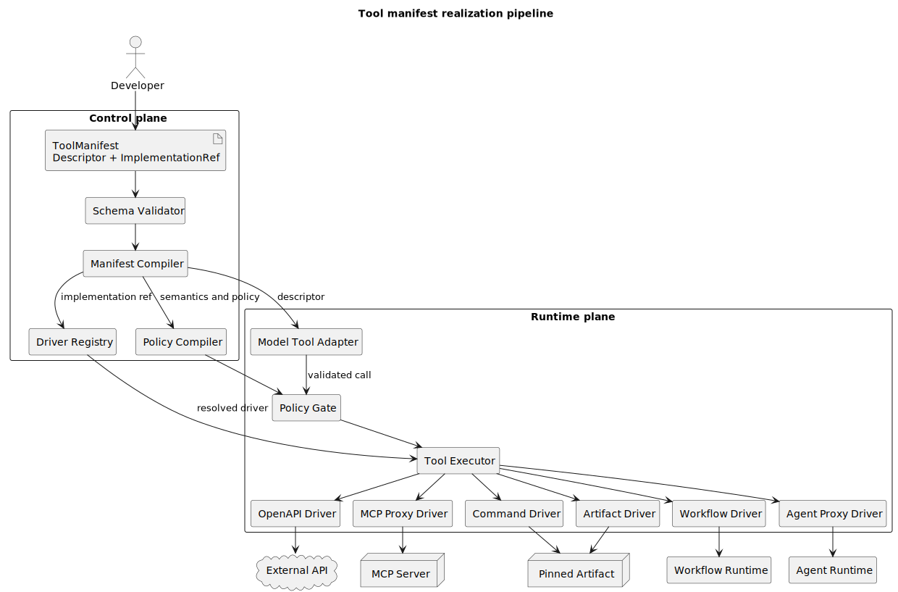
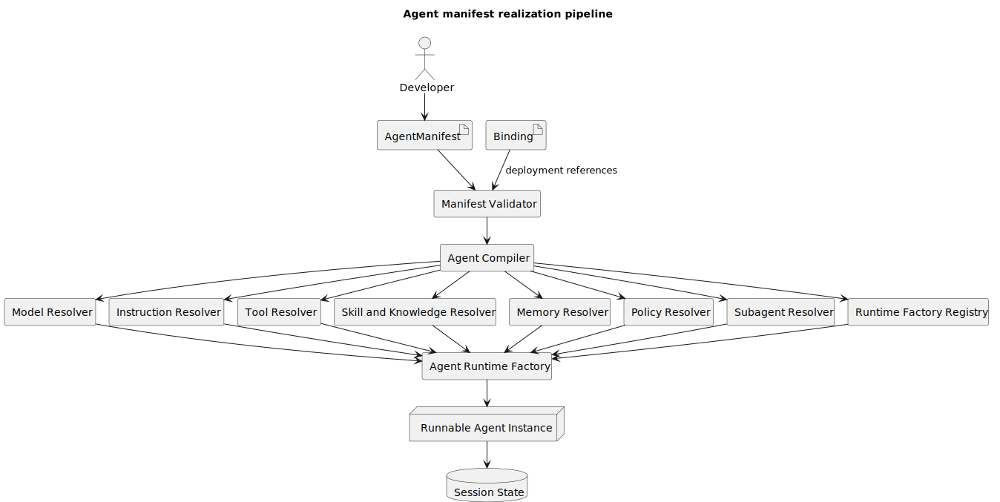
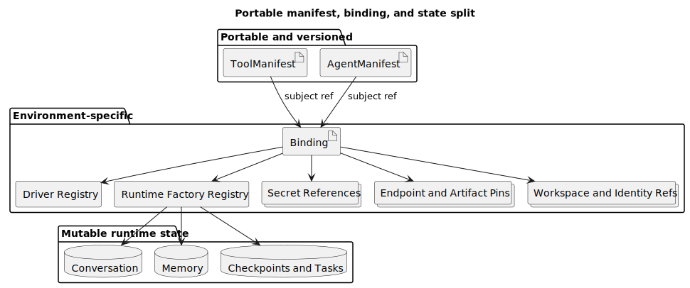

# Tool 与 Agent 元数据规范 V1

- 规范版本：1.0.0
- API 版本：`agentkit.example/v1`
- 状态：目标设计（target-only），不是任何现有产品的原生标准
- 日期：2026-07-18
- JSON Schema：[agent-tool-platform.schema.json](./agent-tool-platform.schema.json)

## 1. 目标和边界

本规范用于实现以下开发体验：

> 开发人员提交 Tool 或 Agent 的 JSON Manifest；平台在不增加产品接入代码的前提下，通过已经安装的 Driver 或 Agent Runtime Factory 完成注册、绑定、权限控制和运行时装配。

V1 不承诺仅凭 `name + description + inputSchema` 生成任意业务行为。Tool 必须引用一个可解析的执行来源；Agent 必须引用一个可解析的 Runtime Factory。V1 支持的执行来源为：内置实现、MCP、OpenAPI、HTTP、Command、签名制品、Workflow 和另一个 Agent。

`agentkit.example` 是本文使用的占位 API group，落地时必须替换为平台拥有的稳定标识。替换 API group 不改变本规范的字段语义。

## 2. 调研基线

V1 是对现有机制的归一化设计，不声称下列项目共享同一个 JSON。开源证据固定到具体 commit；闭源产品只采用公开契约。

| 机制 | 观察到的基线 | 源码或文档证据 | V1 取舍 |
|---|---|---|---|
| 描述与代码一起注册 | Pi `ToolDefinition` | commit `216e672e7c9fc65682553394b74e483c0c9e47f7`，`packages/coding-agent/src/core/extensions/types.ts`，`ToolDefinition` | 将模型描述拆为 `descriptor`，将代码所有权归入 `implementation` |
| 描述与执行对象分离 | Cline `AgentToolDefinition` / `AgentTool` | commit `c564045d8135c0c1c330b21d47b68b74917ce614`，`sdk/packages/shared/src/agent.ts`，约 146-186 行 | Tool 只有同时解析描述和执行端才能 Ready |
| 宿主回调 | Codex Dynamic Tool | commit `315195492c80fdade38e917c18f9584efd599304`，`codex-rs/protocol/src/dynamic_tools.rs`、`codex-rs/core/src/tools/handlers/dynamic.rs` | 归入受信任的 `artifact`/host driver，而不是声称描述可以自行执行 |
| 协议代理 | MCP `tools/list` / `tools/call` | commit `26897cc322f356487da89113451bd16b520b9288`，`schema/2025-11-25/schema.ts`，约 1080-1297 行 | `mcp` driver 发现描述并把调用转给 Server |
| 命令驱动 | Qwen Code discovery/call command | commit `0ecba4b3c709d271a17faa5ac9537bf1b102eaf1`，`packages/core/src/tools/tool-registry.ts`，约 42-181 行 | `command` driver 使用固定 JSON stdin/stdout 契约 |
| OpenAPI 驱动 | Coze Studio Plugin | commit `22275b1c2661d35344a7493cffe401e8cc61cf8e`，`backend/domain/plugin/conf/load_plugin.go`、`backend/domain/plugin/service/tool/invocation_http.go` | `openapi` driver 编译 operation 并构造 HTTP 请求 |
| Agent Profile 编译 | Codex、OpenCode、Grok Build、Coze Studio | 详见[总调研文档](./README.md#5-源码与文档基线) | Agent Manifest 先编译为不可变计划，再由 Runtime Factory 创建实例 |
| 托管 Tool / Custom Tool | Anthropic Managed Agents | [Tools](https://platform.claude.com/docs/en/managed-agents/tools)、[Tool reference](https://platform.claude.com/docs/en/agents-and-tools/tool-use/tool-reference) | 区分厂商托管执行和应用回调，不反推 Claude Code 内部类型 |

## 3. V1 的核心决定

### 3.1 Tool 拆成描述和实现

- `spec.descriptor`：模型可以看到什么。
- `spec.exposure`：描述何时进入模型上下文或 Tool Search。
- `spec.implementation`：平台通过哪个 Driver 执行。
- `spec.semantics`：副作用、幂等、开放世界、超时和并发事实。
- `spec.policy`：是否自动批准、询问或拒绝。
- `spec.requires`：进入 Bound/Ready 前必须由 Binding 满足的依赖。

只有描述、没有可解析实现的资源不能进入 Ready。

### 3.2 Agent 是运行计划，不是会话快照

Agent Manifest 保存 Runtime、模型、指令、Tool 选择、Skill、Knowledge、Memory、Policy、Subagent、Hook 和输出契约。conversation、checkpoint、临时 OAuth token、正在运行的 task 和 lease 不属于 Manifest。

### 3.3 Manifest、Binding、State 分离

- Manifest 可版本化、评审和跨环境复用。
- Binding 保存 secretRef、endpoint、workspace、identity 和 artifact pin。
- Runtime State 保存会话、记忆、checkpoint、健康和任务状态。

这是相对多数现有产品的**架构变更**。禁止明文密钥、强制策略字段和 Driver allowlist 属于**安全加固**。V1 支持八类 Driver 属于**产品范围约束**。

## 4. 公共资源封套

Tool、Agent 和 Binding 共用以下资源封套。下面仅展示公共结构，不是可直接发布的完整资源；`spec` 必须由对应 `kind` 的必填字段补全：

```jsonc
{
  "apiVersion": "agentkit.example/v1",
  "kind": "Tool",
  "metadata": {
    "name": "weather.current",
    "version": "1.0.0",
    "displayName": "Current Weather",
    "description": "Returns current weather for a city.",
    "labels": {
      "domain": "weather",
      "owner": "platform-team"
    },
    "annotations": {}
  },
  "spec": {}
}
```

| 字段 | 必填 | 规则 |
|---|---:|---|
| `apiVersion` | 是 | V1 固定为 `agentkit.example/v1` |
| `kind` | 是 | `Tool`、`Agent` 或部署辅助资源 `Binding` |
| `metadata.name` | 是 | 稳定资源名；小写，可包含点、下划线和连字符 |
| `metadata.version` | 是 | SemVer；版本发布后内容不可原地修改 |
| `metadata.displayName` | 否 | 面向人的展示名，不参与调用路由 |
| `metadata.description` | 否 | 面向目录和治理人员的资源说明 |
| `metadata.labels` | 否 | 可用于 Agent selector 的低基数键值标签 |
| `metadata.annotations` | 否 | 非执行性扩展信息；不能决定授权或 Driver 路由 |
| `spec` | 是 | 随 `kind` 变化的封闭结构 |

## 5. Tool Metadata V1

### 5.1 完整 JSON

以下示例由 OpenAPI Driver 执行；同一内容保存在 [tool-openapi.json](./examples/tool-openapi.json)。

```json
{
  "apiVersion": "agentkit.example/v1",
  "kind": "Tool",
  "metadata": {
    "name": "weather.current",
    "version": "1.0.0",
    "displayName": "Current Weather",
    "description": "Returns current weather for a city.",
    "labels": {
      "domain": "weather",
      "owner": "platform-team"
    }
  },
  "spec": {
    "descriptor": {
      "name": "get_current_weather",
      "title": "Get current weather",
      "description": "Get current weather observations for one city.",
      "inputSchema": {
        "type": "object",
        "properties": {
          "city": {
            "type": "string",
            "description": "City name."
          },
          "units": {
            "type": "string",
            "enum": ["metric", "imperial"]
          }
        },
        "required": ["city"],
        "additionalProperties": false
      },
      "outputSchema": {
        "type": "object",
        "properties": {
          "temperature": { "type": "number" },
          "conditions": { "type": "string" }
        },
        "required": ["temperature", "conditions"]
      },
      "tags": ["weather", "read"]
    },
    "exposure": {
      "mode": "eager",
      "searchable": true,
      "keywords": ["weather", "temperature", "conditions"],
      "group": "weather.read"
    },
    "implementation": {
      "kind": "openapi",
      "driver": "core.openapi@1",
      "documentRef": "registry://openapi/weather-service/3.2.0",
      "operationId": "getCurrentWeather"
    },
    "semantics": {
      "readOnly": true,
      "destructive": false,
      "idempotent": true,
      "openWorld": true,
      "timeoutMs": 10000,
      "retry": {
        "maxAttempts": 2,
        "backoffMs": 250,
        "retryOn": ["timeout", "http_502", "http_503"]
      }
    },
    "requires": [
      {
        "name": "weather-api-token",
        "kind": "secret",
        "description": "Service token supplied by the deployment binding."
      },
      {
        "name": "weather-api-base-url",
        "kind": "endpoint"
      }
    ],
    "policy": {
      "approval": "auto",
      "audience": ["agent", "developer"]
    }
  }
}
```

### 5.2 Tool 字段

| 字段 | 必填 | 作用 | 约束 |
|---|---:|---|---|
| `descriptor.name` | 是 | 模型调用名 | V1 使用小写跨供应商安全子集 |
| `descriptor.title` | 否 | UI 展示名 | 不参与路由 |
| `descriptor.description` | 是 | 告诉模型何时以及如何使用 | 必须描述边界和关键限制 |
| `descriptor.inputSchema` | 是 | 调用参数契约 | JSON Schema object；调用前校验 |
| `descriptor.outputSchema` | 否 | 结构化结果契约 | Driver 返回后校验 |
| `descriptor.tags` | 否 | 目录、selector 和搜索信号 | 不能扩大授权 |
| `exposure.mode` | 是 | `eager`、`deferred`、`hidden` | `hidden` 时必须 `searchable: false` |
| `exposure.searchable` | 是 | Tool Search 能否索引 | 只在 Agent 已选中且策略允许的集合中生效 |
| `exposure.aliases/keywords/group` | 否 | 补充检索和分组 | 不改变真实调用名 |
| `implementation.kind` | 是 | 选择执行机制 | 必须是 V1 封闭 union |
| `implementation.driver` | 是 | 选择已安装 Driver 及兼容版本 | 未安装或不兼容时不能 Ready |
| `semantics` | 是 | 提供策略和调度事实 | `readOnly: true` 强制 `destructive: false` |
| `requires` | 否 | 声明部署依赖 | 只声明名称和类型，不放实际 secret |
| `policy.approval` | 是 | `auto`、`ask`、`deny` | 与 Agent policy 合并时取更严格结果 |
| `policy.audience` | 否 | 限制 agent/developer 等调用方 | 由 Policy Engine 执行 |

### 5.3 V1 Implementation union

| `kind` | 关键字段 | 执行所有者 | 调研来源 |
|---|---|---|---|
| `builtinRef` | `toolRef`、可选 `config` | 平台内置实现 | 各 Agent 内置 Tool、Tool Search |
| `mcp` | `serverRef`、`toolName`、可选 `transport` | MCP Server | Claude Code、Codex、Kiro、Goose、MCP |
| `openapi` | `documentRef` 加 `operationId`，或 `method + path` | 平台 OpenAPI Driver 调用 HTTP API | Coze Studio |
| `http` | `method`、`urlTemplate`、headers/body/response mapping | 平台固定 HTTP Driver | Continue 的有限 HTTP 路径 |
| `command` | `commandRef`、`argsTemplate`、`inputMode`、`outputMode` | 受限进程或容器 | Qwen Code、Gemini CLI |
| `artifact` | `artifactRef`、`entrypoint`、`runtime`、`integrity` | 签名 WASM/JS/Python/Container 制品 | Pi、OpenCode、Cline、Amp、Grok 的代码抽象 |
| `workflow` | `workflowRef`、input/output mapping | 已部署 Workflow Runtime | Coze workflow 等组合能力 |
| `agentProxy` | `agentRef`、`promptTemplate`、可选 `resultSelector` | 被引用 Agent 的 Runtime | Cline、Amp、Continue 的 subagent Tool |

`implementation.config` 只允许 Driver 自己的闭合子 Schema。顶层 V1 Schema 对 `builtinRef.config` 保持开放，是为了允许已安装 Driver 扩展；生产 Registry 必须根据 `driver` 再执行第二阶段校验，不能直接信任任意键值。

### 5.4 Tool 装配和调用



[PlantUML 源码](./diagram.puml#L1)

1. Validator 校验 V1 JSON、嵌入的 input/output Schema 和字段不变量。
2. Binding Resolver 解析 endpoint、secret、workspace、identity 和 artifact pin。
3. Driver Registry 以 `implementation.driver` 解析兼容 Driver。
4. Driver 执行健康检查；成功后资源从 Bound 进入 Ready。
5. Manifest Compiler 把 `descriptor` 转成当前模型供应商的 Tool Schema。
6. 模型返回 Tool Call 后，Runtime 再次校验参数并合并 Tool/Agent Policy。
7. Policy Gate 批准后调用 Driver；Driver 负责超时、取消、错误和结果规范化。
8. Runtime 校验 `outputSchema`，记录审计事件，再把 Tool Result 放回会话。

建议状态机为 `Draft -> Validated -> Bound -> Ready -> Disabled/Failed`。只有 Ready Tool 可以进入模型上下文或 Tool Search 候选集。

## 6. Agent Metadata V1

### 6.1 完整 JSON

以下示例是只读代码审查 Agent；扩展示例见 [agent-code-review.json](./examples/agent-code-review.json)。

```json
{
  "apiVersion": "agentkit.example/v1",
  "kind": "Agent",
  "metadata": {
    "name": "engineering.code_reviewer",
    "version": "1.3.0",
    "displayName": "Code Reviewer",
    "description": "Reviews a change set for correctness, security, and missing tests.",
    "labels": {
      "domain": "engineering",
      "role": "reviewer"
    }
  },
  "spec": {
    "runtime": {
      "factory": "core.react-agent@2",
      "provider": "configured-provider",
      "model": "configured-provider/reasoning-model",
      "reasoningEffort": "high",
      "maxTurns": 40,
      "timeoutMs": 1200000
    },
    "instructions": {
      "inline": "Review only the requested change set. Cite files and line numbers. Do not modify files.",
      "refs": ["policy://engineering/review-standard/4.0.0"]
    },
    "tools": [
      {
        "ref": {
          "name": "repository.dependency_audit",
          "version": "2.1.0"
        },
        "approval": "auto"
      },
      {
        "selector": {
          "tags": ["repository", "read"]
        },
        "exclude": ["shell_write"]
      }
    ],
    "memory": {
      "mode": "project",
      "storeRef": "binding://memory/project-review",
      "readOnly": false
    },
    "policy": {
      "defaultApproval": "ask",
      "sandbox": "worktree",
      "permissions": [
        {
          "capability": "filesystem.read",
          "effect": "allow"
        },
        {
          "capability": "filesystem.write",
          "effect": "deny"
        }
      ],
      "maxParallelTools": 4
    },
    "outputSchema": {
      "type": "object",
      "properties": {
        "findings": {
          "type": "array",
          "items": { "type": "object" }
        }
      },
      "required": ["findings"]
    }
  }
}
```

### 6.2 Agent 字段

| 字段 | 必填 | 作用 | 运行时处理 |
|---|---:|---|---|
| `runtime.factory` | 是 | 选择已安装 Agent Loop/Factory | 未安装或版本不兼容时编译失败 |
| `runtime.provider/model` | 是 | 选择模型执行端 | 由 Binding 和 Provider Registry 解析凭据及端点 |
| `runtime.maxTurns/timeoutMs` | 是 | 硬性运行边界 | Runtime 强制终止，不依赖 prompt |
| `runtime.reasoningEffort/temperature` | 否 | 模型调优 | 仅在 Provider 支持时生效 |
| `instructions` | 是 | system/developer instruction 的 inline 和版本化引用 | Compiler 按稳定顺序合并并计算 digest |
| `initialPrompt` | 否 | Agent 的默认任务入口 | 不替代用户的实际会话输入 |
| `tools` | 是 | 精确引用或 label/tag selector | 只能解析 Ready Tool；selector 后再应用 exclude |
| `skills` | 否 | 版本化 Skill 引用 | 内容在启动前解析和固定 |
| `knowledge` | 否 | 知识库或文档索引引用 | 由 Knowledge Resolver 绑定 |
| `memory` | 是 | `none/session/project/user/managed` 和 storeRef | 可变内容保存在 Store，不写回 Manifest |
| `policy` | 是 | 默认审批、sandbox、权限、并行和预算 | 与 Tool policy 合并，deny 优先 |
| `subagents` | 否 | 可调用的 Agent 引用、alias 和并发 | 被引用 Agent 必须独立编译成功 |
| `hooks` | 否 | 生命周期 handler 引用 | 只允许 Registry 中已批准的 handler，不允许内联 shell |
| `outputSchema` | 否 | 最终输出契约 | 完成前校验；失败按 Runtime 规则重试或终止 |

### 6.3 Agent 编译和运行



[PlantUML 源码](./diagram.puml#L65)

Agent Compiler 必须生成不可变 `ResolvedAgentPlan`，至少包含 Manifest digest、已解析模型、完整指令 digest、Ready Tool 集合、Skill/Knowledge digest、Memory Binding、权限图、Sandbox、Subagent roster 和预算边界。Runtime Factory 只接受该计划，不在会话中重新解释原始 Manifest。

Agent Instance 启动后的循环为：

1. 组装当前消息和模型可见 Tool。
2. 调用模型。
3. 若模型返回 Tool Call，执行 Tool 参数校验、Agent/Tool Policy 合并和 approval。
4. 调用 Tool Driver，把结果写回会话并继续下一轮。
5. 若返回最终答案，校验 `outputSchema` 并结束。
6. 达到 `maxTurns`、`timeoutMs`、预算或策略拒绝时，以机器可读终态结束。

## 7. Binding 边界



[PlantUML 源码](./diagram.puml#L119)

V1 Schema 保留 `Binding`，因为 Tool/Agent Manifest 中的执行引用不应包含部署密钥。完整示例见 [binding-development.json](./examples/binding-development.json)。

| Manifest 声明 | Binding 提供 | Runtime State 保存 |
|---|---|---|
| `requires[name=weather-api-token, kind=secret]` | `secretRef` 以及注入目标 | 临时 credential lease 和刷新状态 |
| `serverRef` / endpoint requirement | 环境 URL、OAuth resource | 连接、健康、分页 cursor |
| `commandRef` / `artifactRef` | digest、签名、runtime pin | 进程、容器、取消句柄 |
| `workspace` requirement | workspaceRef、允许根目录 | 临时文件、工作树状态 |
| Agent `memory.storeRef` | 实际 Store Binding | 会话/项目/用户记忆内容 |

## 8. V1 一致性和失败规则

1. 资源名和版本组成稳定身份；同版本内容必须不可变，跨资源 `ResourceRef` 必须固定到明确版本。
2. `descriptor.name` 必须在一个 Resolved Agent Plan 内唯一；alias 冲突必须编译失败或使用显式限定名，不能静默覆盖。
3. `readOnly: true` 时 `destructive` 必须为 `false`；语义字段是 Policy 输入，不直接等同授权结论。
4. `hidden` Tool 不可搜索；`deferred` Tool 只能被当前 Agent 已选择且已授权的 Tool Search 激活。
5. Driver、Runtime Factory、Handler 和 Artifact 必须来自 allowlist；Driver/Factory 引用必须带版本，Handler/Artifact 必须记录精确版本或 digest。
6. 缺少 secret、endpoint、workspace、identity 或 artifact pin 时状态为 Unbound，不能延迟到首次调用才随机失败。
7. Tool 输入和输出都必须按 Schema 校验；协议错误、业务错误、超时、拒绝和取消使用不同机器可读错误码。
8. Tool policy 与 Agent policy 合并时采用 `deny > ask > auto`；环境策略只能收紧，不能扩大 Manifest 权限。
9. 所有调用至少记录 Agent/Tool Manifest digest、Binding revision、Driver/Factory version、actor、approval decision、duration 和 result digest。
10. 明文 secret、access token、绝对机器路径、conversation 和 checkpoint 出现在 Manifest 时必须拒绝发布。

## 9. 与调研产品的对应关系

| V1 字段 | 对应观察 |
|---|---|
| `descriptor` | MCP Tool、Anthropic Custom Tool、Codex Dynamic Tool、Cline `AgentToolDefinition` |
| `implementation.artifact` | Pi/OpenCode/Cline/Amp/OpenClaw/Grok 的代码 Tool，由受信任制品封装 |
| `implementation.mcp` | Claude Code、Codex、Kiro、Goose、Devin、Continue |
| `implementation.command` | Qwen Code、Gemini CLI discovery/call command |
| `implementation.openapi` | Coze Studio Manifest + OpenAPI + generic HTTP executor |
| `implementation.agentProxy` | Cline、Amp、Continue 的 Agent-as-Tool |
| `exposure.deferred` | Codex `defer_loading`、Anthropic/Claude Tool Search、GitHub Copilot CLI Tool Search |
| Agent `runtime + instructions + tools + policy` | Claude Code/OpenCode/Qwen/Kiro/Grok Agent Profile、Coze Agent builder |
| Binding 分离 | Managed MCP 认证、OpenClaw workspace/identity、各产品 MCP endpoint/auth 配置 |

## 10. 规范制品和示例

- [V1 JSON Schema](./agent-tool-platform.schema.json)
- [OpenAPI Tool](./examples/tool-openapi.json)
- [Command Tool](./examples/tool-command.json)
- [MCP Tool](./examples/tool-mcp.json)
- [Tool Search](./examples/tool-search.json)
- [Code Review Agent](./examples/agent-code-review.json)
- [Development Binding](./examples/binding-development.json)
- [调研与来源总表](./README.md)

## 11. 版本历史

| 版本 | 日期 | 变更 |
|---|---|---|
| 1.0.0 | 2026-07-18 | 基于主流 Agent、MCP、Command Driver 和 OpenAPI Driver 调研，发布 Tool/Agent Metadata V1；明确必填字段、执行所有权、Binding 边界和失败规则 |
