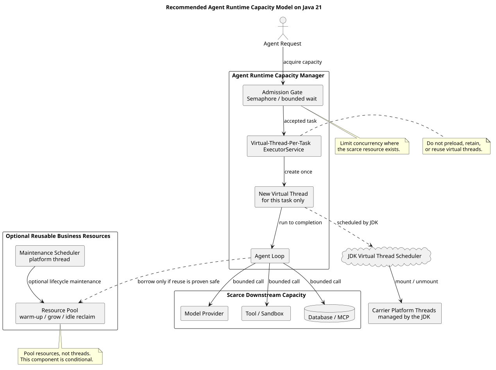

# Java 21 虚拟线程池需求解读与替代方案

| 项目 | 内容 |
| --- | --- |
| 文档版本 | 1.0.0 |
| 状态 | 供需求澄清与架构评审 |
| 编制日期 | 2026-07-29 |
| 官方依据 | Oracle Java SE 21《Virtual Threads》 |
| 应用源码基线 | `pi-mono-java` commit `1f7a5423219edfa4519d8719f1cc8a188ed72873` |
| 本文档仓库基线 | `pi-mono-java-design` commit `dcec84a54869842680cb0f818370f8f18831bd5b` |

## 1. 评审结论

不建议立项实现“预创建、复用、动态扩容、空闲回收虚拟线程”的传统虚拟线程池。

这不是因为 Java 21 不支持虚拟线程，也不是因为项目不需要并发治理，而是因为该实现方向与 Oracle Java 21 的官方使用模型相冲突。Oracle 明确要求把每个并发任务表示成一个新的虚拟线程，并以 **“Never Pool Virtual Threads”** 作为采用指南的章节标题。`Executors.newVirtualThreadPerTaskExecutor()` 虽然返回 `ExecutorService`，但其语义是每提交一个任务就创建一个新虚拟线程，不复用虚拟线程。

建议把需求调整为：

> 基于 Java 21 虚拟线程实现 Agent 任务的一任务一线程隔离；通过 `Semaphore`、有界等待和超时控制 Agent 及下游资源并发；仅对经过验证、创建成本高且能够安全复用的业务资源提供预热、按需扩容和空闲回收，不复用虚拟线程本身。

对应的交付名称可使用“Agent Runtime 容量治理”或 `AgentRuntimeCapacityManager`。如果产品命名必须保留 `AgentRuntimePool`，应在需求定义中明确：它池化的是可复用的 Runtime 业务资源，而不是 Java 虚拟线程。

## 2. Oracle Java 21 官方证据

核心依据来自 Oracle Java SE 21 官方文档的采用指南：[Virtual Threads](https://docs.oracle.com/en/java/javase/21/core/virtual-threads.html#GUID-DC4306FC-D6C1-4BCC-AECE-48C32C1A8DAA)。

| Oracle 官方要点 | 中文解读 | 对需求的直接影响 |
| --- | --- | --- |
| 每个并发任务由一个虚拟线程表示，章节明确使用 “Never Pool Virtual Threads” | 虚拟线程的生命周期应与任务绑定，而不是作为长期存活的工作线程被重复借还 | 不应设计虚拟线程的预创建、借用、归还和空闲回收 |
| `newVirtualThreadPerTaskExecutor()` 每次提交都启动一个新虚拟线程 | `ExecutorService` 是任务提交接口，不等同于传统固定线程池 | 可以使用 Executor API，但不能据此把它描述为“复用虚拟线程的线程池” |
| 为限制并发，应使用 `Semaphore` | 并发上限应该表达为稀缺资源的许可数量 | 模型调用、数据库、MCP、沙箱等分别设置容量闸门 |
| 数据库连接池等资源池本身已经构成并发限制 | 应在真正稀缺的资源边界实施背压 | 不应再用虚拟线程数量间接模拟数据库容量 |
| 不要用虚拟线程的 `ThreadLocal` 缓存昂贵且可复用的对象 | 虚拟线程数量很大、生命周期很短，线程本地缓存会放大内存占用并失去复用价值 | 昂贵对象应独立池化或缓存，生命周期不得绑定到虚拟线程 |
| 阻塞操作通常会卸载虚拟线程；少数 `synchronized` 场景可能产生 pinning | 虚拟线程优化的是高并发阻塞任务的可扩展性，不等于没有运行时风险 | 应通过 JFR 观察 pinning 和下游饱和，而不是通过复用虚拟线程规避问题 |

`Executors` 的 Java 21 API 也把 `newVirtualThreadPerTaskExecutor()` 定义为“每个任务创建一个新的虚拟线程”的执行器，并说明线程数量不设上界：[Executors.newVirtualThreadPerTaskExecutor](https://docs.oracle.com/en/java/javase/21/docs/api/java.base/java/util/concurrent/Executors.html#newVirtualThreadPerTaskExecutor())。

OpenJDK 的 JEP 444 与 Oracle 文档保持相同口径：虚拟线程不应被池化；当业务需要限制并发时，应使用信号量等并发控制机制：[JEP 444: Virtual Threads](https://openjdk.org/jeps/444)。

因此，拒绝“复用虚拟线程池”不是个人偏好，而是遵循 JDK 21 官方编程模型。

## 3. 概念澄清

| 概念 | 是否复用线程 | 负责解决的问题 | 本项目建议 |
| --- | --- | --- | --- |
| `ExecutorService` | 不一定 | 统一任务提交、关闭和结构化管理接口 | 可以使用 |
| `ThreadPoolExecutor` | 是 | 复用稀缺的平台线程，并用队列吸收任务 | 不用于虚拟线程 |
| `newVirtualThreadPerTaskExecutor()` | 否 | 每个任务创建一个新虚拟线程 | 推荐用于独立任务 |
| JDK 虚拟线程调度器 | 内部管理载体线程 | 将大量虚拟线程调度到少量平台载体线程 | 由 JDK 管理，不做业务池化 |
| `Semaphore` / 容量闸门 | 与线程复用无关 | 限制对稀缺下游资源的并发访问 | 推荐 |
| 业务资源池 | 复用资源对象 | 摊薄昂贵资源的创建成本 | 有证据时按资源类型建设 |

实际 Java 项目中当然会有“线程池”，但需要区分线程种类：

- CPU 密集型任务仍可能使用固定大小的平台线程池，以接近 CPU 核数的并行度执行。
- 定时维护任务可使用少量平台线程的 `ScheduledExecutorService`。
- 阻塞型、高并发、任务相互独立的工作适合每任务一个虚拟线程。
- 数据库连接、浏览器进程、沙箱 Worker、远程会话等昂贵资源可单独池化。

所以，正确结论不是“Java 项目里没有线程池”，而是“不要建立复用虚拟线程的线程池”。

## 4. 为什么传统线程池需求不适用于虚拟线程

### 4.1 预加载

平台线程预创建可以降低操作系统线程创建延迟；虚拟线程本身创建成本很低，Oracle 建议即使任务很短也创建新的虚拟线程。预创建尚未运行的虚拟线程既不能承担未来未知任务，也不能在终止后重新启动，因此不能形成有意义的“热虚拟线程库存”。

如果预加载的真正诉求是减少首请求延迟，应明确预热对象，例如模型客户端、TLS 连接、MCP 会话、工具元数据、类加载或沙箱 Worker，而不是预热虚拟线程。

### 4.2 动态扩容

每任务执行器会随已接受的任务自然创建虚拟线程，不需要设置 `corePoolSize` 或 `maximumPoolSize`。真正需要扩缩的是下游许可或可复用业务资源。扩容决策应基于供应商配额、连接数、CPU、内存、租户限额和排队时延，而不是“空闲虚拟线程数”。

### 4.3 空闲回收

虚拟线程在任务完成后即终止，由 JVM 回收。它不会像传统工作线程那样在池中等待下一项任务，因此不存在业务层面的虚拟线程空闲扫描、保活时间和回收策略。

### 4.4 固定池大小

用固定数量的虚拟工作线程消费共享队列，会重新引入排队、任务与线程生命周期分离以及上下文定位困难，同时没有节省稀缺平台线程的收益。若并发必须为 100，应让每个任务拥有自己的虚拟线程，并在真正受限的操作前获取 100 个许可之一。

### 4.5 `ThreadLocal` 资源缓存

把昂贵对象缓存在虚拟线程的 `ThreadLocal` 中，会随着大量短生命周期虚拟线程复制资源，既不能实现有效复用，也可能显著增加内存。需要复用的对象应由独立资源池或缓存管理。

## 5. `pi-mono-java` 当前实现观察

以下均为源码基线 `1f7a5423219edfa4519d8719f1cc8a188ed72873` 上的已观察行为，不是目标设计推测。

| 观察项 | 源码证据 | 当前行为 | 判断 |
| --- | --- | --- | --- |
| Agent 异步运行 | [`Agent.java:60-61`](https://github.com/superheromeZzh/pi-mono-java/blob/1f7a5423219edfa4519d8719f1cc8a188ed72873/modules/agent-core/src/main/java/com/campusclaw/agent/Agent.java#L60-L61)、[`Agent.java:245-253`](https://github.com/superheromeZzh/pi-mono-java/blob/1f7a5423219edfa4519d8719f1cc8a188ed72873/modules/agent-core/src/main/java/com/campusclaw/agent/Agent.java#L245-L253) 中 `VIRTUAL_THREAD_EXECUTOR`、`runAsync` | 每次执行命令时调用 `Thread.ofVirtual().start(command)`，Agent Loop 在新虚拟线程运行 | 已符合一任务一虚拟线程 |
| 工具串行执行 | [`ToolExecutionPipeline.java:178-184`](https://github.com/superheromeZzh/pi-mono-java/blob/1f7a5423219edfa4519d8719f1cc8a188ed72873/modules/agent-core/src/main/java/com/campusclaw/agent/tool/ToolExecutionPipeline.java#L178-L184) 中 `executeSequentially` | 工具调用在当前 Agent Loop 虚拟线程内顺序完成 | 无需额外线程池 |
| 工具并行执行 | [`ToolExecutionPipeline.java:187-207`](https://github.com/superheromeZzh/pi-mono-java/blob/1f7a5423219edfa4519d8719f1cc8a188ed72873/modules/agent-core/src/main/java/com/campusclaw/agent/tool/ToolExecutionPipeline.java#L187-L207) 中 `executeInParallel` | 使用 `Executors.newVirtualThreadPerTaskExecutor()`，每个并行工具调用是独立虚拟线程任务 | 已符合 Oracle 推荐模型 |
| 会话清理 | [`SessionPool.java:167-173`](https://github.com/superheromeZzh/pi-mono-java/blob/1f7a5423219edfa4519d8719f1cc8a188ed72873/modules/coding-agent-cli/src/main/java/com/campusclaw/codingagent/mode/server/SessionPool.java#L167-L173) 中清理调度器 | 使用单平台线程定期清理空闲会话 | 定时维护使用平台线程合理 |
| Agent 会话状态 | [`AgentSession.java:52-76`](https://github.com/superheromeZzh/pi-mono-java/blob/1f7a5423219edfa4519d8719f1cc8a188ed72873/modules/coding-agent-cli/src/main/java/com/campusclaw/codingagent/session/AgentSession.java#L52-L76) | 每个会话持有模型、上下文、工具及 Agent 等状态 | 不能在缺少隔离规则时跨会话直接复用 |

当前代码已经在核心执行路径采用 Oracle 推荐的虚拟线程模型。因此，新增“虚拟线程池”不是补齐缺失能力，反而会改变已正确的执行语义。可补齐的能力是并发准入、排队上限、超时、资源隔离、指标和告警。

## 6. 推荐目标方案

本节是目标方案，不代表当前 `pi-mono-java` 已经实现。

[PlantUML 源码](diagram.puml#L12)

### 6.1 执行模型

1. 每个已接受的 Agent Run 创建一个新的虚拟线程。
2. 并行工具调用继续采用每任务一个虚拟线程。
3. 任务完成后虚拟线程终止，不进入空闲列表，不复用。
4. JDK 内部负责虚拟线程到载体平台线程的调度，业务代码不管理载体线程池。

### 6.2 容量治理

按稀缺资源维度设置独立许可，避免一个全局池大小掩盖不同瓶颈：

| 容量维度 | 推荐控制方式 | 示例指标 |
| --- | --- | --- |
| 全局 Agent Run | `Semaphore` + 有界等待 + 获取超时 | 运行中、等待中、获取许可耗时 |
| 租户或用户 | 分区许可或配额 | 每租户并发、拒绝数、公平性 |
| 模型供应商 | 按供应商/模型限流与并发许可 | 429、首 Token 延迟、在途请求 |
| Tool / Sandbox | 按工具类别设置许可 | 启动耗时、CPU、内存、超时 |
| 数据库 / MCP | 使用已有连接池或会话容量 | 活跃连接、等待连接、连接超时 |

等待必须有上限。达到容量后应执行明确策略：短时有界等待、快速失败或按业务优先级拒绝。不能用无界任务队列隐藏过载。

### 6.3 可选业务资源池

只有同时满足以下条件时，才建设具备预热、动态扩容、空闲回收能力的业务资源池：

- 创建或初始化成本经压测证明足够高；
- 资源能够在任务结束后可靠清理状态；
- 跨请求、跨租户复用满足安全隔离要求；
- 资源存在明确上限且有健康检查、借用超时和泄漏检测；
- 池化后的吞吐或延迟收益大于生命周期管理复杂度。

可能的候选对象包括沙箱 Worker、浏览器进程、MCP 长连接或特定昂贵客户端。`AgentSession`、对话上下文及带租户状态的 Agent Runtime 默认不应跨会话复用。

这里的预加载、动态扩容、空闲回收针对业务资源池，是对原需求的**架构调整**；业务目标“降低首请求延迟、控制资源、提升吞吐”保持不变。

### 6.4 可观测性

至少增加以下指标和诊断手段：

- Agent Run 活跃数、等待数、许可获取耗时、等待超时数和拒绝数；
- 各模型、工具、数据库和 MCP 资源的在途数与饱和度；
- 任务端到端延迟、排队延迟、执行延迟和取消结果；
- 虚拟线程数量趋势、堆内存、CPU 和 GC；
- JFR `jdk.VirtualThreadPinned` 事件，定位长时间且高频的 pinning；
- 资源池借用时延、活跃数、空闲数、创建/销毁数和泄漏告警。

## 7. 方案比较

| 方案 | 官方一致性 | 能否限制下游并发 | 是否支持真正资源预热 | 复杂度 | 建议 |
| --- | --- | --- | --- | --- | --- |
| A. 固定并复用虚拟线程池 | 冲突 | 间接且边界模糊 | 否 | 中，高误用风险 | 拒绝 |
| B. 每任务虚拟线程 + `Semaphore` | 一致 | 是，边界清晰 | 否 | 低 | 默认推荐 |
| C. 方案 B + 可选业务资源池 | 一致 | 是 | 是 | 中到高 | 有压测证据时采用 |

## 8. 建议的需求改写

建议将原需求：

> 基于 Java 虚拟线程创建 `AgentRuntimePool`，建立虚拟线程池，支持预加载、动态扩容、空闲回收。

改为：

> 建设 `AgentRuntimeCapacityManager`。Agent Run 和并行工具任务采用 Java 21 每任务一个虚拟线程的执行模型；对全局、租户、模型供应商、工具和数据连接设置独立并发许可、有界等待、超时和拒绝策略；对经过压测证明创建昂贵且可安全复用的 Runtime 业务资源，可选支持预热、按需扩容、健康检查和空闲回收。不得预创建或复用虚拟线程。

如果必须保留 `AgentRuntimePool` 名称，补充定义：

> `AgentRuntimePool` 是 Runtime 业务资源和容量许可的管理组件，不是虚拟线程对象池；任务仍由新的虚拟线程执行。

## 9. 验收标准与 POC 建议

### 9.1 正确性

- 每个 Agent Run 在虚拟线程中执行，`Thread.currentThread().isVirtual()` 为 `true`。
- 每个独立任务创建自己的虚拟线程；不实现虚拟线程借用、归还和复用接口。
- 取消、超时和异常后均释放容量许可。
- 多租户上下文、凭据和会话状态不会通过可复用资源泄漏。

### 9.2 容量控制

- 压测时某类下游资源的最大在途调用数不超过其许可上限。
- 容量耗尽后，等待队列有明确长度或等待时限，不出现无界堆积。
- 过载时返回可识别的超时或拒绝结果，并产生指标和日志。

### 9.3 性能与稳定性

- 对比当前实现、方案 B、方案 C 的吞吐、P50/P95/P99、CPU、堆内存和 GC。
- 使用 JFR 检查 `jdk.VirtualThreadPinned`，对长时间且高频 pinning 定位源码。
- 只有当业务资源预热在真实场景显著改善首请求延迟或吞吐时，才接受方案 C。
- POC 不应通过真实大模型请求制造未授权费用；可先使用可控 Stub 或测试配额验证并发机制。

## 10. 若坚持建设虚拟线程池的风险

- 与 Oracle Java 21 官方采用指南相冲突，后续维护者容易误判执行语义。
- 增加工作线程、共享队列、空闲扫描和生命周期状态机，却没有复用稀缺平台线程的收益。
- 固定工作线程数量可能制造队头阻塞，并把不同下游资源的容量混成一个不准确的全局数字。
- “预热虚拟线程”不能预热模型连接、沙箱或 MCP 等真正昂贵资源，可能交付了形式却没有改善业务指标。
- `ThreadLocal` 缓存等传统池化技巧在大量短生命周期虚拟线程下可能增加内存风险。
- 容量、排队、取消和上下文传播问题会被线程池表象遮蔽，故障定位更困难。

## 11. 面向管理评审的建议表述

可以用以下口径汇报：

> 我们不是取消并发池化目标，而是依据 Oracle Java 21 官方规范调整实现对象。虚拟线程应当一任务一线程、用完即结束，不做预创建和复用；原需求中的并发上限由 `Semaphore` 和有界等待实现，预加载、动态扩容、空闲回收则用于真正昂贵且可复用的 Agent Runtime 业务资源。这样既保留性能和容量治理目标，又避免建设一套与 JDK 官方模型冲突的虚拟线程池。

如果管理评审仍要求采用固定虚拟线程池，应要求补充以下决策依据并记录为架构例外：

1. 需要复用虚拟线程本身的可量化收益；
2. 与 Oracle Java 21 采用指南冲突的接受人及原因；
3. 相比每任务虚拟线程加 `Semaphore` 的压测优势；
4. 队列上限、取消、超时、隔离和监控方案；
5. JDK 升级后的兼容性维护责任。

在没有上述证据前，不建议进入实现。

## 12. 来源与基线

### 12.1 官方资料

- Oracle Java SE 21, [Virtual Threads](https://docs.oracle.com/en/java/javase/21/core/virtual-threads.html#GUID-DC4306FC-D6C1-4BCC-AECE-48C32C1A8DAA)
- Oracle Java SE 21 API, [Executors.newVirtualThreadPerTaskExecutor](https://docs.oracle.com/en/java/javase/21/docs/api/java.base/java/util/concurrent/Executors.html#newVirtualThreadPerTaskExecutor())
- OpenJDK, [JEP 444: Virtual Threads](https://openjdk.org/jeps/444)

### 12.2 应用源码

- `modules/agent-core/src/main/java/com/campusclaw/agent/Agent.java`
- `modules/agent-core/src/main/java/com/campusclaw/agent/loop/AgentLoop.java`
- `modules/agent-core/src/main/java/com/campusclaw/agent/tool/ToolExecutionPipeline.java`
- `modules/coding-agent-cli/src/main/java/com/campusclaw/codingagent/mode/server/SessionPool.java`
- `modules/coding-agent-cli/src/main/java/com/campusclaw/codingagent/session/AgentSession.java`

源码基线：`1f7a5423219edfa4519d8719f1cc8a188ed72873`。

## 13. 版本历史

| 版本 | 日期 | 说明 |
| --- | --- | --- |
| 1.0.0 | 2026-07-29 | 首版；解读 Oracle Java 21 虚拟线程指南，对齐当前实现，提出容量治理与业务资源池替代方案 |
