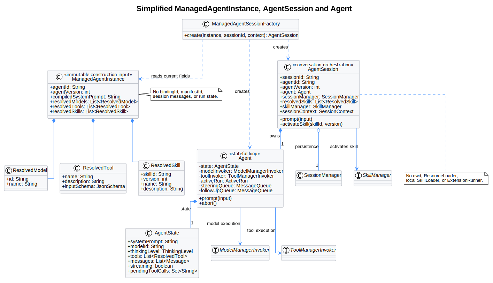
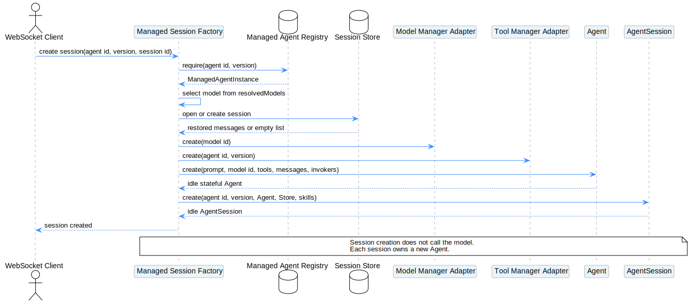
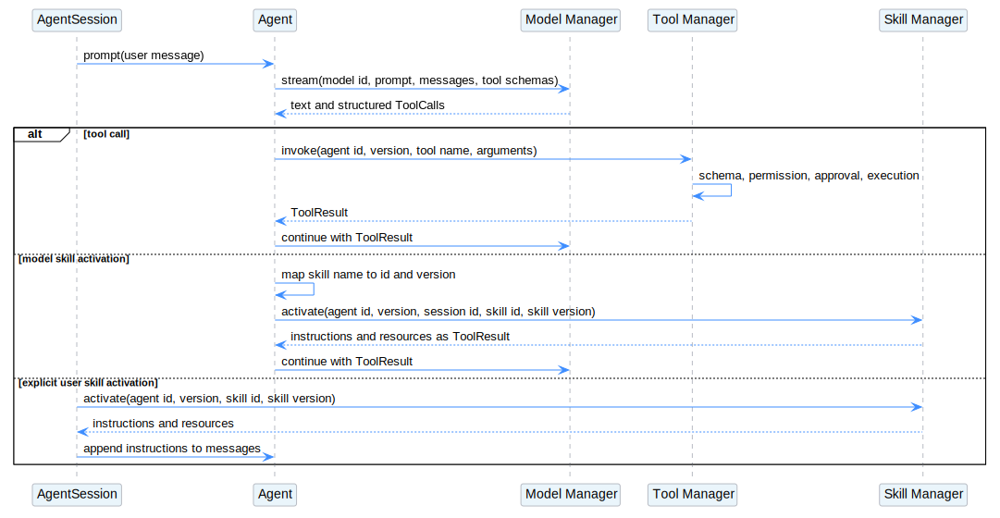

# 简化 ManagedAgentInstance 与 ToB AgentSession/Agent 构建设计

| 属性 | 值 |
|---|---|
| 文档版本 | 1.0.0 |
| 状态 | Draft，供架构评审 |
| pi-mono 源码基线 | `216e672e7c9fc65682553394b74e483c0c9e47f7` |
| pi-mono-java 源码基线 | `b99871a0321b73606a8f074c42050f28f52fdfca` |
| 基线日期 | 2026-07-23 |
| 元数据输入 | `AGENT元数据设计.json`、`TOOL元数据设计.json`、`SKILL元数据设计.json` |
| 设计前提 | pi-mono-java 的 `AgentSession` 和 `Agent` 职责与 pi-mono 对齐；Model、Tool、Skill 均由独立管理器提供和执行 |

## 1. 结论

`ManagedAgentInstance` 不应成为新的会话运行引擎。它只是容器中某个 Agent 版本的、可复用的 Session 构造输入：

```text
ManagedAgentInstance:
    agentId
    agentVersion
    compiledSystemPrompt
    resolvedModels
    resolvedTools
    resolvedSkills
```

其中：

- `agentId` 直接使用 Agent 元数据中的不透明 ID，例如 `agent_011CZkYqphY8vELVzwCUpqiQ`。
- `agentVersion` 直接使用 Agent 元数据版本。
- `compiledSystemPrompt` 由 `system.*`、Tool 清单和 Skill 清单编译得到。
- `resolvedModels` 由 Model Manager 根据 `model[]` 返回。
- `resolvedTools` 由 Tool Manager 根据 `tools[].configs[].name` 返回 `name + description + input_schema`。
- `resolvedSkills` 由 Skill Manager 根据 `skill_id + version` 返回 `name + description`。

不引入元数据中不存在的 `bindingId`、`manifestId` 或 `callableBindings`。调用管理器时直接使用已有标识：

```text
Model: model_id
Tool: agent_id + agent_version + tool_name
Skill: agent_id + agent_version + skill_id + skill_version
```

新建对话时，Factory 读取当前 `ManagedAgentInstance`，创建一个新的 `Agent`，再创建一个新的 `AgentSession`。多个 Session 不共享有状态 `Agent`：

```text
ManagedAgentInstance
    -> AgentSession A -> Agent A
    -> AgentSession B -> Agent B
```

## 2. 源码基线与设计差异

### 2.1 pi-mono 当前类职责

以下是源码中观察到的行为：

| 源码 | 关键符号 | 当前职责 |
|---|---|---|
| [`packages/coding-agent/src/core/agent-session.ts`](../../pi-mono/packages/coding-agent/src/core/agent-session.ts#L284) | `AgentSession` | 持有 `Agent`、`SessionManager`、`SettingsManager`、`ResourceLoader`、`ModelRuntime`、`ExtensionRunner`，并装配 Tool、Skill 和 system prompt |
| [`packages/agent/src/agent.ts`](../../pi-mono/packages/agent/src/agent.ts#L171) | `Agent` | 持有模型上下文、messages、active Run、steering/follow-up queue，并执行模型与 Tool 循环 |
| [`packages/agent/src/types.ts`](../../pi-mono/packages/agent/src/types.ts#L322) | `AgentState` | 保存 `systemPrompt`、`model`、`thinkingLevel`、`tools`、`messages` 和 streaming 状态 |
| [`packages/agent/src/types.ts`](../../pi-mono/packages/agent/src/types.ts#L373) | `AgentTool` | 同时保存模型 Tool Schema 和本地 `execute()` 实现 |
| [`packages/coding-agent/src/core/sdk.ts`](../../pi-mono/packages/coding-agent/src/core/sdk.ts#L164) | `createAgentSession()` | 加载本地资源、创建 Agent、恢复 messages，再创建 AgentSession |

### 2.2 pi-mono-java 当前实现

| 源码 | 关键符号 | 当前职责 |
|---|---|---|
| [`AgentSession.java`](../../pi-mono-java/modules/coding-agent-cli/src/main/java/com/campusclaw/codingagent/session/AgentSession.java#L52) | `AgentSession` | 本地解析 Model、Tool、Skill、Prompt Template 和上下文文件，再创建 Agent |
| [`Agent.java`](../../pi-mono-java/modules/agent-core/src/main/java/com/campusclaw/agent/Agent.java#L56) | `Agent` | 持有 `AgentState`、本地模型服务、Tool Pipeline、消息队列和当前执行 |
| [`AgentState.java`](../../pi-mono-java/modules/agent-core/src/main/java/com/campusclaw/agent/state/AgentState.java#L24) | `AgentState` | 保存 system prompt、完整 Model、thinking level、`AgentTool` 和 messages |
| [`AgentTool.java`](../../pi-mono-java/modules/agent-core/src/main/java/com/campusclaw/agent/tool/AgentTool.java#L17) | `AgentTool` | 同时保存 name、description、parameters 和本地 execute 方法 |

### 2.3 ToB 目标差异

本文以下内容属于目标设计，不是当前 pi-mono 或 pi-mono-java 已有行为：

- Agent 不访问本地文件。
- AgentSession 不加载 cwd、`SYSTEM.md`、`AGENTS.md`、`SKILL.md` 或 Prompt Template。
- Model Manager 执行模型。
- Tool Manager 返回 Tool Schema、处理 permission、审批并执行 Tool。
- Skill Manager 返回 Skill 描述、加载正文并激活 Skill。
- `ManagedAgentInstance` 在容器启动或管理面同步时构建，Session 请求只读取已经构建好的实例。

## 3. Agent 元数据字段如何使用

### 3.1 字段映射

| Agent 元数据字段 | ManagedAgentInstance | AgentSession | Agent | 其他组件 |
|---|---|---|---|---|
| `id` | 保存为 `agentId` | 保存，作为会话所属 Agent | 不必单独保存 | Tool/Skill 调用上下文使用 |
| `version` | 保存为 `agentVersion` | 保存，固定会话使用的 Agent 配置版本 | 不必单独保存 | Tool/Skill Manager 查找该版本配置 |
| `type` | 不需要 | 不需要 | 不需要 | Agent 管理面校验 |
| `created_at/updated_at` | 不需要 | 不需要 | 不需要 | 管理面展示与审计 |
| `name/display_name/description` | 运行时不需要 | 可选，供 UI 展示 | 不需要 | Agent 管理面或 Router 使用 |
| `model[]` | 解析为 `resolvedModels` | 创建 Agent 时选择一个 model ID | 保存选中的 `modelId` | Model Manager 提供模型信息并执行 |
| `system.*` | 编译为 `compiledSystemPrompt` | 传给新 Agent | 保存最终 `systemPrompt` | Prompt Compiler 负责编译 |
| `use_cases` | 不需要 | 不需要 | 不需要 | Agent Router 在创建 Session 前使用 |
| `tools[]` | 解析为 `resolvedTools` | 传给新 Agent | 保存模型可见 Tool Schema | 原始 enabled/permission 由 Tool Manager 解析 |
| `skills[]` | 解析为 `resolvedSkills` | 保存 Skill 清单并负责激活 | 不需要保存原始 Skill 引用 | Skill Manager 提供描述和正文 |
| `metadata.environment` | 不需要作为 Agent 字段 | 可进入 SessionContext | 不需要 | 网关、鉴权或审计使用 |
| `metadata.owner_id` | 不需要作为 Agent 字段 | 可进入 SessionContext | 不需要 | 管理面、鉴权或审计使用 |

### 3.2 Tool 字段

Agent 元数据中的 Tool 配置保持原样交给 Tool Manager：

```text
tools[].type
tools[].default_config.enabled
tools[].default_config.permission
tools[].configs[].name
tools[].configs[].enabled
tools[].configs[].permission
```

Agent Runtime 不解析这些字段。Tool Manager 返回模型所需的描述：

```text
record ResolvedTool:
    name: string
    description: string
    input_schema: JsonSchema
```

`permission` 不进入 `ResolvedTool`，也不进入 system prompt 或模型请求。调用 Tool 时，Tool Manager 根据 `agent_id + agent_version + tool_name` 找到相应配置并决定直接执行还是请求审批。

### 3.3 Skill 字段

Agent 元数据只引用 Skill：

```text
record AgentSkillRef:
    skill_id: string
    version: optional integer
```

Skill Manager 返回：

```text
record ResolvedSkill:
    skill_id: string
    version: integer
    name: string
    description: string
```

`skill_id` 使用不透明稳定 ID，例如：

```text
skill_011CZmx9LQ8hSDfR2aYpN7Vk
```

模型看到的是 Skill 的 name 和 description；实际激活使用 `skill_id + version`。

## 4. 简化后的 ManagedAgentInstance

### 4.1 数据结构

```text
record ManagedAgentInstance:
    agentId: string
    agentVersion: integer
    compiledSystemPrompt: string
    resolvedModels: list<ResolvedModel>
    resolvedTools: list<ResolvedTool>
    resolvedSkills: list<ResolvedSkill>

record ResolvedModel:
    id: string
    name: string

record ResolvedTool:
    name: string
    description: string
    input_schema: JsonSchema

record ResolvedSkill:
    skill_id: string
    version: integer
    name: string
    description: string
```

这些对象在构建后应按只读对象使用。这里的“最新”表示管理面同步后，容器已经完整构建并替换的实例，不表示在 Session 请求路径临时查询 Manager 的 latest。

### 4.2 具体例子

假设 Agent 元数据为：

```json
{
  "id": "agent_011CZkYqphY8vELVzwCUpqiQ",
  "type": "agent",
  "version": 3,
  "name": "customer-refund-agent",
  "display_name": "客户退款助手",
  "description": "查询订单并协助用户申请退款",
  "model": [
    "model_011CZq2GkV8aD4NwP7sLmXfR"
  ],
  "system": {
    "role": "你是客户退款专员。",
    "objective": "帮助用户查询订单并正确处理退款。",
    "instructions": "先核对订单，再根据退款规则处理。",
    "tool_policy": "需要时使用订单查询和退款工具。",
    "safety": "不得为不属于当前用户的订单退款。",
    "completion": "明确告知退款申请结果。",
    "response_style": "使用简洁中文回答。"
  },
  "tools": [
    {
      "type": "builtin-toolset",
      "default_config": {
        "enabled": true,
        "permission": "always_allow"
      },
      "configs": [
        {
          "name": "get_order",
          "enabled": true,
          "permission": "always_allow"
        },
        {
          "name": "create_refund",
          "enabled": true,
          "permission": "always_ask"
        }
      ]
    }
  ],
  "skills": [
    {
      "skill_id": "skill_011CZmx9LQ8hSDfR2aYpN7Vk",
      "version": 2
    }
  ],
  "metadata": {
    "environment": "prod",
    "owner_id": "admin"
  }
}
```

Model、Tool、Skill Manager 解析后，容器中保存的实例为：

```json
{
  "agentId": "agent_011CZkYqphY8vELVzwCUpqiQ",
  "agentVersion": 3,
  "compiledSystemPrompt": "## Role\n你是客户退款专员。\n\n## Objective\n帮助用户查询订单并正确处理退款。\n\n## Instructions\n先核对订单，再根据退款规则处理。\n\n## Available Tools\n- get_order: 根据订单编号查询订单\n- create_refund: 为订单创建退款申请\n\n## Available Skills\n- refund-handling: 处理退款条件检查和退款流程",
  "resolvedModels": [
    {
      "id": "model_011CZq2GkV8aD4NwP7sLmXfR",
      "name": "claude-sonnet"
    }
  ],
  "resolvedTools": [
    {
      "name": "get_order",
      "description": "根据订单编号查询订单",
      "input_schema": {
        "type": "object",
        "properties": {
          "order_id": {
            "type": "string"
          }
        },
        "required": ["order_id"]
      }
    },
    {
      "name": "create_refund",
      "description": "为订单创建退款申请",
      "input_schema": {
        "type": "object",
        "properties": {
          "order_id": {
            "type": "string"
          },
          "amount": {
            "type": "number"
          },
          "reason": {
            "type": "string"
          }
        },
        "required": ["order_id", "amount", "reason"]
      }
    }
  ],
  "resolvedSkills": [
    {
      "skill_id": "skill_011CZmx9LQ8hSDfR2aYpN7Vk",
      "version": 2,
      "name": "refund-handling",
      "description": "处理退款条件检查和退款流程"
    }
  ]
}
```

注意：

- `always_allow/always_ask` 没有复制到 `ManagedAgentInstance`，由 Tool Manager 保存和判断。
- `bindingId/manifestId` 不存在，也不需要生成。
- Skill 正文没有放入实例；激活时由 Skill Manager 返回。
- Tool `output_schema`、`performance_hints` 和执行实现留在 Tool Manager。

### 4.3 构建过程

```text
function buildManagedAgentInstance(agentConfig):
    resolvedModels = ModelManager.describeModels(
        agentConfig.model
    )

    resolvedTools = ToolManager.resolveAgentTools({
        agent_id: agentConfig.id,
        agent_version: agentConfig.version,
        tools: agentConfig.tools
    })

    resolvedSkills = SkillManager.describeSkills(
        agentConfig.skills
    )

    compiledSystemPrompt = compileSystemPrompt({
        system: agentConfig.system,
        tools: resolvedTools,
        skills: resolvedSkills
    })

    return ManagedAgentInstance({
        agentId: agentConfig.id,
        agentVersion: agentConfig.version,
        compiledSystemPrompt,
        resolvedModels,
        resolvedTools,
        resolvedSkills
    })
```

`ToolManager.resolveAgentTools()` 接收完整 Tool 配置，因此 enabled、permission、默认值和逐项覆盖都由 Tool Manager 处理。

## 5. ToB AgentSession 与 Agent 类结构



[PlantUML 源码](diagram.puml#L12)

类图表达三层：

```text
ManagedAgentInstance
    保存可复用的构造字段

AgentSession
    保存一段具体对话的编排和持久化状态

Agent
    保存模型上下文和当前 Run 状态
```

### 5.1 创建 AgentSession 需要的字段

假设 pi-mono-java 与 pi-mono 的职责对齐，ToB `AgentSession` 需要：

```text
class AgentSession:
    sessionId
    agentId
    agentVersion
    agent
    sessionManager
    resolvedSkills
    skillManager
    sessionContext
```

| 字段 | 来源 | 用途 |
|---|---|---|
| `sessionId` | Session Store | 标识具体对话 |
| `agentId/agentVersion` | ManagedAgentInstance | Tool/Skill 调用和持久化时固定 Agent 身份 |
| `agent` | Agent Factory | 当前 Session 独占的模型循环对象 |
| `sessionManager` | Server Session Store | 恢复和持久化 messages、模型选择和会话事件 |
| `resolvedSkills` | ManagedAgentInstance | 展示 Skill 清单、校验用户或模型请求的 Skill |
| `skillManager` | 容器注入 | 激活 Skill，获取正文或资源 |
| `sessionContext` | 认证层/WebSocket | tenant、user、environment 等执行上下文 |

AgentSession 不需要复制完整 Agent 元数据。它只保存会话身份和运行时需要的解析结果。

### 5.2 创建 Agent 需要的字段

ToB `Agent` 仍保持 pi-mono 的有状态模型循环职责：

```text
class Agent:
    state
    modelInvoker
    toolInvoker
    activeRun
    steeringQueue
    followUpQueue

class AgentState:
    systemPrompt
    modelId
    thinkingLevel
    tools
    messages
    streamingState
```

| Agent 字段 | 创建时来源 | 是否来自 Agent 元数据 |
|---|---|---|
| `systemPrompt` | `ManagedAgentInstance.compiledSystemPrompt` | 由 `system.*` 派生 |
| `modelId` | 从 `resolvedModels` 中选择 | 由 `model[]` 派生 |
| `thinkingLevel` | Session 参数或服务默认值 | 当前元数据没有该字段 |
| `tools` | `resolvedTools` 转成模型 Tool Schema | 由 `tools[]` 派生 |
| `messages` | SessionManager 恢复；新 Session 为空 | 否 |
| `modelInvoker` | 容器注入的 Model Manager Adapter | 否 |
| `toolInvoker` | 容器注入的 Tool Manager Adapter | 否 |
| `activeRun` | Agent 内部创建 | 否 |
| steering/follow-up queue | Agent 内部创建 | 否 |

这里的 `tools` 只需要模型协议字段：

```text
ModelTool:
    name
    description
    parameters = input_schema
```

不再要求每个 Tool 在 Agent 进程中携带本地 `execute()` 实现。

## 6. ToB 模式下不再需要的字段

### 6.1 AgentSession 中不再需要

| pi-mono/当前 Java 字段或组件 | ToB 处理 |
|---|---|
| `cwd`、`agentDir` | 删除；Managed Agent 不以本地目录发现资源 |
| `SettingsManager` | 不作为每个 Session 的本地配置加载器；必要运行参数由服务配置或构造参数提供 |
| `ResourceLoader` | 删除；Model、Tool、Skill 均从对应 Manager 获取 |
| `ModelRuntime/ModelRegistry` | 删除；替换为 Model Manager Adapter |
| `ExtensionRunner` | 删除；ToB Managed 路径不加载本地 Extension |
| 本地 Tool Registry/Catalog | 删除；使用 `ManagedAgentInstance.resolvedTools` |
| `SkillLoader/SkillRegistry` 的本地 Path | 删除；使用 `resolvedSkills` 和 Skill Manager |
| `SkillExpander` 文件读取 | 删除；显式 Skill 激活转发 Skill Manager |
| Prompt Template Loader | 删除；本文元数据没有 Prompt Template 字段 |
| ContextFileLoader | 删除；不读取 `AGENTS.md/CLAUDE.md` |
| `SYSTEM.md/APPEND_SYSTEM.md` | 删除；system prompt 只由 Agent 元数据编译 |
| 本地 Bash/File API | 删除；需要时作为远程 Tool 由 Tool Manager 执行 |

以下 AgentSession 职责仍然保留：

- 持有一个独立 Agent。
- 恢复和持久化消息。
- 订阅并转发 Agent 事件。
- 处理重试、压缩和 Session 切换；是否启用由产品决定。
- 将 Skill 激活结果加入当前会话上下文。

### 6.2 Agent 中不再需要

| pi-mono/当前 Java 字段或能力 | ToB 处理 |
|---|---|
| 完整 `Model` 中的 provider、baseUrl、apiKey、headers | 删除；Agent 只保留 `modelId`，执行交给 Model Manager |
| `getApiKey` | 删除；认证由 Model Manager 负责 |
| Provider payload/header/response Hook | 删除；由 Model Manager 处理 |
| Provider transport 和 Provider retry 配置 | 从 Agent 删除；由 Model Manager 处理 |
| `AgentTool.execute()` 本地实现 | 删除；ToolCall 转发 Tool Manager |
| 本地 Tool permission 判断 | 删除；Tool Manager 负责 |
| 本地 Skill 文件和正文 | Agent 本来就不应持有；由 AgentSession 和 Skill Manager 处理 |
| Extension Tool Hook | Managed 路径删除；需要平台 Hook 时应在 Manager 或服务端统一实现 |

以下 Agent 字段仍然保留：

- `systemPrompt`。
- 选中的 `modelId`。
- Tool 的 `name + description + parameters`。
- messages。
- streaming 状态和 pending ToolCall。
- active Run、取消状态。
- steering/follow-up queue。
- `thinkingLevel`，但它是可选运行参数，不来自当前 Agent 元数据。

## 7. AgentSession 和 Agent 创建流程



[PlantUML 源码](diagram.puml#L130)

```text
function createManagedAgentSession(
    agentId,
    agentVersion,
    sessionId,
    sessionContext
):
    instance = ManagedAgentRegistry.require(
        agentId,
        agentVersion
    )

    selectedModel = selectModel(
        instance.resolvedModels,
        sessionContext
    )

    sessionManager = SessionStore.openOrCreate(
        sessionId
    )

    messages = sessionManager.loadMessages()

    modelInvoker = request ->
        ModelManager.stream({
            model_id: selectedModel.id,
            session_id: sessionId,
            request: request
        })

    toolInvoker = toolCall ->
        ToolManager.invoke({
            agent_id: instance.agentId,
            agent_version: instance.agentVersion,
            session_id: sessionId,
            tool_name: toolCall.name,
            arguments: toolCall.arguments,
            context: sessionContext
        })

    agent = new Agent({
        initialState: {
            systemPrompt:
                instance.compiledSystemPrompt,
            modelId: selectedModel.id,
            thinkingLevel:
                sessionContext.thinkingLevel
                ?? "off",
            tools: instance.resolvedTools,
            messages: messages
        },
        modelInvoker: modelInvoker,
        toolInvoker: toolInvoker,
        sessionId: sessionId
    })

    return new AgentSession({
        sessionId: sessionId,
        agentId: instance.agentId,
        agentVersion: instance.agentVersion,
        agent: agent,
        sessionManager: sessionManager,
        resolvedSkills:
            instance.resolvedSkills,
        skillManager: SkillManager,
        sessionContext: sessionContext
    })
```

创建完成时不会调用模型。只有收到第一条用户消息后才进入 `Agent.prompt()`。

## 8. Manager 调用方式



[PlantUML 源码](diagram.puml#L176)

### 8.1 模型执行

```text
Agent
    -> ModelManager.stream({
           model_id,
           system_prompt,
           messages,
           tools
       })
```

Agent 不持有 Provider、API Key、base URL 或 headers。

### 8.2 Tool 执行

```text
Model returns ToolCall(name, arguments)
    -> Agent checks name exists in current tools
    -> ToolManager.invoke({
           agent_id,
           agent_version,
           session_id,
           tool_name: name,
           arguments,
           context
       })
```

Tool Manager 根据 `agent_id + agent_version + tool_name` 找到 Agent Tool 配置，并负责：

- enabled 校验。
- input_schema 校验。
- permission 判断。
- 用户审批。
- builtin 或 MCP Tool 执行。
- output_schema 校验。

### 8.3 Skill 激活

```text
AgentSession.activateSkill(skillId, version)
    -> ensure skill exists in resolvedSkills
    -> SkillManager.activate({
           agent_id,
           agent_version,
           session_id,
           skill_id: skillId,
           skill_version: version,
           context
       })
    -> append returned instructions to messages
```

Skill Manager 负责读取 Skill 正文、解析子 Skill 和 Skill Tool 配置。AgentSession 不访问本地 `SKILL.md`。

## 9. ManagedAgentInstance 更新

保持简单的替换语义：

```text
Agent/Model/Tool/Skill management update
    -> rebuild complete ManagedAgentInstance
    -> ManagedAgentRegistry.replace(agentId, agentVersion, newInstance)
```

约束：

- 先完整构建，再替换 Registry 中的对象。
- 新 Session 使用替换后的实例。
- 已创建 Session 已经拥有独立 Agent，不在运行中修改。
- Agent 元数据版本从 3 更新到 4 时，使用新的 `(agentId, agentVersion)` 实例。
- 不需要为此引入 `RuntimeRevision`、`RuntimeLease`、`Manifest` 或 `Binding`。

## 10. pi-mono-java 适配点

| 当前类型 | 简化后的修改 |
|---|---|
| `AgentSession.initialize()` | Managed 路径改为接收 `ManagedAgentInstance`，不再解析本地 Model、Tool、Skill 和 Prompt |
| `AgentSession` 构造字段 | 保留 Agent、SessionManager 和会话状态；删除本地 Loader、Catalog、cwd 字段 |
| `AgentState.model` | 从完整 Provider Model 改为模型公开描述或 `modelId` |
| `AgentState.tools` | 从可执行 `AgentTool` 改为模型 Tool Schema |
| `AgentLoop.invokeModel()` | 通过 Model Manager Adapter 调用 |
| `ToolExecutionPipeline` | Managed 路径改为 Tool Manager Invoker；Legacy 本地路径可独立保留 |
| `SkillExpander` | Managed 路径改为 Skill Manager 激活，不读取 Path |
| `SystemPromptBuilder` | 增加只接收结构化 system、ResolvedTool、ResolvedSkill 的 Managed 构建入口 |
| `SessionPool` | 根据 `agentId + agentVersion` 找到 ManagedAgentInstance 后创建独立 Session |

建议新增的最小类型：

```text
ManagedAgentInstance
ManagedAgentRegistry
ManagedAgentSessionFactory
ResolvedModel
ResolvedTool
ResolvedSkill
ModelManagerInvoker
ToolManagerInvoker
SkillManagerInvoker
```

## 11. 验证要求

- ManagedAgentInstance 示例不包含 `bindingId`、`manifestId` 或 `callableBindings`。
- `agentId` 和 `skill_id` 使用不透明 ID，不使用 name 代替。
- AgentSession 创建不读取本地文件。
- Agent 创建时 system prompt、modelId 和 Tool Schema 全部来自 ManagedAgentInstance。
- Agent messages 来自 SessionManager，不来自 ManagedAgentInstance。
- Tool permission 不进入 Agent 或 AgentSession。
- Tool 调用只使用 `agent_id + agent_version + tool_name` 转发 Tool Manager。
- Skill 激活只使用 `agent_id + agent_version + skill_id + skill_version` 转发 Skill Manager。
- 每个 AgentSession 创建独立 Agent。
- 更新 ManagedAgentInstance 只影响后续新建 Session。

## 12. 版本历史

| 版本 | 日期 | 变更 |
|---|---|---|
| 1.0.0 | 2026-07-23 | 按 Agent/Tool/Skill 元数据收敛 ManagedAgentInstance；移除元数据中不存在的 Binding、Manifest、RuntimeRevision 和 RuntimeLease；增加具体实例、AgentSession/Agent 字段映射、ToB 删除字段、创建流程和 Manager 直接调用设计 |
| 0.9.0 | 2026-07-22 | 旧方案；使用 PublishedAgentRevision、Manifest、Binding、RuntimeCallableRegistry 和 RuntimeLease，已被 1.0.0 简化方案替代 |
