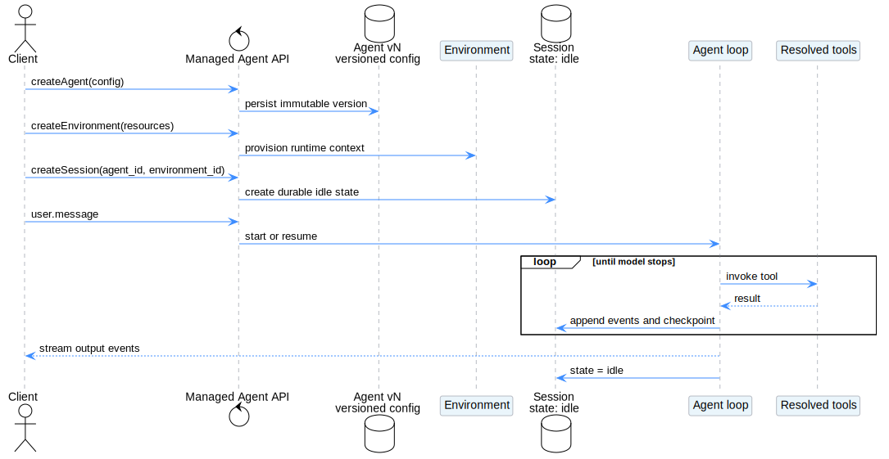
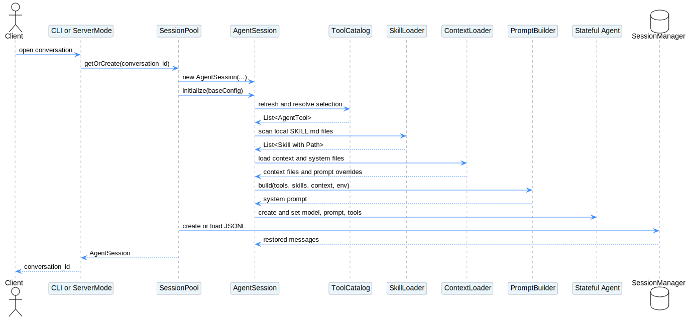
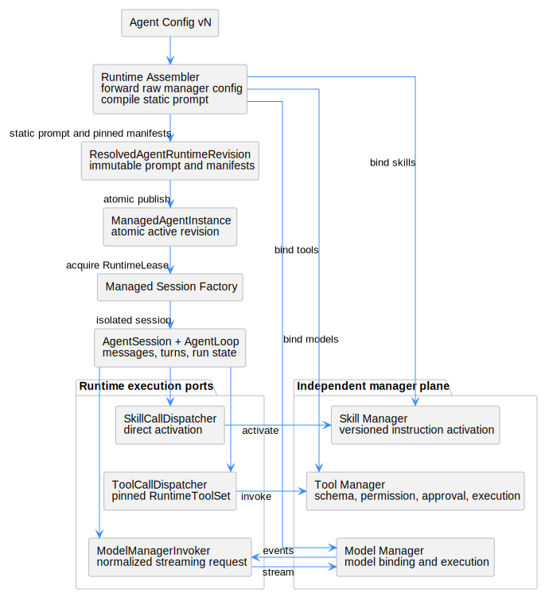
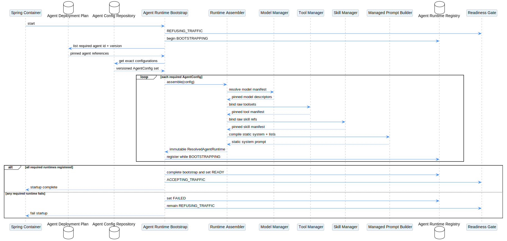
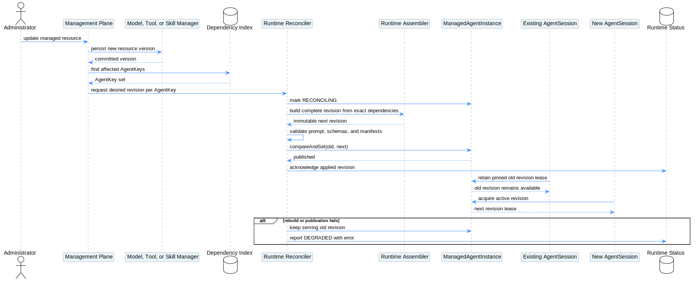
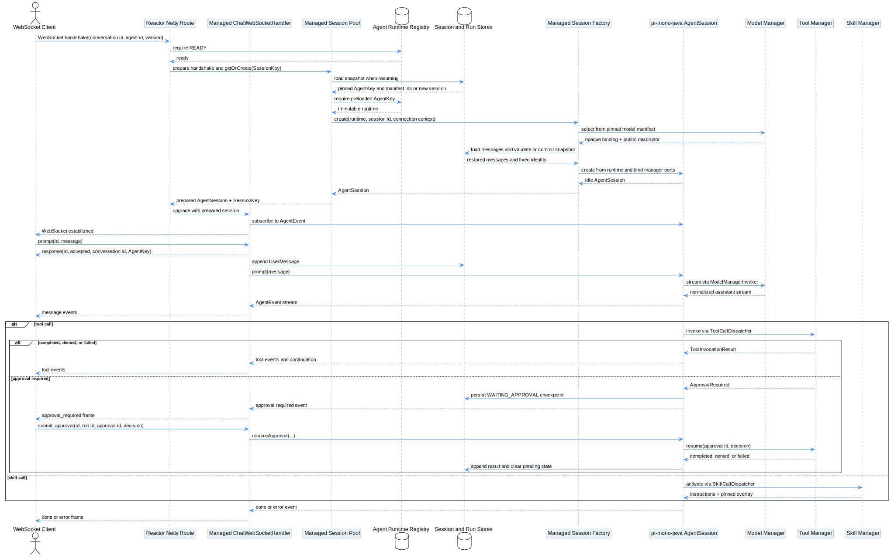
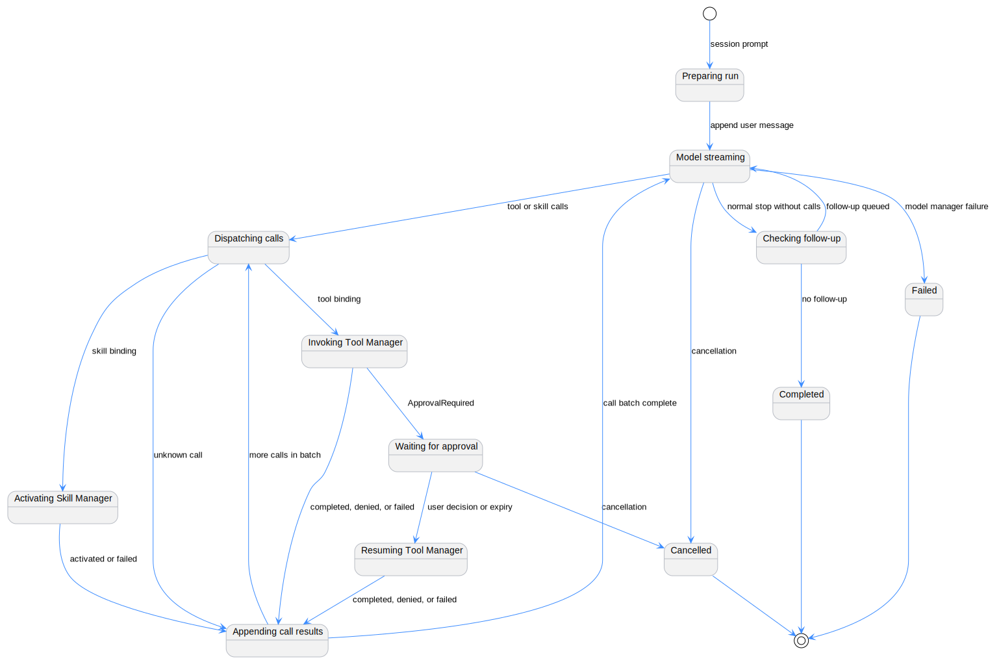
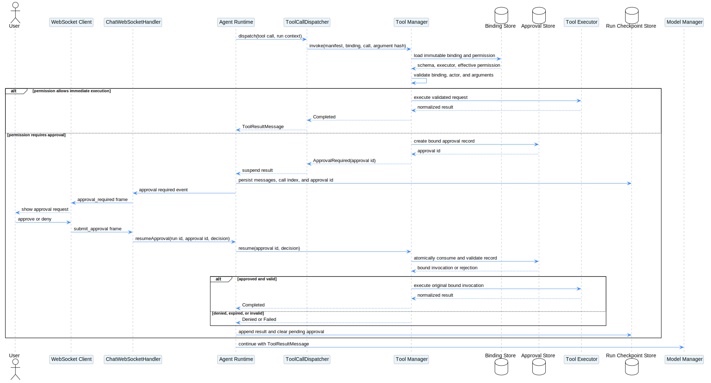

# Managed Agent 配置到 pi-mono-java WebSocket Runtime 与 Session 的构建设计

| 属性 | 值 |
|---|---|
| 文档版本 | 0.8.0 |
| 状态 | Draft，供架构评审 |
| pi-mono 源码基线 | `216e672e7c9fc65682553394b74e483c0c9e47f7` |
| pi-mono-java 源码基线 | `b99871a0321b73606a8f074c42050f28f52fdfca` |
| 基线日期 | 2026-07-22 |
| 设计范围 | Agent 配置编译、Model/Tool/Skill Manager 绑定与执行、容器级 Agent 实例和 Runtime Revision 同步、pi-mono-java Server WebSocket 中的多 Session、Run、审批与恢复 |

## 1. 结论

本设计的首要目标不是直接创建 Session，而是先把一个版本化 Agent 配置装配为不可变的 `ResolvedAgentRuntimeRevision`，再由容器级 `ManagedAgentInstance` 原子发布该运行版本：

```text
AgentConfig
    -> AgentRuntimeAssembler
        -> PromptCompiler
        -> ModelManager
        -> ToolManager
        -> SkillManager
    -> ResolvedAgentRuntimeRevision
    -> ManagedAgentInstance.activeRevision
    -> zero or more AgentSession instances
```

边界如下：

1. Agent 配置保持原结构，不删除 `enabled` 或 `permission`。
2. Agent Runtime 不解析 Tool 的 `enabled`、`permission` 和默认/逐项覆盖规则；完整 `tools` 配置交给 Tool Manager。
3. Agent Runtime 不解析 Skill 版本或加载 Skill 正文；完整 `skills` 引用交给 Skill Manager。
4. Tool Manager 返回模型可见的 `name`、`description`、`input_schema` 和不透明 Manifest/Binding，并负责权限判断与实际执行。
5. Skill Manager 返回模型可见的 `name`、`description`、固定版本和不透明 Manifest/Binding，并负责正文、资源的加载或激活。
6. Model Manager 返回模型公开能力和不透明 Binding，并负责 Provider 选择、认证、协议转换、重试和实际模型执行；Agent Runtime 不再直接调用 Provider Adapter。
7. system prompt 包含结构化 `system`、Tool 清单和 Skill 清单；Tool 清单写入 `name + description`，完整 `name + description + input_schema` 同时通过模型请求的独立 `tools` 字段发送。
8. system prompt 中的 Tool 清单和模型请求的 `tools` 必须由同一个固定 `ModelToolDescriptor` 快照生成，不维护两份可漂移的描述。
9. 容器必须在 readiness 之前为部署范围内的每个 Agent 版本创建 `ManagedAgentInstance`，并发布第一个 `ResolvedAgentRuntimeRevision`；Session 创建路径禁止懒加载 Runtime。
10. 目标执行路径使用 `ModelManagerInvoker`、`ToolCallDispatcher` 和 `SkillCallDispatcher` 分别转发调用；Agent Runtime 只负责消息、Run 状态、调用顺序、暂停和恢复。
11. Tool Manager 根据绑定阶段保存的 effective permission 返回 `Completed`、`ApprovalRequired`、`Denied` 或 `Failed`；Agent Runtime 不读取 permission，只根据结果类型暂停或继续。
12. 管理面更新 Agent、Tool、Skill、Model 或 Settings 时，`AgentRuntimeReconciler` 必须在请求路径外构建完整新 Revision，校验通过后再原子替换 `ManagedAgentInstance.activeRevision`，不就地修改正在使用的对象。
13. 新建 Session 获取当前 active Revision；已存在 Session 默认固定创建时的 Revision，不在 Run 或审批中途热替换。
14. 每个对话仍在打开时创建独立的、有消息状态的 `AgentSession + Agent`；容器启动时不预建空对话。
15. 创建 `ManagedAgentInstance`、`AgentSession` 和 `Agent` 是普通 Java 对象构造；虚拟线程只承载一次 Run 中的模型、Tool 和 Skill 阻塞调用，对象本身不“属于”某个虚拟线程。

## 2. 术语和生命周期

| 对象 | 含义 | 生命周期 | 是否共享 |
|---|---|---|---|
| `AgentConfig` | 版本化控制面配置 | 持久化 | 共享 |
| `AgentKey` | `agent_id + agent_version`，表示 Agent 配置身份 | Agent 配置版本生命周期 | 共享 |
| `ManagedAgentInstance` | 容器级 Agent 句柄，持有 active Revision、desired/applied 状态和保留的历史 Revision | 容器生命周期 | 共享 |
| `ResolvedAgentRuntimeRevision` | AgentConfig、Settings 和三类 Manager Manifest 的不可变装配快照 | 被 active 或 Session 引用期间 | 共享 |
| `RuntimeLease` | Session 对某个 Runtime Revision 的引用与保留凭据 | Session 生命周期 | 不跨 Session 共享 |
| `AgentSession` | 一个具体对话的运行时对象 | 对话生命周期 | 不共享 |
| `Agent` | pi-mono-java 底层有状态模型循环门面 | 与 Session 相同 | 不共享 |
| `Run` | 一条消息触发的一次模型/工具循环 | 单次执行 | 不共享 |

`ManagedAgentInstance` 是“容器启动后已存在的 Agent 实例”的领域表达。它不是当前 `com.campusclaw.agent.Agent`，因为后者持有消息、队列、执行状态和取消状态。容器级实例只发布不可变 Runtime Revision，后者仍与单个 Session 同生命周期。

`agent_version` 只在 Agent 配置被修改时递增；`runtime_revision_id` 在 Agent 依赖的 Settings、Model、Tool 或 Skill 快照变化时也会变化。因此同一 `AgentKey` 可以先后发布多个 Runtime Revision，但任一 Revision 自身不可变。

本文使用“Tool 清单”和“Skill 清单”表示当前 Agent 版本对模型可见的固定能力集合。“目录”仅用于文件系统目录等真实层级结构，不作为 Manager Manifest 的领域术语。

## 3. 设计边界

本文使用以下标签：

- **观察到的行为**：当前 pi-mono 或 pi-mono-java 源码已经实现。
- **目标设计**：需要新增的 Managed Agent 装配能力。
- **产品约束**：为避免歧义而固定的产品语义。
- **安全加固**：用于防止版本漂移、越权调用或审批重放的约束。
- **架构变更**：当前实现需要重构或新增模块才能支持。

Model Manager、Tool Manager 和 Skill Manager 是独立于 Agent Runtime 的模块。本文只定义它们与装配层、Session 执行层之间的契约，不设计 Manager 内部如何连接模型 Provider、MCP Server、builtin tool、Skill Artifact Store 或审批 UI。

入口范围只包含 pi-mono-java Server 的 `GET /api/ws/chat` WebSocket 通道。CLI、`POST /api/chat` SSE 和其他 REST 路由不在本文整理；它们可以复用相同 Runtime 和 AgentLoop，但不影响本文的 WebSocket 协议与会话生命周期。

## 4. 源码证据

### 4.1 Anthropic Managed Agents 基线

参考：

- [Agent setup](https://platform.claude.com/docs/en/managed-agents/agent-setup)
- [Sessions](https://platform.claude.com/docs/en/managed-agents/sessions)
- [Events and streaming](https://platform.claude.com/docs/en/managed-agents/events-and-streaming)
- [Permission policies](https://platform.claude.com/docs/en/managed-agents/permission-policies)
- [Skills](https://platform.claude.com/docs/en/managed-agents/skills)

本文只采用以下抽象语义：

- Agent 是版本化配置。
- Session 固定关联一个 Agent 版本。
- 创建 Session 不等于立即执行模型。
- 用户消息触发或恢复 agent loop。
- 一轮执行完成后，Session 可以继续接收后续消息。



[PlantUML 源码](diagram.puml#L8)

### 4.2 pi-mono-java 当前行为

| 源码 | 关键符号 | 观察到的行为 |
|---|---|---|
| [`AgentSession.java`](../../pi-mono-java/modules/coding-agent-cli/src/main/java/com/campusclaw/codingagent/session/AgentSession.java#L114) | `initialize(SessionConfig)` | 解析模型、刷新 Tool、加载 Skill 和上下文文件、构建 system prompt、创建 `Agent` |
| [`Agent.java`](../../pi-mono-java/modules/agent-core/src/main/java/com/campusclaw/agent/Agent.java#L218) | `startExecution()` | 每次 Run 创建 `AgentLoop`，但固定传入 `CampusClawAiService`、当前 `Model` 和本地 `ToolExecutionPipeline` |
| [`AgentLoopConfig.java`](../../pi-mono-java/modules/agent-core/src/main/java/com/campusclaw/agent/loop/AgentLoopConfig.java#L29) | `streamFunction` / `effectiveStreamFunction()` | 已提供可替换的模型流式调用接缝；未提供 Tool 或 Skill 的等价 Dispatcher |
| [`StreamFunction.java`](../../pi-mono-java/modules/agent-core/src/main/java/com/campusclaw/agent/loop/StreamFunction.java#L22) | `stream(Model, Context, SimpleStreamOptions)` | 可作为 Model Manager 第一阶段适配点，但签名仍暴露当前完整 `Model` 类型 |
| [`CampusClawAiService.java`](../../pi-mono-java/modules/ai/src/main/java/com/campusclaw/ai/CampusClawAiService.java#L45) | `stream()` / `streamSimple()` | 当前根据 `model.api()` 在进程内选择 Provider 并执行请求 |
| [`Model.java`](../../pi-mono-java/modules/ai/src/main/java/com/campusclaw/ai/types/Model.java#L29) | `Model` | 同时包含公开能力以及 provider、baseUrl、headers、apiKey 等 Manager 内部执行信息 |
| [`SystemPromptBuilder.java`](../../pi-mono-java/modules/coding-agent-cli/src/main/java/com/campusclaw/codingagent/prompt/SystemPromptBuilder.java#L50) | `build()` | 拼接基础提示词、Tool 清单摘要、Skill 清单、上下文文件和环境信息 |
| [`DefaultToolCatalog.java`](../../pi-mono-java/modules/coding-agent-cli/src/main/java/com/campusclaw/codingagent/tool/catalog/DefaultToolCatalog.java#L20) | `DefaultToolCatalog` | 合并 Spring、Extension 和声明式 Tool Source，输出 `AgentTool` |
| [`AgentTool.java`](../../pi-mono-java/modules/agent-core/src/main/java/com/campusclaw/agent/tool/AgentTool.java#L15) | `AgentTool` | Tool 同时携带 name、description、parameters schema 和 execute |
| [`Context.java`](../../pi-mono-java/modules/ai/src/main/java/com/campusclaw/ai/types/Context.java#L23) | `Context` | 模型请求上下文已将 system prompt、messages 和 tools 分开 |
| [`SkillLoader.java`](../../pi-mono-java/modules/coding-agent-cli/src/main/java/com/campusclaw/codingagent/skill/SkillLoader.java#L30) | `SkillLoader` | 扫描本地 `SKILL.md` 并读取 name、description 和文件路径 |
| [`SkillPromptFormatter.java`](../../pi-mono-java/modules/coding-agent-cli/src/main/java/com/campusclaw/codingagent/skill/SkillPromptFormatter.java#L24) | `format()` | 把 Skill 的 name、description、location 写入 system prompt |
| [`SkillExpander.java`](../../pi-mono-java/modules/coding-agent-cli/src/main/java/com/campusclaw/codingagent/skill/SkillExpander.java#L76) | `expand()` | 处理 `/skill:name` 并从本地文件读取 Skill 正文 |
| [`AgentLoop.java`](../../pi-mono-java/modules/agent-core/src/main/java/com/campusclaw/agent/loop/AgentLoop.java#L212) | `new Context(...)` | 每轮向模型传递 system prompt、messages 和独立 tools 列表 |
| [`AgentLoop.java`](../../pi-mono-java/modules/agent-core/src/main/java/com/campusclaw/agent/loop/AgentLoop.java#L312) | `toLlmTools()` | 将 `AgentTool` 转为 name、description、parameters |
| [`AnthropicProvider.java`](../../pi-mono-java/modules/ai/src/main/java/com/campusclaw/ai/provider/anthropic/AnthropicProvider.java#L198) | `buildParams()` / `convertTools()` | 将 `Context.tools` 写入 Anthropic `tools`，并将 parameters 转为 `input_schema` |
| [`ToolExecutionPipeline.java`](../../pi-mono-java/modules/agent-core/src/main/java/com/campusclaw/agent/tool/ToolExecutionPipeline.java#L119) | `invokeTool()` | 校验参数后调用 `AgentTool.execute()` |
| [`SessionManager.java`](../../pi-mono-java/modules/coding-agent-cli/src/main/java/com/campusclaw/codingagent/session/SessionManager.java#L160) | `loadSession()` | 从 JSONL 恢复消息 |
| [`SessionPool.java`](../../pi-mono-java/modules/coding-agent-cli/src/main/java/com/campusclaw/codingagent/mode/server/SessionPool.java#L186) | `getOrCreate()` | 按 conversation ID 管理多个 `AgentSession` |
| [`ServerMode.java`](../../pi-mono-java/modules/coding-agent-cli/src/main/java/com/campusclaw/codingagent/mode/server/ServerMode.java#L259) | `run()` / `wireServerRoutes()` | 创建共享 `SessionPool`，将 `GET /api/ws/chat` 升级为 WebSocket，并仅从查询参数读取 `conversation_id` |
| [`ChatWebSocketHandler.java`](../../pi-mono-java/modules/coding-agent-cli/src/main/java/com/campusclaw/codingagent/mode/server/ChatWebSocketHandler.java#L115) | `handle()` / `handleCommand()` | 握手时创建或恢复 Session，订阅 Agent 事件，将入站命令分发给 `AgentSession`，并将事件编码为 JSON 帧 |
| [`chat-ws.yaml`](../../pi-mono-java/docs/asyncapi/chat-ws.yaml#L1) | `channels.chat` / `sendCommand` / `receiveEvent` | 定义当前 WebSocket 命令、事件、相关 ID 和会话恢复协议 |

当前 `com.campusclaw.codingagent.skill.SkillManager` 负责本地 Skill 的安装、链接、更新和删除，不是本文目标中的独立运行时 Skill Manager。Java 实现应使用 `SkillManagerGateway`、`ExternalSkillManagerClient` 等名称避免冲突。

### 4.3 pi-mono 对照基线

| 源码 | 关键符号 | 对照意义 |
|---|---|---|
| [`packages/coding-agent/src/core/sdk.ts`](../../pi-mono/packages/coding-agent/src/core/sdk.ts#L164) | `createAgentSession()` | 每次 Session 创建独立 `Agent` 与 `AgentSession` |
| [`packages/coding-agent/src/core/system-prompt.ts`](../../pi-mono/packages/coding-agent/src/core/system-prompt.ts#L28) | `buildSystemPrompt()` | system prompt 是装配结果，不包含消息状态 |
| [`packages/coding-agent/src/core/skills.ts`](../../pi-mono/packages/coding-agent/src/core/skills.ts#L335) | `formatSkillsForPrompt()` | Skill 清单进入 system prompt，正文按需读取 |
| [`packages/agent/src/agent.ts`](../../pi-mono/packages/agent/src/agent.ts#L171) | `Agent` | Agent 持有 transcript、queue 和 active run，不能跨 Session 共享 |

### 4.4 主流 Agent 系统的 Tool 模型可见方式

| 系统 | 官方机制 | 对本设计的含义 |
|---|---|---|
| [Anthropic Tool use](https://platform.claude.com/docs/en/agents-and-tools/tool-use/define-tools) | 提供 `tools` 时，Anthropic 会用 Tool 定义、Tool 配置和用户 system prompt 组成模型的特殊有效 system prompt | Tool 的 name、description 和 schema 是模型上下文的一部分，但 API 协议仍通过独立 `tools` 字段提交 |
| [OpenAI Agents SDK: Tools](https://openai.github.io/openai-agents-python/tools/) 与 [Agents](https://openai.github.io/openai-agents-python/agents/) | Agent `instructions` 与 Tool 列表分离；Function Tool 包含 name、description 和 JSON Schema | 未必把 Tool 文本手工写进 instructions，但 name 和 description 必须通过 Tool 协议对模型可见 |
| [LangChain Agents](https://docs.langchain.com/oss/python/langchain/agents) 与 [Tools](https://docs.langchain.com/oss/python/langchain/tools) | v1 Agent 分离 `system_prompt` 和 `tools`；[classic ReAct](https://reference.langchain.com/python/langchain-classic/agents/react/agent/create_react_agent) 则显式要求 prompt 包含 `{tools}` 和 `{tool_names}` | Tool 清单可以由 Provider 协议或提示词渲染承载，但都应来自同一 Tool 定义 |
| [AutoGen Tools](https://microsoft.github.io/autogen/stable/user-guide/core-user-guide/components/tools.html) | system message 与模型请求中的 Tool schema 分离 | Tool 协议是模型可用能力的权威调用描述 |

**调研结论**：主流系统都会让 Tool 的 `name + description` 对模型可见，差异在于它们是由 Provider 通过原生 Tool 协议注入有效上下文，还是由 Agent 框架显式渲染到 prompt。因此，不能把“客户端 system 字符串与 `tools` 字段分离”误解为“模型上下文中不包含 Tool 的 name 和 description”。

**目标决策**：Managed Agent 默认采用双通道：system prompt 显式写入 Tool 清单，模型请求 `tools` 字段写入完整 Tool Schema。这是产品约束，不是对上述框架的现有行为声称。两个通道必须从同一个不可变 Manifest 快照渲染。

## 5. pi-mono-java 当前 WebSocket Session 流程



[PlantUML 源码](diagram.puml#L55)

### 5.1 WebSocket 握手与 Session 建立

**观察到的行为**：`ServerMode.wireServerRoutes()` 将 `GET /api/ws/chat` 升级为 WebSocket。当前握手只支持可选的 `conversation_id` 查询参数，还没有 `agent_id` 或 `agent_version`。

```text
GET /api/ws/chat?conversation_id=optional-id
    -> ServerMode.wireServerRoutes()
    -> ChatWebSocketHandler.handle()
    -> SessionPool.getOrCreate(conversation_id)
        -> reuse active AgentSession
        or
        -> create AgentSession and restore JSONL history
    -> subscribe to AgentSession events
    -> start inbound command, outbound event and heartbeat streams
```

省略 `conversation_id` 时，`SessionPool` 生成 12 位 ID。指定 ID 且内存中没有 Session 时，它会查找同名 JSONL，恢复消息后再返回 Session。因此，当前 WebSocket 握手本身就会创建或恢复 Session，无需等待第一个 `prompt` 帧。

当前 `SessionPool` 所有 Session 共用一个 `baseConfig` 和 Tool 选择，键仅为 `conversation_id`。它尚不能在同一 Server 实例中根据 WebSocket 握手选择不同 Agent 版本。

### 5.2 当前 initialize 顺序

```text
function AgentSession.initialize(config):
    model = resolveModel(config.model)
    cwd = config.cwd

    refreshTools(cwd)
    loadSkills(cwd)

    contextFiles = load AGENTS.md / CLAUDE.md
    systemOverride = load SYSTEM.md
    appendSystem = load APPEND_SYSTEM.md
    promptTemplates = load prompt templates

    visibleSkills = SkillRegistry.getVisibleSkills()

    systemPrompt = SystemPromptBuilder.build({
        tools,
        visibleSkills,
        cwd,
        config.customPrompt,
        environment,
        contextFiles,
        systemOverride,
        appendSystem
    })

    agent = new Agent(aiService)
    agent.setModel(model)
    agent.setSystemPrompt(systemPrompt)
    agent.setTools(tools)
```

### 5.3 当前 system prompt 顺序

`SystemPromptBuilder.build()` 当前按以下顺序拼接：

1. 项目或全局 `SYSTEM.md`；不存在时使用硬编码 `BASE_PROMPT`。
2. 基于 Tool 名称生成的条件规则。
3. Tool 的 name 和 description 清单；目标架构保留这一可见性，但改为从固定 `ModelToolDescriptor` 快照统一渲染。
4. Skill 的 name、description、location。
5. 全局和目录层级中的 `AGENTS.md` 或 `CLAUDE.md`。
6. 硬编码园区知识库指引。
7. 日期、cwd、操作系统、Java、Shell 等环境信息。
8. `APPEND_SYSTEM.md`。
9. Server `baseConfig.customPrompt`。

Tool 的 `input_schema` 不写入 system prompt。它保留在 `AgentTool.parameters()` 中，并由 `AgentLoop.toLlmTools()` 放入模型请求的独立 tools 字段。Java 中间类型使用 `parameters` 这个名称；Anthropic Provider 才在协议边界将它序列化为 `input_schema`。

### 5.4 当前 Skill 激活方式

当前 Skill 是文件系统对象：

```text
Skill:
    name
    description
    filePath
    baseDir
    source
    disableModelInvocation
```

system prompt 只列出 Skill 清单。完整正文通过两条路径进入消息上下文：

- 模型调用 `read` 读取 system prompt 中的 `location`。
- 用户输入 `/skill:name` 后，`SkillExpander` 读取 `SKILL.md` 正文并扩展用户消息。

### 5.5 WebSocket `prompt` 命令与每轮执行

```text
Client sends {type: "prompt", id, message}
    -> ChatWebSocketHandler.handlePrompt()
    -> reject if message empty or Session already streaming
    -> emit response(success=true, conversation_id)
    -> append UserMessage to SessionManager JSONL
    -> AgentSession.prompt(userInput)
    -> expand prompt template
    -> expand /skill:name
    -> Agent.prompt()
    -> AgentLoop
    -> Context(systemPrompt, messages, modelTools)
    -> Provider
    -> optional tool calls
    -> ToolExecutionPipeline
    -> AgentTool.execute()
    -> ToolResultMessage
    -> next model turn
    -> AgentSession emits AgentEvent
    -> ChatWebSocketHandler.forwardSessionEvent()
    -> WebSocket JSON event frames
```

成功接受 `prompt` 后，同步 `response` 帧只表示命令已接受；模型输出通过后续 `agent_start`、`message_start/update/end`、`tool_start/update/end`、`done` 或 `error` 帧异步返回。服务端每 20 秒发送 `pong` 心跳。

### 5.6 当前 WebSocket 会话控制

| 命令 | 当前行为 | 与 Managed Agent 的关系 |
|---|---|---|
| `prompt` | 空闲时启动一次 Agent Run | 目标仍作为 Run 启动命令 |
| `steer` | 向运行中 Agent 注入用户消息 | 保留，不改变 Agent 版本和 Manifest |
| `abort` | 取消当前生成 | 保留，并传播到 Model/Tool/Skill Manager |
| `new_session` | 清空消息；持久化开启时轮换 conversation ID | 目标必须保留原 AgentKey 和 Manager Manifest |
| `set_model` | 可从全局 ModelRegistry 切换 | 目标只允许选择固定 Model Manifest 中的 Binding |
| `list_models` | 返回全局或可用 Model Catalog | 目标默认只返回当前 Runtime 的候选模型 |
| `set_thinking_level` | 更新 Session 的思考级别 | 保留为 Session 级模型选项 |
| `get_state` / `get_history` | 返回会话状态或消息 | 目标状态增加 AgentKey、Run 状态和待审批 ID |
| `get_prompt_templates` | 返回 Session 本地模板 | 非 Managed Agent 核心，仅在产品保留该能力时开放 |
| `list_skills` | 返回本地 SkillRegistry | 目标只返回 Runtime 固定 Skill Manifest 中的 Skill |
| `ping` | 返回 `pong` | 保留 |

**观察到的缺口**：当前 WebSocket 协议没有 Tool 审批提交命令和 `approval_required` 事件；本文目标设计需要新增该协议。

## 6. 当前实现与目标配置的差距

| 维度 | 当前 pi-mono-java | 目标设计 |
|---|---|---|
| Agent 配置 | `SessionConfig(model,cwd,prompt,mode)` | 版本化完整 AgentConfig |
| system | 硬编码 Base 或本地 SYSTEM.md | 结构化 system 字段编译 |
| 模型解析 | Session 内通过 `ModelRegistry` 模糊匹配 | Model Manager 在启动阶段生成固定 Manifest，Session 只选择其中的 Binding |
| 模型执行 | `CampusClawAiService` 在进程内路由 Provider | `ModelManagerInvoker` 通过不透明 Binding 转发 Model Manager |
| Tool 来源 | 进程内 ToolCatalog | 独立 Tool Manager |
| Tool 模型描述 | `AgentTool` 上的 name/description/parameters | Tool Manager 固定的 ModelToolDescriptor |
| Tool 清单与 Tool Schema | system prompt 摘要和 `Context.tools` 分别装配 | 由同一 Descriptor 快照生成两个通道 |
| Tool 执行入口 | `AgentTool.execute()` | `ToolCallDispatcher` 直接转发 `ToolManager.invoke()` |
| Tool 权限 | Runtime hook 或 Tool 自己处理 | Tool Manager 解析配置并权威执行 |
| Tool 审批 | 无持久化暂停/恢复协议 | Tool Manager 返回 `ApprovalRequired`，Runtime 保存 Checkpoint 并暂停 Run |
| Skill 来源 | 本地目录扫描 | 独立 Skill Manager |
| Skill 身份 | name + Path | skill_id + fixed version + binding |
| Agent Runtime | 每个 Session 临时解析 | 容器 readiness 前创建 ManagedAgentInstance 并发布不可变 Revision，后续由 Reconciler 原子更新 |
| Session 创建 | 进入 `initialize()` 后加载 Tool、Skill 和 prompt | 只读取已预加载 Runtime，禁止触发 Runtime 装配 |
| 恢复元数据 | 主要恢复消息 | 固定 Agent、Tool、Skill、Model Manifest |

因此，不能直接把 Agent 配置塞入现有 `SessionConfig.customPrompt`，不能把 Manager Tool 映射成永久的本地实现，也不能直接把 Manager Skill 映射为当前依赖本地 Path 的 `Skill`。

## 7. 输入 Agent 配置及字段归属

本设计以以下三个元数据文件为输入边界：

- [`AGENT元数据设计.json`](../AGENT元数据设计.json)：Agent 身份、结构化 system、模型引用、Tool 选择与权限覆盖、Skill 引用。
- [`TOOL元数据设计.json`](../TOOL元数据设计.json)：Tool 身份、来源、描述、输入输出 Schema 和默认配置。
- [`SKILL元数据设计.json`](../SKILL元数据设计.json)：Skill 身份、结构化正文、递归 Skill 引用以及 Skill 自身的 Tool 配置。

这些文件当前是字段说明模板，其中 `version`、`enabled`、`permission` 等位置保存的是说明字符串。Java 接入前应另行提供正式 JSON Schema 和真实配置样例；运行载荷中的 `version` 必须是整数、`enabled` 必须是布尔值、时间必须使用统一格式。

```json
{
  "id": "agent-id",
  "type": "agent",
  "version": 1,
  "created_at": "timestamp",
  "updated_at": "timestamp",
  "name": "agent-name",
  "display_name": "Agent Display Name",
  "description": "Agent description",
  "model": ["provider/model-id"],
  "system": {
    "role": "...",
    "objective": "...",
    "instructions": "...",
    "tool_policy": "...",
    "safety": "...",
    "completion": "...",
    "response_style": "...",
    "example": "..."
  },
  "use_cases": ["intent-routing-example"],
  "tools": [
    {
      "type": "builtin-toolset",
      "default_config": {
        "enabled": true,
        "permission": "always_ask"
      },
      "configs": [
        {
          "name": "tool-name",
          "enabled": true,
          "permission": "always_allow"
        }
      ]
    }
  ],
  "skills": [
    {
      "skill_id": "skill-id",
      "version": "fixed-version-or-omitted"
    }
  ],
  "metadata": {
    "environment": "prod",
    "owner_id": "admin"
  }
}
```

字段归属：

| 配置字段 | 解析组件 | Agent Runtime 是否解析 |
|---|---|---|
| `id/version` | Agent Control Plane / Runtime Assembler | 只持有固定值 |
| `system.*` | Prompt Compiler | 不在 Session 内重复解释 |
| `model[]` | Model Manager | 只持有 Manifest |
| `tools[]` 全部字段 | Tool Manager | 否 |
| `skills[]` 全部字段 | Skill Manager | 否 |
| `use_cases` | Agent Router | 否 |
| `metadata` | Control Plane / Session Context Factory | 只持有所需快照 |

`permission` 保留在 Agent 配置中，但属于 Tool Manager 的配置命名空间。Agent Runtime 不计算 effective permission。

### 7.1 Tool 查找、权限继承与版本固定

Agent 配置当前通过 Toolset `type + configs[].name` 选择 Tool。Tool Manager 按以下顺序处理：

```text
tool source = agent toolset.type
tool metadata = ToolRegistry.requireUnique(source, tool name)

effective enabled =
    per-tool enabled
    ?? agent toolset default_config.enabled
    ?? tool metadata default_config.enabled

effective permission =
    per-tool permission
    ?? agent toolset default_config.permission
    ?? tool metadata default_config.permission
    ?? fail binding
```

`??` 表示前一项不存在时才使用后一项。Tool Manager 过滤 disabled Tool，并把最终 `tool_id + tool_version + effective_permission + schema_hash + executor_ref` 保存到不可变 Binding。

Agent Runtime 只接收 `binding_id` 和模型可见 Descriptor。`effective_permission` 不进入 Runtime、system prompt 或模型请求的 `tools` 字段。

当前 Agent Tool 引用没有显式 `tool_id/version`。为了避免相同 Agent 版本在容器重启后绑定到新的 Tool 版本，必须满足以下任一条件：

1. Agent 配置增加固定 `tool_id/version`；或
2. Agent 版本首次发布时持久化 Tool Manager 生成的不可变 Manifest，后续启动按 Manifest 恢复，不重新按 name 选择 latest。

Skill 省略 version 和 Model 使用可变别名时也应用同样的发布时固定规则。

### 7.2 Skill 中嵌套 Tool 与 Skill 的处理

Skill Manager 负责递归解析 `SKILL元数据设计.json` 中的 `tools` 和 `skills`，包括版本固定、循环依赖检测、最大深度和内容 hash。Skill 自己声明的 Tool 仍由 Tool Manager 解析权限并执行，Skill Manager 不复制 Tool Manager 的权限算法。

推荐由 Skill Manager 在发布或绑定阶段通过 Tool Manager 为每个固定 Skill 版本申请 `tool_overlay_manifest_id`，再把该引用写入 Skill Binding。Skill 激活后，Agent Runtime 只合并已经固定的模型 Tool Descriptor overlay；后续调用仍发送到 Tool Manager。

### 7.3 Tool 与 Skill 元数据字段映射

| 元数据字段 | 目标归属与用途 |
|---|---|
| Tool `id/version/source/name` | Tool Manager 查找、固定版本、生成 Binding；模型只看到最终 model name |
| Tool `display_name` | UI 和审批摘要；不作为模型调用主键 |
| Tool `description` | 同时生成 system prompt Tool 清单和模型请求 Tool Schema |
| Tool `input_schema` | 进入模型请求 `tools` 字段，并由 Tool Manager 在执行前权威校验 |
| Tool `output_schema` | 不进入模型请求；由 Tool Manager 校验和归一化实际结果 |
| Tool `performance_hints` | Tool Manager 的调度、缓存、超时或批处理提示；Agent Runtime 不解析 |
| Tool `default_config` | Tool Manager 计算 effective enabled/permission 的最低优先级默认值 |
| Skill `id/version/name/description` | Skill Manager 生成固定 Descriptor 和 Binding；name/description 进入 Skill 清单 |
| Skill `content.*` | Skill 激活时由 Skill Manager 编译或加载；默认不全部进入静态 system prompt |
| Skill `use_cases` | Skill Manager 的激活匹配提示或 Router 元数据；不替代模型可见 description |
| Skill `tools` | Skill Manager 申请 Tool Manager overlay；权限和执行仍由 Tool Manager 负责 |
| Skill `skills` | Skill Manager 递归固定依赖、检查循环并生成子 Skill Binding |

## 8. 目标架构



[PlantUML 源码](diagram.puml#L119)

### 8.1 容器级 Agent 实例与 Runtime Revision

```text
class ManagedAgentInstance:
    agent_key: AgentKey
    active_revision:
        AtomicReference<ResolvedAgentRuntimeRevision>
    retained_revisions:
        map<RuntimeRevisionId, ResolvedAgentRuntimeRevision>
    desired_revision_id: RuntimeRevisionId
    applied_revision_id: RuntimeRevisionId
    applied_content_hash: string
    status:
        BOOTSTRAPPING | READY | RECONCILING
        | DEGRADED | FAILED
    last_error: optional RuntimeBuildError

record ResolvedAgentRuntimeRevision:
    agent_id: string
    agent_version: integer
    runtime_revision_id: string
    runtime_content_hash: string
    config_hash: string
    dependency_vector:
        RuntimeDependencyVector

    compiled_system: string
    static_system_prompt: string

    model_manifest_id: string
    model_candidates: list<ModelDescriptor>

    tool_manifest_id: string
    model_tools: list<ModelToolDescriptor>
    runtime_tool_set: RuntimeToolSet

    skill_manifest_id: string
    model_skills: list<ModelSkillDescriptor>
    skill_tool_overlays: map<string, RuntimeToolSet>

    use_cases: list<string>
    metadata_snapshot: map
    created_at: timestamp
```

```text
record RuntimeDependencyVector:
    settings_revision: string
    model_manifest_id: string
    tool_manifest_id: string
    skill_manifest_id: string
    compiled_prompt_hash: string

record RuntimeResolutionTarget:
    desired_revision_id: string
    agent_config_hash: string
    settings_revision: string
    model_resource_versions: map<string, string>
    tool_resource_versions: map<string, string>
    skill_resource_versions: map<string, string>
```

`ResolvedAgentRuntimeRevision` 在容器 readiness 之前完成首次创建，之后也可由管理面触发的 Reconciler 重新创建。`static_system_prompt` 已包含结构化 system、Tool 清单和 Skill 清单；`runtime_tool_set` 已建立按模型 Tool 名称查找的不可变索引。Revision 不保存模型 Provider、Tool 或 Skill 的业务实现，也不保存 Manager 内部 permission 结构。

`ManagedAgentInstance` 只是稳定句柄和原子发布点。更新时不允许修改 `active_revision` 内的 List、Map、Descriptor 或提示词；必须先构建新 Revision，再通过 `compareAndSet(old, next)` 一次替换。

`RuntimeResolutionTarget` 是 Control Plane 为一次启动或 Reconcile 固定的精确资源版本向量。各容器副本不得独立按 `latest` 解析 Manager 资源；否则同一 desired Revision 可能装配出不同 Tool Schema 或 Skill 正文。

### 8.2 Model Manager 契约

```text
record ModelManifest:
    manifest_id: string
    agent_key: AgentKey
    models: list<ModelDescriptor>

record ModelDescriptor:
    binding_id: string
    model_id: string
    display_name: string
    input_modalities: list<string>
    reasoning_supported: boolean
    context_window: integer
    max_output_tokens: integer
    descriptor_version: string

record ModelInvocationRequest:
    manifest_id: string
    binding_id: string
    agent_id: string
    agent_version: integer
    session_id: string
    run_id: string
    turn_id: string
    system_prompt: string
    messages: list<Message>
    tools: list<ModelTool>
    options: ModelOptions

interface ModelManager:
    bindAgentModels(agent_key, raw_model_refs,
                    resolution_target)
        -> ModelManifest

    selectForSession(manifest_id, session_context)
        -> ModelSelection

    stream(invocation_request)
        -> AssistantMessageEventStream

    requireBinding(manifest_id, binding_id)
        -> ModelDescriptor
```

Model Manager 负责 Provider 选择、API Key、base URL、headers、协议字段映射、限流、重试和实际模型请求。Agent Runtime 只持有公开 Descriptor 与不透明 `binding_id`。

当前 `modules/ai` 可以成为 Model Manager 的本地实现或服务端实现；Agent Runtime 侧使用 `ModelManagerGateway`。当前 `StreamFunction` 是第一阶段可复用的适配点，但最终接口不应继续要求 Runtime 传入包含 provider、baseUrl、headers、apiKey 的完整 `Model`。

每轮调用时，Agent Runtime 把当前固定 system prompt、Session messages 和有效 Tool Schema 一起发送给 Model Manager。Model Manager 不自行查询 Tool Manager，也不自行改变当前 Agent 可见的 Tool 集合。

### 8.3 Tool Manager 契约

```text
record AgentKey:
    agent_id: string
    agent_version: integer

record ToolManifest:
    manifest_id: string
    agent_key: AgentKey
    tools: list<ModelToolDescriptor>

record ModelToolDescriptor:
    binding_id: string
    model_name: string
    label: string
    description: string
    input_schema: JsonSchema
    descriptor_version: string
    schema_hash: string

interface ToolManager:
    bindAgentTools(agent_key, raw_toolsets,
                   resolution_target) -> ToolManifest
    invoke(invocation_request) -> ToolInvocationResult
    resume(approval_decision) -> ToolInvocationResult
```

`bindAgentTools()` 内部负责：

1. 根据 `type` 路由 builtin 或 MCP Tool。
2. 合并 `default_config` 与逐 Tool 配置。
3. 不存在 Agent 覆盖时继续使用 Tool 元数据的 `default_config`。
4. 过滤 disabled Tool。
5. 解析并固定 Tool id、version、descriptor、schema 和 binding。
6. 保存 `always_ask`、`always_allow` 等 effective permission。
7. 检查模型可见名称冲突。
8. 返回不包含 Manager 内部权限结构的 Manifest。

`invoke()` 内部负责：

- 校验 Manifest 和 Binding。
- 根据固定 `input_schema` 校验参数。
- 根据 Agent、用户、租户、参数和环境评估权限。
- 在需要时创建审批记录并返回 `ApprovalRequired`；不得让模型执行线程长期等待用户。
- 执行实际 builtin 或 MCP Tool。
- 根据 `output_schema` 校验并归一化执行结果。
- 返回 Completed、ApprovalRequired、Denied 或 Failed。

```text
sealed ToolInvocationResult:
    Completed(tool_result)
    ApprovalRequired(approval_id, summary, expires_at)
    Denied(tool_result)
    Failed(tool_result)
```

审批记录至少绑定 `manifest_id + binding_id + agent_id/version + session_id + run_id + tool_call_id + arguments_hash + tenant_id + user_id + expires_at`。`resume()` 必须原子消费审批记录，禁止 Runtime 通过重新调用 `invoke()` 伪造“已经批准”。

### 8.4 Skill Manager 契约

```text
record SkillManifest:
    manifest_id: string
    agent_key: AgentKey
    skills: list<ModelSkillDescriptor>

record ModelSkillDescriptor:
    binding_id: string
    skill_id: string
    version: string
    name: string
    description: string
    descriptor_version: string
    content_hash: string
    tool_overlay_manifest_id: optional string

interface SkillManager:
    bindAgentSkills(agent_key, raw_skill_refs,
                    resolution_target) -> SkillManifest
    activate(activation_request) -> ActivatedSkill
```

Skill 引用省略版本时，只能在 Control Plane 产生 `RuntimeResolutionTarget` 时把 latest 解析一次并固定为具体版本；各容器的 `bindAgentSkills()` 只能按该目标绑定。`activate()` 返回 Skill instructions、resources、内容 hash 和已固定的 Tool overlay 引用。Agent Runtime 不直接读取 Skill Manager 的存储。

如果某种“Skill”本身执行有副作用的业务动作，应把该动作暴露成 Tool；Skill 仍表示指令和资源，避免一个概念同时承担提示词和远程动作两种语义。

## 9. 容器启动时 eager 装配 Agent Runtime

### 9.1 启动生命周期



[PlantUML 源码](diagram.puml#L176)

**目标设计**：容器级 Agent 实例不在第一个 Session 到来时创建。容器启动阶段必须先为所有必需 AgentKey 创建 `ManagedAgentInstance`，完成首个 Runtime Revision 的装配和发布，然后才进入 `ACCEPTING_TRAFFIC`。

Agent 启动范围来自部署配置或 Control Plane 的 `AgentDeploymentPlan`，不在 AgentConfig 中新增一个 Runtime 自行解析的 `enabled` 字段。Deployment Plan 必须给出需要预装配的固定 `agent_id + version`。

```text
function bootstrapAgentRuntimes():
    ReadinessGate.refuseTraffic()
    AgentRuntimeRegistry.beginBootstrap()

    requiredRefs = AgentDeploymentPlan
        .listRequiredAgentVersions()

    configs = AgentConfigRepository.getExactAll(
        requiredRefs
    )

    require configs cover every requiredRef

    for config in configs:
        resolutionTarget = AgentDeploymentPlan
            .requireResolutionTarget(
                AgentKey(config.id, config.version)
            )

        settingsSnapshot = SettingsManager
            .requireSnapshot(
                resolutionTarget.settings_revision
            )

        revision = assembleAgentRuntimeRevision(
            config,
            settingsSnapshot,
            resolutionTarget
        )

        instance = ManagedAgentInstance.bootstrap(
            AgentKey(config.id, config.version),
            revision
        )

        AgentRuntimeRegistry.registerDuringBootstrap(
            instance
        )

    AgentRuntimeRegistry.completeBootstrap(
        requiredRefs
    )
    ReadinessGate.acceptTraffic()
```

任一必需 Agent 的配置、Model Manifest、Tool Manifest、Skill Manifest、Schema 或提示词编译失败时：

- `AgentRuntimeRegistry` 不进入 `READY`。
- readiness 保持 `REFUSING_TRAFFIC`。
- 容器启动失败，不提供只包含部分 Agent 的服务。

### 9.2 单个 Runtime Revision 装配

```text
function assembleAgentRuntimeRevision(
    agentConfig,
    settingsSnapshot,
    resolutionTarget
):
    validateAgentEnvelope(agentConfig)
    require canonicalHash(agentConfig)
        == resolutionTarget.agent_config_hash
    require settingsSnapshot.revision
        == resolutionTarget.settings_revision

    agentKey = AgentKey(
        agentConfig.id,
        agentConfig.version
    )

    modelManifest = ModelManager.bindAgentModels(
        agentKey,
        agentConfig.model,
        resolutionTarget
    )

    // Runtime Assembler does not parse enabled or permission.
    toolManifest = ToolManager.bindAgentTools(
        agentKey,
        agentConfig.tools,
        resolutionTarget
    )

    // Runtime Assembler does not resolve versions or load content.
    skillManifest = SkillManager.bindAgentSkills(
        agentKey,
        agentConfig.skills,
        resolutionTarget
    )

    compiledSystem = compileStructuredSystem(
        agentConfig.system
    )

    validateModelToolDescriptors(
        toolManifest.tools
    )
    validateSkillPromptDescriptors(
        skillManifest.skills
    )

    runtimeToolSet = RuntimeToolSet.create({
        manifest_id: toolManifest.manifest_id,
        descriptors: toolManifest.tools
    })

    staticSystemPrompt =
        SystemPromptBuilder.buildManagedStatic({
            base_prompt: compiledSystem,
            tools: toolManifest.tools,
            skills: skillManifest.skills
        })

    dependencyVector = RuntimeDependencyVector({
        settings_revision:
            settingsSnapshot.revision,
        model_manifest_id:
            modelManifest.manifest_id,
        tool_manifest_id:
            toolManifest.manifest_id,
        skill_manifest_id:
            skillManifest.manifest_id,
        compiled_prompt_hash:
            hash(staticSystemPrompt)
    })

    runtimeContentHash = canonicalHash({
        agent_config: agentConfig,
        dependency_vector: dependencyVector,
        model_descriptors: modelManifest.models,
        tool_descriptors: toolManifest.tools,
        skill_descriptors: skillManifest.skills
    })

    return ResolvedAgentRuntimeRevision({
        agent_id: agentConfig.id,
        agent_version: agentConfig.version,
        runtime_revision_id:
            resolutionTarget.desired_revision_id,
        runtime_content_hash: runtimeContentHash,
        config_hash: canonicalHash(agentConfig),
        dependency_vector: dependencyVector,

        compiled_system: compiledSystem,
        static_system_prompt: staticSystemPrompt,

        model_manifest_id: modelManifest.manifest_id,
        model_candidates: modelManifest.models,

        tool_manifest_id: toolManifest.manifest_id,
        model_tools: toolManifest.tools,
        runtime_tool_set: runtimeToolSet,

        skill_manifest_id: skillManifest.manifest_id,
        model_skills: skillManifest.skills,
        skill_tool_overlays:
            loadPinnedSkillToolOverlays(skillManifest),

        use_cases: immutable(agentConfig.use_cases),
        metadata_snapshot: immutable(agentConfig.metadata),
        created_at: now()
    })
```

装配完成后必须校验实际 Manager Descriptor 与 `resolutionTarget` 中的精确资源版本一致。`desired_revision_id` 是 Control Plane 对 AgentConfig hash、Settings revision 和精确资源版本向量生成的稳定目标 ID；`runtime_content_hash` 是容器对最终 Manifest、Descriptor 和提示词生成的内容 hash。任一 Manager 返回非目标版本时装配失败，不允许发布近似结果。

装配成功后，首个 Revision 作为 `ManagedAgentInstance.activeRevision` 注册。Registry 中 AgentKey 到 `ManagedAgentInstance` 的引用稳定；可变的只是每个 Instance 中指向不可变 Revision 的原子引用。

### 9.3 管理面更新与 Runtime Reconcile



[PlantUML 源码](diagram.puml#L238)

Tool、Skill、Model 和 Settings 是 AgentConfig 的外部依赖。当管理面更新这些资源时，AgentConfig.version 可能不变，所以必须通过 `runtime_revision_id` 表达新的实际装配结果。

Manager 不直接持有或修改 `ManagedAgentInstance`。管理面或 Control Plane 先保存新资源版本，再通过依赖索引找到受影响的 AgentKey，为每个 AgentKey 发布 reconcile 指令。

```text
function onManagedResourceChanged(change):
    persistedVersion = ControlPlane.persist(change)

    affectedAgentKeys = DependencyIndex
        .findAgents(change.resource_type,
                    change.resource_id)

    for agentKey in affectedAgentKeys:
        resolutionTarget = AgentDependencyResolver
            .resolveExactTarget(
                agentKey,
                persistedVersion
            )

        ReconcileBus.publish(
            AgentRuntimeReconcileRequested(
                agent_key: agentKey,
                resolution_target:
                    resolutionTarget,
                requested_at: now()
            )
        )
```

每个运行 Agent Runtime 的容器副本独立执行完整重建：

```text
function reconcileAgentRuntime(request):
    instance = AgentRuntimeRegistry.requireInstance(
        request.agent_key
    )

    instance.markReconciling(
        request.resolution_target
            .desired_revision_id
    )

    oldRevision = instance.activeRevision.get()

    try:
        agentConfig = AgentConfigRepository.getExact(
            request.agent_key
        )
        settingsSnapshot = SettingsManager.requireSnapshot(
            request.resolution_target
                .settings_revision
        )

        nextRevision = assembleAgentRuntimeRevision(
            agentConfig,
            settingsSnapshot,
            request.resolution_target
        )

        validateRevisionCompatibility(
            oldRevision,
            nextRevision
        )
        require nextRevision.runtime_revision_id
            == request.resolution_target
                .desired_revision_id

        instance.retain(nextRevision)
        swapped = instance.activeRevision.compareAndSet(
            oldRevision,
            nextRevision
        )

        if not swapped:
            retry from latest active revision

        instance.markApplied(
            nextRevision.runtime_revision_id,
            nextRevision.runtime_content_hash
        )
        RuntimeStatusReporter.acknowledgeApplied(
            request,
            nextRevision.runtime_revision_id,
            nextRevision.runtime_content_hash
        )

    catch error:
        instance.keepServing(oldRevision)
        instance.markDegraded(error)
        RuntimeStatusReporter.reportFailed(
            request,
            error
        )
```

管理面的“同步完成”不应等价于“元数据已写入”，而应根据部署策略等待要求的容器副本上报 `applied_revision_id == desired_revision_id`，并确认同一 desired Revision 的 `runtime_content_hash` 一致。管理 API 返回状态建议为：

```text
PENDING     metadata persisted, waiting for replicas
APPLIED     required replicas acknowledged
DEGRADED    old revision is still serving
FAILED      no usable revision or policy requires rollback
```

### 9.4 更新范围与紧急撤销

| 变化 | 是否需要重建 Runtime Revision |
|---|---|
| Tool name、description、input schema、enabled 或 Agent 级绑定 | 需要 |
| Skill name、description、content、依赖或 Tool overlay | 需要 |
| Model 公开能力、可选 Binding 或 Tool Schema 兼容性 | 需要 |
| Settings 中会改变提示词、资源或执行策略的字段 | 需要 |
| Manager 内部密钥轮换、连接池或不改变 Binding 语义的重试参数 | 不需要，由 Manager 内部热更新 |

Tool 的紧急禁用或用户权限撤销不能只依赖 Runtime Reconcile。Tool Manager 必须在每次 `invoke()` 和 `resume()` 时检查实时 deny/revocation overlay，使固定旧 Revision 的 Session 也能立即被拒绝。这是安全加固，不是就地修改 Runtime 的例外。

### 9.5 禁止 Session 路径懒加载

`AgentRuntimeRegistry` 是已预创建 `ManagedAgentInstance` 的查询容器，不是 Runtime Factory。它不得在 Session 请求线程中调用 `AgentConfigRepository`、`AgentRuntimeAssembler` 或 Manager 的 bind 接口，也不得使用 `computeIfAbsent()` 装配 Runtime。

```text
interface AgentRuntimeRegistry:
    state() -> BOOTSTRAPPING | READY | FAILED

    requireInstance(agent_id, requested_version)
        -> ManagedAgentInstance

    acquireActive(agent_id, requested_version)
        -> RuntimeLease

    acquireRevision(agent_id, requested_version,
                    runtime_revision_id)
        -> RuntimeLease
```

`requested_version` 存在时只允许精确查找。省略版本时，Registry 使用 Deployment Plan 中已固定的 active Agent version，不临时访问 AgentConfigRepository 查询 latest。Agent 实例或指定 Revision 不存在时直接返回 `AGENT_RUNTIME_NOT_PRELOADED` 或 `AGENT_RUNTIME_REVISION_NOT_RETAINED`。

## 10. system prompt 编译

### 10.1 结构化 system

```text
function compileStructuredSystem(system):
    sections = [
        ("Role", system.role),
        ("Objective", system.objective),
        ("Instructions", system.instructions),
        ("Tool Policy", system.tool_policy),
        ("Safety", system.safety),
        ("Completion", system.completion),
        ("Response Style", system.response_style),
        ("Examples", system.example)
    ]

    return joinWithStableHeadings(
        removeEmpty(sections)
    )
```

这是语言无关伪代码，不是 TypeScript 或 Java 的精确语法。

### 10.2 Tool 在模型上下文中的位置

目标设计默认采用双通道：

1. system prompt 中的 Tool 清单写入 `name + description`，用于能力导航、Tool 选择和与 `tool_policy` 的语义配合。
2. 模型请求的 `tools` 字段写入 `name + description + input_schema`，作为 Provider 调用协议。

system prompt 中不写入 `input_schema`，避免 Schema 文本膨胀。Tool 清单可以渲染为：

```text
# Available Tools

<available_tools>
  <tool>
    <name>search_documents</name>
    <description>Search documents visible to the current user.</description>
  </tool>
</available_tools>
```

模型请求使用同一份 Descriptor 快照：

```text
ModelRequest:
    system = final_system_prompt
    messages = session_messages
    tools = runtime.model_tools.map(tool -> {
        name: tool.model_name,
        description: tool.description,
        input_schema: tool.input_schema
    })
```

两个通道不是两份配置。它们必须由同一个 `runtime.model_tools` 生成：

```text
function renderToolChannels(modelTools):
    toolList = modelTools.map(tool -> {
        name: tool.model_name,
        description: tool.description
    })

    requestTools = modelTools.map(tool -> {
        name: tool.model_name,
        description: tool.description,
        input_schema: tool.input_schema
    })

    require sameNamesAndDescriptions(
        toolList,
        requestTools
    )

    return { toolList, requestTools }
```

Model Manager 内部的 Provider Adapter 按目标模型协议转换字段名：

| 模型协议 | 请求位置 |
|---|---|
| Anthropic Messages | `tools[].input_schema` |
| OpenAI Chat Completions | `tools[].function.parameters` |
| OpenAI Responses | `tools[].parameters` |
| Mistral Conversations | `tools[].function.parameters` |

对于原生 Tool 协议已经把描述注入有效上下文、且对 token 极度敏感的 Provider，可以显式配置 `NATIVE_ONLY` 兼容模式，省略 system prompt 中的 Tool 清单；它不是 Managed Agent 默认值。无论使用哪种模式，都不得手工维护第二份 Tool 描述或把完整 Schema 复制进 system prompt。

Tool 清单不展开 effective permission，Agent Runtime 也不把 permission 作为权威判断。`system.tool_policy` 只表达 Agent 的一般工具使用原则；某次调用是否需要审批、是否允许执行，始终以 `ToolManager.invoke()` 为准。

### 10.3 Skill 在模型上下文中的位置

system prompt 只写 Skill 清单：

```text
# Available Skills

Use a skill when the task matches its description.
Load the skill before following its instructions.

<available_skills>
  <skill>
    <id>incident-analysis</id>
    <version>3</version>
    <name>incident-analysis</name>
    <description>Analyze production incidents.</description>
  </skill>
</available_skills>
```

默认不把所有 Skill 正文写入 system prompt，以避免无关指令、上下文膨胀和版本混淆。完整正文通过 Runtime 保留的 `activate_skill` 或 `/skill:name` 激活后进入消息上下文。

### 10.4 静态和动态提示词

容器启动或管理面 Reconcile 的 Runtime 装配阶段生成 `static_system_prompt`：

- role、objective、instructions。
- tool policy、safety、completion。
- response style、examples。
- Tool 清单：来自 `runtime.model_tools` 的 name 和 description。
- Skill 清单：来自 `runtime.model_skills` 的 name 和 description。

Session 创建阶段只向已预编译的 `static_system_prompt` 补充动态部分：

- 当前时间和 cwd。
- tenant、user 和环境。
- 被允许的项目上下文文件。

Managed 模式默认不允许本地 `SYSTEM.md` 覆盖 AgentConfig.system。`AGENTS.md/CLAUDE.md` 是否加载、`APPEND_SYSTEM.md` 是否允许，应成为显式产品策略。

## 11. pi-mono-java Tool Schema 传递与直接转发

### 11.1 当前 Schema 传递链

**观察到的行为**：pi-mono-java 已经把 Schema 放在模型请求的 tools 字段，不是 system prompt。内部类型将 `input_schema` 称为 `parameters`：

```text
AgentTool.parameters()
    -> AgentLoop.toLlmTools()
    -> new Tool(name, description, parameters)
    -> Context.tools
    -> Provider.convertTools()
    -> model request tools field
```

Anthropic 路径等价于：

```text
function AnthropicProvider.buildParams(context):
    if context.tools is not empty:
        request.tools = context.tools.map(tool -> {
            name: tool.name,
            description: tool.description,
            input_schema: buildInputSchema(tool.parameters)
        })
```

因此目标设计不需要改变 `Context.tools` 和 Provider 的基本分层。需要解耦的是 `AgentContext.tools(): List<AgentTool>` 把模型可见描述和本地执行实现绑在同一个接口中。

### 11.2 目标执行抽象

**架构变更**：Agent Runtime 持有模型可见的 `RuntimeToolSet` 和统一 `ToolCallDispatcher`，不再要求每个 Tool 实现 `AgentTool.execute()`。`Set` 表示当前 Agent 版本固定的 Tool 清单，避免把它误解为文件目录或用于全局发现的开放目录。

```text
record RuntimeToolSet:
    manifest_id: string
    descriptors_by_model_name:
        map<string, ModelToolDescriptor>

    asModelTools():
        return descriptors.map(descriptor -> {
            name: descriptor.model_name,
            description: descriptor.description,
            parameters: descriptor.input_schema
        })

interface ToolCallDispatcher:
    dispatch(tool_call, session_execution_context)
        -> ToolDispatchResult

    resume(approval_id, decision,
           session_execution_context)
        -> ToolDispatchResult
```

AgentLoop 目标伪代码：

```text
function invokeModel(agentContext):
    llmContext = Context(
        agentContext.system_prompt,
        convertMessages(agentContext.messages),
        agentContext.runtime_tool_set.asModelTools()
    )

    return model_manager_invoker.stream({
        manifest_id: agentContext.model_manifest_id,
        binding_id: agentContext.model_binding_id,
        session_id: agentContext.session_id,
        run_id: agentContext.run_id,
        context: llmContext,
        options: streamOptions
    })

function runToolPhase(toolCalls, agentContext):
    results = []

    for toolCall in toolCalls:
        results.append(
            agentContext.tool_call_dispatcher.dispatch(
                toolCall,
                agentContext.session_execution_context
            )
        )

    append results to conversation messages
```

Tool Manager 实现的 Dispatcher：

```text
class ToolManagerToolCallDispatcher
    implements ToolCallDispatcher:

    runtime_tool_set
    tool_manager

    dispatch(toolCall, context):
        descriptor = runtime_tool_set
            .findByModelName(toolCall.name)

        if descriptor is null:
            return toolError(
                toolCall,
                "TOOL_NOT_AVAILABLE_TO_AGENT"
            )

        managerResult = tool_manager.invoke({
            manifest_id:
                runtime_tool_set.manifest_id,
            binding_id: descriptor.binding_id,

            agent_id: context.agent_id,
            agent_version: context.agent_version,
            session_id: context.session_id,
            run_id: context.run_id,
            tool_call_id: toolCall.id,

            tenant_id: context.tenant_id,
            user_id: context.user_id,
            arguments: toolCall.arguments,
            arguments_hash:
                canonicalHash(toolCall.arguments),
            execution_context:
                context.tool_execution_context
        })

        return convertManagerResult(
            toolCall,
            managerResult
        )
```

Agent Runtime 只根据已固定 `RuntimeToolSet` 确认 tool name 是否属于当前 Agent，不解析 permission，也不执行 Tool。Tool Manager 使用固定 Manifest 完成 schema 校验、权限审批、实际执行和结果标准化。

不应在 Agent Runtime 和 Tool Manager 中各自维护一份可漂移的 schema 校验逻辑。Runtime 可以使用 Manifest 中的 schema hash 校验发送给模型的 Schema 没有被替换；Tool Manager 是执行前参数校验的权威边界。

### 11.3 `ManagerBackedAgentTool` 兼容方案

**有意差异：架构过渡**。如果第一阶段不修改现有 `AgentLoop`、`AgentContext` 和 `ToolExecutionPipeline`，可以用通用 `ManagerBackedAgentTool` 适配当前类型：

```text
class ManagerBackedAgentTool implements AgentTool:
    parameters():
        return descriptor.input_schema

    execute(toolCallId, arguments, signal, onUpdate):
        return ToolManager.invoke(
            pinned manifest and binding,
            session context,
            arguments
        )
```

该适配器不包含具体 Tool 实现，但它仍然保留了“每个 Tool 映射为一个 `AgentTool`”的现有类型约束。它不是目标架构的必需对象，应在 `ToolCallDispatcher` 落地后移除。

### 11.4 Anthropic Schema 完整性缺口

**观察到的行为**：当前 `AnthropicProvider.buildInputSchema()` 只显式复制顶层 `properties` 和 `required`。Tool Manager 返回的完整 JSON Schema 可能包含 `additionalProperties`、`oneOf`、`anyOf`、`allOf`、`$defs` 等关键字，当前 Anthropic 转换不保证完整传递这些顶层结构。

**目标设计**：Model Manager 内部的 Provider Adapter 必须尽可能无损传递 Tool Manager 固定的 Schema。如果目标 Provider 不支持某个 JSON Schema 特性，`bindAgentModels()` 或 Runtime 装配应失败并报告不兼容关键字，不得静默丢弃。

需要增加契约测试：

```text
ToolManager input_schema
    -> RuntimeToolSet
    -> Context.tools.parameters
    -> Provider request tools schema

require canonicalSchemaHash(before)
    == canonicalSchemaHash(after)
```

Provider 协议强制增补的默认字段可以允许，但必须有明确的归一化规则。

### 11.5 Skill Descriptor 到当前 Skill 流程

当前 `Skill` 强依赖本地 `filePath/baseDir`，不能直接承载 Manager Skill。推荐引入与存储无关的 `RuntimeSkillDescriptor`，并让 `SkillPromptFormatter` 接收该描述。

激活路径：

```text
function loadManagedSkill(skillId, runtime, sessionContext):
    allowed = runtime.model_skills.findById(skillId)

    if allowed is null:
        fail("SKILL_NOT_AVAILABLE_TO_AGENT")

    activated = SkillManager.activate({
        manifest_id: runtime.skill_manifest_id,
        binding_id: allowed.binding_id,
        skill_id: allowed.skill_id,
        version: allowed.version,
        session_id: sessionContext.session_id,
        user_id: sessionContext.user_id
    })

    require activated.version == allowed.version
    require hash(activated.instructions)
        == allowed.content_hash

    return activated
```

两种接入方式：

1. 推荐：模型请求中注册一个 Runtime 保留的 `activate_skill` 调用 Schema，由 `SkillCallDispatcher` 直接转发 Skill Manager；用户 `/skill:name` 使用同一个 Dispatcher。它是 Skill 激活协议，不进入 Tool Manager 的业务 Tool permission 计算。
2. 过渡：Skill Manager 将固定版本 Artifact 物化到只读缓存，再映射为现有 `Skill(Path)`。

Skill 激活成功后，Runtime 校验固定版本和 `content_hash`，把 instructions 作为该次 Skill call 的结果加入消息，并按 Descriptor 中预先固定的 `tool_overlay_manifest_id` 更新当前 Session 的有效 Tool Schema。Skill Tool 的实际调用仍由 Tool Manager 执行。

### 11.6 Model 映射

当前 `AgentSession.resolveModel(String)` 支持一个字符串和模糊匹配。目标 `model[]` 必须在容器启动或管理面 Reconcile 的 Runtime 装配阶段由 Model Manager 解析为固定 Model Manifest。Session 创建时由 Model Manager 从该固定 Manifest 中选择 `ModelBindingRef`，不得重新查询模型配置或扩展候选集。

目标 Managed 路径不再调用 `agent.setModel(Model)` 传入完整 Provider 配置，而是给 Agent 注入 `ModelManagerInvoker + ModelBindingRef`。`modules/ai` 中当前 Provider Adapter、认证和 `CampusClawAiService` 可以迁移到 Model Manager 服务端；Agent Runtime 侧只保留规范化 Message、Tool Schema 和流式事件协议。

### 11.7 SystemPromptBuilder 映射

不应把 `compileStructuredSystem()` 的结果塞入当前 `customPrompt`。推荐把静态装配和 Session 动态上下文分为两个接口：

```text
// Container startup or management reconcile only.
SystemPromptBuilder.buildManagedStatic({
    base_prompt: runtime.compiled_system,
    tools: runtime.model_tools,
    skills: runtime.model_skills
})

// Session creation only; does not resolve tools or skills.
SystemPromptBuilder.appendSessionContext({
    static_prompt: runtime.static_system_prompt,
    session_context: sessionContext,
    project_context_policy: ...
})
```

`buildManagedStatic()` 取代硬编码 `BASE_PROMPT`，但继续复用当前 Tool/Skill 清单格式。`tools` 和 `skills` 只接收 Runtime 装配时已固定的 Descriptor 快照；Tool 清单渲染 name 和 description，而同一批 Tool 的完整 schema 由 `RuntimeToolSet.asModelTools()` 传递到 `Context.tools`。`appendSessionContext()` 只处理会话级环境和经策略允许的项目上下文，不调用 Tool Manager 或 Skill Manager。

## 12. 基于 Runtime 打开 pi-mono-java WebSocket Session



[PlantUML 源码](diagram.puml#L296)

```text
function prepareManagedWebSocketHandshake(
    query,
    connectionContext
):
    require AgentRuntimeRegistry.state() == READY

    if query.conversation_id exists:
        snapshot = SessionStore.require(
            query.conversation_id
        )

        // Optional handshake identity must match
        // the durable Session identity.
        require query.agent_id is absent
            or query.agent_id == snapshot.agent_id
        require query.agent_version is absent
            or query.agent_version
                == snapshot.agent_version

        sessionId = snapshot.session_id
        agentKey = AgentKey(
            snapshot.agent_id,
            snapshot.agent_version
        )

        runtimeLease = AgentRuntimeRegistry
            .acquireRevision(
                snapshot.agent_id,
                snapshot.agent_version,
                snapshot.runtime_revision_id
            )
    else:
        require query.agent_id exists
        agentKey = AgentRuntimeRegistry.resolveKey(
            query.agent_id,
            query.agent_version
        )
        sessionId = SessionStore.reserveId()

        runtimeLease = AgentRuntimeRegistry
            .acquireActive(
                agentKey.agent_id,
                agentKey.agent_version
            )

    runtime = runtimeLease.revision

    sessionKey = SessionKey(
        sessionId,
        runtime.agent_id,
        runtime.agent_version
    )

    ref = ManagedSessionPool.getOrCreate(
        sessionKey,
        () -> createManagedSession(
            runtimeLease,
            sessionId,
            connectionContext
        )
    )

    return PreparedWebSocketSession(
        sessionKey,
        ref.session
    )

function handleManagedWebSocket(
    preparedSession,
    inbound,
    outbound
):
    subscription = preparedSession.session.subscribe(
        event -> emitWebSocketFrame(
            mapAgentEvent(event)
        )
    )

    startInboundCommandStream(
        preparedSession.session,
        inbound
    )
    startOutboundEventStream()
    startHeartbeatStream()

    return WebSocketConnection(
        preparedSession.sessionKey,
        subscription
    )

function createManagedSession(
    runtimeLease,
    sessionId,
    connectionContext
):
    runtime = runtimeLease.revision

    boundContext = connectionContext.with({
        session_id: sessionId,
        agent_id: runtime.agent_id,
        agent_version: runtime.agent_version
    })

    modelSelection = ModelManager.selectForSession(
        runtime.model_manifest_id,
        boundContext
    )

    modelManagerInvoker = ModelManagerInvoker({
        model_manager: ModelManager,
        model_manifest_id: runtime.model_manifest_id,
        model_binding_id: modelSelection.binding_id,
        session_context: boundContext
    })

    runtimeToolSet = runtime.runtime_tool_set

    toolCallDispatcher =
        ToolManagerToolCallDispatcher({
            runtime_tool_set: runtimeToolSet,
            tool_manager: ToolManager
        })

    skillCallDispatcher =
        SkillManagerSkillCallDispatcher({
            runtime_skill_set:
                runtime.runtime_skill_set,
            skill_manager: SkillManager
        })

    finalSystemPrompt =
        SystemPromptBuilder.appendSessionContext({
            static_prompt: runtime.static_system_prompt,
            session_context: boundContext
        })

    sessionManager = SessionManager.createOrOpen(
        sessionId,
        boundContext.cwd
    )

    // Target-only overload or factory.
    session = AgentSessionFactory.createManaged({
        runtime_lease: runtimeLease,
        runtime_revision_id:
            runtime.runtime_revision_id,
        model_binding: modelSelection,
        model_invoker: modelManagerInvoker,
        system_prompt: finalSystemPrompt,
        model_tools:
            runtimeToolSet.asModelTools(),
        tool_call_dispatcher:
            toolCallDispatcher,
        skill_call_dispatcher:
            skillCallDispatcher,
        session_manager: sessionManager
    })

    restoredMessages = sessionManager.loadSession()
    session.getAgent().replaceMessages(
        restoredMessages
    )

    snapshot = buildSessionSnapshot(
        runtime,
        modelSelection,
        sessionId,
        boundContext
    )

    SessionStore.commit(snapshot)

    return {
        session_id: sessionId,
        agent_id: runtime.agent_id,
        agent_version: runtime.agent_version,
        status: "idle",
        session: session
}
```

`RuntimeLease` 由 `AgentSession` 持有并在 Session 关闭或驱逐时释放。Registry 只有在某个历史 Revision 已不是 active、没有 Session Lease、没有待恢复 Snapshot 且已满足保留期时，才能驱逐它以及对应 Manager Manifest。

创建 Java 对象不依赖虚拟线程：`ManagedSessionPool` 承载 `AgentSession`，`AgentSession` 持有独立 `Agent`。只有当 `prompt()` 启动 Run 时，当前 `Agent.startExecution()` 的虚拟线程执行器才承载该次模型和调用循环。

### 12.1 WebSocket 握手参数

目标握手地址：

```text
/api/ws/chat
    ?agent_id=required-for-new-session
    &agent_version=optional-preloaded-version
    &conversation_id=optional-resume-id
```

- 新会话必须给出 `agent_id`；省略 `agent_version` 时，只能使用 Deployment Plan 已固定的 active Agent version，并获取该 `ManagedAgentInstance` 当前 active Runtime Revision。
- 恢复会话以 `SessionSnapshotV2` 中的 AgentKey 和 `runtime_revision_id` 为权威值。握手同时给出 Agent 身份时必须一致，否则拒绝升级。
- `conversation_id` 不存在时不得静默创建一个同名空 Session；恢复请求必须能读取完整 Snapshot。
- `agent_id` 和 `agent_version` 在连接建立后不可通过 WebSocket 命令修改。`new_session` 创建新 conversation ID，但保留原 AgentKey 和 Manager Manifest。

`createManagedSession()` 不调用模型，也不读取 AgentConfig、不调用 `bindAgentModels()`、`bindAgentTools()` 或 `bindAgentSkills()`，不重新编译静态 system prompt。WebSocket 后续收到 `prompt` 才进入支持 `model_invoker + model_tools + tool_call_dispatcher + skill_call_dispatcher` 的 AgentLoop。

### 12.2 `prompt` 命令

```text
function handlePromptFrame(frame, webSocketSession):
    require frame.message is not empty
    require webSocketSession.runState is IDLE

    emit response({
        id: frame.id,
        success: true,
        data: {
            conversation_id:
                webSocketSession.session_id,
            agent_id:
                webSocketSession.agent_id,
            agent_version:
                webSocketSession.agent_version
        }
    })

    persist UserMessage(frame.message)

    webSocketSession.prompt(frame.message)
        .whenComplete(error -> {
            if error exists:
                emit error frame
        })
```

Run 事件序列保持当前 WebSocket 风格：

```text
response(success=true)
agent_start
message_start
zero or more message_update
message_end
zero or more tool_start/tool_update/tool_end
zero or more approval_required
    -> submit_approval
    -> continued tool and model events
zero or more additional model message events
done | error
```

`response` 与 Agent 事件是两类不同的帧：前者使用客户端 `id` 做命令关联，后者必须携带 `conversation_id + run_id`，便于重连后去重和恢复。

### 12.3 Tool 审批 WebSocket 扩展

**目标设计**：当 Tool Manager 返回 `ApprovalRequired` 时，Agent Runtime 先持久化 `RunCheckpointV1`，再发送：

```json
{
  "type": "approval_required",
  "conversation_id": "conversation-id",
  "run_id": "run-id",
  "approval_id": "approval-id",
  "tool_call_id": "tool-call-id",
  "tool_name": "tool-name",
  "summary": "Human-readable approval summary",
  "expires_at": "timestamp"
}
```

客户端通过新命令提交决定：

```json
{
  "type": "submit_approval",
  "id": "request-id",
  "run_id": "run-id",
  "approval_id": "approval-id",
  "decision": "approve"
}
```

`decision` 只允许 `approve | deny`。`ChatWebSocketHandler` 不解析 permission，也不直接执行 Tool；它只验证命令与当前 Session/Run 关联，然后调用 `AgentSession.resumeApproval()`。Runtime 再使用原 `approval_id` 调用 `ToolManager.resume()`。

审批期间 Run 状态为 `WAITING_APPROVAL`，不占用执行线程。WebSocket 断开不清除 Checkpoint；同一 conversation ID 重连后，`get_state` 应返回待处理 `approval_id`，并允许继续提交决定。

### 12.4 连接关闭

当前 `ChatWebSocketHandler.buildCloseHook()` 会取消正在 streaming 的 Session，取消订阅并关闭输出 Sink。目标 Managed 路径保留该行为，并把取消传播到 Model/Tool/Skill Manager。但 `WAITING_APPROVAL` 是已持久化的暂停状态，断开连接不得把它改为取消或重新调用 Tool。

上述四个参数是目标新接口。在过渡模式中，Session Factory 可把同一 `RuntimeToolSet` 物化为 `List<ManagerBackedAgentTool>` 传入现有 `agent.setTools()`，但不应把这个兼容形态写入 Manager 契约。

### 12.5 已有 Session 的 Revision 更新策略

默认策略是 `PINNED`：

```text
new AgentSession
    -> acquire ManagedAgentInstance.activeRevision

existing AgentSession
    -> retain its RuntimeLease
    -> keep the original system prompt and manifests
```

这样管理面更新后，新对话立即使用新 Tool、Skill、Model 和提示词，已存在对话仍能按原始 Schema、Manifest 和审批记录恢复。不得在 `MODEL_STREAMING`、`DISPATCHING`、`WAITING_APPROVAL` 或 Skill 激活中途替换 Revision。

如果产品后续明确要求已有对话跟随更新，可增加非默认的 `LIVE_AT_TURN_BOUNDARY`，但只能在以下条件同时满足时执行：

```text
session.run_state == IDLE
no pending approval
no active skill transition
next revision is compatible with stored messages
new SessionSnapshot commits atomically
```

升级时需要重新选择 Model Binding、重建会话级 system prompt、替换 Tool/Skill Manifest，并在释放旧 `RuntimeLease` 前先持久化新 Snapshot。本文第一阶段不实现该模式。

## 13. Agent Run 实际执行流程

### 13.1 职责边界

Agent Runtime 保留 Agent Loop，因为它需要统一维护消息顺序、Turn、follow-up/steering、取消、Run 状态和持久化。三个 Manager 只负责各自能力：

| 组件 | Run 中负责 | Run 中不负责 |
|---|---|---|
| Agent Runtime | 组装每轮请求、消费流、追加消息、调用分发、暂停与恢复 | Provider 认证、Tool permission 判断、Tool/Skill 业务执行 |
| Model Manager | 根据固定 Binding 执行模型并返回规范化流 | 修改 Session 消息、擅自改变 Tool 清单 |
| Tool Manager | 绑定校验、Schema 校验、permission、审批、执行、结果归一化 | 决定 Agent Loop 是否结束 |
| Skill Manager | 固定版本校验、正文和资源加载、Skill 激活 | 执行 Skill 中声明的业务 Tool |

### 13.2 Run 状态机



[PlantUML 源码](diagram.puml#L382)

`WAITING_APPROVAL` 是可持久化的暂停状态，不占用虚拟线程。Agent Runtime 不读取 `permission` 决定是否进入该状态；只有 Tool Manager 返回 `ApprovalRequired` 时才进入。

第一阶段 Managed 模式固定为同一批 ToolCall 串行分发。这样在某个调用等待审批时，可以精确保存 `next_tool_call_index`；后续如需并行，必须先定义部分成功、多个同时审批和取消传播语义。

### 13.3 AgentLoop 目标伪代码

```text
function run(session, userMessage):
    run = Run.create(session.id)
    runtimeRevision = session.runtimeLease.revision
    append userMessage

    while not run.cancelled:
        request = ModelInvocationRequest({
            manifest_id: session.model_manifest_id,
            binding_id: session.model_binding_id,
            session_id: session.id,
            run_id: run.id,
            runtime_revision_id:
                runtimeRevision.runtime_revision_id,
            turn_id: run.nextTurnId(),
            system_prompt: session.system_prompt,
            messages: session.messages,
            tools: session.active_tool_set.asModelTools(),
            options: session.model_options
        })

        assistant = ModelManagerInvoker.stream(request)
            .consumeAndNormalize()
        append assistant

        calls = extractCalls(assistant)
        if calls is empty:
            followUps = drainFollowUpMessages()
            if followUps is empty:
                persist completed run
                return Completed

            append followUps
            continue

        for index from 0 to calls.size - 1:
            call = calls[index]

            if call targets a Tool binding:
                result = ToolCallDispatcher.dispatch(
                    call,
                    run.execution_context
                )

            else if call targets a Skill binding:
                result = SkillCallDispatcher.activate(
                    call,
                    run.execution_context
                )

            else:
                result = UnknownCallError(call)

            if result is ApprovalRequired:
                persist RunCheckpoint(
                    messages,
                    calls,
                    next_tool_call_index = index,
                    approval_id = result.approval_id
                )
                emit approval-required event
                release execution thread
                return Suspended

            append result as call result message

        // Call results become the next model turn input.
        continue
```

一次 Run 在开始时通过 Session 的 `RuntimeLease` 固定 Revision，后续每个模型 Turn、ToolCall、Skill 激活和审批恢复都使用该身份。模型请求的 `tools` 来自当前 Session 的有效 Tool Set：基础 Agent Tool，加上已经激活 Skill 的固定 Tool overlay。Model Manager 只负责把这批 Schema 发送给具体 Provider。

### 13.4 Tool 调用与权限判断

```text
Model Manager returns tool call(name, arguments)
    -> ToolCallDispatcher resolves pinned descriptor
    -> ToolManager.invoke(manifest, binding, context, arguments)
    -> Tool Manager loads immutable binding
    -> Tool Manager validates schema and evaluates permission
        -> always_allow: execute and return Completed
        -> always_ask: create approval and return ApprovalRequired
        -> policy denies: return Denied
    -> Runtime appends result or persists suspended Run
```

Agent Runtime 的名称白名单检查和 Tool Manager 的 Binding 检查分别回答：

- 该 Agent 当前是否向模型暴露这个 Tool。
- 这次固定 Binding 的调用是否允许实际执行。

### 13.5 Tool 审批暂停与恢复



[PlantUML 源码](diagram.puml#L435)

```text
function handleSubmitApprovalWebSocketFrame(
    sessionId, runId, approvalId, decision
):
    checkpoint = RunStore.requireSuspended(
        sessionId,
        runId,
        approvalId
    )

    managerResult = ToolManager.resume({
        approval_id: approvalId,
        decision: decision,
        actor: current_user,
        expected_run_id: runId
    })

    callResult = convertManagerResult(
        checkpoint.current_tool_call,
        managerResult
    )

    append callResult
    atomically clear pending approval
    resume remaining call batch
    continue model loop
```

`ChatWebSocketHandler` 收到 `submit_approval` 后进入上述函数。用户拒绝、审批过期属于结构化 ToolResult，模型可以看到该结果并调整方案；审批记录不存在、已消费、参数 hash 不匹配或 actor 不匹配属于协议错误，通过 WebSocket `response(success=false)` 或 `error` 帧返回，不执行 Tool。

### 13.6 Skill 激活

模型调用 Runtime 保留的 `activate_skill`，或用户输入 `/skill:name` 时，`SkillCallDispatcher` 使用固定 Skill Binding 调用 Skill Manager。Skill Manager 返回固定版本的 instructions、resources、content hash 和 Tool overlay 引用。

Agent Runtime 校验返回值与 Runtime 中固定 Descriptor 一致，然后：

1. 把 Skill instructions 作为激活结果加入当前消息上下文。
2. 将固定 Tool overlay 合并到 Session 的有效 Tool Set。
3. 重新调用 Model Manager，让模型依据 Skill instructions 继续工作。

Skill 是指令和资源的激活单元，不单独拥有第二个 Agent Loop。若未来需要由 Skill Manager 完整执行一个黑盒 Workflow，必须为 Skill 元数据增加输入 Schema、输出 Schema、Run 状态和取消协议，不能复用当前指令型 Skill 语义。

## 14. SessionSnapshot 与恢复

```text
record SessionSnapshotV2:
    snapshot_version: 2
    session_id: string
    created_at: timestamp

    agent_id: string
    agent_version: integer
    runtime_revision_id: string
    runtime_content_hash: string
    config_hash: string

    compiled_system_hash: string
    static_system_prompt_hash: string

    model_manifest_id: string
    model_binding_id: string

    tool_manifest_id: string
    skill_manifest_id: string
    active_skill_binding_ids: list<string>
    active_tool_overlay_manifest_ids: list<string>

    pending_run_checkpoint_id: optional string

    environment: string
    owner_id: string
```

等待审批时另行保存：

```text
record RunCheckpointV1:
    checkpoint_version: 1
    run_id: string
    session_id: string
    state: WAITING_APPROVAL

    assistant_message: AssistantMessage
    call_batch: list<Call>
    completed_call_results: list<CallResultMessage>
    next_call_index: integer

    approval_id: string
    runtime_revision_id: string
    model_binding_id: string
    tool_manifest_id: string
    skill_manifest_id: string

    messages_hash: string
    arguments_hash: string
    created_at: timestamp
```

SessionSnapshot 固定长期会话身份；RunCheckpoint 固定一次尚未完成的执行位置。二者必须在同一个持久化事务或可恢复的一致性协议中更新。

恢复时：

```text
function restoreManagedSession(sessionId, context):
    snapshot = SessionStore.get(sessionId)

    require AgentRuntimeRegistry.state() == READY

    runtimeLease = AgentRuntimeRegistry.acquireRevision(
        snapshot.agent_id,
        snapshot.agent_version,
        snapshot.runtime_revision_id
    )

    runtime = runtimeLease.revision

    require runtime.runtime_revision_id
        == snapshot.runtime_revision_id
    require runtime.runtime_content_hash
        == snapshot.runtime_content_hash

    require runtime.config_hash
        == snapshot.config_hash
    require hash(runtime.compiled_system)
        == snapshot.compiled_system_hash
    require hash(runtime.static_system_prompt)
        == snapshot.static_system_prompt_hash
    require runtime.tool_manifest_id
        == snapshot.tool_manifest_id
    require runtime.skill_manifest_id
        == snapshot.skill_manifest_id
    require runtime.model_manifest_id
        == snapshot.model_manifest_id

    require ModelManager.requireBinding(
        snapshot.model_manifest_id,
        snapshot.model_binding_id
    )

    require every active Tool overlay exists
        in runtime.skill_tool_overlays

    return createOrRestoreFromPinnedRuntime(
        runtimeLease,
        snapshot,
        context
    )
```

Runtime 和 Manager 必须能够按固定 Runtime Revision 和 Manifest 恢复；不能按名称静默绑定到最新 Tool 或 Skill。容器启动时，`AgentDeploymentPlan` 必须包含所有需要继续恢复的 Agent 历史版本，Runtime 保留策略必须覆盖所有可恢复 Snapshot 引用的 Revision；缺失时不得在恢复路径临时装配或静默升级。

存在 `pending_run_checkpoint_id` 时，Session 恢复为 `WAITING_APPROVAL`，不得自动重放 `ToolManager.invoke()`。只有用户提交决定后才能调用 `ToolManager.resume(approval_id, decision)`。

## 15. 失败处理

| 场景 | 结果 | 原因 |
|---|---|---|
| Deployment Plan 中的 Agent 版本不存在 | 容器启动失败，readiness 不开放 | 禁止替换为 latest |
| Model Manager 在启动装配时不可用 | 容器启动失败，readiness 不开放 | 无法固定模型能力和 Binding |
| Model Manager 在 Run 中不可用 | 当前 Run 失败或按幂等策略重试 | Runtime 不回退到本地 Provider |
| Tool Manager 在启动装配时不可用 | 容器启动失败，readiness 不开放 | 无法形成模型工具协议 |
| Skill Manager 在启动装配时不可用 | 容器启动失败，readiness 不开放 | 无法固定 Skill Manifest |
| 管理面触发的 Revision 重建失败 | 保留旧 active Revision，Instance 进入 `DEGRADED` | 不向新 Session 暴露部分更新 |
| 部分容器副本未应用 desired Revision | 管理面保持 `PENDING` 或显示部分失败 | 区分元数据写入与运行态生效 |
| WebSocket 握手请求未预加载的 Agent 版本 | 拒绝升级并返回 `AGENT_RUNTIME_NOT_PRELOADED` | 禁止在请求路径懒加载 |
| Session 恢复引用的 Revision 已被错误驱逐 | 恢复失败并返回 `AGENT_RUNTIME_REVISION_NOT_RETAINED` | 禁止静默升级历史会话 |
| 恢复时握手 AgentKey 与 Snapshot 不一致 | 拒绝 WebSocket 升级 | 防止会话被重绑到其他 Agent |
| `conversation_id` 指向不存在的 Snapshot | 拒绝恢复，不创建同名空 Session | 防止客户端把恢复误当新建 |
| Tool 配置没有 permission 且 Manager 无安全默认值 | Runtime 装配失败 | 避免未定义授权 |
| Tool 模型名称冲突 | Runtime 装配失败 | Dispatcher 按模型名称解析固定 Binding |
| input schema 非法 | Runtime 装配失败 | 无法形成模型可见的 Tool 描述 |
| Provider 不支持 Schema 特性 | Runtime 装配失败 | 禁止 Provider Adapter 静默丢弃约束 |
| Skill 版本不存在 | Runtime 装配失败 | 不能静默使用其他版本 |
| Skill 无法激活 | 当前 Skill 调用失败 | 不自动加载 latest |
| Skill Tool overlay 不存在或不匹配 | Runtime 装配或 Skill 激活失败 | 禁止激活未固定能力 |
| Manifest 不存在或不匹配 | Session 恢复失败 | 防止供应链漂移 |
| Tool Manager 要求审批 | Run 保存 Checkpoint，进入 `WAITING_APPROVAL`，发送 `approval_required` WebSocket 帧 | 权限由 Manager 权威决定且不阻塞执行线程 |
| 审批已消费、过期或上下文不匹配 | `ToolManager.resume()` 返回协议错误，不执行 Tool | 防止重放和越权批准 |
| Tool Manager 拒绝调用 | 结构化 ToolResult error | 不执行 Tool |
| 旧 Revision 中的 Tool 已被紧急撤销 | Tool Manager 实时 deny overlay 拒绝 `invoke/resume` | 安全撤销不等待 Session 升级 |
| SessionSnapshot 提交失败 | Session 创建失败 | 不暴露不可恢复 Session |

## 16. 有意差异分类

| 设计项 | 分类 | 说明 |
|---|---|---|
| `ManagedAgentInstance + ResolvedAgentRuntimeRevision` | 架构变更 | 当前 Java 在 Session.initialize 中临时解析，没有容器级 Agent 句柄和运行修订 |
| 管理面 Reconcile 与原子 Revision 发布 | 架构变更 | 外部资源变更时完整重建，不就地修改 Runtime |
| desired/applied Revision 回执 | 产品约束 | 管理面可区分配置已保存和各容器已生效 |
| Model Manager 执行模型 | 架构变更 | 当前 Java 由 `CampusClawAiService` 在进程内选择 Provider |
| `ModelManagerInvoker + ModelBindingRef` | 安全加固 | Runtime 不持有 apiKey、baseUrl、headers 和 Provider 路由 |
| 容器 readiness 前 eager 装配 Runtime | 产品约束 | 启动时提前暴露 Agent、Model、Tool、Skill 配置错误 |
| Session 路径禁止 Runtime 懒加载 | 架构变更 | Registry 仅查询预装配 Runtime，不持有 Assembler |
| 结构化 system 编译 | 架构变更 | 替代硬编码 Base 或本地 SYSTEM.md |
| Tool Manager 解析完整 tools 配置 | 架构变更 | Runtime 不解释 permission |
| Tool Manager 权威审批与执行 | 安全加固 | 防止 Runtime 或 UI 绕过权限 |
| Run 审批暂停与 `resume()` | 架构变更 | 当前 Java 没有持久化等待审批状态；目标释放虚拟线程并保存 Checkpoint |
| `RuntimeToolSet + ToolCallDispatcher` | 架构变更 | 模型 Tool 清单与实际执行解耦 |
| Manager-backed AgentTool | 架构过渡 | 仅用于复用尚未改造的 AgentLoop 和 ToolExecutionPipeline |
| Anthropic Schema 无损传递 | 安全加固 | 防止调用约束在 Provider 边界被静默削弱 |
| Skill Manager Manifest | 架构变更 | 替代本地 Path 作为 Skill 身份 |
| `SkillCallDispatcher` | 架构变更 | Skill 激活直接转发 Skill Manager，不借用本地文件读取 |
| Skill 正文按需激活 | 产品约束 | 控制基础上下文大小 |
| Tool 清单和 Skill 清单写入 system prompt | 产品约束 | 使模型可直接导航当前 Agent 的能力集合 |
| Tool Schema 只写入模型 `tools` 字段 | 产品约束 | 清单只包含 name 和 description，不复制完整 Schema |
| Tool 双通道共用 Descriptor 快照 | 安全加固 | 防止 prompt 清单与调用协议的 name 或 description 漂移 |
| 本地 SYSTEM.md 不覆盖 Managed system | 安全加固 | 防止 Agent 身份被工作目录替换 |
| Session 固定 Manager Manifest | 安全加固 | 防止恢复时静默升级 |
| Session 通过 RuntimeLease 固定 Revision | 产品约束 | 新 Session 使用新 Revision，已有 Session 保持可恢复性 |
| Tool 实时 deny/revocation overlay | 安全加固 | 紧急撤销不受 Session Revision 固定影响 |
| 虚拟线程只承载 Run | 架构变更 | 容器 Agent 实例和 Session 都是由 Registry/Pool 持有的普通对象 |

## 17. pi-mono-java 代码适配方案

### 17.1 模块边界

建议新增 `modules/managed-agent-runtime`，承载 Agent 配置装配、Runtime Registry、Manager Gateway Client 和 Managed Session Factory。现有模块职责调整为：

| 模块 | 目标职责 |
|---|---|
| `modules/agent-core` | Agent Loop、消息状态、Run 状态、ModelInvoker/ToolCallDispatcher/SkillCallDispatcher 端口 |
| `modules/ai` | 作为 Model Manager 的本地或服务端实现；Provider Adapter、认证、协议转换和模型执行留在 Manager 内 |
| `modules/managed-agent-runtime` | ManagedAgentInstance、Runtime Revision、Assembler、Registry、Bootstrap、Reconciler、DependencyIndex、三个 Manager Gateway Client、Session/Run 快照 |
| `modules/coding-agent-cli` | Server WebSocket 路由、协议帧转换、Legacy Session 路径和 Managed Session 接入；不再在 Managed Session 中解析 Manager 配置 |

如果 Model Manager 独立部署，应再抽取一个只包含规范化 Message、Tool Schema 和流事件 DTO 的轻量契约模块，避免 Agent Runtime 依赖 Provider 实现包。

### 17.2 现有类的具体修改

| 文件或类型 | 目标修改 |
|---|---|
| `Agent.java` | 新增接收 `ModelInvoker`、`ModelBindingRef`、`ToolCallDispatcher`、`SkillCallDispatcher` 和 `RunStore` 的 Managed 构造路径；Legacy `Agent(CampusClawAiService)` 暂时保留 |
| `AgentLoopConfig.java` | Managed 路径不再要求 `CampusClawAiService + Model + ToolExecutionPipeline`，改为三个端口和固定执行身份 |
| `StreamFunction.java` | 第一阶段实现 `ModelManagerStreamFunction`；最终替换为携带 manifest/binding/run context 的 `ModelInvoker` |
| `AgentState.java` | 将 `List<AgentTool>` 拆为模型可见 `RuntimeToolSet` 和执行 Dispatcher；增加 `ModelBindingRef`、active Skill/Tool overlay 和 Run 状态 |
| `AgentContext.java` | 暴露 `modelTools()`、`runtimeToolSet()`、`executionContext()`，不再用 `AgentTool` 同时表达 Schema 与实现 |
| `AgentLoop.java` | `invokeModel()` 调 `ModelInvoker`；`runToolPhase()` 改为 call dispatch；返回 `AgentRunResult` 并支持 `Suspended` |
| `ToolExecutionPipeline.java` | 仅保留 Legacy 本地 Tool 路径；Managed 路径不进入该类 |
| `SystemPromptBuilder.java` | 增加 `buildManagedStatic()` 和 `appendSessionContext()`；Tool/Skill 清单接收 Manager Descriptor |
| `SkillPromptFormatter.java` | 接收 `RuntimeSkillDescriptor`，去掉必须存在本地 `location` 的假设 |
| `SkillExpander.java` | Legacy 保留；Managed `/skill:name` 改由 `SkillCallDispatcher` 调 Skill Manager |
| `AgentSession.java` | Legacy `initialize(SessionConfig)` 保留；新增独立 `ManagedAgentSessionFactory`；Managed Session 持有 `RuntimeLease`，避免在一个初始化方法中混合两套生命周期 |
| `ServerMode.java` | `GET /api/ws/chat` 握手解析 `conversation_id + agent_id + agent_version`；在 WebSocket 升级前验证 Registry readiness 和会话身份 |
| `ChatWebSocketHandler.java` | 通过 `ManagedSessionPool` 打开会话；事件帧增加 AgentKey、run ID 和 `approval_required`；命令增加 `submit_approval` |
| `SessionPool.java` | Managed key 改为 `conversation_id + agent_id + agent_version`，通过 Registry 获取 active/pinned `RuntimeLease` 后由 Managed Factory 创建；禁止调用 Tool/Skill refresh |
| `SessionManager.java` | 除消息 JSONL 外持久化带 `runtime_revision_id` 的 `SessionSnapshotV2` 和 `RunCheckpointV1`，支持 `WAITING_APPROVAL` 恢复 |
| `docs/asyncapi/chat-ws.yaml` | 增加 Agent 握手参数、`submit_approval` 命令、`approval_required` 事件和 Managed 状态字段 |

当前 `AgentLoopConfig` 虽然已有 `StreamFunction`，但 `Agent.startExecution()` 仍使用不带该参数的旧构造器。因此仅实现一个 `ModelManagerStreamFunction` 还不够，必须同时增加 Agent 的注入入口。

### 17.3 建议新增的核心 Java 类型

```text
com.campusclaw.managed.runtime.AgentKey
com.campusclaw.managed.runtime.RuntimeRevisionId
com.campusclaw.managed.runtime.RuntimeDependencyVector
com.campusclaw.managed.runtime.ResolvedAgentRuntimeRevision
com.campusclaw.managed.runtime.ManagedAgentInstance
com.campusclaw.managed.runtime.RuntimeLease
com.campusclaw.managed.runtime.AgentRuntimeAssembler
com.campusclaw.managed.runtime.AgentRuntimeRegistry
com.campusclaw.managed.runtime.AgentRuntimeBootstrap
com.campusclaw.managed.runtime.AgentRuntimeReconciler
com.campusclaw.managed.runtime.AgentRuntimeDependencyIndex
com.campusclaw.managed.runtime.AgentRuntimeStatusReporter

com.campusclaw.agent.model.ModelBindingRef
com.campusclaw.agent.model.ModelInvoker
com.campusclaw.agent.tool.RuntimeToolSet
com.campusclaw.agent.tool.ToolCallDispatcher
com.campusclaw.agent.skill.RuntimeSkillSet
com.campusclaw.agent.skill.SkillCallDispatcher

com.campusclaw.agent.run.AgentRunResult
com.campusclaw.agent.run.RunExecutionContext
com.campusclaw.agent.run.RunCheckpoint
com.campusclaw.agent.run.RunStore

com.campusclaw.managed.manager.ModelManagerGateway
com.campusclaw.managed.manager.ToolManagerGateway
com.campusclaw.managed.manager.SkillManagerGateway
```

目标 Gateway 使用远程协议还是进程内调用属于部署选择；Agent Core 只依赖端口，不依赖 HTTP、gRPC 或 Manager SDK。

## 18. 建议实施顺序

### 阶段 1：稳定 Manager 契约

- 定义 `ModelManager.bindAgentModels()`、`selectForSession()`、`stream()`。
- 定义 Model Manifest、Binding、能力 Descriptor 和规范化流事件。
- 定义 `ToolManager.bindAgentTools()`、`invoke()`。
- 定义 `ToolManager.resume()`、Tool Manifest、Descriptor、InvocationResult 和审批记录约束。
- 定义 `SkillManager.bindAgentSkills()`、`activate()`。
- 定义 Skill Manifest、Descriptor、ActivatedSkill 和固定 Tool overlay 引用。
- 定义 Manifest 的版本和保留策略。
- 定义 Manager 资源变更事件、紧急 deny/revocation overlay 和 Agent 依赖查询契约。

### 阶段 2：实现 Runtime 装配

- 实现 `compileStructuredSystem()`。
- 实现 `buildManagedStatic()` 和容器级 `static_system_prompt`。
- 实现 `ResolvedAgentRuntimeRevision`、`ManagedAgentInstance` 和 `RuntimeLease`。
- 实现 `AgentRuntimeAssembler`、Registry 和历史 Revision 保留策略。
- 实现 `AgentDeploymentPlan`、`AgentRuntimeBootstrap` 和 readiness gate。
- 实现 `DependencyIndex`、`AgentRuntimeReconciler`、desired/applied Revision 回执和多副本生效状态。
- 确保 Registry 不在 Session 路径调用 Repository、Assembler 或 Runtime Supplier。
- 实现 Model Manager 映射。
- 实现 Runtime 和 Config 的 canonical hash。

### 阶段 3：适配 pi-mono-java

- 将模型可见 Tool 改为独立 `RuntimeToolSet`。
- 将当前完整 `Model` 从 Managed AgentState 中替换为 `ModelBindingRef`，并注入 `ModelManagerInvoker`。
- 实现 `ToolCallDispatcher` 和 `ToolManagerToolCallDispatcher`。
- 实现 `SkillCallDispatcher` 和 Manager-backed Skill 激活。
- 改造 `AgentContext`、`AgentLoop` 和调用结果事件链，使 Tool/Skill call 直接转发到 Dispatcher。
- 将 `AgentLoop` 返回值扩展为 Completed、Suspended、Cancelled、Failed，并实现审批 Checkpoint/Resume。
- 修复 Anthropic Provider 对完整 `input_schema` 的传递，增加 Provider 兼容性检查。
- 如果需要分阶段交付，临时实现 `ManagerBackedAgentTool`。
- 为 `SystemPromptBuilder` 增加 managed 模式，由固定 Descriptor 渲染 Tool 清单和 Skill 清单。
- 将 Skill prompt 类型从本地 `Skill(Path)` 解耦。
- 实现 Runtime 保留的 `activate_skill` 和 Managed `/skill:name` Dispatcher；Legacy SkillExpander 只保留在旧路径。
- 增加 `AgentSessionFactory.createManaged()`。
- 改造 `ServerMode` WebSocket 握手，在升级前解析和验证 `conversation_id + agent_id + agent_version`。
- 改造 `ChatWebSocketHandler`，使用 Managed Session Factory，增加 `submit_approval` 命令和 `approval_required` 事件。
- 将 `SessionPool` 从单一 baseConfig 扩展为按 Agent Runtime 创建 Session。
- 使 Managed Session 持有 `RuntimeLease`，默认实现 `PINNED` Revision 策略并在 Session 驱逐时释放。
- 更新 `docs/asyncapi/chat-ws.yaml`，使其成为 Managed WebSocket 协议的权威定义。
- 增加 SessionSnapshotV2。
- 增加 RunCheckpointV1 和 `WAITING_APPROVAL` 恢复路径。

### 阶段 4：验证

- 启动阶段预装配全部 Deployment Plan Agent 的测试。
- 任一必需 Runtime 装配失败时 readiness 不开放的测试。
- Tool、Skill、Model 和 Settings 变更只重建受影响 AgentKey 的依赖索引测试。
- 新 Revision 全部校验通过后才原子可见的一致性测试。
- Reconcile 失败时旧 Revision 继续服务、Instance 上报 `DEGRADED` 的测试。
- desired/applied Revision 多容器副本回执与超时测试。
- WebSocket 新建/恢复 Session 不调用 Config Repository、`bindAgentModels()`、`bindAgentTools()` 或 `bindAgentSkills()` 的边界测试。
- 未预加载 Agent 版本直接失败且不触发懒加载的测试。
- WebSocket 新会话缺少 `agent_id`、恢复时 AgentKey 不匹配、Snapshot 不存在的握手失败测试。
- WebSocket `prompt` 同步 response 与异步 Agent 事件的关联 ID 和顺序测试。
- WebSocket 断线取消 active Run，但保留 `WAITING_APPROVAL` Checkpoint 的测试。
- Agent 配置到 Manager 请求的映射测试。
- Model Manager Binding 选择、请求转发、流事件归一化和取消测试。
- Tool default/override 规则由 Tool Manager 解析的契约测试。
- permission 不进入 Runtime 的边界测试。
- Tool name/description/schema 到 `Context.tools` 和 Provider 请求的契约测试。
- system prompt Tool 清单与 `Context.tools` 的 name/description 一致性测试。
- 完整 Schema 经 Tool Manager、Runtime 和 Provider 后的归一化 hash 测试。
- ToolCallDispatcher 名称白名单、ToolManager.invoke 转发和结果转换测试。
- `ApprovalRequired` 不阻塞线程、Checkpoint 原子持久化、`approval_required` 帧、`submit_approval` 和 resume 防重放测试。
- Skill name/description 到 system prompt 的映射测试。
- Skill 激活版本和 hash 测试。
- Skill Tool overlay 固定、激活和实际 Tool Manager 分发测试。
- 多 Session 状态隔离测试。
- 新 Session 获取 active Revision，已有 Session 保留旧 `RuntimeLease` 的并发测试。
- Session 驱逐、重启和固定 Revision/Manifest 恢复测试。
- 有 Session/Snapshot 引用时不得驱逐历史 Revision 的保留测试。
- 旧 Revision 固定 Session 仍受 Tool Manager 紧急撤销控制的安全测试。
- 审批批准、拒绝、超时、取消和重放测试。

## 19. 待确认事项

1. `ToolCallDispatcher` 和 Manager Gateway 是采用同步、`CompletionStage` 还是 Reactor 接口；无论哪种形式，`ApprovalRequired` 都必须返回并暂停 Run，不能阻塞等待用户。
2. Model Manager 的规范化流协议是复用当前 `AssistantMessageEventStream`，还是定义独立传输 DTO 后由 Client Adapter 转换。
3. Skill 激活是否同时支持模型 `activate_skill` 和用户 `/skill:name`；两者应共享同一个 `SkillCallDispatcher`。
4. Managed 模式是否允许加载工作目录中的 `AGENTS.md/CLAUDE.md`。
5. Managed 模式是否完全禁用 `SYSTEM.md/APPEND_SYSTEM.md`。
6. Runtime Revision 和三类 Manager Manifest 在最后一个 Session Lease/Snapshot 引用释放后还需要保留多长时间。
7. 现有本地 ToolCatalog 和 SkillLoader 是否作为 Manager 的一种本地后端继续保留。
8. Provider 不支持某个 JSON Schema 关键字时，是否允许经显式配置的有损降级。
9. `NATIVE_ONLY` 兼容模式是 Provider 级、Model 级还是 Agent 级配置。
10. WebSocket 新会话的 AgentKey 是继续使用握手查询参数，还是改为升级后的首个必须命令；本文默认采用握手参数。
11. WebSocket 身份认证与 tenant/user 上下文是在 Reactor Netty 升级前完成，还是由外部 Gateway 注入；本文不将查询参数中的身份信息作为可信值。
12. 管理面将更新标记为 `APPLIED` 时需要全部容器副本、可配置法定数量还是流量加权副本完成回执。
13. 本文默认 Session 采用 `PINNED`；如果后续启用 `LIVE_AT_TURN_BOUNDARY`，需要另行定义消息兼容性和用户告知策略。

## 20. 版本历史

| 版本 | 日期 | 变更 |
|---|---|---|
| 0.8.0 | 2026-07-22 | 将容器级 Agent 实例明确为 `ManagedAgentInstance`，以原子引用发布不可变 `ResolvedAgentRuntimeRevision`；区分 Agent 配置版本与 Runtime Revision；增加 Tool/Skill/Model/Settings 管理面变更后的依赖索引、Reconcile、desired/applied 回执、失败保留旧版和紧急撤销；新 Session 获取 active Revision，已有 Session 通过 RuntimeLease 默认固定旧 Revision；明确虚拟线程只承载 Run |
| 0.7.0 | 2026-07-22 | 入口范围收敛为 Server WebSocket；补充当前握手、SessionPool、命令与事件链；目标握手增加 AgentKey，定义 `prompt`、`approval_required`、`submit_approval`、重连和断线语义；删除 CLI 入口流程 |
| 0.6.0 | 2026-07-22 | 按 Agent/Tool/Skill 元数据补充三类 Manager 契约和实际 Java 适配；模型执行改由 Model Manager；增加 Run 状态机、Tool permission Binding、审批暂停/恢复、Skill Dispatcher、Skill Tool overlay、RunCheckpoint 和逐类实施方案 |
| 0.5.0 | 2026-07-22 | 明确 Agent Runtime 必须在容器 readiness 前 eager 装配；增加 Deployment Plan、Bootstrap 和 readiness 语义；禁止 Session 路径懒加载；将静态 system prompt 和 RuntimeToolSet 前移到启动阶段 |
| 0.4.0 | 2026-07-22 | 统一使用 Tool 清单和 Skill 清单；将目标抽象更名为 `RuntimeToolSet`；补充主流 Agent Tool 可见性调研；默认以同一 Descriptor 快照同时生成 system prompt Tool 清单和模型 `tools` 字段 |
| 0.3.0 | 2026-07-22 | 将 Tool 目标执行路径改为 `RuntimeToolCatalog + ToolCallDispatcher` 直接转发；明确 Schema 通过模型 `tools` 字段传递；将 `ManagerBackedAgentTool` 降级为过渡方案；记录 Anthropic Schema 完整性缺口 |
| 0.2.0 | 2026-07-22 | 重构为 Agent Runtime 优先；补充 pi-mono-java 当前加载链；定义独立 Tool/Skill Manager Manifest、Java 适配器、多 Session 创建和恢复 |
| 0.1.0 | 2026-07-22 | 首版；定义 Anthropic 基线、Agent 配置编译、外部工具管理、权限门禁、pi Session 创建与恢复 |
