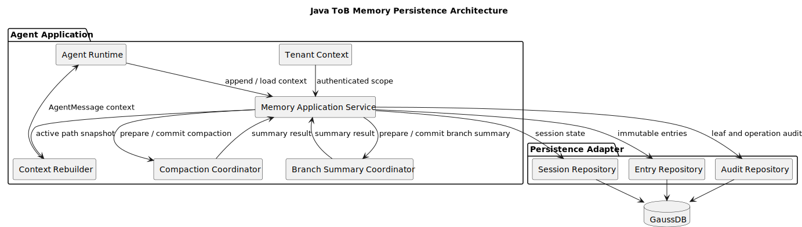
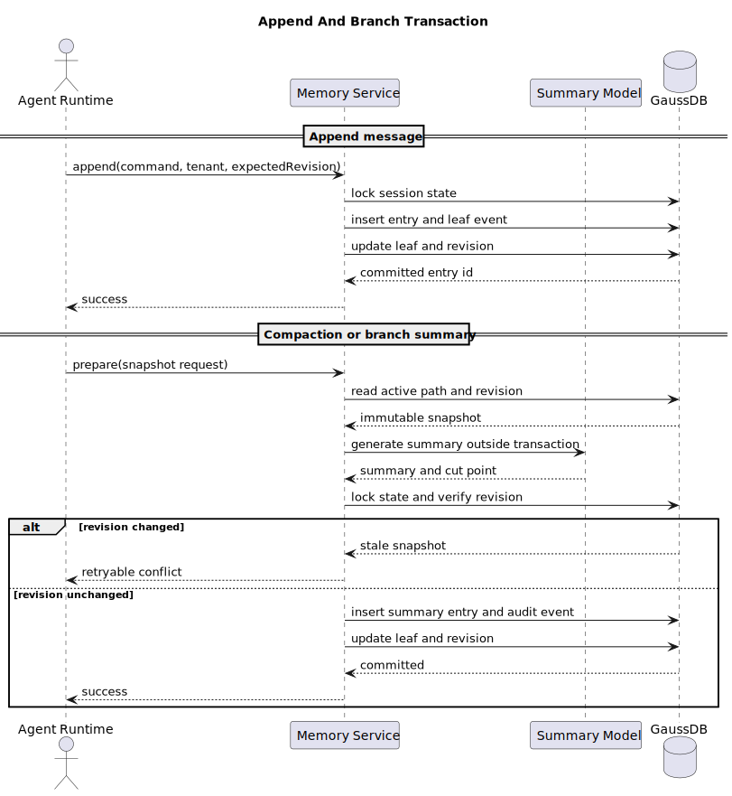
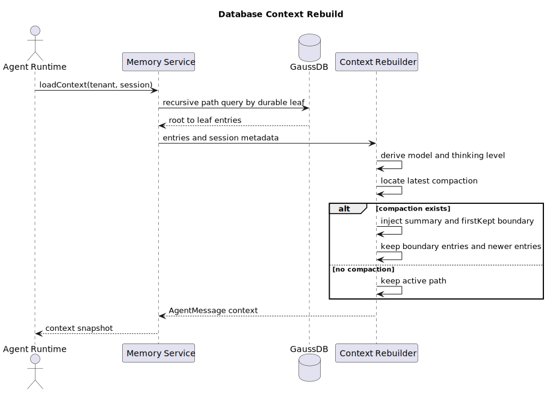

# pi-mono Java ToB 记忆系统 SR 设计

> 文档编号：SR-MEM-001
> 版本：v0.1
> 日期：2026-07-15
> 状态：设计初稿
> pi 源码基线：[`dcfe36c79702ec240b146c45f167ab75ecddd205`](https://github.com/badlogic/pi-mono/tree/dcfe36c79702ec240b146c45f167ab75ecddd205)
> Java 源码基线：无；本文 Java 内容均为 target-only design

## 1. 结论

Java ToB 版本将记忆系统的持久化事实源从本地 JSONL 文件改为 GaussDB（PostgreSQL-compatible relational database）。核心上下文语义保持 pi 对齐：

- 会话 entry 仍然通过 `id` / `parentId` 组成树。
- 普通消息、压缩摘要、分支摘要和扩展状态仍然保留为可重放的 entry。
- 上下文恢复仍然由“当前 leaf 路径 + 最新 compaction + firstKeptEntryId”决定。
- LLM 摘要仍然在上下文接近窗口限制时生成，数据库只负责持久化和一致读取，不负责替代摘要模型。

Java 目标新增以下 ToB 能力：

- 每一行数据必须带 `tenant_id`，租户边界由认证上下文进入 Repository，不能由请求体决定。
- entry 使用数据库事务追加；当前 leaf、append sequence 和写入结果保持原子一致。
- 显式分支移动持久化为可审计状态，不依赖进程内存中的 leaf 指针。
- LLM 长耗时生成与数据库短事务分离，通过 revision 和幂等键防止过期摘要覆盖新分支。
- payload 保留原始扩展字段，同时提供文件操作和会话查询所需的规范化投影。

数据库持久化、租户隔离、幂等写入和可审计 leaf 是 Java 的架构改造或安全强化，不是 pi 原生行为。



[查看 PlantUML 源码](./diagrams/memory/diagram.puml#L1)

## 2. 范围与产品假设

### 2.1 本期范围

- 会话创建、恢复、追加消息、模型/思考级别变更。
- compaction、branch summary 和 context rebuild。
- JSONL 历史导入与必要的只读导出能力。
- 多租户隔离、并发控制、幂等、审计和基础运维查询。
- Java Agent Runtime、Memory Application Service、Repository 和数据库表边界。

### 2.2 本期不包括

- 用向量检索替代 session context。
- 自动从所有历史会话抽取跨会话长期记忆。
- 让数据库执行摘要生成、prompt 编排或 LLM provider 调用。
- 为不同租户保存 API key、OAuth token 或其他 provider secret。
- 对 pi 的所有 CLI/TUI 行为做 Java 端复刻。

### 2.3 已采用的 ToB 假设

| 假设 | 设计影响 |
|---|---|
| 产品是 Java GUI/API 服务 | 会话操作通过服务端统一进入 Memory Application Service |
| 产品面向多个租户 | 所有业务表使用 `tenant_id`，Repository 不接受无租户查询 |
| 关系型数据库采用 GaussDB | 使用事务、递归查询和 JSONB；SQL 尽量保持 PostgreSQL-compatible |
| 需要审计和恢复 | entry 不更新、不覆盖；状态投影与审计事件分离 |
| 允许高并发请求重试 | append、branch、compaction commit 使用幂等键和 revision 检查 |

如果最终数据库不是 GaussDB，应保留本 SR 的领域模型和事务边界，仅重新验证 JSONB、递归 CTE、索引和行级安全能力。

## 3. pi 源码事实

本节只记录观察到的 pi 行为，不代表 Java 已有实现。

### 3.1 SessionEntry 是持久化事实源

当前生产版 `SessionManager` 定义了 `message`、`thinking_level_change`、`model_change`、`compaction`、`branch_summary`、`custom`、`custom_message`、`label` 和 `session_info` 等 entry。`CompactionEntry` 使用 `summary`、`firstKeptEntryId`、`tokensBefore`、`details` 和 `fromHook`；`BranchSummaryEntry` 使用 `fromId`、`summary`、`details` 和 `fromHook`。

源码证据：[`SessionEntry` types](https://github.com/badlogic/pi-mono/blob/dcfe36c79702ec240b146c45f167ab75ecddd205/packages/coding-agent/src/core/session-manager.ts#L46-L143)。

### 3.2 Context rebuild 只选择当前路径

`buildContextEntries()` 从当前 leaf 向 root 形成路径。如果路径中存在 compaction，它把最新 compaction 转为摘要消息，保留 `firstKeptEntryId` 到 compaction 之前的 entry，并保留 compaction 之后的 entry。随后 `buildSessionContext()` 将 entry 投影为 LLM 消息。

源码证据：[`buildContextEntries()`](https://github.com/badlogic/pi-mono/blob/dcfe36c79702ec240b146c45f167ab75ecddd205/packages/coding-agent/src/core/session-manager.ts#L406-L449)。

### 3.3 普通写入是追加，production leaf 不是独立 entry

`_appendEntry()` 将 entry 加入内存列表、把 leaf 指向新 entry，并通过 `appendFileSync()` 写入 JSONL。生产版 `branch()` 和 `resetLeaf()` 只改变内存中的 `leafId`；普通 tree 导航没有单独的 leaf entry。带摘要导航会追加 `branch_summary`，因此摘要 entry 会成为新的 leaf。

这意味着 Java 若要在 ToB 场景中保证“只导航但尚未追加下一条消息”的状态可恢复，需要进行架构改造，不能直接假设 pi 的内存 leaf 语义已经持久化。

源码证据：[`_appendEntry()`](https://github.com/badlogic/pi-mono/blob/dcfe36c79702ec240b146c45f167ab75ecddd205/packages/coding-agent/src/core/session-manager.ts#L975-L980)、[`branch()` / `resetLeaf()` / `branchWithSummary()`](https://github.com/badlogic/pi-mono/blob/dcfe36c79702ec240b146c45f167ab75ecddd205/packages/coding-agent/src/core/session-manager.ts#L1284-L1327)。

### 3.4 Compaction 的触发、切割和增量摘要

当前默认值是 `enabled=true`、`reserveTokens=16384`、`keepRecentTokens=20000`。触发条件为：

```text
contextTokens > contextWindow - reserveTokens
```

切割点允许位于 user、assistant、bashExecution、custom、branchSummary 和 compactionSummary 消息，不能位于 toolResult。单个 turn 过大时，代码生成历史摘要和 turn prefix 摘要。

源码证据：[`DEFAULT_COMPACTION_SETTINGS` / `shouldCompact()`](https://github.com/badlogic/pi-mono/blob/dcfe36c79702ec240b146c45f167ab75ecddd205/packages/coding-agent/src/core/compaction/compaction.ts#L100-L110)、[`isCutPointMessage()`](https://github.com/badlogic/pi-mono/blob/dcfe36c79702ec240b146c45f167ab75ecddd205/packages/coding-agent/src/core/compaction/compaction.ts#L282-L317)、[`prepareCompaction()`](https://github.com/badlogic/pi-mono/blob/dcfe36c79702ec240b146c45f167ab75ecddd205/packages/coding-agent/src/core/compaction/compaction.ts#L633-L705)。

重复压缩时，前一次非 hook compaction 的 summary 会作为 `previousSummary` 输入；生成结果追加为新的 compaction entry。

源码证据：[`generateSummary()`](https://github.com/badlogic/pi-mono/blob/dcfe36c79702ec240b146c45f167ab75ecddd205/packages/coding-agent/src/core/compaction/compaction.ts#L512-L608)、[`compact()`](https://github.com/badlogic/pi-mono/blob/dcfe36c79702ec240b146c45f167ab75ecddd205/packages/coding-agent/src/core/compaction/compaction.ts#L740-L825)。

### 3.5 Branch summary 的生成和挂载

`collectEntriesForBranchSummary()` 找到旧 leaf 与目标 entry 的 common ancestor，收集旧路径上的 entry。`AgentSession.navigateTree()` 生成摘要后，把 `branch_summary` 挂到目标侧的 `newLeafId`，而不是挂到被离开的旧分支末尾。

源码证据：[`collectEntriesForBranchSummary()`](https://github.com/badlogic/pi-mono/blob/dcfe36c79702ec240b146c45f167ab75ecddd205/packages/coding-agent/src/core/compaction/branch-summarization.ts#L90-L139)、[`navigateTree()`](https://github.com/badlogic/pi-mono/blob/dcfe36c79702ec240b146c45f167ab75ecddd205/packages/coding-agent/src/core/agent-session.ts#L2799-L2975)。

### 3.6 文件操作和序列化

内建摘要从 assistant tool call 中提取 `read`、`write` 和 `edit` 的 `path`，计算：

```text
modifiedFiles = written + edited
readFiles = read - modifiedFiles
```

tool result 在摘要序列化时最多保留 2000 个字符。compaction 会继承前一个 pi-generated compaction 的 file details；branch summary 会累计 branch summary 自身的 details。这两个累计链路在当前代码中不是跨机制合并。

源码证据：[`computeFileLists()` / `serializeConversation()`](https://github.com/badlogic/pi-mono/blob/dcfe36c79702ec240b146c45f167ab75ecddd205/packages/coding-agent/src/core/compaction/utils.ts#L26-L162)、[`extractFileOperations()`](https://github.com/badlogic/pi-mono/blob/dcfe36c79702ec240b146c45f167ab75ecddd205/packages/coding-agent/src/core/compaction/compaction.ts#L26-L64)。

### 3.7 Extension hooks

当前 production AgentSession 支持 `session_before_compact`、`session_compact`、`session_before_tree` 和 `session_tree`。压缩 hook 可以取消操作或提供自定义 summary、firstKeptEntryId、tokensBefore 和 details；tree hook 可以取消导航或提供自定义摘要。

源码证据：[`SessionBeforeCompactEvent` / `SessionBeforeTreeEvent`](https://github.com/badlogic/pi-mono/blob/dcfe36c79702ec240b146c45f167ab75ecddd205/packages/coding-agent/src/core/extensions/types.ts#L577-L638)。

## 4. Java 目标行为

本节是 target-only Java design。它保留 pi 的可见语义，并明确 ToB 差异。

### 4.1 追加消息

当 Agent Runtime 完成一个可持久化消息时，Memory Application Service 在一个短数据库事务内完成：

1. 根据认证上下文锁定租户内 session state。
2. 校验 expected leaf 和 session revision。
3. 分配单调递增 `append_seq`。
4. 插入不可变 `session_entry`。
5. 更新 materialized current leaf 和 revision。
6. 提交事务并返回 entry id。

LLM 请求、工具执行和网络 I/O 不得在该数据库事务中执行。

### 4.2 恢复上下文

Memory Application Service 从数据库读取当前 leaf 到 root 的路径，然后由 Java `ContextRebuilder` 执行与 pi 对齐的确定性投影：

1. 从完整 active path 推导 model 和 thinking level。
2. 找到最新 compaction。
3. 输出 compaction summary message。
4. 保留 firstKeptEntryId 之后、compaction 之前的 entry。
5. 保留 compaction 之后的 entry。
6. 将 branch summary、custom message 和普通 message 转成 AgentMessage。

Context rebuild 不依赖 session 文件顺序；`append_seq` 只用于稳定排序和审计，树关系由 `parent_entry_id` 决定。

### 4.3 Compaction

当 context token 超过模型窗口减去 reserveTokens，Agent Runtime 请求 Memory Application Service 准备 compaction。服务读取一个带 revision 的 active path snapshot；摘要模型在事务外执行。提交摘要时再次校验 revision 和 expected leaf：

- 校验通过：追加 compaction entry，更新 current leaf，提交。
- 校验失败：不写入过期摘要，重新读取路径并重试或返回可重试冲突。

这是一项并发安全架构改造。pi 当前实现通过单进程控制流避免大多数并发竞争，Java ToB 服务不能依赖该假设。

### 4.4 Tree navigation 和 branch summary

用户选择目标节点时，服务先计算 common ancestor 和待摘要路径。摘要生成在事务外执行；提交时锁定 session state 并校验 revision。成功后：

- 无 summary：持久化 leaf move event，并更新 current leaf。
- 有 summary：在目标侧插入 `branch_summary` entry，并把该 entry 设为 current leaf。

目标侧挂载是 pi 当前 production 行为。Java 额外持久化 leaf move event 是 ToB 审计和恢复要求，属于架构改造。

### 4.5 扩展状态

扩展可以写 `custom` entry，也可以写 `custom_message` entry。`custom` 默认不进入 LLM context；`custom_message` 进入 context。扩展 details 原样保存在 JSONB，但服务必须限制大小、禁止 secret 字段，并记录 extension type 和写入身份。

## 5. 目标架构

### 5.1 组件职责

| 组件 | 职责 |
|---|---|
| Agent Runtime | 驱动 turn、工具和 LLM；不直接访问数据库 |
| Memory Application Service | 编排 append、context、compaction、tree navigation 和迁移 |
| Context Rebuilder | 将 active path 确定性地投影为 runtime context |
| Compaction Coordinator | 生成 snapshot、调用摘要模型、提交 compaction entry |
| Branch Summary Coordinator | 计算分支路径、调用摘要模型、提交 branch summary |
| Session Repository | 读取 session state、路径和元数据 |
| Entry Repository | 追加 entry、读取 entry、执行幂等校验 |
| Audit Repository | 保存 leaf move、冲突、迁移和管理操作审计 |
| GaussDB | 保存 durable source of truth 和物化查询投影 |



[查看 PlantUML 源码](./diagrams/memory/diagram.puml#L46)

### 5.2 Java 包边界

以下是 target-only 包边界，不表示当前 Java 工程已经存在这些类：

```text
com.example.agent.memory.api
  MemorySessionApplicationService
  MemoryContextQuery
  MemoryWriteCommand

com.example.agent.memory.domain
  SessionAggregate
  SessionEntry
  CompactionEntry
  BranchSummaryEntry
  ContextSnapshot
  TenantId

com.example.agent.memory.application
  ContextRebuilder
  CompactionCoordinator
  BranchSummaryCoordinator
  JsonlImportService

com.example.agent.memory.infrastructure.gauss
  GaussSessionRepository
  GaussEntryRepository
  GaussAuditRepository
  GaussSessionRowMapper
```

Java 使用 sealed interface 或明确的 entry record 表达领域类型；数据库 `payload` 仍保留原始 JSON，以便未知 extension entry 可被导入和重新导出。

## 6. 逻辑数据模型

### 6.1 `agent_session`

保存 header 和当前状态投影：

- `(tenant_id, session_id)` 是主键。
- `current_leaf_entry_id` 是可恢复的当前 leaf。
- `revision` 用于乐观并发检查。
- `next_append_seq` 用于在 session 行锁内分配顺序。
- `parent_session_id` 表示 fork 关系；跨租户 fork 必须经过授权校验。

### 6.2 `session_entry`

每条 entry 只插入一次，payload 保存该 entry 的完整原始 JSON 形状。固定列用于树遍历、租户过滤、类型过滤、排序和审计；易变扩展字段不拆成大量 nullable 列。

### 6.3 `session_leaf_event`

记录显式 branch、reset、恢复和追加造成的 leaf 改变。它是 Java ToB 新增的审计事件，不参与 LLM context。`agent_session.current_leaf_entry_id` 是它的最新物化结果。

### 6.4 `session_file_operation`

从内建 compaction/branch summary details 展开文件路径，支持文件级审计和会话查询。它不是 LLM context 的事实源；summary 和 entry payload 仍然保留。

### 6.5 数据关系



[查看 PlantUML 源码](./diagrams/memory/diagram.puml#L88)

## 7. GaussDB DDL 草案

以下 DDL 是 target-only 草案。实际部署前需要根据 GaussDB 版本验证 JSONB、递归 CTE、索引和约束语法。

```sql
CREATE TABLE agent_session (
    tenant_id              VARCHAR(64)  NOT NULL,
    session_id             VARCHAR(128) NOT NULL,
    session_version        INTEGER      NOT NULL DEFAULT 3,
    cwd                    TEXT         NOT NULL,
    parent_session_id      VARCHAR(128),
    current_leaf_entry_id  VARCHAR(128),
    revision               BIGINT       NOT NULL DEFAULT 0,
    next_append_seq        BIGINT       NOT NULL DEFAULT 1,
    created_at             TIMESTAMPTZ  NOT NULL,
    updated_at             TIMESTAMPTZ  NOT NULL,
    metadata               JSONB        NOT NULL DEFAULT '{}'::jsonb,
    PRIMARY KEY (tenant_id, session_id)
);

CREATE TABLE session_entry (
    tenant_id          VARCHAR(64)  NOT NULL,
    session_id         VARCHAR(128) NOT NULL,
    entry_id           VARCHAR(128) NOT NULL,
    parent_entry_id    VARCHAR(128),
    entry_type         VARCHAR(64)  NOT NULL,
    append_seq         BIGINT       NOT NULL,
    event_time         TIMESTAMPTZ  NOT NULL,
    payload            JSONB        NOT NULL,
    created_at         TIMESTAMPTZ  NOT NULL,
    PRIMARY KEY (tenant_id, session_id, entry_id),
    UNIQUE (tenant_id, session_id, append_seq),
    FOREIGN KEY (tenant_id, session_id, parent_entry_id)
        REFERENCES session_entry (tenant_id, session_id, entry_id),
    CHECK (entry_type IN (
        'message', 'thinking_level_change', 'model_change',
        'compaction', 'branch_summary', 'custom', 'custom_message',
        'label', 'session_info'
    ))
);

CREATE TABLE session_leaf_event (
    tenant_id          VARCHAR(64)  NOT NULL,
    session_id         VARCHAR(128) NOT NULL,
    event_id           VARCHAR(128) NOT NULL,
    from_leaf_entry_id VARCHAR(128),
    to_leaf_entry_id   VARCHAR(128),
    reason             VARCHAR(32)  NOT NULL,
    operation_id       VARCHAR(128) NOT NULL,
    occurred_at        TIMESTAMPTZ  NOT NULL,
    details            JSONB        NOT NULL DEFAULT '{}'::jsonb,
    PRIMARY KEY (tenant_id, session_id, event_id),
    CHECK (reason IN ('append', 'branch', 'reset', 'resume', 'import'))
);

CREATE TABLE session_file_operation (
    tenant_id       VARCHAR(64)  NOT NULL,
    session_id      VARCHAR(128) NOT NULL,
    source_entry_id VARCHAR(128) NOT NULL,
    operation_type  VARCHAR(16)  NOT NULL,
    file_path       TEXT         NOT NULL,
    created_at      TIMESTAMPTZ  NOT NULL,
    PRIMARY KEY (tenant_id, session_id, source_entry_id, operation_type, file_path),
    FOREIGN KEY (tenant_id, session_id, source_entry_id)
        REFERENCES session_entry (tenant_id, session_id, entry_id),
    CHECK (operation_type IN ('read', 'written', 'edited'))
);

CREATE TABLE memory_write_operation (
    tenant_id       VARCHAR(64)  NOT NULL,
    operation_id    VARCHAR(128) NOT NULL,
    session_id      VARCHAR(128) NOT NULL,
    request_hash    CHAR(64)     NOT NULL,
    result_payload  JSONB        NOT NULL,
    committed_at    TIMESTAMPTZ  NOT NULL,
    PRIMARY KEY (tenant_id, operation_id)
);
```

`agent_session.current_leaf_entry_id` 不直接建立循环外键；写事务必须先验证 entry 属于同一 `(tenant_id, session_id)`。如果部署方需要数据库强约束，应使用可延迟约束或把 session state 拆成独立状态表。

## 8. 索引与查询

```sql
CREATE INDEX idx_session_entry_parent
    ON session_entry (tenant_id, session_id, parent_entry_id);

CREATE INDEX idx_session_entry_sequence
    ON session_entry (tenant_id, session_id, append_seq);

CREATE INDEX idx_session_entry_type
    ON session_entry (tenant_id, session_id, entry_type, append_seq);

CREATE INDEX idx_session_entry_payload
    ON session_entry USING GIN (payload jsonb_path_ops);

CREATE INDEX idx_file_operation_path
    ON session_file_operation (tenant_id, file_path);
```

### 8.1 Active path 查询

递归查询必须同时绑定 `tenant_id` 和 `session_id`。应用层不得先按 `entry_id` 全局查询再补租户过滤。

```sql
WITH RECURSIVE active_path AS (
    SELECT e.*, 0 AS depth
    FROM session_entry e
    JOIN agent_session s
      ON s.tenant_id = e.tenant_id
     AND s.session_id = e.session_id
     AND s.current_leaf_entry_id = e.entry_id
    WHERE e.tenant_id = :tenant_id
      AND e.session_id = :session_id

    UNION ALL

    SELECT parent.*, child.depth + 1
    FROM session_entry parent
    JOIN active_path child
      ON parent.tenant_id = child.tenant_id
     AND parent.session_id = child.session_id
     AND parent.entry_id = child.parent_entry_id
)
SELECT *
FROM active_path
ORDER BY depth DESC;
```

查询结果只负责提供 root-to-leaf 的 entry path；compaction 过滤和消息投影由 `ContextRebuilder` 负责，避免把 prompt 语义散落到 SQL。

## 9. 事务、并发和幂等

### 9.1 Append transaction

```text
BEGIN
  insert memory_write_operation if operation_id is new
  SELECT agent_session FOR UPDATE
  verify tenant_id, session_id, expected_leaf, expected_revision
  use next_append_seq and increment it
  INSERT session_entry
  INSERT session_leaf_event(reason = append)
  UPDATE agent_session.current_leaf_entry_id and revision
  store operation result
COMMIT
```

同一个 operation_id 重试时返回第一次提交结果；如果 request_hash 不一致，返回幂等键复用错误。数据库事务不包含模型调用、工具执行或远程服务调用。

### 9.2 Compaction commit

摘要生成必须使用 immutable `ContextSnapshot`。提交时再次锁定 session state：

- revision 和 expected leaf 一致时追加 compaction entry。
- revision 不一致时返回 `STALE_CONTEXT_SNAPSHOT`，保留原摘要结果但不落库。
- 重试必须基于新 snapshot 重新计算 firstKeptEntryId，不能复用旧切点。

### 9.3 Tree navigation commit

tree navigation 与 compaction 使用同一 revision 机制。摘要生成过程不持有数据库锁；只有最终 leaf move、branch summary entry、审计事件和 revision 更新在一个事务内提交。


[查看 PlantUML 源码](./diagrams/memory/diagram.puml#L46)

## 10. 租户隔离与安全

以下是 Java ToB 的安全强化，不是 pi 的 JSONL 行为：

- `TenantContext` 由认证层创建，Repository 方法必须显式接收并校验它。
- 所有主键、外键、查询、唯一约束和缓存 key 都包含 `tenant_id`。
- 不允许从 payload、客户端 header 或 session path 推导可信租户身份。
- 数据库连接使用最小权限账号；应用写账号不能执行任意 DDL。
- payload 中禁止保存 API key、OAuth token、cookie 和完整授权 header。
- 日志只记录 tenant、session、entry、operation 和 correlation id；summary、prompt、tool result 默认脱敏或截断。
- 数据库连接使用 TLS；备份、归档和临时导出必须使用平台加密能力。
- `session_file_operation` 的 file path 需要按租户权限控制，避免跨租户暴露代码仓库路径。
- 租户配额至少限制 session 数量、entry 数量、payload 字节数、summary 长度和单次导入大小。

是否启用数据库原生 row-level security 取决于最终 GaussDB 版本能力；不能把未验证的 RLS 语法当作本设计的唯一隔离措施。

## 11. JSONL 迁移与回滚

### 11.1 导入

1. 逐行解析 header 和 entry。
2. 根据 header 创建 `(tenant_id, session_id)`。
3. 按文件顺序分配 `append_seq`，保留原始 `timestamp` 和完整 payload。
4. 校验 parentId、firstKeptEntryId、fromId 和 label targetId 的引用。
5. 从 compaction/branch details 展开 `session_file_operation`。
6. 根据源 session 的最后 entry 建立初始 current leaf，并记录 `reason=import`。
7. 生成导入计数、hash、孤儿 entry 和 payload 解析错误报告。

当前 pi production session 文件没有显式 leaf entry；因此历史 JSONL 只能可靠表达文件最后 entry，无法恢复“只在进程内 branch 后但尚未追加”的瞬时 leaf。这是导入限制，不应伪装成原始数据存在。

### 11.2 回滚

首期采用数据库只读导出作为回滚材料：按 `append_seq` 导出 header、entry payload 和必要的 leaf state。切换期间保留 JSONL 原文件只读，不进行双向写入；双写会引入两个事实源和难以审计的冲突。

### 11.3 分阶段发布

| 阶段 | 结果 |
|---|---|
| M0 | 创建 schema、权限、索引和 Repository contract |
| M1 | 导入历史 JSONL，执行数量/hash/context parity 校验 |
| M2 | Java 读路径启用 DB，失败时只读回退 JSONL |
| M3 | Java 新写入只进入 DB，完成并发和幂等观测 |
| M4 | 关闭 JSONL 写入，保留受控导出和迁移工具 |
| M5 | 根据租户保留策略归档或删除 JSONL |

## 12. 需求与验收

### 12.1 PI parity

- FR-PI-MEM-001：同一 active path 产生与 pi 等价的 context entry 顺序。
- FR-PI-MEM-002：最新 compaction 产生一个 summary message，并按 firstKeptEntryId 保留近期 entry。
- FR-PI-MEM-003：toolResult 不能成为 compaction cut point。
- FR-PI-MEM-004：重复 compaction 使用 previous summary 进行增量更新。
- FR-PI-MEM-005：branch summary 使用 old leaf 到 common ancestor 的 entry 集合生成。
- FR-PI-MEM-006：custom entry 默认不进入 LLM context，custom_message 可以进入。

### 12.2 Java ToB

- FR-JAVA-MEM-001：所有读写必须绑定认证租户上下文。
- FR-JAVA-MEM-002：entry、leaf state、leaf audit event 在同一事务内保持一致。
- FR-JAVA-MEM-003：普通 branch/reset 后进程重启仍能恢复当前 leaf。
- FR-JAVA-MEM-004：重复 operation_id 不产生重复 entry。
- FR-JAVA-MEM-005：过期 compaction/branch summary 不得覆盖新 revision。
- FR-JAVA-MEM-006：payload 不得保存 provider secret。
- FR-JAVA-MEM-007：历史 JSONL 可导入并输出 parity 报告。

### 12.3 测试设计

| 测试组 | 核心场景 |
|---|---|
| Context parity | 无 compaction、单次/重复 compaction、firstKeptEntryId、branch summary、custom message |
| Tree property | 多分支、common ancestor、目标侧摘要挂载、空 root、孤儿数据拒绝 |
| Transaction | append、branch、reset、compaction commit 的回滚和 revision 冲突 |
| Idempotency | 同 operation_id 重试、hash 不一致、网络超时后重试 |
| Tenant security | 同 entry/session id 跨租户不可读、不可写、不可通过递归查询泄露 |
| Migration | v1/v2/v3 JSONL、坏 JSON、缺失 parent、错误 firstKeptEntryId、重复导入 |
| Limit | payload、tool result、summary、entry 数量、单租户配额超限 |
| Recovery | commit 后进程退出、只导航后重启、数据库连接中断和重试 |

## 13. 设计取舍

| ID | 问题 | pi 源码事实 | Java ToB 选择 | 差异分类 |
|---|---|---|---|---|
| TD-MEM-01 | 持久化介质 | append-only JSONL | GaussDB `session_entry` + JSONB payload | 架构改造 |
| TD-MEM-02 | active leaf | production leaf 主要由内存管理 | current leaf + leaf event 持久化 | 架构改造 |
| TD-MEM-03 | 并发 | 主要按单进程 AgentSession 控制 | row lock + revision + idempotency | ToB 可靠性强化 |
| TD-MEM-04 | 租户 | 本地 session path 无租户概念 | 全表 tenant key + authenticated TenantContext | 安全强化 |
| TD-MEM-05 | 原始 payload | TypeScript 对象直接写 JSONL | 固定查询列 + JSONB 原始 payload | Java 实现选择 |
| TD-MEM-06 | 文件追踪 | summary details 中保存文件列表 | 保留 details，并增加查询投影 | ToB 审计强化 |
| TD-MEM-07 | 向量检索 | pi compaction 不要求向量库 | 本期不引入向量索引 | 产品范围约束 |
| TD-MEM-08 | LLM 事务边界 | 摘要调用发生在 AgentSession 控制流中 | LLM 调用事务外，提交时检查 snapshot | 架构改造 |

## 14. 后续设计

以下主题不阻塞本期数据库持久化，但必须独立设计：

- 跨会话长期记忆的抽取、归档、删除和召回策略。
- summary、message text 和 file path 的全文/向量检索。
- 租户级保留策略、合规删除和加密密钥轮换。
- 大会话分区、冷热归档和异步 context cache。
- 事件发布、CDC、跨区域复制和灾备 RPO/RTO。

## 15. 版本记录

| 版本 | 日期 | 变更 |
|---|---|---|
| v0.1 | 2026-07-15 | 以 pi commit `dcfe36c79702ec240b146c45f167ab75ecddd205` 为基线，建立 Java ToB GaussDB 持久化、租户隔离、事务一致性、幂等和迁移设计；明确 Java target-only 差异 |
