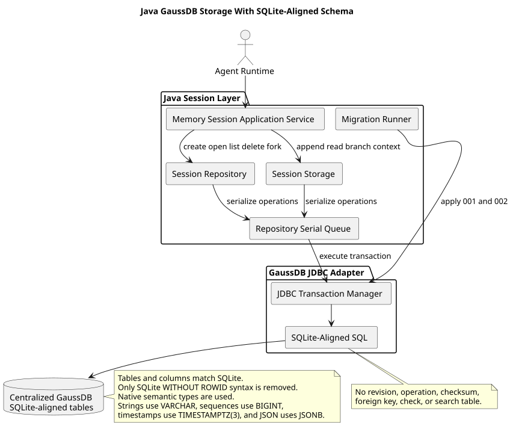
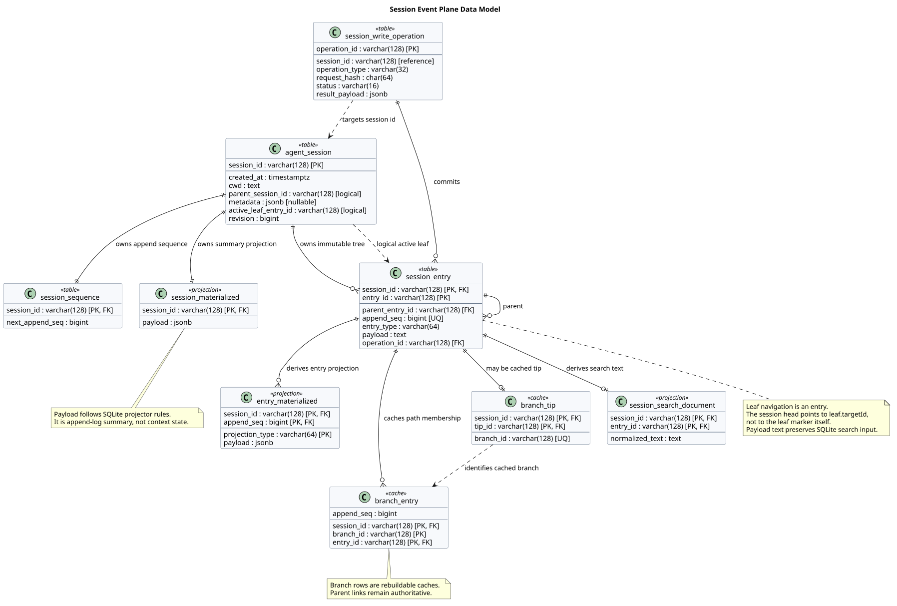
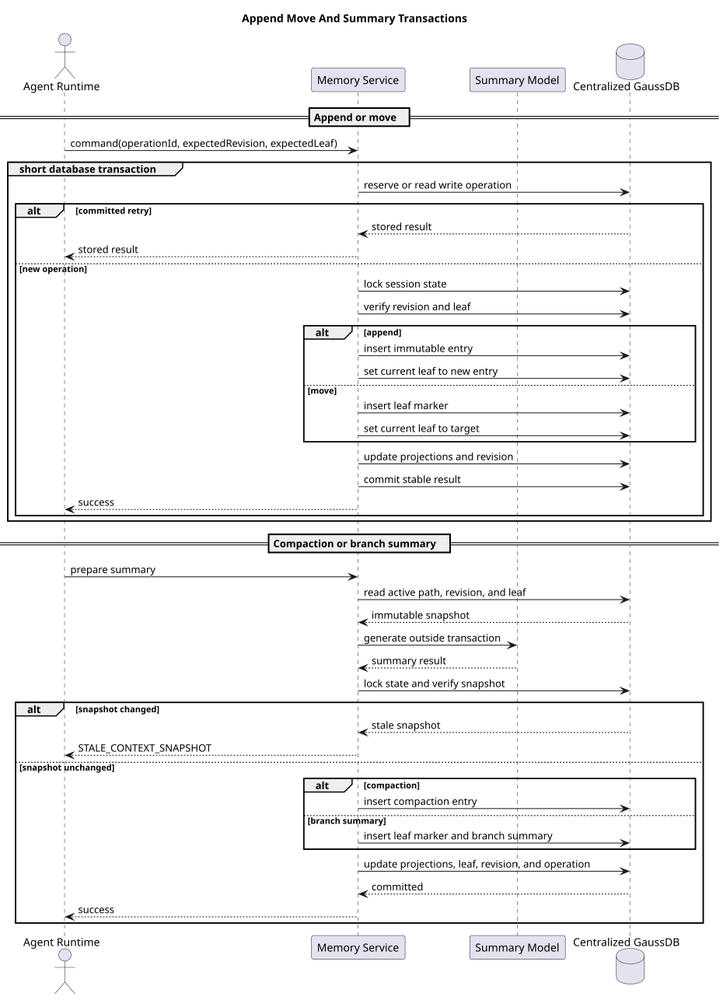
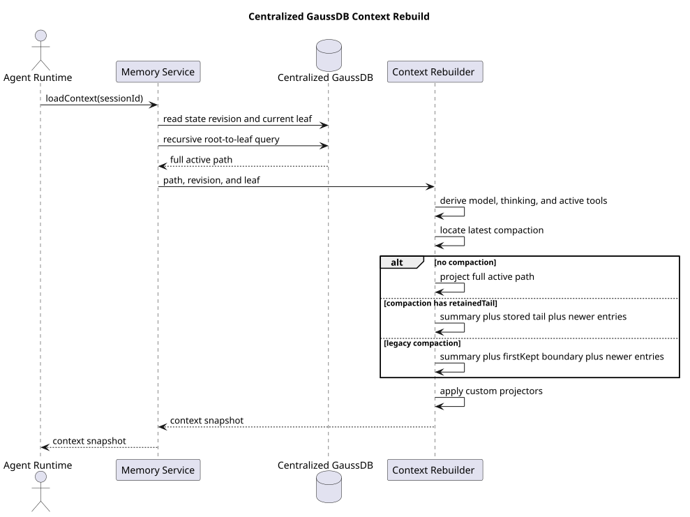

# pi-mono Java 集中式 GaussDB 会话存储 SR 设计

> 文档编号：SR-MEM-001
> 版本：v0.12
> 日期：2026-08-03
> 状态：设计评审稿
> pi 源码基线：[`f0deb8dd8e9611e89b5bc4145ca92c03ae6ed4ee`](https://github.com/badlogic/pi-mono/tree/f0deb8dd8e9611e89b5bc4145ca92c03ae6ed4ee)
> GaussDB 设计参考基线：本仓库 `8c08e5a06fa6e09ef2df4c2ca48140123394b4e8`；[`agent-metadata-gaussdb-design/schema.sql`](./agent-metadata-gaussdb-design/schema.sql) 和 [`chat-ws-v2.asyncapi.yaml`](./pi-mono-java-manager-driven-multi-agent-runtime/chat-ws-v2.asyncapi.yaml)
> Java 源码基线：无；本文 Java/GaussDB 内容均为 target-only design
> 数据库约束：集中式 GaussDB
> JDBC 约束：openGauss JDBC `6.0.0-htrunks.csi.gaussdb_kernel.opengaussjdbc.r1`

## 1. 结论

GaussDB Schema 以 pi-mono 当前 SQLite Schema 为唯一基线，执行物理对齐，而不再采用“业务语义对齐、数据库结构另行设计”的方式。

对齐规则如下：

- 表名与 SQLite 完全一致。
- 列名、可空性、主键、唯一索引、普通索引和 migration 顺序完全一致。
- `sessions`、`session_entries`、`session_sequences`、`branch_entries`、`branch_tips`、`session_materialized`、`entry_materialized` 和 `migrations` 均一对一保留。
- 只删除 SQLite 专属的 `WITHOUT ROWID`；sequence 使用 `BIGINT`，时间使用 `TIMESTAMPTZ(3)`，JSON document 使用 `JSONB`。
- migration、session、entry、branch 和 tip 标识及引用使用 `VARCHAR(128)`，entry type 使用 `VARCHAR(64)`，`cwd` 使用 `VARCHAR(512)`；不把字符串 ID 强行改为 UUID。
- 使用 `COMMENT ON COLUMN` 为 8 张表的 30 个字段提供中文注释；注释只是 GaussDB catalog 中的维护性元数据。
- 不增加 revision、operation、request hash、expected leaf、幂等表、额外搜索表、外键、CHECK、触发器或其他 GaussDB 专属结构。
- 事务内的 SQL 顺序、active leaf、materialized projection 和 branch cache 行为与 SQLite 一致。

这意味着 GaussDB 保持 SQLite Schema 的表、列和键模型，只调整列类型、应用已批准的显式字符长度，并增加不影响数据或行为的列注释元数据。类型适配会把时间对齐口径从原始字符串改为同一时间点，把 JSON 对齐口径从原文字节改为解码后的结构。



[查看 PlantUML 源码](./diagrams/memory/diagram.puml#L1)

## 2. 范围与非目标

### 2.1 本期范围

- 按 SQLite migration `001_initial.sql` 和 `002_branch_tips.sql` 建立 GaussDB Schema。
- 保持 SessionStorage 和 SessionRepository 的 create、open、list、delete、fork、append、branch query 和 context 行为。
- 保持 entry sequence、materialized state、label projection、active leaf 和 branch cache 的事务一致性。
- 支持 JSONL/SQLite 数据导入和受控导出。
- 使用指定 openGauss JDBC 驱动访问集中式 GaussDB。

### 2.2 本期不包括

- revision、乐观锁、expected leaf 或 stale snapshot 协议。
- operation id、request hash、持久化幂等结果或写操作审计表。
- SQLite Schema 中不存在的外键、CHECK、级联删除、触发器或投影表。
- 多租户、RLS、向量检索、跨会话长期记忆和 Runtime Checkpoint。
- 用 GaussDB 全文检索结构替代 SQLite FTS5；该问题不能仅靠语法或类型适配解决。
- 分布式分片键或 `DISTRIBUTE BY`。

### 2.3 运行约束

SQLite backend 使用一个进程内 `SerialOperationQueue` 串行化数据库操作。目标 Java 适配器保留相同的单写入者语义，不在数据库层新增并发协议。

如果未来需要多个服务实例并发写同一 session，必须另立设计版本；不能在本版本中隐式增加 revision、行锁协议或幂等表。

数据库兼容模式必须保留空字符串，不得把空字符串转换为 NULL；数据库编码使用 UTF-8，文本比较和索引排序使用与 SQLite 默认 `BINARY` 接近的大小写敏感二进制 collation。连接池初始化每个数据库会话为 UTC，JDBC 使用 typed parameter，不依赖 `DateStyle` 或隐式字符串转换。这些是部署前提，不增加表、列或索引。

应用和导入器必须在 JDBC 写入前按字段检查 128、64 和 512 字符上限，超长值返回稳定校验错误，不得截断后写入。PG-compatible 模式下 `VARCHAR(n)` 的 `n` 按字符计算；中文、emoji 等 UTF-8 多字节值仍必须通过目标服务端和定制 JDBC 组合验证。

原生类型会比 SQLite TEXT 更早拒绝非法值。导入前必须确认 `sessions.created_at` 和每个 `session_entries.timestamp` 可解析为时间点，四个 JSON 列均为合法 JSON；`migrations.applied_at` 由目标 migration runner 直接以 typed parameter 写入。`TIMESTAMPTZ(3)` 只保留毫秒精度；`JSONB` 不保留空白、对象键顺序或重复键。

## 3. pi SQLite 源码事实

本节只记录基线提交中观察到的实现。后续 GaussDB 内容是对该实现的直接移植。

### 3.1 Migration 和核心表

SQLite `applyMigrations()` 先建立 `migrations(id, applied_at)`，再按顺序执行：

1. `001_initial.sql`
2. `002_branch_tips.sql`

`001_initial.sql` 建立：

- `sessions`
- `session_entries`
- `session_sequences`
- `branch_entries`
- `session_materialized`
- `entry_materialized`

`002_branch_tips.sql` 建立 `branch_tips`，清空旧 branch cache，并删除已冗余的 `idx_branch_entries_session_branch`。

源码证据：

- [`migrations.ts`](https://github.com/badlogic/pi-mono/blob/f0deb8dd8e9611e89b5bc4145ca92c03ae6ed4ee/packages/storage/sqlite-node/src/sqlite/migrations.ts#L1-L55)
- [`001_initial.sql`](https://github.com/badlogic/pi-mono/blob/f0deb8dd8e9611e89b5bc4145ca92c03ae6ed4ee/packages/storage/sqlite-node/src/sqlite/migrations/001_initial.sql#L1-L59)
- [`002_branch_tips.sql`](https://github.com/badlogic/pi-mono/blob/f0deb8dd8e9611e89b5bc4145ca92c03ae6ed4ee/packages/storage/sqlite-node/src/sqlite/migrations/002_branch_tips.sql#L1-L12)

### 3.2 Session、entry 和 sequence

`sessions.active_leaf_id` 保存当前 leaf。`session_entries` 以 `(session_id, id)` 为主键，并以 `(session_id, entry_seq)` 保证 append 顺序唯一。`session_sequences` 为每个 session 保存下一条 sequence。

entry payload 在 SQLite 中是 type-specific JSON TEXT。base 字段 `id`、`parentId`、`timestamp` 和 `type` 分别保存在固定列中，读取时重新组合为 `SessionTreeEntry`。目标 GaussDB 把该 JSON TEXT 适配为 `JSONB`，所以行为对齐比较解码结构，不比较 JSON 原文。

默认 session id 是 UUIDv7，但 `SessionCreateOptions.id` 允许调用方提供任意字符串；常规 entry id 还是 UUIDv7 的末 8 位，底层校验只要求非空字符串。因此 ID 列不能统一改成 `UUID`。本文的显式 `VARCHAR(n)` 是 GaussDB 目标产品约束，不是 pi SQLite 源码已有的长度保证。

源码证据：

- [`session-entries.ts`](https://github.com/badlogic/pi-mono/blob/f0deb8dd8e9611e89b5bc4145ca92c03ae6ed4ee/packages/storage/sqlite-node/src/sqlite/storage/session-entries.ts#L1-L217)
- [`session-sequences.ts`](https://github.com/badlogic/pi-mono/blob/f0deb8dd8e9611e89b5bc4145ca92c03ae6ed4ee/packages/storage/sqlite-node/src/sqlite/storage/session-sequences.ts#L1-L16)
- [`sessions.ts`](https://github.com/badlogic/pi-mono/blob/f0deb8dd8e9611e89b5bc4145ca92c03ae6ed4ee/packages/storage/sqlite-node/src/sqlite/storage/sessions.ts#L1-L40)
- [`createSessionId()` / `createTimestamp()`](https://github.com/badlogic/pi-mono/blob/f0deb8dd8e9611e89b5bc4145ca92c03ae6ed4ee/packages/agent/src/harness/session/repository.ts#L14-L20)
- [`Session.createEntryId()`](https://github.com/badlogic/pi-mono/blob/f0deb8dd8e9611e89b5bc4145ca92c03ae6ed4ee/packages/agent/src/harness/session/session.ts#L229-L245)

### 3.3 Append transaction

SQLite `appendEntry()` 在同一事务中：

1. 读取下一 sequence。
2. 插入 `session_entries`。
3. 更新 `session_sequences`。
4. 更新 `session_materialized`。
5. 插入需要的 `entry_materialized` 行。
6. 更新 `sessions.active_leaf_id`。
7. 更新 `branch_entries` 和 `branch_tips`。

任一步失败，整个 append 回滚。

源码证据：

- [`SqliteSessionConnection.appendEntry()`](https://github.com/badlogic/pi-mono/blob/f0deb8dd8e9611e89b5bc4145ca92c03ae6ed4ee/packages/storage/sqlite-node/src/sqlite/storage/index.ts#L367-L418)
- [`appendEntryToBranchCache()`](https://github.com/badlogic/pi-mono/blob/f0deb8dd8e9611e89b5bc4145ca92c03ae6ed4ee/packages/storage/sqlite-node/src/sqlite/storage/branch-cache.ts#L265-L326)

### 3.4 Materialized projection

`session_materialized.payload` 保存 append-log summary，包括 name、messageCount、tokens、cost、currentModel 和 currentThinkingLevel。`entry_materialized` 当前只保存 label projection，并保留 label 设置和清除的 append 顺序。

源码证据：

- [`session-materialized.ts`](https://github.com/badlogic/pi-mono/blob/f0deb8dd8e9611e89b5bc4145ca92c03ae6ed4ee/packages/storage/sqlite-node/src/sqlite/storage/session-materialized.ts#L1-L355)

### 3.5 Branch cache 和 Context

`branch_entries` 和 `branch_tips` 是可重建的 root-to-tip 缓存；`session_entries.parent_id` 是权威 parent chain。缓存缺失或损坏时，从 canonical parent links 重建。

`readPathToRootOrCompaction()` 返回 compaction-trimmed path。model、thinking level、active tools 和 context messages 都从该路径推导。

源码证据：

- [`branch-cache.ts`](https://github.com/badlogic/pi-mono/blob/f0deb8dd8e9611e89b5bc4145ca92c03ae6ed4ee/packages/storage/sqlite-node/src/sqlite/storage/branch-cache.ts#L1-L326)
- [`readPathToRootOrCompaction()`](https://github.com/badlogic/pi-mono/blob/f0deb8dd8e9611e89b5bc4145ca92c03ae6ed4ee/packages/storage/sqlite-node/src/sqlite/storage/index.ts#L171-L276)
- [`buildSessionContext()`](https://github.com/badlogic/pi-mono/blob/f0deb8dd8e9611e89b5bc4145ca92c03ae6ed4ee/packages/agent/src/harness/session/session.ts#L41-L150)

### 3.6 Optional SQLite FTS5

`session_search_fts` 不属于 `001` 或 `002` migration。只有显式创建 SQLite search adapter 时，`ensureSearchSchema()` 才建立 FTS5 virtual table 和三个 trigger。

该 virtual table 依赖 SQLite FTS5、external content 和 SQLite rowid。GaussDB 没有可以通过表名、语法或字段类型直接等价替换的结构。因此本版本不在 GaussDB Schema 中创建 `session_search_fts` 或其他搜索表，也不声称完成 FTS5 物理设计对齐。

如产品需要无额外表的搜索，可组合 pi 已有的 scanning search；这不改变本 SR 的数据库 Schema，但也不声称复制 FTS5 的 trigram、短查询和 BM25 排序语义。

源码证据：

- [`ensureSearchSchema()`](https://github.com/badlogic/pi-mono/blob/f0deb8dd8e9611e89b5bc4145ca92c03ae6ed4ee/packages/storage/sqlite-node/src/sqlite/search-backend.ts#L32-L59)
- [`createScanningSessionSearch()`](https://github.com/badlogic/pi-mono/blob/f0deb8dd8e9611e89b5bc4145ca92c03ae6ed4ee/packages/agent/src/harness/session/search.ts#L11-L48)

## 4. Schema 一对一映射

| SQLite 表 | GaussDB 表 | 列对齐 | 允许的适配 |
|---|---|---|---|
| `migrations` | `migrations` | `id`, `applied_at` | `id` → `VARCHAR(128)`；time → `TIMESTAMPTZ(3)` |
| `sessions` | `sessions` | `id`, `created_at`, `cwd`, `parent_session_id`, `metadata`, `active_leaf_id` | ID/reference → `VARCHAR(128)`；`cwd` → `VARCHAR(512)`；time → `TIMESTAMPTZ(3)`；JSON → `JSONB` |
| `session_entries` | `session_entries` | `session_id`, `id`, `entry_seq`, `parent_id`, `type`, `timestamp`, `payload` | ID/reference → `VARCHAR(128)`；`type` → `VARCHAR(64)`；sequence → `BIGINT`；time → `TIMESTAMPTZ(3)`；JSON → `JSONB` |
| `session_sequences` | `session_sequences` | `session_id`, `next_seq` | `session_id` → `VARCHAR(128)`；sequence → `BIGINT` |
| `branch_entries` | `branch_entries` | `session_id`, `branch_id`, `entry_id`, `entry_seq` | ID/reference → `VARCHAR(128)`；sequence → `BIGINT` |
| `branch_tips` | `branch_tips` | `session_id`, `tip_id`, `branch_id` | ID/reference → `VARCHAR(128)` |
| `session_materialized` | `session_materialized` | `session_id`, `payload` | `session_id` → `VARCHAR(128)`；JSON → `JSONB` |
| `entry_materialized` | `entry_materialized` | `session_id`, `entry_seq`, `type`, `payload` | `session_id` → `VARCHAR(128)`；`type` → `VARCHAR(64)`；sequence → `BIGINT`；JSON → `JSONB` |

目标 Schema 不包含任何第九张业务表。

### 4.1 每张表的作用

| 表 | 作用 | 关键内容和关系 | 数据性质 |
|---|---|---|---|
| [`migrations`](https://github.com/badlogic/pi-mono/blob/f0deb8dd8e9611e89b5bc4145ca92c03ae6ed4ee/packages/storage/sqlite-node/src/sqlite/migrations.ts#L30-L54) | 数据库升级的“已完成清单”：记录哪些建表或改表脚本已经成功执行，避免下次启动时重复升级。 | `id` 保存脚本名，`applied_at` 保存成功时间；脚本 SQL 和登记行在同一事务中同时提交，任一失败就同时回滚。 | 只服务于数据库升级，不保存 session 或 entry 数据。 |
| [`sessions`](https://github.com/badlogic/pi-mono/blob/f0deb8dd8e9611e89b5bc4145ca92c03ae6ed4ee/packages/storage/sqlite-node/src/sqlite/storage/index.ts#L294-L365) | 保存每个 session 的主记录，用于 create、open、list、fork、head 读取和 delete。 | 保存创建时间、`cwd`、可选的父 session 和 metadata；`active_leaf_id` 保存当前活动 leaf，逻辑上指向同 session 的 `session_entries.id`。 | session 存在性、基本元数据和当前 head 的权威记录。 |
| [`session_entries`](https://github.com/badlogic/pi-mono/blob/f0deb8dd8e9611e89b5bc4145ca92c03ae6ed4ee/packages/storage/sqlite-node/src/sqlite/storage/index.ts#L367-L459) | 保存 session 的完整 append log 和树形 entry 历史，支持 entry 读取、分页、分支查询和 context 重建。 | `entry_seq` 确定追加顺序；`parent_id` 是同 session entry 父链的逻辑引用；`type` 和 `payload` 组合恢复具体 `SessionTreeEntry`。 | 权威 append log；`parent_id` 是分支树的事实源。 |
| [`session_sequences`](https://github.com/badlogic/pi-mono/blob/f0deb8dd8e9611e89b5bc4145ca92c03ae6ed4ee/packages/storage/sqlite-node/src/sqlite/storage/session-sequences.ts#L1-L16) | 为每个 session 保存下一个可分配的 `entry_seq`，使 append 按稳定的 64 位序号排序。 | create 时写入 `next_seq = 1`；append 先读取当前值，成功写入 entry 后在同一事务内递增。 | 每个 session 一行的序号分配运行状态；缺行被视为非法 session。 |
| [`branch_entries`](https://github.com/badlogic/pi-mono/blob/f0deb8dd8e9611e89b5bc4145ca92c03ae6ed4ee/packages/storage/sqlite-node/src/sqlite/storage/branch-cache.ts#L18-L197) | 保存每个 branch 从 root 到 tip 的 entry 成员及顺序，避免每次分支查询都递归遍历父链。 | `branch_id` 识别一条缓存路径；`entry_id` 和 `entry_seq` 来自 `session_entries`；同一 entry 可出现在多条共享前缀的 branch 中。 | 可重建的派生分支缓存，不是树结构事实源。 |
| [`branch_tips`](https://github.com/badlogic/pi-mono/blob/f0deb8dd8e9611e89b5bc4145ca92c03ae6ed4ee/packages/storage/sqlite-node/src/sqlite/storage/branch-cache.ts#L199-L326) | 保存每条缓存 branch 的当前 tip，使 append 可快速判断是线性扩展已有 branch，还是从旧 parent 建立新分支。 | `(session_id, tip_id)` 定位 branch；`(session_id, branch_id)` 唯一，保证每条缓存 branch 只有一个 tip；与 `branch_entries` 通过 `branch_id` 建立逻辑关系。 | 可重建的派生分支缓存；不等同于 `sessions.active_leaf_id`。 |
| [`session_materialized`](https://github.com/badlogic/pi-mono/blob/f0deb8dd8e9611e89b5bc4145ca92c03ae6ed4ee/packages/storage/sqlite-node/src/sqlite/storage/session-materialized.ts#L28-L221) | 为每个 session 保存一份累积 summary，避免 open、`getName()` 和 `getStats()` 时重放全部 entry。 | `payload` 包含 name、message/token/cost 统计、current model 和 current thinking level；create 写入空 summary，每次 append 在同一事务中更新。 | 每个 session 一行的派生物化投影，不代替权威 entry 历史。 |
| [`entry_materialized`](https://github.com/badlogic/pi-mono/blob/f0deb8dd8e9611e89b5bc4145ca92c03ae6ed4ee/packages/storage/sqlite-node/src/sqlite/storage/session-materialized.ts#L224-L355) | 保存需要按 append 顺序重放的稀疏 entry 投影；当前实现只物化 label 设置和清除事件。 | `(session_id, entry_seq, type)` 保留投影事件的追加顺序；open 时按序重放为 `labelsById`，不是“每个目标一行当前 label”。 | 可由 `session_entries` 重放生成的派生物化投影。 |

所有表间关系都是由应用在事务内维护的逻辑关系，不是数据库外键。会话树以 `session_entries.parent_id` 为权威父链；`branch_entries` 和 `branch_tips` 只是该父链的可重建查询缓存；`session_materialized` 和 `entry_materialized` 是由 append log 累积生成的读优化投影。这些职责说明不增加表、列、约束或索引。

`migrations` 可以理解为一张很小的数据库升级记录表。假设 `001_initial.sql` 和 `002_branch_tips.sql` 已成功执行，表中可能如下（时间仅为示例）：

| `id` | `applied_at` |
|---|---|
| `001_initial.sql` | `2026-08-03T10:00:00.000Z` |
| `002_branch_tips.sql` | `2026-08-03T10:00:01.000Z` |

应用下次启动时看到这两个 `id`，就知道基础表和 `branch_tips` 升级已完成，不会重新执行这两个 SQL 脚本。如果以后代码新增 `003_xxx.sql`，表中还没有它，系统才会执行并在成功后登记一行。

### 4.2 类型映射

| SQLite 语义 | GaussDB 声明 | 对齐口径与理由 |
|---|---|---|
| migration/session/entry/branch/tip 标识及引用 `TEXT` | `VARCHAR(128)` | 16 个同类列统一长度；与现有 CampusAgent `Identifier` / `SessionId` 的 128 字符上限一致 |
| entry/materialized type `TEXT` | `VARCHAR(64)` | 当前最长 entry type 为 21 字符；64 保留后续 discriminator 扩展空间，不改为 ENUM |
| sequence `INTEGER` | `BIGINT` | 保留 SQLite INTEGER 的 64 位范围 |
| ISO timestamp `TEXT` | `TIMESTAMPTZ(3)` | 比较同一 Instant；对外统一输出 UTC 三位毫秒格式 |
| JSON document `TEXT` | `JSONB` | 比较解码结构；接受 JSONB 规范化，不比较原文字节 |
| nullable metadata `TEXT` | nullable `JSONB` | SQL `NULL` 表示没有 metadata；不得与 JSON `null` 混淆 |
| cwd `TEXT` | `VARCHAR(512)` | Managed Agent 的 `cwd` 由服务端解析为受控规范绝对路径；512 是目标路径上限 |

`JSONB` 而不是 `JSON` 是本版本明确选择的 GaussDB 原生类型。它在写入时验证 JSON，并以规范化结构保存；因此会移除无语义空白、重排对象键并只保留重复键的最后一个值。若产品要求 JSON 原文字节可逆，应另行把该映射改为 GaussDB `JSON`，不能在不增加原文列的情况下同时获得 JSONB 规范化和字节保真。

[`agent-metadata-gaussdb-design/schema.sql`](./agent-metadata-gaussdb-design/schema.sql#L7) 中 Agent ID、resource type 和 name 分别使用明确的 `VARCHAR(64)`、`VARCHAR(16)` 和 `VARCHAR(128)`。Memory 复用的是“有界字段显式声明长度、同一逻辑域保持同型”这一规则，不盲目复制具体数字：Memory `session_id` 已有 [128 字符协议上限](./pi-mono-java-manager-driven-multi-agent-runtime/chat-ws-v2.asyncapi.yaml#L548)，而 `thinking_level_change` 已超过 16 字符。

上述 `VARCHAR(n)` 会缩小 SQLite `TEXT` 的可接受值域，因此它们是用户批准的 target-only 产品约束，不得表述为 pi 源码事实。目标实现不增加独立长度 `CHECK`，但 API、Java validator、importer 和 DDL 必须使用同一上限。

`cwd` 存在完整列索引 `idx_sessions_cwd`，因此不使用未经验证的超长路径上限。`VARCHAR(512)` 是受控 Managed Agent 路径的目标上限，不代表对所有数据库编码和索引页配置的理论保证；第 9.4 节必须使用 512 字符的最大 UTF-8 值实测该索引。

### 4.3 差异分类

| 差异 | 分类 | 是否改变结构 |
|---|---|---|
| 删除 `WITHOUT ROWID` | GaussDB 语法适配 | 否 |
| 标识及引用 `TEXT` → `VARCHAR(128)` | 用户批准的产品约束 | 不改变表或列集合；超过 128 字符的值被拒绝 |
| type `TEXT` → `VARCHAR(64)` | 用户批准的产品约束 | 不改变 discriminator 集合；超过 64 字符的值被拒绝 |
| cwd `TEXT` → `VARCHAR(512)` | 用户批准的产品约束 | 不改变列用途；受控规范路径不得超过 512 字符 |
| `INTEGER` → `BIGINT` | GaussDB 类型适配 | 否 |
| ISO timestamp `TEXT` → `TIMESTAMPTZ(3)` | 用户批准的 GaussDB 原生类型适配 | 否；改变值校验、表示和排序口径 |
| JSON document `TEXT` → `JSONB` | 用户批准的 GaussDB 原生类型适配 | 否；改变值校验和规范化口径 |
| 30 个 `COMMENT ON COLUMN` | 用户要求的维护性元数据 | 否；不改变表、列、键、数据或运行行为 |

`VARCHAR(n)` 上限明确分类为产品约束；时间和 JSON 变化是 GaussDB 原生类型适配；列注释是用户要求的维护性元数据。它们都不是安全强化或架构变更，不得据此增加表、列、独立 CHECK、索引或触发器。

### 4.4 明确禁止的结构

- `memory_schema_version`
- `agent_session`
- `session_entry`
- `session_sequence`
- `branch_entry`
- `branch_tip`
- `session_write_operation`
- `session_search_document`
- `revision`
- `operation_id`
- migration checksum
- SQLite Schema 中不存在的外键、CHECK、cascade 和 trigger



[查看 PlantUML 源码](./diagrams/memory/diagram.puml#L115)

## 5. Java 和 JDBC 边界

### 5.1 Java 接口

Java 继续实现 pi 的 `SessionStorage` 和 `SessionRepository` 契约，不增加数据库专属命令字段。

```java
interface MemorySessionApplicationService {
    SessionView createSession(CreateSessionCommand command);
    SessionView openSession(String sessionId);
    List<SessionSummary> listSessions(SessionListQuery query);
    void deleteSession(String sessionId);
    SessionView forkSession(ForkSessionCommand command);
    AppendResult appendEntry(AppendEntryCommand command);
    MoveResult moveTo(MoveToCommand command);
    ContextSnapshot loadContext(LoadContextQuery query);
    EntryPage pageEntries(EntryPageQuery query);
    List<SessionEntryView> findEntriesOnBranch(BranchEntryQuery query);
}
```

command 不包含 operation id、expected revision 或 expected leaf。并发模型与 SQLite 一样由 Repository 串行队列约束。

### 5.2 模块职责

| 组件 | 职责 |
|---|---|
| `MemorySessionApplicationService` | 编排 session 操作，不直接拼 SQL |
| `GaussDbSessionRepository` | create、open、list、delete、fork |
| `GaussDbSessionStorage` | entry、head、projection、branch query |
| `GaussDbMigrationRunner` | 按 SQLite migration id 和顺序执行适配后的 SQL |
| `GaussDbTransactionManager` | 提供与 SQLite transaction callback 等价的事务边界 |

### 5.3 JDBC 约束

| 项目 | 固定选择 |
|---|---|
| Maven 坐标 | `org.opengauss:opengauss-jdbc:6.0.0-htrunks.csi.gaussdb_kernel.opengaussjdbc.r1` |
| 驱动类 | `org.opengauss.Driver` |
| URL | `jdbc:opengauss://host:port/database` |
| Java API | `DataSource`, `Connection`, `PreparedStatement`, `ResultSet` |
| VARCHAR(n) | `setString` / `getString`；写入前分别校验 128、64 和 512 字符上限，超长值返回 validation error，不依赖数据库截断 |
| BIGINT | `setLong` / `getLong`；读取 nullable 值时同时检查 `wasNull()` |
| TIMESTAMPTZ(3) | 以 UTC `OffsetDateTime` 表示 Instant，并通过 JDBC 4.2 typed binding 读写；对外规范化为 UTC 三位毫秒 ISO 字符串 |
| JSONB | 写入使用 JSON String 加 `CAST(? AS JSONB)`；读取使用 `getString()` 后交给统一 JSON codec，不依赖输出键顺序 |

应用账号执行 DML；migration 身份执行 DDL，并必须是表所有者或具备 `COMMENT` 权限。优先在 SQL 中显式 cast JSONB，避免依赖驱动私有 object。定制 JDBC 对 `OffsetDateTime`、`Instant`、JSONB 和大值的实际行为必须通过 compatibility suite 验证，不能从其他 openGauss JDBC 版本推断。

## 6. GaussDB DDL

DDL 分为 bootstrap、`001_initial.sql` 和 `002_branch_tips.sql`。migration id 与 SQLite 完全一致。每张表的 `COMMENT ON COLUMN` 紧跟建表语句：`migrations` 注释由 bootstrap 执行，失败时不得继续 migration runner；其余注释与所属 `001` 或 `002` 同事务，任一字段不存在或注释失败时整个 migration 回滚。列注释直接说明“存什么、什么时候为空、与其他字段的关系”，不单独使用“稀疏投影”、“权威父链”或 `root-to-tip` 等设计术语。列注释不得包含凭据、payload 内容或其他敏感信息。

### 6.1 Bootstrap：`migrations`

```sql
CREATE TABLE IF NOT EXISTS migrations (
    id          VARCHAR(128)   PRIMARY KEY,
    applied_at  TIMESTAMPTZ(3) NOT NULL
);

COMMENT ON COLUMN migrations.id IS '迁移脚本的名称，例如 001_initial.sql；系统用它判断该脚本是否已经执行';
COMMENT ON COLUMN migrations.applied_at IS '该迁移脚本执行完成后登记的时间；脚本或事务失败时不会保留这条记录';
```

启动时，migration runner 先读取这张表：已有 `id` 的脚本直接跳过，尚未登记的脚本才执行。每个脚本和对应 `migrations` insert 在同一事务中完成，`applied_at` 以 UTC `OffsetDateTime` typed parameter 写入。所有 migration `id` 必须为 1–128 字符，超长脚本名在发布检查阶段拒绝。

本文仍是尚无 Java/GaussDB 实现的设计稿，因此列注释直接纳入 bootstrap、`001_initial.sql` 和 `002_branch_tips.sql`，不新增 `003`。如果某个目标库已基于旧稿登记过 `001`/`002`，仅修改旧脚本不会触发重执行；该库必须在发布前单独执行第 6.1–6.3 节的 30 条 `COMMENT ON COLUMN` 语句，或由后续实施版本增加专用 migration。

### 6.2 `001_initial.sql`

```sql
CREATE TABLE IF NOT EXISTS sessions (
    id                 VARCHAR(128)   PRIMARY KEY,
    created_at         TIMESTAMPTZ(3) NOT NULL,
    cwd                VARCHAR(512)   NOT NULL,
    parent_session_id  VARCHAR(128),
    metadata           JSONB,
    active_leaf_id     VARCHAR(128)
);

COMMENT ON COLUMN sessions.id IS '会话的唯一 ID，用于关联该会话的 entry（历史记录）、序号、分支和汇总数据';
COMMENT ON COLUMN sessions.created_at IS '创建这个会话的时间';
COMMENT ON COLUMN sessions.cwd IS '创建会话时使用的工作目录；可用于按工作目录筛选会话';
COMMENT ON COLUMN sessions.parent_session_id IS '当前会话来源于哪个父会话；未指定时为空，fork 时通常为来源会话的 ID';
COMMENT ON COLUMN sessions.metadata IS '创建会话时由调用方提供的附加信息 JSON 对象；未提供时为 SQL NULL';
COMMENT ON COLUMN sessions.active_leaf_id IS '当前选中的 entry（历史记录）ID，系统从它向前还原会话上下文；新建会话或 leaf.targetId 为 null 时为空；写入 leaf 事件时保存 targetId，不保存 leaf 事件自身 ID';

CREATE INDEX IF NOT EXISTS idx_sessions_created_at
    ON sessions (created_at DESC);

CREATE INDEX IF NOT EXISTS idx_sessions_cwd
    ON sessions (cwd);

CREATE INDEX IF NOT EXISTS idx_sessions_parent
    ON sessions (parent_session_id);

CREATE TABLE IF NOT EXISTS session_entries (
    session_id  VARCHAR(128)   NOT NULL,
    id          VARCHAR(128)   NOT NULL,
    entry_seq   BIGINT         NOT NULL,
    parent_id   VARCHAR(128),
    type        VARCHAR(64)    NOT NULL,
    timestamp   TIMESTAMPTZ(3) NOT NULL,
    payload     JSONB          NOT NULL,
    PRIMARY KEY (session_id, id)
);

COMMENT ON COLUMN session_entries.session_id IS '这条 entry（历史记录）属于哪个会话；对应 sessions.id';
COMMENT ON COLUMN session_entries.id IS '这条 entry（历史记录）的 ID；在同一个会话内唯一';
COMMENT ON COLUMN session_entries.entry_seq IS '这条 entry 在会话中的写入顺序号；从 1 开始，每次成功追加后递增';
COMMENT ON COLUMN session_entries.parent_id IS '这条 entry 的直接父 entry ID；会话的第一条 entry 为空，系统据此还原各条会话分支';
COMMENT ON COLUMN session_entries.type IS '这条 entry 的种类，例如 message、model_change 或 label；系统据此解释 payload';
COMMENT ON COLUMN session_entries.timestamp IS '这条 entry 产生时携带的事件时间；不是数据库保存这行数据的时间';
COMMENT ON COLUMN session_entries.payload IS '这条 entry 的具体内容 JSON；ID、父 entry、事件时间和类型已分别保存在其他字段中';

CREATE UNIQUE INDEX IF NOT EXISTS idx_session_entries_session_seq
    ON session_entries (session_id, entry_seq);

CREATE INDEX IF NOT EXISTS idx_session_entries_session_parent
    ON session_entries (session_id, parent_id);

CREATE INDEX IF NOT EXISTS idx_session_entries_session_type
    ON session_entries (session_id, type);

CREATE TABLE IF NOT EXISTS session_sequences (
    session_id  VARCHAR(128) PRIMARY KEY,
    next_seq    BIGINT       NOT NULL
);

COMMENT ON COLUMN session_sequences.session_id IS '这行序号记录属于哪个会话；对应 sessions.id，每个会话一行';
COMMENT ON COLUMN session_sequences.next_seq IS '下一条新 entry 要使用的 entry_seq；新建会话时为 1，每次成功追加后加 1';

CREATE TABLE IF NOT EXISTS branch_entries (
    session_id  VARCHAR(128) NOT NULL,
    branch_id   VARCHAR(128) NOT NULL,
    entry_id    VARCHAR(128) NOT NULL,
    entry_seq   BIGINT       NOT NULL,
    PRIMARY KEY (session_id, branch_id, entry_id)
);

COMMENT ON COLUMN branch_entries.session_id IS '这条缓存的分支成员记录属于哪个会话；对应 sessions.id';
COMMENT ON COLUMN branch_entries.branch_id IS '缓存路径的 ID；相同 ID 的多行按 entry_seq 排列后组成从会话起点到分支末端的一条路径，并与 branch_tips.branch_id 对应；缓存可根据 session_entries 重新生成';
COMMENT ON COLUMN branch_entries.entry_id IS '这条缓存路径中包含的 entry ID；对应同一会话的 session_entries.id，同一 entry 可出现在多条缓存路径中';
COMMENT ON COLUMN branch_entries.entry_seq IS '该 entry 在整个会话中的写入顺序号；从 session_entries 复制，用于按原顺序排列路径中的 entry，不是分支内重新编号';

CREATE INDEX IF NOT EXISTS idx_branch_entries_session_branch
    ON branch_entries (session_id, branch_id);

CREATE INDEX IF NOT EXISTS idx_branch_entries_session_branch_seq
    ON branch_entries (session_id, branch_id, entry_seq);

CREATE INDEX IF NOT EXISTS idx_branch_entries_session_entry
    ON branch_entries (session_id, entry_id);

CREATE TABLE IF NOT EXISTS session_materialized (
    session_id  VARCHAR(128) PRIMARY KEY,
    payload     JSONB        NOT NULL
);

COMMENT ON COLUMN session_materialized.session_id IS '这份会话汇总属于哪个会话；对应 sessions.id，每个会话一行';
COMMENT ON COLUMN session_materialized.payload IS '为快速打开会话而保存的汇总信息 JSON，包含会话名称、消息数、Token 和费用统计、当前模型及思考级别；不包含完整 entry，可根据 session_entries 重新计算';

CREATE TABLE IF NOT EXISTS entry_materialized (
    session_id  VARCHAR(128) NOT NULL,
    entry_seq   BIGINT       NOT NULL,
    type        VARCHAR(64)  NOT NULL,
    payload     JSONB        NOT NULL,
    PRIMARY KEY (session_id, entry_seq, type)
);

COMMENT ON COLUMN entry_materialized.session_id IS '这条标签变更记录属于哪个会话；对应 sessions.id，完整 entry 仍保存在 session_entries';
COMMENT ON COLUMN entry_materialized.entry_seq IS '这条记录来自哪一条 entry 的写入顺序号；对应 session_entries.entry_seq，读取时按此顺序处理标签变更';
COMMENT ON COLUMN entry_materialized.type IS '这条记录的内容种类；当前实现只写入 label，表示设置、修改或删除标签';
COMMENT ON COLUMN entry_materialized.payload IS '一次标签设置、修改或删除的内容 JSON，保存 targetId 和 label；label 为 null、空字符串或只含空白时表示删除该 targetId 的标签；该行不是 targetId 的最终标签快照';

CREATE INDEX IF NOT EXISTS idx_entry_materialized_session_type_seq
    ON entry_materialized (session_id, type, entry_seq);
```

与 SQLite `001_initial.sql` 相比只做列类型和语法调整，并增加列注释元数据：删除 `WITHOUT ROWID`，标识及引用使用 `VARCHAR(128)`，type 使用 `VARCHAR(64)`，`cwd` 使用 `VARCHAR(512)`，sequence 使用 `BIGINT`，时间使用 `TIMESTAMPTZ(3)`，JSON document 使用 `JSONB`。表、列、列顺序、可空性、主键、唯一约束和索引均不改变。

### 6.3 `002_branch_tips.sql`

```sql
CREATE TABLE IF NOT EXISTS branch_tips (
    session_id  VARCHAR(128) NOT NULL,
    tip_id      VARCHAR(128) NOT NULL,
    branch_id   VARCHAR(128) NOT NULL,
    PRIMARY KEY (session_id, tip_id),
    UNIQUE (session_id, branch_id)
);

COMMENT ON COLUMN branch_tips.session_id IS '这条分支末端记录属于哪个会话；对应 sessions.id';
COMMENT ON COLUMN branch_tips.tip_id IS '该缓存路径最后一个 entry 的 ID；对应同一会话的 session_entries.id，但不一定等于 sessions.active_leaf_id';
COMMENT ON COLUMN branch_tips.branch_id IS 'tip_id 所在缓存路径的 ID；对应 branch_entries.branch_id，同一会话内每条路径只有一条末端记录';

DELETE FROM branch_tips;
DELETE FROM branch_entries;

DROP INDEX IF EXISTS idx_branch_entries_session_branch;
```

除新增列注释元数据外，该 migration 与 SQLite 保持相同的清空和 drop 顺序，不把 branch cache 当作迁移事实源。

## 7. 查询与事务对齐

### 7.1 Create

一个 create transaction 依次插入：

1. `sessions`
2. `session_sequences(next_seq = 1)`
3. `session_materialized` 空 summary

不插入额外的 operation、state 或 audit row。

### 7.2 Append



[查看 PlantUML 源码](./diagrams/memory/diagram.puml#L59)

```text
BEGIN
  SELECT next_seq FROM session_sequences WHERE session_id = ?
  INSERT session_entries
  UPDATE session_sequences SET next_seq = next_seq + 1
  UPDATE session_materialized
  INSERT entry_materialized rows when required
  UPDATE sessions SET active_leaf_id = ?
  update branch_entries and branch_tips
COMMIT
```

SQL 顺序与 SQLite `appendEntry()` 一致。GaussDB 实现不得在这条路径中插入 revision、operation 或 search projection。

### 7.3 Leaf

`leaf` 是普通 `session_entries` row。append 后：

- leaf marker 保留在 append log。
- `sessions.active_leaf_id` 设置为 `leaf.targetId`，而不是 leaf marker id。
- `targetId = null` 时 active leaf 为 null。

源码证据：[`leafIdAfterEntry()`](https://github.com/badlogic/pi-mono/blob/f0deb8dd8e9611e89b5bc4145ca92c03ae6ed4ee/packages/storage/sqlite-node/src/sqlite/storage/shared.ts#L15-L17)

### 7.4 Branch cache

GaussDB 直接使用 `branch_entries` 和 `branch_tips`：

- root append 建立新 branch 和 tip。
- 线性 append 扩展 tip。
- 从旧 parent 分叉时复制共享前缀。
- 缓存缺失或无效时，从 `session_entries.parent_id` 递归重建。
- 修复使用 savepoint，但不引入额外表或状态列。

### 7.5 Context



[查看 PlantUML 源码](./diagrams/memory/diagram.puml#L228)

```text
leaf = sessions.active_leaf_id
fullPath = validatedBranchCacheOrParentChain(leaf)
path = trimPathToRootOrCompaction(fullPath)
state = deriveModelThinkingAndTools(path)
messages = project(defaultContextEntryTransform(path))
```

GaussDB 不改变 compaction、`retainedTail`、`firstKeptEntryId` 或 custom projector 语义。

### 7.6 Delete

SQLite 没有外键或 cascade，Repository 按以下顺序删除：

1. `branch_tips`
2. `branch_entries`
3. `session_entries`
4. `entry_materialized`
5. `session_materialized`
6. `session_sequences`
7. `sessions`

GaussDB 保持相同的显式删除顺序，不使用 `ON DELETE CASCADE` 替代。

源码证据：[`SqliteSessionBackend.delete()`](https://github.com/badlogic/pi-mono/blob/f0deb8dd8e9611e89b5bc4145ca92c03ae6ed4ee/packages/storage/sqlite-node/src/sqlite/repo.ts#L153-L168)

## 8. 数据迁移

### 8.1 SQLite 到 GaussDB

由于表名和列名一致，迁移保持逐表一对一，但按目标原生类型转换列值：

1. 复制 `sessions`。
2. 复制 `session_entries`，保持 `entry_seq`，把 timestamp 转为同一 Instant，把 payload 解析后写入 JSONB。
3. 复制 `session_sequences`。
4. 复制 `session_materialized` 和 `entry_materialized`。
5. 复制或重建 `branch_entries` 和 `branch_tips`。
6. 不复制源 `migrations` 行；由目标 migration runner 在实际执行适配后的 `001_initial.sql` 和 `002_branch_tips.sql` 时写入同名 id。

列转换规则：

- migration/session/entry/branch/tip 标识及引用在写入前校验不超过 128 字符，type 不超过 64 字符，`cwd` 不超过 512 字符。
- sequence 以 64 位有符号整数复制。
- `created_at` 和 `timestamp` 必须解析为 Instant，再以 `TIMESTAMPTZ(3)` 写入；迁移只接受毫秒精度，禁止静默截断或舍入更高精度。
- metadata 和三个 payload 列必须先解析为 JSON，再以 JSONB 写入。
- 超长字符串不得截断；迁移错误报告必须包含表、列、主键、实际字符数和允许上限。
- 非法 timestamp、非法 JSON、超长字符串或其他不可表示值进入迁移错误报告；对应 session 不进入目标库。

必须校验：

- 每表行数。
- `(session_id, id)` 和 `(session_id, entry_seq)` 集合。
- active leaf。
- `created_at` 和每个 entry timestamp 表示与源值相同的 Instant，接口输出为 UTC 三位毫秒 ISO 字符串。
- metadata 和所有 payload 的解析后 JSON 结构；不比较空白、对象键顺序或原文字节。
- 每个 tip 的 root-to-tip entry id 顺序。
- context messages 和 Session state。

### 8.2 JSONL 导入

JSONL importer 只向上述 SQLite 对齐表写入，不创建额外状态或审计表。导入后按相同 projector 重建 materialized rows 和 branch cache。

### 8.3 回滚

切换前保留 SQLite 只读副本。GaussDB 可按相同表和列导出逻辑上 SQLite-compatible 的数据集：timestamp 输出为 UTC 三位毫秒 ISO 字符串，JSONB 输出为合法 JSON。导出不承诺恢复源 SQLite JSON 的空白、键顺序、重复键或原始时间偏移文本；不启用长期双写。

## 9. 测试与验收

### 9.1 Schema parity

- 表名集合严格等于 8 张 SQLite 核心表。
- 每张表列名、可空性和列顺序一致。
- 主键、唯一索引、普通索引名称及列顺序一致。
- 类型差异严格等于：16 个标识或引用列为 `VARCHAR(128)`，2 个 type 列为 `VARCHAR(64)`，`sessions.cwd` 为 `VARCHAR(512)`，4 个 sequence 列为 `BIGINT`，3 个时间列为 `TIMESTAMPTZ(3)`，4 个 JSON document 列为 `JSONB`。
- 8 张表的 30 个字段均有非空且与本文字段语义一致的列注释；注释直接说明存储内容、空值条件和关键关系，不以抽象设计术语代替字段含义。
- `002_branch_tips.sql` 执行后删除 `idx_branch_entries_session_branch`。
- 不存在 revision、operation、search document 或其他额外表/列。

### 9.2 行为 parity

- create、open、list、delete、fork。
- 所有 11 种 entry 的 append、读取和分页。
- sequence 分配与唯一冲突。
- materialized name、label、stats、model 和 thinking state。
- leaf move、branch fork、branch cache repair。
- bounded branch query 的 stop、filter、order 和 limit。
- compaction、retainedTail、legacy firstKept 和 context messages。
- malformed entry 的错误行为。

### 9.3 Transaction parity

- append 任一步失败时所有 7 类写入一起回滚。
- branch cache repair savepoint 失败时不破坏旧 cache。
- delete 任一步失败时整个 delete 回滚。
- migration SQL 和 `migrations` insert 同事务。
- `001`/`002` 中的建表、对应列注释和所属 migration 同事务；任一 `COMMENT ON COLUMN` 失败时不留下部分建表结果。
- `migrations` bootstrap 的任一列注释失败时，migration runner 立即失败且不执行 `001`/`002`。

### 9.4 JDBC compatibility suite

必须使用指定定制 JDBC JAR 验证：

- 驱动加载、URL、TLS、认证和连接池。
- `CREATE TABLE/INDEX IF NOT EXISTS`、`DROP INDEX IF EXISTS`。
- 30 条 `COMMENT ON COLUMN`、中文 UTF-8 注释，以及通过 `col_description` 读取的注释完整性。
- `VARCHAR(128)`、`VARCHAR(64)` 和 `VARCHAR(512)` 的 `n-1`、`n`、`n+1` 字符边界，以及中文、emoji、空字符串和禁止静默截断。
- 最大长度值用于 primary key、复合 primary key、composite unique index 和 `idx_sessions_cwd` 时的写入、查询与二进制等价排序。
- BIGINT sequence 的绑定与读取。
- TIMESTAMPTZ(3) 的 UTC、非 UTC offset、毫秒精度、排序和 JDBC typed binding。
- JSONB 的 object、array、scalar、JSON null、Unicode、转义、大 payload 和数值往返。
- SQL `NULL` 与 JSON `null` 不混淆；JSONB 按解码结构比较，不比较键顺序或原文。
- 非法 timestamp 和非法 JSON 在写入或迁移阶段稳定失败。
- recursive CTE、window function、savepoint 和 transaction rollback。
- SQLState 到稳定 storage error 的映射。

### 9.5 验收标准

- SQLite 和 GaussDB Schema diff 只包含 `WITHOUT ROWID` 删除、已批准的 `VARCHAR(128)`、`VARCHAR(64)`、`VARCHAR(512)`、`BIGINT`、`TIMESTAMPTZ(3)`、`JSONB` 类型映射，以及 30 个列注释元数据。
- 符合目标长度上限的相同数据产生相同的 session metadata、entry、active leaf、projection、branch query 和 context；timestamp 按 Instant 等价，JSON 按解码结构等价，其余字符串完全相等。
- GaussDB Schema 中没有 SQLite 基线之外的业务表、列、约束、索引或 trigger。
- 所有 DDL 在目标集中式 GaussDB 和指定 JDBC JAR 上通过 compatibility suite。

## 10. 安全与运维

安全措施不改变 Schema：

- JDBC 强制 TLS，凭据来自部署 secret。
- 运行账号最小权限，migration 账号和 DML 账号分离。
- SQL 全部参数化。
- payload 和 metadata 默认不写普通日志。
- 列注释对可连接数据库的用户可见，只描述稳定字段语义，不写凭据、实际 payload、内部地址或其他敏感信息。
- 限制单 entry payload、单 session entry 数和递归路径深度。
- 监控事务失败、锁等待、连接失败、branch cache repair 和 migration 失败。

## 11. 设计决策

| ID | 决策 | 分类 |
|---|---|---|
| TD-MEM-01 | 表名和列名完全使用 SQLite Schema | SQLite 物理对齐 |
| TD-MEM-02 | 删除 `WITHOUT ROWID` | GaussDB 语法适配 |
| TD-MEM-03 | sequence `INTEGER` 映射为 `BIGINT` | GaussDB 原生类型适配 |
| TD-MEM-04 | ISO timestamp `TEXT` 映射为 `TIMESTAMPTZ(3)` | GaussDB 原生类型适配；按 Instant 对齐 |
| TD-MEM-05 | JSON document `TEXT` 映射为 `JSONB` | GaussDB 原生类型适配；按解码结构对齐 |
| TD-MEM-06 | 不增加外键、CHECK、cascade 或 trigger | 禁止额外设计 |
| TD-MEM-07 | 不增加 revision 或幂等 operation | 禁止额外设计 |
| TD-MEM-08 | 不建立 GaussDB 搜索投影表 | FTS5 无直接语法/类型映射 |
| TD-MEM-09 | Repository 保持 SQLite 串行写模型 | SQLite 运行行为对齐 |
| TD-MEM-10 | 16 个标识及引用列使用 `VARCHAR(128)`，2 个 type 列使用 `VARCHAR(64)`，`cwd` 使用 `VARCHAR(512)` | 用户批准的 target-only 产品约束；不使用 UUID 或 ENUM |
| TD-MEM-11 | 为 8 张表的 30 个字段添加中文 `COMMENT ON COLUMN` | 用户要求的维护性元数据；不改变 Schema 结构或运行行为 |

## 12. 官方能力依据

- [GaussDB 实例类型：集中式与分布式](https://support.huaweicloud.com/intl/en-us/productdesc-gaussdb/gaussdb_01_013.html)
- [SQLite `WITHOUT ROWID`](https://www.sqlite.org/withoutrowid.html)
- [SQLite 数据类型](https://www.sqlite.org/datatype3.html)
- [SQLite FTS5](https://www.sqlite.org/fts5.html)
- [GaussDB `CREATE TABLE`](https://support.huaweicloud.com/intl/en-us/centralized-devg-v8-gaussdb/gaussdb-42-0573.html)
- [GaussDB 数值类型](https://support.huaweicloud.com/intl/en-us/centralized-devg-v3-gaussdb/gaussdb-42-0329.html)
- [GaussDB 字符类型](https://support.huaweicloud.com/intl/en-us/centralized-devg-v8-gaussdb/gaussdb-42-0335.html)
- [GaussDB 日期/时间类型](https://support.huaweicloud.com/eu/centralized-devg-v8-gaussdb/gaussdb-42-0337.html)
- [GaussDB JSON/JSONB 类型](https://support.huaweicloud.com/intl/en-us/centralized-devg-v8-gaussdb/gaussdb-42-0343.html)
- [GaussDB `CREATE INDEX`](https://support.huaweicloud.com/centralized-devg-v8-gaussdb/gaussdb-42-0552.html)
- [GaussDB `DROP INDEX`](https://support.huaweicloud.com/intl/en-us/centralized-devg-v8-gaussdb/gaussdb-42-0607.html)
- [GaussDB `COMMENT`](https://support.huaweicloud.com/intl/en-us/distributed-devg-v8-gaussdb/gaussdb-12-0528.html)
- [GaussDB 集中式字段设计规范](https://support.huaweicloud.com/centralized-devg-v8-gaussdb/gaussdb-42-2075.html)
- [GaussDB 事务控制](https://support.huaweicloud.com/intl/en-us/centralized-devg-v8-gaussdb/gaussdb-42-0468.html)
- [GaussDB Centralized V2.0-3.x `WITH RECURSIVE`](https://support.huaweicloud.com/intl/en-us/centralized-devg-v3-gaussdb/gaussdb-42-0649.html)
- [openGauss 6.0 JDBC 驱动类与兼容说明](https://docs.opengauss.org/en/docs/6.0.0/docs/DeveloperGuide/jdbc-package-driver-class-and-environment-class.html)
- [openGauss 6.0 JDBC 驱动加载](https://docs.opengauss.org/en/docs/6.0.0/docs/DeveloperGuide/loading-the-driver-jdbc.html)

公开文档只能证明标准能力。定制 JDBC 版本和实际服务端仍必须通过第 9.4 节测试。

## 13. 版本记录

| 版本 | 日期 | 变更 |
|---|---|---|
| v0.12 | 2026-08-03 | 将 30 条中文列注释改为直接说明“存什么、何时为空、如何关联”的表述；去除“稀疏投影”、“权威父链”和 `root-to-tip` 等不加解释的抽象术语；补充缓存可重建、同一 entry 可出现在多条路径、label 变更顺序与非最终快照说明；不改变 DDL 结构 |
| v0.11 | 2026-08-03 | 使用 GaussDB `COMMENT ON COLUMN` 为 8 张表的 30 个字段增加中文注释；明确注释的 migration 事务、权限、敏感信息、旧稿已执行数据库和验收规则；不增加表、列、键或索引 |
| v0.10 | 2026-08-03 | 参照 Agent 元数据 GaussDB 的显式长度规则，将 16 个标识及引用列改为 `VARCHAR(128)`、2 个 type 列改为 `VARCHAR(64)`、`cwd` 改为 `VARCHAR(512)`；增加应用和迁移长度预检、边界测试和禁止截断规则；将 `migrations` 重写为数据库升级“已完成清单”并补充示例 |
| v0.9 | 2026-08-03 | 补充 8 张 SQLite/GaussDB 对齐表的集中职责说明，明确 session 主记录、权威 append log、sequence 运行状态、可重建 branch cache、派生 materialized projection 和 migration 账本的边界；不改变 Schema 或运行行为 |
| v0.8 | 2026-08-03 | 在不改变表、列、列顺序、可空性、主键、唯一约束和索引的前提下使用 GaussDB 原生语义类型：任意字符串改为无长度 `VARCHAR`，时间字段改为 `TIMESTAMPTZ(3)`，JSON document 改为 `JSONB`，sequence 改为 `BIGINT`；迁移和验收改为按字符串、Instant 与解码后 JSON 结构比较 |
| v0.7 | 2026-08-03 | 将 GaussDB 从“SQLite 行为对齐 + 可靠性扩展”收敛为 SQLite 物理 Schema 对齐；表名、列名、主键、索引和 migration id 与 SQLite 一致；删除 revision、operation、checksum、额外搜索投影、外键和 CHECK；仅删除 `WITHOUT ROWID` 并把 sequence `INTEGER` 映射为 `BIGINT` |
| v0.6 | 2026-08-03 | 更新 pi 基线至 `f0deb8dd8e9611e89b5bc4145ca92c03ae6ed4ee`；对齐 sequence、materialized projection、branch cache、bounded branch query、search 和 compaction-trimmed context；保留 revision/idempotency 扩展 |
| v0.5 | 2026-07-30 | 更新 pi 基线至 `fc85bdd88be93b1e9a6b6bcfa41c684282ec79cc`；采用新 harness leaf、active tools 和 retainedTail；数据库固定为集中式 GaussDB |
| v0.4 | 2026-07-20 | 将 SR 边界收敛为 Session Event Plane，拆分控制面、Runtime Checkpoint、长期记忆和 Artifact |
| v0.3 | 2026-07-17 | 更新 pi 源码基线并核对记忆实现 |
| v0.2 | 2026-07-16 | 为 DDL 表和字段补充数据库说明 |
| v0.1 | 2026-07-15 | 建立 Java ToB GaussDB 持久化、事务和迁移设计 |
