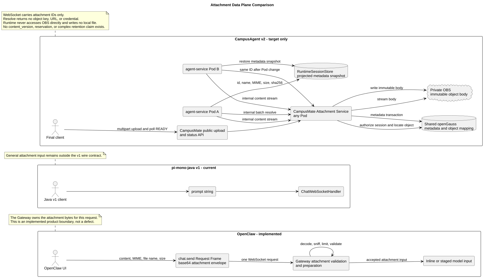

# OpenClaw 与 CampusAgent WebSocket 设计对比

## 1. 文档信息

| 项目 | 值 |
|---|---|
| 文档版本 | `1.11.0` |
| 状态 | 目标设计对比，CampusAgent v2 尚未实现 |
| 更新日期 | 2026-08-04 |
| OpenClaw 源码基线 | `b015925bc30f6a8363f290b07d5f8588e21422b8`，Gateway Protocol v4 |
| pi-mono-java 源码基线 | `1f7a5423219edfa4519d8719f1cc8a188ed72873` |
| CampusAgent 设计基线 | Manager 多 Agent 设计 `1.13.0` |
| 公共协议制品基线 | `mate-chat-ws-v2.asyncapi.yaml` `1.0.0`、公共客户端指南 `1.0.0` |
| 内部协议制品基线 | `chat-ws-v2.asyncapi.yaml` `2.11.0`、内部客户端指南 `1.7.0`、Frame 协议号 `2` |
| 本文范围 | OpenClaw Gateway、mate-service 公共 Chat WebSocket、agent-service 内部 Runtime WebSocket、命令、恢复与协议边界 |

本文使用三种状态，不能相互替代：

- **OpenClaw 已实现行为**：来自固定 OpenClaw commit 的源码和文档。
- **pi-mono-java v1 当前行为**：来自固定 Java commit 的代码和现有
  `docs/asyncapi/chat-ws.yaml`；代码和文档不一致处单独标出。
- **CampusMate + CampusAgent WebSocket 目标设计**：公共入口和内部 Runtime
  入口都是 target-only design，尚未落入 mate-service 或 pi-mono-java 实现。

## 2. 先给结论

OpenClaw 和 CampusMate/CampusAgent 两跳链路解决的是不同层级的问题：

- OpenClaw WebSocket 是通用 **Gateway 控制平面**。一条连接完成设备身份、
  角色、scope 和 capability 协商后，可以调用 Chat、Session、Node 以及其他
  Gateway 方法；Chat 请求通过 `sessionKey` 在每次调用时路由。
- `mate-service` 公共 WebSocket 是面向 Agent UI 的 **Chat-scoped 语义网关**。
  UI 连接 `wss://api.example.com/mate-service/v1/ws/chat`，新建时提交
  `agent_id + model_id + idempotency_key`，恢复时提交 `chat_id`。公共连接只披露
  `chat_id`，由 mate-service 承担用户鉴权、Chat 配额、护栏、意图识别、状态机、
  Chat 生命周期和 `chat_id -> session_id` 映射。
- CampusAgent v2 是 `agent-service` 对 mate-service 开放的 **Session-scoped
  Runtime 协议**。mate-service 连接
  `wss://agent-service.internal/agent-service/internal/v1/ws/chat`，内部
  `connect` 使用 `session_id + agent_id + model_id` 创建或恢复 Runtime
  Session；`chat_id` 永远不进入 Agent Runtime。
- pi-mono-java v1 也是“一条连接操作一个 Session”，但它通过 Upgrade query
  参数选择 `conversation_id`，没有 Agent 维度、协议协商、统一 Frame、
  跨连接 run 所有权和可靠恢复语义。

因此，Campus 系统应保留两个独立 WebSocket hop：公共连接由 `chat_id` 定位
Chat，内部连接由 `session_id` 定位 Runtime Session。两跳都可以借鉴 OpenClaw 的
`req/res/event` Frame、`traceparent`、有效 features、连接序列、run 序列、
幂等请求和权威状态恢复原则，但不复制 Gateway 多路复用、设备配对、累计
Message、慢消费者丢帧和节点控制体系。

CampusAgent Runtime 的核心身份仍限定为 `connection_id`、`session_id`、`agent_id`、
`model_id`、`message_id` 和 `run_id`。Request Frame `id` 与
`tool_call_id` 只是协议局部关联标识。`chat_id` 属于 mate-service，不是第七类
Runtime 身份；公共 `connection_id` 与内部 `connection_id` 也不是同一个值。

mate-service 必须解析、鉴权、编排并重新构造内部 RequestFrame，再把内部
Response/Event 投影为公共 Frame。它不是 WebSocket 字节隧道。两个 hop 分别完成
HTTP opening handshake 并分别取得 `101`；各自维护独立的 `connection_id`、
Request Frame `id`、Event `seq`、Ping/Pong、背压预算和 close 生命周期。

如果未来需要全局运维、多 Session 观察、节点控制或统一控制台，应新增独立的
`/agent-service/internal/v1/ws/gateway`，而不是放宽内部 Runtime Chat 协议的
身份和路由边界。

## 3. 源码与设计证据

### 3.1 OpenClaw：已实现

仓库和固定基线：

```text
repository: https://github.com/openclaw/openclaw
commit:     b015925bc30f6a8363f290b07d5f8588e21422b8
```

| 主题 | 固定源码证据 | 观察到的行为 |
|---|---|---|
| Gateway Protocol v4 | [`docs/gateway/protocol.md#L83-L168`](https://github.com/openclaw/openclaw/blob/b015925bc30f6a8363f290b07d5f8588e21422b8/docs/gateway/protocol.md#L83-L168) | 服务端先发 `connect.challenge`，客户端发 v4 `connect`，成功 Response payload 为 `hello-ok` |
| Frame 和追踪 | [`frames.ts#L12-L18`](https://github.com/openclaw/openclaw/blob/b015925bc30f6a8363f290b07d5f8588e21422b8/packages/gateway-protocol/src/schema/frames.ts#L12-L18)、[`#L156-L198`](https://github.com/openclaw/openclaw/blob/b015925bc30f6a8363f290b07d5f8588e21422b8/packages/gateway-protocol/src/schema/frames.ts#L156-L198) | 源码明确称其为 WebSocket envelope contracts；统一封闭 `req/res/event` Frame，Request Frame 可带 `traceparent` |
| 认证、设备与 features | [`frames.ts#L35-L145`](https://github.com/openclaw/openclaw/blob/b015925bc30f6a8363f290b07d5f8588e21422b8/packages/gateway-protocol/src/schema/frames.ts#L35-L145)、[`docs/gateway/clients.md#L45-L109`](https://github.com/openclaw/openclaw/blob/b015925bc30f6a8363f290b07d5f8588e21422b8/docs/gateway/clients.md#L45-L109) | connect 协商设备身份、role、scope 和客户端 caps；hello 返回 methods、events、capabilities、policy 和全局 snapshot |
| Chat 路由与幂等 | [`logs-chat.ts#L112-L158`](https://github.com/openclaw/openclaw/blob/b015925bc30f6a8363f290b07d5f8588e21422b8/packages/gateway-protocol/src/schema/logs-chat.ts#L112-L158) | `chat.send` 每次携带 `sessionKey` 和 `idempotencyKey`；活动 run 可使用 `queueMode` |
| 精确 Session 订阅 | [`protocol.md#L583-L588`](https://github.com/openclaw/openclaw/blob/b015925bc30f6a8363f290b07d5f8588e21422b8/docs/gateway/protocol.md#L583-L588) | 同一 Gateway 连接可用 `sessions.messages.subscribe` 精确订阅一个 Session 的消息和可选 Approval |
| Chat 事件 | [`logs-chat.ts#L161-L252`](https://github.com/openclaw/openclaw/blob/b015925bc30f6a8363f290b07d5f8588e21422b8/packages/gateway-protocol/src/schema/logs-chat.ts#L161-L252) | Chat 事件携带 `runId/sessionKey/seq`，区分 `status/delta/final/aborted/error` |
| delta 与 replace | [`logs-chat.ts#L193-L240`](https://github.com/openclaw/openclaw/blob/b015925bc30f6a8363f290b07d5f8588e21422b8/packages/gateway-protocol/src/schema/logs-chat.ts#L193-L240)、[`server-chat.ts#L278-L296`](https://github.com/openclaw/openclaw/blob/b015925bc30f6a8363f290b07d5f8588e21422b8/src/gateway/server-chat.ts#L278-L296)、[`#L922-L944`](https://github.com/openclaw/openclaw/blob/b015925bc30f6a8363f290b07d5f8588e21422b8/src/gateway/server-chat.ts#L922-L944)、[`client-info.ts#L80-L93`](https://github.com/openclaw/openclaw/blob/b015925bc30f6a8363f290b07d5f8588e21422b8/packages/gateway-protocol/src/client-info.ts#L80-L93) | Chat delta 是标准事件，不要求客户端 capability；正常前缀增长发送 `deltaText`，前缀不一致时发送 `replace`，并可带累计 `message` |
| Chat 附件 Frame | [`logs-chat.ts#L85-L102`](https://github.com/openclaw/openclaw/blob/b015925bc30f6a8363f290b07d5f8588e21422b8/packages/gateway-protocol/src/schema/logs-chat.ts#L85-L102)、[`attachment-api.ts#L5-L33`](https://github.com/openclaw/openclaw/blob/b015925bc30f6a8363f290b07d5f8588e21422b8/ui/src/pages/chat/attachment-api.ts#L5-L33)、[`chat-send-request.ts#L30-L46`](https://github.com/openclaw/openclaw/blob/b015925bc30f6a8363f290b07d5f8588e21422b8/ui/src/pages/chat/chat-send-request.ts#L30-L46) | UI 把 Data URL 转成 base64 attachment envelope，并随 `chat.send` Request Frame 内联发送 |
| 附件校验与 staging | [`attachment-normalize.ts#L18-L72`](https://github.com/openclaw/openclaw/blob/b015925bc30f6a8363f290b07d5f8588e21422b8/src/gateway/server-methods/attachment-normalize.ts#L18-L72)、[`chat-attachments.ts#L340-L478`](https://github.com/openclaw/openclaw/blob/b015925bc30f6a8363f290b07d5f8588e21422b8/src/gateway/chat-attachments.ts#L340-L478)、[`chat-send-attachments.ts#L182-L282`](https://github.com/openclaw/openclaw/blob/b015925bc30f6a8363f290b07d5f8588e21422b8/src/gateway/server-methods/chat-send-attachments.ts#L182-L282)、[`chat-send-handler.ts#L146-L169`](https://github.com/openclaw/openclaw/blob/b015925bc30f6a8363f290b07d5f8588e21422b8/src/gateway/server-methods/chat-send-handler.ts#L146-L169) | 服务端在 ACK 前验证 base64/实际字节、嗅探 MIME 和限制，再按类型内联小图片或 offload/stage；不是只信任客户端元数据 |
| Tool 事件投影 | [`chat-send-handler.ts#L482-L520`](https://github.com/openclaw/openclaw/blob/b015925bc30f6a8363f290b07d5f8588e21422b8/src/gateway/server-methods/chat-send-handler.ts#L482-L520)、[`server-chat.ts#L1478-L1532`](https://github.com/openclaw/openclaw/blob/b015925bc30f6a8363f290b07d5f8588e21422b8/src/gateway/server-chat.ts#L1478-L1532) | `tool-events` 注册 run-scoped agent Tool recipient；此外还存在面向 Session 订阅者的 `session.tool` 镜像 |
| 广播与背压 | [`server-broadcast.ts#L240-L340`](https://github.com/openclaw/openclaw/blob/b015925bc30f6a8363f290b07d5f8588e21422b8/src/gateway/server-broadcast.ts#L240-L340) | 每个客户端连接独立维护外层 `seq`，按 scope 和精确订阅过滤；慢消费者分支可丢弃 `dropIfSlow` 事件或关闭连接 |
| 重连恢复 | [`docs/gateway/clients.md#L111-L130`](https://github.com/openclaw/openclaw/blob/b015925bc30f6a8363f290b07d5f8588e21422b8/docs/gateway/clients.md#L111-L130) | 重连后重新订阅、读取 `chat.history`、采用 `inFlightRun`；连接或 run 序列缺口触发权威历史重载 |
| 客户端 Transport | [`types.ts#L20-L33`](https://github.com/openclaw/openclaw/blob/b015925bc30f6a8363f290b07d5f8588e21422b8/packages/sdk/src/types.ts#L20-L33)、[`transport.ts#L73-L174`](https://github.com/openclaw/openclaw/blob/b015925bc30f6a8363f290b07d5f8588e21422b8/packages/sdk/src/transport.ts#L73-L174)、[`client.ts#L342-L438`](https://github.com/openclaw/openclaw/blob/b015925bc30f6a8363f290b07d5f8588e21422b8/packages/sdk/src/client.ts#L342-L438) | SDK 依赖 `OpenClawTransport.request/events/close`，`GatewayClientTransport` 封装 WebSocket GatewayClient |
| 服务端解耦边界 | [`shared-types.ts#L110-L116`](https://github.com/openclaw/openclaw/blob/b015925bc30f6a8363f290b07d5f8588e21422b8/src/gateway/server-methods/shared-types.ts#L110-L116)、[`#L337-L353`](https://github.com/openclaw/openclaw/blob/b015925bc30f6a8363f290b07d5f8588e21422b8/src/gateway/server-methods/shared-types.ts#L337-L353)、[`ws-types.ts#L23-L26`](https://github.com/openclaw/openclaw/blob/b015925bc30f6a8363f290b07d5f8588e21422b8/src/gateway/server/ws-types.ts#L23-L26)、[`server-broadcast.ts#L293-L327`](https://github.com/openclaw/openclaw/blob/b015925bc30f6a8363f290b07d5f8588e21422b8/src/gateway/server-broadcast.ts#L293-L327) | Handler 通过 `RespondFn` 与 Frame 发送解耦，但 Gateway client state 和广播仍直接保存、操作 WebSocket |
| Schema 制品 | [`frames.ts#L185-L201`](https://github.com/openclaw/openclaw/blob/b015925bc30f6a8363f290b07d5f8588e21422b8/packages/gateway-protocol/src/schema/frames.ts#L185-L201) | TypeBox closed schema 同时形成运行时验证和 TypeScript 类型来源 |

“Gateway 多路复用”不等于“所有事件无差别发给所有连接”。OpenClaw
广播实现仍按 method、scope、capability、订阅和可见性过滤；这里比较的是
连接可以承载的控制面范围，而不是绕过授权的广播范围。

### 3.2 pi-mono-java v1：当前行为

仓库和固定基线：

```text
repository: https://github.com/superheromeZzh/pi-mono-java
commit:     1f7a5423219edfa4519d8719f1cc8a188ed72873
```

| 主题 | 固定源码证据 | 当前行为 |
|---|---|---|
| Upgrade 路由 | [`ServerMode.java#L377-L391`](https://github.com/superheromeZzh/pi-mono-java/blob/1f7a5423219edfa4519d8719f1cc8a188ed72873/modules/coding-agent-cli/src/main/java/com/campusclaw/codingagent/mode/server/ServerMode.java#L377-L391) | `/api/ws/chat` 从 query 读取 `conversation_id`，随即进入 handler |
| v1 协议文档 | [`docs/asyncapi/chat-ws.yaml#L1-L76`](https://github.com/superheromeZzh/pi-mono-java/blob/1f7a5423219edfa4519d8719f1cc8a188ed72873/docs/asyncapi/chat-ws.yaml#L1-L76)、[`#L170-L181`](https://github.com/superheromeZzh/pi-mono-java/blob/1f7a5423219edfa4519d8719f1cc8a188ed72873/docs/asyncapi/chat-ws.yaml#L170-L181) | AsyncAPI 记录 `conversation_id` 和 query `token` |
| 文档/实现偏差 | [`ServerMode.java#L377-L391`](https://github.com/superheromeZzh/pi-mono-java/blob/1f7a5423219edfa4519d8719f1cc8a188ed72873/modules/coding-agent-cli/src/main/java/com/campusclaw/codingagent/mode/server/ServerMode.java#L377-L391) | 该路由代码只提取 `conversation_id`，没有读取或验证文档中的 query `token`；本文不能把 v1 认证写成已实现 |
| Session 创建 | [`ChatWebSocketHandler.java#L115-L135`](https://github.com/superheromeZzh/pi-mono-java/blob/1f7a5423219edfa4519d8719f1cc8a188ed72873/modules/coding-agent-cli/src/main/java/com/campusclaw/codingagent/mode/server/ChatWebSocketHandler.java#L115-L135) | 建连时立即创建或恢复 Session，一条连接捕获一个 `AgentSession` |
| 命令 | [`ChatWebSocketHandler.java#L195-L227`](https://github.com/superheromeZzh/pi-mono-java/blob/1f7a5423219edfa4519d8719f1cc8a188ed72873/modules/coding-agent-cli/src/main/java/com/campusclaw/codingagent/mode/server/ChatWebSocketHandler.java#L195-L227) | 使用 `prompt/steer/abort/new_session/set_model/...`，没有统一 request ID 和 Frame |
| 活动 run | [`ChatWebSocketHandler.java#L252-L273`](https://github.com/superheromeZzh/pi-mono-java/blob/1f7a5423219edfa4519d8719f1cc8a188ed72873/modules/coding-agent-cli/src/main/java/com/campusclaw/codingagent/mode/server/ChatWebSocketHandler.java#L252-L273) | 正在流式输出时拒绝新的 `prompt`；`steer` 和 `abort` 为独立命令 |
| 附件输入 | [`ChatWebSocketHandler.java#L252-L273`](https://github.com/superheromeZzh/pi-mono-java/blob/1f7a5423219edfa4519d8719f1cc8a188ed72873/modules/coding-agent-cli/src/main/java/com/campusclaw/codingagent/mode/server/ChatWebSocketHandler.java#L252-L273)、[`ws-chat-followups.md#L12-L37`](https://github.com/superheromeZzh/pi-mono-java/blob/1f7a5423219edfa4519d8719f1cc8a188ed72873/docs/plans/ws-chat-followups.md#L12-L37)、[`ImageContent.java#L9-L18`](https://github.com/superheromeZzh/pi-mono-java/blob/1f7a5423219edfa4519d8719f1cc8a188ed72873/modules/ai/src/main/java/com/campusclaw/ai/types/ImageContent.java#L9-L18) | v1 prompt 只接收字符串；Java 内容模型可内联 base64 图片，但 WebSocket 通用附件仍被列为待设计项 |
| 累计更新 | [`ChatWebSocketHandler.java#L422-L459`](https://github.com/superheromeZzh/pi-mono-java/blob/1f7a5423219edfa4519d8719f1cc8a188ed72873/modules/coding-agent-cli/src/main/java/com/campusclaw/codingagent/mode/server/ChatWebSocketHandler.java#L422-L459)、[`chat-ws.yaml#L832-L840`](https://github.com/superheromeZzh/pi-mono-java/blob/1f7a5423219edfa4519d8719f1cc8a188ed72873/docs/asyncapi/chat-ws.yaml#L832-L840) | `message_update` 每次发送累计的完整 Message |
| Tool 事件 | [`ChatWebSocketHandler.java#L435-L486`](https://github.com/superheromeZzh/pi-mono-java/blob/1f7a5423219edfa4519d8719f1cc8a188ed72873/modules/coding-agent-cli/src/main/java/com/campusclaw/codingagent/mode/server/ChatWebSocketHandler.java#L435-L486) | 已有独立 `tool_start/tool_update/tool_end`，但使用 v1 特有字段和顶层事件格式 |
| 可利用的内部 delta | [`MessageUpdateEvent.java#L17-L20`](https://github.com/superheromeZzh/pi-mono-java/blob/1f7a5423219edfa4519d8719f1cc8a188ed72873/modules/agent-core/src/main/java/com/campusclaw/agent/event/MessageUpdateEvent.java#L17-L20)、[`AssistantMessageEvent.java#L44-L164`](https://github.com/superheromeZzh/pi-mono-java/blob/1f7a5423219edfa4519d8719f1cc8a188ed72873/modules/ai/src/main/java/com/campusclaw/ai/stream/AssistantMessageEvent.java#L44-L164) | Java 内部事件同时含累计 Message 和 `text/thinking/toolcall` 等细粒度事件，但 v1 WebSocket 未映射后者 |
| 断线语义 | [`ChatWebSocketHandler.java#L168-L188`](https://github.com/superheromeZzh/pi-mono-java/blob/1f7a5423219edfa4519d8719f1cc8a188ed72873/modules/coding-agent-cli/src/main/java/com/campusclaw/codingagent/mode/server/ChatWebSocketHandler.java#L168-L188) | 连接关闭会取消事件订阅，并在流式状态下调用 `AgentSession.abort()` |
| Pool 隔离键 | [`SessionPool.java#L61-L69`](https://github.com/superheromeZzh/pi-mono-java/blob/1f7a5423219edfa4519d8719f1cc8a188ed72873/modules/coding-agent-cli/src/main/java/com/campusclaw/codingagent/mode/server/SessionPool.java#L61-L69)、[`#L176-L202`](https://github.com/superheromeZzh/pi-mono-java/blob/1f7a5423219edfa4519d8719f1cc8a188ed72873/modules/coding-agent-cli/src/main/java/com/campusclaw/codingagent/mode/server/SessionPool.java#L176-L202) | 内存 Session 只按 `conversation_id` 索引，共享 `baseConfig/serverCwd` |
| 心跳 | [`ChatWebSocketHandler.java#L115-L135`](https://github.com/superheromeZzh/pi-mono-java/blob/1f7a5423219edfa4519d8719f1cc8a188ed72873/modules/coding-agent-cli/src/main/java/com/campusclaw/codingagent/mode/server/ChatWebSocketHandler.java#L115-L135) | 发送应用层 JSON `pong`，不是原生 WebSocket Ping/Pong |

### 3.3 CampusAgent v2：目标设计

CampusAgent v2 尚未实现；本节描述的全部行为都是目标设计。其规范来源是以下
仓库内制品：

- [Manager 驱动的多 Agent 运行设计 1.13.0](../pi-mono-java-manager-driven-multi-agent-runtime/README.md)
- [CampusAgent 内部 Runtime WebSocket AsyncAPI 2.11.0](../pi-mono-java-manager-driven-multi-agent-runtime/chat-ws-v2.asyncapi.yaml)
- [CampusAgent 内部 Runtime WebSocket 客户端指南 1.7.0](../pi-mono-java-manager-driven-multi-agent-runtime/chat-ws-v2-client-integration.md)
- [CampusMate 公共 Chat WebSocket AsyncAPI 1.0.0](../pi-mono-java-manager-driven-multi-agent-runtime/mate-chat-ws-v2.asyncapi.yaml)
  与[公共客户端指南 1.0.0](../pi-mono-java-manager-driven-multi-agent-runtime/mate-chat-ws-v2-client-integration.md)；
- [CampusMate Attachment Service：OBS + openGauss 设计 2.0.0](../campusmate-attachment-service/README.md)

这一部分是 **target-only design**，不是 pi-mono-java 当前行为。相对 Java
v1 的改变属于架构改造和安全加固；相对 OpenClaw 的差异主要属于产品约束。
目标 Managed Profile 从 Agent 运行目录的 `.campusagent/SYSTEM.md` 与
`.campusagent/skills/` 装载上下文；固定 pi-mono-java 基线中的
`.campusclaw`、`com/campusclaw` 和 `/api/ws/chat` 只用于记录当前源码事实，
不代表目标名称或目标路由。

### 3.4 公共和内部 WebSocket 的目标边界

公共入口与内部入口均为 **target-only design**；固定 Java 基线没有
mate-service 公共 WebSocket、`chat_id`、两跳桥接或 Session 亲和元数据：

| 边界 | mate-service 公共 Chat WebSocket | agent-service 内部 Runtime WebSocket |
|---|---|---|
| URL | `wss://api.example.com/mate-service/v1/ws/chat` | `wss://agent-service.internal/agent-service/internal/v1/ws/chat` |
| 调用方 | Agent UI | mate-service |
| 作用域 | 一条连接绑定一个 `chat_id` | 一条连接绑定一个 `session_id` |
| create | UI 提交 `agent_id + model_id + idempotency_key`；mate-service 生成 `chat_id` 和 `session_id` | mate-service 提交 `session_id + agent_id + model_id` |
| resume | UI 只提交 `chat_id` | mate-service 从映射取回 `session_id` 后提交内部 resume |
| 权威存储 | Chat、用户归属、数量限制、`chat_id -> session_id`、公共幂等结果 | Runtime Session、Message、RunRecord、revision 和内部幂等结果 |
| 禁止披露 | 公共 Frame 不出现 `session_id` 或内部连接身份 | Runtime Frame、Pool 和 Store 不出现 `chat_id` |

mate-service 可以让两个协议共享概念和 reducer，但必须终止公共连接语义并创建
新的内部连接语义。它对每个公共 RequestFrame 做用户/Chat 鉴权、护栏、意图和
状态机处理，然后用新的内部 request `id` 重建 Frame；内部 EventFrame 再用新的
公共 `seq` 投影。任何一跳断开都不等于另一跳断开，更不等于 `chat.abort`。
公共 URL 固定是 Agent Channel：只有选择 Runtime 路径的 `chat.send`
才会被接受并返回 run。其他产品分支在接受前返回
`CHANNEL_NOT_APPLICABLE`，不生成 Message/run/Event；mate-service 自行完成的成功
业务回复使用其他 Channel 契约。

多副本目标使用由 mate-service 根据映射注入、由可信内部网关校验的 Session
亲和元数据，把相同 `session_id` 尽量路由到原 agent-service Pod。该元数据不是
公开 Header、Bearer capability 或分布式 owner；路由失败或 Pod 丢失时仍不承诺
跨 Pod 继续 active run，只能从 RuntimeSessionStore 恢复并标记旧 run
`interrupted`。

### 3.5 Agent 与 Model 资源 ID 的三态边界

| 状态 | 资源 ID 行为 | 结论 |
|---|---|---|
| OpenClaw 已实现 | OpenClaw 使用自己的 `agentId`、`sessionKey` 等 Gateway 路由字段，不定义 CampusAgent 的 `agent_id/model_id` 资源格式 | OpenClaw 的路由机制不能作为 Campus 资源 ID 契约 |
| pi-mono-java v1 当前 | WebSocket Upgrade 只按 `conversation_id` 选择 Session，连接协议没有 `agent_id/model_id` 路由 | v1 没有可沿用的 Agent/Model 资源 ID 校验规则 |
| CampusAgent v2 目标 | `agent_id` 必须匹配 `^agent_[0-9A-Za-z]{24}$`，`model_id` 必须匹配 `^model_[0-9A-Za-z]{24}$`；二者总长均为 30、大小写敏感、服务端签发且按 opaque string 使用 | Adapter 只校验格式，Manager 按完整 ID 解析与授权；客户端和 Runtime 不解析后缀、不改写大小写，也不从后缀推断顺序或归属 |

`agent_...` 的可见形态参考
[Anthropic Managed Agents Create Agent API](https://platform.claude.com/docs/en/api/beta/agents/create)
的响应示例与
[官方 TypeScript SDK 固定源码](https://github.com/anthropics/anthropic-sdk-typescript/blob/3b45cd3b69c956ac63384fdb09ce1d8109f3fa80/src/resources/beta/agents/agents.ts#L14-L155)，
但官方公开类型只约束为字符串；上述精确正则、长度和 opaque 语义是
CampusAgent 的目标协议决定，不应表述为 Anthropic 已公开保证的生成规则。
`model_...` 是 CampusModel / `model-service` 资源 ID 的架构决定；它不是
Anthropic 模型 ID 规则，也不能用 `claude-*` 等 Provider model identifier
替代。Model Manager 负责把 `model_id` 映射到具体 Provider 模型。

## 4. 三类设计的连接作用域


[PlantUML 源码：`websocket_connection_scope_comparison`](diagram.puml#L1)

### 4.1 OpenClaw：Gateway-scoped

连接首先代表“某个已认证 Gateway 客户端”，而不是某个 Chat Session。
`chat.send`、`chat.history`、`chat.abort` 都通过请求中的 `sessionKey` 路由，
其他 Gateway 方法还可管理 Session、Node、配置和状态。这个边界适合：

- 单一控制台同时观察或操作多个 Session；
- 桌面端、移动端、节点和自动化客户端共享一个控制面；
- 以设备身份、role、scope、capability 管理不同客户端能力。

代价是每个请求和事件都必须带足路由信息，服务端必须在方法级和资源级重复
授权，客户端也要正确处理不同 Session 的事件交错。

### 4.2 pi-mono-java v1：连接捕获 Session

v1 建连时根据 `conversation_id` 得到 `AgentSession`，handler 在该连接生命周期
内持有它。它看起来也是 Session-scoped，但缺少以下约束：

- Session 记录没有不可变 `agent_id` 绑定，且所有 Session 共享 base cwd，无法
  形成多 Agent 运行隔离；
- `new_session` 可在同一连接内替换 Session，连接身份并非不可变；
- 模型可在连接内改变，却没有 Manager 的 Agent-model 授权；
- run 隶属于连接，断线会 abort；
- 没有重连快照、序列和缺口恢复契约。

### 4.3 Campus 目标：公共 Chat-scoped，内部 Session-scoped

Agent UI 只连接 `mate-service` 公共入口。公共 `connect(mode=create)` 成功后，
连接固定绑定 mate-service 生成的 `chat_id`；公共
`connect(mode=resume)` 只使用已有 `chat_id`。UI 不生成、不保存也不接收
`session_id`。

mate-service 为该 Chat 生成或查回全局唯一 `session_id`，再通过内部 WebSocket
连接 agent-service。内部 `connect` 成功后固定绑定该 `session_id` 及其不可变
`agent_id`；agent-service 不接收 `chat_id`、最终用户身份或 Chat 数量规则。
内部完整作用域为：

```text
authenticated calling service
  + session_id supplied by the upstream service
  + agent_id
  + effective model_id
  + thinking disclosure ceiling
  = immutable connection scope
```

内部后续 `chat.send/steer/abort/history` 不再接受 Agent 或 Session 路由字段。
agent-service 从内部连接上下文得到作用域，避免 mate-service 在每帧重新声明
目标。同一 Pod 内每个 Runtime Session
只有一个活动读写连接；新的 `mode=resume` 增加 connection generation、接管
Session，并以私有关闭语义 `4409 SESSION_REPLACED` 关闭旧连接，不提供观察连接。

这是 ToB Agent Runtime 的产品约束和安全加固：Agent 权限、模型、Tool 权限、
thinking 披露和审计天然落在同一个固定 Runtime 边界内。`mate-service` 负责用户鉴权、
tenant/user 归属、Chat 列表、最多 50 个等产品规则、附件归属、护栏、意图、
状态机以及业务删除；
CampusAgent 只认证调用服务，以全局唯一 `session_id` 作为 Session key，并负责
Runtime 上下文和 run。`RuntimeSessionStore` 把 Session、Message、RunRecord、
`history_seq`、幂等结果、Agent/Model/bundle revision 与 AttachmentContent 元数据
快照持久化到数据库，不保存附件正文或 OBS 定位，也不生成 Session JSONL；本文
只定义逻辑记录和恢复语义，物理表结构另行设计。

多副本目标由 mate-service 根据权威映射向可信内部网关提交受保护的 Session
亲和元数据，网关据此把同一 `session_id` 尽量路由到原 Pod。该元数据不得由 UI
提供或覆盖，也不是跨 Pod owner。不引入 Redis owner、跨 Pod转发或分布式
active-run lease；亲和失效或 Pod 重启时，active run 仍不能跨 Pod 继续。

## 5. 统一对比矩阵

| 维度 | OpenClaw 已实现 | pi-mono-java v1 当前 | CampusMate + CampusAgent 两跳目标 | 设计原因、收益与代价 |
|---|---|---|---|---|
| 核心定位 | 通用 Gateway 控制平面和节点传输 | Chat 服务端模式 | mate-service 是面向 UI 的 Chat 语义网关；agent-service 是面向 mate-service 的 Runtime Session 执行协议 | 原因：按产品会话与 Runtime 执行分责；收益：用户策略不侵入 Runtime；代价：必须维护两跳协议和桥接状态 |
| 连接作用域 | 一条连接可调用多个 Session 和控制面能力 | 一条连接持有一个 `AgentSession`，但可 `new_session` | 公共连接固定 `chat_id`，内部连接固定 `session_id`；二者不复用连接身份 | 原因：固定各自审计和权限边界；收益：UI 不接触 Runtime ID；代价：mate-service 必须维护映射和内部连接 |
| 多副本路由 | Gateway 自身维护连接、订阅与 Session 路由 | 未定义分布式 owner | mate-service 从权威映射取得 `session_id`，以受保护的 Session 亲和元数据请求内部网关路由；无分布式 run owner 或跨 Pod continuation。附件仍由共享 openGauss + OBS 跨 Pod 读取 | 原因：区分路由提示、active run 所有权与附件可达性；收益：路由依据来自权威映射；代价：亲和失效或 Pod 重启仍中断 active run |
| Upgrade 输入 | 建立 WebSocket 后进行 challenge/connect | query `conversation_id`；AsyncAPI 还声明 query `token` | UI 对公共 URL 完成一次 Upgrade；mate-service 对内部 URL 独立完成第二次 Upgrade；两端都不收业务 query 或 URL token | 原因：传输握手与应用绑定分层；收益：每跳独立认证和流控；代价：mate-service 管理两个连接状态机 |
| 认证 | connect 内认证、设备签名/配对、role/scope | 基线路由没有实现文档所述 query token 校验 | 公共 `101` 前认证最终用户；内部 `101` 前认证 mate-service，Runtime 不接收 tenant/user 身份 | 原因：按服务所有权建立信任；收益：Runtime 不重复用户体系；代价：mate-service 成为用户授权责任边界 |
| 握手 | HTTP/WebSocket 建立后：`connect.challenge` → `connect` → `hello-ok` | 没有协议首帧，Upgrade 后直接处理命令 | 公共和内部各自 `GET Upgrade -> 101 -> connect -> ResponseFrame`；公共成功必须等待内部 create/resume 成功 | 原因：分别建立 Chat 与 Runtime 语义；收益：失败边界可定位；代价：公共 connect 延迟包含内部建连 |
| 版本协商 | `minProtocol/maxProtocol`，基线协议 v4 | 无 | 两个 URL 都使用服务 API `/v1`；公共与内部各自协商自己的 Frame 协议，不因字段相似而共享连接状态 | 原因：服务版本和线协议独立演进；收益：可以分别兼容；代价：桥接层必须显式做版本转换 |
| capability 与 features | 客户端声明可选 caps；Chat delta 不依赖 capability；`hello-ok.features` 返回可用 methods/events/capabilities | 无 | typed structured delta 是协议 2 固有语义；capability 只表达 `full_thinking` 等可选增强；methods 可过滤但必须保留 `chat.history`，八类 Chat events 是不可拆分的固定集合 | 原因：恢复依赖权威历史和完整终态；收益：普通客户端无需声明自然流式能力，且始终能恢复并判定 Message/run 终态；代价：无历史权限的调用服务不能建立 Chat 连接 |
| Frame | 封闭 `req/res/event`；成功 Response 使用 `payload` | 按命令 `type` 分发；支持可选 `id` 和 `response`，但没有统一 Frame | 封闭 `req/res/event`；成功 Response 使用 `payload`，错误使用 `error` | 原因：连接内存在并发命令和异步事件；收益：统一响应关联、超时、重试和 SDK 生成；代价：需要统一 dispatcher 和 schema validator |
| 追踪上下文 | Request Frame 可带 `traceparent` | 无协议字段 | 可选 `traceparent` 通过 W3C 校验并传给 Model/Tool Manager，只用于遥测 | 原因：跨 Manager 调用需要关联追踪；收益：无需污染业务载荷；代价：必须隔离 Prompt、数据库、事件和凭据日志 |
| Agent 路由 | 请求/Session 数据可带 `agentId`，但不定义 Campus `agent_id` 格式 | 无 `agent_id` | 公共 create 提交 `agent_id`；mate-service 做产品可用性检查，内部 create 仍由 Agent Manager 最终校验并形成不可变绑定 | 原因：上游预检不能代替 Runtime 授权；收益：错误更早且不削弱安全；代价：可能有两次查询 |
| Chat/Session 路由 | Chat 请求和事件携带 `sessionKey` | Upgrade query 选择 `conversation_id` | UI create 不提交 ID，mate-service 生成 `chat_id/session_id`；公共 resume 只提交 `chat_id`，内部 create/resume 只提交映射得到的 `session_id` | 原因：两个服务拥有不同会话概念；收益：公共 API 语义清楚；代价：映射必须持久、不可串用且可恢复 |
| Model 路由 | 由 Gateway/Session 配置体系决定，不定义 Campus `model_id` 格式 | `set_model` 直接作用于 Session | `mode=create` 必填匹配 `^model_[0-9A-Za-z]{24}$` 的 `model_id`；resume 可沿用，切换须 Manager 校验 | 原因：Agent-model allowlist 必须服务端权威；收益：避免未授权模型；代价：增加 Manager 延迟和可用性依赖 |
| 发送 | `chat.send` + `idempotencyKey` | `prompt`，无请求幂等键 | 公共 URL 是 Agent Channel；选择 Runtime 的 `chat.send` 接受文本、附件或二者，返回 `run_id + user_message_id`，成功 Response 先于因果 run 事件；非 Agent 路径在接受前返回 `CHANNEL_NOT_APPLICABLE` | 原因：网络失败和乐观消息结果可能未知，同时不能伪造 Runtime run；收益：安全重试、文件原生输入并对齐权威用户消息；代价：其他产品 Channel 需要自己的成功契约 |
| steer | `chat.send.queueMode="steer"` 等队列模式 | 独立 `steer` | `chat.steer(run_id)` v1 仅支持文本，活动 run 期间不接收新附件 | 原因：显式限定当前 run 并保持附件接受原子性；收益：命令意图和审计更清晰；代价：附件必须等当前 run 结束后另发 `chat.send` |
| abort | `chat.abort(sessionKey, runId?)` | `abort` 当前 Session | `chat.abort(run_id)`，重复调用幂等 | 原因：避免误终止其他 run；收益：重复请求结果稳定；代价：要保留可查询的 run 终态 |
| history | `chat.history(sessionKey)` | `get_history` | `chat.history` 从数据库游标分页返回按 history_seq 排序的 Message 与 RunRecord | 原因：恢复必须有权威 Message 和 run 终态；收益：离线完成后仍能恢复 outcome/usage/error；代价：需要分页、投影和一致性读取 |
| active run | `queueMode` 可决定活动 run 时行为 | streaming 时拒绝新 `prompt` | 同一 Session 一个主 run，重复 send 返回 `RUN_ACTIVE` | 原因：选择可预测的串行主 run；收益：状态和资源上限简单；代价：复杂排队需由更高层实现 |
| delta | 标准 Chat 事件，无需 capability；`deltaText` 可附累计 `message`，前缀异常用 `replace` | `message_update` 每次完整累计 Message | 协议 2 固有的 `message.updated.update`，只含本次 typed delta | 原因：自然语言流式输出是协议基线并复用 Java 内部细粒度事件；收益：无需虚假协商、降低带宽并保留内容类型；代价：客户端必须实现 reducer |
| 完整 Message | delta 中可选，final 中可选，history 权威 | 每次更新都携带 | 仅 `message.completed`、active snapshot 和 history | 原因：分开增量与快照职责；收益：避免累计对象的 O(n²) 传输；代价：客户端在完成前要维护 partial Message |
| thinking | Chat 请求可传 thinking，事件投影受 Gateway 能力约束 | 累计 Message 跟随当前对象 | `hidden/full`，只控制 reasoning content 可见性，实时/恢复/历史一致；被抑制更新使用 `thinking_redacted` | 原因：当前 Model Manager 只提供原始 reasoning content，summary 需要独立的生成与安全设计；收益：第一版可实现边界清晰；代价：hidden 仍会泄露被抹除更新的数量与时序元数据 |
| Tool 生命周期 | `tool-events` 控制 run-scoped `agent/stream=tool` 投影；显式 Session 订阅还可收到独立 `session.tool` 镜像 | 已有 `tool_start/tool_update/tool_end` 独立事件 | `tool.started/updated/completed` 返回脱敏后的业务 parameters/result；超限结果改为截断预览、原始大小和不透明 `result_ref` | 原因：统一生命周期并隔离凭据、内部 Header 与执行秘密；收益：客户端可观察且 Frame 有界；代价：v1 不提供 `result_ref` 读取接口 |
| 连接序列 | 每客户端外层 `seq`，重连重置 | 无 | 公共和内部连接各自维护 `seq`，mate-service 重新编号而非透传 | 原因：每跳都有独立丢帧和背压；收益：缺口归属明确；代价：不能比较两跳 seq |
| run 序列 | Chat/agent 事件含 run 内 `seq` | 无 | canonical `run_seq` 跨重连连续，thinking 投影不改变事件基数 | 原因：active run 要跨连接和多投影恢复；收益：可去重和精确排序；代价：被抑制 thinking 也要发送 redacted 占位 |
| 序列缺口 | 重连或重载 `chat.history`；部分慢事件允许显式形成缺口 | 无协议行为 | 不静默丢 delta；关闭 1013，重连取原子快照 | 原因：优先保证单 Session Chat 输出完整；收益：不会悄悄缺字；代价：慢客户端承担断线和恢复 |
| run 所有权 | Gateway 暴露 `inFlightRun` 并指导客户端恢复 | WebSocket close 时 abort | 当前 Pod 的 Pool/Hub 持有 active run；连接只是唯一活动订阅者，普通断线不 abort | 原因：网络生命周期不应定义模型生命周期；收益：同 Pod 网络抖动不终止 run；代价：不保证跨 Pod active continuation |
| 恢复 | 重新订阅、history、in-flight 状态、序列对账 | 仅可恢复已写历史，活动 run 已被 abort | 公共 resume 用 `chat_id` 重建公共投影；mate-service 由映射取 `session_id`，复用健康内部连接或独立执行内部 resume。Pod 丢失仍以 `interrupted` 收束 | 原因：两跳故障独立；收益：公共重连不必总是重启 Runtime；代价：桥接层要维护恢复状态机 |
| 帧与背压 | hello policy 给限制；广播有 slow-consumer 分支 | v1 无规范化上限和恢复契约 | 公共和内部各自设置帧与缓冲上限；一跳 1013 只关闭该 hop，mate-service 通过权威状态恢复后再继续投影 | 原因：每条物理连接资源必须有界；收益：慢 UI 不直接阻塞 Runtime；代价：桥接需要有界缓冲和恢复 |
| 心跳 | Gateway policy 和客户端协议支持连接保活 | 应用层 JSON `pong` | 两跳分别使用原生 Ping/Pong，不转发 Ping/Pong | 原因：心跳属于物理连接；收益：可独立检测故障；代价：mate-service 同时维护两套定时器 |
| 附件 | Request Frame 内联 base64 attachment envelope；服务端在 ACK 前验证实际字节/MIME/限制并 stage/offload | v1 prompt 只接收字符串；通用附件输入仍是 follow-up | 公共 HTTP 以 `chat_id` 上传和管理文件，mate-service 映射到内部 `session_id`；WS 只传 `attachment_id`，Runtime 只调用内部 batch resolve 和 content 流，不直连 OBS 或落本地文件 | 原因：agent-service 不拥有用户文件数据面；收益：公共 API 不泄露 Runtime ID，且大对象、扫描、授权、跨 Pod 读取和 Chat 背压解耦；代价：多一个上传/READY 阶段并依赖 CampusMate 内部接口 |
| 权限与审计 | role/scope/capability + session visibility | 没有 Agent 维度的协议授权 | mate-service 认证用户并授权 `chat_id`；agent-service 认证 mate-service 并授权 `session_id/agent/model/tool`。凭据和内部 ID 均不跨边界披露 | 原因：按所有权拆分授权；收益：Runtime 不复制用户体系；代价：两层审计需要 trace 关联 |
| Transport 依赖方向 | SDK 客户端依赖 `OpenClawTransport`；服务端 handler 已抽象 `RespondFn`，但连接状态和广播仍直接依赖 WebSocket | `ChatWebSocketHandler` 直接拥有 Session、订阅和断线 abort | mate-service 以语义网关组合公共 Transport 和内部 Runtime client；agent-service 的 `ChatWebSocketAdapter` 依赖 `SessionTransport` | 原因：字节转发不能承载鉴权、状态机或恢复；收益：两边可独立测试演进；代价：需要显式 Frame 投影与关联表 |
| 协议制品 | TypeBox → 运行时校验、类型和协议 Schema | AsyncAPI 1.0 文档与 Java 手写处理存在偏差 | 公共 AsyncAPI 1.0.0 与内部 AsyncAPI 2.11.0 分别规范，不能用一个 Schema 同时代表两跳 | 原因：两个所有权边界不同；收益：前端和 Runtime 调用方都能独立实现；代价：桥接契约需双向测试 |

## 6. 握手、认证和能力协商


[PlantUML 源码：`websocket_handshake_comparison`](diagram.puml#L99)

### 6.1 OpenClaw：challenge 验证设备身份

OpenClaw 在 WebSocket 建立后先发送 `connect.challenge`。客户端收到 nonce
后提交设备身份、签名、role、scope 和 capability；Gateway 验证成功后返回
`hello-ok`，失败则拒绝应用连接。这套流程面向范围广泛的客户端和节点，解决：

- “这个连接是哪台已配对设备”的持续身份；
- operator 与 node 等角色的不同能力；
- 单 Gateway 控制面上的方法级授权；
- 本地、远程、桌面和节点客户端之间的统一接入。

这套体系是 Gateway 产品模型的组成部分，不是所有 WebSocket Chat 都必须复制
的通用规范。

### 6.2 Campus 两跳目标：两次 Upgrade、两个 connect

Agent UI 使用：

```text
wss://api.example.com/mate-service/v1/ws/chat
```

客户端库先建立 TCP/TLS，再对 `/mate-service/v1/ws/chat` 执行 HTTP opening
handshake。mate-service 在返回公共 `101` 前完成最终用户认证、Origin 和入口策略
校验；收到 `101` 后，公共 WebSocket 才建立。第一个公共 Text Frame 是：

- 新建：`connect(mode=create, agent_id, model_id, idempotency_key)`；
- 恢复：`connect(mode=resume, chat_id)`。

新建时，mate-service 查询公共 connect 幂等结果、执行 Chat 数量与产品可用性
检查，生成 `chat_id` 和内部 `session_id`，并保存 `chat_id -> session_id` 的
`CREATING` 映射。恢复时，它先按用户权限读取已有映射。公共成功响应只返回
`chat_id` 和公共 `connection_id`，绝不返回 `session_id`。

随后，mate-service 作为新的 WebSocket 客户端使用：

```text
wss://agent-service.internal/agent-service/internal/v1/ws/chat
```

它独立建立另一条 TCP/TLS 连接，对
`/agent-service/internal/v1/ws/chat` 执行第二次 HTTP opening handshake。可信
内部网关在返回内部 `101` 前认证 mate-service，并校验由 mate-service 根据权威
映射产生的 Session 亲和元数据；UI 不能提交或覆盖该元数据。第二个 `101` 只建立
内部 WebSocket，之后 mate-service 再发送内部首帧：

- 新建：`connect(mode=create, session_id, agent_id, model_id)`；
- 恢复：`connect(mode=resume, session_id, agent_id, model_id?)`。

agent-service 仍须通过 Agent/Model Manager 完成最终绑定和授权；mate-service 的
产品预检不能替代 Runtime 校验。内部 connect 成功后，mate-service 才把映射改为
`ACTIVE`、保存公共幂等结果并返回公共 connect 成功。内部失败不能伪装成公共
成功。

两个 hop 都遵循“HTTP `101` 建立传输，应用 `connect` 绑定语义”的分层，但它们
是两条完全独立的物理和协议连接：

| 状态 | 公共 UI ↔ mate-service | 内部 mate-service ↔ agent-service |
|---|---|---|
| URL 与 `101` | 公共 URL，公共 `101` | 内部 URL，内部 `101` |
| 作用域 | `chat_id` | `session_id` |
| `connection_id` | mate-service 生成 | agent-service 生成，不向 UI 透出 |
| Request Frame `id` | UI 与 mate-service 关联 | mate-service 新生成，不沿用公共值 |
| Event `seq` | mate-service 重新编号 | agent-service 自己编号 |
| Ping/Pong、背压、close | 公共连接独立处理 | 内部连接独立处理 |

因此，mate-service 是语义网关而不是字节隧道：它必须解析公共 Frame，执行用户与
Chat 鉴权、护栏、意图识别、会话管理和状态机，再构造新的内部 RequestFrame；
返回方向同样需要把 Runtime Response/Event 投影为公共 Frame。公共断线不自动
关闭内部连接，内部断线也不自动关闭公共连接；任何传输 close 都不等于
`chat.abort`。

私钥、JWT、内部 access-token、Session 亲和元数据和 `session_id` 不进入公共
Frame、Prompt 或业务日志。`chat_id` 不进入内部 Frame、RuntimeSessionStore、
SessionPool 或 Manager 调用。Session 亲和只是可信路由提示，不是分布式 owner；
亲和失效或 Pod 重启后仍不能跨 Pod 继续原 active run。

### 6.3 pi-mono-java v1：query token 仅存在于文档

固定基线的 AsyncAPI 声明了 query `token`，但 `ServerMode` Upgrade 路由只
读取 `conversation_id`，没有提取或验证 token。因此，v1 不能被视为已经实现
Upgrade 认证，v2 也不能复用一个并不存在的认证实现。

## 7. 命令、并发与响应关联

### 7.1 OpenClaw

OpenClaw 的请求在每帧携带 method 和参数，响应按 request `id` 关联。Chat
请求同时携带 `sessionKey`。`chat.send` 使用 `idempotencyKey`，活动 run 上的
输入可以通过 `queueMode=steer/followup/collect/interrupt` 表达不同队列语义。

这是通用控制面的合理选择：一个连接可并发调用不同方法和不同 Session。
相应代价是路由、权限与幂等必须由每个方法正确执行。

### 7.2 pi-mono-java v1

v1 依据顶层 `type` 分支执行命令。命令可带 `id`，服务端会返回同 `id` 的
`response`，所以它已经具备基础响应关联；但命令、响应和异步事件没有统一
`req/res/event` Frame，错误还是人类可读字符串，也没有稳定错误码和请求
幂等语义。`new_session` 还会在连接内改变当前会话。这对单页原型足够直接，
但不适合 SDK 并发治理、可重试副作用命令和稳定错误处理。

### 7.3 Campus 两跳目标

公共和内部协议都使用同一种 Frame 外形，但分别按自己的 AsyncAPI 校验，不能把
公共 Frame 原样转发到内部。任一 hop 收到 RequestFrame 后都先按封闭 Schema
校验顶层字段，再返回唯一关联的 ResponseFrame；模型和 Tool 的异步输出通过
EventFrame 投影。未知字段返回 `INVALID_REQUEST`。两跳固定三种 Frame 和一种
错误结构：

```text
RequestFrame  = {type:"req", id, method, params?, traceparent?}
ResponseFrame = {type:"res", id, ok, payload? | error?}
EventFrame    = {type:"event", event, seq, payload}
Error         = {code, message, details?, retryable?, retry_after_ms?}
```

三种顶层对象都封闭，未知字段直接返回 `INVALID_REQUEST`；成功响应只使用
`payload`，错误响应只使用 `error`。`traceparent` 最长 128 字符，必须通过
W3C Trace Context 解析。mate-service 为内部请求建立关联 span，agent-service
再把解析后的不可变上下文传播到 Model Manager 和 Tool Manager；追踪字段不写入
Prompt、数据库、业务事件或凭据日志。

连接内命令固定为：

- `chat.send`
- `chat.steer`
- `chat.abort`
- `chat.history`
- `session.get`
- `models.list`
- `model.set`
- `thinking.set`

同一 Chat 映射的 Runtime Session 只允许一个主 run。活动期间再次 `chat.send` 返回
`RUN_ACTIVE`，`model.set` 和 `thinking.set` 也拒绝；`chat.steer` 必须指定
当前 `run_id` 且 v1 只接受文本，`chat.abort` 对重复调用保持幂等。所有改变
Session/run 状态的成功 ResponseFrame 必须先于该请求产生的 EventFrame 写出，
客户端因而能先登记 `run_id` 再消费 `run.started`。

`chat.send` 可以提交非空文字、非空 `attachment_ids`，或二者同时提交；二者
不能同时为空。只有附件时不生成隐藏默认 Prompt。权威 User Message 只允许
纯文本、纯附件、文本后按请求顺序排列附件三种内容形态。`prompt_templates.list`
和 `skills.list` 不属于 WebSocket v1；`/skill:name` 仍作为普通消息文本由
AgentSession 展开，Skill 展示信息由 `mate-service` 或元数据 REST API 提供。
该选择放弃 OpenClaw 的多种队列模式，换取服务到服务 Chat 更容易解释和审计的
并发规则。

## 8. 流式事件与消息语义

### 8.1 OpenClaw 的兼容型 delta

OpenClaw Chat `delta` 同时提供三种客户端可利用的信息：

- `deltaText`：相对上一可见文本的新后缀；
- `message`：可选的累计 Message；
- `replace=true`：服务端发现新文本不是旧文本前缀时，要求客户端用新值替换。

这种设计能兼容逐步演进的客户端，也能处理模型输出被重写的情况。代价是
delta 和累计快照可能同时存在，客户端必须实现清晰的优先级。

### 8.2 Java v1：每次更新重传累计 Message

Java v1 每次发送 `message_update` 时都会重传截至当前的完整 Message。回答
长度为 `n` 时，总传输量最坏趋近 O(n²)，客户端必须从完整对象中差分文本和
thinking 增量；Tool 生命周期另有 v1 独立事件，但 Message 内容本身仍按累计
对象传输。原因是 Java 内部 `MessageUpdateEvent` 同时保存累计
`AssistantMessage` 和细粒度 `AssistantMessageEvent`，而 v1 handler 选择前者
映射为 `message_update.message`。这种格式不是 WebSocket 规范违规，但效率低。

### 8.3 Campus 两跳目标的 typed delta

内部 Runtime 协议把 typed delta 固定为协议 2 的基础语义，公共 Chat 协议按同一
事件家族投影，不要求客户端声明 capability。每次 `message.updated` 只发送本次
typed delta；完整 Message 只在完成、恢复快照和历史读取时返回。每个 hop 的
客户端都按 `message_id + content_index` 合并增量，并在终态用完整 Message
对账。事件族为：

```text
run.started
message.started
message.updated
tool.started
tool.updated
tool.completed
message.completed
run.completed
```

`message.updated.payload.update` 直接映射 Java 已有
`AssistantMessageEvent`：

```text
text_start / text_delta / text_end
thinking_start / thinking_delta / thinking_redacted / thinking_end
toolcall_start / toolcall_delta / toolcall_end
```

内部更新携带 `agent_id`、`session_id`、`run_id`、`message_id`、`run_seq`、
`content_index` 和时间戳；公共投影把作用域字段改为 `chat_id`，绝不携带
`session_id`，并使用新的公共 EventFrame `seq`。`run_id/message_id/run_seq`
可以作为经过校验的业务关联字段投影，但 hop-local `connection_id/request id/seq`
不得复用。delta 只携带本次变化；完整 Message 只出现在
`message.completed`、重连 active-run snapshot 和 `chat.history`。
canonical thinking 内容被某连接的披露策略抑制时，该连接仍收到
不含内容的 `thinking_redacted`，使 `run_seq` 不因 full/hidden 投影
产生假缺口。hidden 终态 Message 保留无文本 Thinking 占位，使后续
`content_index` 不前移。

收益是带宽、类型和事件职责更清晰；代价是客户端必须维护按
`message_id + content_index` 合并的状态机，并在终态用完整 Message 对账。
CampusAgent 内部 AsyncAPI 2.11.0 为此进一步规定 start/delta/end、Response
先于发起连接的 run 事件、`user_message_id` 乐观消息对账、开放内容快照和
RunRecord 历史。内部算法见
[内部客户端指南](../pi-mono-java-manager-driven-multi-agent-runtime/chat-ws-v2-client-integration.md)，
UI 投影与恢复见
[公共客户端指南](../pi-mono-java-manager-driven-multi-agent-runtime/mate-chat-ws-v2-client-integration.md)。

## 9. 断线、序列与恢复


[PlantUML 源码：`websocket_stream_recovery_comparison`](diagram.puml#L194)

### 9.1 OpenClaw：重新投影权威状态

OpenClaw 客户端断线重连后不会续用旧连接的事件序列。客户端重新订阅 Session，
用 `chat.history` 替换本地持久消息；存在 `inFlightRun` 时，再恢复该 run 的
缓冲状态并按 run 内序列继续处理。源码文档把该过程定义为对“持久历史 + 当前
内存 run”的新投影：

1. 重新建立 Session 和消息订阅；
2. 调用 `chat.history(sessionKey)` 替换本地持久消息；
3. 如果存在 `inFlightRun`，采用其 `runId`、缓冲文本和计划；
4. 对照 Session 的 active-run 信息；
5. 后续按 run ID 和 run 内 `seq` 去重、排序；前向缺口触发权威历史重载。

外层 Event `seq` 只在当前连接内递增，重连会重置。Chat/agent payload 的序列
按 run 维护。两者不能混为一个全局事件游标。

OpenClaw 广播还允许对部分 `dropIfSlow` 事件推进序列但不发送，因此“检测到
缺口后恢复”是设计组成，而不是只为异常网络准备的兜底。

### 9.2 Java v1：连接就是 run 生命周期

v1 在 WebSocket close hook 中取消订阅，并对正在流式运行的 Session 调用
`abort()`。因此它没有“断线期间 run 继续、重连订阅原 run”的状态。已经写入
Session 的历史仍可再次读取，但 active run 被连接生命周期终止。

### 9.3 Campus 两跳目标：独立恢复与 Runtime 重启中断

公共连接断开时，mate-service 只清理 UI 订阅，不自动关闭健康的内部连接或
abort run。UI 使用 `chat_id` 重新建立公共连接；mate-service 重新鉴权并读取
`chat_id -> session_id` 映射，再从当前内部连接状态或 Runtime 权威历史重建公共
投影。公共连接拥有新的 `connection_id` 和从 1 开始的公共 `seq`。

内部 WebSocket 断开时只取消该连接的订阅，AgentSession 和
AgentLoop 在原 Pod 继续执行 active run，`ManagedRunHub` 维护投影和恢复状态。
mate-service 通过内部 `mode=resume(session_id)` 重连同一 Pod 时，`connect` 原子增加 connection
generation、取代旧订阅、捕获 cursor 和 active-run 快照，然后只发送 cursor
之后的 delta。所有权关系为：

```text
WebSocket connection = the generation's only active read/write subscriber
ManagedSessionPool   = Pod-local AgentSession and active-run reference owner
AgentSession/Loop    = Pod-local run executor
ManagedRunHub        = Pod-local recovery projection and event cursor owner
RuntimeSessionStore  = database authority for Session, Message and RunRecord
```

连接关闭只取消订阅，不调用 `AgentSession.abort()`。新 resume 以私有关闭语义
`4409 SESSION_REPLACED` 关闭旧连接；Hub 持续维护 partial Message、active tools、
终态和 `run_seq`，但不允许第二个观察连接并行订阅。

重连必须原子完成“注册订阅 + 捕获 cursor/snapshot”：

1. connect 响应返回
   `active_run {run_id, run_seq, history_seq, model_id, thinking, message_snapshot|null, open_contents, active_tools}`；
2. 然后可立即发送该 cursor 之后的 delta，mate-service 先校验内部连接 seq 并缓冲；
3. mate-service 调用内部 `chat.history(run_id, through_history_seq)` 读完水位历史，
   恢复用户消息、已完成 Assistant Message 和 ToolResult，再应用 partial 快照并
   释放缓冲 delta；
4. 如果 run 在断线期间已经结束，mate-service 通过内部 `chat.history` 读取持久化
   Message 和 RunRecord；历史来自数据库，而不是 Session JSONL。

原子性解决一个具体竞态：若先取快照再订阅，二者之间产生的 delta 会永久丢失；
若先订阅再异步取快照，客户端可能先看到新 delta 又被旧快照覆盖。

该原子流程只承诺同 Pod 恢复。mate-service 根据权威映射生成受保护的 Session
亲和元数据，可信内部网关校验后尽量路由到原 Pod；UI 无法提交或覆盖它。该
元数据不是分布式 owner，目标仍没有跨 Pod run 转发或分布式 lease。Pod 重启后，
agent-service 从 `RuntimeSessionStore` 重建 AgentSession/Agent，把旧 active run
及由已持久化完整内容块组成的 Message 标记为 `interrupted`。只有达到
`text_end`、`thinking_end`、`toolcall_end` 等完整内容块边界的数据保证进入
权威历史，崩溃前尚未闭合的尾部不承诺保存，也不会伪装成 `completed`。

## 10. Flow control、心跳与错误

### 10.1 OpenClaw

OpenClaw Gateway 检测到连接缓冲达到慢消费者阈值时，会跳过标记为
`dropIfSlow` 的事件，或关闭无法继续发送的连接。事件被跳过会形成可检测的
序列缺口，客户端随后通过权威状态重载恢复；`hello-ok.policy` 向客户端披露
相关限制。

### 10.2 Campus 两跳目标

公共和内部 WebSocket 分别实施自己的流控。内部 Runtime 不静默丢弃
`message.updated` delta；mate-service 也不能用无界缓冲吸收一个跟不上消费速度的
UI。任一 hop 的完整 WebSocket Text Message 超限时，该 hop 使用 `1009`；任一
hop 的连接缓冲超限时，该 hop 使用 `1013`，但不把 close 机械转发到另一条连接。

- 解压并重组后的单个 UTF-8 JSON Text Message 默认上限 1 MiB，连接缓冲上限
  4 MiB，以 connect response 的实际值为准；
- 超限 Message 使用 WebSocket close code `1009`；
- 慢消费者使用 `1013`，要求重连恢复；
- 不静默丢弃 `message.updated` delta；
- 两个 hop 分别使用原生 WebSocket Ping/Pong；mate-service 不转发 Ping/Pong。

这不是对 OpenClaw 的“修正”，而是产品取舍。公共 UI 跟不上时，mate-service
关闭公共 hop 并允许 UI 按 `chat_id` 恢复；内部 hop 跟不上时，mate-service 按
`session_id` 从 Hub 快照和历史恢复。两侧都必须使用有界缓冲，且某一 hop 的
断开本身不终止 run。

公共协议稳定错误码至少包括：

```text
INVALID_REQUEST
UNAUTHENTICATED
FORBIDDEN
UNSUPPORTED_PROTOCOL
AGENT_NOT_FOUND
MODEL_REQUIRED
MODEL_NOT_ALLOWED
CHAT_NOT_FOUND
CHAT_LIMIT_EXCEEDED
CHAT_CREATING
IDEMPOTENCY_CONFLICT
RUN_ACTIVE
RUN_NOT_FOUND
INVALID_ATTACHMENT
ATTACHMENT_NOT_READY
ATTACHMENT_NOT_SUPPORTED
RUNTIME_UNAVAILABLE
MANAGER_AUTH_FAILED
MANAGER_UNAVAILABLE
```

内部协议保留 `SESSION_NOT_FOUND`，但不定义 `CHAT_NOT_FOUND`、
`CHAT_LIMIT_EXCEEDED` 或 `CHAT_CREATING`。mate-service 必须把内部错误映射成
公共错误，不能把 Runtime `session_id` 或内部路由细节塞入公共 `details`。

`4409 SESSION_REPLACED` 是新 connection generation 接管旧连接时使用的私有
WebSocket close 语义，不是 RequestFrame 错误码。Pod 重启造成的执行中断则
持久化为 `Message.status=interrupted` 与 `RunRecord.outcome=interrupted`；
同时记录 `RunRecord.error.code=RUN_INTERRUPTED`。它通过 history 暴露
权威终态，不属于 RequestFrame 错误码，也不伪装成客户端请求错误。

## 11. 推理内容、Tool、附件与审计

### 11.1 推理内容可见性

CampusAgent v2 对实时事件、重连快照和历史读取应用同一个 thinking 披露上限；
默认级别是 `hidden`。单次 `chat.send` 只能在当前允许上限内降低披露级别，
不能借此提升上限。该设置只控制 reasoning content 可见性，不控制推理开关
或强度。第一版两级可见性为：

- `hidden`：默认，只发送 thinking 开始/结束状态；
- `full`：同时满足调用服务 scope、Agent、Model、可选委托披露上限和客户端
  capability 才可用。

协议不定义 summary 级别或 `thinking_summary`。若未来增加摘要，需先独立设计
生成方、安全判定、失败、费用、延迟和审计语义。

`chat.send` 只能降低允许级别，不能提升；实时事件、重连快照和历史读取必须
使用相同投影策略。这是安全加固，避免调用方通过“换一个读取路径”获取本不该
披露的 thinking。

OpenClaw 也有 thinking 输入和 capability-gated 事件，但它服务于 Gateway
能力投影。CampusAgent 的额外约束来自上层服务、Agent 与 Model 的分层授权，
不要求 Runtime 建模 tenant 或 user。

### 11.2 Tool 生命周期

OpenClaw 使用 `tool-events` capability 把发起连接注册为 run-scoped
`agent/stream=tool` 接收者；最新基线还会把 Tool lifecycle 镜像为
`session.tool`，显式 Session 订阅者可以通过这条独立投影收到状态，因此不能
把 `tool-events` 扩大解释为“所有结构化 Tool 事件的总开关”。CampusAgent v2
把 Tool 统一为 `tool.started/updated/completed`；连接身份和 Agent 已固定，
投影还要遵循该 Agent 的 Tool 权限。

WebSocket 的 Tool 事件只是“向客户端披露执行状态”，不承担 Tool Manager
的执行授权。Tool Manager 仍应按 `agent_id + tool_id` 在每次调用时检查绑定、
状态、权限和参数。正常大小的事件返回脱敏后的完整业务 parameters/result，
不得包含凭据、内部 Header、执行器秘密或未授权字段；`Error.details`、Tool
input/result/progress 都有独立大小上限并在进入 Frame 前完成结构化脱敏。

当 Tool result 超过单 Frame 上限时，agent-service 把完整脱敏业务结果保存到
数据库，WebSocket 与 history 只返回截断预览、原始大小、`truncated=true` 和
不透明 `result_ref`。`result_ref` 只证明另有完整结果，不得编码数据库键、URL
或凭据；WebSocket v1 不提供读取接口。这一取舍保持事件可观察和 Frame 有界，
但调用方在 v1 不能通过该引用获取被截断部分。

### 11.3 附件



[PlantUML 源码：`attachment_data_plane_comparison`](diagram.puml#L418)

OpenClaw 把附件作为 `chat.send` Request Frame 的一部分。其
`ChatAttachmentSchema` 可以携带 MIME、文件名、content、size 等字段；Web UI
把 Data URL 转为 base64 envelope 后直接发送。服务端不是盲信这些字段：它先
规范化 base64，计算实际字节数，嗅探 MIME、检查限制，再在 ACK 前完成
attachment preparation；小图片可以内联，其他内容按策略 offload/stage。因此
OpenClaw 的选择是“Gateway 请求拥有本次附件数据，并在请求接受前完成安全
处理”，适合它的一体化 Chat Gateway 产品边界。

CampusAgent v2 采用另一条完整链路：

1. CampusMate `mate-service` 承载 Attachment Service。最终客户端向
   `POST /mate-service/v1/chats/{chat_id}/attachments` 上传单个 multipart
   文件，并提供 `X-Attachment-Size`。mate-service 先鉴权公共 `chat_id`，再从
   Mate Chat Store 解析内部 `session_id`；公共请求和响应均不披露该 Runtime
   标识。1 至 20 MiB 的请求可用
   `Prefer: respond-async` 或 `Prefer: wait=N` 选择立即返回或短暂等待，
   服务端实际等待不超过 `min(N, 10)` 秒，再用状态 GET 轮询到 READY。
   OBS SDK 读取声明长度后还必须确认 file part 已到 EOF；filename 必须在 NFC
   规范化和安全清理后为 1..512 个 code point，且只作为显示名；
2. CampusMate 只把附件正文写入共享私有 OBS，Object Key 精确等于大小写
   敏感的 `attachment_id`，不使用文件名或 Session 目录，也不覆盖既有对象。
   共享 openGauss 永久 `t_attachment` 主表只保存 ID、Session、状态、创建/删除
   时间；每个非 `DELETED` 行的 `t_attachment_active_detail` 保存 MIME/大小/SHA-256、
   引用/过期和 Worker lease/retry 数据，不再保存 Object Key 映射。重传签发新
   `attachment_id`；create-only 冲突不覆盖或删除来源不明对象，而是保留 FAILED
   记录等待受审计对账；任一 CampusMate Pod 都从共享存储继续处理，不依赖本地盘；
3. WebSocket `chat.send` 只提交不透明 `attachment_ids[]`，不接受 URL、MIME、
   文件名、size、hash 或 Base64；附件引用是协议 2 固有可选字段，不是 capability；
4. Runtime 使用内部 Upgrade 固化的 service principal 和当前 `session_id` 调用
   `POST /mate-service/internal/v1/attachments:resolve`。CampusMate 在一个
   openGauss 事务中按输入顺序全有或全无地校验 READY、Session 归属和未过期，
   单向设置 `referenced_at`、保留首次引用时间并清空过期时间，再只返回稳定
   元数据，不返回 Bucket、OBS URL 或凭据；虽然 Object Key 与附件 ID 相同，
   Runtime 仍不能绕过内部 API 直连私有 OBS；
5. Runtime 先按当前 ModelSummary.input 校验“有效历史 + 新附件”的完整
   AttachmentContextPlan；model.set 也以当前历史 plan 拒绝不兼容切换。校验通过
   后再把 User Message、AttachmentContent 元数据快照、幂等结果和 run 占位原子
   提交；只有附件时直接形成纯附件 User Message，不生成隐藏默认 Prompt；
6. Provider 需要正文时，Runtime 调用
   `GET /mate-service/internal/v1/sessions/{session_id}/attachments/{attachment_id}/content`。
   CampusMate 从 OBS 流式代理，Runtime 在不超过 1 MiB 的内存缓冲中消费并复核
   `sha256`；agent-service 不直连 OBS，不写本地文件或临时文件。

两种方案都在模型调用前验证附件，但信任边界不同：OpenClaw 验证本次 Frame
携带的实际内容，CampusAgent 验证 CampusMate openGauss 元数据和不可覆盖 OBS
正文的一致性。
CampusAgent 的差异是产品约束、安全加固和架构改造，不代表 OpenClaw 的实现
不安全。收益是大对象上传、安全扫描、最终用户授权、Session 历史保留与
Chat delta 背压解耦，并让附件在不同 CampusMate/agent-service Pod 间保持可读；
代价是客户端多一个 READY 阶段，Runtime 依赖 CampusMate 内部 resolve/content
可用性。agent-service 本身不提供文件上传端点；活动 run 上的 `chat.steer` v1
也不接受附件，调用方必须等待 run 结束后再用新的 `chat.send` 提交。

该目标不引入 `content_version`、跨服务 XA、reservation 或复杂 retention claim。
Runtime 历史只保存
`attachment_id/filename/media_type/size_bytes/sha256` 快照。活动明细中的字段
各自有明确执行职责：`filename` 只供安全显示，`detected_media_type` 与
`expected_size_bytes/size_bytes` 完成 MIME/大小校验，`sha256` 完成完整性复核，
`referenced_at/expires_at` 完成引用保护和 24 小时清理，`error_code` 与
attempt/next-at/lease/row_version 支持稳定诊断、跨 Pod 任务退避和崩溃接管。
Session 删除或未引用清理进入 `DELETING`；OBS 对象删除成功后清除活动明细，
永久主表只保留 `attachment_id/session_id/status=DELETED/created_at/deleted_at`。
唯一例外是 create-only 发现来源不明同名对象：`OBJECT_KEY_CONFLICT` 行被公共
DELETE、24 小时任务、Session 普通删除和 Worker claim 排除，Session 可停止
Runtime 使用但存储清理保持 quarantined；只有受审计 reconciliation 确认安全
删除或 NotFound 后才能收束 tombstone。
OBS I/O 不持有数据库事务，这不同于旧草案中面向每次读取的复杂 claim/lease 协议。

CampusAgent 还把单项资源格式冻结为
`^attachment_[0-9A-Za-z]{24}$`（总长 35）。该 ID 由 `mate-service`
Attachment Service 服务端签发、大小写敏感，在一个 Attachment Service 部署内
通过大小写敏感的主键唯一约束保证全局唯一，碰撞时重签，READY 后不改绑且删除后不
复用；永久 issued-ID/tombstone 防止物理删除释放 ID。客户端和 Runtime
逐字节比较，不解析后缀。这是 CampusAgent 的
target-only 资源契约，不是 OpenClaw attachment envelope 的既有行为；同时，
唯一性和格式都不代替调用服务身份与当前 `session_id` 授权。

### 11.4 凭据和审计

CampusAgent 的入站 JWT、签发私钥和内部服务 access-token 都不能进入 Prompt、
数据库、WebSocket 事件或业务日志。入站 JWT 不转发给 Manager；agent-service
为 Model Manager、Tool Manager 等目标分别取得 target-audience access-token。
审计事件只使用 service principal 和稳定资源 ID，敏感凭据只保留在不可变连接
认证上下文或最小生命周期的服务间调用上下文中。

## 12. 协议制品差异

### 12.1 OpenClaw：Schema 与实现同源

OpenClaw 的 `frames.ts`、`logs-chat.ts` 使用 TypeBox 定义 closed object、
union、枚举和边界。相同定义可用于：

- TypeScript 静态类型；
- Gateway 运行时请求/事件校验；
- 下游协议 Schema 和客户端类型。

这降低“文档写了一套、handler 实现另一套”的风险，但并不能消除业务授权、
状态机和兼容性测试的需要。

### 12.2 Java v1：文档与实现已经出现偏差

v1 AsyncAPI 描述了 query token，但分析到的 `ServerMode` 路由没有提取它；
handler 也以手写 `type` 分支处理消息。因此 AsyncAPI 目前更接近说明文档，
不是实现的唯一可执行来源。

### 12.3 Campus 两跳目标：两个 AsyncAPI

公共
[AsyncAPI 1.0.0](../pi-mono-java-manager-driven-multi-agent-runtime/mate-chat-ws-v2.asyncapi.yaml)
和内部
[AsyncAPI 2.11.0](../pi-mono-java-manager-driven-multi-agent-runtime/chat-ws-v2.asyncapi.yaml)
都是规范性目标，不是当前 mate-service 或 Java 运行时事实。公共 Schema 以
`chat_id` 表达 Chat；内部 Schema 以 `session_id` 表达 Runtime Session。两者
不能合并为一个“通用 WebSocket Schema”，也不能通过透明转发保持字段偶然相同。
落地时应：

- 从同一 Schema 生成或复用 DTO/validator；
- 在解码后、进入 `SessionTransport` 前完成 Frame 和参数校验；
- 用契约测试分别验证 UI/mate-service 和 mate-service/agent-service 编解码，
  再验证语义桥接映射；
- 将现有 `docs/asyncapi/chat-ws.yaml` 替换为 v2 制品；
- 保留业务授权、active-run 状态校验和 Manager 校验，不能只依赖 JSON Schema。

在这些实现完成前，本文只能称它为目标协议。

### 12.4 Transport 依赖方向

OpenClaw 已在 SDK 客户端抽象 Transport，但服务端广播仍直接依赖 WebSocket；
Campus 两跳目标在 mate-service 增加语义网关，在 agent-service 把 Runtime
Session 状态机置于 `SessionTransport` 后面。


[PlantUML 源码：`websocket_transport_dependency_inversion_comparison`](diagram.puml#L316)

具体而言，OpenClaw 最新 SDK 已把客户端依赖倒置到
`OpenClawTransport.request/events/close`，`GatewayClientTransport` 再封装
WebSocket 客户端；这是完整的客户端 Transport 边界。服务端 method handler
通过 `RespondFn` 隔离具体发送动作，但 `GatewayWsClient` 和广播器仍直接持有
WebSocket、检查 `bufferedAmount` 并调用 `send/close`，不能把客户端接口反推
成“服务端也已完全传输无关”。

目标依赖方向是：

```text
Agent UI
  -> MatePublicWebSocketAdapter
  -> ChatOrchestrator
  -> RuntimeWebSocketClient
  -> Agent ChatWebSocketAdapter
  -> SessionTransport
  <- ManagedSessionTransport
```

mate-service 的公共 Adapter 与内部 Client 各自终止一个连接。`ChatOrchestrator`
完成 `chat_id -> session_id`、鉴权、状态机、request id 关联、Event 投影和错误
映射；它不能实现为 `byte[] -> byte[]` 隧道。agent-service Adapter 只负责内部
Upgrade、Frame 编解码、协议关闭码和网络背压；
`ManagedSessionTransport` 负责 connect 原子快照、请求状态机、事件订阅和
Session 生命周期。`close()` 只解除该连接订阅，不终止 active run。这个架构
变化为 HTTP + SSE 等未来 Adapter 留出扩展点，但本版不定义另一套线上协议。

## 13. 最小线协议示例

以下示例只用于说明关键差异，字段全集以各自固定 Schema 为准。

### 13.1 challenge 握手与 Upgrade 认证后 connect

OpenClaw 在 WebSocket 建立后通过 challenge/connect 验证设备；Campus 两跳目标
分别在公共 Upgrade 验证用户、在内部 Upgrade 验证 mate-service，每次返回各自
的 `101` 后再用 connect Frame 绑定 Chat 或 Runtime Session。`101` 只表示该 hop
的传输建立。

OpenClaw：

```jsonl
{"type":"event","event":"connect.challenge","payload":{"nonce":"n-1","ts":1760000000000}}
{"type":"req","id":"c-1","method":"connect","params":{"minProtocol":4,"maxProtocol":4,"client":{"id":"cli","version":"1.0.0","platform":"macos","mode":"operator"},"role":"operator","scopes":["operator.read"],"caps":["tool-events"],"auth":{"token":"***"},"device":{"id":"device-1","publicKey":"***","signature":"***","signedAt":1760000000000,"nonce":"n-1"}}}
{"type":"res","id":"c-1","ok":true,"payload":{"type":"hello-ok","protocol":4,"server":{"version":"1.0.0","connId":"conn-1"},"features":{"methods":["chat.send"],"events":["chat"]},"snapshot":{"presence":[],"health":{},"stateVersion":{"presence":0,"health":0},"uptimeMs":1},"auth":{"role":"operator","scopes":["operator.read"]},"policy":{"maxPayload":26214400,"maxBufferedBytes":52428800,"tickIntervalMs":15000}}}
```

Campus 两跳目标先建立公共连接：

```http
GET /mate-service/v1/ws/chat HTTP/1.1
Host: api.example.com
Connection: Upgrade
Upgrade: websocket
Sec-WebSocket-Version: 13
Sec-WebSocket-Key: <random-base64-key>
```

mate-service 返回公共 `101` 后，UI 发送公共 create。mate-service 此时只接受并
校验请求，尚不返回公共成功响应：

```jsonl
{"type":"req","id":"public-connect-1","method":"connect","params":{"mode":"create","min_protocol":2,"max_protocol":2,"agent_id":"agent_011CZkYqphY8vELVzwCUpqiQ","model_id":"model_011CZq2GkV8aD4NwP7sLmXfR","idempotency_key":"idem-connect-1"}}
```

mate-service 再独立建立内部连接：

```http
GET /agent-service/internal/v1/ws/chat HTTP/1.1
Host: agent-service.internal
Connection: Upgrade
Upgrade: websocket
Sec-WebSocket-Version: 13
Sec-WebSocket-Key: <another-random-base64-key>
```

agent-service 返回第二个 `101` 后，mate-service 使用新的 request `id` 发送内部
create；内部响应携带 `session_id` 和内部 `connection_id`，二者都不向 UI 透出：

```jsonl
{"type":"req","id":"internal-connect-7","method":"connect","traceparent":"00-4bf92f3577b34da6a3ce929d0e0e4736-00f067aa0ba902b7-01","params":{"mode":"create","min_protocol":2,"max_protocol":2,"session_id":"01ARZ3NDEKTSV4RRFFQ69G5FAV","agent_id":"agent_011CZkYqphY8vELVzwCUpqiQ","model_id":"model_011CZq2GkV8aD4NwP7sLmXfR","client":{"id":"mate-service","version":"1.0.0","platform":"service"}}}
{"type":"res","id":"internal-connect-7","ok":true,"payload":{"protocol":2,"connection_id":"runtime-conn-4","connection_generation":1,"session_id":"01ARZ3NDEKTSV4RRFFQ69G5FAV","agent_id":"agent_011CZkYqphY8vELVzwCUpqiQ","active_run":null}}
```

只有内部 create 成功、`chat_id -> session_id` 映射进入活动状态后，mate-service
才返回原公共 request `id` 的成功响应。响应只披露 `chat_id` 和公共连接身份：

```jsonl
{"type":"res","id":"public-connect-1","ok":true,"payload":{"protocol":2,"connection_id":"public-conn-1","chat_id":"chat_011CZr3HnM8pQ2sV5xY7kLdF","agent_id":"agent_011CZkYqphY8vELVzwCUpqiQ"}}
```

OpenClaw challenge 证明设备请求的新鲜性并服务于配对体系；Campus 两跳目标把
最终用户身份留在 mate-service，把 Runtime 服务身份留在 agent-service。
typed structured delta 是协议 2 固有语义，不在 capability 中声明或回显。客户端
可以省略 capabilities；未知可选 capability 被忽略且不回显，`features` 是当前
连接的有效发现列表，不代替后续逐请求授权。

### 13.2 每次请求携带 `sessionKey` 与两跳分别预绑定

OpenClaw 每个 Chat 请求都用 `sessionKey` 选择目标 Session；Campus 公共连接已
绑定 `chat_id`，内部连接已绑定 `session_id`。后续公共请求不得携带
`session_id`，后续内部请求也不得携带 `chat_id` 或重新选择 Session。

OpenClaw：

```jsonl
{"type":"req","id":"send-1","method":"chat.send","params":{"sessionKey":"agent:main:session-a","message":"你好","idempotencyKey":"idem-1"}}
{"type":"req","id":"send-2","method":"chat.send","params":{"sessionKey":"agent:main:session-b","message":"继续","idempotencyKey":"idem-2"}}
```

CampusAgent 内部 Runtime v2 中，同一连接只可能发送到 connect 已绑定的
Runtime Session：

```jsonl
{"type":"req","id":"send-1","method":"chat.send","params":{"message":"你好","attachment_ids":[],"idempotency_key":"idem-send-1"}}
{"type":"res","id":"send-1","ok":true,"payload":{"run_id":"run-1","user_message_id":"message-user-1","accepted":true}}
{"type":"event","event":"run.started","seq":1,"payload":{"agent_id":"agent_011CZkYqphY8vELVzwCUpqiQ","session_id":"01ARZ3NDEKTSV4RRFFQ69G5FAV","run_id":"run-1","run_seq":1,"timestamp":"2026-08-03T10:00:00Z","model_id":"model_011CZq2GkV8aD4NwP7sLmXfR","thinking":"hidden"}}
```

内部后续请求里没有 `agent_id` 或 `session_id`，不是信息缺失，而是避免
mate-service 逐帧改变授权目标。mate-service 收到内部事件后，以新的公共
EventFrame `seq` 投影给已绑定同一 `chat_id` 的 UI。上例还展示了因果顺序：
成功 ResponseFrame 必须先于该 send 产生的 `run.started` EventFrame。

下面三行是彼此独立的合法输入，不表示能在同一 active run 内连续发送：

```jsonl
{"type":"req","id":"text-only","method":"chat.send","params":{"message":"总结材料","idempotency_key":"idem-text"}}
{"type":"req","id":"attachment-only","method":"chat.send","params":{"attachment_ids":["attachment_011CZm8VpK4rNs6WtY2hDqfB","attachment_011CZn9WqL5sOt7XuZ3iErgC"],"idempotency_key":"idem-attachments"}}
{"type":"req","id":"mixed","method":"chat.send","params":{"message":"比较这两份材料","attachment_ids":["attachment_011CZm8VpK4rNs6WtY2hDqfB","attachment_011CZn9WqL5sOt7XuZ3iErgC"],"idempotency_key":"idem-mixed"}}
```

仅附件请求不生成隐藏默认 Prompt。其权威 User Message 只包含附件；混合请求
则先保存文本，再按请求顺序保存附件。`message` 缺失或为空且
`attachment_ids` 也为空时返回 `INVALID_REQUEST`。

### 13.3 `deltaText/message/replace` 与结构化 `message.updated`

OpenClaw 的 delta 可以同时携带后缀、累计 Message 和 replace 指令；CampusAgent
的 `message.updated` 只携带一个 typed delta，完整 Message 在
`message.completed` 返回。

OpenClaw：

```jsonl
{"type":"event","event":"chat","seq":18,"payload":{"state":"delta","runId":"run-1","sessionKey":"agent:main:session-a","seq":7,"deltaText":"世界","message":{"role":"assistant","content":[{"type":"text","text":"你好世界"}]}}}
{"type":"event","event":"chat","seq":19,"payload":{"state":"delta","runId":"run-1","sessionKey":"agent:main:session-a","seq":8,"deltaText":"修订后的完整文本","replace":true}}
```

CampusAgent 内部 Runtime v2：

```jsonl
{"type":"event","event":"message.updated","seq":18,"payload":{"agent_id":"agent_011CZkYqphY8vELVzwCUpqiQ","session_id":"01ARZ3NDEKTSV4RRFFQ69G5FAV","run_id":"run-1","message_id":"message-1","run_seq":7,"content_index":0,"timestamp":"2026-07-30T10:00:00Z","update":{"type":"text_delta","delta":"世界"}}}
{"type":"event","event":"message.completed","seq":19,"payload":{"agent_id":"agent_011CZkYqphY8vELVzwCUpqiQ","session_id":"01ARZ3NDEKTSV4RRFFQ69G5FAV","run_id":"run-1","message_id":"message-1","run_seq":8,"timestamp":"2026-07-30T10:00:01Z","message":{"message_id":"message-1","role":"assistant","status":"completed","content":[{"type":"text","text":"你好世界"}],"created_at":"2026-07-30T10:00:00Z","completed_at":"2026-07-30T10:00:01Z"}}}
```

OpenClaw 的 `replace` 对可见文本重写更宽容；CampusAgent 内部 Runtime v2 的 typed delta
更严格，若底层模型发生非前缀重写，Provider 适配器必须把它映射为协议支持的
结构化更新或终止为结构化错误，不能偷偷把累计 Message 塞回 delta。

## 14. 关键设计决定

### 14.1 保留的 OpenClaw 原则

| 原则 | CampusMate + CampusAgent 采用方式 |
|---|---|
| 统一 Frame | 所有命令使用封闭 `req/res`，异步流使用封闭 `event`，成功响应统一为 `payload` |
| 分布式追踪 | Request Frame 可带经 W3C 校验的 `traceparent`，只传播到 Manager 遥测上下文 |
| 显式版本协商 | connect 使用 min/max protocol |
| capability 与 feature 投影 | 协议基线不伪装成 capability；客户端只声明 `full_thinking` 等可选增强，connect 返回过滤但保留 history 的 methods、过滤 capabilities 和完整固定 events |
| 幂等副作用请求 | `chat.send` 使用 idempotency key，abort 保持幂等 |
| 双层排序概念 | 每个 hop 的连接 `seq` 与 Runtime 跨重连 `run_seq` 分离；公共 `seq` 由 mate-service 重新生成 |
| 权威状态恢复 | 同 Pod active snapshot + 数据库 history；Pod 重启显式进入 interrupted，而不是猜测漏失 delta |
| 有界流控 | 帧、缓冲、慢消费者策略在握手后可见 |
| Transport 边界 | mate-service 以语义网关组合公共 Adapter 与内部 Runtime Client；agent-service 以 `SessionTransport` 隔离网络与 Session 状态机 |

### 14.2 不复制的 OpenClaw 机制

| 机制 | 不复制的原因 | CampusAgent 替代 |
|---|---|---|
| 一条连接路由多个 Session | 公共和内部都要固定各自会话边界 | 每个 Chat 一条公共连接，每个 Runtime Session 一条内部连接；两者由 mate-service 映射而非复用 |
| 设备配对和 challenge 签名体系 | 公共入口沿用产品用户认证，Runtime 只信任 mate-service | 公共 Upgrade 认证用户；内部 Upgrade 认证服务；私钥原文不传输 |
| Node 和全局控制面方法 | 两个 Chat URL 都只服务对话 | 未来分别新增独立控制面入口，不放宽 Chat 连接 |
| 多种 active-run queue mode | 当前产品需要可预测的单主 run | `RUN_ACTIVE` + 显式 steer/abort |
| 慢消费者丢弃 Chat delta | 单 Session Chat 更重视输出连续性 | 1013 断开 + 原子快照恢复 |
| Gateway 全局 `stateVersion` | Chat 连接没有全局 presence/health 快照 | 连接 `seq` + run `run_seq` + active snapshot + history |
| Request Frame 内联 base64 附件 | ToB Runtime 不拥有最终用户文件数据面；大对象、扫描和保留需要独立生命周期 | CampusMate HTTP 上传 + openGauss 元数据 + 私有 OBS 正文；Runtime 仅使用 attachment ID 和内部流式读取 |
| 多观察连接 | v1 只需要单一读写所有者，且不建设分布式 fan-out | 同一 Pod 同一 Session 只有一个活动连接，resume 用 `4409 SESSION_REPLACED` 接管 |
| Gateway 分布式路由体系 | 当前部署不建设分布式 run owner | mate-service 根据权威映射产生受保护的 Session 亲和元数据；明确无跨 Pod active continuation |

### 14.3 相对 Java v1 的改造分类

| 变化 | 分类 | 原因 |
|---|---|---|
| mate-service 公共 WebSocket、`chat_id` 和语义桥接 | 架构改造 | UI 需要稳定 Chat API，而 Runtime 不应接收用户身份或业务 Chat ID |
| 公共和内部两次 Upgrade、两套连接状态 | 架构改造 | 认证、背压、心跳和故障属于各自物理连接，不能透明复用 |
| 可信 Session 亲和元数据 | 架构改造、安全加固 | Runtime 路由依据必须由 mate-service 从权威 `chat_id -> session_id` 映射产生，并由内部网关校验，不能信任 UI 自报路由位置 |
| 全局唯一 `session_id` Pool key，Agent 为固定绑定 | 架构改造 | 上层拥有用户归属，Runtime 只维护执行上下文 |
| 数据库 `RuntimeSessionStore` 替代 Session JSONL | 架构改造 | Session、Message、RunRecord、history sequence、幂等结果与 AttachmentContent 元数据快照需要跨进程成为权威历史；正文仍归 CampusMate |
| 内部网关私钥/JWT Upgrade 认证和无 URL token | 安全加固 | 防泄漏并固定调用服务身份，不复制用户认证体系；入站凭据不转发给 Manager |
| `connect` 首帧 | 架构改造 | 协议、能力、Agent、Model 的显式协商 |
| 封闭 Frame、`payload` 和 `traceparent` | 架构改造 | 契约校验、追踪传播和响应关联 |
| `ChatWebSocketAdapter -> SessionTransport` | 架构改造 | 协议适配与 Session/run 生命周期解耦 |
| 删除连接内 `new_session` | 产品约束 | 保持连接作用域不可变 |
| 累计 Message 改 typed delta | 架构改造 | 带宽和事件类型 |
| typed delta 从 capability 改为协议 2 基线 | 架构改造 | 正常结构化流式消费是所有 v2 客户端的必备语义，只有 full thinking 等增强需要协商 |
| chat.send 返回 user_message_id 并约束响应顺序 | 架构改造 | 前端乐观消息、幂等重试与权威历史需要稳定对账 |
| run 生命周期从 WebSocket 解耦 | 架构改造 | 同 Pod Pool 持有 active-run 引用、AgentSession/Loop 执行、Hub 维护恢复投影，因此普通断线可继续执行；不承诺跨 Pod |
| 单活动连接、generation 接管和重启 interrupted | 产品约束、架构改造 | 不建设观察 fan-out 或分布式 owner；Pod 重启只从数据库重建已持久化完整内容块 |
| thinking 同策略投影 | 安全加固 | 防止通过历史/快照旁路 |
| CampusMate Attachment Service、内部 resolve/content 与共享 OBS/openGauss | 安全加固、架构改造 | 将所有权、扫描和大对象正文留在 CampusMate；Object Key 等于附件 ID 以删除映射，但 Runtime 不获 Bucket/凭据、不写本地文件，并以稳定元数据快照支持历史重放 |
| Tool result 脱敏、截断预览和 `result_ref` | 安全加固、架构改造 | 防止凭据/执行秘密泄露并保持 Frame 有界；API v1 不开放完整结果读取 |

## 15. 未来 Gateway 边界

Campus 两跳目标不扩展 `/mate-service/v1/ws/chat` 或
`/agent-service/internal/v1/ws/chat` 的连接作用域。只有出现以下跨 Chat 或跨
Runtime Session 控制面需求时，才新增独立控制面 URL：

- 一个运维连接观察大量 Agent/Session；
- 全局 Session 列表、运行状态和告警；
- 节点注册、节点能力和远程控制；
- 跨 Session 调度、批量操作或统一事件总线；
- 面向桌面/移动控制台的设备身份和配对。

新的 Gateway 可以借鉴 OpenClaw 的 `sessionKey` 路由、role/scope/capability、
challenge 和订阅过滤，但它应是独立安全域。公共 Chat URL 继续保持
`chat_id`-scoped，内部 Runtime Chat URL 继续保持 `session_id`-scoped，不因为
控制面存在而允许连接内切换 Chat、Agent 或 Runtime Session。

## 16. 实施与验收重点

只有以下行为都可以从 mate-service、Java 实现和契约测试中观察到时，两跳目标
才通过验收：

- `wss://api.example.com/mate-service/v1/ws/chat` 和
  `wss://agent-service.internal/agent-service/internal/v1/ws/chat` 分别产生合法
  opening handshake 并分别返回 `101`；任一普通 HTTP GET 都不创建 Chat 或
  Runtime Session；
- 两跳 `101` 前失败分别使用本 hop 的 HTTP status，`101` 后失败分别使用本 hop
  的 Frame error 或 close code；公共成功不能在内部 create/resume 成功前发出；
- 公共 create 只接收 `agent_id/model_id/idempotency_key` 并由 mate-service 生成
  `chat_id/session_id`；公共 resume 只接收 `chat_id`；内部 create/resume 只使用
  `session_id` 及 Runtime 需要的 Agent/Model 字段；
- 公共 Frame、UI 状态和公共日志不出现 `session_id` 或内部 `connection_id`；
  内部 Frame、SessionPool、RuntimeSessionStore、Manager 调用和 Prompt 不出现
  `chat_id`；
- mate-service 持久化并鉴权 `chat_id -> session_id`，同一公共 connect
  idempotency key 重试返回原映射；恢复不能为未知 `chat_id` 隐式创建新 Session；
- mate-service 解析、鉴权、执行护栏/意图/状态机并重建内部 Frame，不存在
  WebSocket 字节透传路径；
- 公共和内部 `connection_id`、RequestFrame `id`、EventFrame `seq`、Ping/Pong、
  背压预算和 close 生命周期相互独立；内部 `run_seq` 由 mate-service 映射为新的
  公共 EventFrame，而不是复制内部连接 `seq`；
- `agent_id/model_id` 分别严格匹配 `^agent_[0-9A-Za-z]{24}$` 和
  `^model_[0-9A-Za-z]{24}$`，总长均为 30、大小写敏感且按 opaque string
  处理；格式错误、资源不存在和 Agent-model 未授权分别得到稳定错误；
- `attachment_id` 严格匹配 `^attachment_[0-9A-Za-z]{24}$`、总长 35；由
  Attachment Service 服务端签发并通过大小写敏感唯一约束保证部署级全局唯一，
  碰撞重签、READY 后不改绑、删除后不复用；客户端和 Runtime 不归一化大小写，
  且格式或唯一性不代替 service principal + session_id 授权；
- 既有内部网关私钥/JWT认证在 `101` 前完成；私钥原文不传输，私有 Header/claim
  不写入本文；入站凭据不转发，Manager 调用使用 target-audience access-token；
- 三类封闭 Frame 的判别、未知顶层字段拒绝和 `payload/error` 互斥；
- `traceparent` 缺失、合法、非法和到 Model/Tool Manager 的只读传播；
- capabilities 省略或为空仍使用 typed delta，未知 capability 忽略，
  `full_thinking` 只有声明并授权后回显且只能降权；
- connect `features.methods/capabilities` 的稳定排序、去重和按连接过滤；
  methods 恰好来自 `chat.send/steer/abort/history`、`session.get`、`models.list`、
  `model.set`、`thinking.set` 的授权子集，不包含 `prompt_templates.list` 或
  `skills.list`；`features.events` 始终是不可拆分的八类完整集合，且列表不替代
  逐请求授权；
- 两个 Session 并发、全局 session ID 重复被拒绝、同一 Session 跨 Agent
  重绑定被拒绝；
- 公共 create 响应丢失后用新公共连接和相同 idempotency key 重试并得到同一
  `chat_id`；mate-service 对内部 create 同样复用原 `session_id/agent_id/model_id`
  和内部幂等结果，不误用 resume；
- 同一 Pod 同一 Session 只有一个活动读写连接；resume 增加 generation，接管
  Session，并用 `4409 SESSION_REPLACED` 关闭旧连接；
- 重复 send、steer、abort 和模型切换的状态机；chat.send 返回相同
  user_message_id，并且所有改变状态的成功 Response 都在因果 Event 前写出；
- chat.send 的纯文本、纯附件和文本加附件三种合法形态，以及二者皆空的拒绝；
  纯附件不注入隐藏 Prompt，混合内容保持文本在前和附件原顺序；
- chat.steer 只接受文本，活动 run 的新附件必须在 run 结束后另发 chat.send；
- 同 Pod 断线期间 run 继续；null Message/open_contents、冻结 Model/Thinking、
  history 水位和后续 delta 形成无竞态同步；
- mate-service 只能从权威映射生成受保护的 Session 亲和元数据，内部网关必须
  校验后路由；UI 伪造、缺失/过期元数据、亲和失效和 Pod 重启均不能被误判为
  分布式 owner 或跨 Pod active continuation；
- Pod 重启从数据库重建 Session/Agent，把旧 run 与权威 Message 标为
  interrupted，只保留到 text_end/thinking_end/toolcall_end 等闭合边界的内容；
- 连接 `seq` 与 `run_seq` 重复、倒退和缺口处理；
- `hidden/full` 在实时、快照和历史上的一致投影，被抑制更新
  使用 `thinking_redacted` 保持 canonical run_seq；协议拒绝 summary 级别且不发送
  `thinking_summary`；
- 每个 `tool.started` 在 run 终态前恰好对应一次
  `tool.completed(done|error|aborted)`，并与终态 Message 对账；
- Tool parameters/result 的凭据、内部 Header 和执行器秘密脱敏；正常结果完整
  返回，超限结果返回截断预览、原始大小、`truncated=true` 和不透明
  `result_ref`，且 API v1 不提供引用读取；Error.details 与 Tool progress 有界；
- 断线期间完成的 Message/RunRecord 历史对账；
- history 水位分页在 `has_more=true` 时必须返回 next_cursor，false 时不返回；
- 未绑定当前 session_id、跨 service principal、不存在或删除的附件统一返回
  INVALID_ATTACHMENT；NOT_READY 只在授权后披露，Model 输入不兼容明确拒绝；
- CampusMate 上传只接受一个 multipart file 和匹配的 `X-Attachment-Size`，限制为
  1 至 20 MiB；`Prefer: respond-async` 与 `Prefer: wait=N`、状态 GET、READY 前
  拒绝、24 小时未引用清理均有契约测试；
- attachment_ids 由内部 batch resolve 保序、全有或全无地校验并设置 referenced_at；
  accepted 幂等重试返回原结果，不依赖重新解析过期附件；
- Frame 不接受附件 URL/MIME/文件名/Base64。RuntimeSessionStore 只保存
  `attachment_id/filename/media_type/size_bytes/sha256` 快照，不保存 Bucket、
  URL、正文、句柄、凭据、`content_version` 或复杂 claim；
- 两个 CampusMate Pod 通过同一 openGauss 元数据和私有 OBS 正文处理同一附件，
  两个 agent-service Pod 都只走内部 resolve/content；Runtime 不直连 OBS，不写
  本地文件或临时文件，并在最多 1 MiB 流式缓冲中复核 sha256；
- OBS Object Key 与 `attachment_id` 精确相同、写入不可覆盖，数据库没有定位
  映射；活动明细分别支撑校验、引用、24 小时清理和 Worker 恢复，删除正文后
  明细消失且永久主表只剩五字段 tombstone；
- create-only 冲突保持 FAILED quarantine，公共/定时/Session 普通删除均不触碰
  来源不明对象，只有受审计 reconciliation 能在证明安全后完成 tombstone；
- 已引用附件单项删除返回冲突，Session 删除进入 DELETING；跨 Pod lease 只短暂
  认领扫描/删除任务，OBS I/O 不持 openGauss 事务，补偿对账可恢复部分失败；
- RuntimeSessionStore 保存 Session、Message、RunRecord、history sequence、
  幂等结果、Agent/Model/bundle revision 和 AttachmentContent 元数据快照，不生成
  Session JSONL；
- Managed Profile 读取 `.campusagent/SYSTEM.md` 与 `.campusagent/skills/`，不把
  固定 Java 证据中的 `.campusclaw` 路径误写成目标兼容行为；
- Manager 认证失败、重组 Message 超限和慢消费者恢复；
- `SessionTransport` 状态机、单订阅、背压、幂等 close 和断线不终止 run；
- Java DTO、validator、事件编码与 AsyncAPI example 的契约一致性。

## 17. 阅读路径

1. 先看本文第 2、3.4 和第 5 节，区分 OpenClaw、Java v1、公共 Chat 与内部 Runtime 边界。
2. 再看五个 PlantUML 图，建立连接、握手、恢复、Transport 和附件边界的心智模型。
3. 查看
   [Manager 多 Agent 运行设计](../pi-mono-java-manager-driven-multi-agent-runtime/README.md)
   理解 CampusAgent Manager、Session 和 Tool/Model 边界。
4. UI 按[公共客户端指南](../pi-mono-java-manager-driven-multi-agent-runtime/mate-chat-ws-v2-client-integration.md)
   和[公共 AsyncAPI](../pi-mono-java-manager-driven-multi-agent-runtime/mate-chat-ws-v2.asyncapi.yaml)
   实现 `chat_id` 范围的连接、消息和恢复。
5. mate-service 的 Runtime Client 按
   [内部客户端指南](../pi-mono-java-manager-driven-multi-agent-runtime/chat-ws-v2-client-integration.md)
   和[内部 AsyncAPI](../pi-mono-java-manager-driven-multi-agent-runtime/chat-ws-v2.asyncapi.yaml)
   实现 `session_id` 范围的连接、请求关联、Message reducer 和恢复。
6. 实施时回到本文第 3 节的固定源码链接，不以 OpenClaw 当前 `main` 或
   pi-mono-java 当前分支替代这里记录的基线。

## 18. 版本历史

| 版本 | 日期 | 变更 |
|---|---|---|
| `1.11.0` | 2026-08-04 | 将目标链路收敛为 UI→mate-service 公共 Chat WebSocket 与 mate-service→agent-service 内部 Runtime WebSocket 两个独立 hop；公共 URL 固定为 `/mate-service/v1/ws/chat`，内部 URL 固定为 `/agent-service/internal/v1/ws/chat`；引入 `chat_id -> session_id` 权威映射、语义网关和每跳独立的 101/connection_id/request id/seq/Ping-Pong/背压/close；公共不披露 session_id，Runtime 不接收 chat_id；公共协议固定为 Agent Channel，非 Runtime 分支在接受前返回 `CHANNEL_NOT_APPLICABLE`；以可信 Session 亲和元数据替代旧草案的最终用户 IP 粘性，同时继续明确不支持跨 Pod active-run continuation；同步 Manager 1.13.0、公共 AsyncAPI/指南 1.0.0、内部 AsyncAPI 2.11.0/指南 1.7.0 和 Attachment 2.0.0。OpenClaw 与 pi-mono-java 固定源码基线不变。 |
| `1.10.0` | 2026-08-03 | 同步 CampusAgent Manager 1.12.0、AsyncAPI 2.10.0 和客户端指南 1.6.0；将 thinking 明确为 reasoning content 可见性，第一版从 hidden/summary/full 收敛为 hidden/full，删除 thinking_summary 和摘要归并分支；OpenClaw 和 pi-mono-java 固定基线事实不变。 |
| `1.9.1` | 2026-08-03 | 同步 Attachment Service 1.1.0、Manager 1.11.1、AsyncAPI 2.9.1 和客户端指南 1.5.1；固定 OBS Object Key=`attachment_id`，将 openGauss 分为永久五字段主表与活动明细，明确 MIME/大小、SHA-256、引用/过期和 Worker lease/retry 字段职责；冻结 filename 和 create-only 冲突 quarantine 门禁，并在删除正文后只保留最小 tombstone；OpenClaw 和 pi-mono-java 固定基线事实不变。 |
| `1.9.0` | 2026-08-03 | 同步 CampusAgent Manager 1.11.0、AsyncAPI 2.9.0、客户端指南 1.5.0 和 CampusMate Attachment Service 1.0.0；将目标附件边界收敛为共享 openGauss 元数据与私有 OBS 正文，Runtime 只使用内部 batch resolve/content 流且不直连 OBS 或落本地文件；删除 content_version、reservation 和复杂 retention claim，保留稳定元数据历史、简单 referenced/DELETING 生命周期与跨 Pod 补偿对账；OpenClaw 和 pi-mono-java 固定基线事实不变。 |
| `1.8.0` | 2026-08-03 | 同步 CampusAgent Manager 1.10.0、AsyncAPI 2.8.0 和客户端指南 1.4.0；将 CampusAgent 目标 `attachment_id` 冻结为 `^attachment_[0-9A-Za-z]{24}$`（总长 35），明确 Attachment Service 服务端签发、大小写敏感、部署级全局唯一、碰撞重签、READY 后不改绑、删除后不复用，以及格式与唯一性不构成授权；OpenClaw 既有 attachment envelope 行为不变。 |
| `1.7.0` | 2026-08-03 | 同步 CampusAgent Manager 1.9.0、AsyncAPI 2.7.0 和客户端指南 1.3.0；明确 OpenClaw 不定义 Campus 资源 ID、pi-mono-java v1 无 Agent/Model 路由契约，以及 CampusAgent/CampusModel 服务端签发、大小写敏感的 30 字符 opaque ID 规则；统一目标协议示例。 |
| `1.6.0` | 2026-08-03 | 目标产品统一为 CampusAgent/agent-service，服务 API 地址改为 `/agent-service/v1/ws/chat` 并与 Frame 协议 2 分层；同步 Manager 1.8.0、AsyncAPI 2.6.0 和客户端指南 1.2.0；明确 mate-service 服务调用、既有网关私钥/JWT认证、`.campusagent`、数据库 RuntimeSessionStore、IP affinity、单活动连接接管、Pod 重启 interrupted、八个方法、纯附件消息及 Tool 脱敏/截断边界。旧版本条目保留当时的 CampusClaw 名称。 |
| `1.5.0` | 2026-08-03 | 同步 CampusClaw Manager 1.7.0、AsyncAPI 2.5.0 和客户端指南 1.1.0；基于 OpenClaw 固定 commit 补充 base64 attachment envelope、实际字节/MIME 校验与 staging 证据，并对比 CampusClaw 的 HTTP/Object Storage、不可变引用、完整 AttachmentContextPlan、read lease、source/derived digest、retention claim、幂等接受和 Session 删除边界 |
| `1.4.0` | 2026-08-03 | 同步 CampusClaw Manager 1.5.0、AsyncAPI 2.4.0 和客户端接入指南 1.0.0；明确 OpenClaw Chat delta 与 CampusClaw typed delta 都不依赖 capability，只有 full_thinking 等增强参与协商；补充 user_message_id、响应顺序、固定事件集、redacted thinking、历史水位快照、RunRecord 历史、客户端 reducer 和关闭恢复差异，并修正 Tool 投影与 run 所有权口径 |
| `1.3.3` | 2026-08-03 | 全文统一为“主体动作、触发条件、可观察结果、机制与原因”的行为先行表述；同步 CampusClaw Manager 1.4.3 与 AsyncAPI 2.3.3，统一既有 Bearer/mTLS 替代认证口径，三态事实和 Schema 行为不变 |
| `1.3.2` | 2026-08-03 | 同步 CampusClaw Manager 1.4.2 与 AsyncAPI 2.3.2；明确 wss URI 是客户端建连指令，WebSocket 仅在 HTTP 101 后成立，并补充复用同一 TCP/TLS 连接和 HTTP 基础设施的原因 |
| `1.3.1` | 2026-08-03 | 同步 CampusClaw Manager 1.4.1 与 AsyncAPI 2.3.1；明确 wss URI、HTTP/1.1 Upgrade 请求、101 协议边界和 connect RequestFrame 是三个不同概念 |
| `1.3.0` | 2026-08-02 | 同步 CampusClaw Manager 1.4.0 与 AsyncAPI 2.3.0；Runtime 改以全局唯一 session_id 为唯一隔离键，tenant/user 和浏览器认证留在上层会话服务，Upgrade 只认证调用服务 |
| `1.2.0` | 2026-08-02 | 同步 CampusClaw Manager 1.3.0 与 AsyncAPI 2.2.0；明确上层服务拥有 session_id、CampusClaw 使用 SessionScope 和不可变 Agent 绑定，并统一六类核心 Runtime 标识 |
| `1.1.0` | 2026-07-31 | OpenClaw 基线升级到 `b015925…` 和 Protocol v4；补充 Frame、`traceparent`、精确 Session 订阅、混合 delta、客户端 Transport 与服务端解耦边界，并同步 CampusClaw AsyncAPI 2.1.0 目标 |
| `1.0.0` | 2026-07-30 | 首版；建立 OpenClaw 已实现、pi-mono-java v1 当前和 CampusClaw v2 目标三态对比 |
