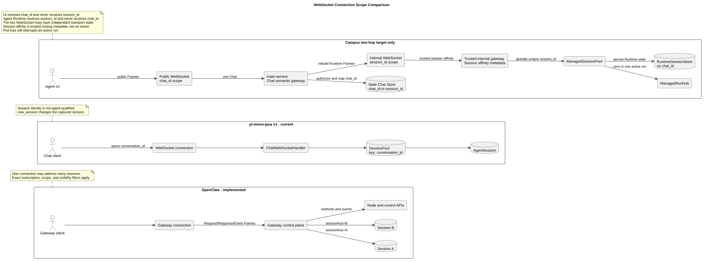
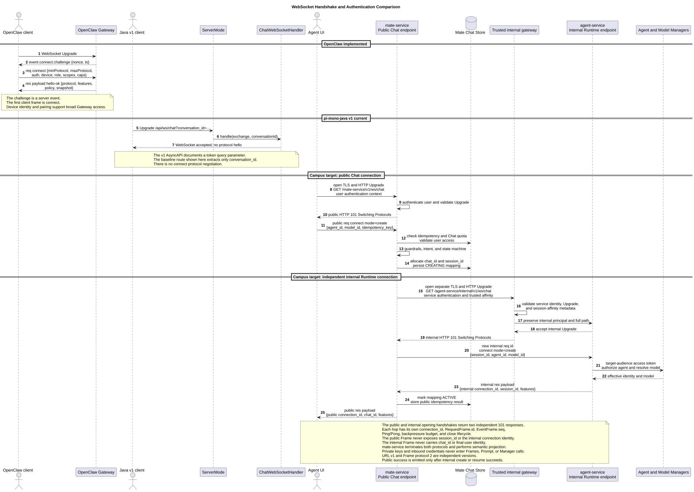
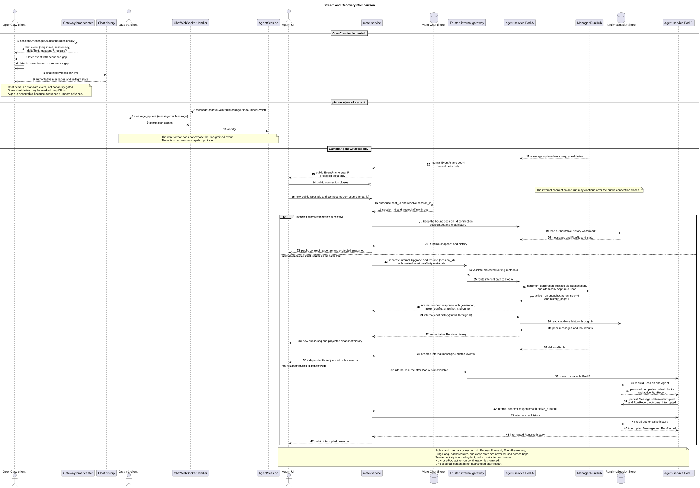
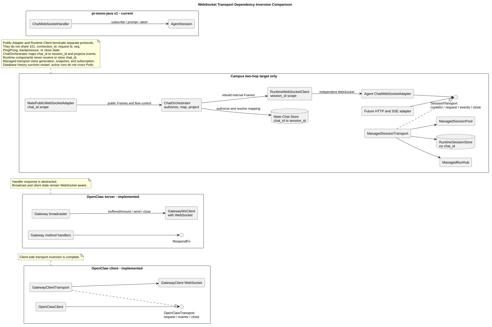

# OpenClaw 与 CampusAgent WebSocket 设计对比

## 1. 文档信息

| 项目 | 值 |
|---|---|
| 文档版本 | `1.8.0` |
| 状态 | 目标设计对比，CampusAgent v2 尚未实现 |
| 更新日期 | 2026-08-03 |
| OpenClaw 源码基线 | `b015925bc30f6a8363f290b07d5f8588e21422b8`，Gateway Protocol v4 |
| pi-mono-java 源码基线 | `1f7a5423219edfa4519d8719f1cc8a188ed72873` |
| CampusAgent 设计基线 | Manager 多 Agent 设计 `1.10.0` |
| CampusAgent 协议制品基线 | `chat-ws-v2.asyncapi.yaml`，协议制品版本 `2.8.0`、Frame 协议号 `2` |
| 本文范围 | WebSocket 连接、命令、流式事件、恢复、认证与协议制品 |

本文使用三种状态，不能相互替代：

- **OpenClaw 已实现行为**：来自固定 OpenClaw commit 的源码和文档。
- **pi-mono-java v1 当前行为**：来自固定 Java commit 的代码和现有
  `docs/asyncapi/chat-ws.yaml`；代码和文档不一致处单独标出。
- **CampusAgent WebSocket v2 目标设计**：来自现有 Manager 多 Agent
  设计和中文版 AsyncAPI，尚未落入 Java 实现。

## 2. 先给结论

OpenClaw 和 CampusAgent 解决的是两个不同层级的问题：

- OpenClaw WebSocket 是通用 **Gateway 控制平面**。一条连接完成设备身份、
  角色、scope 和 capability 协商后，可以调用 Chat、Session、Node 以及其他
  Gateway 方法；Chat 请求通过 `sessionKey` 在每次调用时路由。
- CampusAgent v2 是 `agent-service` 对服务端调用方开放的 **Session-scoped
  Chat 协议**。`mate-service` 等上层服务创建和管理 `session_id`；一条连接在
  `connect` 成功后固定绑定
  该 Session 及其不可变 `agent_id`，后续命令不再携带 Session 路由键。
  `session_id` 在 Runtime 部署范围内全局唯一，Runtime 不维护业务
  `tenant_id/user_id`。
- pi-mono-java v1 也是“一条连接操作一个 Session”，但它通过 Upgrade query
  参数选择 `conversation_id`，没有 Agent 维度、协议协商、统一 Frame、
  跨连接 run 所有权和可靠恢复语义。

因此，CampusAgent 应使用 Session-scoped
`wss://api.example.com/agent-service/v1/ws/chat`，借鉴 OpenClaw 的
`req/res/event` Frame、`traceparent`、有效 features、连接序列、run 序列、
幂等请求和权威状态恢复原则，但不复制 Gateway 多路复用、设备配对、累计
Message、慢消费者丢帧和节点控制体系。

CampusAgent 的核心身份限定为 `connection_id`、`session_id`、`agent_id`、
`model_id`、`message_id` 和 `run_id`。Request Frame `id` 与
`tool_call_id` 只是协议局部关联标识，不形成新的 Session 路由层。

如果未来需要全局运维、多 Session 观察、节点控制或统一控制台，应新增独立的
`/agent-service/v1/ws/gateway`，而不是放宽
`/agent-service/v1/ws/chat` 的身份和路由边界。

## 3. 源码与设计证据

### 3.1 OpenClaw：已实现

仓库和固定基线：

```text
repository: https://github.com/openclaw/openclaw
commit:     b015925bc30f6a8363f290b07d5f8588e21422b8
```

| 主题 | 固定源码证据 | 观察到的行为 |
|---|---|---|
| Gateway Protocol v4 | [`docs/gateway/protocol.md#L83-L168`](https://github.com/openclaw/openclaw/blob/b015925bc30f6a8363f290b07d5f8588e21422b8/docs/gateway/protocol.md#L83-L168) | 服务端先发 `connect.challenge`，客户端发 v4 `connect`，成功 Response payload 为 `hello-ok` |
| Frame 和追踪 | [`frames.ts#L12-L18`](https://github.com/openclaw/openclaw/blob/b015925bc30f6a8363f290b07d5f8588e21422b8/packages/gateway-protocol/src/schema/frames.ts#L12-L18)、[`#L156-L198`](https://github.com/openclaw/openclaw/blob/b015925bc30f6a8363f290b07d5f8588e21422b8/packages/gateway-protocol/src/schema/frames.ts#L156-L198) | 源码明确称其为 WebSocket envelope contracts；统一封闭 `req/res/event` Frame，Request Frame 可带 `traceparent` |
| 认证、设备与 features | [`frames.ts#L35-L145`](https://github.com/openclaw/openclaw/blob/b015925bc30f6a8363f290b07d5f8588e21422b8/packages/gateway-protocol/src/schema/frames.ts#L35-L145)、[`docs/gateway/clients.md#L45-L109`](https://github.com/openclaw/openclaw/blob/b015925bc30f6a8363f290b07d5f8588e21422b8/docs/gateway/clients.md#L45-L109) | connect 协商设备身份、role、scope 和客户端 caps；hello 返回 methods、events、capabilities、policy 和全局 snapshot |
| Chat 路由与幂等 | [`logs-chat.ts#L112-L158`](https://github.com/openclaw/openclaw/blob/b015925bc30f6a8363f290b07d5f8588e21422b8/packages/gateway-protocol/src/schema/logs-chat.ts#L112-L158) | `chat.send` 每次携带 `sessionKey` 和 `idempotencyKey`；活动 run 可使用 `queueMode` |
| 精确 Session 订阅 | [`protocol.md#L583-L588`](https://github.com/openclaw/openclaw/blob/b015925bc30f6a8363f290b07d5f8588e21422b8/docs/gateway/protocol.md#L583-L588) | 同一 Gateway 连接可用 `sessions.messages.subscribe` 精确订阅一个 Session 的消息和可选 Approval |
| Chat 事件 | [`logs-chat.ts#L161-L252`](https://github.com/openclaw/openclaw/blob/b015925bc30f6a8363f290b07d5f8588e21422b8/packages/gateway-protocol/src/schema/logs-chat.ts#L161-L252) | Chat 事件携带 `runId/sessionKey/seq`，区分 `status/delta/final/aborted/error` |
| delta 与 replace | [`logs-chat.ts#L193-L240`](https://github.com/openclaw/openclaw/blob/b015925bc30f6a8363f290b07d5f8588e21422b8/packages/gateway-protocol/src/schema/logs-chat.ts#L193-L240)、[`server-chat.ts#L278-L296`](https://github.com/openclaw/openclaw/blob/b015925bc30f6a8363f290b07d5f8588e21422b8/src/gateway/server-chat.ts#L278-L296)、[`#L922-L944`](https://github.com/openclaw/openclaw/blob/b015925bc30f6a8363f290b07d5f8588e21422b8/src/gateway/server-chat.ts#L922-L944)、[`client-info.ts#L80-L93`](https://github.com/openclaw/openclaw/blob/b015925bc30f6a8363f290b07d5f8588e21422b8/packages/gateway-protocol/src/client-info.ts#L80-L93) | Chat delta 是标准事件，不要求客户端 capability；正常前缀增长发送 `deltaText`，前缀不一致时发送 `replace`，并可带累计 `message` |
| Chat 附件 Frame | [`logs-chat.ts#L85-L102`](https://github.com/openclaw/openclaw/blob/b015925bc30f6a8363f290b07d5f8588e21422b8/packages/gateway-protocol/src/schema/logs-chat.ts#L85-L102)、[`attachment-api.ts#L5-L33`](https://github.com/openclaw/openclaw/blob/b015925bc30f6a8363f290b07d5f8588e21422b8/ui/src/pages/chat/attachment-api.ts#L5-L33)、[`chat-send-request.ts#L30-L46`](https://github.com/openclaw/openclaw/blob/b015925bc30f6a8363f290b07d5f8588e21422b8/ui/src/pages/chat/chat-send-request.ts#L30-L46) | UI 把 Data URL 转成 base64 attachment envelope，并随 `chat.send` Request Frame 内联发送 |
| 附件校验与 staging | [`attachment-normalize.ts#L18-L72`](https://github.com/openclaw/openclaw/blob/b015925bc30f6a8363f290b07d5f8588e21422b8/src/gateway/server-methods/attachment-normalize.ts#L18-L72)、[`chat-attachments.ts#L340-L478`](https://github.com/openclaw/openclaw/blob/b015925bc30f6a8363f290b07d5f8588e21422b8/src/gateway/chat-attachments.ts#L340-L478)、[`chat-send-attachments.ts#L182-L282`](https://github.com/openclaw/openclaw/blob/b015925bc30f6a8363f290b07d5f8588e21422b8/src/gateway/server-methods/chat-send-attachments.ts#L182-L282)、[`chat-send-handler.ts#L146-L169`](https://github.com/openclaw/openclaw/blob/b015925bc30f6a8363f290b07d5f8588e21422b8/src/gateway/server-methods/chat-send-handler.ts#L146-L169) | 服务端在 ACK 前验证 base64/实际字节、嗅探 MIME 和限制，再按类型内联小图片或 offload/stage；不是只信任客户端元数据 |
| Tool 事件投影 | [`chat-send-handler.ts#L482-L520`](https://github.com/openclaw/openclaw/blob/b015925bc30f6a8363f290b07d5f8588e21422b8/src/gateway/server-methods/chat-send-handler.ts#L482-L520)、[`server-chat.ts#L1478-L1532`](https://github.com/openclaw/openclaw/blob/b015925bc30f6a8363f290b07d5f8588e21422b8/src/gateway/server-chat.ts#L1478-L1532) | `tool-events` 注册 run-scoped agent Tool recipient；此外还存在面向 Session 订阅者的 `session.tool` 镜像 |
| 广播与背压 | [`server-broadcast.ts#L240-L340`](https://github.com/openclaw/openclaw/blob/b015925bc30f6a8363f290b07d5f8588e21422b8/src/gateway/server-broadcast.ts#L240-L340) | 每个客户端连接独立维护外层 `seq`，按 scope 和精确订阅过滤；慢消费者分支可丢弃 `dropIfSlow` 事件或关闭连接 |
| 重连恢复 | [`docs/gateway/clients.md#L111-L130`](https://github.com/openclaw/openclaw/blob/b015925bc30f6a8363f290b07d5f8588e21422b8/docs/gateway/clients.md#L111-L130) | 重连后重新订阅、读取 `chat.history`、采用 `inFlightRun`；连接或 run 序列缺口触发权威历史重载 |
| 客户端 Transport | [`types.ts#L20-L33`](https://github.com/openclaw/openclaw/blob/b015925bc30f6a8363f290b07d5f8588e21422b8/packages/sdk/src/types.ts#L20-L33)、[`transport.ts#L73-L174`](https://github.com/openclaw/openclaw/blob/b015925bc30f6a8363f290b07d5f8588e21422b8/packages/sdk/src/transport.ts#L73-L174)、[`client.ts#L342-L438`](https://github.com/openclaw/openclaw/blob/b015925bc30f6a8363f290b07d5f8588e21422b8/packages/sdk/src/client.ts#L342-L438) | SDK 依赖 `OpenClawTransport.request/events/close`，`GatewayClientTransport` 封装 WebSocket GatewayClient |
| 服务端解耦边界 | [`shared-types.ts#L110-L116`](https://github.com/openclaw/openclaw/blob/b015925bc30f6a8363f290b07d5f8588e21422b8/src/gateway/server-methods/shared-types.ts#L110-L116)、[`#L337-L353`](https://github.com/openclaw/openclaw/blob/b015925bc30f6a8363f290b07d5f8588e21422b8/src/gateway/server-methods/shared-types.ts#L337-L353)、[`ws-types.ts#L23-L26`](https://github.com/openclaw/openclaw/blob/b015925bc30f6a8363f290b07d5f8588e21422b8/src/gateway/server/ws-types.ts#L23-L26)、[`server-broadcast.ts#L293-L327`](https://github.com/openclaw/openclaw/blob/b015925bc30f6a8363f290b07d5f8588e21422b8/src/gateway/server-broadcast.ts#L293-L327) | Handler 通过 `RespondFn` 与 Frame 发送解耦，但 Gateway client state 和广播仍直接保存、操作 WebSocket |
| Schema 制品 | [`frames.ts#L185-L201`](https://github.com/openclaw/openclaw/blob/b015925bc30f6a8363f290b07d5f8588e21422b8/packages/gateway-protocol/src/schema/frames.ts#L185-L201) | TypeBox closed schema 同时形成运行时验证和 TypeScript 类型来源 |

“Gateway 多路复用”不等于“所有事件无差别发给所有连接”。OpenClaw
广播实现仍按 method、scope、capability、订阅和可见性过滤；这里比较的是
连接可以承载的控制面范围，而不是绕过授权的广播范围。

### 3.2 pi-mono-java v1：当前行为

仓库和固定基线：

```text
repository: https://github.com/superheromeZzh/pi-mono-java
commit:     1f7a5423219edfa4519d8719f1cc8a188ed72873
```

| 主题 | 固定源码证据 | 当前行为 |
|---|---|---|
| Upgrade 路由 | [`ServerMode.java#L377-L391`](https://github.com/superheromeZzh/pi-mono-java/blob/1f7a5423219edfa4519d8719f1cc8a188ed72873/modules/coding-agent-cli/src/main/java/com/campusclaw/codingagent/mode/server/ServerMode.java#L377-L391) | `/api/ws/chat` 从 query 读取 `conversation_id`，随即进入 handler |
| v1 协议文档 | [`docs/asyncapi/chat-ws.yaml#L1-L76`](https://github.com/superheromeZzh/pi-mono-java/blob/1f7a5423219edfa4519d8719f1cc8a188ed72873/docs/asyncapi/chat-ws.yaml#L1-L76)、[`#L170-L181`](https://github.com/superheromeZzh/pi-mono-java/blob/1f7a5423219edfa4519d8719f1cc8a188ed72873/docs/asyncapi/chat-ws.yaml#L170-L181) | AsyncAPI 记录 `conversation_id` 和 query `token` |
| 文档/实现偏差 | [`ServerMode.java#L377-L391`](https://github.com/superheromeZzh/pi-mono-java/blob/1f7a5423219edfa4519d8719f1cc8a188ed72873/modules/coding-agent-cli/src/main/java/com/campusclaw/codingagent/mode/server/ServerMode.java#L377-L391) | 该路由代码只提取 `conversation_id`，没有读取或验证文档中的 query `token`；本文不能把 v1 认证写成已实现 |
| Session 创建 | [`ChatWebSocketHandler.java#L115-L135`](https://github.com/superheromeZzh/pi-mono-java/blob/1f7a5423219edfa4519d8719f1cc8a188ed72873/modules/coding-agent-cli/src/main/java/com/campusclaw/codingagent/mode/server/ChatWebSocketHandler.java#L115-L135) | 建连时立即创建或恢复 Session，一条连接捕获一个 `AgentSession` |
| 命令 | [`ChatWebSocketHandler.java#L195-L227`](https://github.com/superheromeZzh/pi-mono-java/blob/1f7a5423219edfa4519d8719f1cc8a188ed72873/modules/coding-agent-cli/src/main/java/com/campusclaw/codingagent/mode/server/ChatWebSocketHandler.java#L195-L227) | 使用 `prompt/steer/abort/new_session/set_model/...`，没有统一 request ID 和 Frame |
| 活动 run | [`ChatWebSocketHandler.java#L252-L273`](https://github.com/superheromeZzh/pi-mono-java/blob/1f7a5423219edfa4519d8719f1cc8a188ed72873/modules/coding-agent-cli/src/main/java/com/campusclaw/codingagent/mode/server/ChatWebSocketHandler.java#L252-L273) | 正在流式输出时拒绝新的 `prompt`；`steer` 和 `abort` 为独立命令 |
| 附件输入 | [`ChatWebSocketHandler.java#L252-L273`](https://github.com/superheromeZzh/pi-mono-java/blob/1f7a5423219edfa4519d8719f1cc8a188ed72873/modules/coding-agent-cli/src/main/java/com/campusclaw/codingagent/mode/server/ChatWebSocketHandler.java#L252-L273)、[`ws-chat-followups.md#L12-L37`](https://github.com/superheromeZzh/pi-mono-java/blob/1f7a5423219edfa4519d8719f1cc8a188ed72873/docs/plans/ws-chat-followups.md#L12-L37)、[`ImageContent.java#L9-L18`](https://github.com/superheromeZzh/pi-mono-java/blob/1f7a5423219edfa4519d8719f1cc8a188ed72873/modules/ai/src/main/java/com/campusclaw/ai/types/ImageContent.java#L9-L18) | v1 prompt 只接收字符串；Java 内容模型可内联 base64 图片，但 WebSocket 通用附件仍被列为待设计项 |
| 累计更新 | [`ChatWebSocketHandler.java#L422-L459`](https://github.com/superheromeZzh/pi-mono-java/blob/1f7a5423219edfa4519d8719f1cc8a188ed72873/modules/coding-agent-cli/src/main/java/com/campusclaw/codingagent/mode/server/ChatWebSocketHandler.java#L422-L459)、[`chat-ws.yaml#L832-L840`](https://github.com/superheromeZzh/pi-mono-java/blob/1f7a5423219edfa4519d8719f1cc8a188ed72873/docs/asyncapi/chat-ws.yaml#L832-L840) | `message_update` 每次发送累计的完整 Message |
| Tool 事件 | [`ChatWebSocketHandler.java#L435-L486`](https://github.com/superheromeZzh/pi-mono-java/blob/1f7a5423219edfa4519d8719f1cc8a188ed72873/modules/coding-agent-cli/src/main/java/com/campusclaw/codingagent/mode/server/ChatWebSocketHandler.java#L435-L486) | 已有独立 `tool_start/tool_update/tool_end`，但使用 v1 特有字段和顶层事件格式 |
| 可利用的内部 delta | [`MessageUpdateEvent.java#L17-L20`](https://github.com/superheromeZzh/pi-mono-java/blob/1f7a5423219edfa4519d8719f1cc8a188ed72873/modules/agent-core/src/main/java/com/campusclaw/agent/event/MessageUpdateEvent.java#L17-L20)、[`AssistantMessageEvent.java#L44-L164`](https://github.com/superheromeZzh/pi-mono-java/blob/1f7a5423219edfa4519d8719f1cc8a188ed72873/modules/ai/src/main/java/com/campusclaw/ai/stream/AssistantMessageEvent.java#L44-L164) | Java 内部事件同时含累计 Message 和 `text/thinking/toolcall` 等细粒度事件，但 v1 WebSocket 未映射后者 |
| 断线语义 | [`ChatWebSocketHandler.java#L168-L188`](https://github.com/superheromeZzh/pi-mono-java/blob/1f7a5423219edfa4519d8719f1cc8a188ed72873/modules/coding-agent-cli/src/main/java/com/campusclaw/codingagent/mode/server/ChatWebSocketHandler.java#L168-L188) | 连接关闭会取消事件订阅，并在流式状态下调用 `AgentSession.abort()` |
| Pool 隔离键 | [`SessionPool.java#L61-L69`](https://github.com/superheromeZzh/pi-mono-java/blob/1f7a5423219edfa4519d8719f1cc8a188ed72873/modules/coding-agent-cli/src/main/java/com/campusclaw/codingagent/mode/server/SessionPool.java#L61-L69)、[`#L176-L202`](https://github.com/superheromeZzh/pi-mono-java/blob/1f7a5423219edfa4519d8719f1cc8a188ed72873/modules/coding-agent-cli/src/main/java/com/campusclaw/codingagent/mode/server/SessionPool.java#L176-L202) | 内存 Session 只按 `conversation_id` 索引，共享 `baseConfig/serverCwd` |
| 心跳 | [`ChatWebSocketHandler.java#L115-L135`](https://github.com/superheromeZzh/pi-mono-java/blob/1f7a5423219edfa4519d8719f1cc8a188ed72873/modules/coding-agent-cli/src/main/java/com/campusclaw/codingagent/mode/server/ChatWebSocketHandler.java#L115-L135) | 发送应用层 JSON `pong`，不是原生 WebSocket Ping/Pong |

### 3.3 CampusAgent v2：目标设计

CampusAgent v2 尚未实现；本节描述的全部行为都是目标设计。其规范来源是以下
三个仓库内制品：

- [Manager 驱动的多 Agent 运行设计 1.10.0](../pi-mono-java-manager-driven-multi-agent-runtime/README.md)
- [CampusAgent Chat WebSocket v2 中文 AsyncAPI 2.8.0](../pi-mono-java-manager-driven-multi-agent-runtime/chat-ws-v2.asyncapi.yaml)
- [CampusAgent Chat WebSocket v2 客户端接入指南 1.4.0](../pi-mono-java-manager-driven-multi-agent-runtime/chat-ws-v2-client-integration.md)

这一部分是 **target-only design**，不是 pi-mono-java 当前行为。相对 Java
v1 的改变属于架构改造和安全加固；相对 OpenClaw 的差异主要属于产品约束。
目标 Managed Profile 从 Agent 运行目录的 `.campusagent/SYSTEM.md` 与
`.campusagent/skills/` 装载上下文；固定 pi-mono-java 基线中的
`.campusclaw`、`com/campusclaw` 和 `/api/ws/chat` 只用于记录当前源码事实，
不代表目标名称或目标路由。

### 3.4 Agent 与 Model 资源 ID 的三态边界

| 状态 | 资源 ID 行为 | 结论 |
|---|---|---|
| OpenClaw 已实现 | OpenClaw 使用自己的 `agentId`、`sessionKey` 等 Gateway 路由字段，不定义 CampusAgent 的 `agent_id/model_id` 资源格式 | OpenClaw 的路由机制不能作为 Campus 资源 ID 契约 |
| pi-mono-java v1 当前 | WebSocket Upgrade 只按 `conversation_id` 选择 Session，连接协议没有 `agent_id/model_id` 路由 | v1 没有可沿用的 Agent/Model 资源 ID 校验规则 |
| CampusAgent v2 目标 | `agent_id` 必须匹配 `^agent_[0-9A-Za-z]{24}$`，`model_id` 必须匹配 `^model_[0-9A-Za-z]{24}$`；二者总长均为 30、大小写敏感、服务端签发且按 opaque string 使用 | Adapter 只校验格式，Manager 按完整 ID 解析与授权；客户端和 Runtime 不解析后缀、不改写大小写，也不从后缀推断顺序或归属 |

`agent_...` 的可见形态参考
[Anthropic Managed Agents Create Agent API](https://platform.claude.com/docs/en/api/beta/agents/create)
的响应示例与
[官方 TypeScript SDK 固定源码](https://github.com/anthropics/anthropic-sdk-typescript/blob/3b45cd3b69c956ac63384fdb09ce1d8109f3fa80/src/resources/beta/agents/agents.ts#L14-L155)，
但官方公开类型只约束为字符串；上述精确正则、长度和 opaque 语义是
CampusAgent 的目标协议决定，不应表述为 Anthropic 已公开保证的生成规则。
`model_...` 是 CampusModel / `model-service` 资源 ID 的架构决定；它不是
Anthropic 模型 ID 规则，也不能用 `claude-*` 等 Provider model identifier
替代。Model Manager 负责把 `model_id` 映射到具体 Provider 模型。

## 4. 三种连接作用域



[PlantUML 源码：`websocket_connection_scope_comparison`](diagram.puml#L1)

### 4.1 OpenClaw：Gateway-scoped

连接首先代表“某个已认证 Gateway 客户端”，而不是某个 Chat Session。
`chat.send`、`chat.history`、`chat.abort` 都通过请求中的 `sessionKey` 路由，
其他 Gateway 方法还可管理 Session、Node、配置和状态。这个边界适合：

- 单一控制台同时观察或操作多个 Session；
- 桌面端、移动端、节点和自动化客户端共享一个控制面；
- 以设备身份、role、scope、capability 管理不同客户端能力。

代价是每个请求和事件都必须带足路由信息，服务端必须在方法级和资源级重复
授权，客户端也要正确处理不同 Session 的事件交错。

### 4.2 pi-mono-java v1：连接捕获 Session

v1 建连时根据 `conversation_id` 得到 `AgentSession`，handler 在该连接生命周期
内持有它。它看起来也是 Session-scoped，但缺少以下约束：

- Session 记录没有不可变 `agent_id` 绑定，且所有 Session 共享 base cwd，无法
  形成多 Agent 运行隔离；
- `new_session` 可在同一连接内替换 Session，连接身份并非不可变；
- 模型可在连接内改变，却没有 Manager 的 Agent-model 授权；
- run 隶属于连接，断线会 abort；
- 没有重连快照、序列和缺口恢复契约。

### 4.3 CampusAgent v2：严格 Session-scoped

CampusAgent v2 只允许 `mate-service`、其他获授权服务端调用方或服务端 SDK
连接。浏览器到 `mate-service` 的协议不属于本接口。`connect` 成功后，连接固定
绑定到上层提供的全局唯一 `session_id` 及其不可变 `agent_id`；后续命令只能
作用于该 Session。完整作用域为：

```text
authenticated calling service
  + session_id supplied by the upstream service
  + agent_id
  + effective model_id
  + thinking disclosure ceiling
  = immutable connection scope
```

后续 `chat.send/steer/abort/history` 不再接受 Agent 或 Session 路由字段。
服务端从连接上下文得到作用域，避免客户端在每帧重新声明目标。新建 Session
必须由上层服务分配新 `session_id` 并建立新连接。同一 Pod 内每个 Session
只有一个活动读写连接；新的 `mode=resume` 增加 connection generation、接管
Session，并以私有关闭语义 `4409 SESSION_REPLACED` 关闭旧连接，不提供观察连接。

这是 ToB Agent Runtime 的产品约束和安全加固：Agent 权限、模型、Tool 权限、
thinking 披露和审计天然落在同一个固定边界内。`mate-service` 负责用户鉴权、
tenant/user 归属、会话列表、最多 50 个等产品规则、附件归属以及业务删除；
CampusAgent 只认证调用服务，以全局唯一 `session_id` 作为 Session key，并负责
Runtime 上下文和 run。`RuntimeSessionStore` 把 Session、Message、RunRecord、
`history_seq`、幂等结果、Agent/Model/bundle revision 与附件 claim 持久化到
数据库，不生成 Session JSONL；本文只定义逻辑记录和恢复语义，物理表结构
另行设计。

多副本 v1 依赖可信网关按用户 IP 把同一调用链粘到同一 Pod；不引入 Redis、
Session Header、跨 Pod 转发或分布式 owner。若网关只能看到 `mate-service` 或
NAT IP、用户 IP 改变，或者 Pod 重启，active run 就不能跨 Pod 继续。这是当前
部署约束，不是协议提供的跨 Pod 恢复保证。

## 5. 统一对比矩阵

| 维度 | OpenClaw 已实现 | pi-mono-java v1 当前 | CampusAgent v2 目标 | 设计原因、收益与代价 |
|---|---|---|---|---|
| 核心定位 | 通用 Gateway 控制平面和节点传输 | Chat 服务端模式 | `agent-service` 的服务到服务 Session-scoped Chat 协议 | 原因：收窄 ToB Runtime 边界；收益：降低跨 Agent 授权复杂度；代价：多会话调用方连接更多 |
| 连接作用域 | 一条连接可调用多个 Session 和控制面能力 | 一条连接持有一个 `AgentSession`，但可 `new_session` | 一条连接固定调用方 `session_id` 及其 Agent 绑定；同一 Pod 同一 Session 只有一个活动读写连接 | 原因：固定审计和权限边界；收益：后续帧无需重新路由；代价：不具备 Gateway 式多路复用或观察连接 |
| 多副本路由 | Gateway 自身维护连接、订阅与 Session 路由 | 未定义分布式 owner | v1 由可信网关按用户 IP 粘性到 Pod；无 Redis、Session Header、跨 Pod 转发或分布式 owner | 原因：先控制实现复杂度；收益：单 Pod run 语义清晰；代价：NAT/代理可见 IP、用户换 IP和 Pod 重启都会破坏 active run 连续性 |
| Upgrade 输入 | 建立 WebSocket 后进行 challenge/connect | query `conversation_id`；AsyncAPI 还声明 query `token` | `wss://api.example.com/agent-service/v1/ws/chat` 由客户端库生成同 host/path 的 HTTP GET + Upgrade headers；不收业务 query 和 URL token | 原因：传输握手与应用绑定分层；收益：凭据和路由不进入代理 URL 日志；代价：Gateway 与服务都必须保留完整路径并正确支持 Upgrade |
| 认证 | connect 内认证、设备签名/配对、role/scope | 基线路由没有实现文档所述 query token 校验 | 内部网关在 `101` 前用既有私钥/JWT能力认证调用服务；私钥原文不传输，Runtime 不接收 tenant/user 身份 | 原因：Runtime 只建立服务信任；收益：不重复上层用户体系；代价：`mate-service` 等上层服务成为用户授权责任边界 |
| 握手 | HTTP/WebSocket 建立后：`connect.challenge` → `connect` → `hello-ok` | 没有协议首帧，Upgrade 后直接处理命令 | HTTP/1.1 GET Upgrade → `101` → 5 秒内 `connect` RequestFrame → ResponseFrame | 原因：明确 HTTP 与应用协议边界；收益：握手错误和业务错误各归其层；代价：服务端要维护首帧超时状态 |
| 版本协商 | `minProtocol/maxProtocol`，基线协议 v4 | 无 | URL `/v1` 表示 agent-service API 生命周期；`min_protocol/max_protocol` 仅接受 Frame 协议 2 | 原因：部署路由版本和 WebSocket 线协议独立演进；收益：避免把两种版本混为一谈；代价：文档和 SDK 必须同时标明两者 |
| capability 与 features | 客户端声明可选 caps；Chat delta 不依赖 capability；`hello-ok.features` 返回可用 methods/events/capabilities | 无 | typed structured delta 是协议 2 固有语义；capability 只表达 `full_thinking` 等可选增强；methods 可过滤但必须保留 `chat.history`，八类 Chat events 是不可拆分的固定集合 | 原因：恢复依赖权威历史和完整终态；收益：普通客户端无需声明自然流式能力，且始终能恢复并判定 Message/run 终态；代价：无历史权限的调用服务不能建立 Chat 连接 |
| Frame | 封闭 `req/res/event`；成功 Response 使用 `payload` | 按命令 `type` 分发；支持可选 `id` 和 `response`，但没有统一 Frame | 封闭 `req/res/event`；成功 Response 使用 `payload`，错误使用 `error` | 原因：连接内存在并发命令和异步事件；收益：统一响应关联、超时、重试和 SDK 生成；代价：需要统一 dispatcher 和 schema validator |
| 追踪上下文 | Request Frame 可带 `traceparent` | 无协议字段 | 可选 `traceparent` 通过 W3C 校验并传给 Model/Tool Manager，只用于遥测 | 原因：跨 Manager 调用需要关联追踪；收益：无需污染业务载荷；代价：必须隔离 Prompt、数据库、事件和凭据日志 |
| Agent 路由 | 请求/Session 数据可带 `agentId`，但不定义 Campus `agent_id` 格式 | 无 `agent_id` | `mode=create` 必填匹配 `^agent_[0-9A-Za-z]{24}$` 的 `agent_id` 并形成不可变绑定；resume 必须匹配 | 原因：Session 不能跨 Agent 重绑定；收益：防止串用；代价：建连必须访问 Agent Manager |
| Session 路由 | Chat 请求和事件携带 `sessionKey` | Upgrade query 选择 `conversation_id` | 上层服务提供全局唯一 `session_id`；connect create/resume 后不再传 | 原因：Runtime 只消费调用方会话身份；收益：唯一 key 无二次作用域映射且每帧不能改变目标；代价：调用方必须保证全局唯一和协调生命周期 |
| Model 路由 | 由 Gateway/Session 配置体系决定，不定义 Campus `model_id` 格式 | `set_model` 直接作用于 Session | `mode=create` 必填匹配 `^model_[0-9A-Za-z]{24}$` 的 `model_id`；resume 可沿用，切换须 Manager 校验 | 原因：Agent-model allowlist 必须服务端权威；收益：避免未授权模型；代价：增加 Manager 延迟和可用性依赖 |
| 发送 | `chat.send` + `idempotencyKey` | `prompt`，无请求幂等键 | `chat.send` 接受文本、附件或二者；仅附件不生成隐藏 Prompt；返回 `run_id + user_message_id`，成功 Response 先于因果 run 事件 | 原因：网络失败和乐观消息结果可能未知；收益：安全重试、文件原生输入并对齐权威用户消息；代价：服务端要保存幂等结果并短暂约束事件排流 |
| steer | `chat.send.queueMode="steer"` 等队列模式 | 独立 `steer` | `chat.steer(run_id)` v1 仅支持文本，活动 run 期间不接收新附件 | 原因：显式限定当前 run 并保持附件接受原子性；收益：命令意图和审计更清晰；代价：附件必须等当前 run 结束后另发 `chat.send` |
| abort | `chat.abort(sessionKey, runId?)` | `abort` 当前 Session | `chat.abort(run_id)`，重复调用幂等 | 原因：避免误终止其他 run；收益：重复请求结果稳定；代价：要保留可查询的 run 终态 |
| history | `chat.history(sessionKey)` | `get_history` | `chat.history` 从数据库游标分页返回按 history_seq 排序的 Message 与 RunRecord | 原因：恢复必须有权威 Message 和 run 终态；收益：离线完成后仍能恢复 outcome/usage/error；代价：需要分页、投影和一致性读取 |
| active run | `queueMode` 可决定活动 run 时行为 | streaming 时拒绝新 `prompt` | 同一 Session 一个主 run，重复 send 返回 `RUN_ACTIVE` | 原因：选择可预测的串行主 run；收益：状态和资源上限简单；代价：复杂排队需由更高层实现 |
| delta | 标准 Chat 事件，无需 capability；`deltaText` 可附累计 `message`，前缀异常用 `replace` | `message_update` 每次完整累计 Message | 协议 2 固有的 `message.updated.update`，只含本次 typed delta | 原因：自然语言流式输出是协议基线并复用 Java 内部细粒度事件；收益：无需虚假协商、降低带宽并保留内容类型；代价：客户端必须实现 reducer |
| 完整 Message | delta 中可选，final 中可选，history 权威 | 每次更新都携带 | 仅 `message.completed`、active snapshot 和 history | 原因：分开增量与快照职责；收益：避免累计对象的 O(n²) 传输；代价：客户端在完成前要维护 partial Message |
| thinking | Chat 请求可传 thinking，事件投影受 Gateway 能力约束 | 累计 Message 跟随当前对象 | `hidden/summary/full`，实时/恢复/历史一致；summary 无安全摘要时发送无内容占位，被抑制更新使用 `thinking_redacted` | 原因：thinking 是敏感披露面；收益：防止旁路泄露并保持 run_seq 连续；代价：hidden 仍会泄露被抹除更新的数量与时序元数据 |
| Tool 生命周期 | `tool-events` 控制 run-scoped `agent/stream=tool` 投影；显式 Session 订阅还可收到独立 `session.tool` 镜像 | 已有 `tool_start/tool_update/tool_end` 独立事件 | `tool.started/updated/completed` 返回脱敏后的业务 parameters/result；超限结果改为截断预览、原始大小和不透明 `result_ref` | 原因：统一生命周期并隔离凭据、内部 Header 与执行秘密；收益：客户端可观察且 Frame 有界；代价：v1 不提供 `result_ref` 读取接口 |
| 连接序列 | 每客户端外层 `seq`，重连重置 | 无 | 每连接 `seq`，重连重置 | 原因：检测当前连接的丢帧或乱序；收益：缺口可见；代价：不能把它当作跨重连游标 |
| run 序列 | Chat/agent 事件含 run 内 `seq` | 无 | canonical `run_seq` 跨重连连续，thinking 投影不改变事件基数 | 原因：active run 要跨连接和多投影恢复；收益：可去重和精确排序；代价：被抑制 thinking 也要发送 redacted 占位 |
| 序列缺口 | 重连或重载 `chat.history`；部分慢事件允许显式形成缺口 | 无协议行为 | 不静默丢 delta；关闭 1013，重连取原子快照 | 原因：优先保证单 Session Chat 输出完整；收益：不会悄悄缺字；代价：慢客户端承担断线和恢复 |
| run 所有权 | Gateway 暴露 `inFlightRun` 并指导客户端恢复 | WebSocket close 时 abort | 当前 Pod 的 Pool/Hub 持有 active run；连接只是唯一活动订阅者，普通断线不 abort | 原因：网络生命周期不应定义模型生命周期；收益：同 Pod 网络抖动不终止 run；代价：不保证跨 Pod active continuation |
| 恢复 | 重新订阅、history、in-flight 状态、序列对账 | 仅可恢复已写历史，活动 run 已被 abort | 同 Pod resume 接管旧 connection generation 并取得原子快照；Pod 重启后从数据库重建 Session，把旧 run 及由已持久化完整内容块组成的 Message 标为 `interrupted` | 原因：明确本地恢复与进程故障边界；收益：无 Redis 仍可恢复权威历史；代价：未到内容块结束边界的尾部不承诺保存 |
| 帧与背压 | hello policy 给限制；广播有 slow-consumer 分支 | v1 无规范化上限和恢复契约 | 解压重组后的 UTF-8 JSON Message 默认 1 MiB、缓冲 4 MiB；1009/1013 | 原因：每连接资源必须有界且不混淆 wire fragment；收益：防止慢连接拖垮服务；代价：大消息需拆分且客户端必须恢复 |
| 心跳 | Gateway policy 和客户端协议支持连接保活 | 应用层 JSON `pong` | 原生 WebSocket Ping/Pong，默认 20 秒 | 原因：让协议栈和基础设施识别保活；收益：业务消息更纯粹；代价：调用服务必须正确处理 Pong 和重连 |
| 附件 | Request Frame 内联 base64 attachment envelope；服务端在 ACK 前验证实际字节/MIME/限制并 stage/offload | v1 prompt 只接收字符串；通用附件输入仍是 follow-up | `mate-service` 通过 HTTP/Object Storage 上传；WS 只传绑定 session_id 的 ID，Runtime 批量解析不可变版本、read handle 和 retention claim | 原因：agent-service 不拥有用户文件数据面；收益：大对象、扫描、授权、历史保留和 Chat 背压解耦；代价：多一个上传/READY 阶段和跨服务租约一致性 |
| 权限与审计 | role/scope/capability + session visibility | 没有 Agent 维度的协议授权 | 服务身份 + Agent/Model/Tool 校验；入站凭据不转发，调用内部 Manager 时签发目标 audience access-token；凭据不进事件或数据库 | 原因：按所有权拆分授权；收益：Runtime 不复制用户体系且降低凭据横向复用风险；代价：服务间委托能力成为关键依赖 |
| Transport 依赖方向 | SDK 客户端依赖 `OpenClawTransport`；服务端 handler 已抽象 `RespondFn`，但连接状态和广播仍直接依赖 WebSocket | `ChatWebSocketHandler` 直接拥有 Session、订阅和断线 abort | `ChatWebSocketAdapter` 依赖服务端 `SessionTransport`，`ManagedSessionTransport` 拥有业务状态机 | 原因：协议适配与 Session 生命周期分离；收益：可单测并保留未来 Adapter 扩展点；代价：需要严格定义连接与订阅状态机 |
| 协议制品 | TypeBox → 运行时校验、类型和协议 Schema | AsyncAPI 1.0 文档与 Java 手写处理存在偏差 | AsyncAPI 3.1 规范制品，后续 Java 实现必须对齐 | 原因：先固定可评审契约；收益：可生成文档和契约测试；代价：实现前仍没有运行时校验，后续要建设生成链 |

## 6. 握手、认证和能力协商



[PlantUML 源码：`websocket_handshake_comparison`](diagram.puml#L96)

### 6.1 OpenClaw：challenge 验证设备身份

OpenClaw 在 WebSocket 建立后先发送 `connect.challenge`。客户端收到 nonce
后提交设备身份、签名、role、scope 和 capability；Gateway 验证成功后返回
`hello-ok`，失败则拒绝应用连接。这套流程面向范围广泛的客户端和节点，解决：

- “这个连接是哪台已配对设备”的持续身份；
- operator 与 node 等角色的不同能力；
- 单 Gateway 控制面上的方法级授权；
- 本地、远程、桌面和节点客户端之间的统一接入。

这套体系是 Gateway 产品模型的组成部分，不是所有 WebSocket Chat 都必须复制
的通用规范。

### 6.2 CampusAgent：Upgrade 认证调用服务，`101` 后建立 WebSocket

`mate-service`、其他获授权服务端调用方或服务端 SDK 使用
`wss://api.example.com/agent-service/v1/ws/chat` 请求建立安全 WebSocket。
客户端库先建立 TCP/TLS 连接，再通过 HTTP opening handshake 协商切换协议；
服务端返回 `101` 后，WebSocket 才正式建立。Gateway 与 agent-service 均按
完整 `/agent-service/v1/ws/chat` 路径路由，不剥离服务前缀。

可信内部网关在返回 `101` 前，使用公司既有私钥/JWT认证能力验证调用服务。
本文只规定行为边界，不复制私有 Header 或 claim：

- 私钥原文永不随 opening handshake 或 WebSocket Frame 传输；JWT 只是签名后的
  身份证明；
- 浏览器不能直接连接该接口，而是先连接 `mate-service`，由其完成 Cookie、
  Origin、用户授权和附件所有权校验；
- agent-service 从网关认证结果建立不可变 service principal，不接收业务
  `tenant_id/user_id`；
- 入站 JWT 不原样转发给 Model Manager 或 Tool Manager；agent-service 调用
  每个内部服务时，使用既有能力签发对应 target audience 的短期 access-token；
- 私钥、JWT 和 access-token 不进入 Prompt、数据库、WebSocket 事件或业务日志。

调用服务配置的是：

```text
wss://api.example.com/agent-service/v1/ws/chat
```

调用 `connect("wss://...")` 只是请求客户端库开始上述过程，不表示 WebSocket
已经建立。不存在“先建立 wss/WebSocket，再使用 HTTP Upgrade 升级”的过程。
客户端库自动执行：

```text
parse wss URI
  -> DNS
  -> one TCP connection to port 443
  -> TLS
  -> HTTP WebSocket Upgrade on the same connection
  -> HTTP 101
  -> WebSocket is established
  -> WebSocket Frames on the same TCP/TLS connection
```

因此可以把底层 HTTP/TLS 握手目标理解为
`https://api.example.com/agent-service/v1/ws/chat`。二者不是两个接口：`wss`
是客户端库的
建连指令，`https` 形式只是解释 opening handshake 承载在 HTTP/TLS 上；该路径
不会因此自动获得普通 REST GET/POST 语义，也不会建立第二条连接。

以下只展示标准 HTTP/1.1 WebSocket opening handshake。内部网关认证字段因
属于既有私有契约而有意省略：

```http
GET /agent-service/v1/ws/chat HTTP/1.1
Host: api.example.com
Connection: Upgrade
Upgrade: websocket
Sec-WebSocket-Version: 13
Sec-WebSocket-Key: <random-base64-key>
```

成功响应为：

```http
HTTP/1.1 101 Switching Protocols
Connection: Upgrade
Upgrade: websocket
Sec-WebSocket-Accept: <derived-value>
```

`101` 之前仍属于 HTTP：认证或握手失败返回 `400/401/403/426` 等 HTTP
status，不能返回 CampusAgent `ResponseFrame`。`101` 之后才属于 WebSocket：
不再为每个消息发送 HTTP method、headers 或 status，业务消息使用
Request/Response/Event Frame，连接级错误使用 WebSocket close code。

使用 HTTP opening handshake 的原因是复用 443、TLS、HTTP Host/path 路由、
代理、负载均衡、防火墙、网关认证和状态码拒绝能力；Upgrade/101 还让所有
参与方明确确认同一 TCP/TLS 连接的后续字节必须按 WebSocket Frame 解释。

| 名称 | 所属层 | 作用 |
|---|---|---|
| HTTP `Connection: Upgrade` | HTTP/WebSocket 传输握手 | 把现有 HTTP 连接切换为 WebSocket |
| HTTP `101 Switching Protocols` | HTTP/WebSocket 传输握手 | 确认 WebSocket 传输已经建立 |
| CampusAgent `method: connect` | WebSocket 应用协议 | 绑定协议版本、Session、Agent、Model，并协商可选增强 capability |

路径中的 `/v1` 是 `agent-service` 对外 API 生命周期版本；`connect` 中协商的
`protocol: 2` 是 Request/Response/Event Frame 的线协议版本。二者服务于不同
兼容性边界，不要求数字相同。

完成 HTTP Upgrade 后，客户端首个业务 Frame 仍必须是 `connect`。它负责协议版本、
可选客户端能力和 Session 绑定，而不是再次传递长期凭据。typed structured
delta 是协议 2 基线，无需客户端声明；当前仅 `full_thinking` 属于可选增强。
`session_id` 始终由
`mate-service` 等上层服务提供并保证在 Runtime 部署范围内全局唯一：
`mode=create` 必须
同时提供 `session_id + agent_id + model_id`，相同绑定重试幂等；
`mode=resume` 提供 `session_id + agent_id`，
`model_id` 可省略并沿用已保存值。显式切换模型要经过 Model Manager，活动
run 存在时拒绝；缺失或已删除 Session 不得由 resume 隐式重建。resume 成功
会增加 connection generation、关闭同 Pod 旧连接，并使新连接成为唯一活动
读写连接。

### 6.3 pi-mono-java v1：query token 仅存在于文档

固定基线的 AsyncAPI 声明了 query `token`，但 `ServerMode` Upgrade 路由只
读取 `conversation_id`，没有提取或验证 token。因此，v1 不能被视为已经实现
Upgrade 认证，v2 也不能复用一个并不存在的认证实现。

## 7. 命令、并发与响应关联

### 7.1 OpenClaw

OpenClaw 的请求在每帧携带 method 和参数，响应按 request `id` 关联。Chat
请求同时携带 `sessionKey`。`chat.send` 使用 `idempotencyKey`，活动 run 上的
输入可以通过 `queueMode=steer/followup/collect/interrupt` 表达不同队列语义。

这是通用控制面的合理选择：一个连接可并发调用不同方法和不同 Session。
相应代价是路由、权限与幂等必须由每个方法正确执行。

### 7.2 pi-mono-java v1

v1 依据顶层 `type` 分支执行命令。命令可带 `id`，服务端会返回同 `id` 的
`response`，所以它已经具备基础响应关联；但命令、响应和异步事件没有统一
`req/res/event` Frame，错误还是人类可读字符串，也没有稳定错误码和请求
幂等语义。`new_session` 还会在连接内改变当前会话。这对单页原型足够直接，
但不适合 SDK 并发治理、可重试副作用命令和稳定错误处理。

### 7.3 CampusAgent v2

客户端发送 RequestFrame 后，CampusAgent 先按封闭 Schema 校验顶层字段，再
返回唯一关联的 ResponseFrame；模型和 Tool 的异步输出通过独立 EventFrame
发送。未知字段返回 `INVALID_REQUEST`。v2 固定三种 Frame 和一种错误结构：

```text
RequestFrame  = {type:"req", id, method, params?, traceparent?}
ResponseFrame = {type:"res", id, ok, payload? | error?}
EventFrame    = {type:"event", event, seq, payload}
Error         = {code, message, details?, retryable?, retry_after_ms?}
```

三种顶层对象都封闭，未知字段直接返回 `INVALID_REQUEST`；成功响应只使用
`payload`，错误响应只使用 `error`。`traceparent` 最长 128 字符，必须通过
W3C Trace Context 解析，解析后的不可变上下文只向 Model Manager 和 Tool
Manager 传播，不写入 Prompt、数据库、业务事件或凭据日志。

连接内命令固定为：

- `chat.send`
- `chat.steer`
- `chat.abort`
- `chat.history`
- `session.get`
- `models.list`
- `model.set`
- `thinking.set`

同一 Session 只允许一个主 run。活动期间再次 `chat.send` 返回
`RUN_ACTIVE`，`model.set` 和 `thinking.set` 也拒绝；`chat.steer` 必须指定
当前 `run_id` 且 v1 只接受文本，`chat.abort` 对重复调用保持幂等。所有改变
Session/run 状态的成功 ResponseFrame 必须先于该请求产生的 EventFrame 写出，
客户端因而能先登记 `run_id` 再消费 `run.started`。

`chat.send` 可以提交非空文字、非空 `attachment_ids`，或二者同时提交；二者
不能同时为空。只有附件时不生成隐藏默认 Prompt。权威 User Message 只允许
纯文本、纯附件、文本后按请求顺序排列附件三种内容形态。`prompt_templates.list`
和 `skills.list` 不属于 WebSocket v1；`/skill:name` 仍作为普通消息文本由
AgentSession 展开，Skill 展示信息由 `mate-service` 或元数据 REST API 提供。
该选择放弃 OpenClaw 的多种队列模式，换取服务到服务 Chat 更容易解释和审计的
并发规则。

## 8. 流式事件与消息语义

### 8.1 OpenClaw 的兼容型 delta

OpenClaw Chat `delta` 同时提供三种客户端可利用的信息：

- `deltaText`：相对上一可见文本的新后缀；
- `message`：可选的累计 Message；
- `replace=true`：服务端发现新文本不是旧文本前缀时，要求客户端用新值替换。

这种设计能兼容逐步演进的客户端，也能处理模型输出被重写的情况。代价是
delta 和累计快照可能同时存在，客户端必须实现清晰的优先级。

### 8.2 Java v1：每次更新重传累计 Message

Java v1 每次发送 `message_update` 时都会重传截至当前的完整 Message。回答
长度为 `n` 时，总传输量最坏趋近 O(n²)，客户端必须从完整对象中差分文本和
thinking 增量；Tool 生命周期另有 v1 独立事件，但 Message 内容本身仍按累计
对象传输。原因是 Java 内部 `MessageUpdateEvent` 同时保存累计
`AssistantMessage` 和细粒度 `AssistantMessageEvent`，而 v1 handler 选择前者
映射为 `message_update.message`。这种格式不是 WebSocket 规范违规，但效率低。

### 8.3 CampusAgent v2 的 typed delta

CampusAgent v2 把 typed delta 固定为协议 2 的基础语义，不要求客户端声明
capability。每次 `message.updated` 只发送本次 typed delta；完整 Message 只
在完成、恢复快照和历史读取时返回。客户端按 `message_id + content_index`
合并增量，并在终态用完整 Message 对账。事件族为：

```text
run.started
message.started
message.updated
tool.started
tool.updated
tool.completed
message.completed
run.completed
```

`message.updated.payload.update` 直接映射 Java 已有
`AssistantMessageEvent`：

```text
text_start / text_delta / text_end
thinking_start / thinking_delta / thinking_summary / thinking_redacted / thinking_end
toolcall_start / toolcall_delta / toolcall_end
```

每个更新携带 `agent_id`、`session_id`、`run_id`、`message_id`、
`run_seq`、`content_index` 和时间戳；delta 只携带本次变化。完整 Message
只出现在 `message.completed`、重连 active-run snapshot 和 `chat.history`。
canonical thinking 内容被某连接的披露策略抑制时，该连接仍收到
不含内容的 `thinking_redacted`，使 `run_seq` 不因 full/summary/hidden 投影
产生假缺口。hidden 终态 Message 保留无文本 Thinking 占位，使后续
`content_index` 不前移。

收益是带宽、类型和事件职责更清晰；代价是客户端必须维护按
`message_id + content_index` 合并的状态机，并在终态用完整 Message 对账。
CampusAgent AsyncAPI 2.8.0 为此进一步规定 start/delta/end、Response
先于发起连接的
run 事件、`user_message_id` 乐观消息对账、开放内容快照和 RunRecord 历史；
完整算法见
[客户端接入指南](../pi-mono-java-manager-driven-multi-agent-runtime/chat-ws-v2-client-integration.md)。

## 9. 断线、序列与恢复



[PlantUML 源码：`websocket_stream_recovery_comparison`](diagram.puml#L186)

### 9.1 OpenClaw：重新投影权威状态

OpenClaw 客户端断线重连后不会续用旧连接的事件序列。客户端重新订阅 Session，
用 `chat.history` 替换本地持久消息；存在 `inFlightRun` 时，再恢复该 run 的
缓冲状态并按 run 内序列继续处理。源码文档把该过程定义为对“持久历史 + 当前
内存 run”的新投影：

1. 重新建立 Session 和消息订阅；
2. 调用 `chat.history(sessionKey)` 替换本地持久消息；
3. 如果存在 `inFlightRun`，采用其 `runId`、缓冲文本和计划；
4. 对照 Session 的 active-run 信息；
5. 后续按 run ID 和 run 内 `seq` 去重、排序；前向缺口触发权威历史重载。

外层 Event `seq` 只在当前连接内递增，重连会重置。Chat/agent payload 的序列
按 run 维护。两者不能混为一个全局事件游标。

OpenClaw 广播还允许对部分 `dropIfSlow` 事件推进序列但不发送，因此“检测到
缺口后恢复”是设计组成，而不是只为异常网络准备的兜底。

### 9.2 Java v1：连接就是 run 生命周期

v1 在 WebSocket close hook 中取消订阅，并对正在流式运行的 Session 调用
`abort()`。因此它没有“断线期间 run 继续、重连订阅原 run”的状态。已经写入
Session 的历史仍可再次读取，但 active run 被连接生命周期终止。

### 9.3 CampusAgent v2：同 Pod 原子恢复与重启中断

CampusAgent v2 的 WebSocket 断开时只取消该连接的订阅，AgentSession 和
AgentLoop 在原 Pod 继续执行 active run，`ManagedRunHub` 维护投影和恢复状态。
客户端通过 `mode=resume` 重连同一 Pod 时，`connect` 原子增加 connection
generation、取代旧订阅、捕获 cursor 和 active-run 快照，然后只发送 cursor
之后的 delta。所有权关系为：

```text
WebSocket connection = the generation's only active read/write subscriber
ManagedSessionPool   = Pod-local AgentSession and active-run reference owner
AgentSession/Loop    = Pod-local run executor
ManagedRunHub        = Pod-local recovery projection and event cursor owner
RuntimeSessionStore  = database authority for Session, Message and RunRecord
```

连接关闭只取消订阅，不调用 `AgentSession.abort()`。新 resume 以私有关闭语义
`4409 SESSION_REPLACED` 关闭旧连接；Hub 持续维护 partial Message、active tools、
终态和 `run_seq`，但不允许第二个观察连接并行订阅。

重连必须原子完成“注册订阅 + 捕获 cursor/snapshot”：

1. connect 响应返回
   `active_run {run_id, run_seq, history_seq, model_id, thinking, message_snapshot|null, open_contents, active_tools}`；
2. 然后可立即发送该 cursor 之后的 delta，客户端先校验连接 seq 并缓冲；
3. 客户端调用 `chat.history(run_id, through_history_seq)` 读完水位历史，
   恢复用户消息、已完成 Assistant Message 和 ToolResult，再应用 partial 快照并
   释放缓冲 delta；
4. 如果 run 在断线期间已经结束，客户端通过 `chat.history` 读取持久化
   Message 和 RunRecord；历史来自数据库，而不是 Session JSONL。

原子性解决一个具体竞态：若先取快照再订阅，二者之间产生的 delta 会永久丢失；
若先订阅再异步取快照，客户端可能先看到新 delta 又被旧快照覆盖。

该原子流程只承诺同 Pod 恢复。v1 由可信网关按用户 IP 维持 Pod affinity，
没有 Redis、Session Header、跨 Pod 转发或分布式 owner；若网关只看到
`mate-service`/NAT IP，或用户 IP 改变，恢复可能被路由到其他 Pod。Pod 重启后，
agent-service 从 `RuntimeSessionStore` 重建 AgentSession/Agent，把旧 active run
及由已持久化完整内容块组成的 Message 标记为 `interrupted`。只有达到
`text_end`、`thinking_end`、`toolcall_end` 等完整内容块边界的数据保证进入
权威历史，崩溃前尚未闭合的尾部不承诺保存，也不会伪装成 `completed`。

## 10. Flow control、心跳与错误

### 10.1 OpenClaw

OpenClaw Gateway 检测到连接缓冲达到慢消费者阈值时，会跳过标记为
`dropIfSlow` 的事件，或关闭无法继续发送的连接。事件被跳过会形成可检测的
序列缺口，客户端随后通过权威状态重载恢复；`hello-ok.policy` 向客户端披露
相关限制。

### 10.2 CampusAgent v2

CampusAgent v2 不静默丢弃 `message.updated` delta。解压并重组后的完整
WebSocket Text Message 超过上限时以 `1009` 关闭连接；连接缓冲超过上限时
以 `1013` 关闭连接，客户端随后通过原子快照
恢复。具体策略为：

- 解压并重组后的单个 UTF-8 JSON Text Message 默认上限 1 MiB，连接缓冲上限
  4 MiB，以 connect response 的实际值为准；
- 超限 Message 使用 WebSocket close code `1009`；
- 慢消费者使用 `1013`，要求重连恢复；
- 不静默丢弃 `message.updated` delta；
- 使用原生 WebSocket Ping/Pong，默认 20 秒。

这不是对 OpenClaw 的“修正”，而是产品取舍。CampusAgent 将单 Session Chat
的输出完整性置于同连接连续性之上：无法跟上的客户端被断开，再从 Hub 快照
恢复。服务端因此必须保证快照有界、重放缓冲有界，并及时回收无人订阅的 run。

v2 稳定错误码至少包括：

```text
INVALID_REQUEST
UNAUTHENTICATED
FORBIDDEN
UNSUPPORTED_PROTOCOL
AGENT_NOT_FOUND
SESSION_NOT_FOUND
MODEL_REQUIRED
MODEL_NOT_ALLOWED
RUN_ACTIVE
RUN_NOT_FOUND
INVALID_ATTACHMENT
MANAGER_AUTH_FAILED
MANAGER_UNAVAILABLE
```

`4409 SESSION_REPLACED` 是新 connection generation 接管旧连接时使用的私有
WebSocket close 语义，不是 RequestFrame 错误码。Pod 重启造成的执行中断则
持久化为 `Message.status=interrupted` 与 `RunRecord.outcome=interrupted`；
同时记录 `RunRecord.error.code=RUN_INTERRUPTED`。它通过 history 暴露
权威终态，不属于 RequestFrame 错误码，也不伪装成客户端请求错误。

## 11. Thinking、Tool、附件与审计

### 11.1 Thinking

CampusAgent v2 对实时事件、重连快照和历史读取应用同一个 thinking 披露上限；
默认级别是 `hidden`。单次 `chat.send` 只能在当前允许上限内降低披露级别，
不能借此提升上限。三级披露为：

- `hidden`：默认，只发送 thinking 开始/结束状态；
- `summary`：只发送 Model Manager 明确提供的安全摘要，不从原始 thinking 合成；
  如果 Manager 没有提供安全摘要，则发送无内容的 redacted 占位并保持
  `content_index/run_seq`，不能回退到原始 thinking；
- `full`：同时满足调用服务 scope、Agent、Model、可选委托披露上限和客户端
  capability 才可用。

`chat.send` 只能降低允许级别，不能提升；实时事件、重连快照和历史读取必须
使用相同投影策略。这是安全加固，避免调用方通过“换一个读取路径”获取本不该
披露的 thinking。

OpenClaw 也有 thinking 输入和 capability-gated 事件，但它服务于 Gateway
能力投影。CampusAgent 的额外约束来自上层服务、Agent 与 Model 的分层授权，
不要求 Runtime 建模 tenant 或 user。

### 11.2 Tool 生命周期

OpenClaw 使用 `tool-events` capability 把发起连接注册为 run-scoped
`agent/stream=tool` 接收者；最新基线还会把 Tool lifecycle 镜像为
`session.tool`，显式 Session 订阅者可以通过这条独立投影收到状态，因此不能
把 `tool-events` 扩大解释为“所有结构化 Tool 事件的总开关”。CampusAgent v2
把 Tool 统一为 `tool.started/updated/completed`；连接身份和 Agent 已固定，
投影还要遵循该 Agent 的 Tool 权限。

WebSocket 的 Tool 事件只是“向客户端披露执行状态”，不承担 Tool Manager
的执行授权。Tool Manager 仍应按 `agent_id + tool_id` 在每次调用时检查绑定、
状态、权限和参数。正常大小的事件返回脱敏后的完整业务 parameters/result，
不得包含凭据、内部 Header、执行器秘密或未授权字段；`Error.details`、Tool
input/result/progress 都有独立大小上限并在进入 Frame 前完成结构化脱敏。

当 Tool result 超过单 Frame 上限时，agent-service 把完整脱敏业务结果保存到
数据库，WebSocket 与 history 只返回截断预览、原始大小、`truncated=true` 和
不透明 `result_ref`。`result_ref` 只证明另有完整结果，不得编码数据库键、URL
或凭据；WebSocket v1 不提供读取接口。这一取舍保持事件可观察和 Frame 有界，
但调用方在 v1 不能通过该引用获取被截断部分。

### 11.3 附件

OpenClaw 把附件作为 `chat.send` Request Frame 的一部分。其
`ChatAttachmentSchema` 可以携带 MIME、文件名、content、size 等字段；Web UI
把 Data URL 转为 base64 envelope 后直接发送。服务端不是盲信这些字段：它先
规范化 base64，计算实际字节数，嗅探 MIME、检查限制，再在 ACK 前完成
attachment preparation；小图片可以内联，其他内容按策略 offload/stage。因此
OpenClaw 的选择是“Gateway 请求拥有本次附件数据，并在请求接受前完成安全
处理”，适合它的一体化 Chat Gateway 产品边界。

CampusAgent v2 采用另一条完整链路：

1. `mate-service` 承载 Attachment Service，通过 HTTP/Object Storage 接收
   文件，完成最终用户授权、内容嗅探、安全扫描和 `session_id` 绑定；
2. 文件经历 `UPLOADING -> PROCESSING -> READY`，只有 READY 才可首次使用；
3. WebSocket `chat.send` 只提交不透明 `attachment_ids[]`，不接受 URL、MIME、
   文件名、size、hash 或 Base64；附件引用是协议 2 固有可选字段，不是 capability；
4. Runtime 使用 Upgrade 固化的 service principal 和当前 Session 批量、保序、
   全有或全无地解析 ID，固定 `content_version + sha256`、受控 read handle 和
   retention claim；
5. Runtime 先按当前 ModelSummary.input 校验“有效历史 + 新附件”的完整
   AttachmentContextPlan；model.set 也以当前历史 plan 拒绝不兼容切换；
   校验通过后再把用户 Message、AttachmentContent 快照、幂等结果和 run 占位
   原子提交；只有附件时直接形成纯附件 User Message，不生成隐藏默认 Prompt，
   同时包含文字时内容顺序固定为文字在前、附件按请求顺序在后；
6. AttachmentInputAssembler 通过版本绑定的短期 lease 读取，Provider 才转换成
   实际模型格式；Session 删除前保留原始内容版本，派生制品使用独立内部
   digest，删除时经 outbox 幂等 release。

两种方案都在模型调用前验证附件，但信任边界不同：OpenClaw 验证本次 Frame
携带的实际内容，CampusAgent 验证 Attachment Service 持有的不可变内容版本。
CampusAgent 的差异是产品约束、安全加固和架构改造，不代表 OpenClaw 的实现
不安全。收益是大对象上传、断点续传、扫描、最终用户授权、Session 历史保留与
Chat delta 背压解耦；代价是客户端多一个 READY 阶段，Runtime 与 Attachment
Service 还要实现 reservation/lease、幂等 retain/release 和崩溃 reconciliation。
agent-service 本身不提供文件上传端点；活动 run 上的 `chat.steer` v1 也不接受
附件，调用方必须等待 run 结束后再用新的 `chat.send` 提交。

CampusAgent 还把单项资源格式冻结为
`^attachment_[0-9A-Za-z]{24}$`（总长 35）。该 ID 由 `mate-service`
Attachment Service 服务端签发、大小写敏感，在一个 Attachment Service 部署内
通过 binary 唯一约束保证全局唯一，碰撞时重签，READY 后不改绑且删除后不
复用；永久 issued-ID/tombstone 防止物理删除释放 ID。客户端和 Runtime
逐字节比较，不解析后缀。这是 CampusAgent 的
target-only 资源契约，不是 OpenClaw attachment envelope 的既有行为；同时，
唯一性和格式都不代替调用服务身份与当前 `session_id` 授权。

### 11.4 凭据和审计

CampusAgent 的入站 JWT、签发私钥和内部服务 access-token 都不能进入 Prompt、
数据库、WebSocket 事件或业务日志。入站 JWT 不转发给 Manager；agent-service
为 Model Manager、Tool Manager 等目标分别取得 target-audience access-token。
审计事件只使用 service principal 和稳定资源 ID，敏感凭据只保留在不可变连接
认证上下文或最小生命周期的服务间调用上下文中。

## 12. 协议制品差异

### 12.1 OpenClaw：Schema 与实现同源

OpenClaw 的 `frames.ts`、`logs-chat.ts` 使用 TypeBox 定义 closed object、
union、枚举和边界。相同定义可用于：

- TypeScript 静态类型；
- Gateway 运行时请求/事件校验；
- 下游协议 Schema 和客户端类型。

这降低“文档写了一套、handler 实现另一套”的风险，但并不能消除业务授权、
状态机和兼容性测试的需要。

### 12.2 Java v1：文档与实现已经出现偏差

v1 AsyncAPI 描述了 query token，但分析到的 `ServerMode` 路由没有提取它；
handler 也以手写 `type` 分支处理消息。因此 AsyncAPI 目前更接近说明文档，
不是实现的唯一可执行来源。

### 12.3 CampusAgent v2：AsyncAPI 是目标规范

CampusAgent v2 尚未实现；中文版
[AsyncAPI 3.1 制品](../pi-mono-java-manager-driven-multi-agent-runtime/chat-ws-v2.asyncapi.yaml)
当前是规范性目标，不是 Java 运行时事实。它已经定义安全方案、connect、命令、
响应、事件、Schema、错误和例子。Java 落地时应：

- 从同一 Schema 生成或复用 DTO/validator；
- 在解码后、进入 `SessionTransport` 前完成 Frame 和参数校验；
- 用契约测试验证 Java 编解码与 AsyncAPI example；
- 将现有 `docs/asyncapi/chat-ws.yaml` 替换为 v2 制品；
- 保留业务授权、active-run 状态校验和 Manager 校验，不能只依赖 JSON Schema。

在这些实现完成前，本文只能称它为目标协议。

### 12.4 Transport 依赖方向

OpenClaw 已在 SDK 客户端抽象 Transport，但服务端广播仍直接依赖 WebSocket；
CampusAgent v2 则把服务端 Session 状态机置于 `SessionTransport` 后面。



[PlantUML 源码：`websocket_transport_dependency_inversion_comparison`](diagram.puml#L285)

具体而言，OpenClaw 最新 SDK 已把客户端依赖倒置到
`OpenClawTransport.request/events/close`，`GatewayClientTransport` 再封装
WebSocket 客户端；这是完整的客户端 Transport 边界。服务端 method handler
通过 `RespondFn` 隔离具体发送动作，但 `GatewayWsClient` 和广播器仍直接持有
WebSocket、检查 `bufferedAmount` 并调用 `send/close`，不能把客户端接口反推
成“服务端也已完全传输无关”。

CampusAgent v2 的目标边界位于服务端：

```text
ChatWebSocketAdapter -> SessionTransport <- ManagedSessionTransport
```

Adapter 只负责 Upgrade、Frame 编解码、协议关闭码和网络背压；
`ManagedSessionTransport` 负责 connect 原子快照、请求状态机、事件订阅和
Session 生命周期。`close()` 只解除该连接订阅，不终止 active run。这个架构
变化为 HTTP + SSE 等未来 Adapter 留出扩展点，但本版不定义另一套线上协议。

## 13. 最小线协议示例

以下示例只用于说明关键差异，字段全集以各自固定 Schema 为准。

### 13.1 challenge 握手与 Upgrade 认证后 connect

OpenClaw 在 WebSocket 建立后通过 challenge/connect 验证设备；CampusAgent 在
HTTP Upgrade 阶段验证调用服务，返回 `101` 后再用 connect Frame 绑定协议和
Session。`101` 只表示传输建立。

OpenClaw：

```jsonl
{"type":"event","event":"connect.challenge","payload":{"nonce":"n-1","ts":1760000000000}}
{"type":"req","id":"c-1","method":"connect","params":{"minProtocol":4,"maxProtocol":4,"client":{"id":"cli","version":"1.0.0","platform":"macos","mode":"operator"},"role":"operator","scopes":["operator.read"],"caps":["tool-events"],"auth":{"token":"***"},"device":{"id":"device-1","publicKey":"***","signature":"***","signedAt":1760000000000,"nonce":"n-1"}}}
{"type":"res","id":"c-1","ok":true,"payload":{"type":"hello-ok","protocol":4,"server":{"version":"1.0.0","connId":"conn-1"},"features":{"methods":["chat.send"],"events":["chat"]},"snapshot":{"presence":[],"health":{},"stateVersion":{"presence":0,"health":0},"uptimeMs":1},"auth":{"role":"operator","scopes":["operator.read"]},"policy":{"maxPayload":26214400,"maxBufferedBytes":52428800,"tickIntervalMs":15000}}}
```

CampusAgent v2：

调用服务配置 `wss://api.example.com/agent-service/v1/ws/chat` 后，客户端库
发送以下标准字段；内部网关的私有 JWT Header/claim 有意省略，私钥原文不会
出现在请求中：

```http
GET /agent-service/v1/ws/chat HTTP/1.1
Host: api.example.com
Connection: Upgrade
Upgrade: websocket
Sec-WebSocket-Version: 13
Sec-WebSocket-Key: <random-base64-key>
```

服务端返回：

```http
HTTP/1.1 101 Switching Protocols
Connection: Upgrade
Upgrade: websocket
Sec-WebSocket-Accept: <derived-value>
```

下面两个 JSON 对象才是 `101` 之后的 WebSocket Text Frames：

```jsonl
{"type":"req","id":"connect-1","method":"connect","traceparent":"00-4bf92f3577b34da6a3ce929d0e0e4736-00f067aa0ba902b7-01","params":{"mode":"create","min_protocol":2,"max_protocol":2,"session_id":"01ARZ3NDEKTSV4RRFFQ69G5FAV","agent_id":"agent_011CZkYqphY8vELVzwCUpqiQ","model_id":"model_011CZq2GkV8aD4NwP7sLmXfR","client":{"id":"mate-service","version":"1.0.0","platform":"service"}}}
{"type":"res","id":"connect-1","ok":true,"payload":{"protocol":2,"connection_id":"conn-1","connection_generation":1,"session_id":"01ARZ3NDEKTSV4RRFFQ69G5FAV","agent_id":"agent_011CZkYqphY8vELVzwCUpqiQ","model":{"model_id":"model_011CZq2GkV8aD4NwP7sLmXfR","name":"模型 A","reasoning":true,"input":{"modalities":["text"],"attachment_media_types":[],"max_attachments":0,"max_attachment_bytes":0,"max_total_attachment_bytes":0}},"session":{"state":"idle","thinking":"hidden"},"limits":{"max_message_bytes":1048576,"max_connection_buffer_bytes":4194304,"heartbeat_seconds":20,"pong_timeout_seconds":10,"connect_timeout_seconds":5},"features":{"methods":["chat.send","chat.steer","chat.abort","chat.history","session.get","models.list","model.set","thinking.set"],"events":["run.started","message.started","message.updated","tool.started","tool.updated","tool.completed","message.completed","run.completed"],"capabilities":[]},"active_run":null}}
```

OpenClaw challenge 证明设备请求的新鲜性并服务于配对体系；CampusAgent 的
最终用户和浏览器身份留在 `mate-service`。
typed structured delta 是协议 2 固有语义，不在 capability 中声明或回显。客户端
可以省略 capabilities；未知可选 capability 被忽略且不回显，`features` 是当前
连接的有效发现列表，不代替后续逐请求授权。

### 13.2 每次请求携带 `sessionKey` 与连接预绑定 Session

OpenClaw 每个 Chat 请求都用 `sessionKey` 选择目标 Session；CampusAgent 的目标
Session 已由连接固定，后续请求不得携带 `agent_id/session_id` 改变路由。

OpenClaw：

```jsonl
{"type":"req","id":"send-1","method":"chat.send","params":{"sessionKey":"agent:main:session-a","message":"你好","idempotencyKey":"idem-1"}}
{"type":"req","id":"send-2","method":"chat.send","params":{"sessionKey":"agent:main:session-b","message":"继续","idempotencyKey":"idem-2"}}
```

CampusAgent v2，同一连接只可能发送到 connect 已绑定的 Session：

```jsonl
{"type":"req","id":"send-1","method":"chat.send","params":{"message":"你好","attachment_ids":[],"idempotency_key":"idem-send-1"}}
{"type":"res","id":"send-1","ok":true,"payload":{"run_id":"run-1","user_message_id":"message-user-1","accepted":true}}
{"type":"event","event":"run.started","seq":1,"payload":{"agent_id":"agent_011CZkYqphY8vELVzwCUpqiQ","session_id":"01ARZ3NDEKTSV4RRFFQ69G5FAV","run_id":"run-1","run_seq":1,"timestamp":"2026-08-03T10:00:00Z","model_id":"model_011CZq2GkV8aD4NwP7sLmXfR","thinking":"hidden"}}
```

CampusAgent 后续请求里没有 `agent_id` 或 `session_id`，不是信息缺失，而是避免
客户端逐帧改变授权目标。上例还展示了因果顺序：成功 ResponseFrame 必须先于
该 send 产生的 `run.started` EventFrame。

下面三行是彼此独立的合法输入，不表示能在同一 active run 内连续发送：

```jsonl
{"type":"req","id":"text-only","method":"chat.send","params":{"message":"总结材料","idempotency_key":"idem-text"}}
{"type":"req","id":"attachment-only","method":"chat.send","params":{"attachment_ids":["attachment_011CZm8VpK4rNs6WtY2hDqfB","attachment_011CZn9WqL5sOt7XuZ3iErgC"],"idempotency_key":"idem-attachments"}}
{"type":"req","id":"mixed","method":"chat.send","params":{"message":"比较这两份材料","attachment_ids":["attachment_011CZm8VpK4rNs6WtY2hDqfB","attachment_011CZn9WqL5sOt7XuZ3iErgC"],"idempotency_key":"idem-mixed"}}
```

仅附件请求不生成隐藏默认 Prompt。其权威 User Message 只包含附件；混合请求
则先保存文本，再按请求顺序保存附件。`message` 缺失或为空且
`attachment_ids` 也为空时返回 `INVALID_REQUEST`。

### 13.3 `deltaText/message/replace` 与结构化 `message.updated`

OpenClaw 的 delta 可以同时携带后缀、累计 Message 和 replace 指令；CampusAgent
的 `message.updated` 只携带一个 typed delta，完整 Message 在
`message.completed` 返回。

OpenClaw：

```jsonl
{"type":"event","event":"chat","seq":18,"payload":{"state":"delta","runId":"run-1","sessionKey":"agent:main:session-a","seq":7,"deltaText":"世界","message":{"role":"assistant","content":[{"type":"text","text":"你好世界"}]}}}
{"type":"event","event":"chat","seq":19,"payload":{"state":"delta","runId":"run-1","sessionKey":"agent:main:session-a","seq":8,"deltaText":"修订后的完整文本","replace":true}}
```

CampusAgent v2：

```jsonl
{"type":"event","event":"message.updated","seq":18,"payload":{"agent_id":"agent_011CZkYqphY8vELVzwCUpqiQ","session_id":"01ARZ3NDEKTSV4RRFFQ69G5FAV","run_id":"run-1","message_id":"message-1","run_seq":7,"content_index":0,"timestamp":"2026-07-30T10:00:00Z","update":{"type":"text_delta","delta":"世界"}}}
{"type":"event","event":"message.completed","seq":19,"payload":{"agent_id":"agent_011CZkYqphY8vELVzwCUpqiQ","session_id":"01ARZ3NDEKTSV4RRFFQ69G5FAV","run_id":"run-1","message_id":"message-1","run_seq":8,"timestamp":"2026-07-30T10:00:01Z","message":{"message_id":"message-1","role":"assistant","status":"completed","content":[{"type":"text","text":"你好世界"}],"created_at":"2026-07-30T10:00:00Z","completed_at":"2026-07-30T10:00:01Z"}}}
```

OpenClaw 的 `replace` 对可见文本重写更宽容；CampusAgent v2 的 typed delta
更严格，若底层模型发生非前缀重写，Provider 适配器必须把它映射为协议支持的
结构化更新或终止为结构化错误，不能偷偷把累计 Message 塞回 delta。

## 14. 关键设计决定

### 14.1 保留的 OpenClaw 原则

| 原则 | CampusAgent 采用方式 |
|---|---|
| 统一 Frame | 所有命令使用封闭 `req/res`，异步流使用封闭 `event`，成功响应统一为 `payload` |
| 分布式追踪 | Request Frame 可带经 W3C 校验的 `traceparent`，只传播到 Manager 遥测上下文 |
| 显式版本协商 | connect 使用 min/max protocol |
| capability 与 feature 投影 | 协议基线不伪装成 capability；客户端只声明 `full_thinking` 等可选增强，connect 返回过滤但保留 history 的 methods、过滤 capabilities 和完整固定 events |
| 幂等副作用请求 | `chat.send` 使用 idempotency key，abort 保持幂等 |
| 双层排序概念 | 连接 `seq` 与跨重连 `run_seq` 分离 |
| 权威状态恢复 | 同 Pod active snapshot + 数据库 history；Pod 重启显式进入 interrupted，而不是猜测漏失 delta |
| 有界流控 | 帧、缓冲、慢消费者策略在握手后可见 |
| Transport 边界 | 借鉴客户端传输抽象原则，在 CampusAgent 服务端定义 `SessionTransport`，隔离网络 Adapter 与 Session 状态机 |

### 14.2 不复制的 OpenClaw 机制

| 机制 | 不复制的原因 | CampusAgent 替代 |
|---|---|---|
| 一条连接路由多个 Session | ToB Runtime 要固定调用方 Session、Agent、模型和披露边界 | 每个 Session 一条 Session-scoped 连接；新 resume 接管旧 generation |
| 设备配对和 challenge 签名体系 | Runtime 只信任上层调用服务，不直接认证设备或最终用户 | 内部网关私钥/JWT认证 + connect 绑定；私钥原文不传输 |
| Node 和全局控制面方法 | `/agent-service/v1/ws/chat` 只服务对话 | 未来独立 `/agent-service/v1/ws/gateway` |
| 多种 active-run queue mode | 当前产品需要可预测的单主 run | `RUN_ACTIVE` + 显式 steer/abort |
| 慢消费者丢弃 Chat delta | 单 Session Chat 更重视输出连续性 | 1013 断开 + 原子快照恢复 |
| Gateway 全局 `stateVersion` | Chat 连接没有全局 presence/health 快照 | 连接 `seq` + run `run_seq` + active snapshot + history |
| Request Frame 内联 base64 附件 | ToB Runtime 不拥有最终用户文件数据面；大对象、扫描和保留需要独立生命周期 | HTTP/Object Storage 上传 + attachment ID + 不可变 read lease |
| 多观察连接 | v1 只需要单一读写所有者，且不建设分布式 fan-out | 同一 Pod 同一 Session 只有一个活动连接，resume 用 `4409 SESSION_REPLACED` 接管 |
| Gateway 分布式路由体系 | 当前部署优先控制 owner 与基础设施复杂度 | 可信网关按用户 IP affinity；明确无跨 Pod active continuation |

### 14.3 相对 Java v1 的改造分类

| 变化 | 分类 | 原因 |
|---|---|---|
| 全局唯一 `session_id` Pool key，Agent 为固定绑定 | 架构改造 | 上层拥有用户归属，Runtime 只维护执行上下文 |
| 数据库 `RuntimeSessionStore` 替代 Session JSONL | 架构改造 | Session、Message、RunRecord、history sequence、幂等结果与附件 claim 需要跨进程成为权威历史 |
| 内部网关私钥/JWT Upgrade 认证和无 URL token | 安全加固 | 防泄漏并固定调用服务身份，不复制用户认证体系；入站凭据不转发给 Manager |
| `connect` 首帧 | 架构改造 | 协议、能力、Agent、Model 的显式协商 |
| 封闭 Frame、`payload` 和 `traceparent` | 架构改造 | 契约校验、追踪传播和响应关联 |
| `ChatWebSocketAdapter -> SessionTransport` | 架构改造 | 协议适配与 Session/run 生命周期解耦 |
| 删除连接内 `new_session` | 产品约束 | 保持连接作用域不可变 |
| 累计 Message 改 typed delta | 架构改造 | 带宽和事件类型 |
| typed delta 从 capability 改为协议 2 基线 | 架构改造 | 正常结构化流式消费是所有 v2 客户端的必备语义，只有 full thinking 等增强需要协商 |
| chat.send 返回 user_message_id 并约束响应顺序 | 架构改造 | 前端乐观消息、幂等重试与权威历史需要稳定对账 |
| run 生命周期从 WebSocket 解耦 | 架构改造 | 同 Pod Pool 持有 active-run 引用、AgentSession/Loop 执行、Hub 维护恢复投影，因此普通断线可继续执行；不承诺跨 Pod |
| 单活动连接、generation 接管和重启 interrupted | 产品约束、架构改造 | 不建设观察 fan-out 或分布式 owner；Pod 重启只从数据库重建已持久化完整内容块 |
| thinking 同策略投影 | 安全加固 | 防止通过历史/快照旁路 |
| `mate-service` Attachment Service、Resolver、lease 与 retention claim | 安全加固、架构改造 | 将所有权、扫描和大对象数据面留在上层，同时保证 Runtime 的 TOCTOU、幂等接受与 Session 历史可重放 |
| Tool result 脱敏、截断预览和 `result_ref` | 安全加固、架构改造 | 防止凭据/执行秘密泄露并保持 Frame 有界；API v1 不开放完整结果读取 |

## 15. 未来 Gateway 边界

CampusAgent v2 不扩展 `/agent-service/v1/ws/chat` 的连接作用域。只有出现以下
跨 Session 控制面需求时，才新增独立 `/agent-service/v1/ws/gateway`：

- 一个运维连接观察大量 Agent/Session；
- 全局 Session 列表、运行状态和告警；
- 节点注册、节点能力和远程控制；
- 跨 Session 调度、批量操作或统一事件总线；
- 面向桌面/移动控制台的设备身份和配对。

新的 Gateway 可以借鉴 OpenClaw 的 `sessionKey` 路由、role/scope/capability、
challenge 和订阅过滤，但它应是独立安全域。`/agent-service/v1/ws/chat` 继续保持
Session-scoped，不因为 Gateway 存在而允许连接内切换 Agent 或 Session。

## 16. 实施与验收重点

只有以下行为都可以从 Java 实现和契约测试中观察到时，CampusAgent v2 才通过
验收：

- `wss://api.example.com/agent-service/v1/ws/chat` 产生同路径的合法 HTTP/1.1
  Upgrade 请求，成功返回 `101`；Gateway 和 agent-service 都不剥离路径前缀，
  相同 path 的普通 HTTP GET 不创建 Session；
- `101` 前的失败只使用 HTTP status，`101` 后的失败只使用 CampusAgent Frame
  error 或 WebSocket close code；HTTP Upgrade 和 connect RequestFrame 可分别
  成功或失败；
- `mode=create/resume` 的 `session_id/agent_id/model_id` 规则，以及上层提供
  `session_id`、删除后不复用的边界；
- `agent_id/model_id` 分别严格匹配 `^agent_[0-9A-Za-z]{24}$` 和
  `^model_[0-9A-Za-z]{24}$`，总长均为 30、大小写敏感且按 opaque string
  处理；格式错误、资源不存在和 Agent-model 未授权分别得到稳定错误；
- `attachment_id` 严格匹配 `^attachment_[0-9A-Za-z]{24}$`、总长 35；由
  Attachment Service 服务端签发并通过大小写敏感唯一约束保证部署级全局唯一，
  碰撞重签、READY 后不改绑、删除后不复用；客户端和 Runtime 不归一化大小写，
  且格式或唯一性不代替 service principal + session_id 授权；
- 既有内部网关私钥/JWT认证在 `101` 前完成；私钥原文不传输，私有 Header/claim
  不写入本文；入站凭据不转发，Manager 调用使用 target-audience access-token；
- 三类封闭 Frame 的判别、未知顶层字段拒绝和 `payload/error` 互斥；
- `traceparent` 缺失、合法、非法和到 Model/Tool Manager 的只读传播；
- capabilities 省略或为空仍使用 typed delta，未知 capability 忽略，
  `full_thinking` 只有声明并授权后回显且只能降权；
- connect `features.methods/capabilities` 的稳定排序、去重和按连接过滤；
  methods 恰好来自 `chat.send/steer/abort/history`、`session.get`、`models.list`、
  `model.set`、`thinking.set` 的授权子集，不包含 `prompt_templates.list` 或
  `skills.list`；`features.events` 始终是不可拆分的八类完整集合，且列表不替代
  逐请求授权；
- 两个 Session 并发、全局 session ID 重复被拒绝、同一 Session 跨 Agent
  重绑定被拒绝；
- create connect 响应丢失后在新连接上用相同 Session/Agent/Model 幂等
  重试 create，不误用 resume；
- 同一 Pod 同一 Session 只有一个活动读写连接；resume 增加 generation，接管
  Session，并用 `4409 SESSION_REPLACED` 关闭旧连接；
- 重复 send、steer、abort 和模型切换的状态机；chat.send 返回相同
  user_message_id，并且所有改变状态的成功 Response 都在因果 Event 前写出；
- chat.send 的纯文本、纯附件和文本加附件三种合法形态，以及二者皆空的拒绝；
  纯附件不注入隐藏 Prompt，混合内容保持文本在前和附件原顺序；
- chat.steer 只接受文本，活动 run 的新附件必须在 run 结束后另发 chat.send；
- 同 Pod 断线期间 run 继续；null Message/open_contents、冻结 Model/Thinking、
  history 水位和后续 delta 形成无竞态同步；
- 可信网关按用户 IP affinity 路由；验证网关仅见 `mate-service`/NAT IP、用户
  换 IP 和 Pod 重启时都不宣称跨 Pod active continuation；
- Pod 重启从数据库重建 Session/Agent，把旧 run 与权威 Message 标为
  interrupted，只保留到 text_end/thinking_end/toolcall_end 等闭合边界的内容；
- 连接 `seq` 与 `run_seq` 重复、倒退和缺口处理；
- `hidden/summary/full` 在实时、快照和历史上的一致投影，被抑制更新
  使用 `thinking_redacted` 保持 canonical run_seq；summary 无安全摘要时只
  返回无内容占位，不能从原始 thinking 合成；
- 每个 `tool.started` 在 run 终态前恰好对应一次
  `tool.completed(done|error|aborted)`，并与终态 Message 对账；
- Tool parameters/result 的凭据、内部 Header 和执行器秘密脱敏；正常结果完整
  返回，超限结果返回截断预览、原始大小、`truncated=true` 和不透明
  `result_ref`，且 API v1 不提供引用读取；Error.details 与 Tool progress 有界；
- 断线期间完成的 Message/RunRecord 历史对账；
- history 水位分页在 `has_more=true` 时必须返回 next_cursor，false 时不返回；
- 未绑定当前 session_id、跨 service principal、不存在或删除的附件统一返回
  INVALID_ATTACHMENT；NOT_READY 只在授权后披露，Model 输入不兼容明确拒绝；
- attachment_ids 批量解析全有或全无、固定内容版本与 digest；accepted 幂等重试
  不重新解析过期附件，read lease、retention claim 和 Session 删除 outbox 可恢复；
- Frame 不接受附件 URL/MIME/文件名/Base64，数据库只保存 AttachmentContent
  快照和内部 claim 状态，不保存句柄、凭据或供应商 file ID；agent-service
  不提供上传端点，Attachment Service 由 mate-service 承载；
- RuntimeSessionStore 保存 Session、Message、RunRecord、history sequence、
  幂等结果、Agent/Model/bundle revision 和附件 claim，不生成 Session JSONL；
- Managed Profile 读取 `.campusagent/SYSTEM.md` 与 `.campusagent/skills/`，不把
  固定 Java 证据中的 `.campusclaw` 路径误写成目标兼容行为；
- Manager 认证失败、重组 Message 超限和慢消费者恢复；
- `SessionTransport` 状态机、单订阅、背压、幂等 close 和断线不终止 run；
- Java DTO、validator、事件编码与 AsyncAPI example 的契约一致性。

## 17. 阅读路径

1. 先看本文第 2 节和第 5 节，确定三种系统不是同一产品边界。
2. 再看四个 PlantUML 图，建立连接、握手、恢复和 Transport 依赖方向的心智模型。
3. 查看
   [Manager 多 Agent 运行设计](../pi-mono-java-manager-driven-multi-agent-runtime/README.md)
   理解 CampusAgent Manager、Session 和 Tool/Model 边界。
4. 按
   [客户端接入指南](../pi-mono-java-manager-driven-multi-agent-runtime/chat-ws-v2-client-integration.md)
   实现 connect、请求关联、Message reducer 和恢复。
5. 查看
   [中文版 AsyncAPI](../pi-mono-java-manager-driven-multi-agent-runtime/chat-ws-v2.asyncapi.yaml)
   获取 v2 字段级契约。
6. 实施时回到本文第 3 节的固定源码链接，不以 OpenClaw 当前 `main` 或
   pi-mono-java 当前分支替代这里记录的基线。

## 18. 版本历史

| 版本 | 日期 | 变更 |
|---|---|---|
| `1.8.0` | 2026-08-03 | 同步 CampusAgent Manager 1.10.0、AsyncAPI 2.8.0 和客户端指南 1.4.0；将 CampusAgent 目标 `attachment_id` 冻结为 `^attachment_[0-9A-Za-z]{24}$`（总长 35），明确 Attachment Service 服务端签发、大小写敏感、部署级全局唯一、碰撞重签、READY 后不改绑、删除后不复用，以及格式与唯一性不构成授权；OpenClaw 既有 attachment envelope 行为不变。 |
| `1.7.0` | 2026-08-03 | 同步 CampusAgent Manager 1.9.0、AsyncAPI 2.7.0 和客户端指南 1.3.0；明确 OpenClaw 不定义 Campus 资源 ID、pi-mono-java v1 无 Agent/Model 路由契约，以及 CampusAgent/CampusModel 服务端签发、大小写敏感的 30 字符 opaque ID 规则；统一目标协议示例。 |
| `1.6.0` | 2026-08-03 | 目标产品统一为 CampusAgent/agent-service，服务 API 地址改为 `/agent-service/v1/ws/chat` 并与 Frame 协议 2 分层；同步 Manager 1.8.0、AsyncAPI 2.6.0 和客户端指南 1.2.0；明确 mate-service 服务调用、既有网关私钥/JWT认证、`.campusagent`、数据库 RuntimeSessionStore、IP affinity、单活动连接接管、Pod 重启 interrupted、八个方法、纯附件消息及 Tool 脱敏/截断边界。旧版本条目保留当时的 CampusClaw 名称。 |
| `1.5.0` | 2026-08-03 | 同步 CampusClaw Manager 1.7.0、AsyncAPI 2.5.0 和客户端指南 1.1.0；基于 OpenClaw 固定 commit 补充 base64 attachment envelope、实际字节/MIME 校验与 staging 证据，并对比 CampusClaw 的 HTTP/Object Storage、不可变引用、完整 AttachmentContextPlan、read lease、source/derived digest、retention claim、幂等接受和 Session 删除边界 |
| `1.4.0` | 2026-08-03 | 同步 CampusClaw Manager 1.5.0、AsyncAPI 2.4.0 和客户端接入指南 1.0.0；明确 OpenClaw Chat delta 与 CampusClaw typed delta 都不依赖 capability，只有 full_thinking 等增强参与协商；补充 user_message_id、响应顺序、固定事件集、redacted thinking、历史水位快照、RunRecord 历史、客户端 reducer 和关闭恢复差异，并修正 Tool 投影与 run 所有权口径 |
| `1.3.3` | 2026-08-03 | 全文统一为“主体动作、触发条件、可观察结果、机制与原因”的行为先行表述；同步 CampusClaw Manager 1.4.3 与 AsyncAPI 2.3.3，统一既有 Bearer/mTLS 替代认证口径，三态事实和 Schema 行为不变 |
| `1.3.2` | 2026-08-03 | 同步 CampusClaw Manager 1.4.2 与 AsyncAPI 2.3.2；明确 wss URI 是客户端建连指令，WebSocket 仅在 HTTP 101 后成立，并补充复用同一 TCP/TLS 连接和 HTTP 基础设施的原因 |
| `1.3.1` | 2026-08-03 | 同步 CampusClaw Manager 1.4.1 与 AsyncAPI 2.3.1；明确 wss URI、HTTP/1.1 Upgrade 请求、101 协议边界和 connect RequestFrame 是三个不同概念 |
| `1.3.0` | 2026-08-02 | 同步 CampusClaw Manager 1.4.0 与 AsyncAPI 2.3.0；Runtime 改以全局唯一 session_id 为唯一隔离键，tenant/user 和浏览器认证留在上层会话服务，Upgrade 只认证调用服务 |
| `1.2.0` | 2026-08-02 | 同步 CampusClaw Manager 1.3.0 与 AsyncAPI 2.2.0；明确上层服务拥有 session_id、CampusClaw 使用 SessionScope 和不可变 Agent 绑定，并统一六类核心 Runtime 标识 |
| `1.1.0` | 2026-07-31 | OpenClaw 基线升级到 `b015925…` 和 Protocol v4；补充 Frame、`traceparent`、精确 Session 订阅、混合 delta、客户端 Transport 与服务端解耦边界，并同步 CampusClaw AsyncAPI 2.1.0 目标 |
| `1.0.0` | 2026-07-30 | 首版；建立 OpenClaw 已实现、pi-mono-java v1 当前和 CampusClaw v2 目标三态对比 |
