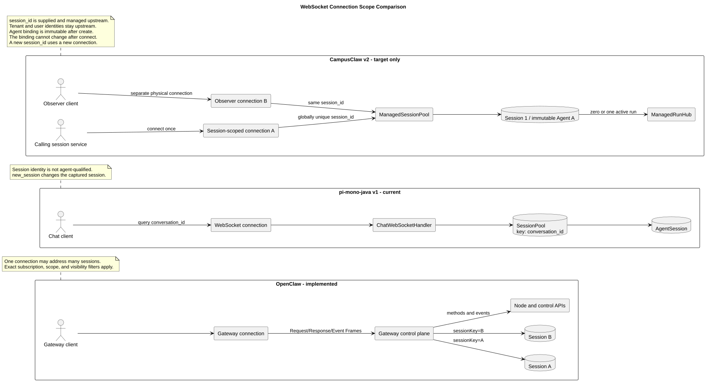
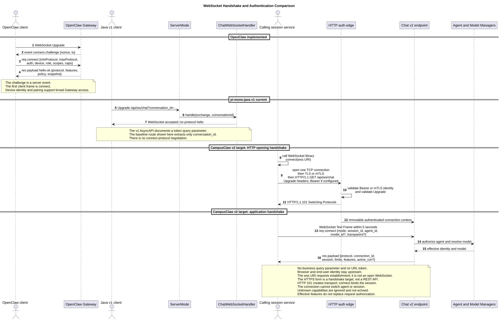
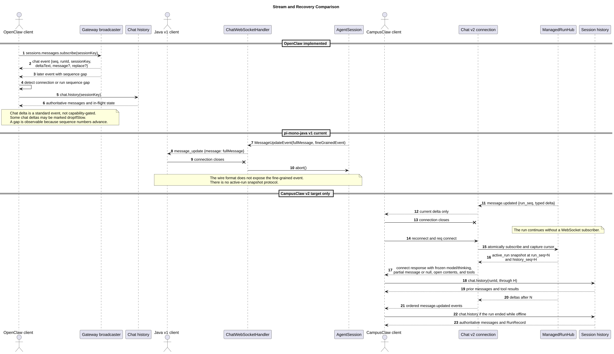
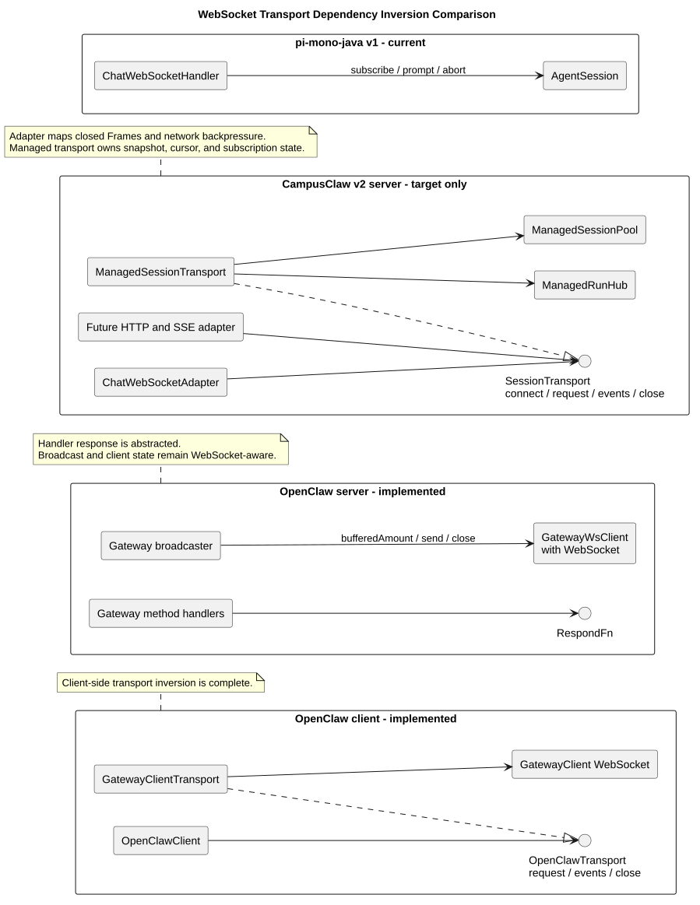

# OpenClaw 与 CampusClaw WebSocket 设计对比

## 1. 文档信息

| 项目 | 值 |
|---|---|
| 文档版本 | `1.3.0` |
| 状态 | 目标设计对比，CampusClaw v2 尚未实现 |
| 更新日期 | 2026-08-02 |
| OpenClaw 源码基线 | `b015925bc30f6a8363f290b07d5f8588e21422b8`，Gateway Protocol v4 |
| pi-mono-java 源码基线 | `1f7a5423219edfa4519d8719f1cc8a188ed72873` |
| CampusClaw 设计基线 | Manager 多 Agent 设计 `1.4.0` |
| CampusClaw 协议制品基线 | `chat-ws-v2.asyncapi.yaml`，协议制品版本 `2.3.0`、协议号 `2` |
| 本文范围 | WebSocket 连接、命令、流式事件、恢复、认证与协议制品 |

本文使用三种状态，不能相互替代：

- **OpenClaw 已实现行为**：来自固定 OpenClaw commit 的源码和文档。
- **pi-mono-java v1 当前行为**：来自固定 Java commit 的代码和现有
  `docs/asyncapi/chat-ws.yaml`；代码和文档不一致处单独标出。
- **CampusClaw WebSocket v2 目标设计**：来自现有 Manager 多 Agent
  设计和中文版 AsyncAPI，尚未落入 Java 实现。

## 2. 先给结论

OpenClaw 和 CampusClaw 解决的是两个不同层级的问题：

- OpenClaw WebSocket 是通用 **Gateway 控制平面**。一条连接完成设备身份、
  角色、scope 和 capability 协商后，可以调用 Chat、Session、Node 以及其他
  Gateway 方法；Chat 请求通过 `sessionKey` 在每次调用时路由。
- CampusClaw v2 是 ToB Agent Runtime 的 **Session-scoped Chat 协议**。
  上层会话服务创建和管理 `session_id`；一条连接在 `connect` 成功后固定绑定
  该 Session 及其不可变 `agent_id`，后续命令不再携带 Session 路由键。
  `session_id` 在 Runtime 部署范围内全局唯一，Runtime 不维护业务
  `tenant_id/user_id`。
- pi-mono-java v1 也是“一条连接操作一个 Session”，但它通过 Upgrade query
  参数选择 `conversation_id`，没有 Agent 维度、协议协商、统一 Frame、
  跨连接 run 所有权和可靠恢复语义。

因此，CampusClaw 应保留 Session-scoped `/api/ws/chat`，借鉴 OpenClaw 的
`req/res/event` Frame、`traceparent`、有效 features、连接序列、run 序列、
幂等请求和权威状态恢复原则，但不复制 Gateway 多路复用、设备配对、累计
Message、慢消费者丢帧和节点控制体系。

CampusClaw 的核心身份限定为 `connection_id`、`session_id`、`agent_id`、
`model_id`、`message_id` 和 `run_id`。Request Frame `id` 与
`tool_call_id` 只是协议局部关联标识，不形成新的 Session 路由层。

如果未来需要全局运维、多 Session 观察、节点控制或统一控制台，应新增独立的
`/api/ws/gateway`，而不是放宽 `/api/ws/chat` 的身份和路由边界。

## 3. 源码与设计证据

### 3.1 OpenClaw：已实现

仓库和固定基线：

```text
repository: https://github.com/openclaw/openclaw
commit:     b015925bc30f6a8363f290b07d5f8588e21422b8
```

| 主题 | 固定源码证据 | 观察到的行为 |
|---|---|---|
| Gateway Protocol v4 | [`docs/gateway/protocol.md#L83-L168`](https://github.com/openclaw/openclaw/blob/b015925bc30f6a8363f290b07d5f8588e21422b8/docs/gateway/protocol.md#L83-L168) | 服务端先发 `connect.challenge`，客户端发 v4 `connect`，成功 Response payload 为 `hello-ok` |
| Frame 和追踪 | [`frames.ts#L12-L18`](https://github.com/openclaw/openclaw/blob/b015925bc30f6a8363f290b07d5f8588e21422b8/packages/gateway-protocol/src/schema/frames.ts#L12-L18)、[`#L156-L198`](https://github.com/openclaw/openclaw/blob/b015925bc30f6a8363f290b07d5f8588e21422b8/packages/gateway-protocol/src/schema/frames.ts#L156-L198) | 源码明确称其为 WebSocket envelope contracts；统一封闭 `req/res/event` Frame，Request Frame 可带 `traceparent` |
| 认证、设备与 features | [`frames.ts#L35-L145`](https://github.com/openclaw/openclaw/blob/b015925bc30f6a8363f290b07d5f8588e21422b8/packages/gateway-protocol/src/schema/frames.ts#L35-L145)、[`docs/gateway/clients.md#L45-L109`](https://github.com/openclaw/openclaw/blob/b015925bc30f6a8363f290b07d5f8588e21422b8/docs/gateway/clients.md#L45-L109) | connect 协商设备身份、role、scope 和客户端 caps；hello 返回 methods、events、capabilities、policy 和全局 snapshot |
| Chat 路由与幂等 | [`logs-chat.ts#L112-L158`](https://github.com/openclaw/openclaw/blob/b015925bc30f6a8363f290b07d5f8588e21422b8/packages/gateway-protocol/src/schema/logs-chat.ts#L112-L158) | `chat.send` 每次携带 `sessionKey` 和 `idempotencyKey`；活动 run 可使用 `queueMode` |
| 精确 Session 订阅 | [`protocol.md#L583-L588`](https://github.com/openclaw/openclaw/blob/b015925bc30f6a8363f290b07d5f8588e21422b8/docs/gateway/protocol.md#L583-L588) | 同一 Gateway 连接可用 `sessions.messages.subscribe` 精确订阅一个 Session 的消息和可选 Approval |
| Chat 事件 | [`logs-chat.ts#L161-L252`](https://github.com/openclaw/openclaw/blob/b015925bc30f6a8363f290b07d5f8588e21422b8/packages/gateway-protocol/src/schema/logs-chat.ts#L161-L252) | Chat 事件携带 `runId/sessionKey/seq`，区分 `status/delta/final/aborted/error` |
| delta 与 replace | [`server-chat.ts#L278-L296`](https://github.com/openclaw/openclaw/blob/b015925bc30f6a8363f290b07d5f8588e21422b8/src/gateway/server-chat.ts#L278-L296)、[`#L922-L944`](https://github.com/openclaw/openclaw/blob/b015925bc30f6a8363f290b07d5f8588e21422b8/src/gateway/server-chat.ts#L922-L944) | 正常前缀增长发送 `deltaText`；前缀不一致时发送 `replace`，事件还可带累计 `message` |
| 广播与背压 | [`server-broadcast.ts#L240-L340`](https://github.com/openclaw/openclaw/blob/b015925bc30f6a8363f290b07d5f8588e21422b8/src/gateway/server-broadcast.ts#L240-L340) | 每个客户端连接独立维护外层 `seq`，按 scope 和精确订阅过滤；慢消费者分支可丢弃 `dropIfSlow` 事件或关闭连接 |
| 重连恢复 | [`docs/gateway/clients.md#L111-L130`](https://github.com/openclaw/openclaw/blob/b015925bc30f6a8363f290b07d5f8588e21422b8/docs/gateway/clients.md#L111-L130) | 重连后重新订阅、读取 `chat.history`、采用 `inFlightRun`；连接或 run 序列缺口触发权威历史重载 |
| 客户端 Transport | [`types.ts#L20-L33`](https://github.com/openclaw/openclaw/blob/b015925bc30f6a8363f290b07d5f8588e21422b8/packages/sdk/src/types.ts#L20-L33)、[`transport.ts#L73-L174`](https://github.com/openclaw/openclaw/blob/b015925bc30f6a8363f290b07d5f8588e21422b8/packages/sdk/src/transport.ts#L73-L174)、[`client.ts#L342-L438`](https://github.com/openclaw/openclaw/blob/b015925bc30f6a8363f290b07d5f8588e21422b8/packages/sdk/src/client.ts#L342-L438) | SDK 依赖 `OpenClawTransport.request/events/close`，`GatewayClientTransport` 封装 WebSocket GatewayClient |
| 服务端解耦边界 | [`shared-types.ts#L110-L116`](https://github.com/openclaw/openclaw/blob/b015925bc30f6a8363f290b07d5f8588e21422b8/src/gateway/server-methods/shared-types.ts#L110-L116)、[`#L337-L353`](https://github.com/openclaw/openclaw/blob/b015925bc30f6a8363f290b07d5f8588e21422b8/src/gateway/server-methods/shared-types.ts#L337-L353)、[`ws-types.ts#L23-L26`](https://github.com/openclaw/openclaw/blob/b015925bc30f6a8363f290b07d5f8588e21422b8/src/gateway/server/ws-types.ts#L23-L26)、[`server-broadcast.ts#L293-L327`](https://github.com/openclaw/openclaw/blob/b015925bc30f6a8363f290b07d5f8588e21422b8/src/gateway/server-broadcast.ts#L293-L327) | Handler 通过 `RespondFn` 与 Frame 发送解耦，但 Gateway client state 和广播仍直接保存、操作 WebSocket |
| Schema 制品 | [`frames.ts#L185-L201`](https://github.com/openclaw/openclaw/blob/b015925bc30f6a8363f290b07d5f8588e21422b8/packages/gateway-protocol/src/schema/frames.ts#L185-L201) | TypeBox closed schema 同时形成运行时验证和 TypeScript 类型来源 |

“Gateway 多路复用”不等于“所有事件无差别发给所有连接”。OpenClaw
广播实现仍按 method、scope、capability、订阅和可见性过滤；这里比较的是
连接可以承载的控制面范围，而不是绕过授权的广播范围。

### 3.2 pi-mono-java v1：当前行为

仓库和固定基线：

```text
repository: https://github.com/superheromeZzh/pi-mono-java
commit:     1f7a5423219edfa4519d8719f1cc8a188ed72873
```

| 主题 | 固定源码证据 | 当前行为 |
|---|---|---|
| Upgrade 路由 | [`ServerMode.java#L377-L391`](https://github.com/superheromeZzh/pi-mono-java/blob/1f7a5423219edfa4519d8719f1cc8a188ed72873/modules/coding-agent-cli/src/main/java/com/campusclaw/codingagent/mode/server/ServerMode.java#L377-L391) | `/api/ws/chat` 从 query 读取 `conversation_id`，随即进入 handler |
| v1 协议文档 | [`docs/asyncapi/chat-ws.yaml#L1-L76`](https://github.com/superheromeZzh/pi-mono-java/blob/1f7a5423219edfa4519d8719f1cc8a188ed72873/docs/asyncapi/chat-ws.yaml#L1-L76)、[`#L170-L181`](https://github.com/superheromeZzh/pi-mono-java/blob/1f7a5423219edfa4519d8719f1cc8a188ed72873/docs/asyncapi/chat-ws.yaml#L170-L181) | AsyncAPI 记录 `conversation_id` 和 query `token` |
| 文档/实现偏差 | [`ServerMode.java#L377-L391`](https://github.com/superheromeZzh/pi-mono-java/blob/1f7a5423219edfa4519d8719f1cc8a188ed72873/modules/coding-agent-cli/src/main/java/com/campusclaw/codingagent/mode/server/ServerMode.java#L377-L391) | 该路由代码只提取 `conversation_id`，没有读取或验证文档中的 query `token`；本文不能把 v1 认证写成已实现 |
| Session 创建 | [`ChatWebSocketHandler.java#L115-L135`](https://github.com/superheromeZzh/pi-mono-java/blob/1f7a5423219edfa4519d8719f1cc8a188ed72873/modules/coding-agent-cli/src/main/java/com/campusclaw/codingagent/mode/server/ChatWebSocketHandler.java#L115-L135) | 建连时立即创建或恢复 Session，一条连接捕获一个 `AgentSession` |
| 命令 | [`ChatWebSocketHandler.java#L195-L227`](https://github.com/superheromeZzh/pi-mono-java/blob/1f7a5423219edfa4519d8719f1cc8a188ed72873/modules/coding-agent-cli/src/main/java/com/campusclaw/codingagent/mode/server/ChatWebSocketHandler.java#L195-L227) | 使用 `prompt/steer/abort/new_session/set_model/...`，没有统一 request ID 和 Frame |
| 活动 run | [`ChatWebSocketHandler.java#L252-L273`](https://github.com/superheromeZzh/pi-mono-java/blob/1f7a5423219edfa4519d8719f1cc8a188ed72873/modules/coding-agent-cli/src/main/java/com/campusclaw/codingagent/mode/server/ChatWebSocketHandler.java#L252-L273) | 正在流式输出时拒绝新的 `prompt`；`steer` 和 `abort` 为独立命令 |
| 累计更新 | [`ChatWebSocketHandler.java#L422-L459`](https://github.com/superheromeZzh/pi-mono-java/blob/1f7a5423219edfa4519d8719f1cc8a188ed72873/modules/coding-agent-cli/src/main/java/com/campusclaw/codingagent/mode/server/ChatWebSocketHandler.java#L422-L459)、[`chat-ws.yaml#L832-L840`](https://github.com/superheromeZzh/pi-mono-java/blob/1f7a5423219edfa4519d8719f1cc8a188ed72873/docs/asyncapi/chat-ws.yaml#L832-L840) | `message_update` 每次发送累计的完整 Message |
| Tool 事件 | [`ChatWebSocketHandler.java#L435-L486`](https://github.com/superheromeZzh/pi-mono-java/blob/1f7a5423219edfa4519d8719f1cc8a188ed72873/modules/coding-agent-cli/src/main/java/com/campusclaw/codingagent/mode/server/ChatWebSocketHandler.java#L435-L486) | 已有独立 `tool_start/tool_update/tool_end`，但使用 v1 特有字段和顶层事件格式 |
| 可利用的内部 delta | [`MessageUpdateEvent.java#L17-L20`](https://github.com/superheromeZzh/pi-mono-java/blob/1f7a5423219edfa4519d8719f1cc8a188ed72873/modules/agent-core/src/main/java/com/campusclaw/agent/event/MessageUpdateEvent.java#L17-L20)、[`AssistantMessageEvent.java#L44-L164`](https://github.com/superheromeZzh/pi-mono-java/blob/1f7a5423219edfa4519d8719f1cc8a188ed72873/modules/ai/src/main/java/com/campusclaw/ai/stream/AssistantMessageEvent.java#L44-L164) | Java 内部事件同时含累计 Message 和 `text/thinking/toolcall` 等细粒度事件，但 v1 WebSocket 未映射后者 |
| 断线语义 | [`ChatWebSocketHandler.java#L168-L188`](https://github.com/superheromeZzh/pi-mono-java/blob/1f7a5423219edfa4519d8719f1cc8a188ed72873/modules/coding-agent-cli/src/main/java/com/campusclaw/codingagent/mode/server/ChatWebSocketHandler.java#L168-L188) | 连接关闭会取消事件订阅，并在流式状态下调用 `AgentSession.abort()` |
| Pool 隔离键 | [`SessionPool.java#L61-L69`](https://github.com/superheromeZzh/pi-mono-java/blob/1f7a5423219edfa4519d8719f1cc8a188ed72873/modules/coding-agent-cli/src/main/java/com/campusclaw/codingagent/mode/server/SessionPool.java#L61-L69)、[`#L176-L202`](https://github.com/superheromeZzh/pi-mono-java/blob/1f7a5423219edfa4519d8719f1cc8a188ed72873/modules/coding-agent-cli/src/main/java/com/campusclaw/codingagent/mode/server/SessionPool.java#L176-L202) | 内存 Session 只按 `conversation_id` 索引，共享 `baseConfig/serverCwd` |
| 心跳 | [`ChatWebSocketHandler.java#L115-L135`](https://github.com/superheromeZzh/pi-mono-java/blob/1f7a5423219edfa4519d8719f1cc8a188ed72873/modules/coding-agent-cli/src/main/java/com/campusclaw/codingagent/mode/server/ChatWebSocketHandler.java#L115-L135) | 发送应用层 JSON `pong`，不是原生 WebSocket Ping/Pong |

### 3.3 CampusClaw v2：目标设计

目标设计以以下仓库内制品为准：

- [Manager 驱动的多 Agent 运行设计 1.4.0](../pi-mono-java-manager-driven-multi-agent-runtime/README.md)
- [CampusClaw Chat WebSocket v2 中文 AsyncAPI 2.3.0](../pi-mono-java-manager-driven-multi-agent-runtime/chat-ws-v2.asyncapi.yaml)

这一部分是 **target-only design**，不是 pi-mono-java 当前行为。相对 Java
v1 的改变属于架构改造和安全加固；相对 OpenClaw 的差异主要属于产品约束。

## 4. 三种连接作用域



[PlantUML 源码：`websocket_connection_scope_comparison`](diagram.puml#L1)

### 4.1 OpenClaw：Gateway-scoped

连接首先代表“某个已认证 Gateway 客户端”，而不是某个 Chat Session。
`chat.send`、`chat.history`、`chat.abort` 都通过请求中的 `sessionKey` 路由，
其他 Gateway 方法还可管理 Session、Node、配置和状态。这个边界适合：

- 单一控制台同时观察或操作多个 Session；
- 桌面端、移动端、节点和自动化客户端共享一个控制面；
- 以设备身份、role、scope、capability 管理不同客户端能力。

代价是每个请求和事件都必须带足路由信息，服务端必须在方法级和资源级重复
授权，客户端也要正确处理不同 Session 的事件交错。

### 4.2 pi-mono-java v1：连接捕获 Session

v1 建连时根据 `conversation_id` 得到 `AgentSession`，handler 在该连接生命周期
内持有它。它看起来也是 Session-scoped，但缺少以下约束：

- Session 记录没有不可变 `agent_id` 绑定，且所有 Session 共享 base cwd，无法
  形成多 Agent 运行隔离；
- `new_session` 可在同一连接内替换 Session，连接身份并非不可变；
- 模型可在连接内改变，却没有 Manager 的 Agent-model 授权；
- run 隶属于连接，断线会 abort；
- 没有重连快照、序列和缺口恢复契约。

### 4.3 CampusClaw v2：严格 Session-scoped

连接在 `connect` 成功后固定：

```text
authenticated calling service
  + session_id supplied by the upstream service
  + agent_id
  + effective model_id
  + thinking disclosure ceiling
  = immutable connection scope
```

后续 `chat.send/steer/abort/history` 不再接受 Agent 或 Session 路由字段。
服务端从连接上下文得到作用域，避免客户端在每帧重新声明目标。新建 Session
必须由上层服务分配新 `session_id` 并建立新连接；同一个 Session 可以存在
多个观察连接，但它们订阅同一个 `ManagedRunHub`。

这是 ToB Agent Runtime 的产品约束和安全加固：Agent 权限、模型、Tool 权限、
thinking 披露和审计天然落在同一个固定边界内。上层服务负责用户鉴权、
tenant/user 归属、会话列表、最多 50 个等产品规则、附件归属以及业务删除；
CampusClaw 只认证调用服务，以全局唯一 `session_id` 作为 Session key，并负责
Runtime 上下文、JSONL 和 run。代价是需要同时观察很多 Session 的调用服务
必须维护多个 WebSocket。

## 5. 统一对比矩阵

| 维度 | OpenClaw 已实现 | pi-mono-java v1 当前 | CampusClaw v2 目标 | 设计原因、收益与代价 |
|---|---|---|---|---|
| 核心定位 | 通用 Gateway 控制平面和节点传输 | Chat 服务端模式 | Agent Runtime 的 Session-scoped Chat 协议 | 原因：收窄 ToB Runtime 边界；收益：降低跨 Agent 授权复杂度；代价：多会话客户端连接更多 |
| 连接作用域 | 一条连接可调用多个 Session 和控制面能力 | 一条连接持有一个 `AgentSession`，但可 `new_session` | 一条连接固定调用方 `session_id` 及其 Agent 绑定 | 原因：固定审计和权限边界；收益：后续帧无需重新路由；代价：不具备 Gateway 式多路复用 |
| Upgrade 输入 | 建立 WebSocket 后进行 challenge/connect | query `conversation_id`；AsyncAPI 还声明 query `token` | 内部服务 Upgrade 不收业务 query 和 URL token | 原因：业务标识只在首个封闭 Frame 中出现；收益：凭据和路由不进入代理 URL 日志；代价：浏览器必须经上层服务接入 |
| 认证 | connect 内认证、设备签名/配对、role/scope | 基线路由没有实现文档所述 query token 校验 | 调用服务 Bearer，入口可叠加 mTLS；不接收 tenant/user 身份 | 原因：Runtime 只建立服务信任；收益：不重复上层用户体系；代价：上层服务成为用户授权责任边界 |
| 握手 | `connect.challenge` → `connect` → `hello-ok` | 没有协议首帧，Upgrade 后直接处理命令 | Upgrade 认证后 5 秒内 `connect` → connect response | 原因：传输认证与业务协商分层；收益：可显式返回 Session 和能力；代价：服务端要维护首帧超时状态 |
| 版本协商 | `minProtocol/maxProtocol`，基线协议 v4 | 无 | `min_protocol/max_protocol`，仅接受 v2 | 原因：管理破坏性变更；收益：不兼容时快速失败；代价：服务端和 SDK 要维护版本矩阵 |
| capability 与 features | 客户端声明 caps；`hello-ok.features` 返回可用 methods/events/capabilities | 无 | 客户端必须支持 `structured_message_delta`；connect `payload.features` 返回按认证、Agent 和服务过滤后的稳定列表 | 原因：能力发现与逐请求授权分离；收益：客户端可适配服务能力，未知 capability 可前向兼容；代价：必须验证过滤、排序和降权 |
| Frame | 封闭 `req/res/event`；成功 Response 使用 `payload` | 按命令 `type` 分发；支持可选 `id` 和 `response`，但没有统一 Frame | 封闭 `req/res/event`；成功 Response 使用 `payload`，错误使用 `error` | 原因：连接内存在并发命令和异步事件；收益：统一响应关联、超时、重试和 SDK 生成；代价：需要统一 dispatcher 和 schema validator |
| 追踪上下文 | Request Frame 可带 `traceparent` | 无协议字段 | 可选 `traceparent` 通过 W3C 校验并传给 Model/Tool Manager，只用于遥测 | 原因：跨 Manager 调用需要关联追踪；收益：无需污染业务载荷；代价：必须隔离 Prompt、JSONL、事件和凭据日志 |
| Agent 路由 | 请求/Session 数据可带 `agentId` | 无 `agent_id` | `mode=create` 必填 `agent_id` 并形成不可变绑定；resume 必须匹配 | 原因：Session 不能跨 Agent 重绑定；收益：防止串用；代价：建连必须访问 Agent Manager |
| Session 路由 | Chat 请求和事件携带 `sessionKey` | Upgrade query 选择 `conversation_id` | 上层服务提供全局唯一 `session_id`；connect create/resume 后不再传 | 原因：Runtime 只消费调用方会话身份；收益：唯一 key 无二次作用域映射且每帧不能改变目标；代价：调用方必须保证全局唯一和协调生命周期 |
| Model 路由 | 由 Gateway/Session 配置体系决定 | `set_model` 直接作用于 Session | `mode=create` 必填 `model_id`；resume 可沿用，切换须 Manager 校验 | 原因：Agent-model allowlist 必须服务端权威；收益：避免未授权模型；代价：增加 Manager 延迟和可用性依赖 |
| 发送 | `chat.send` + `idempotencyKey` | `prompt`，无请求幂等键 | `chat.send` + `idempotency_key`，返回 `run_id` | 原因：网络失败后的结果可能未知；收益：安全重试不重复创建 run；代价：服务端要保存幂等记录 |
| steer | `chat.send.queueMode="steer"` 等队列模式 | 独立 `steer` | 独立 `chat.steer(run_id)` | 原因：显式限定当前 run；收益：命令意图和审计更清晰；代价：不提供 OpenClaw 的完整队列模式 |
| abort | `chat.abort(sessionKey, runId?)` | `abort` 当前 Session | `chat.abort(run_id)`，重复调用幂等 | 原因：避免误终止其他 run；收益：重复请求结果稳定；代价：要保留可查询的 run 终态 |
| history | `chat.history(sessionKey)` | `get_history` | `chat.history` 游标分页、按披露策略投影 | 原因：恢复必须有权威来源；收益：不把瞬时事件当持久事实；代价：需要分页、投影和一致性读取 |
| active run | `queueMode` 可决定活动 run 时行为 | streaming 时拒绝新 `prompt` | 同一 Session 一个主 run，重复 send 返回 `RUN_ACTIVE` | 原因：选择可预测的串行主 run；收益：状态和资源上限简单；代价：复杂排队需由更高层实现 |
| delta | `deltaText`，可附累计 `message`，前缀异常用 `replace` | `message_update` 每次完整累计 Message | `message.updated.update` 只含本次 typed delta | 原因：复用 Java 内部细粒度事件；收益：降低带宽并保留内容类型；代价：客户端状态机更复杂 |
| 完整 Message | delta 中可选，final 中可选，history 权威 | 每次更新都携带 | 仅 `message.completed`、active snapshot 和 history | 原因：分开增量与快照职责；收益：避免累计对象的 O(n²) 传输；代价：客户端在完成前要维护 partial Message |
| thinking | Chat 请求可传 thinking，事件投影受 Gateway 能力约束 | 累计 Message 跟随当前对象 | `hidden/summary/full`，多层授权且实时/恢复/历史一致 | 原因：thinking 是敏感披露面；收益：防止通过恢复或历史旁路；代价：所有读路径都要执行相同投影 |
| Tool 生命周期 | capability 为 `tool-events` 的连接接收结构化事件 | 已有 `tool_start/tool_update/tool_end` 独立事件 | `tool.started/updated/completed` 纳入统一 Event Frame | 原因：统一命名、身份、序列和终态；收益：前端稳定渲染并可恢复；代价：事件与最终 Message 必须对账 |
| 连接序列 | 每客户端外层 `seq`，重连重置 | 无 | 每连接 `seq`，重连重置 | 原因：检测当前连接的丢帧或乱序；收益：缺口可见；代价：不能把它当作跨重连游标 |
| run 序列 | Chat/agent 事件含 run 内 `seq` | 无 | `run_seq` 跨重连连续 | 原因：active run 要跨连接恢复；收益：可去重和精确排序；代价：Hub 要维护游标和有界重放 |
| 序列缺口 | 重连或重载 `chat.history`；部分慢事件允许显式形成缺口 | 无协议行为 | 不静默丢 delta；关闭 1013，重连取原子快照 | 原因：优先保证单 Session Chat 输出完整；收益：不会悄悄缺字；代价：慢客户端承担断线和恢复 |
| run 所有权 | Gateway 暴露 `inFlightRun` 并指导客户端恢复 | WebSocket close 时 abort | `ManagedSessionPool/ManagedRunHub` 持有，连接只订阅 | 原因：网络生命周期不应定义模型生命周期；收益：抖动不终止 run；代价：服务端回收和超时更复杂 |
| 恢复 | 重新订阅、history、in-flight 状态、序列对账 | 仅可恢复已写历史，活动 run 已被 abort | 原子“订阅 + 快照”，再发送 cursor 后 delta；离线完成查 history | 原因：消除订阅与快照竞态；收益：不漏帧也不被旧快照覆盖；代价：Hub 必须提供原子 API 和缓冲 |
| 帧与背压 | hello policy 给限制；广播有 slow-consumer 分支 | v1 无规范化上限和恢复契约 | 默认 1 MiB 帧、4 MiB 缓冲；1009/1013 | 原因：每连接资源必须有界；收益：防止慢连接拖垮服务；代价：大消息需拆分且客户端必须恢复 |
| 心跳 | Gateway policy 和客户端协议支持连接保活 | 应用层 JSON `pong` | 原生 WebSocket Ping/Pong，默认 20 秒 | 原因：让协议栈和基础设施识别保活；收益：业务消息更纯粹；代价：调用服务必须正确处理 Pong 和重连 |
| 附件 | `chat.send.attachments` 可携带附件内容/描述 | v1 消息内附件 | 上层 REST 完成用户授权，WS 只传绑定 session_id 的 `attachment_id[]` | 原因：用户归属和大对象处理不属于 Runtime；收益：边界清晰且便于扫描；代价：调用服务多一个上传阶段 |
| 权限与审计 | role/scope/capability + session visibility | 没有 Agent 维度的协议授权 | 服务身份 + Agent/Model/Tool 校验；tenant/user 留在上层，凭据不进事件/JSONL | 原因：按所有权拆分授权；收益：Runtime 不复制用户体系；代价：服务间凭据和委托能力成为关键依赖 |
| Transport 依赖方向 | SDK 客户端依赖 `OpenClawTransport`；服务端 handler 已抽象 `RespondFn`，但连接状态和广播仍直接依赖 WebSocket | `ChatWebSocketHandler` 直接拥有 Session、订阅和断线 abort | `ChatWebSocketAdapter` 依赖服务端 `SessionTransport`，`ManagedSessionTransport` 拥有业务状态机 | 原因：协议适配与 Session 生命周期分离；收益：可单测并保留未来 Adapter 扩展点；代价：需要严格定义连接与订阅状态机 |
| 协议制品 | TypeBox → 运行时校验、类型和协议 Schema | AsyncAPI 1.0 文档与 Java 手写处理存在偏差 | AsyncAPI 3.1 规范制品，后续 Java 实现必须对齐 | 原因：先固定可评审契约；收益：可生成文档和契约测试；代价：实现前仍没有运行时校验，后续要建设生成链 |

## 6. 握手、认证和能力协商



[PlantUML 源码：`websocket_handshake_comparison`](diagram.puml#L89)

### 6.1 OpenClaw 为什么使用 challenge 和设备身份

OpenClaw Gateway 面向范围广泛的客户端和节点。服务端发送 nonce，客户端把
设备身份、签名、role、scope、capability 与 connect 请求一起提交，适合解决：

- “这个连接是哪台已配对设备”的持续身份；
- operator 与 node 等角色的不同能力；
- 单 Gateway 控制面上的方法级授权；
- 本地、远程、桌面和节点客户端之间的统一接入。

这套体系是 Gateway 产品模型的组成部分，不是所有 WebSocket Chat 都必须复制
的通用规范。

### 6.2 CampusClaw 为什么在 Upgrade 认证调用服务

CampusClaw v2 是内部 Agent Runtime，不直接承接最终用户或浏览器身份：

- 浏览器先连接上层会话服务，由上层完成 Cookie、Origin 和用户授权；
- 上层服务使用 `Authorization: Bearer` 调用 Runtime，部署可叠加 mTLS；
- Runtime 校验 service principal、audience 和 scope，不接收业务
  `tenant_id/user_id`；
- Runtime 调用 Manager 时使用独立 audience 凭据或受控 token exchange；
- 凭据不进入 Prompt、JSONL、WebSocket 事件或业务日志。

完成 transport 认证后，客户端首个业务帧仍必须是 `connect`。它负责协议版本、
客户端能力和 Session 绑定，而不是再次传递长期凭据。`session_id` 始终由
上层会话服务提供并保证在 Runtime 部署范围内全局唯一：`mode=create` 必须
同时提供 `session_id + agent_id + model_id`，相同绑定重试幂等；
`mode=resume` 提供 `session_id + agent_id`，
`model_id` 可省略并沿用已保存值。显式切换模型要经过 Model Manager，活动
run 存在时拒绝；缺失或已删除 Session 不得由 resume 隐式重建。

### 6.3 pi-mono-java v1 需要先承认的缺口

现有 AsyncAPI 写了 query `token`，但固定基线的 Upgrade 路由只读取
`conversation_id`。所以当前状态应表述为“文档存在 token 参数，所分析路由
未实现其验证”，不能在 v2 设计中把它当作可复用的认证实现。

## 7. 命令、并发与响应关联

### 7.1 OpenClaw

OpenClaw 的请求在每帧携带 method 和参数，响应按 request `id` 关联。Chat
请求同时携带 `sessionKey`。`chat.send` 使用 `idempotencyKey`，活动 run 上的
输入可以通过 `queueMode=steer/followup/collect/interrupt` 表达不同队列语义。

这是通用控制面的合理选择：一个连接可并发调用不同方法和不同 Session。
相应代价是路由、权限与幂等必须由每个方法正确执行。

### 7.2 pi-mono-java v1

v1 依据顶层 `type` 分支执行命令。命令可带 `id`，服务端会返回同 `id` 的
`response`，所以它已经具备基础响应关联；但命令、响应和异步事件没有统一
`req/res/event` Frame，错误还是人类可读字符串，也没有稳定错误码和请求
幂等语义。`new_session` 还会在连接内改变当前会话。这对单页原型足够直接，
但不适合 SDK 并发治理、可重试副作用命令和稳定错误处理。

### 7.3 CampusClaw v2

v2 固定三种 Frame：

```text
RequestFrame  = {type:"req", id, method, params?, traceparent?}
ResponseFrame = {type:"res", id, ok, payload? | error?}
EventFrame    = {type:"event", event, seq, payload}
Error         = {code, message, details?, retryable?, retry_after_ms?}
```

三种顶层对象都封闭，未知字段直接返回 `INVALID_REQUEST`；成功响应只使用
`payload`，错误响应只使用 `error`。`traceparent` 最长 128 字符，必须通过
W3C Trace Context 解析，解析后的不可变上下文只向 Model Manager 和 Tool
Manager 传播，不写入 Prompt、JSONL、业务事件或凭据日志。

连接内命令固定为：

- `chat.send`
- `chat.steer`
- `chat.abort`
- `chat.history`
- `session.get`
- `models.list`
- `model.set`
- `thinking.set`
- `prompt_templates.list`
- `skills.list`

同一 Session 只允许一个主 run。活动期间再次 `chat.send` 返回
`RUN_ACTIVE`，`model.set` 和 `thinking.set` 也拒绝；`chat.steer` 必须指定
当前 `run_id`，`chat.abort` 对重复调用保持幂等。该选择放弃 OpenClaw 的多种
队列模式，换取 ToB Chat 更容易解释和审计的并发规则。

## 8. 流式事件与消息语义

### 8.1 OpenClaw 的兼容型 delta

OpenClaw Chat `delta` 同时提供三种客户端可利用的信息：

- `deltaText`：相对上一可见文本的新后缀；
- `message`：可选的累计 Message；
- `replace=true`：服务端发现新文本不是旧文本前缀时，要求客户端用新值替换。

这种设计能兼容逐步演进的客户端，也能处理模型输出被重写的情况。代价是
delta 和累计快照可能同时存在，客户端必须实现清晰的优先级。

### 8.2 Java v1 为什么会重复传累计 Message

Java 内部 `MessageUpdateEvent` 已经同时保存累计 `AssistantMessage` 和
细粒度 `AssistantMessageEvent`。v1 handler 选择前者映射为
`message_update.message`，所以生成长度为 `n` 的回答时，网络会反复发送不断
增长的对象，最坏总传输量趋近 O(n²)。这种格式不是 WebSocket 规范违规，但
效率低，且 Tool、thinking、文本增量只能通过完整对象差分解释。

### 8.3 CampusClaw v2 的 typed delta

v2 事件族为：

```text
run.started
message.started
message.updated
tool.started
tool.updated
tool.completed
message.completed
run.completed
```

`message.updated.payload.update` 直接映射 Java 已有
`AssistantMessageEvent`：

```text
text_start / text_delta / text_end
thinking_start / thinking_delta / thinking_summary / thinking_end
toolcall_start / toolcall_delta / toolcall_end
```

每个更新携带 `agent_id`、`session_id`、`run_id`、`message_id`、
`run_seq`、`content_index` 和时间戳；delta 只携带本次变化。完整 Message
只出现在 `message.completed`、重连 active-run snapshot 和 `chat.history`。

收益是带宽、类型和事件职责更清晰；代价是客户端必须维护按
`message_id + content_index` 合并的状态机，并在终态用完整 Message 对账。

## 9. 断线、序列与恢复



[PlantUML 源码：`websocket_stream_recovery_comparison`](diagram.puml#L160)

### 9.1 OpenClaw：重新投影权威状态

OpenClaw 客户端文档要求把重连视为对“持久历史 + 当前内存 run”的新投影：

1. 重新建立 Session 和消息订阅；
2. 调用 `chat.history(sessionKey)` 替换本地持久消息；
3. 如果存在 `inFlightRun`，采用其 `runId`、缓冲文本和计划；
4. 对照 Session 的 active-run 信息；
5. 后续按 run ID 和 run 内 `seq` 去重、排序；前向缺口触发权威历史重载。

外层 Event `seq` 只在当前连接内递增，重连会重置。Chat/agent payload 的序列
按 run 维护。两者不能混为一个全局事件游标。

OpenClaw 广播还允许对部分 `dropIfSlow` 事件推进序列但不发送，因此“检测到
缺口后恢复”是设计组成，而不是只为异常网络准备的兜底。

### 9.2 Java v1：连接就是 run 生命周期

v1 在 WebSocket close hook 中取消订阅，并对正在流式运行的 Session 调用
`abort()`。因此它没有“断线期间 run 继续、重连订阅原 run”的状态。已经写入
Session 的历史仍可再次读取，但 active run 被连接生命周期终止。

### 9.3 CampusClaw v2：ManagedRunHub 原子恢复

v2 把所有权从连接移到 `ManagedSessionPool/ManagedRunHub`：

```text
WebSocket connection = subscriber
ManagedRunHub         = active run owner
Session history       = completed-message authority
```

连接关闭只取消订阅，不调用 `AgentSession.abort()`。Hub 持续维护 partial
Message、active tools、终态和 `run_seq`。

重连必须原子完成“注册订阅 + 捕获 cursor/snapshot”：

1. connect 响应返回
   `active_run {run_id, run_seq, message_snapshot, active_tools}`；
2. 然后发送该 cursor 之后的 delta；
3. 如果 run 在断线期间已经结束，客户端通过 `chat.history` 读取持久化终态。

原子性解决一个具体竞态：若先取快照再订阅，二者之间产生的 delta 会永久丢失；
若先订阅再异步取快照，客户端可能先看到新 delta 又被旧快照覆盖。

## 10. Flow control、心跳与错误

### 10.1 OpenClaw

`hello-ok` 返回连接 policy。Gateway 广播对每个连接维护 buffered amount 和
序列；慢消费者上的可丢事件可以被跳过，其他情况关闭连接。客户端以序列缺口
和权威重载恢复。

### 10.2 CampusClaw v2

v2 选择更严格的 Chat 输出策略：

- 默认单帧上限 1 MiB，连接缓冲上限 4 MiB，以 connect response 的实际值为准；
- 超限帧使用 WebSocket close code `1009`；
- 慢消费者使用 `1013`，要求重连恢复；
- 不静默丢弃 `message.updated` delta；
- 使用原生 WebSocket Ping/Pong，默认 20 秒。

这不是对 OpenClaw 的“修正”，而是产品取舍。CampusClaw 将单 Session Chat
的输出完整性置于同连接连续性之上：无法跟上的客户端被断开，再从 Hub 快照
恢复。服务端因此必须保证快照有界、重放缓冲有界，并及时回收无人订阅的 run。

v2 稳定错误码至少包括：

```text
INVALID_REQUEST
UNAUTHENTICATED
FORBIDDEN
UNSUPPORTED_PROTOCOL
AGENT_NOT_FOUND
SESSION_NOT_FOUND
MODEL_REQUIRED
MODEL_NOT_ALLOWED
RUN_ACTIVE
RUN_NOT_FOUND
INVALID_ATTACHMENT
MANAGER_AUTH_FAILED
MANAGER_UNAVAILABLE
```

## 11. Thinking、Tool、附件与审计

### 11.1 Thinking

CampusClaw v2 固定三级披露：

- `hidden`：默认，只发送 thinking 开始/结束状态；
- `summary`：只发送 Model Manager 明确提供的安全摘要，不从原始 thinking 合成；
- `full`：同时满足调用服务 scope、Agent、Model、可选委托披露上限和客户端
  capability 才可用。

`chat.send` 只能降低允许级别，不能提升；实时事件、重连快照和历史读取必须
使用相同投影策略。这是安全加固，避免调用方通过“换一个读取路径”获取本不该
披露的 thinking。

OpenClaw 也有 thinking 输入和 capability-gated 事件，但它服务于 Gateway
能力投影。CampusClaw 的额外约束来自上层服务、Agent 与 Model 的分层授权，
不要求 Runtime 建模 tenant 或 user。

### 11.2 Tool 生命周期

OpenClaw 使用 `tool-events` capability 控制连接能否接收实时结构化 Tool
事件。CampusClaw v2 也把 Tool 拆成 `tool.started/updated/completed`，但
连接身份和 Agent 已固定，投影还要遵循该 Agent 的 Tool 权限。

WebSocket 的 Tool 事件只是“向客户端披露执行状态”，不承担 Tool Manager
的执行授权。Tool Manager 仍应按 `agent_id + tool_id` 在每次调用时检查绑定、
状态、权限和参数。

### 11.3 附件

OpenClaw `chat.send` Schema 允许携带附件 envelope。CampusClaw v2 改为：

1. 通过 REST 上传；
2. 上层服务完成大小限制、MIME/安全处理、tenant/user 归属和业务授权；
3. 上层服务把附件绑定到全局 `session_id`；
4. WebSocket `chat.send` 只提交 `attachment_id[]`；
5. Runtime 只校验附件存在、未过期、Session 绑定和 Agent 可用性。

这是安全加固和架构改造。收益是 WebSocket 保持轻量、附件可复用且容易审计；
代价是客户端多一个上传阶段，并要处理制品过期。

### 11.4 凭据和审计

CampusClaw 的服务 Bearer、mTLS 身份和 Manager-audience 凭据都不能进入
Prompt、JSONL、WebSocket 事件或业务日志。审计事件使用 service principal
和稳定资源 ID，敏感凭据只保留在不可变连接认证上下文或服务间调用上下文中。

## 12. 协议制品差异

### 12.1 OpenClaw：Schema 与实现同源

OpenClaw 的 `frames.ts`、`logs-chat.ts` 使用 TypeBox 定义 closed object、
union、枚举和边界。相同定义可用于：

- TypeScript 静态类型；
- Gateway 运行时请求/事件校验；
- 下游协议 Schema 和客户端类型。

这降低“文档写了一套、handler 实现另一套”的风险，但并不能消除业务授权、
状态机和兼容性测试的需要。

### 12.2 Java v1：文档与实现已经出现偏差

v1 AsyncAPI 描述了 query token，但分析到的 `ServerMode` 路由没有提取它；
handler 也以手写 `type` 分支处理消息。因此 AsyncAPI 目前更接近说明文档，
不是实现的唯一可执行来源。

### 12.3 CampusClaw v2：AsyncAPI 是规范，但尚不是实现

中文版 [AsyncAPI 3.1 制品](../pi-mono-java-manager-driven-multi-agent-runtime/chat-ws-v2.asyncapi.yaml)
完整描述安全方案、connect、命令、响应、事件、Schema、错误和例子。Java
落地时应：

- 从同一 Schema 生成或复用 DTO/validator；
- 在解码后、进入 `SessionTransport` 前完成 Frame 和参数校验；
- 用契约测试验证 Java 编解码与 AsyncAPI example；
- 将现有 `docs/asyncapi/chat-ws.yaml` 替换为 v2 制品；
- 保留业务授权、active-run 状态校验和 Manager 校验，不能只依赖 JSON Schema。

在这些实现完成前，本文只能称它为目标协议。

### 12.4 Transport 依赖方向



[PlantUML 源码：`websocket_transport_dependency_inversion_comparison`](diagram.puml#L233)

OpenClaw 最新 SDK 已把客户端依赖倒置到
`OpenClawTransport.request/events/close`，`GatewayClientTransport` 再封装
WebSocket 客户端；这是完整的客户端 Transport 边界。服务端 method handler
通过 `RespondFn` 隔离具体发送动作，但 `GatewayWsClient` 和广播器仍直接持有
WebSocket、检查 `bufferedAmount` 并调用 `send/close`，不能把客户端接口反推
成“服务端也已完全传输无关”。

CampusClaw v2 的目标边界位于服务端：

```text
ChatWebSocketAdapter -> SessionTransport <- ManagedSessionTransport
```

Adapter 只负责 Upgrade、Frame 编解码、协议关闭码和网络背压；
`ManagedSessionTransport` 负责 connect 原子快照、请求状态机、事件订阅和
Session 生命周期。`close()` 只解除该连接订阅，不终止 active run。这个架构
变化为 HTTP + SSE 等未来 Adapter 留出扩展点，但本版不定义另一套线上协议。

## 13. 最小线协议示例

以下示例只用于说明关键差异，字段全集以各自固定 Schema 为准。

### 13.1 challenge 握手与 Upgrade 认证后 connect

OpenClaw：

```json
{"type":"event","event":"connect.challenge","payload":{"nonce":"n-1","ts":1760000000000}}
{"type":"req","id":"c-1","method":"connect","params":{"minProtocol":4,"maxProtocol":4,"client":{"id":"cli","version":"1.0.0","platform":"macos","mode":"operator"},"role":"operator","scopes":["operator.read"],"caps":["tool-events"],"auth":{"token":"***"},"device":{"id":"device-1","publicKey":"***","signature":"***","signedAt":1760000000000,"nonce":"n-1"}}}
{"type":"res","id":"c-1","ok":true,"payload":{"type":"hello-ok","protocol":4,"server":{"version":"1.0.0","connId":"conn-1"},"features":{"methods":["chat.send"],"events":["chat"]},"snapshot":{"presence":[],"health":{},"stateVersion":{"presence":0,"health":0},"uptimeMs":1},"auth":{"role":"operator","scopes":["operator.read"]},"policy":{"maxPayload":26214400,"maxBufferedBytes":52428800,"tickIntervalMs":15000}}}
```

CampusClaw v2：

```text
GET /api/ws/chat
Authorization: Bearer ***           # calling session service
# Deployment may additionally require mTLS.
```

```json
{"type":"req","id":"connect-1","method":"connect","traceparent":"00-4bf92f3577b34da6a3ce929d0e0e4736-00f067aa0ba902b7-01","params":{"mode":"create","min_protocol":2,"max_protocol":2,"session_id":"01ARZ3NDEKTSV4RRFFQ69G5FAV","agent_id":"agent-a","model_id":"model-a","client":{"id":"campusclaw-session-service","version":"1.0.0","platform":"service"},"capabilities":["structured_message_delta","future_client_capability"]}}
{"type":"res","id":"connect-1","ok":true,"payload":{"protocol":2,"connection_id":"conn-1","session_id":"01ARZ3NDEKTSV4RRFFQ69G5FAV","agent_id":"agent-a","model":{"model_id":"model-a","name":"模型 A","reasoning":true},"session":{"state":"idle","thinking":"hidden"},"limits":{"max_frame_bytes":1048576,"max_connection_buffer_bytes":4194304,"heartbeat_seconds":20,"connect_timeout_seconds":5},"features":{"methods":["chat.send","chat.steer","chat.abort","chat.history","session.get","models.list","model.set","thinking.set","prompt_templates.list","skills.list"],"events":["run.started","message.started","message.updated","tool.started","tool.updated","tool.completed","message.completed","run.completed"],"capabilities":["structured_message_delta"]},"active_run":null}}
```

关键差异：OpenClaw challenge 证明设备请求的新鲜性并服务于配对体系；
CampusClaw 已在 Upgrade 完成调用服务认证，connect 只做协议与 Session 绑定。
最终用户和浏览器身份留在上层会话服务。
客户端的未知 capability 被忽略且不回显；`features` 是当前连接的有效发现列表，
不代替后续逐请求授权。

### 13.2 每次请求携带 `sessionKey` 与连接预绑定 Session

OpenClaw：

```json
{"type":"req","id":"send-1","method":"chat.send","params":{"sessionKey":"agent:main:session-a","message":"你好","idempotencyKey":"idem-1"}}
{"type":"req","id":"send-2","method":"chat.send","params":{"sessionKey":"agent:main:session-b","message":"继续","idempotencyKey":"idem-2"}}
```

CampusClaw v2，同一连接只可能发送到 connect 已绑定的 Session：

```json
{"type":"req","id":"send-1","method":"chat.send","params":{"message":"你好","attachment_ids":[],"idempotency_key":"idem-1"}}
{"type":"res","id":"send-1","ok":true,"payload":{"run_id":"run-1","accepted":true}}
```

CampusClaw 后续请求里没有 `agent_id` 或 `session_id`，不是信息缺失，而是避免
客户端逐帧改变授权目标。

### 13.3 `deltaText/message/replace` 与结构化 `message.updated`

OpenClaw：

```json
{"type":"event","event":"chat","seq":18,"payload":{"state":"delta","runId":"run-1","sessionKey":"agent:main:session-a","seq":7,"deltaText":"世界","message":{"role":"assistant","content":[{"type":"text","text":"你好世界"}]}}}
{"type":"event","event":"chat","seq":19,"payload":{"state":"delta","runId":"run-1","sessionKey":"agent:main:session-a","seq":8,"deltaText":"修订后的完整文本","replace":true}}
```

CampusClaw v2：

```json
{"type":"event","event":"message.updated","seq":18,"payload":{"agent_id":"agent-a","session_id":"01ARZ3NDEKTSV4RRFFQ69G5FAV","run_id":"run-1","message_id":"message-1","run_seq":7,"content_index":0,"timestamp":"2026-07-30T10:00:00Z","update":{"type":"text_delta","delta":"世界"}}}
{"type":"event","event":"message.completed","seq":19,"payload":{"agent_id":"agent-a","session_id":"01ARZ3NDEKTSV4RRFFQ69G5FAV","run_id":"run-1","message_id":"message-1","run_seq":8,"timestamp":"2026-07-30T10:00:01Z","message":{"message_id":"message-1","role":"assistant","status":"completed","content":[{"type":"text","text":"你好世界"}],"created_at":"2026-07-30T10:00:00Z"}}}
```

OpenClaw 的 `replace` 对可见文本重写更宽容；CampusClaw v2 的 typed delta
更严格，若底层模型发生非前缀重写，Provider 适配器必须把它映射为协议支持的
结构化更新或终止为结构化错误，不能偷偷把累计 Message 塞回 delta。

## 14. 关键设计决定

### 14.1 保留的 OpenClaw 原则

| 原则 | CampusClaw 采用方式 |
|---|---|
| 统一 Frame | 所有命令使用封闭 `req/res`，异步流使用封闭 `event`，成功响应统一为 `payload` |
| 分布式追踪 | Request Frame 可带经 W3C 校验的 `traceparent`，只传播到 Manager 遥测上下文 |
| 显式版本协商 | connect 使用 min/max protocol |
| capability 与 feature 投影 | 客户端声明可理解能力，connect 返回经授权和服务能力过滤的 methods/events/capabilities |
| 幂等副作用请求 | `chat.send` 使用 idempotency key，abort 保持幂等 |
| 双层排序概念 | 连接 `seq` 与跨重连 `run_seq` 分离 |
| 权威状态恢复 | active snapshot + history，而不是猜测漏失 delta |
| 有界流控 | 帧、缓冲、慢消费者策略在握手后可见 |
| Transport 边界 | 借鉴客户端传输抽象原则，在 CampusClaw 服务端定义 `SessionTransport`，隔离网络 Adapter 与 Session 状态机 |

### 14.2 不复制的 OpenClaw 机制

| 机制 | 不复制的原因 | CampusClaw 替代 |
|---|---|---|
| 一条连接路由多个 Session | ToB Runtime 要固定调用方 Session、Agent、模型和披露边界 | 每个 Session 一条 Session-scoped 连接 |
| 设备配对和 challenge 签名体系 | Runtime 只信任上层调用服务，不直接认证设备或最终用户 | 服务 Bearer/mTLS Upgrade 认证 + connect 绑定 |
| Node 和全局控制面方法 | `/api/ws/chat` 只服务对话 | 未来独立 `/api/ws/gateway` |
| 多种 active-run queue mode | 当前产品需要可预测的单主 run | `RUN_ACTIVE` + 显式 steer/abort |
| 慢消费者丢弃 Chat delta | 单 Session Chat 更重视输出连续性 | 1013 断开 + 原子快照恢复 |
| Gateway 全局 `stateVersion` | Chat 连接没有全局 presence/health 快照 | 连接 `seq` + run `run_seq` + active snapshot + history |
| inline 大附件 | 企业附件需要独立归属、扫描和审计 | REST 上传 + attachment ID |

### 14.3 相对 Java v1 的改造分类

| 变化 | 分类 | 原因 |
|---|---|---|
| 全局唯一 `session_id` Pool key，Agent 为固定绑定 | 架构改造 | 上层拥有用户归属，Runtime 只维护执行上下文 |
| 服务 Bearer/mTLS Upgrade 认证和无 URL token | 安全加固 | 防泄漏并固定调用服务身份，不复制用户认证体系 |
| `connect` 首帧 | 架构改造 | 协议、能力、Agent、Model 的显式协商 |
| 封闭 Frame、`payload` 和 `traceparent` | 架构改造 | 契约校验、追踪传播和响应关联 |
| `ChatWebSocketAdapter -> SessionTransport` | 架构改造 | 协议适配与 Session/run 生命周期解耦 |
| 删除连接内 `new_session` | 产品约束 | 保持连接作用域不可变 |
| 累计 Message 改 typed delta | 架构改造 | 带宽和事件类型 |
| run 从 WebSocket 移到 Hub | 架构改造 | 断线继续执行和多观察者 |
| thinking 同策略投影 | 安全加固 | 防止通过历史/快照旁路 |
| REST 附件 | 安全加固、架构改造 | 所有权、扫描、流控和审计 |

## 15. 未来 Gateway 边界

只有出现以下需求时，才应设计新的 `/api/ws/gateway`：

- 一个运维连接观察大量 Agent/Session；
- 全局 Session 列表、运行状态和告警；
- 节点注册、节点能力和远程控制；
- 跨 Session 调度、批量操作或统一事件总线；
- 面向桌面/移动控制台的设备身份和配对。

新的 Gateway 可以借鉴 OpenClaw 的 `sessionKey` 路由、role/scope/capability、
challenge 和订阅过滤，但它应是独立安全域。`/api/ws/chat` 继续保持
Session-scoped，不因为 Gateway 存在而允许连接内切换 Agent 或 Session。

## 16. 实施与验收重点

后续 Java 实施至少需要验证：

- `mode=create/resume` 的 `session_id/agent_id/model_id` 规则，以及上层提供
  `session_id`、删除后不复用的边界；
- 服务 Bearer、可选 mTLS、audience、scope 和过期凭据；
- 三类封闭 Frame 的判别、未知顶层字段拒绝和 `payload/error` 互斥；
- `traceparent` 缺失、合法、非法和到 Model/Tool Manager 的只读传播；
- 未知 capability 忽略、必需 capability 缺失拒绝、`full_thinking` 只能降权；
- connect `features` 的稳定排序、去重和按连接授权过滤，且不替代逐请求授权；
- 两个 Session 并发、全局 session ID 重复被拒绝、同一 Session 跨 Agent
  重绑定被拒绝；
- 同一 Session 多观察连接共享一个 active run；
- 重复 send、steer、abort 和模型切换的状态机；
- 断线期间 run 继续、原子快照与后续 delta 无竞态；
- 连接 `seq` 与 `run_seq` 缺口处理；
- `hidden/summary/full` 在实时、快照和历史上的一致投影；
- Tool 生命周期事件与终态 Message 对账；
- 未绑定当前 session_id 的附件、Manager 认证失败、帧超限和慢消费者恢复；
- `SessionTransport` 状态机、单订阅、背压、幂等 close 和断线不终止 run；
- Java DTO、validator、事件编码与 AsyncAPI example 的契约一致性。

## 17. 阅读路径

1. 先看本文第 2 节和第 5 节，确定三种系统不是同一产品边界。
2. 再看四个 PlantUML 图，建立连接、握手、恢复和 Transport 依赖方向的心智模型。
3. 查看
   [Manager 多 Agent 运行设计](../pi-mono-java-manager-driven-multi-agent-runtime/README.md)
   理解 CampusClaw Manager、Session 和 Tool/Model 边界。
4. 查看
   [中文版 AsyncAPI](../pi-mono-java-manager-driven-multi-agent-runtime/chat-ws-v2.asyncapi.yaml)
   获取 v2 字段级契约。
5. 实施时回到本文第 3 节的固定源码链接，不以 OpenClaw 当前 `main` 或
   pi-mono-java 当前分支替代这里记录的基线。

## 18. 版本历史

| 版本 | 日期 | 变更 |
|---|---|---|
| `1.3.0` | 2026-08-02 | 同步 CampusClaw Manager 1.4.0 与 AsyncAPI 2.3.0；Runtime 改以全局唯一 session_id 为唯一隔离键，tenant/user 和浏览器认证留在上层会话服务，Upgrade 只认证调用服务 |
| `1.2.0` | 2026-08-02 | 同步 CampusClaw Manager 1.3.0 与 AsyncAPI 2.2.0；明确上层服务拥有 session_id、CampusClaw 使用 SessionScope 和不可变 Agent 绑定，并统一六类核心 Runtime 标识 |
| `1.1.0` | 2026-07-31 | OpenClaw 基线升级到 `b015925…` 和 Protocol v4；补充 Frame、`traceparent`、精确 Session 订阅、混合 delta、客户端 Transport 与服务端解耦边界，并同步 CampusClaw AsyncAPI 2.1.0 目标 |
| `1.0.0` | 2026-07-30 | 首版；建立 OpenClaw 已实现、pi-mono-java v1 当前和 CampusClaw v2 目标三态对比 |
