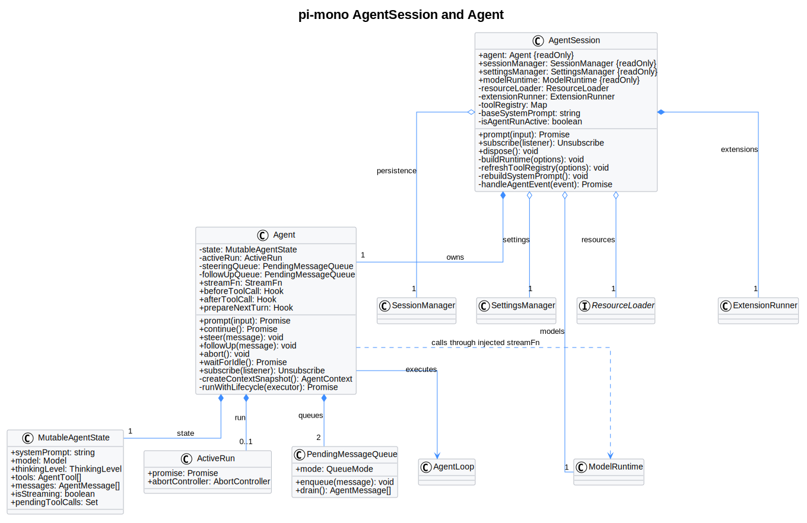

# pi-mono AgentSession 初始化与组件职责

| 属性 | 值 |
|---|---|
| 文档版本 | 0.2.1 |
| 状态 | Draft，供架构分析 |
| pi-mono 源码基线 | `216e672e7c9fc65682553394b74e483c0c9e47f7` |
| 基线日期 | 2026-07-22 |
| 范围 | `AgentSession`、`Agent`、`SessionManager`、`SettingsManager`、`ResourceLoader`、`ModelRuntime`、`ExtensionRunner` 的初始化、职责和协作 |
| 图示形式 | Markdown 与 PlantUML 类图；PlantUML 源码与生成 SVG 同步维护 |

除明确标记的 Managed Agent 对照外，本文描述的是上述 pi-mono 源码基线中观察到的行为。伪代码会隐藏错误诊断、项目信任 UI、传输参数等细节，不代表存在同名公开 API。

## 1. 结论

在 pi-mono 中，`AgentSession` 是上层会话编排对象，`Agent` 是底层模型与 Tool 循环的有状态执行对象。一个 `AgentSession` 持有且只持有一个独立 `Agent`。

```text
AgentSession
    owns exactly one Agent
    |
    +-- SessionManager
    +-- SettingsManager
    +-- ResourceLoader
    +-- ModelRuntime
    +-- ExtensionRunner
    +-- Tool / Skill / Prompt runtime view
    |
    +-- Agent
        +-- systemPrompt
        +-- model
        +-- thinkingLevel
        +-- tools
        +-- messages
        +-- active Run
        +-- steering / follow-up queue
```

核心职责：

| 对象 | 主要职责 |
|---|---|
| `Agent` | 保存模型执行状态，调用模型，执行 Tool 循环，维护消息、队列和当前 Run |
| `AgentSession` | 为当前会话装配 Agent 所需的 Tool、Skill、system prompt 和 Extension Runtime，协调持久化、重试、压缩与事件 |
| `AgentSessionRuntime` | 持有当前 `AgentSession + cwd-bound services`，负责 new、resume、fork、import 时销毁旧 Session 并创建新 Session |
| `SessionManager` | 持久化 JSONL、恢复消息、记录模型和 thinking level 变化、维护会话分支 |

生命周期约束：

```text
Session A -> AgentSession A -> Agent A
Session B -> AgentSession B -> Agent B
```

不应让多个 Session 共享同一个 `Agent`。恢复历史会话时，也不是复用旧 `Agent`，而是根据持久化信息创建新的 `Agent + AgentSession`。

## 2. pi-mono 实际创建层次

pi-mono 没有一个与 pi-mono-java `AgentSession.initialize(config)` 一一对应的公开方法。它把初始化分成四层：

```text
createAgentSessionRuntime()
    -> 持有当前 Session Runtime
    -> 在 new / resume / fork / import 时替换整个 Runtime

createAgentSessionServices()
    -> 创建 cwd-bound services
    -> 加载 Settings、ModelRuntime 和 ResourceLoader

createAgentSessionFromServices()
    -> 将已创建的 services 与 Session 参数交给 createAgentSession()

createAgentSession()
    -> 恢复会话状态
    -> 解析模型和 thinking level
    -> 创建 Agent
    -> 创建 AgentSession
    -> AgentSession 构造阶段执行私有 _buildRuntime()
```

CLI 主路径使用上述层次。SDK 调用方也可以直接调用 `createAgentSession()`，并传入已经创建的 Manager 或 Loader。

## 3. 同粒度初始化伪代码

以下伪代码与 pi-mono-java `initialize()` 概览保持相近粒度。它是语言无关伪代码，不是 TypeScript 精确语法。

### 3.1 创建 AgentSession

```text
async function createPiAgentSession(options):
    // 解析当前 Session 使用的工作目录；cwd 决定项目配置、Skill、Extension 和上下文文件的加载范围。
    cwd = resolveCwd(options)

    // 解析 Agent 全局配置目录，该目录包含 auth.json、models.json 以及用户级资源。
    agentDir = resolveAgentDir(options)

    // 创建或复用模型运行环境；ModelRuntime 负责模型注册、认证和模型调用。
    modelRuntime =
        options.modelRuntime
        ?? createModelRuntime(agentDir)

    // 创建或复用当前 cwd 的配置视图。
    settingsManager =
        options.settingsManager
        ?? createSettingsManager(cwd, agentDir)

    // 创建新 SessionManager 或打开已有 Session；SessionManager 负责 JSONL 与会话树，不调用模型。
    sessionManager =
        options.sessionManager
        ?? createOrOpenSession(cwd, options)

    // 创建统一资源加载器。
    resourceLoader =
        options.resourceLoader
        ?? createResourceLoader({
            cwd,
            agentDir,
            settingsManager
        })

    // 只有由当前函数新建 Loader 时才在此 reload；CLI services 路径会在 createAgentSessionServices() 中提前完成该步骤。
    if resourceLoader is newly created:
        await resourceLoader.reload()

    // 从 SessionManager 解析当前分支的会话上下文；新 Session 返回空消息，恢复 Session 时包含历史消息、模型和 thinking level。
    existingSession =
        sessionManager.buildSessionContext()

    // 按优先级选择模型：1. 调用方显式模型；2. Session 保存的模型；3. Settings 默认模型；4. 可用 Provider 默认模型。
    model = resolveModel({
        requestedModel: options.model,
        restoredModel: existingSession.model,
        settingsManager,
        modelRuntime
    })

    // 按调用参数、Session 记录、Settings 和 pi 默认值选择 thinking level，再根据模型能力进行 clamp。
    thinkingLevel = resolveThinkingLevel({
        requestedLevel: options.thinkingLevel,
        restoredLevel:
            existingSession.thinkingLevel,
        settingsManager,
        model
    })

    // 计算初始启用的 Tool 名称；此时只确定名称选择，还没有构建最终 Tool 实例。
    activeToolNames = resolveInitialToolNames({
        defaults: [
            "read",
            "bash",
            "edit",
            "write"
        ],
        allowlist: options.tools,
        denylist: options.excludeTools,
        noTools: options.noTools
    })

    // 先创建底层有状态 Agent；最终 Tool 和 system prompt 会由后续 AgentSession 构造阶段完成，因此先使用空值。
    agent = new Agent({
        initialState: {
            systemPrompt: "",
            model,
            thinkingLevel,
            tools: []
        },

        // 模型执行最终转发到 ModelRuntime。
        streamFn:
            modelRuntime.streamSimple,

        sessionId:
            sessionManager.getSessionId(),

        steeringMode:
            settingsManager.getSteeringMode(),

        followUpMode:
            settingsManager.getFollowUpMode()
    })

    // 恢复历史消息；对新 Session，existingSession.messages 是空列表。
    agent.state.messages =
        existingSession.messages

    // 新 Session 会记录初始模型和 thinking level，便于之后恢复。
    if existingSession is empty:
        if model exists:
            sessionManager.appendModelChange(model)
        sessionManager.appendThinkingLevelChange(
            thinkingLevel
        )

    // 创建上层 AgentSession；构造函数会订阅 Agent 事件、安装 Tool Hook，并同步调用私有 _buildRuntime()。
    session = new AgentSession({
        agent,
        sessionManager,
        settingsManager,
        resourceLoader,
        modelRuntime,
        cwd,
        initialActiveToolNames:
            activeToolNames,
        allowedToolNames:
            options.tools,
        excludedToolNames:
            options.excludeTools,
        customTools:
            options.customTools
    })

    // 此时 Agent 已具备最终 Tool、Skill 清单和 system prompt；创建 Session 本身不会立即调用模型。
    return session
```

### 3.2 ResourceLoader 加载顺序

`DefaultResourceLoader.reload()` 的高层顺序：

```text
async function ResourceLoader.reload(options):
    // 如果要求项目信任确认，先以未信任状态加载安全的 Extension 集合，再获取信任决定。
    resolveProjectTrustIfRequired(options)

    // 按当前信任状态重载用户级和项目级 Settings。
    await settingsManager.reload()

    // 解析 Package 和显式资源路径，并过滤 enabled=false 的资源。
    resolvedResources =
        await packageManager.resolve()

    // 先加载 Extension 定义与 Extension Runtime 注册信息。
    extensions = loadExtensions(
        resolvedResources.extensions
    )

    // 加载 Skill 元数据与 SKILL.md 路径。
    skills = loadSkills(
        resolvedResources.skills
    )

    // 加载 Prompt Template。
    prompts = loadPromptTemplates(
        resolvedResources.prompts
    )

    // 加载 Theme。Theme 主要服务 UI，不直接进入 Agent 模型上下文。
    themes = loadThemes(
        resolvedResources.themes
    )

    // 加载 Agent 目录和 cwd 层级的 AGENTS.md 等上下文。
    agentsFiles = loadProjectContextFiles({
        cwd,
        agentDir
    })

    // 加载完整 system prompt 覆盖内容。
    systemPrompt = loadSystemPromptOverride()

    // 加载需要追加到 system prompt 后的内容。
    appendSystemPrompt =
        loadAppendSystemPrompt()
```

### 3.3 AgentSession 构造阶段

`_buildRuntime()` 是 `AgentSession` 的私有方法。下面的 `session.buildRuntime()` 只是说明性名称，外部调用方不会在构造完成后再调用一次。

```text
function AgentSession.constructor(config):
    // 保存 Agent 和五个主要协作组件。
    save(config)

    // 订阅 AgentEvent，用于持久化、重试、压缩和对上层转发事件。
    subscribeToAgentEvents()

    // 安装 Tool 调用前后的 Extension Hook。
    installAgentToolHooks()

    // 保证每个新 Turn 获取当前有效的 system prompt、Tool、model 和 thinking level 快照。
    installAgentNextTurnRefresh()

    // 私有、同步调用。
    _buildRuntime({
        activeToolNames:
            config.initialActiveToolNames,
        includeAllExtensionTools: true
    })
```

`_buildRuntime()` 的同粒度伪代码：

```text
function AgentSession._buildRuntime(options):
    // 根据 cwd 和 Settings 创建 pi 内置 Tool 定义；默认包括 read、bash、edit 和 write，内部也可构建 grep、find、ls 等定义。
    builtinToolDefinitions =
        createBuiltinToolDefinitions({
            cwd,
            imageSettings,
            shellSettings
        })

    // ResourceLoader 只负责加载 Extension 定义；AgentSession 在这里为它们创建可执行 ExtensionRunner。
    extensions =
        resourceLoader.getExtensions()

    extensionRunner = new ExtensionRunner(
        extensions,
        cwd,
        sessionManager,
        modelRegistry
    )

    // 向 Extension 暴露 Session、Tool、Model、UI 等运行 API，并应用 Extension 注册的 Binding。
    bindExtensionCore(extensionRunner)
    applyExtensionBindings(extensionRunner)

    // 合并 pi 内置 Tool、Extension 注册 Tool 和 SDK 调用方传入的 custom Tool，再应用 allowlist、denylist 和默认启用规则。
    tools = refreshToolRegistry({
        builtinTools:
            builtinToolDefinitions,
        extensionTools:
            extensionRunner.getRegisteredTools(),
        customTools,
        allowedToolNames,
        excludedToolNames,
        activeToolNames:
            options.activeToolNames
    })

    // 将最终启用的 Tool 放入 Agent state；Tool 对象携带 name、description、parameters 和执行函数，并用于生成模型请求 tools 字段。
    agent.state.tools = tools

    // 从当前启用 Tool 中提取 system prompt 需要的 promptSnippet 和 promptGuidelines。
    toolPromptData =
        resolveToolPromptData(tools)

    // 读取 ResourceLoader 已加载的快照，不在此重新扫描文件系统。
    skills =
        resourceLoader.getSkills()

    contextFiles =
        resourceLoader.getAgentsFiles()

    systemOverride =
        resourceLoader.getSystemPrompt()

    appendSystem =
        resourceLoader.getAppendSystemPrompt()

    // 组装最终 system prompt；Tool 的完整 parameters Schema 不复制到 system prompt，system prompt 中的 Available tools 来自 promptSnippet。
    systemPrompt = buildSystemPrompt({
        cwd,
        selectedTools:
            tools.names,
        toolSnippets:
            toolPromptData.snippets,
        promptGuidelines:
            toolPromptData.guidelines,
        skills,
        contextFiles,
        customPrompt:
            systemOverride,
        appendSystemPrompt:
            appendSystem
    })

    // 将最终 system prompt 放入 Agent state；后续每个 Turn 会使用当前快照。
    agent.state.systemPrompt =
        systemPrompt
```

### 3.4 最简顺序

```text
加载 Settings 和资源
-> 恢复 Session 历史
-> 解析模型和 thinking level
-> 创建空 Tool / 空 system prompt 的 Agent
-> AgentSession 构造时创建 ExtensionRunner
-> 合并并筛选 Tool
-> 读取 Skill 和项目上下文快照
-> 构建 system prompt
-> 将 Tool 和 system prompt 写入 Agent
-> 返回空闲 AgentSession
```

## 4. AgentSession 与 Agent

### 4.1 源码类图



[PlantUML 源码](pi-mono-agent-session/diagram.puml#L8)

类图中的组合与关联区分如下：

- `AgentSession *-- Agent`：每个 Session 使用一个独立的有状态 Agent，Agent 不跨 Session 共享。
- `AgentSession o-- SessionManager/SettingsManager/ResourceLoader/ModelRuntime`：这些对象从外部注入，AgentSession 保存引用并协调它们。
- `AgentSession *-- ExtensionRunner`：`_buildRuntime()` 基于 ResourceLoader 中的 Extension 定义创建和更新 Runner。
- `Agent *-- MutableAgentState/ActiveRun/PendingMessageQueue`：Agent 自身持有对话快照、当前 Run 和 steering/follow-up 队列。
- `Agent ..> ModelRuntime`：Agent 不直接依赖 `ModelRuntime` 类型，而是通过注入的 `streamFn` 回调进入 ModelRuntime。

### 4.2 职责区别

| 维度 | `AgentSession` | `Agent` |
|---|---|---|
| 抽象层级 | 会话编排和运行环境 | 模型与 Tool 循环执行引擎 |
| 消息 | 协调恢复、持久化、压缩和事件 | `state.messages` 保存当前模型上下文 |
| 模型 | 解析、切换并记录模型状态 | 每个 Turn 使用当前 model 调用 `streamFn` |
| Tool | 合并内置、Extension 和 Custom Tool，安装 Hook | 根据 ToolCall 执行当前 `state.tools` |
| Skill | 读取 ResourceLoader 快照、列出并展开 Skill | 不负责 Skill 存储和发现 |
| Extension | 创建 Runner，绑定生命周期和 API | 只通过被注入的 Hook 与之交互 |
| Run | 协调重试、压缩、转发事件和 settled 状态 | 持有 active Run、取消状态和 steering/follow-up 队列 |

### 4.3 用户输入调用链

```text
用户输入
    -> AgentSession.prompt()
    -> 展开 Prompt Template 或 Skill
    -> 组装用户消息
    -> Agent.prompt()
    -> ModelRuntime.streamSimple()
    -> Provider Adapter
    -> ToolCall 循环
    -> Agent 产生事件
    -> AgentSession 订阅事件
    -> SessionManager 持久化
    -> AgentSession 转发给 UI 或宿主
```

### 4.4 恢复会话

```text
读取 Session JSONL
-> SessionManager.buildSessionContext()
-> 创建新 Agent
-> 恢复 messages、model 和 thinkingLevel
-> 创建新 AgentSession
-> 重新装配 ExtensionRunner、Tool、Skill 和 system prompt
-> 开始后续 Run
```

### 4.5 Session 替换

当前基线中，跨 Session 替换由 `AgentSessionRuntime` 管理：

```text
/new / resume / fork / import
-> 发送旧 Extension session_shutdown
-> dispose 旧 AgentSession
-> 为目标 cwd 或 Session 创建新 services
-> 创建新 Agent
-> 创建新 AgentSession
-> 将宿主或 UI 重新绑定到新 Session
```

## 5. 五个主要协作组件

```text
AgentSession
    +-- SessionManager      会话持久化
    +-- SettingsManager     配置读取和合并
    +-- ResourceLoader      资源发现与加载
    +-- ModelRuntime        模型查找、认证与调用
    +-- ExtensionRunner     Extension 执行与 Hook
    +-- Agent               模型与 Tool 循环
```

### 5.1 SessionManager

`SessionManager` 管理一段具体对话的持久化数据和会话分支。

主要职责：

```text
SessionManager:
    创建、打开或使用内存 Session
    分配 sessionId
    保存 Session cwd
    追加用户、助手、ToolResult 和自定义消息
    记录模型变更
    记录 thinking level 变更
    根据当前 leaf 构建消息上下文
    创建分支和 fork Session
```

典型操作：

```text
sessionManager =
    SessionManager.create(cwd)

sessionManager.appendMessage(message)
sessionManager.appendModelChange(
    provider,
    modelId
)
sessionManager.appendThinkingLevelChange(level)

context =
    sessionManager.buildSessionContext()
```

`buildSessionContext()` 返回当前分支解析后的消息、模型、thinking level 和相关 Session 上下文。它不调用模型，也不负责构建 system prompt。

```text
SessionManager = 对话的持久化存储和分支视图
```

### 5.2 SettingsManager

`SettingsManager` 负责读取和合并当前运行配置，包括用户级配置、项目级配置与项目信任状态。

主要提供：

```text
默认 provider 和 model
默认 thinking level
启用的 model 范围
Package、Extension、Skill 和其他资源配置
steering / follow-up 模式
模型重试和超时
WebSocket 连接超时
Shell 路径和命令前缀
图片自动缩放和禁用图片等设置
主题与 UI 设置
```

典型调用：

```text
settingsManager.getDefaultProvider()
settingsManager.getDefaultModel()
settingsManager.getDefaultThinkingLevel()
settingsManager.getSteeringMode()
settingsManager.getFollowUpMode()
settingsManager.getProviderRetrySettings()
settingsManager.getWebSocketConnectTimeoutMs()
settingsManager.getShellPath()
settingsManager.getShellCommandPrefix()
```

其他组件使用它的方式：

```text
SettingsManager
    -> ResourceLoader:
       决定 Package 和资源启用状态

    -> createAgentSession():
       选择默认模型和 thinking level

    -> AgentSession / Agent:
       配置 steering、follow-up、重试、超时等行为

    -> Tool Factory:
       配置 Shell 和图片处理
```

```text
SettingsManager = 当前 cwd 和信任状态下的配置视图
```

### 5.3 ResourceLoader

`ResourceLoader` 负责发现和加载 Agent 使用的静态资源。

主要加载：

```text
Extensions
Skills
Prompt Templates
Themes
AGENTS.md 等项目上下文文件
System Prompt Override
Append System Prompt
```

典型调用：

```text
await resourceLoader.reload()

extensions =
    resourceLoader.getExtensions()

skills =
    resourceLoader.getSkills()

prompts =
    resourceLoader.getPrompts()

themes =
    resourceLoader.getThemes()

contextFiles =
    resourceLoader.getAgentsFiles()

systemPrompt =
    resourceLoader.getSystemPrompt()

appendSystemPrompt =
    resourceLoader.getAppendSystemPrompt()
```

它根据以下输入确定最终资源快照：

```text
cwd
agentDir
SettingsManager
PackageManager
额外指定的资源路径
项目信任结果
SDK override
```

职责边界：

```text
ResourceLoader 负责加载 Extension 定义
ExtensionRunner 负责运行 Extension

ResourceLoader 不直接调用模型
ResourceLoader 不直接执行 Tool
```

```text
ResourceLoader = Agent 的静态资源装载器
```

### 5.4 ModelRuntime

`ModelRuntime` 负责模型层面的注册、查找、认证、刷新与执行。

主要职责：

```text
加载和刷新模型定义
注册或移除自定义 Provider
查找 provider / model
解析认证信息
判断 Provider 是否已配置认证
准备 Provider 请求
调用 Provider Adapter
返回流式助手消息事件
```

典型调用：

```text
model = modelRuntime.getModel(
    provider,
    modelId
)

auth = modelRuntime.getAuth(model)

stream = modelRuntime.streamSimple(
    model,
    context,
    options
)
```

`ModelRuntime` 管理模型能力与模型执行，不持有 Session 消息。消息实时状态由 `Agent` 保存，持久化由 `AgentSession + SessionManager` 协作完成。

```text
Agent
    -> streamFn
    -> ModelRuntime.streamSimple()
    -> Provider Adapter
    -> Model API
```

Extension 可以先注册 Provider，再由 `ModelRuntime.refresh()` 重建可用模型快照：

```text
Extension provider registration
    -> ModelRuntime.registerProvider()
    -> ModelRuntime.refresh()
```

```text
ModelRuntime = 进程内模型管理器和模型执行入口
```

它与 Managed Agent 目标设计中的独立 Model Manager 最接近，但当前仍是 pi-mono 进程内对象，而且 Agent 持有的 `Model` 仍包含 Provider 执行所需信息。

### 5.5 ExtensionRunner

`ExtensionRunner` 负责运行已由 `ResourceLoader` 加载的 Extension。

创建关系：

```text
extensions =
    resourceLoader.getExtensions()

extensionRunner = new ExtensionRunner(
    extensions,
    cwd,
    sessionManager,
    modelRegistry
)
```

主要职责：

```text
执行 Extension 生命周期事件
管理 Extension 注册的 Tool
管理 Extension Command
管理 Extension Flag
执行 Tool 调用前后 Hook
转换模型上下文
执行 Provider 请求和响应 Hook
接收 Session 启动、关闭、重载和替换事件
为 Extension 提供 Session、Model、Tool 和 UI API
```

常见事件或 Hook：

```text
session_start
session_shutdown
tool_call
tool_result
before_provider_request
before_provider_headers
after_provider_response
context
```

Tool 调用时：

```text
Agent 准备执行 Tool
    -> Agent.beforeToolCall
    -> ExtensionRunner.emitToolCall()
    -> Extension 可以允许、修改或阻止调用
    -> Tool 执行
    -> Agent.afterToolCall
    -> ExtensionRunner.emitToolResult()
    -> Extension 可以修改 ToolResult
```

模型请求时：

```text
Agent
    -> ExtensionRunner.emitContext()
    -> before_provider_request
    -> before_provider_headers
    -> ModelRuntime
    -> Provider Adapter
    -> after_provider_response
```

```text
ExtensionRunner = Extension 的运行时与事件分发器
```

## 6. 五者协作流程

```text
SettingsManager
    -> 提供当前 cwd 和信任状态下的配置

ResourceLoader
    -> 根据配置加载 Extension、Skill、Prompt 和上下文

SessionManager
    -> 创建或恢复会话历史和模型状态

ModelRuntime
    -> 解析模型并提供模型调用能力

ExtensionRunner
    -> 激活已加载 Extension，暴露 Tool 和 Hook

AgentSession
    -> 使用上述组件装配 Tool、Skill 清单和 system prompt
    -> 把 model、messages、tools 和 system prompt 交给 Agent

Agent
    -> 执行模型与 Tool 循环
```

一句话总结：

| 组件 | 一句话作用 |
|---|---|
| `SessionManager` | 保存、恢复和分支对话 |
| `SettingsManager` | 提供当前运行配置 |
| `ResourceLoader` | 加载 Agent 静态资源 |
| `ModelRuntime` | 管理并调用模型 |
| `ExtensionRunner` | 运行 Extension 并分发 Hook |

## 7. system prompt、Tool Schema 与 Skill 的位置

### 7.1 system prompt

`AgentSession._rebuildSystemPrompt()` 从当前 Tool Registry 和 ResourceLoader 快照构建 system prompt。下面表示组装分支和顺序：

```text
if System Prompt Override exists:
    System Prompt Override
else:
    pi default Base Prompt
        includes active Tool promptSnippet
        includes active Tool promptGuidelines

then append:
    Append System Prompt
    AGENTS.md 等项目上下文
    Skill 清单（仅 read Tool 可用时）
    cwd
```

如果存在 System Prompt Override，它替换 pi 默认 Base Prompt，但 Append Prompt、项目上下文、可用 Skill 清单和 cwd 仍可追加。

### 7.2 Tool

pi-mono 的 Tool 信息有两个用途：

```text
system prompt:
    使用启用 Tool 的 promptSnippet
    和 promptGuidelines

model request tools field:
    name
    description
    parameters
```

因此，不应把“system prompt 中的 Tool 摘要”和“模型 Tool Schema”混为同一个字段。完整 parameters Schema 由 `Agent.state.tools` 进入模型请求的独立 `tools` 字段。

### 7.3 Skill

`ResourceLoader` 加载 Skill 元数据和文件位置。`buildSystemPrompt()` 只在当前启用 `read` Tool 时把 Skill 清单加入 system prompt，因为当前 Skill 正文依赖模型通过 `read` 读取。

```text
ResourceLoader
    -> 加载 Skill name / description / filePath

SystemPromptBuilder
    -> 渲染 Skill 清单

AgentSession.prompt()
    -> 展开显式 /skill:name

Agent / read Tool
    -> 按需读取 Skill 正文
```

## 8. 源码证据

| 源码 | 关键符号 | 观察到的行为 |
|---|---|---|
| [`packages/coding-agent/src/main.ts`](../pi-mono/packages/coding-agent/src/main.ts#L600) | `createRuntime` | CLI 主路径创建 services、解析 Session 选项并创建 AgentSessionRuntime |
| [`packages/coding-agent/src/core/agent-session-services.ts`](../pi-mono/packages/coding-agent/src/core/agent-session-services.ts#L134) | `createAgentSessionServices()` | 创建 cwd-bound ModelRuntime、SettingsManager 和 ResourceLoader，注册 Extension Provider |
| [`packages/coding-agent/src/core/agent-session-services.ts`](../pi-mono/packages/coding-agent/src/core/agent-session-services.ts#L188) | `createAgentSessionFromServices()` | 将预加载 services 传入 `createAgentSession()` |
| [`packages/coding-agent/src/core/agent-session-runtime.ts`](../pi-mono/packages/coding-agent/src/core/agent-session-runtime.ts#L74) | `AgentSessionRuntime` | 持有当前 Session 与 services，管理 Session 替换 |
| [`packages/coding-agent/src/core/agent-session-runtime.ts`](../pi-mono/packages/coding-agent/src/core/agent-session-runtime.ts#L411) | `createAgentSessionRuntime()` | 创建初始 Runtime，并保留后续重建 Factory |
| [`packages/coding-agent/src/core/sdk.ts`](../pi-mono/packages/coding-agent/src/core/sdk.ts#L164) | `createAgentSession()` | 恢复 Session、解析模型和 thinking level、创建 Agent 与 AgentSession |
| [`packages/coding-agent/src/core/agent-session.ts`](../pi-mono/packages/coding-agent/src/core/agent-session.ts#L356) | `AgentSession` constructor | 订阅事件、安装 Hook，并调用私有 `_buildRuntime()` |
| [`packages/coding-agent/src/core/agent-session.ts`](../pi-mono/packages/coding-agent/src/core/agent-session.ts#L1009) | `_rebuildSystemPrompt()` | 从 Tool 提示信息、Skill、上下文和 Prompt 资源构建 system prompt |
| [`packages/coding-agent/src/core/agent-session.ts`](../pi-mono/packages/coding-agent/src/core/agent-session.ts#L2430) | `_refreshToolRegistry()` | 合并内置、Extension 和 SDK Tool，应用 allowlist/denylist |
| [`packages/coding-agent/src/core/agent-session.ts`](../pi-mono/packages/coding-agent/src/core/agent-session.ts#L2523) | `_buildRuntime()` | 创建内置 Tool、ExtensionRunner、Tool Registry 和最终 system prompt |
| [`packages/coding-agent/src/core/resource-loader.ts`](../pi-mono/packages/coding-agent/src/core/resource-loader.ts#L338) | `DefaultResourceLoader.reload()` | 解析并加载 Extension、Skill、Prompt、Theme、上下文和 Prompt 文件 |
| [`packages/coding-agent/src/core/system-prompt.ts`](../pi-mono/packages/coding-agent/src/core/system-prompt.ts#L28) | `buildSystemPrompt()` | 构建 Base/Override Prompt、Tool 摘要、Skill 清单、项目上下文和 cwd |
| [`packages/coding-agent/src/core/session-manager.ts`](../pi-mono/packages/coding-agent/src/core/session-manager.ts#L791) | `SessionManager` | 管理 Session JSONL、树状条目、恢复上下文和分支 |
| [`packages/coding-agent/src/core/settings-manager.ts`](../pi-mono/packages/coding-agent/src/core/settings-manager.ts#L274) | `SettingsManager` | 合并用户级/项目级配置并提供执行选项 |
| [`packages/coding-agent/src/core/model-runtime.ts`](../pi-mono/packages/coding-agent/src/core/model-runtime.ts#L92) | `ModelRuntime` | 管理模型、认证、Provider 注册、刷新和模型执行 |
| [`packages/coding-agent/src/core/extensions/runner.ts`](../pi-mono/packages/coding-agent/src/core/extensions/runner.ts#L266) | `ExtensionRunner` | 运行 Extension、管理注册内容并分发 Tool/Context/Provider Hook |
| [`packages/agent/src/agent.ts`](../pi-mono/packages/agent/src/agent.ts#L421) | `createContextSnapshot()` | 每个 Run/Turn 从 Agent state 复制 system prompt、messages 和 tools 快照 |
| [`packages/agent/src/agent-loop.ts`](../pi-mono/packages/agent/src/agent-loop.ts#L295) | `streamAssistantResponse()` | 将 system prompt、转换后的 messages 和 tools 分开写入 LLM Context |
| [`packages/agent/src/types.ts`](../pi-mono/packages/agent/src/types.ts#L373) | `AgentTool` | Tool 继承模型 Tool 定义并增加 label、执行函数和执行模式 |

## 9. 边界要点

1. `AgentSession` 不是可跨会话共享的 Agent 定义；它持有具体会话状态。
2. `Agent` 也不能跨 Session 共享，因为它持有 messages、active Run 和队列。
3. `ResourceLoader` 加载 Extension 定义，`ExtensionRunner` 执行 Extension。
4. `ModelRuntime` 调用模型，但不管理会话消息和 JSONL。
5. `SessionManager` 持久化会话，但不编译 system prompt 或执行 Tool。
6. `_buildRuntime()` 是构造阶段的私有方法，文档中单独展开只为说明装配过程。
7. system prompt 的 Tool 摘要来自 `promptSnippet/promptGuidelines`；模型请求的完整 Tool Schema 来自 `Agent.state.tools`。
8. 当前 Skill 清单只在 `read` Tool 可用时进入 system prompt。
9. new、resume、fork 和 import 会创建新 Session Runtime，不把旧 Agent 改造成新会话。

## 10. 版本历史

| 版本 | 日期 | 变更 |
|---|---|---|
| 0.2.1 | 2026-07-22 | 将类图可见名称统一为 `AgentSession and Agent` |
| 0.2.0 | 2026-07-22 | 增加基于 pi-mono 源码的 AgentSession/Agent PlantUML 类图，区分 Session 组合、外部注入组件、Agent 状态与 Run 对象 |
| 0.1.0 | 2026-07-22 | 首版；整理 AgentSession/Agent 关系、同粒度初始化伪代码、五个协作组件、Session 替换语义与源码证据 |
