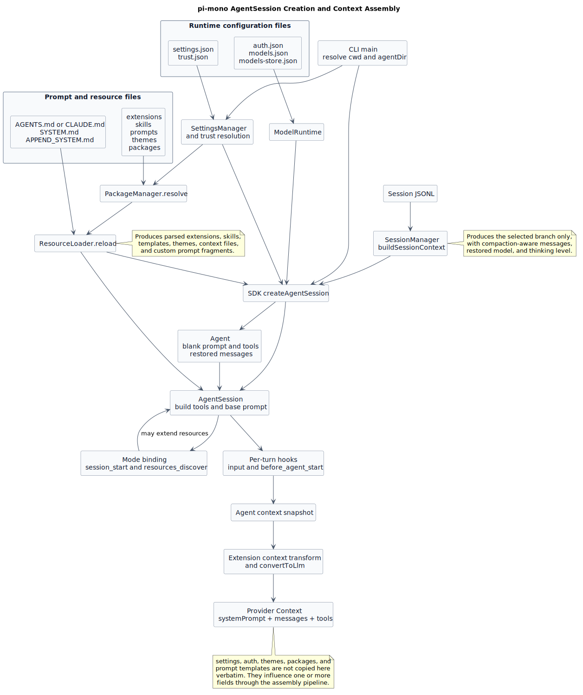

# pi-mono AgentSession 创建与上下文构建逐代码分析

> 文档版本：1.2
>
> 分析日期：2026-07-24
>
> 源码仓库：`badlogic/pi-mono`
>
> 源码基线：`fc85bdd88be93b1e9a6b6bcfa41c684282ec79cc`
>
> 分析性质：现有源码行为（Observed behavior），不包含 pi-mono-java 目标设计

## 1. 结论先行

pi-mono 创建 `AgentSession` 时，**不是由 `AgentSession` 构造函数直接扫描所有文件**。文件读取分散在五组服务中：

1. `SettingsManager` 读取全局和项目配置；
2. `ProjectTrustStore` 读取项目可信状态；
3. `ModelRuntime` 读取认证、模型定义和模型目录缓存；
4. `DefaultResourceLoader` 联合 `DefaultPackageManager` 读取扩展、技能、提示模板、主题和指令文件；
5. `SessionManager` 读取或新建 JSONL 会话，并恢复当前分支的历史消息。

这些结果最终汇合为三类运行时上下文：

| 上下文 | 核心内容 | 是否原文发送给模型 |
|---|---|---|
| 启动配置上下文 | 模型、认证、信任、工具开关、重试、资源路径 | 否；它们控制如何构建请求 |
| 持久会话上下文 | JSONL 当前分支上的消息、模型、思考等级、压缩摘要 | 消息会发送，元数据不一定发送 |
| 模型请求上下文 | `systemPrompt + messages + tools` | 是 |

最终发给 provider 的结构在 `packages/agent/src/agent-loop.ts:288-312` 被明确组装为：

```ts
const llmContext: Context = {
  systemPrompt: context.systemPrompt,
  messages: llmMessages,
  tools: context.tools,
};
```

因此，判断一个文件是否“进入上下文”时要区分：

- **读取了**：启动时确实打开并解析该文件；
- **影响上下文**：文件内容改变模型、工具、system prompt 或消息；
- **原文注入**：文件正文被拼接进 system prompt 或 user message。

## 2. 构建总图



[PlantUML 源码](diagram.puml#L1)

图中左侧是磁盘输入，中间是创建服务，右侧是每一轮真正发给模型的 `Context`。主题、认证和设置虽然会读取，但不会把 JSON 原文复制进模型请求。

## 3. 两个关键根目录

### 3.1 `cwd`

CLI 从 `process.cwd()` 取得启动目录；恢复历史会话时，最终运行目录可能改成会话 header 里的 `cwd`。源码先选定 `SessionManager`，然后才基于 `sessionManager.getCwd()` 创建 cwd-bound 服务，避免从错误项目加载 `.pi` 资源。

源码证据：

- [`main.ts:486-489`](https://github.com/badlogic/pi-mono/blob/fc85bdd88be93b1e9a6b6bcfa41c684282ec79cc/packages/coding-agent/src/main.ts#L486-L489)
- [`main.ts:568-578`](https://github.com/badlogic/pi-mono/blob/fc85bdd88be93b1e9a6b6bcfa41c684282ec79cc/packages/coding-agent/src/main.ts#L568-L578)
- [`main.ts:741-745`](https://github.com/badlogic/pi-mono/blob/fc85bdd88be93b1e9a6b6bcfa41c684282ec79cc/packages/coding-agent/src/main.ts#L741-L745)

### 3.2 `agentDir`

默认值是：

```text
~/.pi/agent
```

可通过环境变量 `PI_CODING_AGENT_DIR` 覆盖。`getAgentDir()` 的源码位于 `packages/coding-agent/src/config.ts:514-521`。

后文用 `$AGENT_DIR` 表示最终解析后的 `agentDir`，用 `$CWD` 表示最终会话工作目录。

## 4. 完整目录与文件清单

下面按用户级资源、跨 Agent 技能、项目级资源、祖先指令和会话持久化分区展示。大部分文件都是可选的；文件不存在时，pi 会使用默认值或跳过对应资源。

### 4.1 目录约定

| 变量 | 默认值或来源 | 作用域 |
|---|---|---|
| `$AGENT_DIR` | `~/.pi/agent`，可被 `PI_CODING_AGENT_DIR` 覆盖 | 用户级配置、模型、资源和默认会话存储 |
| `$CWD` | 最终 AgentSession 的有效工作目录 | 项目级配置、资源和上下文指令 |
| `<filesystem-root>` | 当前文件系统根目录 | 祖先指令扫描的起点 |

目录树只表达“可能出现在哪里”；文件作用、读取条件和是否进入模型请求统一放在 4.7 节表格中。

### 4.2 用户级目录

```text
$AGENT_DIR/
├── settings.json
├── trust.json
├── auth.json
├── models.json
├── models-store.json
├── AGENTS.md | AGENTS.MD | CLAUDE.md | CLAUDE.MD
├── SYSTEM.md
├── APPEND_SYSTEM.md
├── extensions/
│   ├── *.ts
│   ├── *.js
│   └── <extension>/index.ts | index.js | package.json
├── skills/
│   ├── *.md
│   └── <skill>/SKILL.md
├── prompts/
│   └── *.md
├── themes/
│   └── *.json
├── npm/node_modules/<package>/
├── git/<host>/<path>/
└── sessions/
```

这里保存跨项目共享的设置、凭据、模型配置和资源。`sessions/` 是默认会话根目录；CLI 参数或 `settings.json` 可以把会话存储改到其他位置。

### 4.3 跨 Agent 技能目录

```text
~/.agents/skills/
└── <skill>/SKILL.md
```

该目录遵循 Agent Skills 约定，只递归发现 `SKILL.md`，不把根目录普通 Markdown 自动视为技能。

### 4.4 项目级目录

```text
$CWD/
├── AGENTS.md | AGENTS.MD | CLAUDE.md | CLAUDE.MD
├── .agents/
│   └── skills/
│       └── <skill>/SKILL.md
└── .pi/
    ├── settings.json
    ├── SYSTEM.md
    ├── APPEND_SYSTEM.md
    ├── extensions/
    ├── skills/
    ├── prompts/
    ├── themes/
    ├── npm/node_modules/<package>/
    └── git/<host>/<path>/
```

项目级 `.pi` 资源和 `.agents/skills` 受项目信任状态控制。项目不可信时，最终运行时不会采用这些项目资源。

### 4.5 祖先目录指令

指令文件不只从 `$CWD` 读取。pi 还会读取 `$AGENT_DIR` 中的全局指令，并从文件系统根目录一路扫描到 `$CWD`：

```text
$AGENT_DIR/
└── AGENTS.md | AGENTS.MD | CLAUDE.md | CLAUDE.MD

<filesystem-root>/
└── .../
    ├── AGENTS.md | AGENTS.MD | CLAUDE.md | CLAUDE.MD
    └── .../
        └── $CWD/
            └── AGENTS.md | AGENTS.MD | CLAUDE.md | CLAUDE.MD
```

最终 `agentsFiles` 的顺序是：

```text
用户级全局指令
→ 高层祖先目录指令
→ 低层祖先目录指令
→ 当前目录指令
```

同一目录最多读取一份，候选优先级为：

```text
AGENTS.md > AGENTS.MD > CLAUDE.md > CLAUDE.MD
```

### 4.6 会话持久化目录

默认会话目录单独展示，因为它是 pi 自动维护的数据，不是资源配置：

```text
$AGENT_DIR/sessions/
└── --<encoded-cwd>--/
    └── <timestamp>_<session-id>.jsonl
```

例如：

```text
~/.pi/agent/sessions/
└── --work-acme-backend--/
    └── 2026-07-24T08-00-00-000Z_01-example.jsonl
```

### 4.7 文件读取总表

| 文件或目录 | 读取者 | 读取后结果 | 对模型请求的影响 | 条件 |
|---|---|---|---|---|
| `$AGENT_DIR/settings.json` | `SettingsManager` | 全局 `Settings` | 选择模型、思考等级、工具参数、资源路径等 | 始终尝试 |
| 启动 cwd 的 `.pi/settings.json` | startup `SettingsManager` | 启动阶段项目 `Settings` | 主要用于 sessionDir 选择 | CLI 当前实现会先读取；见下方边界说明 |
| 最终 session cwd 的 `.pi/settings.json` | runtime `SettingsManager` | 项目 `Settings` | 覆盖或补充全局设置 | 最终运行时仅项目可信 |
| `$AGENT_DIR/trust.json` | `ProjectTrustStore` | 最近祖先目录的 `boolean` 决策 | 决定是否读取项目 `.pi` 和项目 `.agents/skills` | 项目存在需信任资源时 |
| `$AGENT_DIR/auth.json` | `ModelRuntime` / `AuthStorage` | provider 到 credential 的映射 | 决定模型是否可用和请求认证 | 创建时读取；不存在会创建 `{}` |
| `$AGENT_DIR/models.json` | `ModelRuntime` / `ModelConfig` | 自定义 provider、model、override | 决定模型目录和 provider 参数 | 可选；不存在视为空 |
| `$AGENT_DIR/models-store.json` | `FileModelsStore` | 动态 provider 模型目录缓存 | 补充模型目录 | 按 provider 读取；不存在会按存储逻辑初始化 |
| session `*.jsonl` | `SessionManager` | append-only 消息树 | 当前叶子分支转换为 `messages` | 恢复、继续、fork 时 |
| `$AGENT_DIR` 和根目录至 `$CWD` 的指令文件 | `loadProjectContextFiles()` | `{path, content}[]` | 正文原样进入 `<project_context>` | 未使用 `--no-context-files` |
| `SYSTEM.md` | `DefaultResourceLoader` | `customPrompt` | 替换 pi 默认 system prompt，再附加 context/skills/cwd | CLI 优先；项目文件需可信 |
| `APPEND_SYSTEM.md` | `DefaultResourceLoader` | `appendSystemPrompt[]` | 追加到 system prompt | CLI 优先；项目文件需可信 |
| `extensions/**/*.ts|js` | extension loader | handler、tool、command、provider 等注册表 | 工具 schema、提示片段和 hook 可改变请求 | 项目扩展需可信 |
| `skills/**/*.md` | skill loader | `Skill` 元数据 | 启动时只把名称、描述、路径加入 system prompt | `read` 工具启用；项目技能需可信 |
| `prompts/*.md` | prompt-template loader | `PromptTemplate` | 启动时不进上下文；调用 `/name` 后替换 user message | 项目模板需可信 |
| `themes/*.json` | theme loader | `Theme` | 只影响 TUI，不进入 LLM context | 项目主题需可信 |
| package `package.json` | `DefaultPackageManager` | `pi.extensions/skills/prompts/themes` 路径 | 间接加载上述资源 | 项目 package 需可信 |
| `.gitignore`、`.ignore`、`.fdignore` | package/skill 扫描器 | ignore pattern | 决定哪些资源不被发现 | 扫描对应目录时 |

### 4.8 可直接参考的完整目录 demo

下面给出一套可落盘的最小示例。假设：

```text
$AGENT_DIR=/Users/alice/.pi/agent
$CWD=/work/acme/backend
```

<details>
<summary>展开完整示例目录</summary>

```text
/Users/alice/.pi/agent/
├── settings.json
├── trust.json
├── auth.json
├── models.json
├── models-store.json
├── AGENTS.md
├── SYSTEM.md
├── APPEND_SYSTEM.md
├── extensions/
│   └── hello.ts
├── skills/
│   └── release-check/
│       └── SKILL.md
├── prompts/
│   └── review.md
├── themes/
│   └── acme-dark.json
├── npm/node_modules/@acme/pi-resources/
│   └── package.json
├── git/github.com/acme/pi-resources/
│   └── package.json
└── sessions/--work-acme-backend--/
    └── 2026-07-24T08-00-00-000Z_01-example.jsonl

/Users/alice/.agents/skills/
└── incident-response/
    └── SKILL.md

/work/acme/
├── AGENTS.md
└── backend/
    ├── CLAUDE.md
    ├── .agents/
    │   └── skills/
    │       └── backend-test/
    │           └── SKILL.md
    └── .pi/
        ├── settings.json
        ├── SYSTEM.md
        ├── APPEND_SYSTEM.md
        ├── extensions/
        │   ├── .gitignore
        │   └── project-policy.ts
        ├── skills/
        │   ├── .ignore
        │   └── java-review/
        │       └── SKILL.md
        ├── prompts/
        │   ├── .fdignore
        │   └── module-review.md
        └── themes/
            └── project-dark.json
```

</details>

以下 demo 同时适用于全局目录和对应的可信项目目录。项目文件只需要把路径从 `$AGENT_DIR/...` 换成 `$CWD/.pi/...`。

#### 4.8.1 `$AGENT_DIR/settings.json`

用途：全局模型、思考等级、session 和资源配置。适合用户手写或通过 pi 设置界面维护。

```json
{
  "defaultProvider": "openai",
  "defaultModel": "gpt-5.6-sol",
  "defaultThinkingLevel": "medium",
  "defaultProjectTrust": "ask",
  "sessionDir": "~/.pi/agent/sessions",
  "compaction": {
    "enabled": true,
    "reserveTokens": 16384,
    "keepRecentTokens": 20000
  },
  "retry": {
    "enabled": true,
    "maxRetries": 3
  },
  "packages": [
    "npm:@acme/pi-resources"
  ],
  "extensions": [
    "extensions/hello.ts"
  ],
  "skills": [
    "skills"
  ],
  "prompts": [
    "prompts"
  ],
  "themes": [
    "themes"
  ]
}
```

全局相对路径以 `$AGENT_DIR` 为基准。

#### 4.8.2 `$CWD/.pi/settings.json`

用途：项目级覆盖和项目资源声明。最终 AgentSession 只在项目可信时采用。

```json
{
  "defaultThinkingLevel": "high",
  "compaction": {
    "reserveTokens": 8192
  },
  "extensions": [
    "extensions/project-policy.ts"
  ],
  "skills": [
    "skills/java-review/SKILL.md"
  ],
  "prompts": [
    "prompts/module-review.md"
  ],
  "theme": "project-dark"
}
```

项目相对路径以 `$CWD/.pi` 为基准。

#### 4.8.3 `$AGENT_DIR/trust.json`

用途：保存项目目录的信任或拒绝决定。通常由 `/trust` 和启动信任界面生成。

```json
{
  "/work/acme": true,
  "/work/untrusted-demo": false
}
```

`/work/acme: true` 会匹配 `/work/acme/backend`。该文件不应存放 prompt 或认证信息。

#### 4.8.4 `$AGENT_DIR/auth.json`

用途：保存 provider credential。通常通过 `/login` 维护，不要在仓库中提交真实密钥。

```json
{
  "openai": {
    "type": "api_key",
    "key": "$OPENAI_API_KEY"
  }
}
```

OAuth credential 的结构示例：

```json
{
  "example-oauth-provider": {
    "type": "oauth",
    "refresh": "<redacted-refresh-token>",
    "access": "<redacted-access-token>",
    "expires": 1784883600000
  }
}
```

真实文件可以同时包含多个 provider；这里分开显示只是为了避免读者把第二段误认为必须覆盖第一段。

#### 4.8.5 `$AGENT_DIR/models.json`

用途：增加自定义 provider/model，或覆盖内建模型属性。适合用户手写。

```json
{
  "providers": {
    "ollama": {
      "name": "Local Ollama",
      "baseUrl": "http://localhost:11434/v1",
      "api": "openai-completions",
      "apiKey": "ollama",
      "compat": {
        "supportsDeveloperRole": false,
        "supportsReasoningEffort": false
      },
      "models": [
        {
          "id": "qwen2.5-coder:7b",
          "name": "Qwen 2.5 Coder 7B",
          "reasoning": false,
          "input": ["text"],
          "contextWindow": 128000,
          "maxTokens": 16384,
          "cost": {
            "input": 0,
            "output": 0,
            "cacheRead": 0,
            "cacheWrite": 0
          }
        }
      ]
    }
  }
}
```

#### 4.8.6 `$AGENT_DIR/models-store.json`

用途：缓存动态 provider 返回的模型目录。通常由 pi 自动生成，不建议手工维护。

```json
{
  "dynamic-provider": {
    "models": [
      {
        "id": "dynamic-model-1",
        "name": "Dynamic Model 1",
        "api": "openai-completions",
        "provider": "dynamic-provider",
        "baseUrl": "https://models.example.invalid/v1",
        "reasoning": false,
        "input": ["text"],
        "cost": {
          "input": 0,
          "output": 0,
          "cacheRead": 0,
          "cacheWrite": 0
        },
        "contextWindow": 128000,
        "maxTokens": 16384
      }
    ],
    "lastModified": 1784880000000,
    "checkedAt": 1784880300000
  }
}
```

`models-store.json` 是缓存；自定义模型应写在 `models.json`，不要把两者混用。

#### 4.8.7 `AGENTS.md`、`AGENTS.MD`、`CLAUDE.md`、`CLAUDE.MD`

用途：提供全局、祖先目录或当前项目的长期指令。四个名字的内容格式相同。

```markdown
# Repository instructions

- Use Java 21.
- Keep changes inside the affected Maven module.
- Run focused tests for modified behavior.
- Never edit generated sources manually.
```

同一个目录只需要创建其中一个文件。发现优先级是：

```text
AGENTS.md > AGENTS.MD > CLAUDE.md > CLAUDE.MD
```

例如可以同时存在：

```text
$AGENT_DIR/AGENTS.md
/work/acme/AGENTS.md
/work/acme/backend/CLAUDE.md
```

三份文件会按全局、祖先、当前目录顺序一起进入 `<project_context>`。

#### 4.8.8 `SYSTEM.md`

用途：替换 pi 内建的默认 system prompt。

```markdown
You are Acme's backend coding agent.

Prioritize:

1. Correctness.
2. Backward compatibility.
3. Small, reviewable changes.
4. Focused verification.
```

可放在：

```text
$AGENT_DIR/SYSTEM.md
$CWD/.pi/SYSTEM.md
```

可信项目文件优先于全局文件；CLI `--system-prompt` 又优先于二者。

#### 4.8.9 `APPEND_SYSTEM.md`

用途：在默认或自定义 system prompt 后追加规则。

```markdown
Always report:

- Changed files.
- Focused verification commands.
- Known validation gaps.
```

可放在：

```text
$AGENT_DIR/APPEND_SYSTEM.md
$CWD/.pi/APPEND_SYSTEM.md
```

#### 4.8.10 `extensions/hello.ts`

用途：注册工具、命令、provider 或事件 hook。下面是一个可执行的最小工具扩展。

```ts
import { Type } from "@earendil-works/pi-ai";
import {
  defineTool,
  type ExtensionAPI,
} from "@earendil-works/pi-coding-agent";

const helloTool = defineTool({
  name: "hello",
  label: "Hello",
  description: "Greet one person",
  promptSnippet: "Greet a person by name",
  parameters: Type.Object({
    name: Type.String({ description: "Name to greet" }),
  }),
  async execute(_toolCallId, params) {
    return {
      content: [
        {
          type: "text",
          text: `Hello, ${params.name}!`,
        },
      ],
      details: {
        greeted: params.name,
      },
    };
  },
});

export default function (pi: ExtensionAPI) {
  pi.registerTool(helloTool);
}
```

上面的 TypeScript 内容也可以放在：

```text
extensions/hello/index.ts
```

如果使用 JavaScript 文件，需要去掉 TypeScript 的 type-only import 和参数类型：

```js
import { Type } from "@earendil-works/pi-ai";

export default function (pi) {
  pi.registerTool({
    name: "hello",
    label: "Hello",
    description: "Greet one person",
    parameters: Type.Object({
      name: Type.String(),
    }),
    async execute(_toolCallId, params) {
      return {
        content: [
          {
            type: "text",
            text: `Hello, ${params.name}!`,
          },
        ],
        details: {},
      };
    },
  });
}
```

JavaScript demo 可以放在：

```text
extensions/hello.js
extensions/hello/index.js
```

目录型扩展还可以使用自己的 `package.json` 声明入口：

```json
{
  "name": "@acme/pi-hello-extension",
  "private": true,
  "pi": {
    "extensions": [
      "./src/index.ts"
    ]
  }
}
```

#### 4.8.11 `skills/<skill>/SKILL.md`

用途：声明一个可按需加载的专业工作流。

```markdown
---
name: release-check
description: Checks release metadata, tests, and artifacts before publishing.
---

# Release check

1. Read `references/checklist.md`.
2. Run `scripts/release.sh --dry-run`.
3. Report every failed release gate.
```

这份 demo 可以放在任一技能来源：

```text
$AGENT_DIR/skills/release-check/SKILL.md
~/.agents/skills/release-check/SKILL.md
$CWD/.pi/skills/release-check/SKILL.md
$CWD/.agents/skills/release-check/SKILL.md
```

`$AGENT_DIR/skills` 和 `.pi/skills` 还允许根目录单个 Markdown 技能，例如：

```text
$AGENT_DIR/skills/quick-review.md
```

其内容格式仍使用相同 frontmatter：

```markdown
---
name: quick-review
description: Performs a focused review of the current change.
---

Review the current change for correctness and missing tests.
```

`.agents/skills` 不自动发现这种根目录普通 Markdown 文件，只递归发现 `SKILL.md`。

#### 4.8.12 `prompts/review.md`

用途：注册 `/review` 用户提示模板。

```markdown
---
description: Review one module
argument-hint: "<module> [focus]"
---

Review module $1.

Focus on:

- Correctness.
- Security.
- Missing tests.
- Additional focus: ${2:-general}.
```

调用：

```text
/review payment concurrency
```

展开后的 user message：

```text
Review module payment.

Focus on:

- Correctness.
- Security.
- Missing tests.
- Additional focus: concurrency.
```

#### 4.8.13 `themes/acme-dark.json`

用途：定义 TUI 主题。`colors` 必须提供全部必填 token；下面是一个完整可用 demo。

```json
{
  "$schema": "https://raw.githubusercontent.com/earendil-works/pi/main/packages/coding-agent/src/modes/interactive/theme/theme-schema.json",
  "name": "acme-dark",
  "vars": {
    "primary": "#00aaff",
    "secondary": 242,
    "green": "#00ff00",
    "red": "#ff0000",
    "yellow": "#ffff00"
  },
  "colors": {
    "accent": "primary",
    "border": "primary",
    "borderAccent": "#00ffff",
    "borderMuted": "secondary",
    "success": "green",
    "error": "red",
    "warning": "yellow",
    "muted": "secondary",
    "dim": 240,
    "text": "",
    "thinkingText": "secondary",
    "selectedBg": "#2d2d30",
    "userMessageBg": "#2d2d30",
    "userMessageText": "",
    "customMessageBg": "#2d2d30",
    "customMessageText": "",
    "customMessageLabel": "primary",
    "toolPendingBg": "#1e1e2e",
    "toolSuccessBg": "#1e2e1e",
    "toolErrorBg": "#2e1e1e",
    "toolTitle": "primary",
    "toolOutput": "",
    "mdHeading": "#ffaa00",
    "mdLink": "primary",
    "mdLinkUrl": "secondary",
    "mdCode": "#00ffff",
    "mdCodeBlock": "",
    "mdCodeBlockBorder": "secondary",
    "mdQuote": "secondary",
    "mdQuoteBorder": "secondary",
    "mdHr": "secondary",
    "mdListBullet": "#00ffff",
    "toolDiffAdded": "green",
    "toolDiffRemoved": "red",
    "toolDiffContext": "secondary",
    "syntaxComment": "secondary",
    "syntaxKeyword": "primary",
    "syntaxFunction": "#00aaff",
    "syntaxVariable": "#ffaa00",
    "syntaxString": "green",
    "syntaxNumber": "#ff00ff",
    "syntaxType": "#00aaff",
    "syntaxOperator": "primary",
    "syntaxPunctuation": "secondary",
    "thinkingOff": "secondary",
    "thinkingMinimal": "primary",
    "thinkingLow": "#00aaff",
    "thinkingMedium": "#00ffff",
    "thinkingHigh": "#ff00ff",
    "thinkingXhigh": "#ff0000",
    "thinkingMax": "#ff0088",
    "bashMode": "#ffaa00"
  }
}
```

在 settings 中选择：

```json
{
  "theme": "acme-dark"
}
```

#### 4.8.14 package 根目录的 `package.json`

用途：告诉 PackageManager 一个 npm、git 或 local package 包含哪些资源。

```json
{
  "name": "@acme/pi-resources",
  "version": "1.0.0",
  "keywords": [
    "pi-package"
  ],
  "peerDependencies": {
    "@earendil-works/pi-ai": "*",
    "@earendil-works/pi-coding-agent": "*"
  },
  "pi": {
    "extensions": [
      "./extensions"
    ],
    "skills": [
      "./skills"
    ],
    "prompts": [
      "./prompts"
    ],
    "themes": [
      "./themes"
    ]
  }
}
```

同一 package 内容可以位于：

```text
$AGENT_DIR/npm/node_modules/@acme/pi-resources/
$CWD/.pi/npm/node_modules/@acme/pi-resources/
$AGENT_DIR/git/github.com/acme/pi-resources/
$CWD/.pi/git/github.com/acme/pi-resources/
任意 settings 中配置的 local path
```

如果 package 没有 `pi` 字段，Pi 会尝试约定目录：

```text
extensions/
skills/
prompts/
themes/
```

#### 4.8.15 `.gitignore`、`.ignore`、`.fdignore`

用途：资源扫描期间排除不希望自动发现的文件或目录。三种文件使用相同的 ignore pattern 风格。

`$CWD/.pi/extensions/.gitignore`：

```gitignore
legacy.ts
drafts/
```

`$CWD/.pi/skills/.ignore`：

```gitignore
generated/
experimental/**/SKILL.md
```

`$CWD/.pi/prompts/.fdignore`：

```gitignore
drafts/
*.disabled.md
```

ignore 文件应放在正在扫描的资源目录或扫描到的子目录中，pattern 相对对应扫描 root 解释。它只影响自动发现，不会修改或删除文件。

#### 4.8.16 session `*.jsonl`

用途：保存 session header 和 append-only entry tree。通常由 pi 自动生成，不建议手工修改。

```jsonl
{"type":"session","version":3,"id":"01-example","timestamp":"2026-07-24T08:00:00.000Z","cwd":"/work/acme/backend"}
{"type":"model_change","id":"a1","parentId":null,"timestamp":"2026-07-24T08:00:00.010Z","provider":"openai","modelId":"gpt-5.6-sol"}
{"type":"thinking_level_change","id":"a2","parentId":"a1","timestamp":"2026-07-24T08:00:00.011Z","thinkingLevel":"medium"}
{"type":"message","id":"a3","parentId":"a2","timestamp":"2026-07-24T08:01:00.000Z","message":{"role":"user","content":[{"type":"text","text":"Explain the payment flow"}],"timestamp":1784880060000}}
```

这四行分别代表：

1. session header；
2. 初始模型；
3. 初始思考等级；
4. 用户消息。

恢复时只把当前 leaf 路径上能转换为 AgentMessage 的 entry 放入 `messages`。

#### 4.8.17 哪些 demo 应该手写

| 文件 | 建议 |
|---|---|
| `settings.json` | 可以手写，也可以通过设置界面维护 |
| `trust.json` | 通常交给 `/trust` 和信任界面维护 |
| `auth.json` | 通常交给 `/login` 维护；禁止提交真实密钥 |
| `models.json` | 自定义模型时手写 |
| `models-store.json` | 系统缓存，不建议手写 |
| `AGENTS.md` / `CLAUDE.md` | 项目维护者手写 |
| `SYSTEM.md` / `APPEND_SYSTEM.md` | 需要定制 system prompt 时手写 |
| extension `*.ts` / `*.js` | 扩展开发者手写 |
| `SKILL.md` | 技能开发者手写 |
| prompt `*.md` | 用户或团队手写 |
| theme `*.json` | 主题开发者手写 |
| package `package.json` | package 开发者手写 |
| ignore 文件 | 需要控制资源发现时手写 |
| session `*.jsonl` | pi 自动生成，不建议手工修改 |

## 5. CLI 到 AgentSession 的逐代码链路

本节按实际执行顺序解释，而不是按文件名分类。

### 步骤 1：确定启动目录和全局资源目录

`main()` 的关键代码是：

```ts
const cwd = process.cwd();
const agentDir = getAgentDir();
const bootstrapSettingsManager =
  SettingsManager.create(cwd, agentDir, { projectTrusted: false });
```

对应 [`main.ts:486-489`](https://github.com/badlogic/pi-mono/blob/fc85bdd88be93b1e9a6b6bcfa41c684282ec79cc/packages/coding-agent/src/main.ts#L486-L489)。

逐句含义：

1. `cwd` 先取当前进程目录；
2. `agentDir` 取环境变量覆盖值或 `~/.pi/agent`；
3. bootstrap 阶段显式设置 `projectTrusted: false`，此时只允许读取全局 settings，不能抢先加载项目配置；
4. bootstrap settings 主要用于 HTTP proxy 等最早期全局启动参数。

随后 `main.ts:558` 又创建 `startupSettingsManager = SettingsManager.create(cwd, agentDir)`，未传 `projectTrusted`；而 `SettingsManager` 的默认值是 `true`。因此当前源码会在正式信任判定前读取**启动 cwd** 的 `.pi/settings.json`，用于 sessionDir 查找及启动会话选择。选定最终 session cwd 后，`main.ts:633` 才使用显式 `projectTrusted` 创建 runtime SettingsManager。

这意味着要区分：

- “启动 session 查找是否物理读取项目 settings”：当前实现会；
- “最终 AgentSession 是否采用项目 settings 和项目资源”：由 trust gate 决定。

### 步骤 2：先选择或创建 SessionManager

`createSessionManager()` 位于 `main.ts:264-355`：

| 条件 | 创建方式 | 是否读 JSONL |
|---|---|---|
| `--no-session`、`--help`、`--list-models` | `SessionManager.inMemory()` | 否 |
| `--fork` | `SessionManager.forkFrom()` | 读源会话 |
| `--session` | `SessionManager.open()` | 读指定会话 |
| `--resume` | 列表选择后 `open()` | 扫描并读会话 |
| `--continue` | `continueRecent()` | 扫描并读最近会话 |
| 已有 `--session-id` | `open()` | 读匹配会话 |
| 默认 | `SessionManager.create()` | 新建 header，首次持久化时写文件 |

session 目录优先级在 [`main.ts:573-578`](https://github.com/badlogic/pi-mono/blob/fc85bdd88be93b1e9a6b6bcfa41c684282ec79cc/packages/coding-agent/src/main.ts#L573-L578)：

```text
--session-dir
  > PI_CODING_AGENT_SESSION_DIR
  > settings.json 的 sessionDir
  > $AGENT_DIR/sessions/--<encoded-cwd>--
```

这里“先会话、后项目资源”很关键：若打开的 session 属于另一个项目，后续 `.pi/settings.json`、`.pi/extensions` 和 AGENTS 搜索都以 session 的 `cwd` 为准。

### 步骤 3：根据项目资源决定信任状态

`main.ts:602-633` 创建 `ProjectTrustStore`，并检查目标 cwd 是否包含需信任的项目资源。

需信任资源由 `trust-manager.ts:29-37` 固定为：

```text
.pi/settings.json
.pi/extensions
.pi/skills
.pi/prompts
.pi/themes
.pi/SYSTEM.md
.pi/APPEND_SYSTEM.md
```

此外，cwd 或祖先目录中的 `.agents/skills` 也会触发信任判断。

信任来源依次包括：

1. CLI 单次覆盖；
2. 当前运行缓存；
3. 预信任阶段已加载的全局/CLI extension 对 `project_trust` 事件的决定；
4. `$AGENT_DIR/trust.json` 中 cwd 或最近祖先的决定；
5. 全局 `defaultProjectTrust`；
6. 交互模式中的用户选择。

**重要例外：**根目录至 cwd 的 `AGENTS.md` / `CLAUDE.md` 不在信任资源表中，`loadProjectContextFiles()` 也没有检查 `isProjectTrusted()`。所以项目不可信时，`.pi/*` 不加载，但项目指令文件仍可能进入 system prompt。

### 步骤 4：创建 cwd-bound 服务

[`main.ts:634-677`](https://github.com/badlogic/pi-mono/blob/fc85bdd88be93b1e9a6b6bcfa41c684282ec79cc/packages/coding-agent/src/main.ts#L634-L677) 调用：

```ts
createAgentSessionServices({
  cwd,
  agentDir,
  settingsManager: runtimeSettingsManager,
  resourceLoaderOptions: {
    additionalExtensionPaths,
    additionalSkillPaths,
    additionalPromptTemplatePaths,
    additionalThemePaths,
    noExtensions,
    noSkills,
    noPromptTemplates,
    noThemes,
    noContextFiles,
    systemPrompt,
    appendSystemPrompt,
  },
});
```

这里把 CLI 的资源路径和 `--no-*` 开关交给 ResourceLoader。CLI 路径在启动 cwd 下先解析为绝对路径；即使 `--no-skills` 或 `--no-extensions`，显式 CLI 路径仍保留。

### 步骤 5：创建 ModelRuntime

`createAgentSessionServices()` 在 `agent-session-services.ts:137-152`：

```ts
const modelRuntime = await ModelRuntime.create({
  authPath: join(agentDir, "auth.json"),
  modelsPath: join(agentDir, "models.json"),
});
```

`ModelRuntime.create()` 进一步执行：

1. 用 `auth.json` 创建 credential store；
2. 读取并校验 `models.json`；
3. 在同目录创建 `FileModelsStore(models-store.json)`；
4. 合并内建 provider 与本地模型配置；
5. 执行本地 refresh。AgentSession 服务创建阶段传入 `allowNetwork: false`，不会为了初始构建强制联网；
6. 扩展加载后，再注册扩展 provider，并再次本地 refresh。

源码证据：

- [`agent-session-services.ts:137-180`](https://github.com/badlogic/pi-mono/blob/fc85bdd88be93b1e9a6b6bcfa41c684282ec79cc/packages/coding-agent/src/core/agent-session-services.ts#L137-L180)
- [`model-runtime.ts:133-176`](https://github.com/badlogic/pi-mono/blob/fc85bdd88be93b1e9a6b6bcfa41c684282ec79cc/packages/coding-agent/src/core/model-runtime.ts#L133-L176)

### 步骤 6：ResourceLoader 执行统一 reload

`DefaultResourceLoader.reload()` 是文件资源读取的核心，位于 `resource-loader.ts:338-489`。执行顺序是：

1. 如需交互信任，先在不可信状态加载全局扩展，让全局扩展有机会处理 `project_trust`；
2. 按最终信任状态重新加载 settings；
3. `packageManager.resolve()` 汇总 package、本地和自动发现路径；
4. 解析 CLI extension source；
5. 加载扩展；
6. 加载技能；
7. 加载提示模板；
8. 加载主题；
9. 加载 AGENTS/CLAUDE 指令文件；
10. 解析 SYSTEM 和 APPEND_SYSTEM。

这一步的输出不是一个字符串，而是多组缓存：

```ts
extensionsResult
skills
prompts
themes
agentsFiles
systemPrompt
appendSystemPrompt
```

### 步骤 7：PackageManager 先得到“候选路径”

`DefaultPackageManager.resolve()` 位于 `package-manager.ts:901-953`：

1. 读取 global/project settings；
2. project packages 先加入，global packages 后加入；
3. 相同 package identity 去重时 project 胜出；
4. settings 中的项目资源路径相对 `$CWD/.pi` 解析；
5. settings 中的全局资源路径相对 `$AGENT_DIR` 解析；
6. 加入约定目录的自动发现结果；
7. 返回 `ResolvedPaths`，其中每个路径带 `source`、`scope`、`origin`、`enabled` 元数据。

自动发现目录由 `package-manager.ts:2336-2466` 定义：

| 资源 | 用户级 | 项目级 |
|---|---|---|
| extensions | `$AGENT_DIR/extensions` | `$CWD/.pi/extensions` |
| skills | `$AGENT_DIR/skills`、`~/.agents/skills` | `$CWD/.pi/skills`、cwd 至 git root 各级 `.agents/skills` |
| prompts | `$AGENT_DIR/prompts` | `$CWD/.pi/prompts` |
| themes | `$AGENT_DIR/themes` | `$CWD/.pi/themes` |

项目级四类 `.pi` 资源和项目 `.agents/skills` 都要求项目可信。用户级资源不要求项目信任。

extension 的自动发现还有一层入口规则：

1. 扩展根目录自身的 `package.json` 若声明 `pi.extensions`，使用声明路径；
2. 否则根目录有 `index.ts` 时使用它；
3. 否则根目录有 `index.js` 时使用它；
4. 否则扫描根目录直接子项：直接的 `*.ts`、`*.js`，以及含 manifest/index 的一级子目录；
5. 不递归任意深度搜索所有 TypeScript 文件。

`.agents/skills` 的祖先扫描范围与 AGENTS 文件不同：

- `.agents/skills`：在 git 仓库内扫描至 git root；不在 git 仓库内扫描至文件系统根；
- `AGENTS.md` / `CLAUDE.md`：始终从 cwd 扫描至文件系统根。

### 步骤 8：把候选路径变成内存对象

ResourceLoader 对不同类型执行不同解析：

| 类型 | 解析代码 | 内存结果 |
|---|---|---|
| extension | `extensions/loader.ts:403-427,454-479` | `Extension`：handlers、tools、commands、flags、provider 注册等 |
| skill | `skills.ts:277-325` | `Skill`：name、description、filePath、baseDir、sourceInfo、disable flag |
| prompt | `prompt-templates.ts:104-133` | `PromptTemplate`：name、description、argumentHint、body、filePath |
| theme | `theme.ts:623-626` | `Theme`：解析后的颜色和 sourcePath |
| context file | `resource-loader.ts:67-119` | `{path, content}` |
| SYSTEM | `resource-loader.ts:50-65,966-978` | `string | undefined` |
| APPEND_SYSTEM | `resource-loader.ts:50-65,980-992` | `string[]` |

extension 文件不是作为文本塞给模型，而是通过 `jiti.import()` 执行 default-export factory。扩展可以注册工具、命令、provider 和事件 hook。

### 步骤 9：从会话树恢复 messages、model 和 thinking level

`SessionManager.buildSessionContext()` 位于 `session-manager.ts:461-470`。它先沿 `parentId` 从当前 leaf 回溯到 root，再反转为时间顺序。

处理规则：

1. `message` 转为原始 AgentMessage；
2. `custom_message` 进入模型消息；
3. `branch_summary` 转为摘要消息；
4. `compaction` 转为压缩摘要消息；
5. 普通 `custom`、`label`、`session_info` 不进入模型上下文；
6. 如果存在 compaction，只保留最新 compaction 摘要、`firstKeptEntryId` 之后的保留条目和 compaction 后的新条目；
7. model 取路径上最后的 `model_change` 或 assistant message 元数据；
8. thinking level 取路径上最后的 `thinking_level_change`。

所以恢复会话时不会把整个 JSONL 文件线性发送给模型，也不会发送 sibling branch。

### 步骤 10：SDK 解析模型、思考等级和初始工具

`createAgentSession()` 位于 `sdk.ts:169-398`。

模型选择优先级：

1. 调用方显式 `options.model`；
2. 既有 session 恢复出的 provider/model；
3. settings 的 `defaultProvider/defaultModel`；
4. provider 默认模型。

思考等级优先级：

1. 显式 `options.thinkingLevel`；
2. 既有 session 的 thinking entry；
3. settings 的 `defaultThinkingLevel`；
4. 内建默认值；
5. 最后按模型能力 clamp。

默认 active tools 是：

```text
read, bash, edit, write
```

`--tools`、`--exclude-tools`、`--no-tools`、`--no-builtin-tools` 会修改这个列表。

### 步骤 11：先创建一个“空壳” Agent

SDK 在 [`sdk.ts:294-360`](https://github.com/badlogic/pi-mono/blob/fc85bdd88be93b1e9a6b6bcfa41c684282ec79cc/packages/coding-agent/src/core/sdk.ts#L294-L360) 创建：

```ts
agent = new Agent({
  initialState: {
    systemPrompt: "",
    model,
    thinkingLevel,
    tools: [],
  },
  convertToLlm,
  streamFn,
  transformContext,
  ...
});
```

此时：

- system prompt 还是空字符串；
- tools 还是空数组；
- model/thinking 已确定；
- `transformContext` 已接到 extension runner 引用，但 runner 尚由 AgentSession 建好。

然后：

- 恢复会话时，把 `existingSession.messages` 赋给 `agent.state.messages`；
- 新会话时，把初始 model 和 thinking level 写为 JSONL entry；
- 最后调用 `new AgentSession(...)`。

### 步骤 12：AgentSession 构造函数建立 runtime

`AgentSession` 构造函数位于 `agent-session.ts:375-401`：

1. 保存 Agent、SessionManager、SettingsManager、ResourceLoader、ModelRuntime；
2. 订阅 agent events，用于会话持久化、扩展、压缩和重试；
3. 安装 tool hooks；
4. 安装 next-turn refresh；
5. 调用 `_buildRuntime()`。

它不再自行扫描目录，而是消费 ResourceLoader 已加载的对象。

### 步骤 13：构建工具注册表

`_buildRuntime()` 位于 `agent-session.ts:2551-2602`：

1. 从 settings 读取图片缩放、shell prefix、shell path；
2. 以 cwd 创建所有内建工具定义；
3. 从 ResourceLoader 取得 extension result；
4. 创建 `ExtensionRunner`；
5. 合并 builtin、extension 和 SDK custom tools；
6. 应用 allowed/excluded filters；
7. extension/custom tool 同名时覆盖同名定义；
8. 包装 tool hook；
9. 调用 `setActiveToolsByName()`。

`setActiveToolsByName()` 同时做两件事：

```ts
this.agent.state.tools = tools;
this._baseSystemPrompt = this._rebuildSystemPrompt(validToolNames);
this.agent.state.systemPrompt =
  this._systemPromptOverride ?? this._baseSystemPrompt;
```

因此 tools 的变化会立刻重建 base system prompt。

### 步骤 14：构建 base system prompt

`_rebuildSystemPrompt()` 位于 `agent-session.ts:1021-1055`：

1. 从 active tool 中收集 `promptSnippet`；
2. 收集并去重 `promptGuidelines`；
3. 从 ResourceLoader 取得 SYSTEM、APPEND_SYSTEM；
4. 取得已加载的 skills；
5. 取得 AGENTS/CLAUDE context files；
6. 形成 `BuildSystemPromptOptions`；
7. 调用 `buildSystemPrompt()`。

输入结构是：

```ts
{
  cwd,
  skills,
  contextFiles,
  customPrompt,
  appendSystemPrompt,
  selectedTools,
  toolSnippets,
  promptGuidelines,
}
```

### 步骤 15：绑定运行模式后，扩展还可以补资源

构造函数返回后，print、TUI、RPC 模式分别调用 `session.bindExtensions()`：

- print：`modes/print-mode.ts:71-100`
- TUI：`modes/interactive/interactive-mode.ts:1627-1655`
- RPC：`modes/rpc/rpc-mode.ts:316-340`

`bindExtensions()`：

1. 绑定 UI、命令、abort 等运行模式能力；
2. 发出 `session_start`；
3. 发出 `resources_discover`；
4. 扩展可追加 skill、prompt、theme 路径；
5. 如果追加了资源，ResourceLoader 更新对应缓存；
6. 重新构建 base system prompt。

所以“构造函数结束”并不是资源集合最后一次变化；运行模式绑定完成后才包含扩展动态发现的资源。

### 步骤 16：每一轮发送前允许扩展再改一次

用户调用 `session.prompt()` 时，`agent-session.ts:1114-1264` 依次执行：

1. extension command；
2. `input` hook；
3. `/skill:name` 展开；
4. prompt template 展开；
5. 模型和认证校验；
6. 必要的 compaction；
7. 构造 user message；
8. 合并 pending next-turn message；
9. 发出 `before_agent_start`；
10. 接受扩展新增 custom messages；
11. 接受扩展本轮 system prompt override；
12. 调用 Agent loop。

Agent 取得 `{systemPrompt, messages, tools}` 快照；Agent loop 再执行：

1. extension `context` transform；
2. `convertToLlm()`；
3. 组装 provider `Context`；
4. 解析当前 API key；
5. 发起流式请求。

源码证据：

- [`agent.ts:398-458`](https://github.com/badlogic/pi-mono/blob/fc85bdd88be93b1e9a6b6bcfa41c684282ec79cc/packages/agent/src/agent.ts#L398-L458)
- [`agent-loop.ts:281-312`](https://github.com/badlogic/pi-mono/blob/fc85bdd88be93b1e9a6b6bcfa41c684282ec79cc/packages/agent/src/agent-loop.ts#L281-L312)

## 6. 每类文件内容、解析结果和例子

以下例子均为脱敏的说明性内容，不是本机真实配置。

### 6.1 settings.json

全局文件：

```json
{
  "defaultProvider": "openai",
  "defaultModel": "gpt-5.6-sol",
  "defaultThinkingLevel": "medium",
  "defaultProjectTrust": "ask",
  "compaction": {
    "enabled": true,
    "reserveTokens": 16384
  },
  "packages": ["npm:@acme/pi-common"],
  "skills": ["../shared-skills"],
  "sessionDir": ".pi-sessions"
}
```

项目文件：

```json
{
  "defaultThinkingLevel": "high",
  "compaction": {
    "reserveTokens": 8192
  },
  "extensions": ["extensions/project-policy.ts"],
  "skills": ["skills/release/SKILL.md"]
}
```

一般 settings 使用 deep merge，因此合并后的关键值是：

```json
{
  "defaultProvider": "openai",
  "defaultModel": "gpt-5.6-sol",
  "defaultThinkingLevel": "high",
  "compaction": {
    "enabled": true,
    "reserveTokens": 8192
  }
}
```

资源和 package 的汇总有额外逻辑：PackageManager 分别读取 global/project settings，再把两边资源都加入候选集合，不是简单把全局数组丢掉。

这些 JSON 原文不进入 system prompt。它们影响模型选择、资源目录、压缩、队列、网络和工具行为。

### 6.2 trust.json

格式是绝对目录到 `true/false` 的映射：

```json
{
  "/work/acme": true,
  "/work/untrusted-demo": false
}
```

查询 `/work/acme/backend` 时会逐级向上找最近的记录，因此 `/work/acme: true` 能信任其子目录。

`trust.json` 不进入模型上下文，只控制项目资源能否加载。

### 6.3 auth.json

类型是：

```ts
Record<string, ApiKeyCredential | OAuthCredential>
```

脱敏示例：

```json
{
  "openai": {
    "type": "api_key",
    "key": "$OPENAI_API_KEY"
  },
  "example-oauth-provider": {
    "type": "oauth",
    "refresh": "<redacted>",
    "access": "<redacted>",
    "expires": 0
  }
}
```

读取后保存为 credential store。API key 可继续解析环境变量或其他配置值。`AuthStorage` 首次使用时会创建父目录和内容为 `{}` 的文件，并将权限设置为 `0600`。

安全边界：

- `auth.json` 原文和密钥不进入 system prompt/messages；
- 只在发请求时解析所选 provider 的认证；
- 文档、日志和示例不应复制真实 token。

### 6.4 models.json

最小示例：

```json
{
  "providers": {
    "ollama": {
      "baseUrl": "http://localhost:11434/v1",
      "api": "openai-completions",
      "apiKey": "ollama",
      "models": [
        {
          "id": "qwen2.5-coder:7b",
          "name": "Qwen 2.5 Coder 7B",
          "reasoning": false,
          "input": ["text"],
          "contextWindow": 128000,
          "maxTokens": 16384
        }
      ]
    }
  }
}
```

读取后：

1. JSON comments 被剥离；
2. TypeBox schema 校验 `providers`；
3. 每个 provider 被 clone、deep-freeze；
4. 与内建 provider/model 合并；
5. `modelOverrides` 可覆盖已知 model；
6. schema 错误被保存为 diagnostic，不把无效 provider 加入 map。

该 JSON 不原文进入 LLM context。解析出的 `Model` 决定 provider、API、上下文窗口、最大输出和兼容参数。

### 6.5 models-store.json

这是动态模型目录缓存，不是用户首选的手写配置。逻辑格式为：

```json
{
  "some-provider": {
    "models": [
      {
        "id": "model-id",
        "name": "Model Name",
        "api": "openai-completions",
        "provider": "some-provider",
        "baseUrl": "https://example.invalid/v1",
        "reasoning": false,
        "input": ["text"],
        "cost": {
          "input": 0,
          "output": 0,
          "cacheRead": 0,
          "cacheWrite": 0
        },
        "contextWindow": 128000,
        "maxTokens": 16384
      }
    ],
    "lastModified": 0,
    "checkedAt": 0
  }
}
```

读取后按 provider 返回 `ModelsStoreEntry`。它影响模型目录，但不进入 prompt。

### 6.6 AGENTS.md / CLAUDE.md

单个目录的文件名优先级严格是：

```text
AGENTS.md
AGENTS.MD
CLAUDE.md
CLAUDE.MD
```

每个目录最多取第一个成功读取的候选。

示例：

```markdown
# Repository instructions

- Use Java 21.
- Run focused tests for the modified module.
- Never edit generated sources manually.
```

假设 `$CWD=/work/acme/backend`，存在：

```text
$AGENT_DIR/AGENTS.md
/work/AGENTS.md
/work/acme/AGENTS.md
/work/acme/backend/CLAUDE.md
```

加载顺序是：

```text
1. $AGENT_DIR/AGENTS.md
2. /work/AGENTS.md
3. /work/acme/AGENTS.md
4. /work/acme/backend/CLAUDE.md
```

注意：

- 全局 context file 最先；
- 项目祖先按 root 到 cwd 排列；
- 不会把 `AGENTS.md` 与同目录 `CLAUDE.md` 同时加载；
- 文件正文原样保留；
- buildSystemPrompt 时会包装为：

```xml
<project_context>

Project-specific instructions and guidelines:

<project_instructions path="/work/acme/AGENTS.md">
# Repository instructions

- Use Java 21.
</project_instructions>

</project_context>
```

这类文件是最直接的 system prompt 内容来源。

### 6.7 SYSTEM.md

示例：

```markdown
You are Acme's backend coding agent.

Prioritize correctness, compatibility, and focused changes.
```

发现优先级：

```text
--system-prompt 的参数
  > 可信项目 $CWD/.pi/SYSTEM.md
  > $AGENT_DIR/SYSTEM.md
  > pi 内建默认 system prompt
```

`--system-prompt` 参数如果指向存在的文件，会读取文件；否则把参数本身当作 literal prompt。

`SYSTEM.md` 的语义是**替换默认 prompt**，不是追加。但即使使用 custom prompt，后面仍会追加：

1. APPEND_SYSTEM；
2. AGENTS/CLAUDE project context；
3. 可见技能元数据；
4. current working directory。

### 6.8 APPEND_SYSTEM.md

示例：

```markdown
Always mention the focused test command used for verification.
```

发现优先级：

```text
--append-system-prompt 的参数列表
  > 可信项目 $CWD/.pi/APPEND_SYSTEM.md
  > $AGENT_DIR/APPEND_SYSTEM.md
  > 无追加内容
```

CLI 可提供多段 append source；每段同样按“存在的路径则读文件，否则按 literal”解释，最后以空行连接。

### 6.9 skill 文件

标准目录示例：

```text
$CWD/.pi/skills/release/
├── SKILL.md
├── scripts/release.sh
└── references/checklist.md
```

`SKILL.md`：

```markdown
---
name: release-check
description: Checks release metadata and artifacts before publishing.
---

# Release check

1. Read `references/checklist.md`.
2. Run `scripts/release.sh --dry-run`.
3. Report every failed gate.
```

创建时 loader 会读取整个文件，但只把 frontmatter 解析为：

```ts
{
  name: "release-check",
  description: "Checks release metadata and artifacts before publishing.",
  filePath: "/work/acme/backend/.pi/skills/release/SKILL.md",
  baseDir: "/work/acme/backend/.pi/skills/release",
  disableModelInvocation: false
}
```

如果 active tools 包含 `read`，system prompt 只得到元数据：

```xml
<available_skills>
  <skill>
    <name>release-check</name>
    <description>Checks release metadata and artifacts before publishing.</description>
    <location>/work/acme/backend/.pi/skills/release/SKILL.md</location>
  </skill>
</available_skills>
```

**SKILL.md 正文不会在启动时全部注入 system prompt。**只有：

- 模型主动使用 `read` 读取该路径；或
- 用户执行 `/skill:release-check ...`

时才读取/展开正文。显式 skill command 会去掉 frontmatter，并包装为 user message 中的 `<skill>` 块。

自动发现规则：

- `.pi/skills`、`$AGENT_DIR/skills`：根目录 `.md` 是独立技能；递归发现 `SKILL.md`；
- `.agents/skills`：忽略根目录普通 `.md`；递归发现 `SKILL.md`；
- 某目录一旦包含 `SKILL.md`，该目录作为一个技能根，不再递归其中的子技能；
- 缺少 description 的技能不加载；
- `disable-model-invocation: true` 的技能不出现在 system prompt，但仍可用显式命令调用。

### 6.10 prompt template 文件

`$CWD/.pi/prompts/review.md`：

```markdown
---
description: Review one module
argument-hint: "<module>"
---
Review module $1. Focus on correctness, security, and missing tests.
```

读取后形成：

```ts
{
  name: "review",
  description: "Review one module",
  argumentHint: "<module>",
  content: "Review module $1. Focus on correctness, security, and missing tests.",
  filePath: "/work/acme/backend/.pi/prompts/review.md"
}
```

它**不进入初始 system prompt**。用户输入：

```text
/review payment
```

后才展开为：

```text
Review module payment. Focus on correctness, security, and missing tests.
```

并作为本轮 user message 进入上下文。默认 `prompts/` 自动发现是非递归的；子目录必须通过 settings 或 package manifest 显式加入。

### 6.11 extension 文件

最小 extension：

```ts
import { Type } from "@earendil-works/pi-ai";
import type { ExtensionAPI } from "@earendil-works/pi-coding-agent";

export default function (pi: ExtensionAPI) {
  pi.registerTool({
    name: "ticket_lookup",
    label: "Ticket lookup",
    description: "Look up one ticket",
    promptSnippet: "Look up issue details by ticket id",
    parameters: Type.Object({
      id: Type.String(),
    }),
    async execute(_callId, params) {
      return {
        content: [{ type: "text", text: `Ticket ${params.id}` }],
        details: {},
      };
    },
  });
}
```

读取方式不是 `readFileSync()` 后保留文本，而是：

```ts
const module = await jiti.import(extensionPath, { default: true });
const factory = module as ExtensionFactory;
await factory(api);
```

执行后得到注册表对象。上例的影响是：

- `ticket_lookup` tool schema 加入 `agent.state.tools`；
- `promptSnippet` 可能进入默认 system prompt 的 “Available tools”；
- tool execute 输出会成为 tool-result message；
- extension 还可以通过 `before_agent_start` 每轮修改 system prompt；
- `context` hook 可以在 provider 请求前修改 messages；
- `resources_discover` 可以在绑定阶段追加技能、模板和主题路径。

扩展拥有代码执行能力，因此项目扩展受 trust gate 控制。

### 6.12 theme 文件

简化示例：

```json
{
  "name": "acme-dark",
  "colors": {
    "text": "#d0d7de",
    "accent": "#58a6ff",
    "error": "#f85149"
  }
}
```

读取后解析为 `Theme` 并用于 TUI。theme 的名称、颜色和 JSON 原文都不会进入 `systemPrompt`、`messages` 或 `tools`。

### 6.13 package.json

显式 manifest 示例：

```json
{
  "name": "@acme/pi-resources",
  "version": "1.0.0",
  "pi": {
    "extensions": ["extensions"],
    "skills": ["skills"],
    "prompts": ["prompts"],
    "themes": ["themes"]
  }
}
```

如果没有 `pi` manifest，则使用约定目录：

```text
extensions/
skills/
prompts/
themes/
```

安装路径：

| package 类型 | 用户级 | 项目级 |
|---|---|---|
| npm | `$AGENT_DIR/npm/node_modules/<name>` | `$CWD/.pi/npm/node_modules/<name>` |
| git | `$AGENT_DIR/git/<host>/<path>` | `$CWD/.pi/git/<host>/<path>` |
| local | settings 文件所在 baseDir 相对路径或绝对路径 | settings 文件所在 baseDir 相对路径或绝对路径 |

package.json 本身不进模型上下文。它只决定后续应读取哪些 extension/skill/prompt/theme 文件。

### 6.14 session JSONL

新会话 header：

```json
{"type":"session","version":3,"id":"01-example","timestamp":"2026-07-24T08:00:00.000Z","cwd":"/work/acme/backend"}
```

后续条目示例：

```jsonl
{"type":"model_change","id":"a1","parentId":null,"timestamp":"2026-07-24T08:00:00.010Z","provider":"openai","modelId":"gpt-5.6-sol"}
{"type":"thinking_level_change","id":"a2","parentId":"a1","timestamp":"2026-07-24T08:00:00.011Z","thinkingLevel":"medium"}
{"type":"message","id":"a3","parentId":"a2","timestamp":"2026-07-24T08:01:00.000Z","message":{"role":"user","content":[{"type":"text","text":"Explain the payment flow"}],"timestamp":1784880060000}}
```

读取后：

```ts
{
  messages: [
    {
      role: "user",
      content: [{ type: "text", text: "Explain the payment flow" }],
      timestamp: 1784880060000
    }
  ],
  model: {
    provider: "openai",
    modelId: "gpt-5.6-sol"
  },
  thinkingLevel: "medium"
}
```

JSONL header、entry id、parentId、timestamp、label、session info 等不会作为文本发给模型。它们用于选择分支和恢复运行状态。

## 7. system prompt 的精确拼接顺序

### 7.1 没有 SYSTEM.md

`buildSystemPrompt()` 的顺序是：

```text
pi 内建默认说明
  + active tool snippets
  + tool prompt guidelines
  + pi 文档路径说明
  + APPEND_SYSTEM
  + <project_context> 中的 AGENTS/CLAUDE 正文
  + <available_skills> 中的技能元数据（仅 read active）
  + Current working directory
```

默认 prompt 会根据 active tools 动态变化。例如只有 `read` 时，不会添加 bash 文件操作 guideline。

### 7.2 存在 SYSTEM.md 或 CLI custom prompt

顺序变为：

```text
custom SYSTEM
  + APPEND_SYSTEM
  + <project_context>
  + <available_skills>（仅 read active）
  + Current working directory
```

pi 内建默认说明、默认工具列表、默认 guideline 和 pi 文档路径全部被替换。

### 7.3 每轮 override

base prompt 建好后，`before_agent_start` 可以返回新的 `systemPrompt`，只对当前轮生效。下一轮默认恢复 base prompt，除非 hook 再次覆盖。

## 8. 端到端例子

假设：

```text
$AGENT_DIR=/Users/alice/.pi/agent
$CWD=/work/acme/backend
项目已信任
```

磁盘上有：

```text
/Users/alice/.pi/agent/settings.json
/Users/alice/.pi/agent/auth.json
/Users/alice/.pi/agent/AGENTS.md
/Users/alice/.pi/agent/skills/security/SKILL.md
/work/acme/AGENTS.md
/work/acme/backend/CLAUDE.md
/work/acme/backend/.pi/settings.json
/work/acme/backend/.pi/SYSTEM.md
/work/acme/backend/.pi/APPEND_SYSTEM.md
/work/acme/backend/.pi/extensions/ticket.ts
/work/acme/backend/.pi/prompts/review.md
/work/acme/backend/.pi/themes/acme.json
```

创建结果可以概括为：

```text
SettingsManager
  global settings + project settings

ModelRuntime
  auth credential + selected model

ResourceLoader
  extension: ticket.ts
  skill: security metadata
  prompt template: review
  theme: acme
  context files:
    global AGENTS.md
    /work/acme/AGENTS.md
    backend/CLAUDE.md
  customPrompt: backend/.pi/SYSTEM.md
  appendPrompt: backend/.pi/APPEND_SYSTEM.md

SessionManager
  current leaf messages + restored model/thinking

AgentSession
  tools: read, bash, edit, write, ticket_lookup
  systemPrompt:
    SYSTEM body
    APPEND_SYSTEM body
    three project_instructions blocks
    security skill metadata
    current cwd
```

此时：

- `review.md` 正文尚未进入上下文；
- `security/SKILL.md` 正文尚未进入上下文，只有元数据；
- `acme.json` 不进入上下文；
- `settings.json`、`auth.json`、`models.json` 不进入上下文；
- `ticket.ts` 源码不进入上下文，但它注册的 tool schema 会进入 `tools`，snippet 可进入 system prompt；
- session 当前分支消息进入 `messages`。

如果用户随后输入：

```text
/review payment
```

模板展开后的文本进入 user message。`before_agent_start` 可以同时追加 custom message 或覆盖本轮 system prompt；随后 extension `context` hook 还可以改变发送前的 messages。

最终 provider 收到的逻辑结构类似：

```ts
{
  systemPrompt: "<SYSTEM + APPEND + project context + skill metadata + cwd>",
  messages: [
    ...restoredSessionMessages,
    {
      role: "user",
      content: [
        {
          type: "text",
          text: "Review module payment. Focus on correctness, security, and missing tests."
        }
      ]
    }
  ],
  tools: [
    readTool,
    bashTool,
    editTool,
    writeTool,
    ticketLookupTool
  ]
}
```

## 9. 容易误判但实际不会直接进入上下文的内容

| 内容 | 实际行为 |
|---|---|
| `settings.json` 原文 | 只转成运行参数 |
| `auth.json` 原文或 token | 只用于 provider 认证 |
| `models.json` 原文 | 只转成 provider/model 对象 |
| `models-store.json` 原文 | 只作为模型目录缓存 |
| extension TypeScript 源码 | 执行并形成注册表，不作为 prompt 文本 |
| skill 正文 | 启动时只提取 frontmatter；正文按需读取 |
| prompt template 正文 | 只有调用 `/template` 才成为 user message |
| theme JSON | 只影响 TUI |
| package.json | 只解析资源路径 |
| session header 和控制 entry | 用于树、分支、model/thinking 恢复 |
| `custom` session entry | 扩展持久状态，不进入 LLM context |
| sibling branch | 当前 leaf 路径以外不进入 messages |
| compaction 前被摘要替代的旧消息 | 不再直接进入 messages |

## 10. 开关与信任矩阵

| 开关或状态 | 自动资源 | 显式 CLI 资源 | AGENTS/CLAUDE | SYSTEM/APPEND |
|---|---|---|---|---|
| 项目不可信 | 不加载项目 `.pi/*` 和项目 `.agents/skills` | 临时 CLI 资源仍可加载 | 仍加载 | 回退到全局文件 |
| `--no-extensions` | 不加载 settings/package/自动扩展 | `--extension` 仍加载 | 不受影响 | 不受影响 |
| `--no-skills` | 不加载 settings/package/自动技能 | `--skill` 仍加载 | 不受影响 | 不受影响 |
| `--no-prompt-templates` | 不加载自动模板 | `--prompt-template` 仍加载 | 不受影响 | 不受影响 |
| `--no-themes` | 不加载自动主题 | `--theme` 仍加载 | 不受影响 | 不受影响 |
| `--no-context-files` | 不受影响 | 不受影响 | 不加载 | SYSTEM/APPEND 仍可加载 |
| active tools 不含 `read` | 技能仍可被发现 | 技能仍可被发现 | 正常加载 | 技能元数据不拼进 system prompt |

## 11. 直接 SDK 调用与 CLI 调用的区别

直接调用：

```ts
const { session } = await createAgentSession({
  cwd: "/work/acme/backend",
});
```

SDK 自己会创建默认的 ModelRuntime、SettingsManager、SessionManager 和 ResourceLoader，并执行 reload。

CLI 路径在 SDK 外多做了：

- session 查找、resume、fork、continue；
- 项目信任交互；
- CLI 资源路径和 `--no-*` 开关；
- scoped model 解析；
- extension flag 处理；
- print/TUI/RPC 模式绑定；
- 初始 stdin、`@file` 和图片准备。

因此，SDK 的 `createAgentSession()` 是核心组装器，CLI 的 `main()` 是带信任、会话选择和模式生命周期的上层 orchestration。

## 12. 源码证据索引

| 主题 | 源码路径和符号 |
|---|---|
| CLI 总入口 | `packages/coding-agent/src/main.ts`：`main()` |
| session 选择 | `packages/coding-agent/src/main.ts`：`createSessionManager()` |
| 服务创建 | `packages/coding-agent/src/core/agent-session-services.ts`：`createAgentSessionServices()` |
| runtime wrapper | `packages/coding-agent/src/core/agent-session-runtime.ts`：`createAgentSessionRuntime()` |
| SDK 核心创建 | `packages/coding-agent/src/core/sdk.ts`：`createAgentSession()` |
| AgentSession runtime | `packages/coding-agent/src/core/agent-session.ts`：constructor、`_buildRuntime()`、`_refreshToolRegistry()`、`_rebuildSystemPrompt()` |
| 资源统一加载 | `packages/coding-agent/src/core/resource-loader.ts`：`reload()`、`loadProjectContextFiles()` |
| package 和自动发现 | `packages/coding-agent/src/core/package-manager.ts`：`resolve()`、`addAutoDiscoveredResources()` |
| settings | `packages/coding-agent/src/core/settings-manager.ts`：`SettingsManager.create()`、`loadFromStorage()` |
| trust | `packages/coding-agent/src/core/trust-manager.ts`、`project-trust.ts` |
| credential | `packages/coding-agent/src/core/auth-storage.ts`：`AuthStorage` |
| model config | `packages/coding-agent/src/core/model-config.ts`：`ModelConfig.load()` |
| model runtime | `packages/coding-agent/src/core/model-runtime.ts`：`ModelRuntime.create()` |
| session tree | `packages/coding-agent/src/core/session-manager.ts`：`buildSessionContext()` |
| skill | `packages/coding-agent/src/core/skills.ts`：`loadSkillFromFile()`、`formatSkillsForPrompt()` |
| prompt template | `packages/coding-agent/src/core/prompt-templates.ts`：`loadTemplateFromFile()`、`expandPromptTemplate()` |
| extension | `packages/coding-agent/src/core/extensions/loader.ts`：`loadExtensionModule()`、`loadExtension()` |
| system prompt | `packages/coding-agent/src/core/system-prompt.ts`：`buildSystemPrompt()` |
| Agent 快照 | `packages/agent/src/agent.ts`：`createContextSnapshot()` |
| provider Context | `packages/agent/src/agent-loop.ts`：`streamAssistantResponse()` |

## 13. 观察结论与设计边界

### 已观察源码行为

- 上述目录、优先级、信任门禁、解析结构和 prompt 拼接顺序均来自指定 pi-mono commit；
- AgentSession 构造依赖已加载的 ResourceLoader 和 SessionManager；
- provider 最终接收 `systemPrompt + messages + tools`；
- resource discovery、per-turn hook 和 context transform 使上下文在构造后仍可动态变化。

### 本文未做的目标设计

- 没有把这些行为声明为 pi-mono-java 当前已实现能力；
- 没有提出 Java 侧接口或兼容方案；
- 没有把 pi 的宽松行为自动定义为 Java 侧安全要求。

若后续用于 pi-mono-java 设计，应逐项标记为：

- 与 pi 一致的 baseline；
- 产品约束导致的差异；
- 安全加固导致的差异；
- Java 架构变化；
- 仅目标设计、尚无实现。

## 14. 版本历史

| 版本 | 日期 | 变更 |
|---|---|---|
| 1.2 | 2026-07-24 | 重构第 4 节目录展示，按用户级、跨 Agent 技能、项目级、祖先指令和会话持久化分区，并折叠完整 demo 目录 |
| 1.1 | 2026-07-24 | 在第 4 节补充完整目录实例，以及 settings、trust、auth、models、模型缓存、指令文件、extension、skill、prompt、theme、package、ignore 和 session JSONL 的可参考 demo |
| 1.0 | 2026-07-24 | 基于 pi-mono `fc85bdd88be93b1e9a6b6bcfa41c684282ec79cc` 首次整理 AgentSession 创建、目录读取、文件格式、system prompt、会话恢复和最终 LLM Context 链路 |
