# pi-mono-java Built-in Command SR 设计

## 文档信息

| 项目 | 内容 |
|---|---|
| SR 编号 | SR-BUILTIN-CMD-001 |
| SR 名称 | Java Built-in Command 注册、路由与执行能力 |
| 适用项目 | `/Users/z/pi-mono-java` |
| 状态 | Draft |
| 日期 | 2026-07-14 |
| 版本 | v1.7 |
| 对齐基线 | pi TypeScript `BUILTIN_SLASH_COMMANDS` 与 `InteractiveMode` |
| pi 源码提交 | `bb959aae017eedc8edaa91d01d0475d483ea9371` |
| 关联设计 | `pi-mono-java Extension Command SR 设计 v1.15`、`pi-mono-java Skill Command SR 设计 v1.0` |

---

## 1. 设计目标

### 1.1 核心结论

pi 的 Built-in Command 当前由三部分共同构成：

```text
静态元数据列表 BUILTIN_SLASH_COMMANDS
  + InteractiveMode 中按命令名分支执行
  + AgentSession / RuntimeHost 提供实际会话能力
```

该实现准确表达了 Built-in Command 的产品语义，但元数据、路由、执行和 TUI 副作用分散。Java 目标设计保留 pi 的命令集合和交互语义，同时把命令收敛到统一 Registry/Dispatcher：

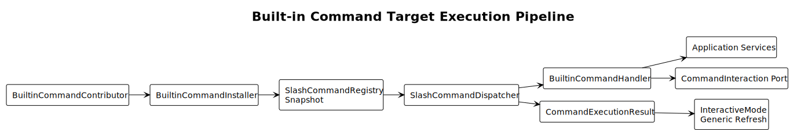

PlantUML：[查看源码](./diagrams/builtin-command/diagram.puml#L4)

目标结论：

```text
Builtin Command 定义 = name + description + executionPolicy
                     + argumentCompleter + handler

统一注册与查找       = SlashCommandRegistry
统一解析与执行       = SlashCommandParser + SlashCommandDispatcher
业务能力             = Session/Model/Auth/Reload 等 Application Service
交互能力             = CommandInteraction Port，不依赖具体 TUI 组件
执行后刷新           = 结构化 RefreshHint，不在 InteractiveMode 匹配命令字符串
```

### 1.2 设计范围

本 SR 包含：

- pi 公开 Built-in Command 的 Java 语义映射。
- Java 现有 `/help`、`/providers`、`/auth`、`/loop`、`/cron` 等宿主命令的治理。
- Built-in Command 的定义、注册、解析、执行、补全和帮助展示。
- Selector、Confirm、Secret Input 等交互端口。
- Streaming、Compaction、Reload 和 Session 切换期间的状态约束。
- 异步执行、取消、超时、错误隔离和刷新提示。
- 与 Extension Command、Skill Command、Prompt Template、RPC 的边界。
- 安全、可观测性、测试和迁移设计。

本 SR 不包含：

- 各 Selector 组件的像素级 TUI 布局。
- Session 文件格式和分支摘要算法内部实现。
- OAuth Provider 的具体协议实现。
- Skill、Prompt Template 和 Extension Loader 的重复设计。
- RPC 协议全部命令结构的重写。
- Bash `!`/`!!` 输入模式；它属于独立输入语法，不是 Slash Command。

### 1.3 设计原则

| 原则 | 说明 |
|---|---|
| 单一命令定义 | name、description、补全和 Handler 只定义一次 |
| 全部公开发现 | 已注册 Built-in 必须同时进入补全和 `/help`；不支持隐藏但可执行的命令 |
| 客户端无关 | TUI 与 App 使用同一目录和 Dispatcher，差异由 Interaction/Output Adapter 吸收 |
| 单一 Dispatcher | Built-in 与 Extension 经过同一个 Parser、Registry 和 Dispatcher |
| UI 与业务分离 | Handler 依赖交互端口和应用服务，不创建具体 TUI Component |
| 无命令名旁路 | `InteractiveMode` 不再出现 `/new`、`/model` 等字符串分支 |
| 状态约束显式 | 是否允许 Streaming/Compacting 时执行由 `executionPolicy` 声明 |
| 源码证据可追溯 | 每项 pi 对齐设计给出源码路径、符号或行号，并区分源码事实、Java 决策与设计原因 |
| 异步且可取消 | 文件、网络、模型、进程操作不得阻塞 TUI 输入线程 |
| 结构化结果 | 成功、取消、失败和刷新范围由结果对象表达 |
| 安全默认 | Secret 不进入命令参数、历史、日志或普通输出 |
| 会话切换完整 | Import、Resume、Fork、Clone 通过 RuntimeHost 原子替换运行时；Tree 通过 NavigationService 原子更新当前 Session 分支 |
| 跨端复用服务 | Slash Command 是交互适配层；RPC 调用同一应用服务而非拼接 Slash 文本 |

### 1.4 源码证据规范

本 SR 及后续设计文档必须按以下格式记录设计依据：

| 内容 | 要求 |
|---|---|
| pi 源码事实 | 给出仓库相对路径，并至少标识类、函数、常量或基线行号 |
| 观察到的行为 | 只描述源码实际发生的路由、状态变化、取消或输出，不使用目标架构术语替代事实 |
| Java 目标决策 | 明确说明对齐、收敛或有意偏离 pi |
| 设计原因 | 说明多端复用、并发、安全、可测试性或 ToB 治理等具体原因 |

行号用于基线定位，符号名用于抵抗后续代码移动。没有对应 pi 实现的 Java 宿主能力必须标记为“Java 产品扩展”，不得伪造 pi 来源。

### 1.5 PlantUML 图表源码

本 SR 的 13 个设计图统一由 [`diagrams/builtin-command/diagram.puml`](./diagrams/builtin-command/diagram.puml) 生成，Markdown 只引用生成后的 SVG，不内嵌另一份图形定义。图源中的每个 `@startuml` 使用稳定输出名，避免文档链接随生成顺序变化；每张图下方提供定位到对应 `@startuml` 的源码链接。

生成命令：

```bash
cd diagrams/builtin-command
plantuml -tsvg diagram.puml
```

`diagram.puml` 显式使用 PlantUML 内置 Smetana 布局，执行上述命令不依赖外部 Graphviz。SVG 是生成物，不得手工修改；修改图形时只编辑 `.puml` 并重新生成全部 SVG。本次使用 PlantUML `1.2026.6` 完成语法和 SVG 生成校验。

---

## 2. pi TypeScript 基线分析

### 2.1 静态命令目录

pi 在 `packages/coding-agent/src/core/slash-commands.ts:18` 定义 22 个公开 Built-in Command：

| 分组 | 命令 |
|---|---|
| 设置与模型 | `settings`、`model`、`scoped-models` |
| 导入导出与分享 | `export`、`import`、`share`、`copy` |
| 会话信息 | `name`、`session`、`changelog`、`hotkeys` |
| 会话分支 | `fork`、`clone`、`tree`、`resume` |
| 信任与认证 | `trust`、`login`、`logout` |
| 生命周期 | `new`、`compact`、`reload`、`quit` |

该数组只包含 `name` 和 `description`，主要用于名称发现与补全，不持有 Handler。

### 2.2 补全链路

`packages/coding-agent/src/modes/interactive/interactive-mode.ts:499` 把静态数组映射为 TUI `SlashCommand[]`，然后合并 Prompt Template、Extension Command 和 Skill Command：

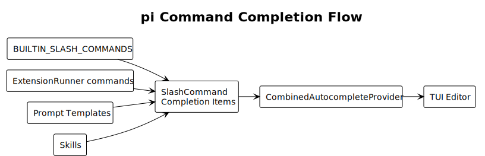

PlantUML：[查看源码](./diagrams/builtin-command/diagram.puml#L36)

只有 `/model` 在 TUI 层动态附加参数补全器：

- 候选优先使用 Session scoped models。
- 没有 scoped models 时使用 Model Registry 可用模型。
- 搜索文本同时匹配 model id 和 provider。
- 插入值使用 `provider/id`，展示 label 使用 model id。

### 2.3 执行链路

`packages/coding-agent/src/modes/interactive/interactive-mode.ts:2541` 在 Editor submit 回调中按命令字符串顺序匹配。命中后直接调用本类方法或 Selector：

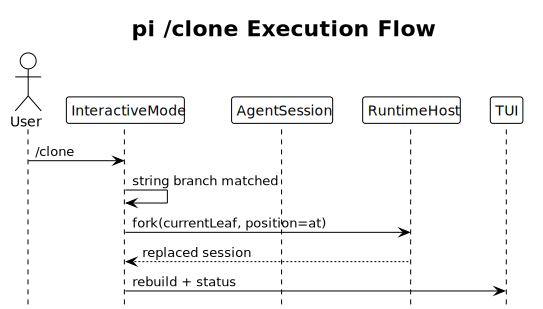

PlantUML：[查看源码](./diagrams/builtin-command/diagram.puml#L63)

命令执行优先于 Bash、Extension/Skill/Template 和普通 Prompt，因此公开 Built-in Command 不会发送给 LLM。

### 2.4 Handler 的真实落点

| 命令类型 | pi 真实执行位置 |
|---|---|
| 纯展示 | `InteractiveMode` 组装 Markdown/Text |
| Selector | `InteractiveMode` 创建对应 Selector Component |
| Session 内操作 | `AgentSession` 方法，例如 compact、setModel、export |
| Session 替换 | `AgentSessionRuntime`/`RuntimeHost`，例如 new、resume、import、fork、clone |
| 外部进程 | `InteractiveMode`，例如 share 调用 `gh` |
| Shutdown | `InteractiveMode.shutdown()` |

因此，pi 的 Built-in Command 本质上是 TUI 适配层对 Application Service 的编排，而不是一个独立核心命令框架。

### 2.5 冲突和优先级

pi 在 `packages/coding-agent/src/modes/interactive/interactive-mode.ts:484-497` 的 `getBuiltInCommandConflictDiagnostics()` 中使用 Built-in 名称集合检测 Extension 冲突：

- Extension 与 Built-in 同名时，Built-in 保持优先。
- Extension 可能以生成的 `invocationName` 暴露，也可能从补全中跳过。
- 冲突以 warning diagnostic 展示。

Java 目标设计采用更严格策略：Built-in 名称是宿主保留名称；Extension 同名注册失败，不生成隐式别名。该策略与 Extension Command SR 一致。

### 2.6 非产品输入与彩蛋

pi 的 `/debug`、`/arminsayshi`、`/dementedelves` 只存在于 `packages/coding-agent/src/modes/interactive/interactive-mode.ts:2648-2663` 的提交分支，没有进入 `packages/coding-agent/src/core/slash-commands.ts:18-40` 的 `BUILTIN_SLASH_COMMANDS`。其中 `/debug` 是上游内部诊断入口，其余是彩蛋；它们都不属于 pi 的 22 个公开产品命令基线。

Java ToB 产品不迁移 pi 彩蛋，也不建立“隐藏但可执行”的命令模型：

```text
注册为 Built-in => 进入补全和 /help
不是产品能力    => 不注册、不路由、不执行
功能未装配      => 不注册
高风险能力      => 公开发现 + 权限/确认/审计控制
```

Java 当前 `/debug` 若保留，必须产品化为公开诊断命令；默认是否装配由配置决定，安全性由权限、隐私提示、文件权限和审计保证，而不是通过隐藏名称保证。

### 2.7 客户端与 RPC 边界

pi RPC 在 `packages/coding-agent/src/modes/rpc/rpc-mode.ts:522-600` 提供 `compact`、`fork`、`clone`、`get_session_stats`、`export_html` 等类型化命令；`:635-665` 的 `get_commands` 只合并 Extension、Prompt 和 Skill，不返回 TUI Built-in。

目标结论：

- Built-in Command 是客户端无关的应用命令，TUI 和 App 使用同一 Registry/Dispatcher。
- TUI/App 分别提供 `CommandInteraction`、`CommandOutput` 和刷新适配器，不复制命令定义。
- 外部 RPC 与 Built-in 共享 Application Service；RPC 不应通过 `prompt("/command")` 间接执行 Built-in。
- RPC `get_commands` 是否返回 Built-in 属于协议目录决策，不应通过命令定义字段控制。

### 2.8 pi 基线的优点与局限

| 维度 | 优点 | 局限 |
|---|---|---|
| 可读性 | 命令语义直接，易定位交互流程 | 22 个命令形成长字符串分支 |
| TUI 集成 | Selector 和状态刷新自然 | 业务逻辑与 TUI 生命周期耦合 |
| 补全 | 静态列表简单，model 支持参数补全 | 元数据与执行分离，可能漂移 |
| 错误处理 | 每个命令可定制用户提示 | 无统一错误码和状态模型 |
| 异步 | TypeScript Handler 可 await | 状态约束和并发策略分散 |
| 多端 | Session/Runtime 服务可复用 | Slash Command 本身不能直接复用 |

### 2.9 执行模式源码证据

pi 没有 `executionPolicy` 类型。`BuiltinSlashCommand` 在
`packages/coding-agent/src/core/slash-commands.ts:13-16` 只定义 `name` 和 `description`；执行约束来自以下真实控制流：

| pi 源码 | 源码事实 | 对 Java 设计的影响 |
|---|---|---|
| `packages/coding-agent/src/modes/interactive/interactive-mode.ts:2541-2674` `setupEditorSubmitHandler()` | 22 个公开 Built-in 在 Editor submit 中先按字符串匹配并立即进入各自 workflow | Java Definition 需要声明执行模式，Dispatcher 不再依赖字符串分支推断 |
| `packages/coding-agent/src/modes/interactive/interactive-mode.ts:2694-2715` | `isCompacting` 排队和 `isStreaming` steer 逻辑位于 Built-in 分支之后 | pi 的 Built-in 默认不会进入普通输入队列；不能把“全部 idle-only”写成 pi 行为 |
| `packages/coding-agent/src/modes/interactive/interactive-mode.ts:5063-5071` `handleReloadCommand()` | `/reload` 是公开命令中唯一同时显式拒绝 Streaming 和 Compacting 的命令 | Java 使用 `REQUIRE_IDLE` 模式表达，而不是在 Handler 重复判断 |
| `packages/coding-agent/src/core/agent-session.ts:1641-1645` `compact()`、`:1413-1417` `abort()` | 手工 compact 先断开事件、取消 retry/当前 Agent，并等待 idle | Java 使用 `ABORT_AGENT_AND_RUN`；已经 Compacting 时额外拒绝重入，属于安全强化 |
| `packages/coding-agent/src/core/agent-session-runtime.ts:167-175` `teardownCurrent()`、`packages/coding-agent/src/core/agent-session.ts:717-727` `dispose()` | new/import/resume/fork/clone 提交替换时 dispose 旧 Session，并取消 retry、compaction、branch summary、bash 和 Agent | Java 使用 `RUNTIME_TRANSITION`，由 RuntimeHost 在提交点原子替换并清理旧 Runtime |
| `packages/coding-agent/src/modes/interactive/interactive-mode.ts:3362-3398` `shutdown()` | `/quit` 停止 TUI、dispose Runtime 并退出进程 | Java 使用 `SHUTDOWN` 进入不可逆终止态 |
| `packages/coding-agent/src/modes/interactive/interactive-mode.ts:5288-5293`、`:5044`、`:4510`、`:2953` | share、login、tree summary、compact 分别拥有局部取消实现 | `cancellable` 是与执行模式正交的能力，不能从 mode 自动推断 |

按 pi 源码归纳，而不是按读写性质归纳，22 个公开命令的执行模式为：

| pi 执行模式 | 命令 | 源码行为 |
|---|---|---|
| `IMMEDIATE` | `settings`、`model`、`scoped-models`、`export`、`share`、`copy`、`name`、`session`、`changelog`、`hotkeys`、`tree`、`trust`、`login`、`logout` | 命令分支直接执行，不等待 Streaming/Compacting |
| `RUNTIME_TRANSITION` | `import`、`fork`、`clone`、`new`、`resume` | 交互完成并提交替换时 dispose 旧 Runtime，再绑定新 Session |
| `ABORT_AGENT_AND_RUN` | `compact` | 取消当前 Agent 并等待 idle 后开始手工压缩 |
| `REQUIRE_IDLE` | `reload` | Streaming 或 Compacting 时显示 warning 并返回 |
| `SHUTDOWN` | `quit` | 进入关闭流程并 dispose Runtime |

这里的模式描述“命令如何处理当前 Runtime”，不是权限等级或读写分类。`tree` 在 pi 中虽然修改 Session leaf，仍然属于 `IMMEDIATE`；Java 是否因并发安全改为更严格模式，必须在命令映射中作为有意差异说明。

---

## 3. Java 当前实现与问题

### 3.1 当前架构

Java 已抽出 `SlashCommand`、`SlashCommandRegistry` 和 `BuiltinCommandRegistrar`：

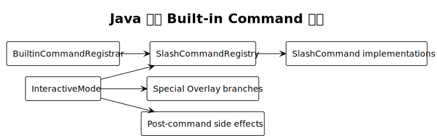

PlantUML：[查看源码](./diagrams/builtin-command/diagram.puml#L88)

当前 `SlashCommandRegistry`：

- 使用可变 `LinkedHashMap`。
- `register()` 通过 `put()` 静默覆盖同名命令。
- 同时承担存储、解析和同步执行。
- `execute()` 只返回 boolean。

### 3.2 当前命令集合

Java `BuiltinCommandRegistrar` 当前注册 27 个定义：

| 类型 | 命令 |
|---|---|
| pi 对齐或近似 | `model`、`compact`、`new`、`quit`、`settings`、`export`、`copy`、`hotkeys`、`session`、`name`、`reload`、`changelog`、`import`、`resume`、`fork`、`share`、`tree`、`scoped-models`、`login`、`logout` |
| Java 扩展 | `help`、`models`、`debug`、`auth`、`providers`、`loop`、`cron` |
| pi 已有但 Java 缺失 | `clone`、`trust` |

### 3.3 TUI 旁路

`InteractiveMode.java:648` 在 Registry 之前拦截：

- `/resume`
- `/tree`
- `/model`、`/models`

`InteractiveMode.java:667` 在 Registry 执行后又按命令字符串处理：

- `/new`、`/reload` 重建补全。
- `/new` 清空 Chat、重置 Footer、关闭并创建 SessionManager。
- `/model ...` 更新 Footer。
- `/name ...` 更新 Footer。

这导致同一命令存在两套行为：

```text
Registry Handler 行为
  + InteractiveMode 特殊拦截或补偿行为
```

`ScopedModelsCommand` 注释声称 InteractiveMode 会拦截，但当前特殊分支没有 `/scoped-models`，因此实际只输出 fallback 文本。

### 3.4 差距矩阵

| 编号 | 当前实现 | 问题 | 目标状态 |
|---|---|---|---|
| GAP-01 | Registry `put()` | 同名静默覆盖 | 原子校验，冲突失败 |
| GAP-02 | 可变 `LinkedHashMap` | 并发查询和注册无快照边界 | 不可变 Snapshot |
| GAP-03 | Registry 同时解析和执行 | 职责耦合 | Parser、Registry、Dispatcher 分离 |
| GAP-04 | `void execute()` | 无异步、取消、结构化结果 | `CompletionStage<CommandExecutionResult>` |
| GAP-05 | `boolean execute()` | 未知、失败、取消不可区分 | 结构化 DispatchStatus |
| GAP-06 | TUI 特殊分支 | 同一命令双实现 | 统一 Handler + Interaction Port |
| GAP-07 | TUI 按字符串补偿刷新 | 容易遗漏和误匹配 | `RefreshHint` |
| GAP-08 | `NameCommand` 保存实例字段 | Spring 单例跨 Session 泄漏名称 | Session 是唯一状态源 |
| GAP-09 | Command 直接依赖具体 AgentSession | 权限过大，难以多端复用 | 窄化 Facade/Application Service |
| GAP-10 | 文件和进程同步执行 | 阻塞 TUI；取消不一致 | 异步 Executor + Cancellation |
| GAP-11 | 各 Handler 自行 catch/print | 错误码、日志和用户体验不一致 | Dispatcher 统一失败边界 |
| GAP-12 | Help 与补全分别维护命令来源 | Feature、顺序和客户端目录可能漂移 | 统一 Command Catalog View |
| GAP-13 | Login 接受明文 API Key 参数 | Secret 进入历史、内存、日志风险 | Secret Input/OAuth 交互 |
| GAP-14 | Import/Resume 直接替换消息 | Runtime、资源、cwd、扩展未完整重绑 | RuntimeHost 原子切换 |
| GAP-15 | Fork 只复制当前消息 | 不支持从历史 User Message 选择 | 对齐 pi fork workflow |
| GAP-16 | Tree 直接截断消息 | 丢失分支语义和可选摘要 | Session tree navigation service |
| GAP-17 | Reload 仅 reload session 内部分资源 | 设置、主题、补全、Extension 状态可能漂移 | ReloadCoordinator |
| GAP-18 | Registrar 测试只验证 `atLeast(25)` | 无精确目录和冲突保障 | Catalog contract test |
| GAP-19 | 缺少 `clone`、`trust` | 与 pi 公开目录不完整 | 增加核心命令 |
| GAP-20 | `models`、`auth` 与主命令重叠 | 帮助噪声和语义分叉 | 显式兼容/宿主命令策略 |

### 3.5 语义差异

| 命令 | pi | Java 当前 | 目标 |
|---|---|---|---|
| `settings` | 打开可编辑 Selector | 打印设置 | 通过 CommandInteraction 打开设置界面 |
| `model` | 精确匹配或带搜索词打开 Selector | 打印/按 id 切换；无参数被 TUI 拦截 | 单一 workflow |
| `scoped-models` | 打开多选并可持久化 | fallback 文本 | 实际 Selector |
| `export` | 默认 HTML，`.jsonl` 按后缀 | 只导出 JSONL | HTML 默认 + JSONL |
| `import` | 确认并替换完整 Session Runtime | 直接替换消息 | RuntimeHost import |
| `fork` | 从历史 User Message 选择 | 当前点复制新文件 | 历史点选择 |
| `clone` | 克隆当前 leaf | 缺失 | 新增 |
| `tree` | 分支树导航，可选摘要 | 消息线性截断 | Session tree service |
| `trust` | 保存项目信任决策 | 缺失 | 新增 |
| `login` | OAuth/API Key 安全交互 | 命令参数包含 API Key | 安全交互 |
| `reload` | 重载 keybindings、extensions、skills、prompts、themes | skills/templates/system prompt | 完整 ReloadCoordinator |

---

## 4. 目标架构

### 4.1 组件图

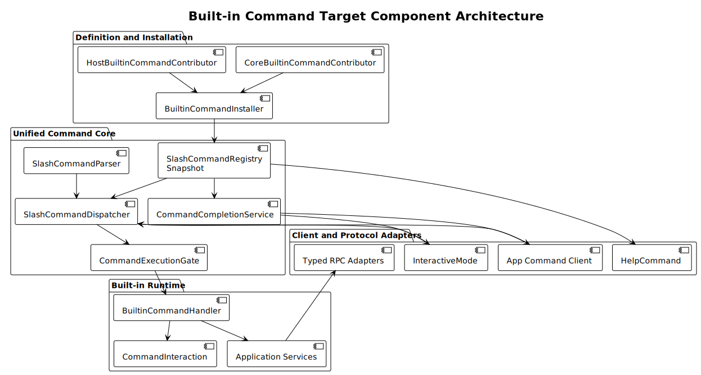

PlantUML：[查看源码](./diagrams/builtin-command/diagram.puml#L113)

### 4.2 核心职责

| 组件 | 唯一职责 | 不负责 |
|---|---|---|
| `BuiltinCommandContributor` | 声明一组宿主命令定义 | 修改 Registry |
| `BuiltinCommandInstaller` | 聚合、校验并一次安装 Built-in 集合 | 执行命令 |
| `SlashCommandRegistry` | 发布和查询不可变命令快照 | 解析输入 |
| `SlashCommandParser` | 把原始文本解析为 Invocation | 查找 Handler |
| `SlashCommandDispatcher` | 查找、执行准入、调用 Executor、隔离失败 | 创建客户端 UI 组件 |
| `CommandExecutionGate` | 按 ExecutionMode 处理立即执行、空闲拒绝、取消 Agent、Runtime 迁移和关闭，并协调命令并发 | 业务实现和 Session 替换提交 |
| `BuiltinCommandHandler` | 编排应用服务与交互端口 | 直接操作 TUI 树 |
| `CommandInteraction` | 提供 Selector、Confirm、Secret Input 等能力 | 持久化业务状态 |
| `CommandCompletionService` | 合并名称和参数补全 | 执行命令 |
| `InteractiveMode` | 输入、渲染、把执行结果应用到视图 | 按命令名实现业务 |

### 4.3 依赖方向

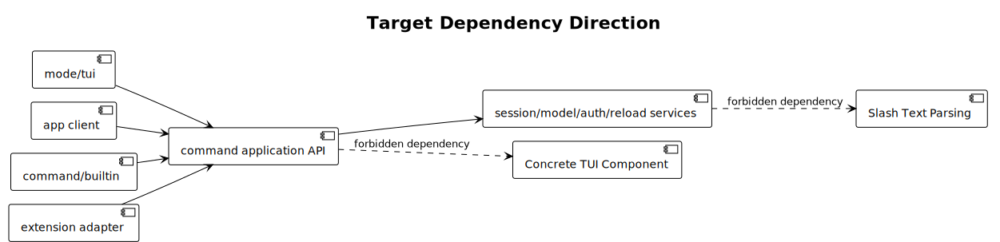

PlantUML：[查看源码](./diagrams/builtin-command/diagram.puml#L169)

---

## 5. 命令定义与内部模型

### 5.1 Built-in 定义

```java
public record BuiltinCommandDefinition(
        String name,
        String description,
        CommandExecutionPolicy executionPolicy,
        SlashCommandArgumentCompleter argumentCompleter,
        BuiltinCommandHandler handler) {
}
```

Built-in 定义是宿主内部 API，不属于 Extension SDK。`name` 和 `description` 复用 Extension Command SR 的校验规则。

状态说明：截至本 SR 基线，Java 仓库尚未实现 `BuiltinCommandDefinition`；现状仍是每个命令类直接实现 `SlashCommand.name()`、`description()` 和同步 `void execute()`。本节分析的是本 SR 目标类设计及其相对现状的改造原因。

#### 5.1.1 职责定位

`BuiltinCommandDefinition` 是 Built-in Command 的不可变声明对象，不是命令实例、运行时 Context 或 Registry 记录。它只回答五个问题：

1. 用户通过什么名称调用命令。
2. 帮助和补全如何描述命令。
3. 当前 Runtime 状态是否允许执行。
4. 参数输入如何补全。
5. 命中后调用哪个异步 Handler。

Contributor 负责创建定义，Installer 负责聚合和校验，Registry 保存适配后的内部记录，Dispatcher 负责执行。定义对象本身不访问 Spring、Session、TUI 或 App。

| 维度 | Java 当前 `SlashCommand` | 目标 `BuiltinCommandDefinition` |
|---|---|---|
| 定义方式 | 每个命令实现一个有状态或无状态类 | 一个不可变 Definition 组合 Policy、Completer 和 Handler |
| 执行返回 | `void execute()` | `CompletionStage<CommandExecutionResult>` |
| 状态准入 | 分散在 Handler/TUI 分支 | `executionPolicy` 交给统一 ExecutionGate |
| 参数补全 | 不属于命令接口，容易与执行目录分离 | `argumentCompleter` 与定义绑定 |
| 执行结果 | 无统一取消、错误码和刷新范围 | Handler 返回结构化 outcome 和 RefreshHint |

#### 5.1.2 类图

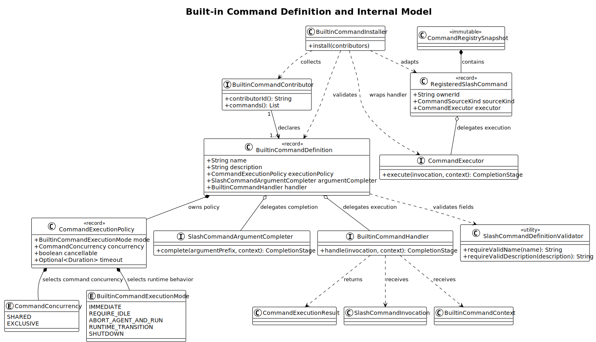

PlantUML：[查看源码](./diagrams/builtin-command/diagram.puml#L198)

类图体现两条边界：

- 定义侧只包含稳定元数据和行为策略。
- 运行侧通过 Installer 转换为 `RegisteredSlashCommand` 后进入不可变 Snapshot；`ownerId`、来源和内部 Executor 不由 Definition 提供。

#### 5.1.3 字段语义与设计原因

| 字段 | 类型 | 责任 | 设计原因 |
|---|---|---|---|
| `name` | `String` | 不含 `/` 的唯一调用名称，也是 Registry key | 对齐 `packages/coding-agent/src/core/slash-commands.ts:13-40` 的 `BuiltinSlashCommand.name`；使用稳定名称统一执行、帮助、补全、冲突和指标 |
| `description` | `String` | 面向用户的一行命令说明 | 对齐 `packages/coding-agent/src/core/slash-commands.ts:13-40` 的 `description`；帮助和补全共享同一文案，避免另建展示目录 |
| `executionPolicy` | `CommandExecutionPolicy` | 声明 Runtime 执行模式、命令并发、取消和超时约束 | pi 把这些行为分散在 submit 分支、`reload()`、`compact()`、Runtime teardown 和 shutdown 中；Java 将源码事实收敛到统一 ExecutionGate，并把跨端并发和超时明确标为产品强化 |
| `argumentCompleter` | `SlashCommandArgumentCompleter` | 根据当前参数前缀异步产生候选 | pi 在 `packages/coding-agent/src/modes/interactive/interactive-mode.ts:499-533` 只给 `/model` 动态绑定参数补全；Java 将补全与 Definition 绑定并供 TUI/App 共用 |
| `handler` | `BuiltinCommandHandler` | 异步编排应用服务和交互端口，返回结构化结果 | pi 的元数据在 `packages/coding-agent/src/core/slash-commands.ts`，执行分支在 `packages/coding-agent/src/modes/interactive/interactive-mode.ts:2541-2674`；Java 绑定二者以消除目录与执行漂移，并增加取消、失败隔离和 RefreshHint |

五个字段分别覆盖身份、发现、准入、参数发现和执行，已经构成一个可注册命令的最小完整声明。继续添加客户端、服务对象或运行时状态，会破坏定义的稳定性和可复用性。

#### 5.1.4 为什么使用 `record`

- 定义在应用启动或模块装配时创建，发布后不应变化；`record` 明确表达浅不可变的声明对象。
- 自动生成构造器和访问器，减少纯声明类型的样板代码并使字段集合透明。
- Definition 可以安全进入临时安装集合并参与原子校验，不需要可变 Builder 生命周期。
- Handler 和 Completer 虽然是行为引用，但其绑定关系在定义发布后固定；实际 Session、客户端和 Cancellation 每次执行时从 Context 获取。

`record` 的不可变性只保证组件引用不能重新赋值，不保证 Handler/Completer 实现内部无状态。Built-in Handler 和 Completer 必须是无会话状态或线程安全的 Bean，不得缓存当前 Session、客户端组件或单次 Invocation。

`equals()`/`hashCode()` 会包含 Handler 和 Completer 引用，因此命令身份仍以 `name` 为准；Catalog contract test 应逐字段验证名称、描述和 Policy，不依赖 lambda 的对象相等性。

不使用继承层次区分 `ModelCommandDefinition`、`SessionCommandDefinition` 等命令类型。命令类别不是稳定多态边界；差异由 Policy、Completer、Handler 和 Application Service 组合表达。

#### 5.1.5 构造不变量

`BuiltinCommandDefinition` 的 compact constructor 必须完成本地、确定性校验：

```java
public BuiltinCommandDefinition {
    name = SlashCommandDefinitionValidator.requireValidName(name);
    description = SlashCommandDefinitionValidator.requireValidDescription(description);
    Objects.requireNonNull(executionPolicy, "executionPolicy");
    argumentCompleter = argumentCompleter == null
            ? SlashCommandArgumentCompleter.none()
            : argumentCompleter;
    Objects.requireNonNull(handler, "handler");
}
```

具体约束：

- `name` 长度 1～64，只允许小写字母、数字和非连续连字符，不包含 `/`，不自动 trim 或转换大小写。
- `description` 经 `strip()` 后为 1～1024 个 Unicode 码点，只允许单行非控制字符文本。
- `executionPolicy` 和 `handler` 必须非 null。
- 缺少参数补全时规范化为 `SlashCommandArgumentCompleter.none()`，避免调用方和 Registry 传播 null 分支。
- Definition 只做单对象校验；重名、Contributor 依赖、保留名称冲突和原子目录完整性由 Installer 校验。

#### 5.1.6 明确排除的字段

| 不进入 Definition 的内容 | 所属位置 | 排除原因 |
|---|---|---|
| `visibility` | 不建模 | ToB 中已注册命令必须公开发现；隐藏名称不是权限控制 |
| `surfaces`/客户端类型 | TUI/App Adapter | 两端共享命令能力，客户端类型不改变命令身份 |
| `ownerId`、`sourceKind` | Installer/`RegisteredSlashCommand` | Built-in 固定由宿主绑定，避免 Definition 伪造来源或所有权 |
| Session、RuntimeHost、Application Service | `BuiltinCommandContext` | 它们是每次执行的动态依赖，不应进入静态目录对象 |
| 当前 streaming/compacting 状态 | `CommandRuntimeState` | Definition 只声明 Policy；Dispatcher 执行时捕获真实状态 |
| availability 布尔值 | Contributor 装配 | 功能不可用时不提供定义，避免注册永久 unavailable 的空壳命令 |
| alias | 独立命令定义或后续统一 Alias 机制 | 避免一个定义拥有多个隐式身份，影响冲突、帮助和审计 |

源码依据：`packages/coding-agent/src/core/slash-commands.ts:13-16` 的 Built-in 类型没有 `visibility`、`surfaces`、owner 或 availability；`packages/coding-agent/src/modes/interactive/interactive-mode.ts:499-533` 将同一数组整体交给 TUI 补全。Java 排除这些字段不是仅凭“pi 没有”，而是为了保持单一公开 Catalog；ToB 权限和客户端适配分别由安全层与 Adapter 负责。

### 5.2 客户端无关与公开发现约束

| 规则 | 影响 |
|---|---|
| 已注册 Built-in | 必须进入共享 Catalog，并由 TUI/App 的帮助和补全消费 |
| 客户端差异 | 由 `CommandInteraction`、`CommandOutput` 和刷新 Adapter 表达 |
| 功能或模块不可用 | Contributor 不提供定义，Registry 中不存在 |
| 高风险命令 | 仍然公开发现，通过权限、确认、审计和安全输出治理 |

`visibility` 和 `surfaces` 都不进入定义模型。ToB 产品中的可执行入口必须可发现、可文档化、可测试、可审计；TUI/App 的展示差异也不应改变命令身份或能力。RPC 使用类型化 Adapter 复用应用服务。

### 5.3 执行策略

以下三个 public 类型分别位于同名 Java 文件中：

```java
import java.time.Duration;
import java.util.Objects;
import java.util.Optional;

public enum BuiltinCommandExecutionMode {
    IMMEDIATE,
    REQUIRE_IDLE,
    ABORT_AGENT_AND_RUN,
    RUNTIME_TRANSITION,
    SHUTDOWN
}

public enum CommandConcurrency {
    SHARED,
    EXCLUSIVE
}

public record CommandExecutionPolicy(
        BuiltinCommandExecutionMode mode,
        CommandConcurrency concurrency,
        boolean cancellable,
        Optional<Duration> timeout) {

    public CommandExecutionPolicy {
        Objects.requireNonNull(mode, "mode");
        Objects.requireNonNull(concurrency, "concurrency");
        Objects.requireNonNull(timeout, "timeout");
        timeout.ifPresent(value -> {
            if (value.isZero() || value.isNegative()) {
                throw new IllegalArgumentException(
                        "timeout must be positive");
            }
        });
        if (mode != BuiltinCommandExecutionMode.IMMEDIATE
                && concurrency != CommandConcurrency.EXCLUSIVE) {
            throw new IllegalArgumentException(
                    "non-immediate modes must be exclusive");
        }
        if (mode == BuiltinCommandExecutionMode.SHUTDOWN
                && cancellable) {
            throw new IllegalArgumentException(
                    "shutdown cannot be user-cancellable");
        }
    }

    public static CommandExecutionPolicy immediateShared() {
        return new CommandExecutionPolicy(
                BuiltinCommandExecutionMode.IMMEDIATE,
                CommandConcurrency.SHARED,
                false,
                Optional.empty());
    }
}
```

不使用 `allowWhileStreaming`、`allowWhileCompacting`、`exclusive` 三个布尔值组合执行模式。pi 的实际行为是互斥的控制流分支，枚举可以由编译器强制 `CommandExecutionGate` 穷举，并阻止“允许 Streaming 同时又要求 idle”之类的非法组合。

#### 5.3.1 Mode 的源码依据与设计原因

| Mode | pi 源码依据 | Java Gate 语义 | 设计原因 |
|---|---|---|---|
| `IMMEDIATE` | `packages/coding-agent/src/modes/interactive/interactive-mode.ts:2541-2674` 的 Built-in 分支先于 `:2694`、`:2707` 的状态判断 | 不等待 Agent/Compaction；只按 `CommandConcurrency` 获取命令租约 | 保留 pi 的即时命令体验；是否读写不决定能否在 Streaming 时启动 |
| `REQUIRE_IDLE` | `packages/coding-agent/src/modes/interactive/interactive-mode.ts:5063-5071` 的 reload 显式检查两个状态 | Streaming、Compacting、Runtime transition 或前台独占命令存在时返回 `COMMAND_NOT_AVAILABLE`/`COMMAND_BUSY` | Reload 会替换资源和扩展上下文，必须基于稳定 generation 构建 |
| `ABORT_AGENT_AND_RUN` | `packages/coding-agent/src/core/agent-session.ts:1641-1645` 的 compact 先调用 `abort()` | 获取独占租约，取消 retry/Agent 并等待 idle；若已经 Compacting 或 Transitioning 则拒绝重入 | 对齐手工 compact 的中断语义，同时修复 pi 未显式阻止 compact 重入的风险 |
| `RUNTIME_TRANSITION` | `packages/coding-agent/src/core/agent-session-runtime.ts:167-175` 与 `packages/coding-agent/src/core/agent-session.ts:717-727` | 获取独占 transition 租约；选择/确认阶段不提前中止 Agent，RuntimeHost 提交替换时清理旧 Runtime 并原子绑定新 Runtime | 对齐 pi 的替换提交点，避免用户取消 Selector 时无谓中断当前生成 |
| `SHUTDOWN` | `packages/coding-agent/src/modes/interactive/interactive-mode.ts:3362-3398` | 原子进入 terminal state，拒绝后续命令，由 ShutdownCoordinator 取消并释放全部运行资源 | Shutdown 是不可逆生命周期转换，不应伪装成普通 exclusive command |

#### 5.3.2 正交维度

`mode` 只回答“如何处理当前 Runtime”，其余能力不得塞入枚举名称形成组合爆炸：

| 维度 | pi 源码事实 | Java 目标与原因 |
|---|---|---|
| `concurrency` | pi 没有跨命令锁；Selector/Loader 替换 Editor 只形成单 TUI 的局部独占 | 增加 `SHARED`/`EXCLUSIVE`，保证 TUI 和 App 同时调用同一 Dispatcher 时不会竞态 |
| `cancellable` | share、OAuth、branch summary、compact 分别维护自己的 AbortSignal/kill 逻辑 | 统一 Cancellation 传播和结果语义，但不从 mode 推断；例如 `IMMEDIATE` 的 share 仍可取消 |
| `timeout` | pi Built-in 没有统一 timeout | 使用 `Optional<Duration>` 明确“无强制超时”；外部进程和有限 IO 在 Java ToB 产品中增加上限 |

典型定义：

```java
CommandExecutionPolicy.immediateShared();

new CommandExecutionPolicy(
        BuiltinCommandExecutionMode.IMMEDIATE,
        CommandConcurrency.EXCLUSIVE,
        true,
        Optional.of(Duration.ofSeconds(30)));

new CommandExecutionPolicy(
        BuiltinCommandExecutionMode.REQUIRE_IDLE,
        CommandConcurrency.EXCLUSIVE,
        true,
        Optional.of(Duration.ofSeconds(60)));
```

不建立 `BuiltinCommandName` 枚举。命令名称由 Contributor 扩展，集合会随宿主模块变化；执行模式才是由 Dispatcher 封闭、稳定且必须穷举的状态集合。

### 5.4 Handler 与内部 Executor

```java
@FunctionalInterface
public interface BuiltinCommandHandler {
    CompletionStage<CommandExecutionResult> handle(
            SlashCommandInvocation invocation,
            BuiltinCommandContext context);
}
```

统一 Registry 内部不直接区分 Built-in 与 Extension Handler，而是保存内部 Executor：

```java
@FunctionalInterface
interface CommandExecutor {
    CompletionStage<CommandExecutionResult> execute(
            SlashCommandInvocation invocation,
            CommandExecutionContext context);
}
```

适配规则：

- Built-in Handler 直接适配为 `CommandExecutor`。
- Extension `CompletionStage<Void>` Handler 在完成后映射为 `CommandExecutionResult.success()`。
- Extension 只获得公开 `SlashCommandContext`，不能访问 Built-in 专用 Interaction 和宿主服务。

### 5.5 Built-in Context

```java
public record BuiltinCommandContext(
        CommandSession session,
        CommandRuntimeHost runtimeHost,
        CommandInteraction interaction,
        CommandOutput output,
        CommandCancellation cancellation) {
}
```

| 端口 | 能力 |
|---|---|
| `CommandSession` | 只暴露命令需要的 Session 查询和轻量变更 |
| `CommandRuntimeHost` | new、switch、import、fork、clone、reload、shutdown |
| `CommandInteraction` | select、confirm、secret input、editor input |
| `CommandOutput` | text、status、warning、error |
| `CommandCancellation` | signal、throwIfCancelled、onCancel |

```java
public interface CommandOutput {
    void text(String text);

    void status(String text);

    void warning(String code, String message);

    void error(String code, String message);
}
```

客户端 Adapter 把这些方法转换为第 9.2 节的 `CommandOutputEvent`；Handler 不直接构造 TUI/App 组件。

禁止把具体 `InteractiveMode`、`Tui`、`Container`、`FooterComponent` 放入 Context。

### 5.6 交互端口

```java
public interface CommandInteraction {
    CompletionStage<Optional<ModelRef>> selectModel(ModelSelectionRequest request);

    CompletionStage<Optional<ScopedModelSelection>> selectScopedModels(
            ScopedModelSelectionRequest request);

    CompletionStage<Optional<SessionRef>> selectSession(SessionSelectionRequest request);

    CompletionStage<Optional<ForkPoint>> selectForkPoint(ForkPointSelectionRequest request);

    CompletionStage<Optional<TreeNavigationRequest>> selectTreePoint(TreeSelectionRequest request);

    CompletionStage<Optional<ProjectTrustDecision>> selectProjectTrust(ProjectTrustRequest request);

    CompletionStage<Optional<AuthRequest>> selectAuthentication(AuthSelectionRequest request);

    CompletionStage<Boolean> confirm(ConfirmationRequest request);

    CompletionStage<Optional<SensitiveValue>> readSecret(SecretInputRequest request);
}
```

这些是交互语义，不是 TUI 组件类型。TUI、App 和测试分别提供对应实现；Handler 不感知客户端类型。

### 5.7 执行结果与刷新提示

```java
public record CommandExecutionResult(
        CommandOutcome outcome,
        Set<CommandRefreshHint> refreshHints,
        String errorCode,
        String userMessage) {

    public static CommandExecutionResult success() {
        return success(Set.of());
    }

    public static CommandExecutionResult success(
            Set<CommandRefreshHint> refreshHints) {
        return new CommandExecutionResult(
                CommandOutcome.SUCCESS,
                Set.copyOf(refreshHints),
                null,
                null);
    }

    public static CommandExecutionResult cancelled(String userMessage) {
        return new CommandExecutionResult(
                CommandOutcome.CANCELLED,
                Set.of(),
                null,
                userMessage);
    }
}

public enum CommandOutcome {
    SUCCESS,
    CANCELLED
}

public enum CommandRefreshHint {
    CHAT,
    FOOTER,
    MODEL,
    SESSION,
    SESSION_METADATA,
    RESOURCES,
    COMPLETIONS,
    THEME,
    KEYBINDINGS,
    SHUTDOWN
}
```

异常不作为 `CommandOutcome` 值返回；未处理异常由 Dispatcher 转换为 `SlashCommandDispatchStatus.FAILED`。

### 5.8 Registry 内部记录

```java
record RegisteredSlashCommand(
        String ownerId,
        CommandSourceKind sourceKind,
        String name,
        String description,
        CommandExecutionPolicy executionPolicy,
        SlashCommandArgumentCompleter argumentCompleter,
        CommandExecutor executor) {
}
```

Built-in 全部使用 `ownerId = "builtin"`。Host feature contributor 先聚合，再作为同一 owner 一次提交。

---

## 6. 注册与启动生命周期

### 6.1 Contributor

```java
public interface BuiltinCommandContributor {
    String contributorId();

    List<BuiltinCommandDefinition> commands();
}
```

建议 contributor：

- `CoreBuiltinCommandContributor`：pi 对齐核心命令和 `/help`。
- `AuthBuiltinCommandContributor`：`/auth`、`/providers`。
- `AutomationBuiltinCommandContributor`：`/loop`、`/cron`，仅模块存在时装配。
- `DiagnosticBuiltinCommandContributor`：配置启用时提供公开 `/debug`；未启用时不注册。

Contributor 不是第三方 Extension 点。只有宿主可信代码可以提供 Built-in 定义。

### 6.2 原子安装

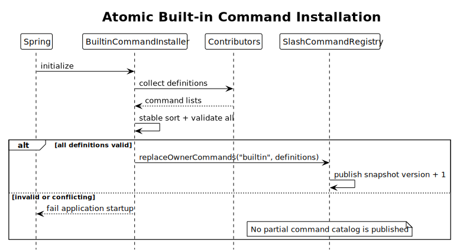

PlantUML：[查看源码](./diagrams/builtin-command/diagram.puml#L293)

### 6.3 校验规则

| 校验 | 失败行为 |
|---|---|
| name/description 不合法 | 启动失败 |
| Built-in 内部重名 | 启动失败并指出两个 contributor |
| Handler 或 policy 为 null | 启动失败 |
| Alias 指向不存在的共享 workflow | 启动失败 |
| Feature contributor 缺少依赖服务 | 不装配 contributor；不得注册 fallback 空壳命令 |

### 6.4 稳定顺序

命令展示顺序不依赖 Spring Bean 枚举顺序。目标排序：

1. 核心命令按产品定义顺序。
2. 宿主扩展命令按 contributor priority、contributorId、command name。

Registry Snapshot 同时保存 `commandsByName` 和 `orderedCommands`。

### 6.5 Reload 边界

Built-in 定义由应用版本决定，普通 `/reload` 不重新安装 Built-in。Reload 只刷新：

- settings
- keybindings
- extensions
- skills
- prompts
- themes
- models/provider metadata

应用模块集合变化需要重启。

### 6.6 新 Built-in Command 开发可行性

当前需要区分“仓库现状”和“目标架构”：

| 状态 | 是否可开发 | 开发路径 |
|---|---|---|
| Java 当前实现 | 可以，但只能使用旧接口 | 实现 `SlashCommand`，再修改 `BuiltinCommandRegistrar.registerBuiltins()` 手工注册 |
| 本 SR 目标架构 | 设计上可以，完成 M1/M2 后可编译落地 | 提供 Application Service、Handler 和 `BuiltinCommandDefinition`，由 Contributor 自动装配 |

旧路径可参考当前
`modules/coding-agent-cli/src/main/java/com/campusclaw/codingagent/command/builtin/SessionCommand.java`
和
`modules/coding-agent-cli/src/main/java/com/campusclaw/codingagent/command/builtin/BuiltinCommandRegistrar.java`，
但它仍是同步执行、集中手工注册和无结构化结果的迁移前实现。新增长期维护命令应以目标架构开发；迁移期间不得让同名命令同时出现在旧 Registrar 和新 Contributor。

### 6.7 目标开发示例：`/doctor`

`/doctor` 是 Java 产品扩展示例，pi 没有同名公开命令。其执行模式参考 pi 的 `/session`：两者都在 `packages/coding-agent/src/modes/interactive/interactive-mode.ts:2541-2674` 的 Built-in 分支中立即读取当前 Runtime 快照，不要求 Agent idle；Java 选择 `IMMEDIATE + SHARED`，原因是健康查询不修改 Session，也不占用交互组件。

示例需求：

- `/doctor` 输出当前 Agent Runtime 的只读健康检查结果。
- 不接受参数，不调用模型或外部网络。
- Streaming/Compacting 时允许执行。
- 不修改 Session，不需要 RefreshHint。
- TUI 和 App 使用同一命令定义和 Handler。

目标文件：

```text
application/
├── DoctorApplicationService.java
└── DoctorReport.java
command/builtin/
└── DoctorBuiltinCommandContributor.java
test/.../command/builtin/
└── DoctorBuiltinCommandContributorTest.java
```

#### 6.7.1 Application Service

```java
package com.campusclaw.codingagent.application;

import java.util.concurrent.CompletionStage;

public interface DoctorApplicationService {
    CompletionStage<DoctorReport> inspect();
}
```

```java
package com.campusclaw.codingagent.application;

public record DoctorReport(
        boolean modelAvailable,
        int providerCount,
        int issueCount) {}
```

Application Service 负责查询和组合业务状态，不依赖 Slash 文本、TUI/App 组件或 `CommandOutput`。

#### 6.7.2 Contributor、Definition 与 Handler

```java
package com.campusclaw.codingagent.command.builtin;

import java.util.List;
import java.util.concurrent.CompletionStage;

import com.campusclaw.codingagent.application.DoctorApplicationService;
import com.campusclaw.codingagent.command.CommandException;
import com.campusclaw.codingagent.command.SlashCommandArgumentCompleter;
import com.campusclaw.codingagent.command.SlashCommandInvocation;

import org.springframework.stereotype.Component;

@Component
public final class DoctorBuiltinCommandContributor
        implements BuiltinCommandContributor {

    private final DoctorApplicationService doctorService;

    public DoctorBuiltinCommandContributor(
            DoctorApplicationService doctorService) {
        this.doctorService = doctorService;
    }

    @Override
    public String contributorId() {
        return "diagnostics-doctor";
    }

    @Override
    public List<BuiltinCommandDefinition> commands() {
        return List.of(new BuiltinCommandDefinition(
                "doctor",
                "Check agent runtime health",
                CommandExecutionPolicy.immediateShared(),
                SlashCommandArgumentCompleter.none(),
                this::handleDoctor));
    }

    private CompletionStage<CommandExecutionResult> handleDoctor(
            SlashCommandInvocation invocation,
            BuiltinCommandContext context) {
        if (!invocation.arguments().isBlank()) {
            throw CommandException.invalidArguments("Usage: /doctor");
        }

        return doctorService.inspect()
                .thenApply(report -> {
                    context.output().text(
                            "Doctor: model=" + report.modelAvailable()
                                    + ", providers=" + report.providerCount()
                                    + ", issues=" + report.issueCount());
                    return CommandExecutionResult.success();
                });
    }
}
```

设计说明：

- Contributor 是无会话状态的 Spring 单例，只保存线程安全的 Application Service 引用。
- `name`、`description`、Policy、Completer 和 Handler 在同一个 Definition 中声明。
- `immediateShared()` 对齐 pi 中 Built-in 先于 Streaming/Compacting 普通输入判断执行的控制流；Handler 不重复检查运行状态。
- 无参数补全时显式使用 `none()`；Registry 内不传播 null。
- Handler 只解析本命令参数、调用服务、输出结果并返回结构化状态。
- 非法参数抛出带 `INVALID_COMMAND_ARGUMENTS` 的 `CommandException`，由 Dispatcher 统一转换为失败结果。
- 不需要手工调用 Registry，也不修改集中式 Registrar。

#### 6.7.3 单元测试

```java
package com.campusclaw.codingagent.command.builtin;

import static java.util.concurrent.CompletableFuture.completedFuture;
import static org.assertj.core.api.Assertions.assertThat;
import static org.mockito.Mockito.mock;
import static org.mockito.Mockito.verify;
import static org.mockito.Mockito.when;

import com.campusclaw.codingagent.application.DoctorApplicationService;
import com.campusclaw.codingagent.application.DoctorReport;
import com.campusclaw.codingagent.client.CommandInteraction;
import com.campusclaw.codingagent.command.SlashCommandInvocation;

import org.junit.jupiter.api.Test;

class DoctorBuiltinCommandContributorTest {

    @Test
    void declaresAndExecutesDoctorCommand() {
        var service = mock(DoctorApplicationService.class);
        var session = mock(CommandSession.class);
        var output = mock(CommandOutput.class);
        var contributor = new DoctorBuiltinCommandContributor(service);
        var definition = contributor.commands().getFirst();

        when(service.inspect()).thenReturn(completedFuture(
                new DoctorReport(true, 3, 0)));

        var context = new BuiltinCommandContext(
                session,
                mock(CommandRuntimeHost.class),
                mock(CommandInteraction.class),
                output,
                mock(CommandCancellation.class));

        var result = definition.handler()
                .handle(new SlashCommandInvocation(
                        "/doctor",
                        "doctor",
                        ""), context)
                .toCompletableFuture()
                .join();

        assertThat(definition.name()).isEqualTo("doctor");
        assertThat(definition.executionPolicy())
                .isEqualTo(CommandExecutionPolicy.immediateShared());
        assertThat(result.outcome()).isEqualTo(CommandOutcome.SUCCESS);
        assertThat(result.refreshHints()).isEmpty();
        verify(output).text("Doctor: model=true, providers=3, issues=0");
    }
}
```

还必须增加：

- 非法参数返回 `INVALID_COMMAND_ARGUMENTS` 的测试。
- Installer Catalog contract test，验证 `/doctor` 只注册一次且进入帮助和补全。
- TUI/App 共享 Catalog 和 Dispatcher 的集成测试。
- Service 异常、同步 Handler 异常和 exceptional completion 的隔离测试。

### 6.8 开发检查表

1. 确认能力属于宿主产品；用户或项目自定义能力应开发为 Extension Command。
2. 查找 pi 同名或同类 workflow 的源码路径、符号和控制流；没有来源时标记为 Java 产品扩展。
3. 选择符合规则且未被占用的 `name` 和单行 `description`。
4. 把业务操作放入 Application Service，不在 Handler 中实现大型业务流程。
5. 根据源码事实选择 `BuiltinCommandExecutionMode`；与 pi 不同时记录具体原因。
6. 参数候选使用 Completer；无候选显式使用 `none()`。
7. Handler 必须异步返回 `CommandExecutionResult`，长操作响应 Cancellation。
8. 输出只通过 `CommandOutput`，交互只通过 `CommandInteraction`。
9. 不在 Definition 中保存 Session、客户端组件、availability、owner 或客户端类型。
10. 增加 Definition、Handler、Installer Catalog 和 TUI/App 集成测试。
11. 不修改集中 Registrar；Contributor 由 Installer 聚合并原子发布。

---

## 7. 解析、路由与执行

### 7.1 统一输入优先级

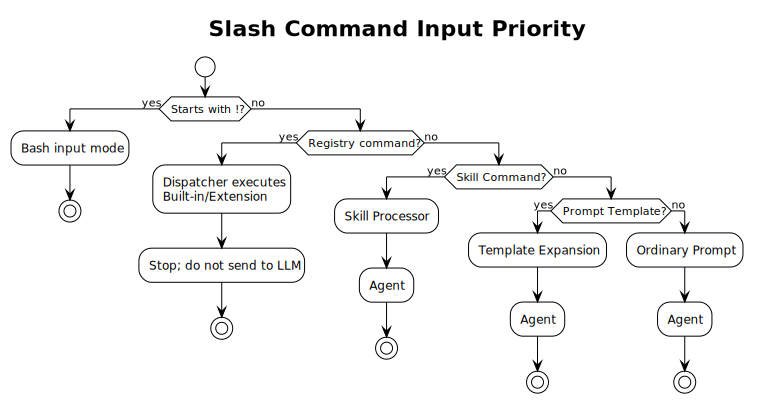

PlantUML：[查看源码](./diagrams/builtin-command/diagram.puml#L324)

Builtin 和 Extension 在 Registry 中同优先级查找，但 Built-in 名称对 Extension 保留，因此不会产生运行时二义性。

### 7.2 Parser 规则

`SlashCommandParser` 不对完整输入调用 `trim()`：

1. 输入第一个字符必须是 `/`。
2. 命令名从第二个字符开始，直到空格、Tab、换行或输入结束。
3. 命令名按 Extension Command SR 的 name 规则校验。
4. 跳过命令名后的空格和 Tab 分隔符。
5. `arguments` 保留剩余文本的内部结构和结尾；具体 Handler 决定是否 `strip()`。
6. `/modelx` 解析为命令名 `modelx`，不会误命中 `model`。
7. `/importer x` 不会误命中 `import`。

```java
public record SlashCommandInvocation(
        String rawInput,
        String name,
        String arguments) {
}
```

### 7.3 通用参数 Lexer

文件路径和简单 token 不允许每个 Handler 重写切分逻辑。提供：

```java
public interface CommandArguments {
    List<String> tokens();

    String remainder();

    void requireNoArguments();

    Path requireSinglePath();
}
```

Token Lexer 支持：

- 未加引号的单 token。
- 单引号或双引号包围的路径。
- 引号内空格。
- 明确的未闭合引号错误。
- 拒绝单路径命令后的多余 token。

不使用 Shell 解释器解析 Slash Command 参数。

### 7.4 Dispatch 时序

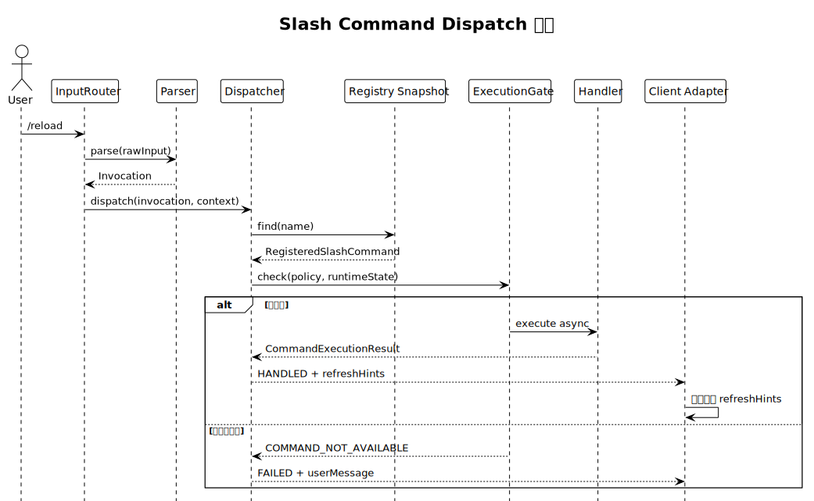

PlantUML：[查看源码](./diagrams/builtin-command/diagram.puml#L363)

pi 源码在 `packages/coding-agent/src/modes/interactive/interactive-mode.ts:2541-2674` 直接进入 Handler，并由各 workflow 自行处理状态。Java 增加 Gate 是架构收敛，不改变第 2.9 节归纳的模式语义；其原因是 TUI/App 需要共享同一个准入点、错误码和并发租约。

### 7.5 Dispatch 状态

复用 Extension Command SR：

```java
public enum SlashCommandDispatchStatus {
    NOT_COMMAND,
    NOT_FOUND,
    HANDLED,
    FAILED
}
```

用户取消 Selector、Confirm 或长任务时，Dispatcher 返回 `HANDLED`，内部结果为 `CommandOutcome.CANCELLED`。取消不是系统失败，也不继续发送普通 Prompt。

### 7.6 未知命令

- Registry 未命中时返回 `NOT_FOUND`。
- InputRouter 继续检查 Skill 和 Prompt Template。
- 非保留命名空间的未知 Slash 输入最终按普通 Prompt 策略处理。
- 已识别的 `/skill:` 失败遵循 Skill Command SR，不透传 LLM。

---

## 8. 状态、并发与取消

### 8.1 Runtime 状态快照

Dispatcher 在执行开始时捕获：

```java
public record CommandRuntimeState(
        boolean streaming,
        boolean compacting,
        boolean bashRunning,
        boolean foregroundCommandRunning,
        boolean runtimeTransitioning,
        boolean shuttingDown) {
}
```

Gate 基于一次捕获的状态做准入。Handler 开始后仍需对关键状态变化做乐观校验，例如 Session generation 是否变化。

### 8.2 ExecutionGate 模式处理

| Mode | Streaming | Compacting | Gate/RuntimeHost 动作 |
|---|---|---|---|
| `IMMEDIATE` | 不等待 | 不等待 | 按 `concurrency` 获取租约后执行；这是 pi Built-in 分支前置的默认行为 |
| `REQUIRE_IDLE` | 拒绝 | 拒绝 | Runtime 非 idle 时返回稳定错误，不进入 Handler |
| `ABORT_AGENT_AND_RUN` | 取消 Agent 并等待 idle | 拒绝重入 | 获取独占租约后调用 RuntimeControl 中止 retry/Agent，再执行 Handler |
| `RUNTIME_TRANSITION` | 选择/确认阶段可继续 | 选择/确认阶段可继续 | 获取独占 transition 租约；RuntimeHost 提交时 dispose 旧 Runtime 并发布新 generation |
| `SHUTDOWN` | 终止 | 终止 | 原子设置 shuttingDown；后续请求全部拒绝，ShutdownCoordinator 负责清理 |

`CommandExecutionGate` 必须对 `BuiltinCommandExecutionMode` 使用穷举 `switch`，不得提供吞掉未来枚举值的 `default` 分支。这样新增模式会在编译期暴露所有待更新的 Gate、测试和指标映射。

pi 没有统一 command lease。Java 增加 `SHARED`/`EXCLUSIVE` 是明确的 ToB 多端并发强化：TUI Selector 占据 Editor 并不能阻止 App 同时发起命令，因此交互、外部进程、状态变更和所有非 `IMMEDIATE` 模式默认使用 `EXCLUSIVE`。

`name` 在 pi 中无参数读取、有参数写入，但两条路径都从同一个立即执行分支进入。Java 保持 `IMMEDIATE`，写入时携带 Session generation；若期间发生 Runtime transition，则以 `SESSION_CHANGE_FAILED` 拒绝写入旧 Session。

### 8.3 单前台命令

同一 Command Runtime 同时最多执行一个独占 Built-in Command，与请求来自 TUI 还是 App 无关。重复提交时返回：

```text
COMMAND_BUSY: Another command is already running
```

`IMMEDIATE/SHARED` 命令可以在 Agent Streaming 时执行，但不得与独占租约、Runtime transition 或 Shutdown 竞态。

### 8.4 取消

可取消命令至少包括：

- `compact`
- `reload`
- `share`
- `import`
- `resume`
- `fork`
- `clone`
- `tree` 的 branch summary
- `login` OAuth/API Key workflow

pi 的取消入口分别位于 `packages/coding-agent/src/modes/interactive/interactive-mode.ts:2953`、`:4510`、`:5044`、`:5288-5293`，没有统一协议。Java 的 `cancellable` 将这些入口映射为同一 Cancellation Port；`reload` 和有限 IO 的取消属于产品强化。

`RUNTIME_TRANSITION` 的取消只允许发生在选择、确认和 candidate 构建阶段。RuntimeHost 开始提交替换后，不再以用户取消回滚一半完成的 teardown；要么发布完整新 Runtime，要么按事务边界恢复旧 Runtime。

取消必须传递到：

- `CompletableFuture`/异步任务。
- 子进程。
- 网络请求。
- Compactor 或 branch summary。
- Selector/Prompt。

取消后：

- 不发布半完成 Session 或 Reload Snapshot。
- 临时文件在 `finally` 删除。
- UI 恢复 Editor 焦点。
- 记录结果码，不记录参数正文。

### 8.5 超时

pi 的 Built-in workflow 没有共享 timeout policy；例如 `packages/coding-agent/src/modes/interactive/interactive-mode.ts:5244-5339` 的 gist 子进程依赖用户取消，没有统一计时器。下列默认值是 Java ToB 的资源治理决策，不是 pi 现状：

| 操作 | 默认超时 |
|---|---:|
| 参数补全 | 1 秒 |
| 外部进程 `gh` 探测 | 5 秒 |
| Gist 创建 | 30 秒 |
| 普通文件导入/导出 | 由文件大小策略限制，默认 60 秒 |
| OAuth | 由 Provider 配置，必须可取消 |
| Compact/Branch summary | 不设固定短超时，但必须可取消 |

---

## 9. 客户端适配、输出与刷新设计

### 9.1 TUI 与 App Client 的目标职责

TUI `InteractiveMode` 与 App Command Client 只做：

1. 接收命令名称和参数；TUI 可从 Editor 原始文本解析，App 可从 Command Palette 或结构化动作构造 Invocation。
2. 调用 Dispatcher；只有原始文本入口需要先经过 InputRouter/Parser。
3. 把 `CommandOutputEvent` 渲染为各自的文本、状态、告警或错误组件。
4. 按 `refreshHints` 调用通用 refresh service。
5. 实现 `CommandInteraction`，把请求映射为 TUI Selector 或 App Dialog/Picker。

不得：

- 判断 `text.equals("/model")`。
- 在命令执行后判断 `startsWith("/new")`。
- 直接补偿 SessionManager、Footer 或 Autocomplete 状态。

### 9.2 结构化输出

```java
public sealed interface CommandOutputEvent
        permits CommandText, CommandStatus, CommandWarning, CommandError {
}
```

| 类型 | TUI/App 渲染 | 测试/RPC 语义 |
|---|---|---|
| `CommandText` | Chat 中持久命令输出 | 文本 payload |
| `CommandStatus` | 可复用的短状态行 | status event |
| `CommandWarning` | 告警样式 | warning code/message |
| `CommandError` | 错误样式 | error code/message |

Built-in Handler 不输出 ANSI 转义码。

### 9.3 RefreshHint 应用

| Hint | 客户端 Adapter 行为 |
|---|---|
| `CHAT` | 根据当前 Session 重建 Chat |
| `FOOTER` | 重新读取模型/Session 状态 ViewModel；TUI 更新 Footer，App 更新状态区域 |
| `MODEL` | 刷新模型、thinking 和 provider 计数 |
| `SESSION` | 重新绑定 Session 事件和运行时引用 |
| `SESSION_METADATA` | 刷新名称、路径、ID |
| `RESOURCES` | 显示新 Resource Snapshot/diagnostics |
| `COMPLETIONS` | 从 CompletionService 取得新快照 |
| `THEME` | 重新应用当前主题 |
| `KEYBINDINGS` | 重新加载并绑定快捷键 |
| `SHUTDOWN` | 调用 ShutdownCoordinator |

### 9.4 Help 与补全

TUI 和 App 的 `/help`、Command Palette 与自动补全使用同一个目录视图：

```java
public interface CommandCatalogView {
    List<CommandDescriptor> list();
}
```

Catalog 返回所有已注册命令，不按客户端过滤。客户端可以改变呈现方式，但不能维护另一份命令事实源。

### 9.5 RPC

v1 决策：

- TUI 与 App 通过同一 Dispatcher 执行 Built-in。
- RPC 不把 Built-in Slash Command 作为 prompt command 暴露。
- RPC `compact`、`fork`、`clone`、`switch_session` 等调用与 Built-in 相同的 Application Service。
- `get_commands` 保持返回可通过 prompt 调用的 Extension/Skill/Template。
- 如未来需要远程命令目录，新增独立 `get_builtin_commands` 或显式 `includeBuiltins`，返回统一命令描述和 availability，不引入客户端枚举。

---

## 10. 核心命令目录与目标语义

### 10.1 pi 对齐核心命令

| 命令 | 参数 | pi Mode → Java Policy | 目标 Handler 语义 | RefreshHint |
|---|---|---|---|---|
| `/settings` | 无 | `IMMEDIATE → IMMEDIATE/EXCLUSIVE/cancellable` | 打开设置 Selector；即时应用 Session 设置并持久化用户设置 | `FOOTER`、按变化追加其他 hint |
| `/model` | `[provider/id 或搜索词]` | `IMMEDIATE → IMMEDIATE/EXCLUSIVE/cancellable` | 精确匹配则切换，否则用参数预填 Selector | `MODEL`、`FOOTER` |
| `/scoped-models` | 无 | `IMMEDIATE → IMMEDIATE/EXCLUSIVE/cancellable` | 打开多选；区分 Session-only 与 persist | `MODEL`、`FOOTER` |
| `/export` | `[path]` | `IMMEDIATE → IMMEDIATE/SHARED/cancellable` | 捕获不可变 Session snapshot；无后缀或 `.html` 导出 HTML，`.jsonl` 导出 JSONL | 无或 `CHAT` status |
| `/import` | `<path.jsonl>` | `RUNTIME_TRANSITION → 同模式/EXCLUSIVE/cancellable` | 确认后通过 RuntimeHost 导入并替换完整 Session | `SESSION`、`CHAT`、`FOOTER`、`COMPLETIONS` |
| `/share` | 无 | `IMMEDIATE → IMMEDIATE/EXCLUSIVE/cancellable` | 导出临时 HTML，创建显式 secret GitHub gist，显示 viewer/gist URL | 无 |
| `/copy` | 无 | `IMMEDIATE → IMMEDIATE/SHARED` | 复制最后一条 Assistant 文本 | 无 |
| `/name` | `[name]` | `IMMEDIATE → IMMEDIATE/SHARED` | 无参数显示当前名称；有参数按 Session generation 写 metadata | `SESSION_METADATA`、`FOOTER` |
| `/session` | 无 | `IMMEDIATE → IMMEDIATE/SHARED` | 展示 file、ID、消息、token、cache、cost、context usage | 无 |
| `/changelog` | 无 | `IMMEDIATE → IMMEDIATE/SHARED` | 展示全部 changelog；已读状态由 ChangelogService 管理 | 无 |
| `/hotkeys` | 无 | `IMMEDIATE → IMMEDIATE/SHARED` | 从 EffectiveKeybindingSnapshot 动态生成 | 无 |
| `/fork` | 无 | `RUNTIME_TRANSITION → 同模式/EXCLUSIVE/cancellable` | 选择历史 User Message，从其前方创建新 Session | `SESSION`、`CHAT`、`FOOTER`、`COMPLETIONS` |
| `/clone` | 无 | `RUNTIME_TRANSITION → 同模式/EXCLUSIVE/cancellable` | 在当前 leaf 位置复制 Session | `SESSION`、`CHAT`、`FOOTER`、`COMPLETIONS` |
| `/tree` | 无 | `IMMEDIATE → REQUIRE_IDLE/EXCLUSIVE/cancellable` | 选择树节点；可选分支摘要；通过 NavigationService 切换 | `SESSION`、`CHAT`、`FOOTER` |
| `/trust` | 无 | `IMMEDIATE → IMMEDIATE/EXCLUSIVE/cancellable` | 选择并保存项目 trust 决策；说明生效时机 | 无 |
| `/login` | `[provider]` | `IMMEDIATE → IMMEDIATE/EXCLUSIVE/cancellable` | 选择认证类型/provider；Secret Input 或 OAuth；参数只作筛选 | `MODEL`、`FOOTER` |
| `/logout` | `[provider]` | `IMMEDIATE → IMMEDIATE/EXCLUSIVE/cancellable` | 选择或定位已存 credential；不删除 env/models 配置 | `MODEL`、`FOOTER` |
| `/new` | 无 | `RUNTIME_TRANSITION → 同模式/EXCLUSIVE` | RuntimeHost 创建新 Session 并完整重绑 | `SESSION`、`CHAT`、`FOOTER`、`COMPLETIONS` |
| `/compact` | `[custom instructions]` | `ABORT_AGENT_AND_RUN → 同模式/EXCLUSIVE/cancellable` | 先中止当前 Agent，再调用 Session compaction；不足两条消息时 warning | `CHAT`、`FOOTER` |
| `/resume` | 无 | `RUNTIME_TRANSITION → 同模式/EXCLUSIVE/cancellable` | 选择 Session，处理 missing cwd/trust 后原子切换 | `SESSION`、`CHAT`、`FOOTER`、`COMPLETIONS` |
| `/reload` | 无 | `REQUIRE_IDLE → 同模式/EXCLUSIVE/cancellable` | 两阶段准备并发布 settings/resources/extensions 等新状态 | `RESOURCES`、`COMPLETIONS`、`THEME`、`KEYBINDINGS`、`FOOTER` |
| `/quit` | 无 | `SHUTDOWN → 同模式/EXCLUSIVE` | 请求 ShutdownCoordinator 优雅退出 | `SHUTDOWN` |

pi Mode 的共同源码入口是 `packages/coding-agent/src/modes/interactive/interactive-mode.ts:2541-2674`，特殊模式依据见第 2.9 节。Java 目标差异只有以下三类，均不得省略原因：

- `concurrency` 是多端共享 Dispatcher 的强化；pi 的单 TUI Editor focus 不是跨端互斥机制。
- `/tree` 从 pi 的 `IMMEDIATE` 收紧为 `REQUIRE_IDLE`。`packages/coding-agent/src/core/agent-session.ts:2702-2880` 会修改 leaf 和 `agent.state.messages`，源码未在导航前中止 Streaming；Java 为避免 App/TUI 并发修改当前上下文而有意偏离。
- export/reload 等增加统一 cancellation/timeout，来源是 ToB 响应性与资源治理要求，不宣称 pi 已提供统一机制。

### 10.2 Java 宿主命令

| 命令 | 装配策略 | 决策 |
|---|---|---|
| `/help` | 始终注册 | 保留 Java 产品能力；从统一 Catalog 生成 |
| `/models` | 始终注册 | 作为 `/model` 的独立公开兼容定义，共用同一 workflow；不新增通用 Alias 机制 |
| `/debug` | `debug.enabled=true` 时注册 | 作为公开诊断能力进入补全和帮助；需要权限校验、隐私告警、权限 0600 和审计 |
| `/providers` | Provider 模块存在时注册 | 展示 Provider/model/auth/config 状态；不展示密钥 |
| `/auth` | Auth 模块存在时注册 | 作为认证汇总入口；`login` 子命令进入安全交互，不接受 API Key 明文参数 |
| `/loop` | Automation 模块存在时注册 | 复用 LoopService |
| `/cron` | Scheduler 模块存在时注册 | 安装/卸载必须二次确认 |

### 10.3 不注册空壳命令

需要选择、确认或 Secret Input 的命令必须通过 `CommandInteraction` 表达，使 TUI 和 App 均可实现。不得注册仅输出“请在某客户端使用”的空壳 Handler。

如果必需模块或服务不存在：

- Contributor 不注册该命令。
- `/help` 和补全中不出现。
- 手工输入按未知命令策略处理。

### 10.4 公开性与非产品能力

目标设计不支持 Hidden Built-in：

- Registry 中存在的 Built-in 必须进入共享 Catalog，并由 TUI/App 的补全和帮助展示。
- 功能关闭、模块缺失或不属于产品范围时，不注册对应命令。
- 敏感命令使用权限校验、二次确认、脱敏输出和审计，不使用“用户不知道命令名”作为控制。
- pi 的 `/arminsayshi`、`/dementedelves` 和 Daxnuts 彩蛋不迁移到 Java ToB 产品。
- pi 的内部 `/debug` 不直接照搬；Java `/debug` 按独立宿主诊断能力治理，启用后公开发现。

---

## 11. 关键工作流设计

本节工作流不是脱离 pi 的重新发明。源码入口与 Java 拆分原因如下：

| 工作流 | pi 源码依据 | Java 设计原因 |
|---|---|---|
| Session 替换 | `packages/coding-agent/src/core/agent-session-runtime.ts:193-389` 的 `switchSession()`、`newSession()`、`fork()`、`importFromJsonl()` | 保留完整 Runtime teardown/rebind 语义，把 TUI 编排收敛为 `CommandRuntimeHost` |
| Fork/Clone | `packages/coding-agent/src/modes/interactive/interactive-mode.ts:4381-4442` 与 Runtime `fork()` | 两个命令共享业务服务，但 before/at 的产品语义不同，不能用 Alias 模糊 |
| Tree | `packages/coding-agent/src/modes/interactive/interactive-mode.ts:4444-4555`、`packages/coding-agent/src/core/agent-session.ts:2702-2880` | 保留分支摘要、取消和 leaf 更新；用 NavigationService 隔离 UI，并因消息状态竞态要求 idle |
| Model/Scoped Models | `packages/coding-agent/src/modes/interactive/interactive-mode.ts:4140-4379` | 保留精确匹配、搜索预填、Session scope 和持久化选择，通过 Interaction Port 复用到 App |
| Reload | `packages/coding-agent/src/modes/interactive/interactive-mode.ts:5063-5147` | 保留 idle guard 和资源重载范围；Java 增加 candidate snapshot 原子发布，避免半重载 |
| Authentication | `packages/coding-agent/src/modes/interactive/interactive-mode.ts:4699-5060` | 保留 OAuth/API Key 安全 UI 和 AbortSignal；Java 用 Secret Input Port 防止密钥进入 Slash 参数 |
| Share | `packages/coding-agent/src/modes/interactive/interactive-mode.ts:5244-5339` | 保留 secret gist、进程取消和临时文件清理；Java 增加 timeout 与非 shell 进程约束 |
| Quit | `packages/coding-agent/src/modes/interactive/interactive-mode.ts:3362-3398` | 保留有序停止 TUI、dispose Runtime 和 resume command；Java 用 Coordinator 代替异常控制流 |

### 11.1 Session 替换类命令

`new`、`import`、`resume`、`fork`、`clone` 不得直接调用：

```text
agent.clearMessages()
agent.state.appendMessage(...)
sessionManager.createSession(...)
```

统一调用 `CommandRuntimeHost`：

```java
public interface CommandRuntimeHost {
    CompletionStage<RuntimeChangeResult> newSession(CommandCancellation cancellation);

    CompletionStage<RuntimeChangeResult> switchSession(
            SessionRef session,
            SessionSwitchOptions options,
            CommandCancellation cancellation);

    CompletionStage<RuntimeChangeResult> importSession(
            Path source,
            ImportOptions options,
            CommandCancellation cancellation);

    CompletionStage<RuntimeChangeResult> fork(
            String entryId,
            ForkPosition position,
            CommandCancellation cancellation);
}
```

`RuntimeChangeResult` 必须保证：

- 新 SessionManager 已就绪。
- Agent messages、model、thinking、cwd 已恢复。
- Resource Loader 和 Extension bindings 已与新 cwd/session 对齐。
- 旧 Session 事件订阅已解绑。
- 失败或取消时旧 Runtime 继续有效。

### 11.2 Fork 与 Clone

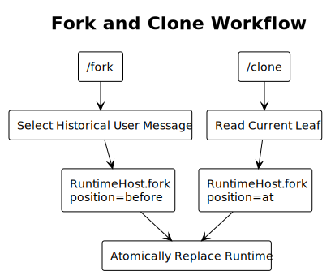

PlantUML：[查看源码](./diagrams/builtin-command/diagram.puml#L401)

Fork 和 Clone 共享 ForkService，但入口语义不同，不能把 Clone 简化为当前 Java 的“复制全部消息到新文件”。

### 11.3 Tree

Tree workflow：

1. 从 SessionManager 取得真实 entry tree。
2. Selector 支持过滤、标签更新和当前节点定位。
3. 选择当前 leaf 为 no-op。
4. 按设置决定是否询问 branch summary。
5. Summary 可取消。
6. NavigationService 生成新上下文并更新 leaf。
7. 成功后重建 Chat；失败保留原分支。

### 11.4 Model 与 Scoped Models

Model workflow 统一 `/model` 参数与 Selector：

- 先刷新 Model Registry。
- 候选优先使用 scoped models；为空时使用全部可用模型。
- 参数精确匹配 `provider/id` 或唯一 model id 时直接切换。
- 未精确匹配时作为 Selector 初始搜索词。
- 切换成功后由 SessionService 持久化 model change。
- 不支持 reasoning 的模型把 thinking 设为 off。
- 参数补全返回 `provider/id`，label 为 id，description 为 provider。

### 11.5 Reload

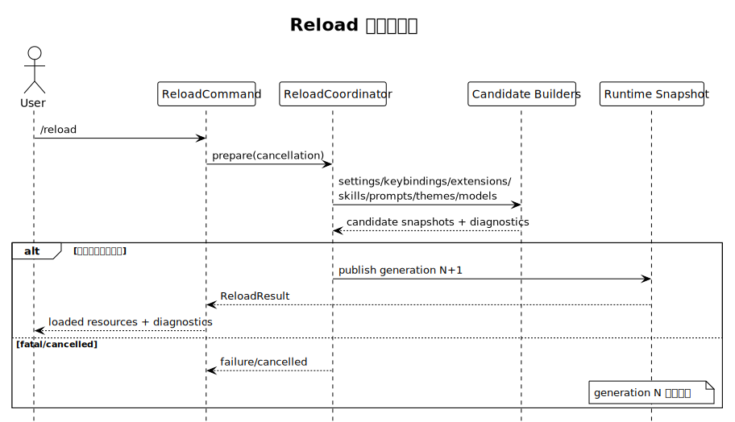

PlantUML：[查看源码](./diagrams/builtin-command/diagram.puml#L428)

跨资源原子性采用 `RuntimeConfigurationSnapshot` 或等价的发布锁实现。不能先 clear Skill，再逐条注册 Prompt/Extension。

### 11.6 Authentication

安全规则：

- `/login provider api-key` 不再作为目标语法。
- 命令参数中出现疑似 Secret 时拒绝执行并提示使用安全输入框。
- API Key 使用 masked/secret input，不回显、不进入 Editor history。
- OAuth URL、device code 和 callback 通过 AuthService 处理。
- `/logout` 只删除 AuthStore 中由 `/login` 保存的凭据。
- Environment variable 和 models/provider 配置不被静默删除。
- 登录后如当前模型未知，可按明确规则选择 Provider 默认模型；失败时提示 `/model`。

### 11.7 Share

ShareService 必须：

1. 先验证 `gh` 可执行且已认证。
2. 导出到权限受限的唯一临时 HTML 文件。
3. 使用参数数组启动进程，不通过 shell。
4. 显式传递 `--public=false`。
5. stdout/stderr 并发排空，超时计时不得被 `readAllBytes()` 阻塞。
6. 用户取消时终止子进程。
7. `finally` 删除临时文件。
8. 只显示 gist/viewer URL，不记录凭据或完整 Session 内容。

### 11.8 Quit

`QuitException` 不再作为跨层正常控制流。目标：

```java
return completedFuture(CommandExecutionResult.success(
        Set.of(CommandRefreshHint.SHUTDOWN)));
```

`ShutdownCoordinator` 负责：

- 设置 shuttingDown 原子标记。
- 取消前台命令和 Bash。
- 停止 TUI 并恢复 Terminal。
- 发出 Extension session shutdown。
- 释放 Runtime/cron/loop。
- 输出 resume command。
- 最终退出进程。

---

## 12. 自动补全与帮助

### 12.1 名称补全

`CommandCompletionService` 消费同一 Registry Snapshot：

```text
Registry commands
  + Prompt Template Catalog
  + SkillCommandProjector
  -> stable merge/filter
  -> Editor suggestions
```

Built-in 不再单独维护静态补全数组。

### 12.2 参数补全

首版 Built-in 参数补全：

| 命令 | 候选 |
|---|---|
| `/model` | 可用或 scoped model 的 `provider/id` |
| `/export` | 文件路径补全，由 Editor path provider 处理 |
| `/import` | `.jsonl` 文件路径补全 |
| `/login` | 可认证 Provider |
| `/logout` | 已保存 credential 的 Provider |
| `/resume` | v1 使用 Selector，不提供文本参数补全 |
| `/loop` | `list`、`stop` 和 interval 示例 |
| `/cron` | `install`、`uninstall`、`status` |

Completer 失败、超时或返回 null 时按空列表处理，并记录 diagnostic，不影响命令执行。

### 12.3 Help

`HelpCommand` 从 `CommandCatalogView` 读取：

- Built-in commands。
- Extension commands。
- Skill 动态投影项。
- Prompt Templates。

按来源分组，使用同一 description。任何可执行 Built-in 都必须展示。

### 12.4 冲突

| 场景 | 结果 |
|---|---|
| Built-in 内部同名 | 应用启动失败 |
| Extension 与 Built-in 同名 | Extension 注册失败，Built-in 不变 |
| Prompt Template 与 Built-in 同名 | Built-in 执行优先；产生诊断，模板不出现在冲突补全项 |
| Skill `skill:name` | 保留命名空间，不与 Registry Built-in 比较普通名称 |

---

## 13. 错误模型

### 13.1 错误码

至少包括：

- `INVALID_COMMAND_ARGUMENTS`
- `COMMAND_NOT_AVAILABLE`
- `COMMAND_BUSY`
- `COMMAND_CANCELLED`
- `COMMAND_TIMEOUT`
- `COMMAND_FAILED`
- `INTERACTION_UNAVAILABLE`
- `SESSION_CHANGE_FAILED`
- `RELOAD_FAILED`
- `AUTH_FAILED`
- `EXPORT_FAILED`
- `IMPORT_FAILED`
- `EXTERNAL_PROCESS_FAILED`

已知、可安全展示的命令失败使用统一异常类型，不允许各 Handler 自定义异常解析规则：

```java
package com.campusclaw.codingagent.command;

import java.util.Objects;

public final class CommandException extends RuntimeException {
    private final String errorCode;

    public CommandException(String errorCode, String userMessage) {
        super(Objects.requireNonNull(userMessage, "userMessage"));
        this.errorCode = Objects.requireNonNull(errorCode, "errorCode");
    }

    public static CommandException invalidArguments(String userMessage) {
        return new CommandException("INVALID_COMMAND_ARGUMENTS", userMessage);
    }

    public String errorCode() {
        return errorCode;
    }
}
```

Dispatcher 只把 `errorCode()` 和安全的 `getMessage()` 写入失败结果；未知异常统一映射为 `COMMAND_FAILED`，详细堆栈仅进入带 correlationId 的内部日志。

### 13.2 失败边界

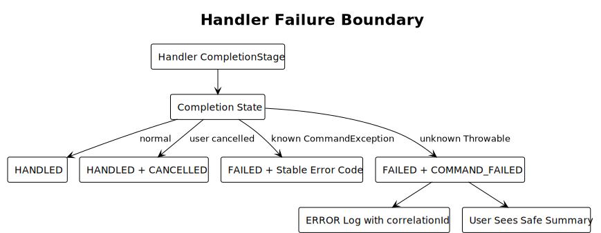

PlantUML：[查看源码](./diagrams/builtin-command/diagram.puml#L461)

### 13.3 禁止行为

- 不在 Handler 中吞掉所有 `Exception` 后只打印字符串。
- 不把 stack trace、API Key、完整参数或 Session 内容输出给用户。
- 不因单个命令失败终止 TUI。
- 不把已命中的失败命令作为普通 Prompt 发送给 LLM。

---

## 14. 安全设计

### 14.1 信任边界

| 能力 | 风险 | 控制 |
|---|---|---|
| Project trust | 加载项目 Extension/Skill/配置 | TrustStore + 明确选择 |
| Import/Export | 任意路径读写 | 规范化路径、权限错误、确认覆盖 |
| Share | 会话内容外发 | 用户显式命令、secret gist、可取消 |
| Login | Credential 泄漏 | Secret Input、禁止参数明文、日志脱敏 |
| Debug | System prompt/消息泄漏 | 公开发现、权限校验、权限 0600、显式隐私提示、审计 |
| Cron | 持久化 OS 调度 | 二次确认、显示安装位置、可审计 |
| External process | 命令注入和僵尸进程 | 参数数组、无 shell、timeout/cancel/cleanup |

### 14.2 路径规则

- 使用当前 Runtime cwd，不读取全局 `System.getProperty("user.dir")` 作为唯一来源。
- 相对路径相对 Runtime cwd 解析。
- Import 只接受 regular file。
- Export 覆盖已有文件前需要确认或使用明确 overwrite option。
- 路径错误不得升级为 fatal runtime error，除非 Runtime 已部分替换且无法回滚。

### 14.3 Secret 处理

- `SensitiveValue.toString()` 必须返回掩码。
- 不把 Secret 放入 `CommandExecutionResult.userMessage`。
- 不把 Secret 放入 metrics label、MDC、exception message。
- Editor history 不保存 Secret Input。
- AuthStore 文件权限和原子写由 AuthService 保证。

### 14.4 输出转义

Command 输出由不同客户端使用对应转义：

- TUI Text 不接受 Handler 提供的 ANSI。
- Markdown 内容由 Renderer 负责安全处理。
- URL 必须校验 scheme。
- RPC 输出按 JSON serializer 处理，不拼接 JSON 字符串。

---

## 15. 配置设计

```yaml
commands:
  unknownSlashPolicy: prompt
  argumentCompletionTimeoutMs: 1000
  externalProcessTimeoutSeconds: 30

share:
  provider: github-gist
  gistVisibility: secret

debug:
  enabled: false
  includeSystemPrompt: false

automationCommands:
  loopEnabled: true
  cronEnabled: true
```

约束：

- `share.gistVisibility` v1 固定 `secret`，不允许通过普通命令参数改为 public。
- `debug.enabled=false` 时不注册 `/debug`；启用后必须进入补全和 `/help`。
- 关闭 feature 时不注册对应命令，而不是注册后返回 unavailable。
- 配置变更在 `/reload` 成功后生效；Built-in 目录变化仍要求重启，除非只是 availability 过滤。

---

## 16. 模块落点

```text
modules/coding-agent-cli/src/main/java/com/campusclaw/codingagent/
├── command/
│   ├── SlashCommandInvocation.java
│   ├── SlashCommandParser.java
│   ├── SlashCommandDispatcher.java
│   ├── SlashCommandDispatchResult.java
│   ├── SlashCommandDispatchStatus.java
│   ├── SlashCommandRegistry.java
│   ├── SlashCommandArgumentCompleter.java
│   ├── CommandException.java
│   ├── CommandCompletionService.java
│   ├── CommandCatalogView.java
│   ├── internal/
│   │   ├── RegisteredSlashCommand.java
│   │   ├── CommandRegistrySnapshot.java
│   │   ├── CommandExecutor.java
│   │   ├── CommandExecutionContext.java
│   │   ├── CommandExecutionGate.java
│   │   └── SlashCommandDefinitionValidator.java
│   └── builtin/
│       ├── BuiltinCommandDefinition.java
│       ├── BuiltinCommandContributor.java
│       ├── BuiltinCommandInstaller.java
│       ├── BuiltinCommandHandler.java
│       ├── BuiltinCommandContext.java
│       ├── CommandSession.java
│       ├── CommandRuntimeHost.java
│       ├── CommandOutput.java
│       ├── CommandCancellation.java
│       ├── BuiltinCommandExecutionMode.java
│       ├── CommandConcurrency.java
│       ├── CommandExecutionPolicy.java
│       ├── CommandExecutionResult.java
│       ├── CommandOutcome.java
│       ├── CommandRefreshHint.java
│       ├── CoreBuiltinCommandContributor.java
│       ├── AuthBuiltinCommandContributor.java
│       ├── AutomationBuiltinCommandContributor.java
│       └── handlers/
├── application/
│   ├── SessionApplicationService.java
│   ├── ModelApplicationService.java
│   ├── AuthApplicationService.java
│   ├── ShareApplicationService.java
│   └── ReloadCoordinator.java
└── client/
    ├── CommandInteraction.java
    ├── tui/
    │   └── TuiCommandInteraction.java
    └── app/
        └── AppCommandInteraction.java
```

迁移期间现有 `*Command` 类可以作为 Handler Adapter 保留，但不得继续直接实现同步 `SlashCommand.execute()` 作为最终形态。

---

## 17. 功能需求

### 17.1 定义与注册

- FR-BC-001：Built-in 命令必须通过 Contributor 声明。
- FR-BC-002：Installer 必须聚合并一次原子安装 `ownerId=builtin`。
- FR-BC-003：Built-in 内部重名必须阻止启动。
- FR-BC-004：Extension 不得覆盖 Built-in 名称。
- FR-BC-005：Registry 必须使用不可变 Snapshot。
- FR-BC-006：命令展示顺序必须稳定且与 Spring Bean 顺序无关。
- FR-BC-007：Feature 不可用时不得注册空壳命令。

### 17.2 路由与执行

- FR-BC-101：Built-in 与 Extension 必须使用同一 Parser、Registry 和 Dispatcher。
- FR-BC-102：已命中的 Built-in 不得进入 LLM Prompt。
- FR-BC-103：Dispatcher 必须返回结构化状态。
- FR-BC-104：Handler 必须返回 `CompletionStage<CommandExecutionResult>`。
- FR-BC-105：用户取消必须作为 handled cancellation，不得继续路由。
- FR-BC-106：Handler 异常不得终止宿主。
- FR-BC-107：ExecutionGate 必须穷举执行 `BuiltinCommandExecutionMode`，不得使用 `default` 吞掉未来模式。
- FR-BC-108：TUI/App Client Adapter 不得按具体命令名处理行为或刷新。
- FR-BC-109：所有非 `IMMEDIATE` 模式必须是 `EXCLUSIVE`；非法 Policy 必须在构造时失败。
- FR-BC-110：`RUNTIME_TRANSITION` 必须在选择/确认阶段保留旧 Runtime，在提交点通过 RuntimeHost 原子替换。
- FR-BC-111：pi 22 个公开命令的 pi Mode、Java Policy 和有意差异必须由 Catalog contract test 精确验证。

### 17.3 UI 与发现

- FR-BC-201：所有已注册 Built-in 必须进入共享 Catalog，并同时供 TUI/App 的补全和帮助使用。
- FR-BC-202：不得在 Registry 之外保留可执行但不可发现的 Built-in 字符串分支。
- FR-BC-203：`/model` 必须支持参数补全。
- FR-BC-204：Selector/Confirm/Secret Input 必须通过 `CommandInteraction`。
- FR-BC-205：Handler 不得依赖具体 TUI Component。
- FR-BC-206：刷新必须由 `CommandRefreshHint` 驱动。

### 17.4 命令语义

- FR-BC-301：Java 必须提供 pi 公开 22 个核心 Built-in Command。
- FR-BC-302：`/clone` 和 `/trust` 必须补齐。
- FR-BC-303：`/export` 默认 HTML，`.jsonl` 按后缀导出。
- FR-BC-304：Session 替换类命令必须通过 RuntimeHost。
- FR-BC-305：`/fork` 必须支持从历史 User Message 选择。
- FR-BC-306：`/tree` 必须使用 Session tree，不得仅截断内存消息。
- FR-BC-307：`/reload` 失败或取消必须保留旧有效状态。
- FR-BC-308：`/login` 不得接收或记录明文 API Key 参数。
- FR-BC-309：`/share` 必须显式创建 secret gist 并可靠清理临时文件。
- FR-BC-310：`/quit` 必须通过 ShutdownCoordinator，不使用异常作为正常控制流。

---

## 18. 非功能需求

| ID | 类别 | 要求 |
|---|---|---|
| NFR-BC-001 | 性能 | 命令查找平均 O(1) |
| NFR-BC-002 | 性能 | 1000 个命令名称过滤目标小于 20 ms |
| NFR-BC-003 | 响应性 | Handler/Completer 不阻塞客户端 UI 事件线程 |
| NFR-BC-004 | 并发 | 同一 Runtime 最多一个独占前台命令 |
| NFR-BC-005 | 一致性 | Session 替换成功前旧 Runtime 保持完整可用 |
| NFR-BC-006 | 一致性 | Reload 失败保留旧 generation |
| NFR-BC-007 | 可取消 | 长操作必须响应 Cancellation |
| NFR-BC-008 | 可靠性 | 单命令失败后客户端和 Agent Session 仍可使用 |
| NFR-BC-009 | 安全 | Secret 不得进入历史、日志、metrics 或普通输出 |
| NFR-BC-010 | 安全 | 外部进程不得通过 shell 拼接命令 |
| NFR-BC-011 | 可测试性 | Parser、Gate、Handler、Dispatcher 可脱离 Spring 和真实客户端单测 |
| NFR-BC-012 | 可观测性 | 每次执行包含 correlationId、name、result、durationMs |
| NFR-BC-013 | 隐私 | INFO 日志不记录完整 arguments、消息或 System Prompt |
| NFR-BC-014 | 兼容性 | Java 21；不依赖 preview feature |
| NFR-BC-015 | 可追溯性 | 每项源自 pi 的设计记录 pi commit、源码路径、符号或行号、观察行为和 Java 设计原因；差异明确分类 |

---

## 19. 可观测性

### 19.1 日志事件

| 事件 | 级别 | 字段 |
|---|---|---|
| `builtin_commands_installed` | INFO | snapshotVersion、count、contributors |
| `builtin_command_started` | DEBUG | correlationId、name、sessionId、mode、concurrency |
| `builtin_command_completed` | DEBUG | correlationId、name、mode、outcome、durationMs、refreshHints |
| `builtin_command_rejected` | WARN | correlationId、name、mode、errorCode、runtimeState |
| `builtin_command_failed` | WARN/ERROR | correlationId、name、mode、errorCode、durationMs |
| `builtin_command_cancelled` | INFO | correlationId、name、mode、durationMs |

禁止字段：

- 完整 arguments。
- API Key、OAuth code、authorization header。
- 完整 Session 消息、System Prompt、Skill 正文。
- 未脱敏本机路径，除非 DEBUG 且通过隐私策略允许。

### 19.2 指标

- `builtin_command_execution_total{name,mode,result}`
- `builtin_command_execution_duration_ms{name,mode}`
- `builtin_command_rejected_total{name,mode,reason}`
- `builtin_command_cancelled_total{name,mode}`
- `builtin_command_external_process_duration_ms{name}`
- `builtin_command_registry_size`

命令名和执行模式都来自受控 Built-in 目录，可作为低基数 label。`concurrency` 只保留在日志中，避免增加无必要的指标维度；用户参数不得作为 label。

---

## 20. 测试设计

### 20.1 单元测试

`BuiltinCommandInstallerTest`：

- 精确验证命令目录、顺序，以及第 10.1 节规定的 mode/concurrency/cancellable/timeout。
- 重名、非法名称、null Handler 启动失败。
- Feature contributor 缺失时对应命令不注册。
- 安装为一次 `replaceOwnerCommands`，不逐条暴露半成品。

`BuiltinCommandDefinitionTest`：

- `name` 和 `description` 的长度、字符与规范化边界。
- `executionPolicy`、`handler` 为 null 时构造失败。
- null `argumentCompleter` 规范化为 `none()`。
- Definition 不携带 owner、客户端、Session 或 availability 状态。
- Policy 拒绝非正 timeout、使用 `SHARED` 的非 `IMMEDIATE` 模式，以及可取消的 `SHUTDOWN`。

`SlashCommandParserTest`：

- 普通文本、`/`、无参数、有参数、多行参数。
- Tab 分隔、引号路径、未闭合引号。
- `/modelx`、`/importer` token boundary。
- 不对完整输入做破坏性 trim。

`CommandExecutionGateTest`：

- `IMMEDIATE/SHARED` 在 Streaming 和 Compacting 中允许。
- `REQUIRE_IDLE` 在 Streaming、Compacting 和 Transitioning 中拒绝。
- `ABORT_AGENT_AND_RUN` 中止 Agent 并等待 idle，已经 Compacting 时拒绝重入。
- `RUNTIME_TRANSITION` 在交互阶段不提前中止 Agent，提交后发布新 Runtime generation。
- `SHUTDOWN` 原子进入终止态并拒绝新命令。
- `REQUIRE_IDLE/SHARED`、`RUNTIME_TRANSITION/SHARED`、`SHUTDOWN/cancellable` 等非法组合构造失败。
- 独占命令与 TUI/App 两端的并发提交互斥。

`SlashCommandDispatcherTest`：

- `NOT_COMMAND`、`NOT_FOUND`、`HANDLED`、`FAILED`。
- 用户取消映射为 handled cancellation。
- Handler 同步抛错和 exceptional completion 均被隔离。
- timeout 和 cancellation 传播。

### 20.2 Handler 测试

每个 Handler 使用 Fake Service/Fake Interaction，不启动真实 TUI/App、Provider 或网络：

- `ModelCommandHandlerTest`：精确匹配、搜索 Selector、取消、切换失败。
- `SessionChangeCommandHandlerTest`：new/import/resume/fork/clone 成功与回滚。
- `TreeCommandHandlerTest`：当前 leaf、摘要、取消、标签。
- `ReloadCommandHandlerTest`：成功 generation、失败保留、取消保留。
- `AuthCommandHandlerTest`：Secret 不进入参数/输出；OAuth 取消。
- `ShareCommandHandlerTest`：gh 未安装、未登录、timeout、cancel、cleanup、secret flag。
- `HelpCommandHandlerTest`：Registry 与共享 Catalog 完整映射。

### 20.3 集成测试

使用 `TestTerminal`、Fake App Client 或 Fake CommandInteraction；同一目录契约必须在 TUI 和 App 两端验证：

1. 输入 `/model`，出现 Selector。
2. 选择模型，Session 与 Footer 从统一 refresh hint 更新。
3. 输入 `/new`，RuntimeHost 切换 Session，Chat/Footer/补全刷新。
4. 输入 `/reload`，新增 Skill/Extension Command 同时出现在新补全快照。
5. 输入 `/clone`，当前 leaf 被复制并重绑。
6. 输入 `/trust`，保存决定并显示生效提示。
7. 启用 `/debug` 后，命令同时出现在 `/help` 和补全；关闭后 Registry 中不存在。
8. Extension 尝试注册 `model`，注册失败且 Built-in 不变。

### 20.4 安全测试

- API Key 不出现在 Editor history、Command output、日志捕获或异常消息。
- Share ProcessBuilder 参数不经过 shell。
- Gist 命令包含 `--public=false`。
- 临时文件在成功、失败、timeout、cancel 四种路径全部删除。
- Debug 文件权限和默认内容符合隐私配置。
- Import/Export 路径引号、空格、非法路径和覆盖确认。

### 20.5 现有测试迁移

| 当前测试 | 目标 |
|---|---|
| `BuiltinCommandRegistrarTest` 只验证 `atLeast(25)` | 精确 Catalog contract test |
| 每个同步 `*CommandTest` | Handler + Fake Service 测试 |
| `InteractiveModeTest` 只验证 `/help` | Dispatcher/Interaction/RefreshHint 集成测试 |
| App 单独维护 Command Palette | TUI/App 共享 Catalog contract test |
| `NameCommandTest` | 验证 Session 是唯一名称状态源 |
| `LoginLogoutCommandTest` | 增加 Secret 泄漏断言 |
| `ResumeCommandTest` | 验证 RuntimeHost 完整切换和回滚 |

禁止在测试中调用真实模型、OAuth、GitHub、crontab 或 launchd。

---

## 21. 迁移设计

### 21.1 M1：命令核心收敛

- 落地 Extension Command SR 的 Parser、Snapshot Registry、Dispatcher。
- 给现有 `SlashCommand` 增加临时 Adapter。
- 保持现有命令输出不变，先移除 Registry 的 silent overwrite。

### 21.2 M2：定义与结果模型

- 引入 `BuiltinCommandDefinition`、`BuiltinCommandExecutionMode`、`CommandConcurrency` 和 policy。
- Registrar 改为 Contributor + Installer 原子安装。
- `/help` 和补全改为 Registry Catalog View。
- `/debug` 改为可选公开诊断命令；`/models` 作为公开兼容命令。

### 21.3 M3：交互端口

- 引入 `CommandInteraction`、`TuiCommandInteraction` 和 `AppCommandInteraction`。
- 迁移 `/model`、`/resume`、`/tree` Selector。
- 补齐 `/scoped-models` 的真实 Selector。
- 删除 `handleSpecialOverlayCommand()`。

### 21.4 M4：通用刷新

- 引入 `CommandExecutionResult` 和 `RefreshHint`。
- 迁移 `/new`、`/reload`、`/model`、`/name`。
- 删除 `handleSlashCommandWithSideEffects()`。
- TUI/App Client Adapter 只应用通用 hint。

### 21.5 M5：RuntimeHost 与 pi 语义

- 迁移 new/import/resume/fork/clone 到 RuntimeHost；tree 迁移到 NavigationService。
- 新增 `/clone`、`/trust`。
- 对齐 export、settings、reload 语义。

### 21.6 M6：异步、安全与宿主命令

- Handler 改为 `CompletionStage`。
- Share、Compact、Auth、Reload 接入 Cancellation。
- `/login` 改为 Secret Input/OAuth，拒绝明文 Secret 参数。
- Automation commands 迁移为 feature contributor。
- 移除同步 `SlashCommand.execute()` 和 `QuitException` 正常控制流。

### 21.7 回滚边界

每个里程碑必须保留一个完整执行路径。禁止同时保留：

```text
新 Dispatcher 执行一部分命令
  + InteractiveMode 字符串分支执行另一部分同名命令
```

迁移单个命令时，以命令为单位切换：注册新 Handler后立即删除该命令的 TUI 旁路。

---

## 22. 验收场景

| ID | 场景 | 验收结果 |
|---|---|---|
| AC-BC-01 | 应用启动 | Built-in 目录一次原子安装，无重复名称 |
| AC-BC-02 | TUI 输入 `/`，App 打开 Command Palette | 两端显示同一批已注册 Built-in，无客户端私有目录 |
| AC-BC-03 | 输入 `/help` | 与补全使用同一名称和 description |
| AC-BC-04 | Extension 注册 `model` | 注册失败，`/model` 仍为 Built-in |
| AC-BC-05 | `/model anthropic/claude...` | 精确切换并刷新 Footer |
| AC-BC-06 | `/model opus` 未精确匹配 | Selector 以 `opus` 作为初始搜索词 |
| AC-BC-07 | `/scoped-models` | 实际打开多选，而不是输出 fallback 文本 |
| AC-BC-08 | `/new` | 完整 Runtime 切换；InteractiveMode 无命令名补偿逻辑 |
| AC-BC-09 | `/fork` | 可从历史 User Message 创建新 Session |
| AC-BC-10 | `/clone` | 当前 leaf 在 `position=at` 克隆 |
| AC-BC-11 | `/tree` 摘要取消 | 原分支保持不变，TUI 可继续使用 |
| AC-BC-12 | `/import` 失败 | 旧 Session 完整保留 |
| AC-BC-13 | `/reload` 构建失败 | 旧资源、命令和补全 generation 保留 |
| AC-BC-14 | Streaming 时 `/session` | 成功展示只读统计 |
| AC-BC-15 | Streaming 时 `/new` | 进入 `RUNTIME_TRANSITION`；RuntimeHost 提交替换时中止旧 Agent，并只发布完整新 Session |
| AC-BC-16 | `/login` | Secret 不出现在命令行、历史、日志或输出 |
| AC-BC-17 | `/share` 取消 | 子进程终止，临时文件删除，Editor 恢复 |
| AC-BC-18 | 启用 `/debug` | 命令出现在补全和帮助；执行经过权限、隐私提示和审计 |
| AC-BC-19 | `/cron` 模块未装配 | 命令不注册、不展示 |
| AC-BC-20 | Handler 异常 | UI 显示安全错误，宿主继续可用 |
| AC-BC-21 | `/quit` | Terminal、Extension、Runtime 有序释放，无 QuitException 控制流 |
| AC-BC-22 | RPC clone | 与 `/clone` 复用同一 ForkService 语义 |
| AC-BC-23 | Streaming 时 `/compact` | 中止当前 Agent、等待 idle 后压缩；不会产生两个并发 compaction |
| AC-BC-24 | Streaming/Compacting 时 `/reload` | `REQUIRE_IDLE` 拒绝执行并保留旧资源 generation |
| AC-BC-25 | Streaming 时 `/tree` | Java 按已记录的安全差异拒绝导航，当前 leaf 和 Agent messages 不变 |

---

## 23. 决策记录

| 决策 | 结论 | 原因 |
|---|---|---|
| pi 源码如何进入设计结论 | 每项对齐设计记录源码路径、符号/行号、源码事实、Java 决策和原因 | 防止把目标抽象误写成 pi 现状，并让差异可审计 |
| Built-in 执行模式如何建模 | `BuiltinCommandExecutionMode` 枚举 | pi 的五类控制流互斥且需要 Gate 穷举；布尔组合会产生矛盾状态 |
| 并发、取消和超时是否合并进 Mode | 否，作为 `CommandExecutionPolicy` 正交字段 | pi 的 share 等 `IMMEDIATE` 命令也可取消；合并会造成枚举组合爆炸 |
| Built-in 与 Extension 是否共用 Registry/Dispatcher | 是 | 消除两套命令核心 |
| 是否直接照搬 pi 的长字符串分支 | 否 | Java 已有 Registry，目标应收敛而非复制局限 |
| Handler 是否直接创建 TUI Component | 否 | 保持核心可测试和多端复用 |
| Selector 如何接入 | `CommandInteraction` Port | 表达交互语义，不泄漏 TUI 类型 |
| 执行后 UI 如何刷新 | `RefreshHint` | 消除命令名字符串补偿 |
| Built-in 是否在 `/reload` 时重新注册 | 否 | Built-in 集合由应用模块决定 |
| Built-in 是否进入 RPC `get_commands` | v1 否 | 该 RPC 当前描述可通过 prompt 调用的资源；TUI/App Built-in 仍共享 Dispatcher |
| 是否保留 `surfaces` 字段 | 否 | TUI/App 都支持命令；客户端差异由 Interaction/Output Adapter 表达，字段只会制造能力漂移 |
| `/help` 是否保留 | 是，Java 产品扩展 | Java 当前依赖统一帮助；Extension SR 也要求 |
| 是否支持 Hidden Built-in | 否 | ToB 可执行入口必须可发现、可文档化、可测试和可审计；隐藏名称不是权限控制 |
| `/models` 如何处理 | 公开独立定义，共用 workflow | 不新增 Alias 机制，也不静默移除现有入口 |
| `/debug` 是否公开 | 启用时公开 | 诊断风险通过权限、确认、文件权限和审计治理；关闭时不注册 |
| pi 彩蛋是否迁移 | 否 | 彩蛋不属于 ToB 产品命令能力 |
| `/login provider key` 是否保留 | 否 | 明文 Secret 参数不可接受 |
| Session 切换是否直接改消息列表 | 否 | 必须重绑完整 Runtime |
| 用户取消是否是失败 | 否 | 取消是已处理结果，不应进入后续路由 |
| Feature 不可用时是否注册 fallback | 否 | 发现列表必须反映真实可用能力 |
| Quit 是否使用异常 | 否 | 正常生命周期通过 ShutdownCoordinator 表达 |

---

## 24. 开放问题

1. `/auth` 与 `/login` 的职责是否需要收敛；v1 保留两个公开入口，但必须复用认证 workflow。
2. `/cron install` 是否要求项目 trust 之外的独立系统权限确认；推荐需要。
3. `RuntimeConfigurationSnapshot` 是单一 AtomicReference，还是多个 Snapshot 在发布锁下切换；由 Reload 实现 SR 决定，但必须满足外部原子可见性。
4. 是否为 Built-in 增加稳定 machine-readable command id；v1 使用 name，重命名视为删除旧命令并新增。

---

## 25. 结论

Java Built-in Command 的目标不是把 pi 的 `if (text === "/...")` 逐行翻译为 Java，而是保留其产品语义，并把实现收敛到统一命令架构：

```text
Trusted Builtin Contributors
  -> 原子安装 ownerId=builtin
  -> Registry Snapshot
  -> Parser + Dispatcher + ExecutionGate
  -> BuiltinCommandExecutionMode + CommandConcurrency
  -> Builtin Handler
  -> Application Service + CommandInteraction
  -> 结构化 Output + RefreshHint
  -> Client Adapter 通用渲染
```

最终状态：

- pi 公开 22 个核心命令语义完整落地，彩蛋不迁移。
- Java 已注册宿主命令全部公开发现，并有明确 feature 和安全策略。
- TUI 与 App 共享同一命令目录和 Dispatcher，不在定义中声明客户端类型。
- Built-in 与 Extension 共用 Registry/Dispatcher。
- Built-in 的 Runtime 行为由基于 pi 源码归纳的执行模式枚举表达；跨端并发、取消和超时作为正交策略治理。
- Skill 和 Prompt Template 保持各自动态投影/展开边界。
- TUI/App Client Adapter 不再含命令名分支或副作用补偿。
- Session 切换、Reload、Auth、Share 等高风险流程具备原子性、取消和错误隔离。
- 补全、帮助、执行和测试共享同一命令事实源。
