# pi-mono Java Command SR 设计

> 文档编号：SR-CMD-001<br>
> 版本：v1.5<br>
> 日期：2026-07-14<br>
> 状态：设计基线<br>
> pi 源码基线：[`bb959aae017eedc8edaa91d01d0475d483ea9371`](https://github.com/badlogic/pi-mono/tree/bb959aae017eedc8edaa91d01d0475d483ea9371)

## 1. 结论

Java 版本使用一个静态注册的 `CommandDefinition` 表达原 Built-in Command 与 Extension Command：

- 两类命令均由内部受信任开发人员编写，安全边界一致。
- 命令集合在应用启动时完成发现、校验和原子发布，并在进程生命周期内保持不变。
- 命令名是目录内唯一身份；启动诊断使用 Contributor Bean 类定位来源。
- TUI 与 App 共享命令目录、分发器和 Handler，并分别实现交互与输出端口。
- 注册表示公开：每个可执行命令都会进入目录、帮助和审计。
- 客户端能力通过 Context 端口检测；命令身份与具体客户端解耦。

本设计以 pi Built-in Command 的源码行为为主要基线，但不复制其集中式字符串路由。Java 版本把 pi 分散在元数据、补全、执行分支和会话控制流中的事实，收敛为一个不可变定义和一条统一执行管线。

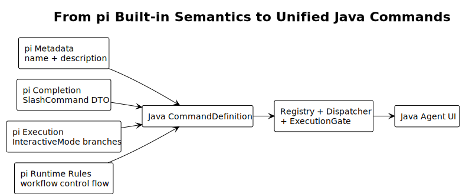

[查看 PlantUML 源码](./diagrams/command/diagram.puml#L4) · [查看 pi Built-in 定义源码](https://github.com/badlogic/pi-mono/blob/bb959aae017eedc8edaa91d01d0475d483ea9371/packages/coding-agent/src/core/slash-commands.ts#L13-L40)

## 2. 范围与约束

### 2.1 设计范围

本设计覆盖：

- 命令定义、发现、启动校验和不可变目录发布；
- 输入解析、命令解析优先级和统一分发；
- 执行模式、并发、取消和超时；
- 参数补全、帮助和客户端适配；
- 新命令开发方式、错误模型、测试和迁移；
- Skill Command 与注册命令的边界。

具体业务服务实现、LLM Prompt Template 展开规则和 Skill 文件发现规则分别由对应模块设计。

### 2.2 已确认的 Java 产品约束

| 约束 | 设计影响 |
|---|---|
| Built-in 与 Extension 都由内部人员开发 | 使用同一个 `CommandDefinition`、`CommandHandler` 和注册流程 |
| 命令集合在进程启动时固定 | 目录原子发布一次，并在进程生命周期内保持不可变 |
| TUI 与 App 都支持命令 | 两个客户端实现同一组交互与输出端口 |
| ToB 中所有命令均为公开产品能力 | 注册同时驱动执行、帮助、补全和审计 |
| pi Built-in 是主要行为基线 | 执行模式、路由顺序和补全能力必须能追溯到固定源码 |

## 3. pi 源码分析

### 3.1 Built-in 定义实际包含什么

pi 的 [`BuiltinSlashCommand`](https://github.com/badlogic/pi-mono/blob/bb959aae017eedc8edaa91d01d0475d483ea9371/packages/coding-agent/src/core/slash-commands.ts#L13-L16) 只有：

| 字段 | pi 含义 | Java 处理 |
|---|---|---|
| `name` | 不带 `/` 的调用名 | 保留为 `CommandDefinition.name` |
| `description` | 补全列表中的用户说明 | 保留为 `CommandDefinition.description` |

pi 在同一文件中公开列出 22 个 Built-in Command。它没有 Handler、执行策略或参数补全字段；这些行为在其他位置绑定。

### 3.2 元数据、补全和执行是分离的

pi 将 Built-in 元数据映射为补全 DTO，并对 `/model` 单独挂接参数补全；源码见 [`createBaseAutocompleteProvider()`](https://github.com/badlogic/pi-mono/blob/bb959aae017eedc8edaa91d01d0475d483ea9371/packages/coding-agent/src/modes/interactive/interactive-mode.ts#L499-L570)。

执行则由 [`setupEditorSubmitHandler()`](https://github.com/badlogic/pi-mono/blob/bb959aae017eedc8edaa91d01d0475d483ea9371/packages/coding-agent/src/modes/interactive/interactive-mode.ts#L2541-L2715) 中按命令名排列的分支完成。

这造成三个事实源：

1. 目录决定哪些命令出现在补全中；
2. 补全方法决定少数命令的参数建议；
3. 提交路由决定命令是否真正可执行。

Java 版本将三者合并到 `CommandDefinition`，避免“可执行但不公开”“帮助存在但无 Handler”或“参数补全与命令实现脱节”。

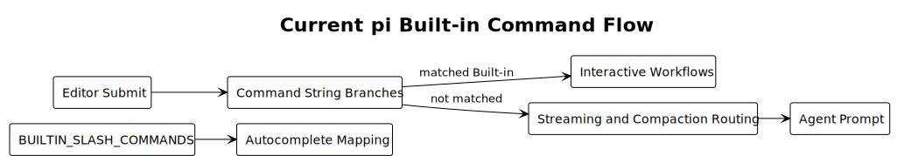

[查看 PlantUML 源码](./diagrams/command/diagram.puml#L33) · [查看 pi 提交路由源码](https://github.com/badlogic/pi-mono/blob/bb959aae017eedc8edaa91d01d0475d483ea9371/packages/coding-agent/src/modes/interactive/interactive-mode.ts#L2541-L2715)

### 3.3 Java 采用公开注册模型

pi 提交路由中还存在 `/debug`、`/arminsayshi` 和 `/dementedelves` 分支，但它们不在 `BUILTIN_SLASH_COMMANDS` 公开目录中，见 [`interactive-mode.ts`](https://github.com/badlogic/pi-mono/blob/bb959aae017eedc8edaa91d01d0475d483ea9371/packages/coding-agent/src/modes/interactive/interactive-mode.ts#L2641-L2663)。

Java ToB 产品采用以下公开注册规则：

- 产品命令清单排除彩蛋命令；
- 诊断能力以普通公开命令注册，并进入帮助、权限和审计；
- 命令的注册状态同时决定其可执行性和可发现性。

### 3.4 pi 隐含了多种执行控制流

pi 没有显式 `executionPolicy`，但源码表现出不同执行模式：

- `/reload` 在 streaming 或 compacting 时拒绝执行，见 [`handleReloadCommand()`](https://github.com/badlogic/pi-mono/blob/bb959aae017eedc8edaa91d01d0475d483ea9371/packages/coding-agent/src/modes/interactive/interactive-mode.ts#L5063-L5071)；
- `/compact` 先断开并终止当前 Agent，再开始压缩，见 [`AgentSession.compact()`](https://github.com/badlogic/pi-mono/blob/bb959aae017eedc8edaa91d01d0475d483ea9371/packages/coding-agent/src/core/agent-session.ts#L1641-L1645)；
- `/new`、`/import`、`/resume`、`/fork`、`/clone` 会创建、导入或替换会话运行时；运行时替换中的 teardown 见 [`agent-session-runtime.ts`](https://github.com/badlogic/pi-mono/blob/bb959aae017eedc8edaa91d01d0475d483ea9371/packages/coding-agent/src/core/agent-session-runtime.ts#L167-L175)；
- `/quit` 进入终止流程；
- 其余命令直接进入交互或服务调用。

因此 Java 用枚举表达有限的执行模式是合理的。相比多个布尔值，枚举能让 `switch` 穷尽检查，并消除 `requiresIdle=true` 与 `abortAgent=true` 同时出现一类矛盾组合。

## 4. 目标架构

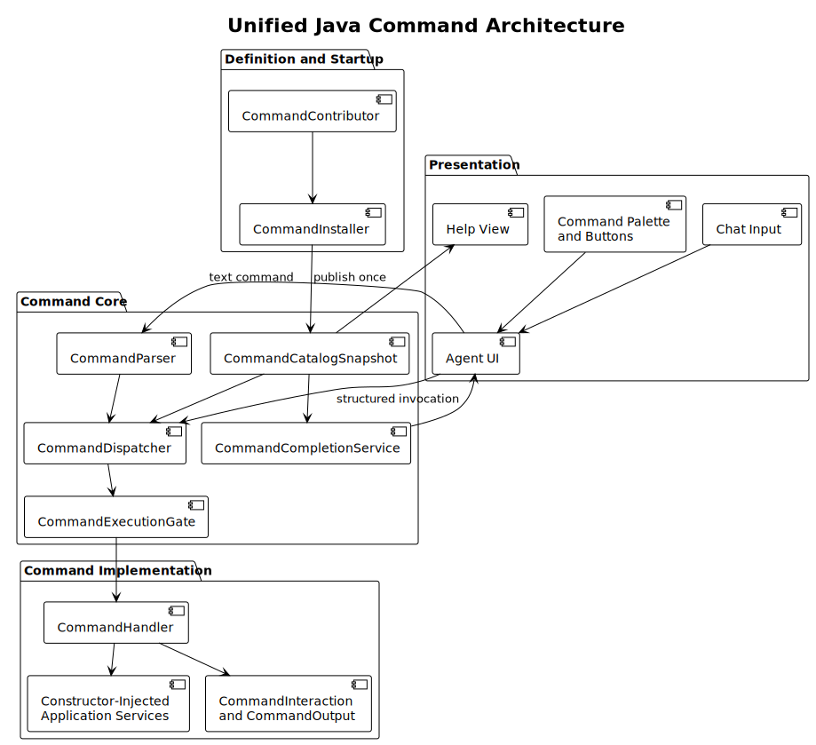

[查看 PlantUML 源码](./diagrams/command/diagram.puml#L61)

架构分为四层：

| 层 | 组件 | 职责 |
|---|---|---|
| 定义与启动 | `CommandContributor`、`CommandInstaller` | 声明命令，启动期收集和校验 |
| 命令核心 | `CommandCatalogSnapshot`、Parser、Dispatcher、Gate | 查询、解析、准入和统一执行 |
| 命令实现 | Handler、应用服务、交互端口 | 实现单个命令业务行为 |
| 客户端 | TUI Adapter、App Adapter | 提供输入、交互、输出和刷新适配 |

关键依赖方向为“客户端 → 命令核心 → Handler → 应用服务”。Handler 不依赖具体 TUI 或 App 类。

## 5. 统一类设计

### 5.1 类图

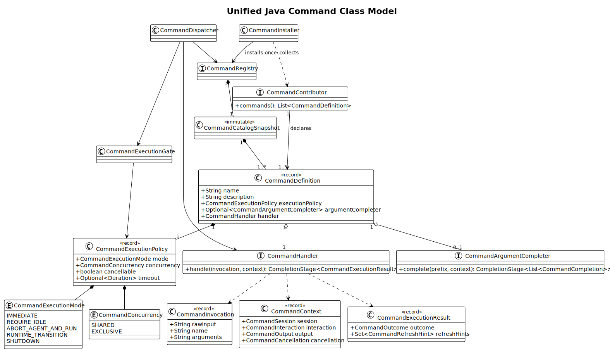

[查看 PlantUML 源码](./diagrams/command/diagram.puml#L114)

### 5.2 `CommandDefinition`

```java
public record CommandDefinition(
        String name,
        String description,
        CommandExecutionPolicy executionPolicy,
        Optional<CommandArgumentCompleter> argumentCompleter,
        CommandHandler handler) {

    public CommandDefinition {
        name = CommandNames.requireValid(name);
        description = CommandDescriptions.requirePresent(description);
        executionPolicy = Objects.requireNonNull(executionPolicy, "executionPolicy");
        argumentCompleter = Objects.requireNonNull(argumentCompleter, "argumentCompleter");
        handler = Objects.requireNonNull(handler, "handler");
    }
}
```

字段定义：

| 字段 | 必填 | 含义 | 设计原因 |
|---|---:|---|---|
| `name` | 是 | 省略前导 `/` 的规范命令名 | 与 pi Built-in `name` 对齐，也是目录唯一键 |
| `description` | 是 | 面向用户的命令说明 | 同时供补全、帮助和 App Command Palette 使用 |
| `executionPolicy` | 是 | 命令在不同 Agent 状态下如何执行，以及命令之间能否并行 | 将 pi 隐含的执行规则显式化并集中执行 |
| `argumentCompleter` | 是 | 当前命令的可选参数补全器；`Optional.empty()` 表示无参数补全 | 将 pi `/model` 的独立绑定收回定义；避免 `null` 和空实现对象 |
| `handler` | 是 | 命令业务入口 | 保证目录内每个命令都能执行 |

使用 `record` 的原因：定义是启动期值对象，需要不可变数据、结构化相等和低样板代码。构造器完成规范化，目录发布后始终读取同一份值。

命名约束：

- 最长 64 个字符；
- 使用正则 `^[a-z0-9]+(?:-[a-z0-9]+)*$`；
- 允许小写 ASCII 字母、数字和单个连字符分隔段；
- 第一个字符和最后一个字符为字母或数字；
- 区分参数与命令名，`/model gpt` 的名称是 `model`，参数原文是 `gpt`；
- 名称全局唯一；冲突使启动校验失败。

pi Built-in Command 没有名称正则。这里采用的是 Java 一致性约束，并与 pi [`Skill name` 校验](https://github.com/badlogic/pi-mono/blob/bb959aae017eedc8edaa91d01d0475d483ea9371/packages/coding-agent/src/core/skills.ts#L89-L113) 对齐，使注册命令和 `/skill:<name>` 使用相同的用户输入字符集。

`description` 在 trim 后必须包含内容。定义层不使用正文正则，也不设置统一长度上限；TUI/App 在展示时根据界面宽度执行单行化和截断。该边界与 pi 将 Skill description 投影到补全项、再由 [`SelectList`](https://github.com/badlogic/pi-mono/blob/bb959aae017eedc8edaa91d01d0475d483ea9371/packages/tui/src/components/select-list.ts#L98-L99) 处理显示宽度的方式一致。

### 5.3 核心模型之外的能力

| 关注点 | 采用的设计 | 核心模型无需额外字段的原因 |
|---|---|---|
| 命令身份 | `name` 是目录唯一键 | 静态目录只有一套身份消费者 |
| 来源诊断 | Installer 记录 Contributor Bean 类 | Bean 类可以定位冲突定义 |
| 命令类别 | 所有内部命令使用同一 `CommandDefinition` | Built-in 与 Extension 共享执行、安全和生命周期语义 |
| 可见性 | 注册同时驱动执行、帮助、补全和审计 | ToB 产品采用公开命令清单 |
| 客户端支持 | Context 端口报告当前客户端能力 | TUI 与 App 共享命令身份和 Handler |
| 启用状态 | Contributor 在启动时决定是否提供定义 | 目录快照直接表达最终启用集合 |
| 冲突处理 | 重名使启动校验失败 | 显式错误比优先级覆盖更容易诊断 |

新增字段需要同时给出实际消费者，以及现有字段无法推导该信息的证据。

### 5.4 `CommandHandler`

```java
@FunctionalInterface
public interface CommandHandler {
    CompletionStage<CommandExecutionResult> handle(
            CommandInvocation invocation,
            CommandContext context);
}
```

Handler 负责单个命令的业务流程，例如解析该命令参数、调用 `SessionService`、通过交互端口请求确认并返回刷新提示。框架与 Handler 的正向职责边界如下：

| 职责所有者 | 负责内容 |
|---|---|
| Parser | 识别命令输入并生成 `CommandInvocation` |
| Registry / Dispatcher | 查询定义并建立一次命令调用 |
| ExecutionGate | 应用 `executionPolicy`、并发、取消和超时 |
| CommandHandler | 执行命令参数语义和业务服务调用 |
| Client Adapter | 将 Interaction、Output 和刷新提示渲染到 TUI/App |
| Dispatcher | 统一记录日志、指标并映射异常 |

### 5.5 Handler 与内部 Executor 的区别

命令开发者使用唯一扩展点 `CommandHandler`。基础设施通过 `CommandDispatcher` 与 `CommandExecutionGate` 完成通用执行；实现若使用 `CommandExecutor` 类名，它仍属于这组内部基础设施。

| 维度 | `CommandHandler` | 内部 Executor / Dispatcher + Gate |
|---|---|---|
| 数量 | 通常每个命令一个 | 全应用一套 |
| 编写者 | 命令开发者 | 命令框架维护者 |
| 输入 | 已解析 invocation 与 context | 原始调用、目录定义、运行时状态 |
| 职责 | 业务动作 | 查找、策略准入、互斥、超时、取消、错误映射、观测 |
| 命令语义 | 实现具体参数和业务含义 | 读取通用定义和策略 |
| 依赖 | 通过构造器注入业务服务 | 依赖 Registry、Gate 和观测组件 |
| 生产调用位置 | 由 Dispatcher 在 Gate 准入后调用 | 作为客户端执行入口 |

分离原因是策略必须一致执行。如果每个 Handler 自己检查 busy 状态或自己实现超时，Java 会重现 pi 的分散控制流。

### 5.6 `CommandContext`

```java
public record CommandContext(
        CommandSession session,
        CommandInteraction interaction,
        CommandOutput output,
        CommandCancellation cancellation) {
}
```

Context 携带本次调用的会话状态和客户端能力：

| 字段 | 含义 |
|---|---|
| `session` | 当前命令可见的会话身份与状态视图 |
| `interaction` | 选择、确认、文本输入等交互端口 |
| `output` | 结构化状态、警告、错误和内容输出端口 |
| `cancellation` | 本次调用的取消状态及 `USER`、`TIMEOUT`、`SHUTDOWN` 原因 |

`ModelService`、`SessionService`、`ExportService` 等应用服务通过 Handler 构造器注入。Context 因此保持调用态数据结构，Handler 依赖也能在构造器和测试中直接识别。

### 5.7 Contributor

```java
public interface CommandContributor {
    List<CommandDefinition> commands();
}
```

Contributor 是启动期聚合边界，一个功能模块通过它声明一组命令。Installer 使用 Contributor Bean 类名和命令名生成来源诊断；命令目录仍以 `name` 作为唯一身份。

## 6. 启动安装与目录

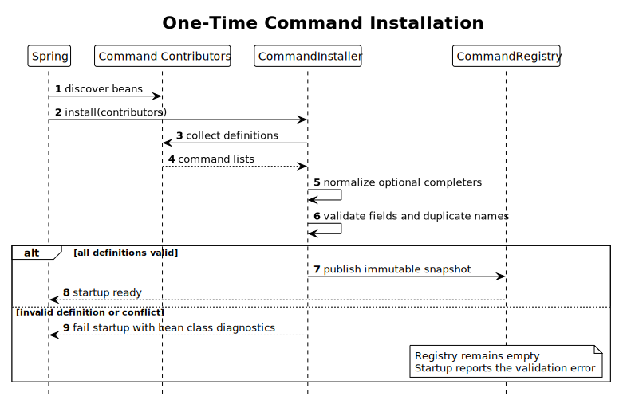

[查看 PlantUML 源码](./diagrams/command/diagram.puml#L210)

`CommandInstaller` 在 Spring 启动阶段执行：

1. 按稳定顺序读取所有 `CommandContributor` Bean；
2. 在局部候选集合中规范化和校验全部定义；
3. 检查空字段、非法名称、重复名称和缺失 Handler；
4. 全部通过后，一次性发布 `CommandCatalogSnapshot`；
5. 任一命令校验失败时，应用启动失败，并通过命令名与 Bean 类指出错误来源。

只有全部命令校验成功，完整目录才会一次性发布。任何一个命令有误，Registry 都保持空快照，不会出现部分命令已经可用的状态，因此不需要运行期 rollback 机制。

建议目录接口：

```java
public interface CommandRegistry {
    Optional<CommandDefinition> find(String name);
    List<CommandDefinition> list();
}
```

实现持有一个不可变快照：

```java
final class ImmutableCommandRegistry implements CommandRegistry {
    private volatile CommandCatalogSnapshot snapshot = CommandCatalogSnapshot.empty();

    void install(CommandCatalogSnapshot candidate) {
        // Guarded so installation can succeed exactly once.
    }
}
```

目录顺序使用显式稳定规则，例如 Contributor 的 Spring Order 后接定义声明顺序。帮助与补全使用该顺序展示；重名始终进入冲突错误流程。

## 7. 输入解析与路由

### 7.1 路由优先级

pi 在普通 prompt 之前处理 Built-in；Bash、压缩和 streaming 又有特定分支，见 [`setupEditorSubmitHandler()`](https://github.com/badlogic/pi-mono/blob/bb959aae017eedc8edaa91d01d0475d483ea9371/packages/coding-agent/src/modes/interactive/interactive-mode.ts#L2541-L2715)。Java 保留产品级优先级，但将具体命令分支替换为目录查询。

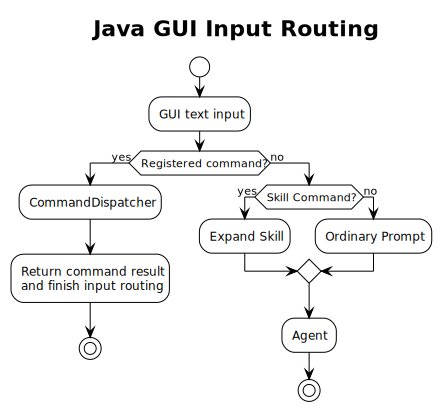

[查看 PlantUML 源码](./diagrams/command/diagram.puml#L246)

推荐顺序：

1. `/name ...` 且 `name` 在静态目录中：注册命令；
2. `!` 或 `!!`：Bash 输入；
3. `/skill:name ...`：Skill Command 动态投影；
4. Prompt Template；
5. 普通 Agent Prompt。

输入匹配到注册命令后，系统执行命令并把结果返回客户端，本次输入不会再发送给 LLM。只有 Skill、Template 和普通 Prompt 路径产生的消息会进入 LLM。

### 7.2 Parser 规则

```java
public record CommandInvocation(
        String rawInput,
        String name,
        String arguments) {
}
```

- Parser 从首个 token 提取命令名，并把剩余文本交给对应 Handler 解释；
- `rawInput` 为审计和兼容诊断保留原始输入，日志记录使用脱敏副本；
- `arguments` 保留命令名之后的原始内容，并去除命令名后的首段空白；
- 空输入和单独 `/` 返回 `NOT_A_COMMAND`，非法命令名返回稳定解析错误；
- 未注册 `/x` 返回 `UNRESOLVED_SLASH_INPUT`，输入路由器随后检查 Skill 和 Prompt Template。

## 8. 统一分发

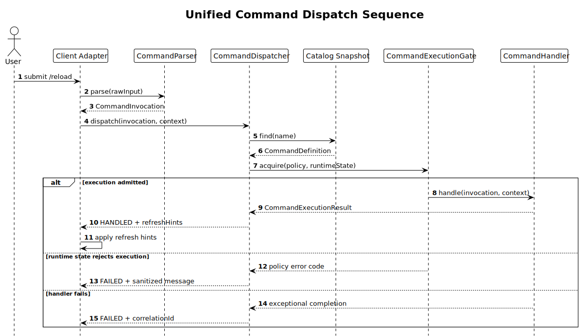

[查看 PlantUML 源码](./diagrams/command/diagram.puml#L283)

分发流程：

1. `CommandParser` 产生 `CommandInvocation`；
2. Dispatcher 在当前快照中按规范名查询；
3. 系统根据 execution policy、Agent 状态和命令并发情况判断当前是否可以执行；
4. 可以执行时，系统创建取消与超时控制并调用 Handler；
5. Handler 返回结构化结果；
6. Dispatcher 记录指标、映射异常并返回客户端；
7. 客户端执行通用刷新提示。

第 3、4 步统一由 `CommandExecutionGate` 实现，Handler 只处理具体命令的业务逻辑。

建议结果模型：

```java
public record CommandExecutionResult(
        CommandOutcome outcome,
        Set<CommandRefreshHint> refreshHints) {

    public static CommandExecutionResult completed() {
        return new CommandExecutionResult(CommandOutcome.COMPLETED, Set.of());
    }
}

public enum CommandOutcome {
    COMPLETED,
    CANCELLED
}

public enum CommandRefreshHint {
    SESSION,
    MODEL,
    COMMANDS,
    TRANSCRIPT,
    SETTINGS
}
```

Dispatcher 对客户端返回的状态应至少区分：`HANDLED`、`NOT_FOUND`、`REJECTED`、`FAILED`。客户端响应包含稳定错误码、安全消息和 correlation ID；完整异常堆栈进入受控诊断日志，参数在记录前完成脱敏。

## 9. Execution Policy

### 9.1 类型

```java
public record CommandExecutionPolicy(
        CommandExecutionMode mode,
        CommandConcurrency concurrency,
        boolean userCancellable,
        Optional<Duration> timeout) {
}

public enum CommandExecutionMode {
    IMMEDIATE,
    REQUIRE_IDLE,
    ABORT_AGENT_AND_RUN,
    RUNTIME_TRANSITION,
    SHUTDOWN
}

public enum CommandConcurrency {
    SHARED,
    EXCLUSIVE
}
```

`mode` 决定命令在 Agent 空闲、正在生成回复或切换会话等状态下如何执行；`concurrency` 决定多个命令能否同时执行；`userCancellable` 决定用户能否取消命令；`timeout` 决定命令最长可以执行多久。四个字段分别描述一个问题，可以独立组合。

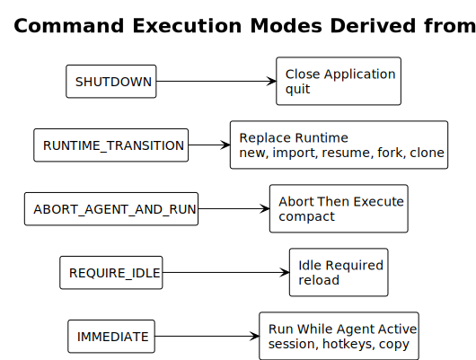

[查看 PlantUML 源码](./diagrams/command/diagram.puml#L325)

### 9.2 `userCancellable` 与 `timeout`

pi 没有统一的命令取消或超时策略。pi 的取消行为分散在具体工作流中，例如 [`AgentSession.compact()`](https://github.com/badlogic/pi-mono/blob/bb959aae017eedc8edaa91d01d0475d483ea9371/packages/coding-agent/src/core/agent-session.ts#L1641-L1645) 会先终止当前 Agent，再执行压缩。`userCancellable` 和 `timeout` 是 Java 架构为统一执行边界增加的能力，不是 pi Built-in 原生字段。

| 字段 | 含义 | 需要注意 |
|---|---|---|
| `userCancellable` | `true` 表示用户可以取消正在执行的命令；`false` 表示客户端不提供用户取消入口 | 它只控制用户取消；系统关闭和命令超时仍然可以停止命令 |
| `timeout` | 配置时长后，Handler 在规定时间内没有完成，命令返回 `COMMAND_TIMEOUT` | 等待执行权的时间不计入超时；已经产生的副作用由事务、幂等或补偿机制恢复 |

使用 `userCancellable` 而不是 `cancellable`，是为了明确它只控制用户发起的取消。系统关闭、进程终止和框架超时仍可发出系统级取消信号。

#### 9.2.1 用户取消

当 `userCancellable=true` 时：

1. TUI/App 可以展示取消操作；
2. Esc、Cancel API 等用户动作向本次调用的 `CommandCancellation` 发出 `USER` 信号；
3. Handler 和下游服务协作停止；
4. 正常停止时返回 `CommandOutcome.CANCELLED`。

当 `userCancellable=false` 时，用户不能取消命令，客户端隐藏取消入口；命令超时或应用关闭仍然可以停止命令。

`userCancellable` 与 `ABORT_AGENT_AND_RUN` 含义不同：前者取消当前命令 Handler，后者在执行命令前终止正在运行的 Agent。

#### 9.2.2 超时

`timeout` 从命令真正开始执行时计时，具体规则如下：

- 命令获得共享或独占执行权后、调用 Handler 前启动计时器；
- 命令等待执行权的时间不计入超时；
- Handler 等待网络、文件、下游服务或用户交互的时间都计入超时；
- 超时后，系统发出 `TIMEOUT` 取消信号，并向客户端返回 `COMMAND_TIMEOUT`；
- 超时结果返回后，即使 Handler 稍后完成，Dispatcher 也会丢弃这个迟到结果。

Java 使用协作取消：Handler 及下游服务检查取消信号，并为网络和阻塞 I/O 配置相应的下游超时。该机制替代会破坏共享状态的线程强制终止。需要长期等待用户选择、浏览器登录或人工确认的命令通常使用 `Optional.empty()`，并在具体外部调用上设置独立期限。

建议取消接口显式区分原因：

```java
public interface CommandCancellation {
    boolean isCancellationRequested();
    Optional<CommandCancellationReason> reason();
    void throwIfCancellationRequested();
}

public enum CommandCancellationReason {
    USER,
    TIMEOUT,
    SHUTDOWN
}
```

#### 9.2.3 组合场景

| userCancellable | timeout | 适用场景 |
|---:|---|---|
| `true` | `Optional.empty()` | 模型选择、登录等等待用户交互的命令 |
| `true` | 有值 | 分享、导出、诊断等同时接受用户取消并设置系统截止时间的任务 |
| `false` | 有值 | 由系统截止时间控制结束时机的收尾操作 |
| `false` | `Optional.empty()` | 极短且必须完整执行的本地状态修改；应谨慎使用 |

取消和超时负责停止后续工作；事务、幂等键或补偿机制负责恢复已经产生的部分副作用。

构造器接受正数 `timeout`。`Optional.empty()` 表示 Dispatcher 不创建命令级计时器，下游服务仍执行各自的安全超时。

### 9.3 每种模式

| 模式 | 执行方式 | 典型场景 | pi 源码依据 |
|---|---|---|---|
| `IMMEDIATE` | 命令不要求 Agent 处于空闲状态，可以在 Agent 正在生成回复时立即开始执行 | 查看会话信息、快捷键、变更记录或复制内容 | Built-in 分支位于 streaming 路由之前 |
| `REQUIRE_IDLE` | 命令只能在 Agent 空闲时执行；如果 Agent 正在生成回复或压缩上下文，本次调用返回 `COMMAND_BUSY` | reload、需要稳定会话快照的管理动作 | `/reload` 显式检查 streaming/compacting |
| `ABORT_AGENT_AND_RUN` | 如果 Agent 正在生成回复，命令会先终止当前生成；Agent 停止后再开始执行命令 | 手动 compact | `compact()` 先 `abort()` |
| `RUNTIME_TRANSITION` | 命令会独占会话切换过程；新会话可以使用后，本次命令才算完成，切换期间的其他命令返回 `COMMAND_BUSY` | new、import、resume、fork、clone | RuntimeHost 执行 session replace/fork/import |
| `SHUTDOWN` | 命令开始关闭应用；系统停止接收新命令，并在关闭期限内等待正在执行的任务结束，超时后取消任务 | quit | `/quit` 调用 shutdown |

表中的执行方式描述用户可以观察到的行为。内部统一由 `ExecutionGate` 先检查 `mode`，再按 `SHARED`/`EXCLUSIVE` 规则获取执行权，最后启动 Handler。

`IMMEDIATE` 中的“立即”表示命令无需等待 Agent 进入空闲状态。如果此时有其他命令占用执行权，它仍会按照并发规则等待；获得执行权后，正在生成回复的 Agent 与命令 Handler 并行执行。

### 9.4 pi 22 个 Built-in 的建议映射

| 命令 | Java mode | concurrency | 说明 |
|---|---|---|---|
| `settings` | `IMMEDIATE` | `EXCLUSIVE` | 交互式设置修改 |
| `model` | `IMMEDIATE` | `EXCLUSIVE` | 选择并修改当前模型 |
| `scoped-models` | `IMMEDIATE` | `EXCLUSIVE` | 修改模型范围 |
| `export` | `IMMEDIATE` | `SHARED` | 读取会话快照并导出 |
| `import` | `RUNTIME_TRANSITION` | `EXCLUSIVE` | 替换当前会话 |
| `share` | `IMMEDIATE` | `SHARED` | 读取会话并发布 |
| `copy` | `IMMEDIATE` | `SHARED` | 读取最后消息 |
| `name` | `IMMEDIATE` | `EXCLUSIVE` | 修改会话元数据 |
| `session` | `IMMEDIATE` | `SHARED` | 读取会话统计 |
| `changelog` | `IMMEDIATE` | `SHARED` | 只读展示 |
| `hotkeys` | `IMMEDIATE` | `SHARED` | 只读展示 |
| `fork` | `RUNTIME_TRANSITION` | `EXCLUSIVE` | 创建并切换 fork 会话 |
| `clone` | `RUNTIME_TRANSITION` | `EXCLUSIVE` | 克隆并切换会话 |
| `tree` | `REQUIRE_IDLE` | `EXCLUSIVE` | 当前生成、压缩或运行时切换结束后才开始导航 |
| `trust` | `IMMEDIATE` | `EXCLUSIVE` | 修改项目信任设置 |
| `login` | `IMMEDIATE` | `EXCLUSIVE` | 认证交互 |
| `logout` | `IMMEDIATE` | `EXCLUSIVE` | 删除认证状态 |
| `new` | `RUNTIME_TRANSITION` | `EXCLUSIVE` | 替换为新会话 |
| `compact` | `ABORT_AGENT_AND_RUN` | `EXCLUSIVE` | 终止当前 Agent 后压缩 |
| `resume` | `RUNTIME_TRANSITION` | `EXCLUSIVE` | 替换为已有会话 |
| `reload` | `REQUIRE_IDLE` | `EXCLUSIVE` | 刷新产品定义的应用资源；命令目录继续使用启动快照 |
| `quit` | `SHUTDOWN` | `EXCLUSIVE` | 应用终止 |

`tree` 是有意的 Java 架构差异。pi 在提交路由中可直接打开树，但实际导航会修改 session branch，见 [`AgentSession.navigateTree()`](https://github.com/badlogic/pi-mono/blob/bb959aae017eedc8edaa91d01d0475d483ea9371/packages/coding-agent/src/core/agent-session.ts#L2702-L2795)。Java 同时服务 TUI 与 App，若一个客户端 streaming、另一个客户端切换分支，状态竞争更明显，因此要求 idle。

`reload` 刷新产品定义的配置或资源，命令目录继续使用启动时发布的静态快照。沿用 pi 的命令名不会改变 Java 命令集合的生命周期。

## 10. 补全与帮助

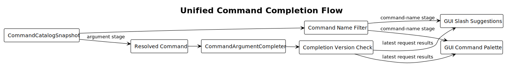

[查看 PlantUML 源码](./diagrams/command/diagram.puml#L358) · [查看 pi `/model` 补全源码](https://github.com/badlogic/pi-mono/blob/bb959aae017eedc8edaa91d01d0475d483ea9371/packages/coding-agent/src/modes/interactive/interactive-mode.ts#L506-L533)

统一目录是以下功能的唯一事实源：

- TUI `/` 补全；
- App Command Palette；
- `/help` 命令清单；
- 启动冲突检查；
- 审计中的规范命令名。

参数补全接口：

```java
@FunctionalInterface
public interface CommandArgumentCompleter {
    CompletionStage<List<CommandCompletion>> complete(
            String prefix,
            CommandCompletionContext context);
}
```

要求：

- 补全器执行只读查询，会话状态保持原值；
- 客户端为请求分配递增版本，并展示最新版本的结果；
- 补全异常生成空建议和诊断记录，命令执行路径继续可用；
- 补全器按当前用户权限过滤候选资源；
- 命令名与说明直接来自 `CommandCatalogSnapshot`，帮助和补全共享该快照。

Skill Command 是资源加载后的动态投影，命名空间建议固定为 `/skill:<name>`。补全服务将它与静态目录的结果合并展示，同时保留其独立的动态资源生命周期和 Prompt 展开语义。

## 11. TUI 与 App 适配

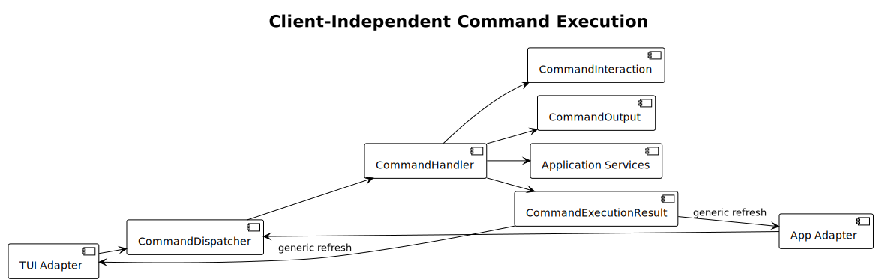

[查看 PlantUML 源码](./diagrams/command/diagram.puml#L388)

`CommandInteraction` 提供语义化交互：

```java
public interface CommandInteraction {
    CompletionStage<Boolean> confirm(ConfirmRequest request);
    CompletionStage<Optional<String>> prompt(TextPrompt request);
    <T> CompletionStage<Optional<T>> select(SelectionRequest<T> request);
}
```

`CommandOutput` 提供结构化输出：

```java
public interface CommandOutput {
    void status(String message);
    void warning(String code, String safeMessage);
    void content(CommandContent content);
}
```

TUI 把 `select` 渲染为终端列表，App 把它渲染为对话框。Handler 通过同一方法表达“选择模型”意图，客户端 Adapter 负责构造具体组件或 DTO。

命令可以在 TUI 和 App 中复用；如果当前客户端不支持剪贴板等能力，命令会提示该能力不可用，支持该能力的客户端仍可正常执行。内部处理流程如下：

1. Context 中的能力端口返回 `UNAVAILABLE`；
2. Handler 返回稳定 `CAPABILITY_UNAVAILABLE`；
3. 客户端显示可操作说明；
4. 其他客户端继续复用同一命令定义和 Handler。

## 12. 新命令开发示例

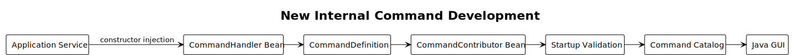

[查看 PlantUML 源码](./diagrams/command/diagram.puml#L420)

开发者通过新增 Handler 与 Contributor 扩展目录，Installer 自动完成发现和路由接入。以下示例实现公开的 `/doctor` 诊断命令。

### 12.1 Handler

```java
@Component
final class DoctorCommandHandler implements CommandHandler {
    private final DiagnosticService diagnosticService;

    DoctorCommandHandler(DiagnosticService diagnosticService) {
        this.diagnosticService = diagnosticService;
    }

    @Override
    public CompletionStage<CommandExecutionResult> handle(
            CommandInvocation invocation,
            CommandContext context) {
        return diagnosticService.inspect(context.session())
                .thenApply(report -> {
                    context.output().content(CommandContent.diagnostic(report));
                    return CommandExecutionResult.completed();
                });
    }
}
```

### 12.2 Contributor

```java
@Component
final class DiagnosticCommands implements CommandContributor {
    private static final CommandExecutionPolicy POLICY =
            new CommandExecutionPolicy(
                    CommandExecutionMode.IMMEDIATE,
                    CommandConcurrency.SHARED,
                    true,
                    Optional.of(Duration.ofSeconds(30)));

    private final DoctorCommandHandler doctor;

    DiagnosticCommands(DoctorCommandHandler doctor) {
        this.doctor = doctor;
    }

    @Override
    public List<CommandDefinition> commands() {
        return List.of(new CommandDefinition(
                "doctor",
                "Inspect runtime configuration and connectivity",
                POLICY,
                Optional.empty(),
                doctor));
    }
}
```

### 12.3 必须添加的测试

- 定义测试：名称、说明、策略与 Handler 正确；
- Handler 测试：使用 fake `DiagnosticService`、Interaction 和 Output；
- 目录契约测试：`doctor` 出现在预期清单且无重复；
- 客户端集成测试：TUI 和 App 都能从同一目录发现并执行；
- 安全测试：输出不包含 token、密钥和未脱敏环境变量。

这套设计足以开发新命令：新增 Handler 与 Contributor Bean 后，启动安装器自动发现、校验，并使 TUI/App 的补全和帮助同步生效。

## 13. 注册命令与 Skill Command 的边界

| 维度 | 注册 Command | Skill Command |
|---|---|---|
| 来源 | 编译期 Java Bean | 工作区或资源目录中的 Skill 文档 |
| 集合变化 | 进程启动时固定 | 资源加载或刷新后可变化 |
| 执行 | Handler 调用应用服务 | 展开为 Agent Prompt/上下文 |
| 身份 | 全局命令名 | `skill:<name>` 命名空间 |
| 策略 | `CommandExecutionPolicy` | 普通 Agent Prompt 的队列与会话规则 |
| 失败 | 命令错误模型 | Skill 加载或 Prompt 执行错误模型 |

统一注册模型覆盖内部 Java Handler。Skill 继续采用动态资源投影和 Prompt 展开模型，两类命令通过输入路由与补全服务集成。

## 14. 错误、安全与可观测性

### 14.1 稳定错误码

建议至少包含：

- `COMMAND_NOT_FOUND`
- `COMMAND_INVALID_ARGUMENT`
- `COMMAND_BUSY`
- `COMMAND_CAPABILITY_UNAVAILABLE`
- `COMMAND_CANCELLED`
- `COMMAND_TIMEOUT`
- `COMMAND_FAILED`

### 14.2 安全规则

- 每个可执行命令都通过注册流程进入目录、帮助、补全和审计；
- 业务服务或显式授权器根据当前主体和资源执行权限检查；
- 日志记录使用经过脱敏的 `rawInput`、异常、参数和输出；
- 分享、导出、登录、退出等命令记录动作、结果和 correlation ID，凭证内容留在受保护的认证组件；
- TUI 与 App 的命令调用都经过同一 Parser、Dispatcher 和 ExecutionGate；
- 重名定义生成启动错误，Registry 保持空快照。

### 14.3 指标与日志

建议按规范命令名记录：

- `command.invocation.count{name,outcome}`
- `command.duration{name}`
- `command.rejected.count{name,reason}`
- `command.timeout.count{name}`

日志包含 correlation ID、命令名、策略、耗时和安全错误码；参数字段使用白名单或脱敏摘要。

## 15. 包结构建议

```text
command/
  api/
    CommandDefinition.java
    CommandHandler.java
    CommandContributor.java
    CommandExecutionPolicy.java
    CommandInvocation.java
    CommandContext.java
    CommandExecutionResult.java
  core/
    CommandInstaller.java
    ImmutableCommandRegistry.java
    CommandCatalogSnapshot.java
    CommandParser.java
    CommandDispatcher.java
    CommandExecutionGate.java
    CommandCompletionService.java
  port/
    CommandInteraction.java
    CommandOutput.java
    CommandCancellation.java
  client/
    tui/
    app/
  commands/
    model/
    session/
    settings/
    diagnostics/
```

`api` 是内部开发接口，其兼容范围由 Java 产品版本管理。`core` 由框架维护，具体命令仅依赖 `api` 和 `port` 中的契约。

## 16. 迁移方案


[查看 PlantUML 源码](./diagrams/command/diagram.puml#L448)

建议按完整竖切片迁移：

1. 建立 Definition、Parser 和只读 Snapshot；
2. 建立 Installer、Dispatcher 和 Gate；
3. 让帮助与补全只读取统一目录；
4. 建立 Interaction、Output 和 Refresh 适配；
5. 迁移涉及运行时替换的命令；
6. 删除旧 Built-in/Extension 类型和客户端命令名分支。

每迁移一个命令，同一发布中同步停用旧路径，使每个输入始终只有一个执行入口。兼容别名仅在产品明确给出迁移期和移除版本时建立。

## 17. 测试策略

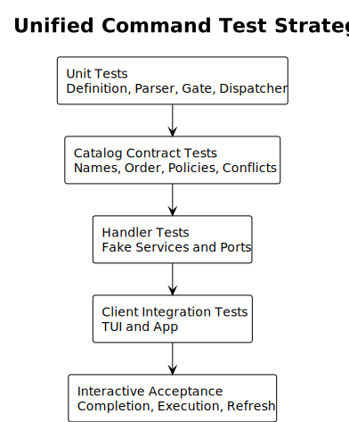

[查看 PlantUML 源码](./diagrams/command/diagram.puml#L474)

| 层级 | 重点 |
|---|---|
| Definition 单元测试 | 名称规范、空字段、Policy 合法性 |
| Parser 单元测试 | 空白、参数原文、非法名称、非命令输入 |
| Gate 单元测试 | 五种 mode、共享/独占、取消、超时 |
| Dispatcher 单元测试 | 查找、结果映射、异常脱敏、刷新提示 |
| Catalog 契约测试 | 精确名称集合、稳定顺序、策略、冲突失败 |
| Handler 单元测试 | fake 服务与端口，覆盖业务成功/取消/失败 |
| 客户端集成测试 | TUI 与 App 读取同一目录且无旁路 |
| 交互验收 | 补全、帮助、执行、拒绝、刷新和审计闭环 |

Catalog 契约测试断言精确命令名、顺序和策略。该断言可以识别“删除一个正确命令、同时新增一个错误命令但总数不变”的回归。

## 18. 验收标准

- Built-in 与 Extension 使用同一个 Java 定义、Handler 和注册模型；
- 命令身份由 `name` 表达，来源诊断使用 Contributor Bean 类，客户端能力使用 Context 端口；
- 进程内目录成功发布一次；失败时 Registry 保持空快照；
- 每个可执行命令均出现在统一帮助和补全中；
- TUI 与 App 把命令调用统一交给 Dispatcher，业务行为位于 Handler；
- 所有生产调用经过 Dispatcher 和 ExecutionGate；
- 五种 execution mode 有穷尽测试；
- `/compact`、会话替换、`/reload` 和 `/quit` 的控制流符合策略；
- Skill Command 通过动态 Prompt 投影接入补全和输入路由；
- 新命令通过 Handler 与 Contributor 接入目录和路由；
- 文档设计结论可追溯到固定 pi 源码或明确标注的 Java 产品约束。

## 19. 设计决策记录

| 关注点 | 采用的设计 | 原因 |
|---|---|---|
| Command 模型 | Built-in 与 Extension 统一使用 `CommandDefinition` | 开发者、安全边界、生命周期和客户端一致 |
| 命令身份 | `name` 是唯一键，Bean 类用于来源诊断 | 静态目录无需动态扩展身份 |
| Handler | 所有注册命令使用一个 `CommandHandler` 接口 | 具体差异属于业务服务 |
| 执行模式 | 使用 `CommandExecutionMode` enum | 模式有限且互斥，可穷尽检查 |
| 可见性 | 注册同时代表公开和可执行 | ToB 采用完整公开命令清单 |
| 客户端 | TUI/App 通过 Context 端口适配 | 命令语义跨客户端复用 |
| 生命周期 | 启动期原子发布静态目录 | 产品无需运行期命令安装和回滚 |
| 业务依赖 | Handler 构造器注入应用服务 | 依赖显式且便于测试 |
| Skill | 作为动态 Prompt 投影接入路由和补全 | 资源生命周期和执行模型区别于内部 Handler |

## 20. PlantUML 维护

所有图的唯一源文件为 [`diagrams/command/diagram.puml`](./diagrams/command/diagram.puml)，图内文字、注释和标识符必须使用英文 ASCII。

生成命令：

```bash
cd diagrams/command
plantuml -tsvg diagram.puml
```

本文档生成基线为 PlantUML 1.2026.6。提交前至少检查：

```bash
plantuml -tsvg diagram.puml
rg -n '[^\x00-\x7F]' diagram.puml
```

第二条命令必须无输出。

## 21. 版本历史

| 版本 | 日期 | 变更 |
|---|---|---|
| v1.0 | 2026-07-14 | 以 pi Built-in 源码为基线，统一 Java Built-in/Extension Command，删除动态扩展、可见性和界面标签设计 |
| v1.1 | 2026-07-14 | 说明用户取消与命令超时的边界，将 `cancellable` 重命名为 `userCancellable`，补充组合场景、协作取消和非回滚语义 |
| v1.2 | 2026-07-14 | 将 `IMMEDIATE` 改为正向准入表述，明确它允许 Agent 活跃期间执行但不代表立即完成 |
| v1.3 | 2026-07-14 | 系统排查含糊和否定式定义，按触发状态、组件动作和可观察结果改写核心契约，并同步 Skill 名称与 description 展示边界 |
| v1.4 | 2026-07-14 | 拆分 Agent 状态准入与命令并发准入，明确 `IMMEDIATE` 在获得执行权后才启动 Handler，并统一超时计时起点 |
| v1.5 | 2026-07-14 | 将执行模式、路由、取消、超时和客户端行为统一改为简洁的用户可观察表述，并把框架实现细节放在行为说明之后 |
