# pi-mono-java Extension Command SR 设计

## 文档信息

| 项目 | 内容 |
|---|---|
| SR 编号 | SR-EXT-CMD-001 |
| SR 名称 | Java Extension Command 注册、发现与执行能力 |
| 适用项目 | `/Users/z/pi-mono-java` |
| 状态 | Draft |
| 日期 | 2026-07-13 |
| 版本 | v1.11 |
| 对齐基线 | pi TypeScript `ExtensionAPI.registerCommand()` |

---

## 1. 设计目标

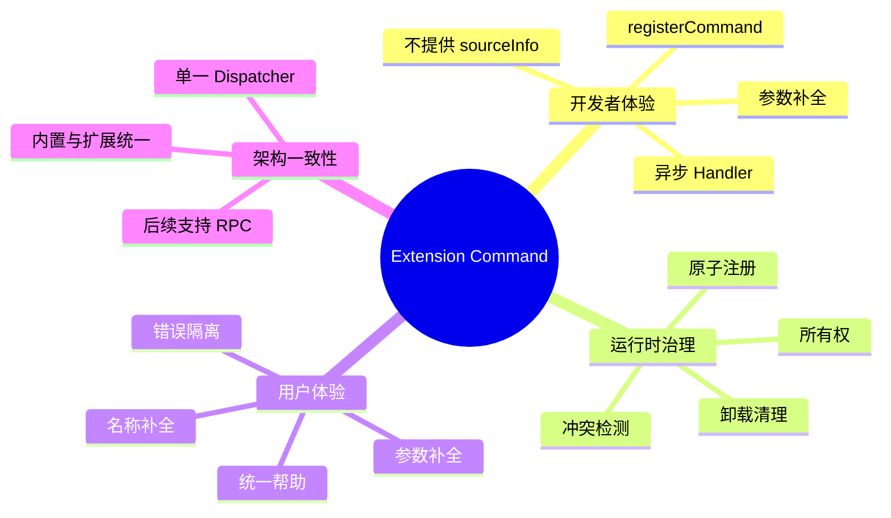
```mermaid
mindmap
  root((Extension Command))
    开发者体验
      registerCommand
      参数补全
      异步 Handler
      不提供 sourceInfo
    运行时治理
      所有权
      冲突检测
      原子注册
      卸载清理
    用户体验
      统一帮助
      名称补全
      参数补全
      错误隔离
    架构一致性
      内置与扩展统一
      单一 Dispatcher
      后续支持 RPC
```

目标结论：

```text
Extension 元数据 = id + 可选 name（默认等于 id）
Command 公开接口 = name + description + argumentCompleter + handler
框架内部模型     = Command 公开接口 + ownerId
sourceInfo        = 不进入 Java Extension Command 设计
```

### 1.1 范围

| 本期包含 | 本期不包含 |
|---|---|
| Extension Command 注册 API | 外部 JAR 下载和安装 |
| 命令解析、发现、执行 | ClassLoader/ModuleLayer 隔离 |
| 名称与参数补全 | Prompt Template/Skill 内容重构 |
| 冲突、reload、unload | Extension 覆盖内置命令 |
| TUI 和 `/help` 接入 | Web 前端 Slash Command 重构 |
| 内置命令统一迁移 | 首版 RPC/Server 命令调用 |

前置条件：Extension 实例已由 Spring、`ServiceLoader`、测试代码或未来的 Extension Loader 加载。

---

## 2. 当前问题

### 2.1 当前调用关系

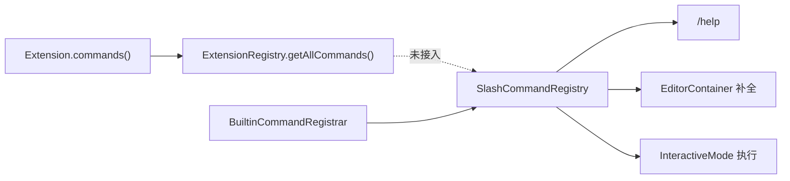
```mermaid
flowchart LR
    extension["Extension.commands()"]
    extensionRegistry["ExtensionRegistry.getAllCommands()"]
    slashRegistry["SlashCommandRegistry"]
    builtin["BuiltinCommandRegistrar"]
    help["/help"]
    autocomplete["EditorContainer 补全"]
    interactive["InteractiveMode 执行"]

    extension --> extensionRegistry
    extensionRegistry -. "未接入" .-> slashRegistry
    builtin --> slashRegistry
    slashRegistry --> help
    slashRegistry --> autocomplete
    slashRegistry --> interactive
```

### 2.2 缺口矩阵

| 编号 | 当前实现 | 问题 |
|---|---|---|
| GAP-01 | `Extension.commands()` 聚合命令 | 未接入执行注册表 |
| GAP-02 | `commands.put(name, command)` | 同名命令静默覆盖 |
| GAP-03 | `SlashCommand.execute()` 同步返回 | 不适合异步 Extension 操作 |
| GAP-04 | `EditorContainer` 遇到空格关闭补全 | 无法补全参数 |
| GAP-05 | `InteractiveMode` 按命令字符串处理副作用 | 存在第二套命令行为 |
| GAP-06 | Registry 同时解析、存储和执行 | 职责耦合，难以扩展 RPC |

---

## 3. 目标架构

### 3.1 组件图

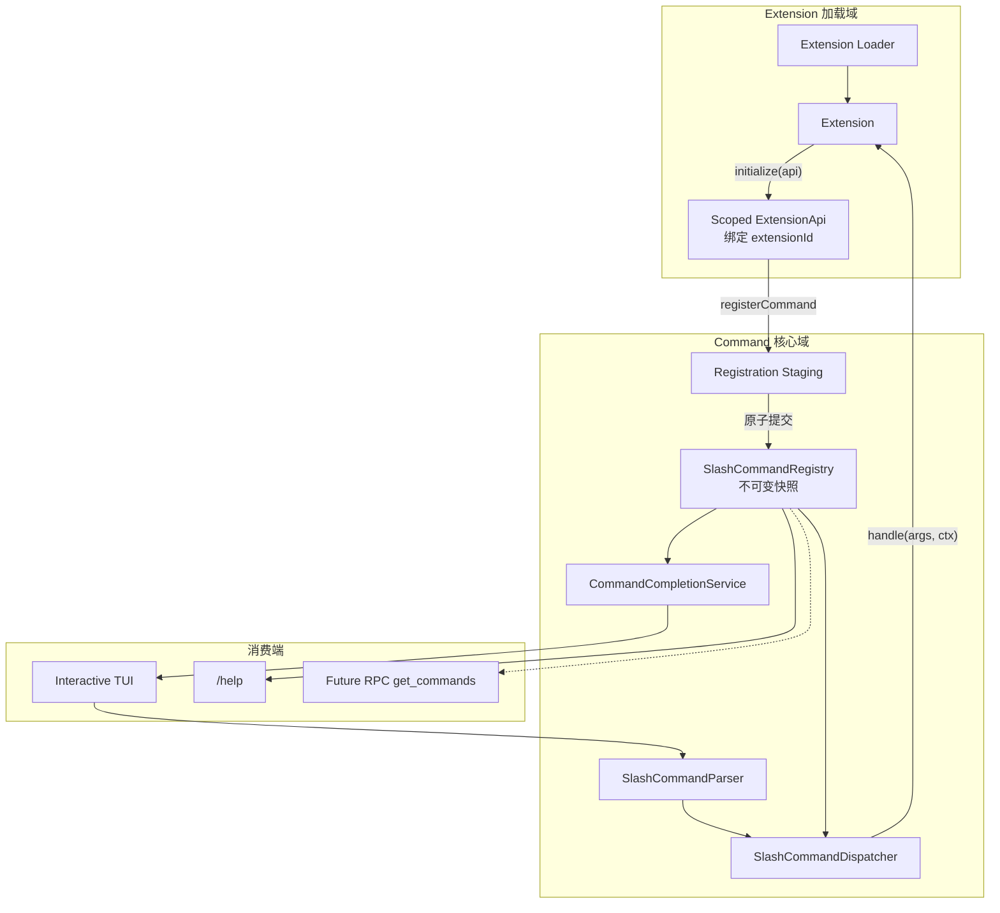
```mermaid
flowchart TB
    subgraph Load["Extension 加载域"]
        loader["Extension Loader"]
        extension["Extension"]
        scopedApi["Scoped ExtensionApi\n绑定 extensionId"]
    end

    subgraph CommandCore["Command 核心域"]
        staging["Registration Staging"]
        registry["SlashCommandRegistry\n不可变快照"]
        parser["SlashCommandParser"]
        dispatcher["SlashCommandDispatcher"]
        completer["CommandCompletionService"]
    end

    subgraph Consumers["消费端"]
        tui["Interactive TUI"]
        help["/help"]
        rpc["Future RPC get_commands"]
    end

    loader --> extension
    extension -->|"initialize(api)"| scopedApi
    scopedApi -->|"registerCommand"| staging
    staging -->|"原子提交"| registry

    tui --> parser
    parser --> dispatcher
    registry --> dispatcher
    dispatcher -->|"handle(args, ctx)"| extension

    registry --> completer
    completer --> tui
    registry --> help
    registry -.-> rpc
```

### 3.2 核心职责

| 组件 | 唯一职责 |
|---|---|
| `ExtensionApi` | 接收 Extension 注册声明 |
| `Registration Staging` | 收集并整体校验单个 Extension 的命令 |
| `SlashCommandRegistry` | 发布和查询有效命令快照 |
| `SlashCommandParser` | 将原始文本解析为 invocation |
| `SlashCommandDispatcher` | 查找命令并调用 Handler |
| `CommandCompletionService` | 路由名称补全和参数补全 |
| `InteractiveMode` | 输入编排和 TUI 渲染，不实现具体命令逻辑 |

---

## 4. 公开接口设计

### 4.1 API 类图

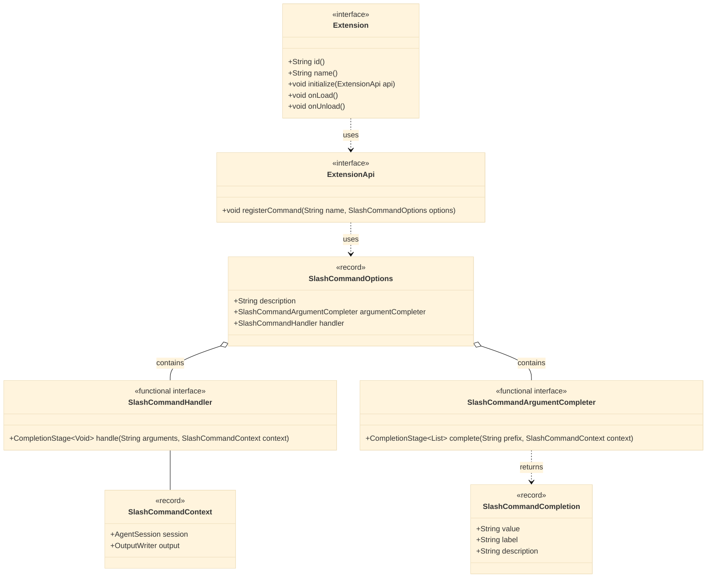
```mermaid
%%{init: {"theme": "base", "themeCSS": ".edgePaths>path:nth-child(6){stroke:transparent!important;fill:none!important;}"}}%%
classDiagram
    class Extension {
        <<interface>>
        +String id()
        +String name()
        +void initialize(ExtensionApi api)
        +void onLoad()
        +void onUnload()
    }

    class ExtensionApi {
        <<interface>>
        +void registerCommand(String name, SlashCommandOptions options)
    }

    class SlashCommandOptions {
        <<record>>
        +String description
        +SlashCommandArgumentCompleter argumentCompleter
        +SlashCommandHandler handler
    }

    class SlashCommandHandler {
        <<functional interface>>
        +CompletionStage~Void~ handle(String arguments, SlashCommandContext context)
    }

    class SlashCommandArgumentCompleter {
        <<functional interface>>
        +CompletionStage~List~ complete(String prefix, SlashCommandContext context)
    }

    class SlashCommandCompletion {
        <<record>>
        +String value
        +String label
        +String description
    }

    class SlashCommandContext {
        <<record>>
        +AgentSession session
        +OutputWriter output
    }

    Extension ..> ExtensionApi : uses
    ExtensionApi ..> SlashCommandOptions : uses
    SlashCommandOptions o-- SlashCommandHandler : contains
    SlashCommandOptions o-- SlashCommandArgumentCompleter : contains
    SlashCommandArgumentCompleter ..> SlashCommandCompletion : returns
    SlashCommandHandler -- SlashCommandContext
```

`SlashCommandContext` 作为相关类型独立展示在左下角，不显示关系线。最后一条关系仅用于 Mermaid 布局，并通过主题样式隐藏；Handler/Completer 对 Context 的使用由方法签名表达。

关系图例：

| 表示 | 含义 | 示例 |
|---|---|---|
| `..>` 虚线空心箭头 | 依赖：方法参数或返回类型 | `uses`、`returns` |
| `o--` 实线空心菱形 | 聚合：Options 持有外部提供的对象引用 | `contains` |
| 无连线 | 仅补充展示类结构 | `SlashCommandContext` |

### 4.2 Extension 与注册 API

```java
public interface Extension {
    String id();

    default String name() {
        return id();
    }

    void initialize(ExtensionApi api);

    default void onLoad() {}

    default void onUnload() {}
}
```

#### 4.2.1 Extension ID 约束

`id` 是 Extension 在 Registry 中的稳定机器身份，并用于派生内部 `ownerId`。开发者直接提供 `id`，框架不根据路径生成，也不进行 trim、大小写转换或其他隐式规范化。

| 约束项 | 规则 |
|---|---|
| 长度 | 1～64 个 ASCII 字符，包含边界 |
| 允许字符 | 小写英文字母 `a-z`、数字 `0-9`、连字符 `-` |
| 起始字符 | 必须是小写英文字母 |
| 结束字符 | 必须是小写英文字母或数字 |
| 连字符 | 不能出现在开头、结尾或连续出现 |
| 大小写 | 不允许大写字母 |
| 保留名称 | 禁止 `builtin`、`system`、`internal` |
| 保留前缀 | 禁止 `builtin-`、`system-`、`internal-` |
| 稳定性 | ID 发布后不得修改；修改 ID 视为删除旧 Extension 并注册新 Extension |
| 唯一性 | 在 Extension Registry 中全局唯一；冲突时注册失败，不得静默替换 |

语法正则：

```regex
^[a-z][a-z0-9]*(?:-[a-z0-9]+)*$
```

Java 使用严格输入边界，并单独检查长度和保留名称，以便返回明确的校验错误：

```java
private static final Pattern EXTENSION_ID_PATTERN = Pattern.compile(
        "\\A[a-z][a-z0-9]*(?:-[a-z0-9]+)*\\z");

private static final Set<String> RESERVED_EXTENSION_IDS = Set.of(
        "builtin", "system", "internal");

private static final List<String> RESERVED_EXTENSION_ID_PREFIXES = List.of(
        "builtin-", "system-", "internal-");

public static boolean isValidExtensionId(String id) {
    if (id == null || id.length() < 1 || id.length() > 64) {
        return false;
    }
    if (!EXTENSION_ID_PATTERN.matcher(id).matches()) {
        return false;
    }
    if (RESERVED_EXTENSION_IDS.contains(id)) {
        return false;
    }
    return RESERVED_EXTENSION_ID_PREFIXES.stream()
            .noneMatch(id::startsWith);
}
```

正确示例：

```text
a
deploy
space-deploy
space-memory2
campusagent-coding-git-tools
```

长度下限 1 只定义语法边界。开发者仍应选择能够表达功能或领域的 ID，不应为了缩短名称而使用无意义的单字符 ID。

错误示例：

| ID | 错误原因 |
|---|---|
| 空字符串 | 少于 1 个字符 |
| 65 个连续的 `a` | 超过 64 个字符 |
| `12345` | 首字符不是字母 |
| `Campusagent-space` | 包含大写字母 |
| `-campusagent-space` | 以连字符开头 |
| `campusagent-space-` | 以连字符结尾 |
| `campusagent--space` | 包含连续连字符 |
| `campusagent.space.deploy` | 包含点号 |
| `campusagent_space_deploy` | 包含下划线 |
| `campusagent space` | 包含空格 |
| `campusagent/space` | 包含斜杠 |
| `部署命令` | 包含非 ASCII 字符 |
| `builtin-deploy` | 使用宿主保留前缀 |

不强制 ID 包含连字符或具有固定段数。唯一性由 Registry 保证，段数不承担命名空间或冲突检测职责。

#### 4.2.2 Extension Name 约束

`name` 是可选的管理与诊断展示名称，不参与 Registry 身份、所有权或冲突判断。普通命令用户通常只看到 `/deploy` 和 Command description，不会看到 Extension name；当前范围内 `/help` 和命令补全也不展示它。

| 约束项 | 规则 |
|---|---|
| 必填性 | 开发者无需覆盖；默认返回 `id` |
| 使用场景 | 注册日志、错误诊断及未来的 Extension 管理界面 |
| 命令体验 | 不用于命令调用、`/help`、命令补全或冲突判断 |
| 覆盖后的长度 | 1～80 个字符，包含边界 |
| 覆盖后的字符 | 允许 Unicode、空格和大小写；禁止换行符和控制字符 |
| 覆盖后的空白 | 不允许首尾空白，框架不隐式 trim |
| 唯一性 | 不要求唯一 |
| 稳定性 | 允许调整，不影响 Extension 身份 |

示例：

```text
Space Deployment
代码审查
```

只有需要改善管理或诊断信息时才覆盖 `name()`；否则使用 `id()` 的默认值。

#### 4.2.3 注册 API

```java
public interface ExtensionApi {
    void registerCommand(String name, SlashCommandOptions options);
}
```

### 4.3 Command Options

```java
public record SlashCommandOptions(
        String description,
        SlashCommandArgumentCompleter argumentCompleter,
        SlashCommandHandler handler) {

    public SlashCommandOptions {
        description = description == null ? "" : description.trim();
        argumentCompleter = argumentCompleter == null
                ? SlashCommandArgumentCompleter.none()
                : argumentCompleter;
        Objects.requireNonNull(handler, "handler");
    }
}
```

### 4.4 Handler 与 Completer

```java
@FunctionalInterface
public interface SlashCommandHandler {
    CompletionStage<Void> handle(
            String arguments,
            SlashCommandContext context);
}
```

```java
@FunctionalInterface
public interface SlashCommandArgumentCompleter {
    CompletionStage<List<SlashCommandCompletion>> complete(
            String argumentPrefix,
            SlashCommandContext context);

    static SlashCommandArgumentCompleter none() {
        return (prefix, context) ->
                CompletableFuture.completedFuture(List.of());
    }
}
```

```java
public record SlashCommandCompletion(
        String value,
        String label,
        String description) {}
```

### 4.5 与 pi TypeScript 映射

| pi TypeScript | Java 设计 |
|---|---|
| Extension factory | `Extension.initialize(ExtensionApi)` |
| `pi.registerCommand(name, options)` | `api.registerCommand(name, options)` |
| options object | `SlashCommandOptions` record |
| `getArgumentCompletions(prefix)` | `argumentCompleter.complete(prefix, context)` |
| `async handler(args, ctx)` | `CompletionStage<Void> handle(args, context)` |
| loader 注入 `sourceInfo` | Registry 内部绑定 `extensionId` |

---

## 5. 内部数据模型

### 5.1 模型图

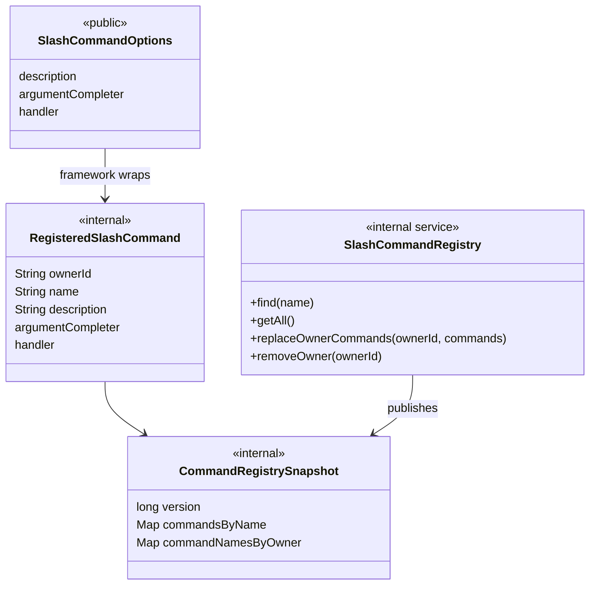
```mermaid
classDiagram
    class SlashCommandOptions {
        <<public>>
        description
        argumentCompleter
        handler
    }

    class RegisteredSlashCommand {
        <<internal>>
        String ownerId
        String name
        String description
        argumentCompleter
        handler
    }

    class CommandRegistrySnapshot {
        <<internal>>
        long version
        Map commandsByName
        Map commandNamesByOwner
    }

    class SlashCommandRegistry {
        <<internal service>>
        +find(name)
        +getAll()
        +replaceOwnerCommands(ownerId, commands)
        +removeOwner(ownerId)
    }

    SlashCommandOptions --> RegisteredSlashCommand : framework wraps
    RegisteredSlashCommand --> CommandRegistrySnapshot
    SlashCommandRegistry --> CommandRegistrySnapshot : publishes
```

```java
record RegisteredSlashCommand(
        String ownerId,
        String name,
        String description,
        SlashCommandArgumentCompleter argumentCompleter,
        SlashCommandHandler handler) {}
```

### 5.2 所有权

| 命令来源 | `ownerId` 示例 | 开发者是否提供 |
|---|---|---|
| 内置命令 | `builtin` | 否 |
| Extension | `extension:space-deploy` | 否，由 scoped API 根据 Extension ID 绑定 |

`RegisteredSlashCommand`、`ownerId` 和 Registry Snapshot 均为内部实现，不属于 Extension SDK。

---

## 6. 注册与生命周期

### 6.1 首次注册时序

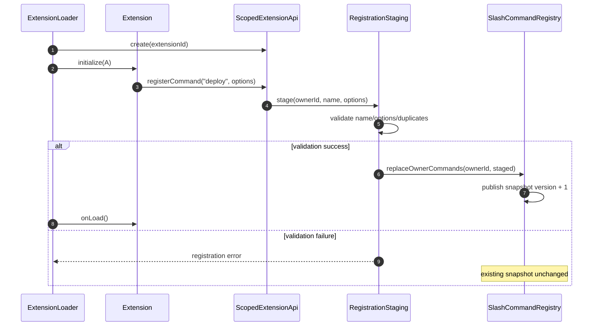
```mermaid
sequenceDiagram
    autonumber
    participant L as ExtensionLoader
    participant E as Extension
    participant A as ScopedExtensionApi
    participant S as RegistrationStaging
    participant R as SlashCommandRegistry

    L->>A: create(extensionId)
    L->>E: initialize(A)
    E->>A: registerCommand("deploy", options)
    A->>S: stage(ownerId, name, options)
    S->>S: validate name/options/duplicates

    alt validation success
        S->>R: replaceOwnerCommands(ownerId, staged)
        R->>R: publish snapshot version + 1
        L->>E: onLoad()
    else validation failure
        S-->>L: registration error
        Note over R: existing snapshot unchanged
    end
```

### 6.2 Reload 时序

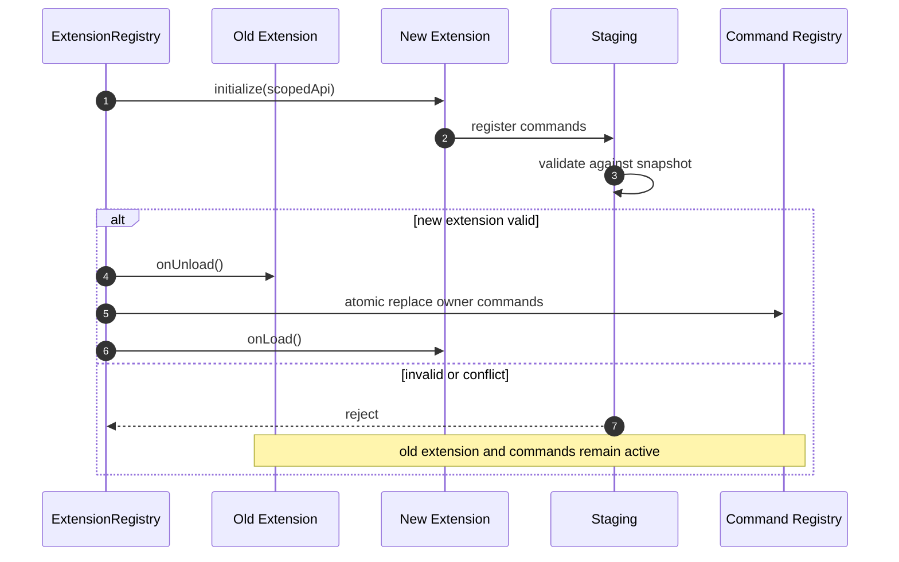
```mermaid
sequenceDiagram
    autonumber
    participant ER as ExtensionRegistry
    participant Old as Old Extension
    participant New as New Extension
    participant Stage as Staging
    participant CR as Command Registry

    ER->>New: initialize(scopedApi)
    New->>Stage: register commands
    Stage->>Stage: validate against snapshot

    alt new extension valid
        ER->>Old: onUnload()
        ER->>CR: atomic replace owner commands
        ER->>New: onLoad()
    else invalid or conflict
        Stage-->>ER: reject
        Note over Old,CR: old extension and commands remain active
    end
```

### 6.3 生命周期状态图

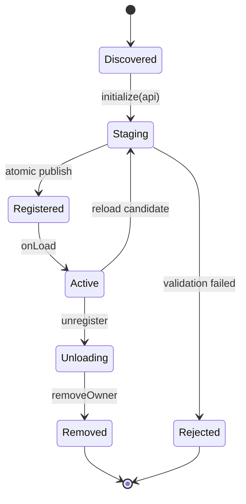
```mermaid
stateDiagram-v2
    [*] --> Discovered
    Discovered --> Staging: initialize(api)
    Staging --> Rejected: validation failed
    Staging --> Registered: atomic publish
    Registered --> Active: onLoad
    Active --> Staging: reload candidate
    Active --> Unloading: unregister
    Unloading --> Removed: removeOwner
    Removed --> [*]
    Rejected --> [*]
```

### 6.4 生命周期规则

| 编号 | 规则 |
|---|---|
| LIFE-01 | 单个 Extension 的全部命令先暂存、后整体提交 |
| LIFE-02 | 校验失败不得改变现有 Registry Snapshot |
| LIFE-03 | 同一 owner reload 只能看到旧集合或新集合 |
| LIFE-04 | unload 必须删除 owner 的全部命令 |
| LIFE-05 | 正在执行的 Handler 使用执行开始时取得的旧命令实例 |

---

## 7. 冲突与校验

### 7.1 注册决策图

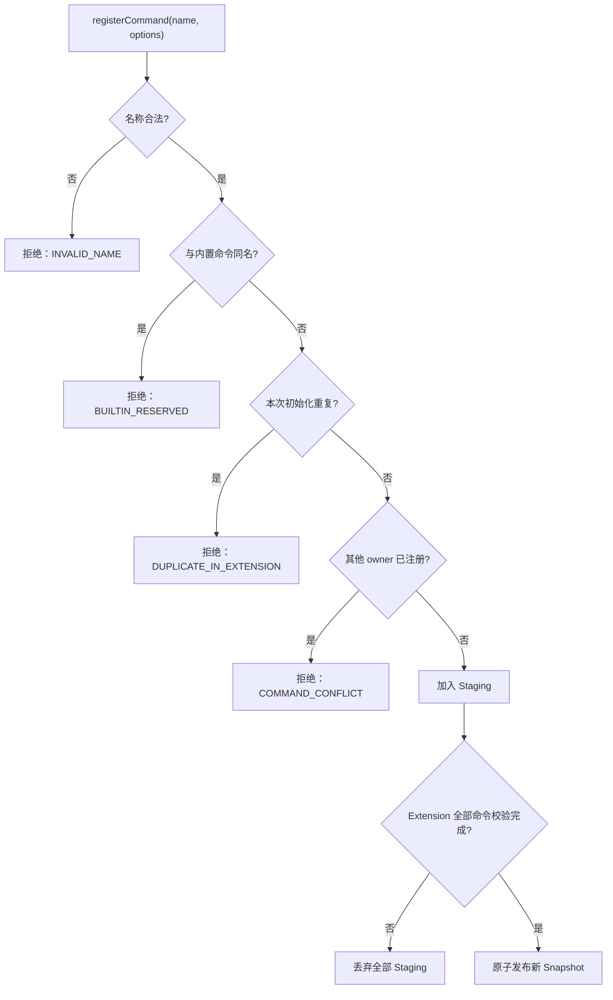
```mermaid
flowchart TD
    start["registerCommand(name, options)"] --> validName{"名称合法?"}
    validName -- 否 --> rejectName["拒绝：INVALID_NAME"]
    validName -- 是 --> builtin{"与内置命令同名?"}
    builtin -- 是 --> rejectBuiltin["拒绝：BUILTIN_RESERVED"]
    builtin -- 否 --> sameBatch{"本次初始化重复?"}
    sameBatch -- 是 --> rejectBatch["拒绝：DUPLICATE_IN_EXTENSION"]
    sameBatch -- 否 --> otherOwner{"其他 owner 已注册?"}
    otherOwner -- 是 --> rejectConflict["拒绝：COMMAND_CONFLICT"]
    otherOwner -- 否 --> stage["加入 Staging"]
    stage --> allValid{"Extension 全部命令校验完成?"}
    allValid -- 否 --> rollback["丢弃全部 Staging"]
    allValid -- 是 --> publish["原子发布新 Snapshot"]
```

### 7.2 名称规则

```text
^[a-z][a-z0-9-]*$
```

| 允许 | 拒绝 | 原因 |
|---|---|---|
| `deploy` | `/deploy` | 名称不包含 `/` |
| `scoped-models` | `Deploy` | 不隐式转换大小写 |
| `review2` | `skill:review` | `skill:` 为保留命名空间 |
| `git-status` | `git status` | 不允许空白 |

### 7.3 冲突策略

| 场景 | 结果 |
|---|---|
| Extension 与 Built-in 同名 | Extension 注册失败 |
| 两个 Extension 同名 | 后注册 Extension 失败 |
| 同一 Extension 重复注册 | 本次 Extension 初始化失败 |
| 同 owner reload 同名 | 允许原子替换 |
| Alias | 首版注册为独立命令名 |

禁止使用静默覆盖或自动生成 `/review:1`、`/review:2`。

---

## 8. 命令执行设计

### 8.1 输入优先级

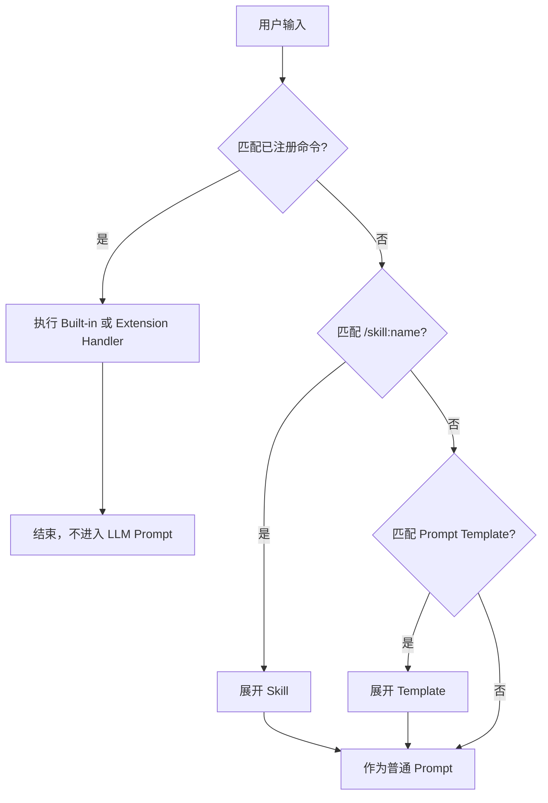
```mermaid
flowchart TD
    input["用户输入"] --> registered{"匹配已注册命令?"}
    registered -- 是 --> handler["执行 Built-in 或 Extension Handler"]
    registered -- 否 --> skill{"匹配 /skill:name?"}
    skill -- 是 --> expandSkill["展开 Skill"]
    skill -- 否 --> template{"匹配 Prompt Template?"}
    template -- 是 --> expandTemplate["展开 Template"]
    template -- 否 --> prompt["作为普通 Prompt"]
    expandSkill --> prompt
    expandTemplate --> prompt
    handler --> handled["结束，不进入 LLM Prompt"]
```

### 8.2 执行时序

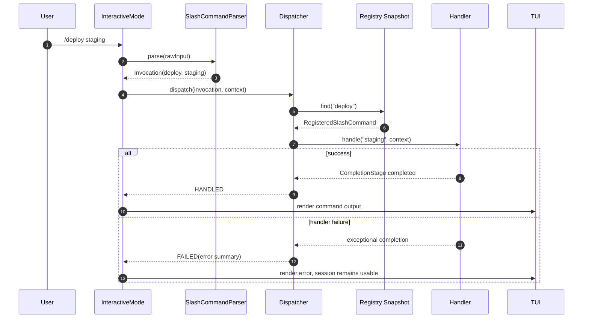
```mermaid
sequenceDiagram
    autonumber
    participant U as User
    participant I as InteractiveMode
    participant P as SlashCommandParser
    participant D as Dispatcher
    participant R as Registry Snapshot
    participant H as Handler
    participant T as TUI

    U->>I: /deploy staging
    I->>P: parse(rawInput)
    P-->>I: Invocation(deploy, staging)
    I->>D: dispatch(invocation, context)
    D->>R: find("deploy")
    R-->>D: RegisteredSlashCommand
    D->>H: handle("staging", context)

    alt success
        H-->>D: CompletionStage completed
        D-->>I: HANDLED
        I->>T: render command output
    else handler failure
        H-->>D: exceptional completion
        D-->>I: FAILED(error summary)
        I->>T: render error, session remains usable
    end
```

### 8.3 解析结果

```java
public record SlashCommandInvocation(
        String name,
        String arguments) {}
```

| 输入 | 状态/Invocation |
|---|---|
| `hello` | `NOT_COMMAND` |
| `/` | `NOT_FOUND` |
| `/deploy` | `deploy`, `""` |
| `/deploy staging` | `deploy`, `"staging"` |
| `/unknown x` | `NOT_FOUND` |

### 8.4 Dispatch 结果

```java
public enum SlashCommandDispatchStatus {
    NOT_COMMAND,
    NOT_FOUND,
    HANDLED,
    FAILED
}
```

```java
public record SlashCommandDispatchResult(
        SlashCommandDispatchStatus status,
        String commandName,
        String errorMessage) {}
```

未知 `/name` 是否继续作为普通 Prompt，由上层输入策略决定；Dispatcher 只返回 `NOT_FOUND`。

---

## 9. 自动补全设计

### 9.1 补全路由

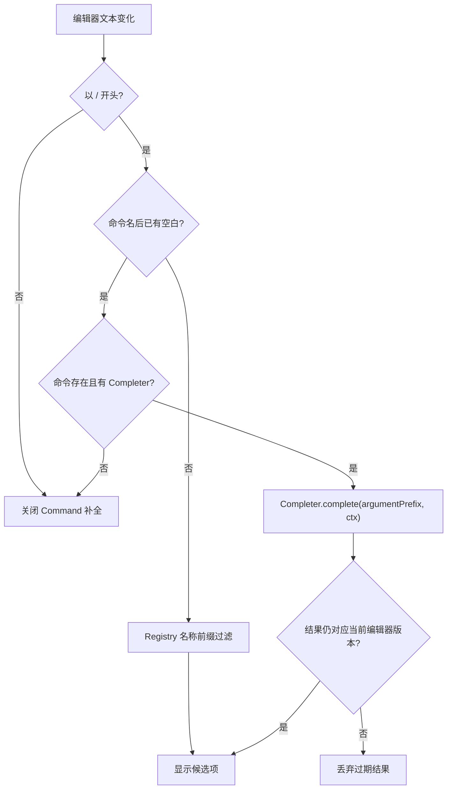
```mermaid
flowchart TD
    edit["编辑器文本变化"] --> slash{"以 / 开头?"}
    slash -- 否 --> hide["关闭 Command 补全"]
    slash -- 是 --> space{"命令名后已有空白?"}
    space -- 否 --> names["Registry 名称前缀过滤"]
    space -- 是 --> resolve{"命令存在且有 Completer?"}
    resolve -- 否 --> hide
    resolve -- 是 --> args["Completer.complete(argumentPrefix, ctx)"]
    names --> menu["显示候选项"]
    args --> stale{"结果仍对应当前编辑器版本?"}
    stale -- 否 --> discard["丢弃过期结果"]
    stale -- 是 --> menu
```

### 9.2 参数补全时序

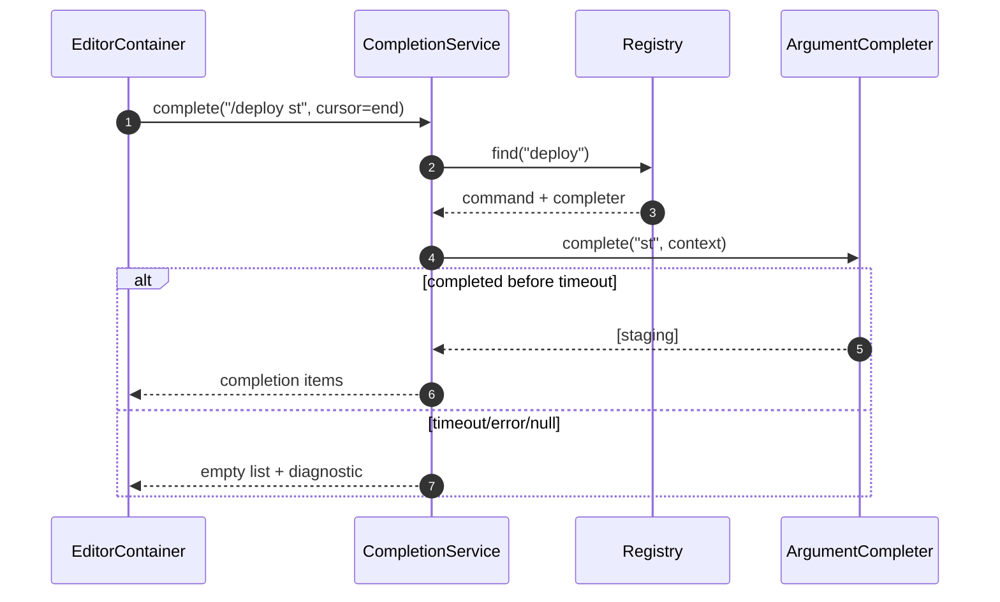
```mermaid
sequenceDiagram
    autonumber
    participant E as EditorContainer
    participant C as CompletionService
    participant R as Registry
    participant A as ArgumentCompleter

    E->>C: complete("/deploy st", cursor=end)
    C->>R: find("deploy")
    R-->>C: command + completer
    C->>A: complete("st", context)

    alt completed before timeout
        A-->>C: [staging]
        C-->>E: completion items
    else timeout/error/null
        C-->>E: empty list + diagnostic
    end
```

### 9.3 首版边界

| 能力 | 首版 |
|---|---|
| 命令名补全 | 支持 |
| 行尾参数补全 | 支持 |
| 异步 Completer | 支持 |
| 过期结果丢弃 | 支持 |
| 默认超时 | 1000 ms |
| 光标位于参数中间 | 后续 |
| Replace Range | 后续 |

---

## 10. Extension 开发示例

以下是目标 API 示例，不是当前仓库已存在接口。

| 元数据 | 示例 | 含义 |
|---|---|---|
| Extension ID | `space-deploy` | 稳定 Registry 身份，框架派生 `extension:space-deploy` |
| Extension name | `space-deploy` | 示例未覆盖 `name()`，因此默认等于 ID |
| Command name | `deploy` | 用户通过 `/deploy` 调用 |

```java
public final class DeployExtension implements Extension {

    @Override
    public String id() {
        return "space-deploy";
    }

    @Override
    public void initialize(ExtensionApi api) {
        api.registerCommand(
                "deploy",
                new SlashCommandOptions(
                        "Deploy to an environment",
                        this::completeEnvironment,
                        this::deploy));
    }

    private CompletionStage<List<SlashCommandCompletion>> completeEnvironment(
            String prefix,
            SlashCommandContext context) {
        var items = List.of("dev", "staging", "prod").stream()
                .filter(value -> value.startsWith(prefix))
                .map(value -> new SlashCommandCompletion(
                        value,
                        value,
                        "Deploy to " + value))
                .toList();

        return CompletableFuture.completedFuture(items);
    }

    private CompletionStage<Void> deploy(
            String arguments,
            SlashCommandContext context) {
        String environment = arguments.trim();
        if (environment.isEmpty()) {
            context.output().println("Usage: /deploy <environment>");
            return CompletableFuture.completedFuture(null);
        }

        context.output().println("Deploying to " + environment);
        return CompletableFuture.completedFuture(null);
    }
}
```

如果未来的 Extension 管理界面需要更友好的展示名称，可以选择性覆盖：

```java
@Override
public String name() {
    return "Space Deployment";
}
```

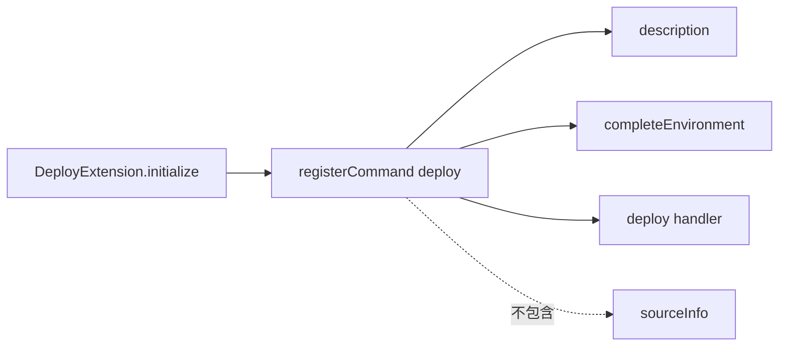
```mermaid
flowchart LR
    code["DeployExtension.initialize"] --> register["registerCommand deploy"]
    register --> metadata["description"]
    register --> completion["completeEnvironment"]
    register --> execution["deploy handler"]
    register -. "不包含" .-> noSource["sourceInfo"]
```

---

## 11. 功能需求

| ID | 需求 | 验证方式 |
|---|---|---|
| FR-001 | Extension 通过 `initialize(ExtensionApi)` 注册命令 | API 单测 |
| FR-002 | `registerCommand` 只接收 `name` 和 `options` | 编译检查 |
| FR-003 | 公开 Command API 不包含 `sourceInfo`、`ownerId` | API 审查 |
| FR-004 | Command `name`、`handler` 必填；description/completer 可选 | 校验单测 |
| FR-005 | 名称必须符合 `^[a-z][a-z0-9-]*$` | 参数化测试 |
| FR-006 | Built-in 名称对 Extension 保留 | 冲突测试 |
| FR-007 | 同名命令不得静默覆盖 | 冲突测试 |
| FR-008 | Extension 命令以 owner 为单位原子提交 | Snapshot 测试 |
| FR-009 | Reload 失败保留旧命令集合 | Reload 测试 |
| FR-010 | Unload 删除 owner 的全部命令 | 生命周期测试 |
| FR-011 | Handler 返回 `CompletionStage<Void>` | API 单测 |
| FR-012 | Handler 异常转换为 `FAILED`，不终止宿主 | 故障测试 |
| FR-013 | Handler 返回 null 时产生明确诊断 | 故障测试 |
| FR-014 | Dispatcher 返回结构化状态 | Dispatcher 测试 |
| FR-015 | Extension Command 执行后不进入 LLM Prompt | 集成测试 |
| FR-016 | 未知命令返回 `NOT_FOUND` | Parser/Dispatcher 测试 |
| FR-017 | `/help` 使用统一 Registry | Help 测试 |
| FR-018 | TUI 名称补全使用统一 Registry | TUI 测试 |
| FR-019 | TUI 支持 `/command args` 参数补全 | TUI 测试 |
| FR-020 | Completer 异常、超时、null 按空列表处理 | 补全测试 |
| FR-021 | 内置与 Extension 命令使用同一 Dispatcher | 集成测试 |
| FR-022 | `InteractiveMode` 不按具体命令名实现副作用 | 代码审查 |
| FR-023 | 命令快照顺序稳定 | Registry 测试 |
| FR-024 | Context 每次执行创建，Extension 不缓存 | 生命周期测试/文档 |
| FR-025 | 核心层不依赖 TUI，预留 RPC 复用 | 依赖检查 |
| FR-026 | Extension ID 长度为 1～64，且符合 `^[a-z][a-z0-9]*(?:-[a-z0-9]+)*$` | 参数化测试 |
| FR-027 | Extension ID 禁止宿主保留名称和前缀 | 参数化测试 |
| FR-028 | Extension ID 全局唯一，冲突时注册失败，不静默替换 | Registry 测试 |
| FR-029 | Extension name 可选且默认等于 ID；不参与命令体验、身份和冲突判断 | API/Registry 测试 |

---

## 12. 非功能需求

| ID | 类别 | 需求 |
|---|---|---|
| NFR-001 | 性能 | 命令按名称查询平均 O(1) |
| NFR-002 | 性能 | 1000 个命令名称过滤在普通开发机上不超过 20 ms |
| NFR-003 | 响应性 | Handler 和 Completer 不在 TUI 输入线程阻塞等待 |
| NFR-004 | 并发 | 查询与 reload 并发时不出现部分更新或并发修改异常 |
| NFR-005 | 一致性 | Registry 使用不可变快照或 copy-on-write 等价机制 |
| NFR-006 | 可靠性 | 单个 Extension 失败不影响其他命令和当前会话 |
| NFR-007 | 日志 | INFO 不记录完整命令参数 |
| NFR-008 | 诊断 | 日志使用 `ownerId/commandName` 标识命令 |
| NFR-009 | 安全 | 文档明确 Extension Command 拥有宿主进程权限 |
| NFR-010 | 测试 | Parser、Registry、Dispatcher 可脱离 Spring/TUI 单测 |

---

## 13. 模块落点

```text
modules/coding-agent-cli/src/main/java/com/campusclaw/codingagent/
├── command/
│   ├── SlashCommandOptions.java
│   ├── SlashCommandHandler.java
│   ├── SlashCommandArgumentCompleter.java
│   ├── SlashCommandCompletion.java
│   ├── SlashCommandContext.java
│   ├── SlashCommandInvocation.java
│   ├── SlashCommandParser.java
│   ├── SlashCommandDispatcher.java
│   ├── SlashCommandDispatchResult.java
│   ├── SlashCommandDispatchStatus.java
│   ├── SlashCommandRegistry.java
│   ├── DefaultSlashCommandRegistry.java
│   ├── internal/
│   │   ├── RegisteredSlashCommand.java
│   │   └── CommandRegistrySnapshot.java
│   └── builtin/
├── extension/
│   ├── Extension.java
│   ├── ExtensionApi.java
│   ├── DefaultExtensionApi.java
│   └── ExtensionRegistry.java
└── mode/tui/
    └── EditorContainer.java
```

依赖方向：

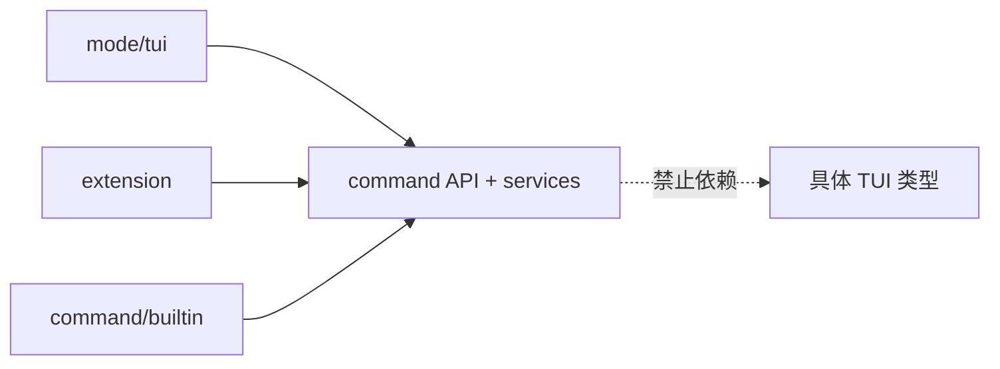
```mermaid
flowchart LR
    tui["mode/tui"] --> command["command API + services"]
    extension["extension"] --> command
    builtin["command/builtin"] --> command
    command -. "禁止依赖" .-> noTui["具体 TUI 类型"]
```

---

## 14. 迁移设计

### 14.1 迁移路径

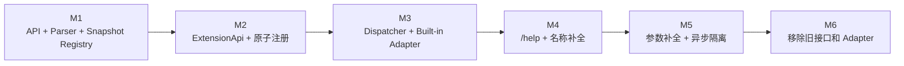
```mermaid
flowchart LR
    m1["M1\nAPI + Parser + Snapshot Registry"]
    m2["M2\nExtensionApi + 原子注册"]
    m3["M3\nDispatcher + Built-in Adapter"]
    m4["M4\n/help + 名称补全"]
    m5["M5\n参数补全 + 异步隔离"]
    m6["M6\n移除旧接口和 Adapter"]

    m1 --> m2 --> m3 --> m4 --> m5 --> m6
```

### 14.2 现有类型迁移

| 当前类型/逻辑 | 目标 |
|---|---|
| `Extension.commands()` | 删除，改为 `initialize(ExtensionApi)` |
| `ExtensionRegistry.getAllCommands()` | 删除，注册阶段直接提交 Registry |
| `SlashCommand` 实现类 | 临时 Adapter，最终迁移为统一 Handler |
| `SlashCommandRegistry.execute()` | 拆为 Parser + Dispatcher |
| `Map.put()` 静默覆盖 | 原子校验 + 显式冲突 |
| `EditorContainer.CommandSuggestion` | 由 Completion Service 提供 |
| `handleSlashCommandWithSideEffects()` | Handler/Command Event |

### 14.3 回滚边界

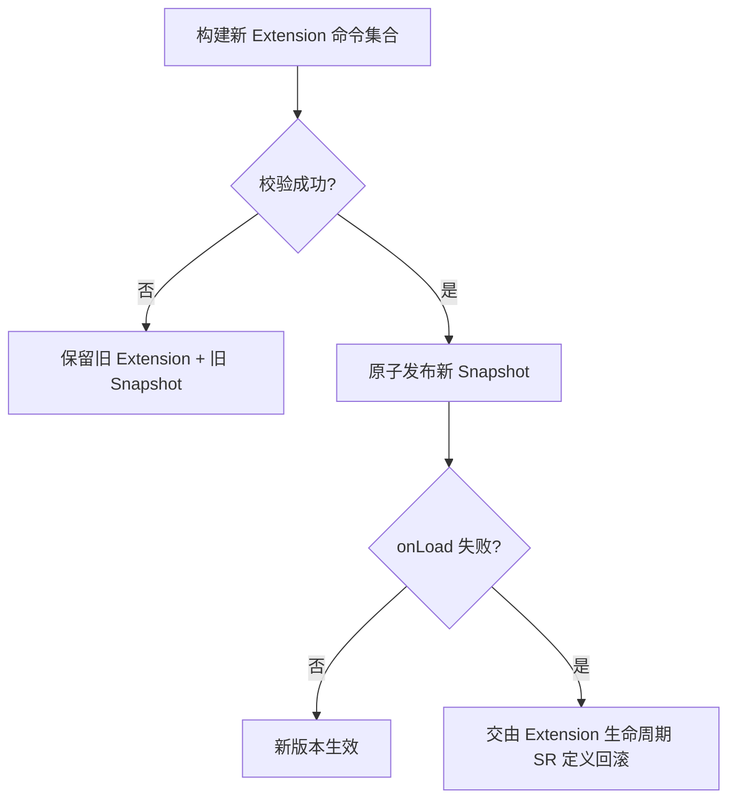
```mermaid
flowchart TD
    candidate["构建新 Extension 命令集合"] --> validate{"校验成功?"}
    validate -- 否 --> keep["保留旧 Extension + 旧 Snapshot"]
    validate -- 是 --> publish["原子发布新 Snapshot"]
    publish --> runtimeFailure{"onLoad 失败?"}
    runtimeFailure -- 否 --> done["新版本生效"]
    runtimeFailure -- 是 --> lifecycle["交由 Extension 生命周期 SR 定义回滚"]
```

---

## 15. 测试设计

### 15.1 测试金字塔

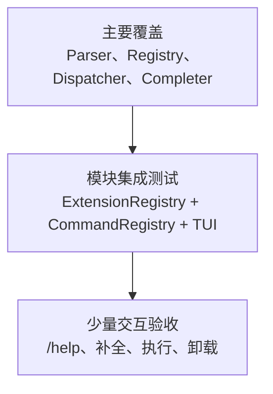
```mermaid
flowchart TB
    e2e["少量交互验收\n/help、补全、执行、卸载"]
    integration["模块集成测试\nExtensionRegistry + CommandRegistry + TUI"]
    unit["主要覆盖\nParser、Registry、Dispatcher、Completer"]

    unit --> integration --> e2e
```

### 15.2 测试矩阵

| 测试类 | 核心场景 |
|---|---|
| `SlashCommandParserTest` | 非命令、空命令、参数拆分、未知命令 |
| `SlashCommandRegistryTest` | 合法注册、非法名称、稳定顺序、冲突 |
| `SlashCommandRegistryReloadTest` | 原子替换、失败保留、卸载清理 |
| `SlashCommandDispatcherTest` | 四种状态、异步成功和失败 |
| `SlashCommandArgumentCompleterTest` | 候选、异常、超时、过期结果 |
| `DefaultExtensionApiTest` | owner 绑定、禁止伪造 owner |
| `ExtensionRegistryCommandTest` | 注册、替换、卸载完整生命周期 |
| `HelpCommandTest` | 内置和 Extension 统一展示 |
| `EditorContainerCommandCompletionTest` | 名称和参数补全 |

禁止使用真实模型、真实 Provider 或真实外部网络验证 Extension Command。

---

## 16. 验收场景

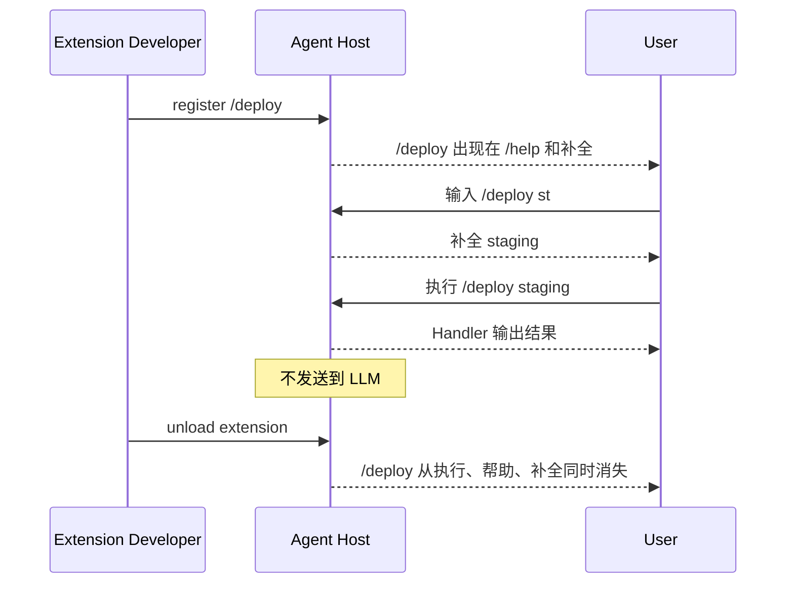
```mermaid
sequenceDiagram
    participant Dev as Extension Developer
    participant Host as Agent Host
    participant User

    Dev->>Host: register /deploy
    Host-->>User: /deploy 出现在 /help 和补全
    User->>Host: 输入 /deploy st
    Host-->>User: 补全 staging
    User->>Host: 执行 /deploy staging
    Host-->>User: Handler 输出结果
    Note over Host: 不发送到 LLM
    Dev->>Host: unload extension
    Host-->>User: /deploy 从执行、帮助、补全同时消失
```

| AC | 验收项 | 通过条件 |
|---|---|---|
| AC-01 | 公开接口 | Extension 通过 `registerCommand` 注册；无 `sourceInfo` |
| AC-02 | 生产执行 | Extension Command 在 TUI 中真实执行 |
| AC-03 | 统一发现 | `/help` 和名称补全同时可见 |
| AC-04 | 参数补全 | `/deploy st` 可补全 `staging` |
| AC-05 | 不进入模型 | Handler 执行后不产生普通 Prompt |
| AC-06 | 冲突安全 | 同名注册失败，旧 Snapshot 不变 |
| AC-07 | 生命周期 | reload 原子替换，unload 完整清理 |
| AC-08 | 故障隔离 | Handler/Completer 失败后宿主仍可用 |
| AC-09 | 架构统一 | Built-in 与 Extension 使用同一 Registry/Dispatcher |
| AC-10 | 无旁路 | `InteractiveMode` 不按具体命令名处理副作用 |
| AC-11 | 测试 | 新增单元和集成测试全部通过 |
| AC-12 | Extension 元数据 | ID 校验符合约束；name 未覆盖时等于 ID；重复 ID 不改变现有 Registry |

---

## 17. 开放问题

| 编号 | 问题 | 本期决策 |
|---|---|---|
| OQ-01 | 外部 Extension 如何发现和隔离 | 由独立 Extension Loader SR 决定 |
| OQ-02 | `onLoad()` 失败如何整体回滚 | 由 Extension 生命周期 SR 决定 |
| OQ-03 | RPC 何时支持 `get_commands` | 后续增强 |
| OQ-04 | `AgentSession` 是否改为稳定 Facade | 后续 SDK 稳定化 |
| OQ-05 | 是否支持参数中间位置补全 | 首版不支持 |
| OQ-06 | 是否增加 Alias | 首版注册独立命令名 |

---

## 18. 结论

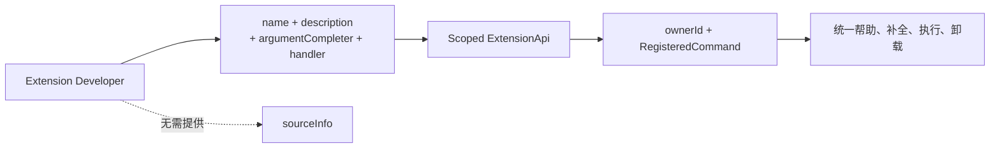
```mermaid
flowchart LR
    developer["Extension Developer"]
    publicApi["name + description\n+ argumentCompleter + handler"]
    scopedApi["Scoped ExtensionApi"]
    internal["ownerId + RegisteredCommand"]
    runtime["统一帮助、补全、执行、卸载"]

    developer --> publicApi --> scopedApi --> internal --> runtime
    developer -. "无需提供" .-> source["sourceInfo"]
```

Java Extension Command 采用 pi 语义一致的注册模型：

```text
Extension.initialize(ExtensionApi)
  → registerCommand(name, SlashCommandOptions)
  → Registry 内部绑定 extensionId
  → 原子发布命令快照
  → 统一帮助、补全、执行和卸载
```
