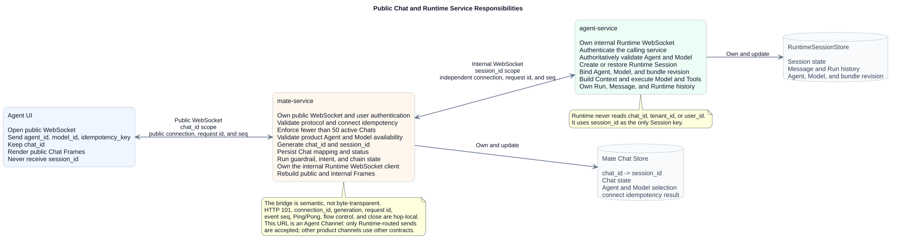
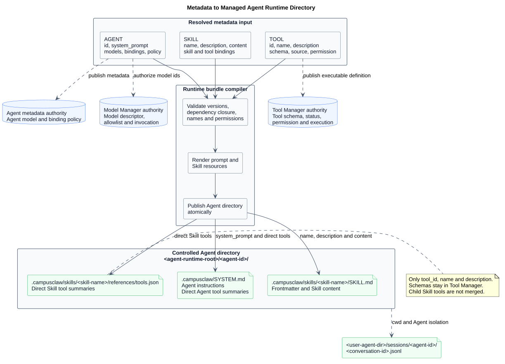
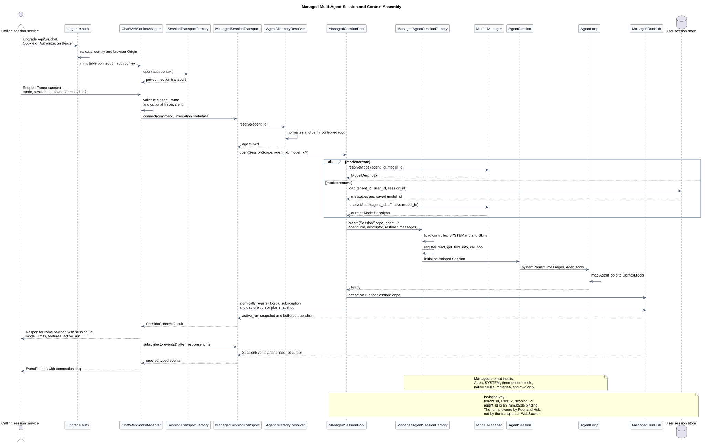
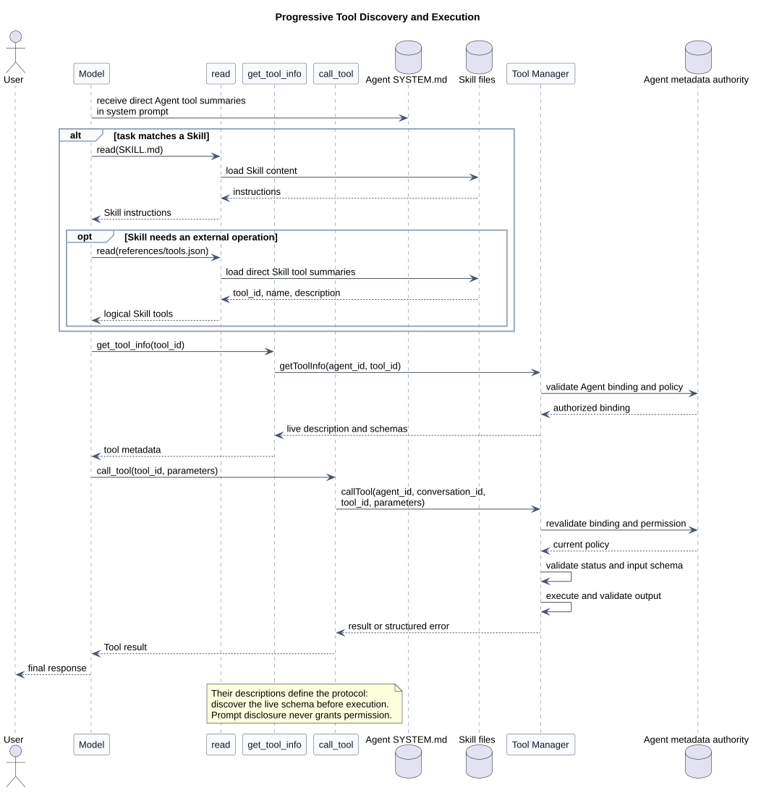
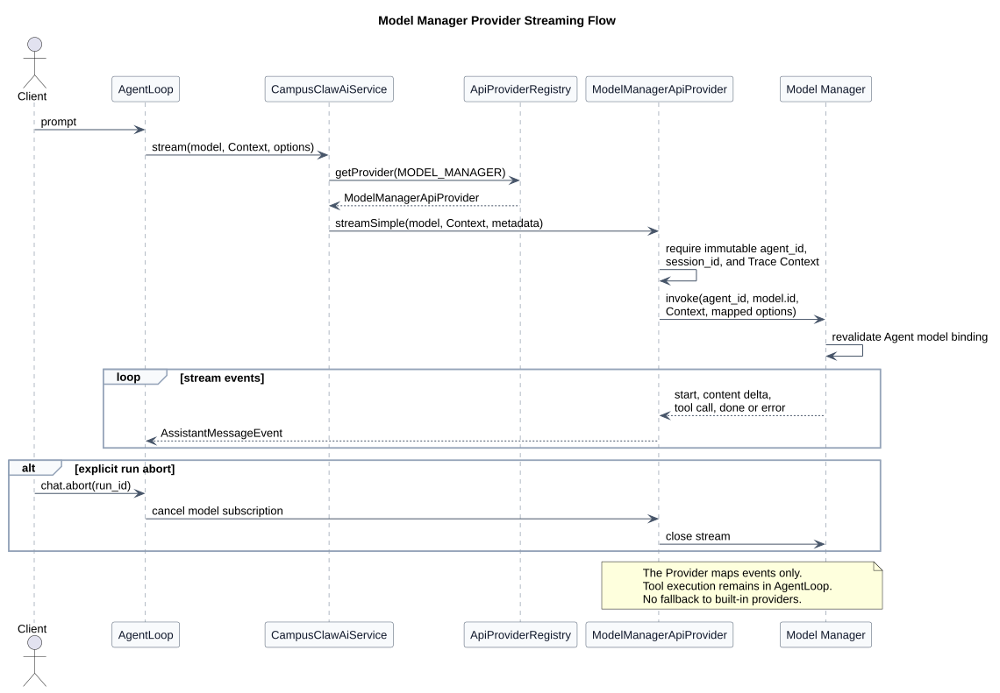
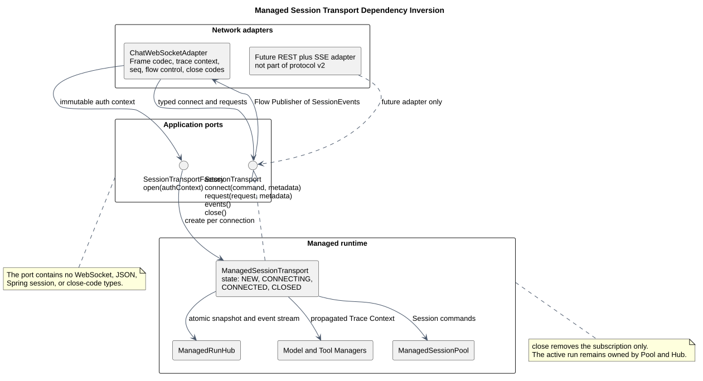

# CampusAgent Runtime：pi-mono-java Manager 驱动的多 Agent 运行设计

| 属性 | 值 |
|---|---|
| 文档版本 | 1.13.0 |
| 状态 | 目标设计，尚未实施 |
| 更新日期 | 2026-08-04 |
| pi-mono 源码基线 | `fc85bdd88be93b1e9a6b6bcfa41c684282ec79cc` |
| pi-mono-java 源码基线 | `1f7a5423219edfa4519d8719f1cc8a188ed72873` |
| OpenClaw 源码基线 | `b015925bc30f6a8363f290b07d5f8588e21422b8` |
| Anthropic Agent ID 参考证据 | 官方 TypeScript SDK `3b45cd3b69c956ac63384fdb09ce1d8109f3fa80`，只用于观察 Agent ID 示例 |
| 运行形态 | 多副本部署、每 Pod 单 JVM、多 Agent；mate-service 公共 Chat WebSocket + agent-service 内部 Runtime WebSocket |
| Template 规范性增补 | [`AgentRuntimeTemplate` 不可变运行模板设计](../agent-runtime-template/README.md)（关联设计基线 `2b2aee5ad11867f53af7fc379426e5fec6fd1d17`） |

> [!IMPORTANT]
> 本文中“原子替换 `<agent-id>` 目录”、cwd 恢复和 Template/revision pinning
> 若与上述增补冲突，以增补为准。Template 使用不可变 revision 和 current
> activation record，恢复按数据库中保存的 revision 精确加载。Chat WebSocket
> 不承担 Prompt Template 或 Skill 目录发现；对应展示信息由 mate-service 或
> Agent 元数据 REST 提供。

## 1. 结论

目录编译程序读取固定版本的 AGENT、SKILL 和 TOOL 元数据，生成 CampusAgent
Runtime 的 Managed Profile 可以加载的 Agent 运行目录。生成结果只向模型渐进
披露 Prompt 和 Skill；
Model Manager、Tool Manager 仍分别掌握模型、工具和权限的运行时权威。

Agent UI 只连接 mate-service 的公共 Chat WebSocket。HTTP Upgrade 成功后，
首个 `connect(mode=create)` 提交 `agent_id + model_id + idempotency_key`；
mate-service 完成用户与协议校验、Chat 数量限制和产品级 Agent/Model 可用性
检查，自动生成 `chat_id` 与内部 `session_id`，保存
`chat_id -> session_id` 的 `CREATING` 映射，再建立到 agent-service 的内部
Runtime WebSocket。只有 Runtime Session 创建成功后，mate-service 才把映射
置为 `ACTIVE`，并向 UI 返回公共 `connection_id + chat_id`。UI 永远不接收
`session_id`。

agent-service 的内部首帧仍以 `session_id + agent_id + model_id` 创建 Runtime
Session。服务端校验成功后，从受控根目录解析 Agent cwd，创建或恢复该 Agent
独立的 `AgentSession` 和 `Agent`。公共或内部连接断开都不等于
`chat.abort`；同 Pod 内的 run 继续执行，恢复时由 mate-service 以 `chat_id`
查出 `session_id`，重新建立内部连接并投影 Runtime 快照。Pod 重启时从数据库
重建 Session，并将旧 active run 收束为 `interrupted`。

`ChatWebSocketAdapter` 接收网络 Frame，并把强类型命令交给当前连接独占的
`ManagedSessionTransport`；Transport 返回响应并持续发布 Session 事件。
connect Response 返回经过客户端声明、服务能力和授权共同过滤的有效 features。

文件内容不经 WebSocket 传输。mate-service 承载 Attachment Service：
正文写入 OBS，永久身份/状态与活动期校验数据分层写入
openGauss。外部调用方使用单文件 multipart 上传并轮询处理状态；
`chat.send` 只提交不透明 `attachment_ids[]`。Runtime 通过 Attachment
Service 的内部 `resolve` 批量取得可信元数据快照，再通过内部
`content` 流式读取正文。OBS Object Key 精确等于 `attachment_id`，因此
openGauss 不保存第二套定位映射；Runtime 即使知道附件 ID，也没有 Bucket、
OBS 凭据、预签名 URL或直连 OBS 的权限。
每个 `attachment_id` 由 Attachment Service 签发，严格匹配
`^attachment_[0-9A-Za-z]{24}$`，总长 35、大小写敏感，并在该 Attachment
Service 部署内全局唯一；格式和唯一性都不代替 Session 级授权。

模型只直接调用以下三个通用工具：

```text
read
get_tool_info
call_tool
```

当任务需要真实业务操作时，模型先读取 Agent 或 Skill 披露的逻辑
`tool_id`，再通过 `get_tool_info` 取得当前 Schema，通过 `call_tool` 请求
执行。服务端不把真实业务工具注册为 `AgentTool`；Agent 直接绑定的工具摘要
进入 `SYSTEM.md`，Skill 绑定的工具摘要进入该 Skill 的
`references/tools.json`。

最终运行目录为：

```text
<agent-runtime-root>/
└── <agent-id>/
    └── .campusagent/
        ├── SYSTEM.md
        └── skills/
            └── <skill-name>/
                ├── SKILL.md
                └── references/
                    └── tools.json

RuntimeSessionStore (database)
├── SessionRecord
├── MessageRecord + history_seq
├── RunRecord + idempotency result
└── AttachmentContent metadata snapshot

Attachment Service
├── openGauss t_attachment: permanent ID, Session binding and tombstone
├── openGauss t_attachment_active_detail: active validation and worker state
└── OBS: attachment body at object key = attachment_id
```

`references/tools.json` 只在 Skill 存在直接有效 `binding_tools` 时生成。

模型产生流式输出时，服务端只发送本次结构化 delta，不反复发送累计
`AssistantMessage`。客户端只在 `message.completed`、重连快照和历史接口中
接收完整 Message 投影。
本专题包含两份彼此独立的规范性协议：

- [`mate-chat-ws-v2.asyncapi.yaml`](mate-chat-ws-v2.asyncapi.yaml)：Agent UI 到
  mate-service 的公共 Chat 协议，只出现 `chat_id`；
- [`chat-ws-v2.asyncapi.yaml`](chat-ws-v2.asyncapi.yaml)：mate-service 到
  agent-service 的内部 Runtime 协议，只出现 `session_id`。

附件的 HTTP 契约、openGauss DDL、OBS 存储端口和补偿状态机以
[`CampusMate Attachment Service：OBS + openGauss 设计`](../campusmate-attachment-service/README.md)
为规范性专题。
浏览器和 UI 按
[`mate-chat-ws-v2-client-integration.md`](mate-chat-ws-v2-client-integration.md)
实施公共连接、发送、归并和恢复；mate-service 的内部 Runtime 客户端按
[`chat-ws-v2-client-integration.md`](chat-ws-v2-client-integration.md)
实施。浏览器不直接持有 Runtime 服务凭据。

CampusAgent 是 Agent Runtime，不是用户会话产品。mate-service 以 `chat_id`
管理用户可见的 Chat、50 个 Chat 的产品配额、公共连接幂等和业务删除，同时
为每个 Chat 分配一个不对 UI 披露的 `session_id`。CampusAgent 把
`session_id` 作为不透明的持久上下文标识，负责 Agent/Model 绑定、数据库会话、
消息、run 和同 Pod 流式恢复。本设计不再引入 `conversation_id` 或第二套
`agent_session_id`。

mate-service 必须保证内部 `session_id` 在一个 CampusAgent Runtime 部署范围内
全局唯一，推荐使用 UUIDv7 或 ULID，并且删除后不得复用。Runtime 不接收、
不保存，也不使用业务 `tenant_id` 或 `user_id` 作为 Session 身份；调用方的
最终用户鉴权、会话归属和配额判断必须在进入 Runtime 前完成。Runtime 只认证
调用服务，`ManagedSessionPool` 的唯一 key 是 `session_id`。`chat_id` 只存在于
mate-service 及其 Chat Store，不进入 Runtime Session key、Prompt、Tool/Model
Manager 请求或 RuntimeSessionStore。

## 2. 范围与设计分类

本文定义元数据发布、Session 建立、Context 组装、Manager 调用和 WebSocket
恢复的完整 Runtime 边界；它覆盖：

- 三类元数据到 Agent 运行目录的确定性映射；
- Agent cwd、Session 隔离和 WebSocket 握手；
- Chat-scoped 公共 WebSocket、Session-scoped 内部 WebSocket、Frame、能力协商、追踪、结构化流事件、恢复和背压；
- 服务端 SessionTransport 端口与 WebSocket Adapter 的依赖倒置；
- Managed Prompt 与 pi-mono-java `Context` 的组装；
- Tool Manager 的逻辑工具发现和执行；
- Model Manager Provider 的模型选择和流式事件适配；
- 附件上传、状态轮询、内部解析/流式读取、模型输入装配和 24 小时未引用清理；
- 每 Pod 单 JVM 内多个 Agent 的隔离边界和内部 Session 亲和路由前提；
- 对 pi-mono-java 的目标适配点和验收要求。

本文只规定目标行为和适配边界，不交付以下实现：

- pi-mono-java Java 代码；
- 元数据管理服务；
- Tool Manager 或 Model Manager；
- WebSocket 客户端；
- 附件上传 REST API 的 Java 实现（HTTP 契约由关联专题定义）；
- 数据库表和管理界面。
- pi-mono-java 现有 Java package、class 或 artifact 的 CampusAgent 改名。

用户“最多 50 个 Chat”的产品配额由 mate-service 执行，不是 CampusAgent
Runtime 的固定协议规则。上层删除 Chat 时必须通过独立的 Session 生命周期
控制接口通知 Runtime 清理或归档；该控制接口不属于本 WebSocket 协议范围。

文中使用以下分类：

| 分类 | 含义 |
|---|---|
| 观察到的行为 | 已由指定源码基线确认的 pi 或 pi-mono-java 行为 |
| 目标设计 | 本文定义、当前 Java 尚未实现的行为 |
| 产品约束 | 每 Pod 单 JVM、多 Agent、Manager 权威和固定通用工具等产品选择 |
| 安全加固 | 服务端 cwd、路径约束、每次调用重新鉴权等加强措施 |
| 架构改造 | 新增目录编译器、Managed Session Factory 或 Manager Provider |

## 3. 源码基线与事实

### 3.1 pi-mono

在固定基线 `fc85bdd…` 中，pi 将 systemPrompt、messages 和 tools 分开组装，
并通过摘要与 `read` 渐进加载 Skill；下表列出直接源码证据。

源码仓库：

```text
repository: https://github.com/badlogic/pi-mono
commit:     fc85bdd88be93b1e9a6b6bcfa41c684282ec79cc
```

| 主题 | 源码证据 | 观察到的行为 |
|---|---|---|
| LLM Context | [`packages/ai/src/types.ts#L448-L458`](https://github.com/badlogic/pi-mono/blob/fc85bdd88be93b1e9a6b6bcfa41c684282ec79cc/packages/ai/src/types.ts#L448-L458) `Tool`、`Context` | `systemPrompt`、`messages`、`tools` 是分离字段；Tool 包含 name、description、parameters |
| 自定义 SYSTEM | [`packages/coding-agent/src/core/system-prompt.ts#L28-L71`](https://github.com/badlogic/pi-mono/blob/fc85bdd88be93b1e9a6b6bcfa41c684282ec79cc/packages/coding-agent/src/core/system-prompt.ts#L28-L71) `buildSystemPrompt()` | custom prompt 替换默认主体，之后仍组装上下文、Skill 和 cwd |
| Skill 摘要 | [`packages/coding-agent/src/core/skills.ts#L335-L360`](https://github.com/badlogic/pi-mono/blob/fc85bdd88be93b1e9a6b6bcfa41c684282ec79cc/packages/coding-agent/src/core/skills.ts#L335-L360) `formatSkillsForPrompt()` | Prompt 只披露 Skill 的 name、description、location，并要求使用 read 加载文件 |
| Skill 文件 | [`packages/coding-agent/src/core/skills.ts#L277-L319`](https://github.com/badlogic/pi-mono/blob/fc85bdd88be93b1e9a6b6bcfa41c684282ec79cc/packages/coding-agent/src/core/skills.ts#L277-L319) `loadSkillFromFile()` | 从 `SKILL.md` frontmatter 读取 name 和 description，正文不直接进入初始 Prompt |
| 显式 Skill 调用 | [`packages/coding-agent/src/core/agent-session.ts#L1296-L1325`](https://github.com/badlogic/pi-mono/blob/fc85bdd88be93b1e9a6b6bcfa41c684282ec79cc/packages/coding-agent/src/core/agent-session.ts#L1296-L1325) `_expandSkillCommand()` | `/skill:name` 读取 Skill 文件正文并加入当前会话 |
| Tool 注册 | [`packages/coding-agent/src/core/agent-session.ts#L2458-L2491`](https://github.com/badlogic/pi-mono/blob/fc85bdd88be93b1e9a6b6bcfa41c684282ec79cc/packages/coding-agent/src/core/agent-session.ts#L2458-L2491) `_refreshToolRegistry()` | 内置、Extension 和 SDK Tool 最终形成真实可执行 Tool Registry |
| 图片输入 | [`packages/agent/src/agent.ts#L336-L395`](https://github.com/badlogic/pi-mono/blob/fc85bdd88be93b1e9a6b6bcfa41c684282ec79cc/packages/agent/src/agent.ts#L336-L395) `prompt()`、[`packages/ai/src/types.ts#L345-L349`](https://github.com/badlogic/pi-mono/blob/fc85bdd88be93b1e9a6b6bcfa41c684282ec79cc/packages/ai/src/types.ts#L345-L349) `ImageContent` | pi 的 Agent prompt 可接收图片；图片内容以 base64 data 和 MIME type 直接进入消息，没有通用 attachment ID、上传状态或内容租约 |

pi 的这些行为是本设计保留“Context 分层”和“Skill 渐进式加载”的依据。
Tool Manager 代理模式属于架构改造，不是 pi 已有的动态逻辑工具协议。

### 3.2 pi-mono-java

在固定基线 `1f7a542…` 中，pi-mono-java 按单一 cwd 创建 Session、加载
Prompt/Skill/Tool，并在 WebSocket 断开时 abort；下表列出直接源码证据。

源码仓库：

```text
repository: https://github.com/superheromeZzh/pi-mono-java
commit:     1f7a5423219edfa4519d8719f1cc8a188ed72873
```

| 主题 | 源码证据 | 观察到的行为 |
|---|---|---|
| Session 初始化 | [`AgentSession.java#L114-L161`](https://github.com/superheromeZzh/pi-mono-java/blob/1f7a5423219edfa4519d8719f1cc8a188ed72873/modules/coding-agent-cli/src/main/java/com/campusclaw/codingagent/session/AgentSession.java#L114-L161) `initialize()` | 当前 Session 解析 Model、加载 Tool/Skill/上下文文件、构建 Prompt，再创建 Agent |
| SYSTEM 位置 | [`ContextFileLoader.java#L84-L103`](https://github.com/superheromeZzh/pi-mono-java/blob/1f7a5423219edfa4519d8719f1cc8a188ed72873/modules/coding-agent-cli/src/main/java/com/campusclaw/codingagent/context/ContextFileLoader.java#L84-L103) `loadSystemPrompt()` | 优先读取 `<cwd>/.campusclaw/SYSTEM.md` |
| 项目 Skill | [`AgentSession.java#L545-L560`](https://github.com/superheromeZzh/pi-mono-java/blob/1f7a5423219edfa4519d8719f1cc8a188ed72873/modules/coding-agent-cli/src/main/java/com/campusclaw/codingagent/session/AgentSession.java#L545-L560) `loadSkills()` | 从 `<cwd>/.campusclaw/skills` 加载项目 Skill |
| Prompt 组装 | [`SystemPromptBuilder.java#L59-L125`](https://github.com/superheromeZzh/pi-mono-java/blob/1f7a5423219edfa4519d8719f1cc8a188ed72873/modules/coding-agent-cli/src/main/java/com/campusclaw/codingagent/prompt/SystemPromptBuilder.java#L59-L125) `build()` | SYSTEM override 后继续追加真实 Tool、Skill、上下文、默认文档和环境信息 |
| Skill 摘要 | [`SkillPromptFormatter.java#L24-L49`](https://github.com/superheromeZzh/pi-mono-java/blob/1f7a5423219edfa4519d8719f1cc8a188ed72873/modules/coding-agent-cli/src/main/java/com/campusclaw/codingagent/skill/SkillPromptFormatter.java#L24-L49) `format()` | 把 name、description、location 放入 Prompt，并要求使用 read |
| AgentTool | [`AgentTool.java#L17-L37`](https://github.com/superheromeZzh/pi-mono-java/blob/1f7a5423219edfa4519d8719f1cc8a188ed72873/modules/agent-core/src/main/java/com/campusclaw/agent/tool/AgentTool.java#L17-L37) `AgentTool` | Tool 同时包含模型描述、Schema 和本地 execute |
| LLM Tool 投影 | [`AgentLoop.java#L209-L219`](https://github.com/superheromeZzh/pi-mono-java/blob/1f7a5423219edfa4519d8719f1cc8a188ed72873/modules/agent-core/src/main/java/com/campusclaw/agent/loop/AgentLoop.java#L209-L219) `invokeModel()`、[`AgentLoop.java#L312-L320`](https://github.com/superheromeZzh/pi-mono-java/blob/1f7a5423219edfa4519d8719f1cc8a188ed72873/modules/agent-core/src/main/java/com/campusclaw/agent/loop/AgentLoop.java#L312-L320) `toLlmTools()` | 每轮把 AgentTool 转为 name、description、parameters，再与 systemPrompt、messages 组成 Context |
| 当前 SessionPool | [`SessionPool.java#L61-L69`](https://github.com/superheromeZzh/pi-mono-java/blob/1f7a5423219edfa4519d8719f1cc8a188ed72873/modules/coding-agent-cli/src/main/java/com/campusclaw/codingagent/mode/server/SessionPool.java#L61-L69)、[`SessionPool.java#L176-L202`](https://github.com/superheromeZzh/pi-mono-java/blob/1f7a5423219edfa4519d8719f1cc8a188ed72873/modules/coding-agent-cli/src/main/java/com/campusclaw/codingagent/mode/server/SessionPool.java#L176-L202) | 当前只有一个 baseConfig/serverCwd，并按 conversation ID 保存内存 Session |
| 当前 JSONL 路径 | [`SessionPool.java#L345-L377`](https://github.com/superheromeZzh/pi-mono-java/blob/1f7a5423219edfa4519d8719f1cc8a188ed72873/modules/coding-agent-cli/src/main/java/com/campusclaw/codingagent/mode/server/SessionPool.java#L345-L377) | 当前按进程 cwd 编码 Session 目录 |
| WebSocket 握手 | [`ServerMode.java#L377-L391`](https://github.com/superheromeZzh/pi-mono-java/blob/1f7a5423219edfa4519d8719f1cc8a188ed72873/modules/coding-agent-cli/src/main/java/com/campusclaw/codingagent/mode/server/ServerMode.java#L377-L391) | 当前只提取 `conversation_id` |
| WebSocket 生命周期 | [`ChatWebSocketHandler.java#L115-L135`](https://github.com/superheromeZzh/pi-mono-java/blob/1f7a5423219edfa4519d8719f1cc8a188ed72873/modules/coding-agent-cli/src/main/java/com/campusclaw/codingagent/mode/server/ChatWebSocketHandler.java#L115-L135)、[`#L168-L188`](https://github.com/superheromeZzh/pi-mono-java/blob/1f7a5423219edfa4519d8719f1cc8a188ed72873/modules/coding-agent-cli/src/main/java/com/campusclaw/codingagent/mode/server/ChatWebSocketHandler.java#L168-L188) | 当前一条连接捕获一个 AgentSession，连接关闭会调用 abort |
| WebSocket 命令 | [`ChatWebSocketHandler.java#L195-L227`](https://github.com/superheromeZzh/pi-mono-java/blob/1f7a5423219edfa4519d8719f1cc8a188ed72873/modules/coding-agent-cli/src/main/java/com/campusclaw/codingagent/mode/server/ChatWebSocketHandler.java#L195-L227) | 当前使用 `prompt`、`steer`、`abort`、`new_session` 等 v1 命令，没有统一 req/res/event Frame |
| WebSocket 消息更新 | [`ChatWebSocketHandler.java#L422-L459`](https://github.com/superheromeZzh/pi-mono-java/blob/1f7a5423219edfa4519d8719f1cc8a188ed72873/modules/coding-agent-cli/src/main/java/com/campusclaw/codingagent/mode/server/ChatWebSocketHandler.java#L422-L459)、[`useChatWs.ts#L439-L448`](https://github.com/superheromeZzh/pi-mono-java/blob/1f7a5423219edfa4519d8719f1cc8a188ed72873/frontend/src/composables/useChatWs.ts#L439-L448) | 当前 `message_update` 携带累计 Message，前端用新快照替换旧快照 |
| v1 协议文档 | [`docs/asyncapi/chat-ws.yaml#L1-L76`](https://github.com/superheromeZzh/pi-mono-java/blob/1f7a5423219edfa4519d8719f1cc8a188ed72873/docs/asyncapi/chat-ws.yaml#L1-L76) | 当前 AsyncAPI 版本为 1.0.0，记录 query 握手、v1 命令和累计 Message 行为 |
| Agent 流事件 | [`MessageUpdateEvent.java#L17-L20`](https://github.com/superheromeZzh/pi-mono-java/blob/1f7a5423219edfa4519d8719f1cc8a188ed72873/modules/agent-core/src/main/java/com/campusclaw/agent/event/MessageUpdateEvent.java#L17-L20)、[`AgentLoop.java#L255-L276`](https://github.com/superheromeZzh/pi-mono-java/blob/1f7a5423219edfa4519d8719f1cc8a188ed72873/modules/agent-core/src/main/java/com/campusclaw/agent/loop/AgentLoop.java#L255-L276) | Java 内部事件同时保留累计 AssistantMessage 和细粒度 AssistantMessageEvent，v2 可直接映射后者 |
| Provider 扩展点 | [`ApiProvider.java#L31-L59`](https://github.com/superheromeZzh/pi-mono-java/blob/1f7a5423219edfa4519d8719f1cc8a188ed72873/modules/ai/src/main/java/com/campusclaw/ai/provider/ApiProvider.java#L31-L59)、[`ApiProviderRegistry.java#L54-L80`](https://github.com/superheromeZzh/pi-mono-java/blob/1f7a5423219edfa4519d8719f1cc8a188ed72873/modules/ai/src/main/java/com/campusclaw/ai/provider/ApiProviderRegistry.java#L54-L80) | Spring 可发现统一 ApiProvider，并按 `Api` 分发 |
| 调用元数据 | [`SimpleStreamOptions.java#L34-L45`](https://github.com/superheromeZzh/pi-mono-java/blob/1f7a5423219edfa4519d8719f1cc8a188ed72873/modules/ai/src/main/java/com/campusclaw/ai/types/SimpleStreamOptions.java#L34-L45) | 每次模型调用已有任意 metadata 字段可承载 Session 身份 |
| 模型流事件 | [`AssistantMessageEvent.java#L44-L164`](https://github.com/superheromeZzh/pi-mono-java/blob/1f7a5423219edfa4519d8719f1cc8a188ed72873/modules/ai/src/main/java/com/campusclaw/ai/stream/AssistantMessageEvent.java#L44-L164) | 已定义 start、text、thinking、toolcall、done、error 事件 |
| 当前消息内容 | [`UserMessage.java#L20-L31`](https://github.com/superheromeZzh/pi-mono-java/blob/1f7a5423219edfa4519d8719f1cc8a188ed72873/modules/ai/src/main/java/com/campusclaw/ai/types/UserMessage.java#L20-L31)、[`ContentBlock.java#L17-L24`](https://github.com/superheromeZzh/pi-mono-java/blob/1f7a5423219edfa4519d8719f1cc8a188ed72873/modules/ai/src/main/java/com/campusclaw/ai/types/ContentBlock.java#L17-L24)、[`ImageContent.java#L9-L18`](https://github.com/superheromeZzh/pi-mono-java/blob/1f7a5423219edfa4519d8719f1cc8a188ed72873/modules/ai/src/main/java/com/campusclaw/ai/types/ImageContent.java#L9-L18) | Java 当前 UserMessage 接受 ContentBlock 列表，但封闭联合只含 text/image/thinking/toolCall，图片仍是 base64；没有通用附件引用或读取句柄 |
| 附件后续项 | [`docs/plans/ws-chat-followups.md#L12-L37`](https://github.com/superheromeZzh/pi-mono-java/blob/1f7a5423219edfa4519d8719f1cc8a188ed72873/docs/plans/ws-chat-followups.md#L12-L37) | 固定基线把 WebSocket 附件输入列为待设计项，并明确需要在 base64 与独立上传/引用之间选择 |

上表的 `.campusclaw` 和 `com/campusclaw` 是固定基线的源码事实，不做
历史回写。目标 Managed Profile 的 Loader 只读取 `<cwd>/.campusagent`；
Legacy/CLI 仍按现有逻辑读取 `.campusclaw`。本版不设计双读、目录回退或
自动迁移。

### 3.3 OpenClaw Gateway

在固定基线 `b015925…` 中，OpenClaw Gateway Protocol v4 使用统一 Frame、
Gateway 多路复用、双层序列和权威恢复；下表列出本设计借鉴或明确不采用的
源码行为。

源码仓库：

```text
repository: https://github.com/openclaw/openclaw
commit:     b015925bc30f6a8363f290b07d5f8588e21422b8
```

| 主题 | 源码证据 | 观察到的行为 |
|---|---|---|
| 握手与 Frame | [`docs/gateway/protocol.md#L83-L168`](https://github.com/openclaw/openclaw/blob/b015925bc30f6a8363f290b07d5f8588e21422b8/docs/gateway/protocol.md#L83-L168)、[`frames.ts#L12-L198`](https://github.com/openclaw/openclaw/blob/b015925bc30f6a8363f290b07d5f8588e21422b8/packages/gateway-protocol/src/schema/frames.ts#L12-L198) | Gateway Protocol v4 使用 challenge/connect/hello；源码明确把 req/res/event 定义为 WebSocket envelope contracts，Request Frame 支持 `traceparent` |
| Chat 多路复用和精确订阅 | [`logs-chat.ts#L112-L168`](https://github.com/openclaw/openclaw/blob/b015925bc30f6a8363f290b07d5f8588e21422b8/packages/gateway-protocol/src/schema/logs-chat.ts#L112-L168)、[`protocol.md#L583-L588`](https://github.com/openclaw/openclaw/blob/b015925bc30f6a8363f290b07d5f8588e21422b8/docs/gateway/protocol.md#L583-L588) | `chat.send` 每次携带 `sessionKey`；同一 Gateway 连接可承载多个 Session，并可为一个 Session 精确订阅消息事件 |
| Chat delta | [`logs-chat.ts#L188-L252`](https://github.com/openclaw/openclaw/blob/b015925bc30f6a8363f290b07d5f8588e21422b8/packages/gateway-protocol/src/schema/logs-chat.ts#L188-L252)、[`server-chat.ts#L278-L296`](https://github.com/openclaw/openclaw/blob/b015925bc30f6a8363f290b07d5f8588e21422b8/src/gateway/server-chat.ts#L278-L296)、[`#L922-L944`](https://github.com/openclaw/openclaw/blob/b015925bc30f6a8363f290b07d5f8588e21422b8/src/gateway/server-chat.ts#L922-L944) | Protocol v4 的 Chat delta 同时支持 `deltaText`、可选累计 message 和 replace 语义 |
| 客户端恢复 | [`docs/gateway/clients.md#L111-L130`](https://github.com/openclaw/openclaw/blob/b015925bc30f6a8363f290b07d5f8588e21422b8/docs/gateway/clients.md#L111-L130) | 重连后恢复 Session 订阅、读取 `chat.history`、采用 `inFlightRun`，并按连接序列和 run 序列发现缺口 |
| 客户端 Transport | [`types.ts#L20-L33`](https://github.com/openclaw/openclaw/blob/b015925bc30f6a8363f290b07d5f8588e21422b8/packages/sdk/src/types.ts#L20-L33)、[`transport.ts#L73-L174`](https://github.com/openclaw/openclaw/blob/b015925bc30f6a8363f290b07d5f8588e21422b8/packages/sdk/src/transport.ts#L73-L174)、[`client.ts#L342-L438`](https://github.com/openclaw/openclaw/blob/b015925bc30f6a8363f290b07d5f8588e21422b8/packages/sdk/src/client.ts#L342-L438) | SDK 依赖 `OpenClawTransport.request/events/close`，WebSocket `GatewayClientTransport` 是可替换实现 |
| 服务端耦合和背压 | [`shared-types.ts#L110-L116`](https://github.com/openclaw/openclaw/blob/b015925bc30f6a8363f290b07d5f8588e21422b8/src/gateway/server-methods/shared-types.ts#L110-L116)、[`#L337-L353`](https://github.com/openclaw/openclaw/blob/b015925bc30f6a8363f290b07d5f8588e21422b8/src/gateway/server-methods/shared-types.ts#L337-L353)、[`ws-types.ts#L23-L26`](https://github.com/openclaw/openclaw/blob/b015925bc30f6a8363f290b07d5f8588e21422b8/src/gateway/server/ws-types.ts#L23-L26)、[`server-broadcast.ts#L293-L327`](https://github.com/openclaw/openclaw/blob/b015925bc30f6a8363f290b07d5f8588e21422b8/src/gateway/server-broadcast.ts#L293-L327) | Request Handler 已不接收 WebSocket，但服务器广播仍直接读取 `socket.bufferedAmount` 并调用 `socket.send/close` |

本设计借鉴 Frame、`traceparent`、有效能力声明、序列和权威恢复原则，但不复制
OpenClaw 的 Gateway 多路复用。CampusAgent 当前产品边界是 ToB 的
Session-scoped 连接：一个连接的认证、Agent 权限、Runtime Session、模型和
thinking 披露策略在握手后全部固定，减少跨 Agent 路由和审计歧义。这是产品
约束和安全加固，不是 WebSocket 协议本身的限制。OpenClaw 的
`OpenClawTransport` 是客户端端口；CampusAgent 的 `SessionTransport` 是
服务端逻辑会话通道，属于借鉴依赖倒置思想后的架构改造，不宣称为同一接口。

### 3.4 Anthropic Managed Agents ID 形式参考

Anthropic Managed Agents 的官方 Create Agent 请求不接收 `id`，创建
响应由服务端增加 Agent ID。Create Agent 顶层响应及官方 TypeScript SDK 在固定
commit `3b45cd3…` 的 retrieve 示例中使用
`agent_011CZkYpogX7uDKUyvBTophP`；其他官方生成型 API 示例还把
`agent_011CZkYqphY8vELVzwCUpqiQ` 用作 Agent 引用。二者都呈现为
`agent_` 加 24 位大小写字母数字，但示例资源角色不能混同：

- [Anthropic Create Agent API](https://platform.claude.com/docs/en/api/beta/agents/create)；
- [Anthropic Get Agent API](https://platform.claude.com/docs/en/api/beta/agents/retrieve)；
- [官方 SDK `Agents.create/retrieve` 与 Agent `id`](https://github.com/anthropics/anthropic-sdk-typescript/blob/3b45cd3b69c956ac63384fdb09ce1d8109f3fa80/src/resources/beta/agents/agents.ts#L14-L155)；
- [官方 SDK `AgentCreateParams`](https://github.com/anthropics/anthropic-sdk-typescript/blob/3b45cd3b69c956ac63384fdb09ce1d8109f3fa80/src/resources/beta/agents/agents.ts#L888-L952)；
- [官方 SDK `BetaManagedAgentsModel`](https://github.com/anthropics/anthropic-sdk-typescript/blob/3b45cd3b69c956ac63384fdb09ce1d8109f3fa80/src/resources/beta/agents/agents.ts#L701-L721)。

这只是官方示例的可观察形式。Anthropic 公开 SDK 仍将 Agent `id`
声明为普通 `string`，没有公布 regex、生成算法、时间有序性或客户端
自行生成规则。Anthropic 当前列举的 `model.id` 使用
`claude-sonnet-4-6` 等 Provider 模型名，但公开类型仍允许其他 string，且不使用
`model_` 作为 Campus 资源前缀。因此，下文对 `agent_id` 和
`model_id` 的精确 regex 是 Campus 平台自己冻结的目标契约：前者
参考 Anthropic 的资源前缀形式，后者是 CampusModel/model-service 的
架构决策，都不构成对 Anthropic 未来 ID 格式的兼容承诺。

## 4. 目标组件与权威边界

UI 创建或恢复 Chat 时，mate-service 先完成公共连接和 Chat 编排，再由其内部
Runtime 客户端创建或恢复 Session。进入 agent-service 后，Resolver 选择目录，
Factory 组装 Agent，Manager 执行模型与工具，Pool、Hub 和 Store 保存运行状态；
下表明确每项数据由谁掌握。

| 组件 | 权威数据 | 主要职责 |
|---|---|---|
| PublicChatWebSocketAdapter（mate-service） | 公共 Frame、公共 `connection_id/seq`、用户认证上下文 | 承载 `wss://api.example.com/mate-service/v1/ws/chat`，校验公共 Frame，并把网络事件交给 ChatOrchestrator |
| ChatOrchestrator（mate-service） | Chat 创建状态、公共命令状态机和产品策略 | 校验 connect 幂等、Chat 数量 `< 50`、护栏、意图和链式状态；只有选择 Runtime 路径才接受公共 `chat.send`，其他分支在接受前结束 |
| Mate Chat Store | `chat_id -> session_id`、Chat 状态、Agent/Model 选择和公共 connect 幂等结果 | 保存 UI 可见 Chat 与内部 Runtime Session 的一对一映射；`CREATING -> ACTIVE` 后才公开成功 |
| RuntimeWebSocketClient（mate-service） | 当前内部连接、RequestFrame 关联和 Runtime 事件订阅 | 以服务身份建立内部 WebSocket，重建而非透传 Frame；桥接快照、历史、run 和错误 |
| Agent 元数据服务 | Agent 定义、models、Skill/Tool 绑定和 Agent 权限 | 为目录编译、模型授权和工具授权提供 Agent 视角 |
| Skill 元数据或制品服务 | Skill 版本、name、description、content 或完整 `SKILL.md` | 提供可物化的 Skill 文档 |
| Tool Manager | Tool 描述、Schema、状态、source、permission、执行实现 | 发现、授权、校验并执行逻辑工具 |
| Model Manager | Model descriptor、状态、有效输入策略、实际 Provider 路由和模型调用 | 校验 Agent-model 绑定，声明可接受模态/MIME/数量/字节上限并流式执行 |
| Runtime bundle compiler | 固定版本、展开依赖、验证并生成 Agent 目录 | 把元数据投影为 pi-mono-java 资源 |
| AgentDirectoryResolver | `agent_id` 到受控 cwd 的映射 | 阻止客户端选择任意工作目录 |
| ManagedAgentSessionFactory | 当前 Agent 的 Prompt、Skill、Model、Tool 和 Session 装配 | 每个 Session 创建独立 Agent |
| SessionTransportFactory（agent-service） | 不可变内部连接认证上下文 | 为每条内部物理连接创建独立的逻辑 Session 通道 |
| ManagedSessionTransport（agent-service） | connect 状态、Session 绑定、强类型请求和事件订阅 | 实现 `connect/request/events/close`，隔离 Runtime 应用语义与网络实现 |
| ChatWebSocketAdapter（agent-service） | 内部 WebSocket Frame、连接序列和网络流控 | 映射内部 Frame 与 Session 类型，处理首帧、Ping/Pong、1009 和 1013 |
| ManagedSessionPool | 当前 Pod 内 `session_id` 到 Session 和 active run 的映射 | 内存隔离、同 Pod 恢复、Agent 绑定、运行所有权和淘汰 |
| ManagedRunHub | active run 的 partial Message、Tool、终态和 `run_seq` | 独立于物理连接维护同 Pod 恢复投影；不提供跨 Pod active-run 迁移 |
| ConnectionAuthAdapter | 内部网关确认的调用服务身份 | 在 `101` 前消费现有私钥签名/JWT认证结果；不复制私有字段或向下游原样传递凭据 |
| Attachment Service（mate-service） | openGauss 永久 `t_attachment` 身份/状态行、活动 `t_attachment_active_detail`；OBS 中以 `attachment_id` 为 Object Key 的正文 | 接收单文件 multipart，执行校验/扫描，提供外部状态轮询与内部 resolve/content，清理超过 24 小时仍未引用且不处于存储冲突隔离的附件；删除正文后清除活动明细并保留五字段 tombstone |
| AttachmentResolver | 当前 Session、调用服务身份和有序附件 ID 列表 | 调用内部 batch resolve；全量校验成功后原子返回元数据快照并为全部记录单向设置 `referenced_at` |
| AttachmentInputAssembler | Model 有效输入策略和 Attachment Service 内部 content 流 | 经内部鉴权的 content API 读取正文，校验大小/摘要/MIME，并转成 Provider 中立输入 |
| RuntimeSessionStore | Session、Message、RunRecord、history sequence、幂等结果、Agent/Model/revision 绑定和附件元数据快照 | 使用共享数据库按全局 `session_id` 持久化；不保存 OBS Bucket、凭据、预签名 URL 或 Runtime 可直连的存储位置 |

两条 WebSocket 的 HTTP `101`、`connection_id`、RequestFrame `id`、
EventFrame `seq`、Ping/Pong、背压缓冲和 close code 都是逐跳独立的。mate-service
必须解析、授权、编排并重新生成 Frame，不能作为字节透明代理。`run_id`、
`message_id`、`tool_call_id`、`run_seq` 和业务幂等键可以在校验后保持 Runtime
语义；内部 `session_id`、内部连接标识和内部 `seq` 不得投影到公共协议。



[PlantUML 源码：`mate_agent_service_responsibility_boundary`](diagram.puml#L89)

运行目录是 Manager 数据的模型披露投影，不是授权数据库。目录中的
`tool_id` 只告诉模型“可能使用什么”；Tool Manager 仍在每次发现和执行时
读取当前 Agent 绑定与权限。



[PlantUML 源码](diagram.puml#L1)

## 5. 元数据到运行目录映射

### 5.1 总体映射

目录编译器读取三类固定版本元数据，只把模型需要阅读的信息写入 Agent 目录，
并把 Schema、权限和运行状态留在 Manager；具体映射如下。

| 元数据字段 | 运行目录或运行时目标 | 消费者 | 规则 |
|---|---|---|---|
| `AGENT.id` | `<agent-runtime-root>/<agent-id>` | AgentDirectoryResolver、Manager、SessionPool | 必须匹配 `^agent_[0-9A-Za-z]{24}$`；作为大小写敏感的不透明 ID，目录解析必须限制在受控根目录 |
| `AGENT.version` | 发布校验与审计 | Runtime bundle compiler、元数据服务 | 部署时固定；目录层级不增加版本目录 |
| `AGENT.enabled` | 发布与建 Session 校验 | 编译器、ManagedSessionPool | 非启用 Agent 不发布或拒绝建 Session |
| `AGENT.system_prompt` | `.campusagent/SYSTEM.md` 的 `<agent_instructions>` | SystemPromptBuilder | 按固定字段顺序渲染 |
| `AGENT.models` | Agent 模型允许集合 | Model Manager | 每个元素必须匹配 `^model_[0-9A-Za-z]{24}$`；不投影为本地文件，每次选择和调用重新校验 |
| `AGENT.binding_tools` | SYSTEM 的 `<agent_tools>` | 模型 | 只写 Agent 直接绑定的 tool_id、name、description |
| `AGENT.binding_skills` | `.campusagent/skills/<skill-name>` 集合 | Managed SkillLoader、模型 | 展开完整 Skill 依赖闭包并逐个物化 |
| `AGENT.permission` | Agent Tool 策略 | Tool Manager | 参与发布校验和运行时最终授权 |
| `SKILL.id/version/enabled` | Skill 解析和发布校验 | 编译器、元数据服务 | 固定版本、启用检查和冲突检查 |
| `SKILL.name` | Skill 目录名和 `SKILL.md` frontmatter | SkillLoader、SkillPromptFormatter | 当前 Agent 内唯一，且必须是安全单路径段 |
| `SKILL.description` | `SKILL.md` frontmatter | SkillLoader、模型 | 初始 Prompt 只披露该摘要 |
| `SKILL.content` | `SKILL.md` 正文 | read | 使用 Markdown 正文输入模式时原样保留 |
| 完整 `SKILL.md` 制品 | 规范化后的 `SKILL.md` | 编译器、read | 与结构化输入二选一；frontmatter 必须匹配元数据 |
| `SKILL.binding_tools` | `references/tools.json` | read、模型 | 只写该 Skill 的直接有效 Tool |
| `SKILL.binding_skills` | 子 Skill 目录 | SkillLoader、模型 | 递归物化，子 Skill Tool 不合并到父文件 |
| `SKILL.permission` | Skill Tool 策略 | Tool Manager | 与 Agent、Tool 权限共同决定最终授权 |
| `TOOL.id/name/description` | SYSTEM 或 `references/tools.json` 摘要 | 模型 | 按绑定所属层投影 |
| `TOOL.input_schema/output_schema` | `get_tool_info` 结果 | Tool Manager、模型 | 使用时按 tool_id 获取当前值 |
| `TOOL.source/permission/enabled` | Tool Manager | Tool Manager | 不进入 Prompt 投影 |
| created/updated/display/use_cases | 管理面、路由或审计 | 管理服务 | 不参与本地 Context 组装 |

### 5.2 路径解析

目标资源 ID 契约为：

```text
agent_id = agent_ + 24 characters from [0-9A-Za-z]
model_id = model_ + 24 characters from [0-9A-Za-z]
```

两者总长度均为 30，大小写敏感并作为不透明字符串比较。Agent
元数据服务生成 `agent_id`，CampusModel/model-service 生成 `model_id`；
`agent-service` 只执行语法校验、授权解析和精确匹配，不重新生成、
不转换大小写，也不解析后缀中的时间、排序或分片含义。
二者都只是资源地址，不是凭据；格式正确、资源存在或出现在 Prompt 中均不
授予访问权，Manager 仍须根据当前调用上下文逐次执行授权。
本文中的具体值只演示线协议形状；Campus 签发方必须在自己的资源命名空间内
保证唯一，不能因为外部系统 ID 形状相同就把它视为同一资源。

由于 `agent_id` 直接形成 `<agent-runtime-root>/<agent-id>` 目录名，Managed
Profile 的编译和运行根目录必须位于大小写敏感文件系统；服务启动和发布前必须
验证这一能力，不满足时 fail closed。作为纵深防御，Agent 元数据服务和发布索引
还要为每个 ID 保留 locale-independent ASCII lowercase collision key，只用于拒绝
case-fold 冲突，绝不能把它当作规范 ID。Resolver 打开目录后必须将请求值、真实
目录项和 manifest 中的 `agent.id` 按原始 ASCII 字节再次比较，不能只依赖
`Path.exists()`；因此语法合法的大小写改写也不能落到另一个 Agent 的 cwd。

`model_id` 是 Model Manager 资源 ID，不是 Provider 模型名。Model Manager
内部可将 `model_011CZq2GkV8aD4NwP7sLmXfR` 映射为
`claude-sonnet-4-6` 等 Provider descriptor；WebSocket 和 Agent 元数据只接受
`model_` 资源 ID。不合法前缀、长度或字符在调用 Manager 前即以
`INVALID_REQUEST` 拒绝；大小写改写后的值仍可能语法合法，但绝不能归一化为
原 ID，只能按改写后的原值解析。语法合法但资源不存在或不允许时，返回
`AGENT_NOT_FOUND` 或 `MODEL_NOT_ALLOWED`。

在选择 Agent 目录时，调用方只提交 `agent_id`，不提交 cwd；
`AgentDirectoryResolver` 将它验证为安全的单路径段并解析到受控根目录，
解析失败时拒绝当前 connect 或目录解析请求。编译器对 `skill.name` 执行相同
约束，不把任一标识的内容解释为路径，并至少执行：

1. 拒绝空值、NUL、`/`、`\`、`.` 和 `..`；
2. 确保标识只形成一个路径段；
3. 验证运行根目录大小写敏感，并拒绝与已有 Agent 的 ASCII lowercase collision
   key 冲突；
4. 对目标路径规范化，并验证仍位于配置的根目录内；
5. 拒绝指向根目录外的符号链接；
6. 打开后校验目录项和 manifest `agent.id` 与请求 ID 字节完全一致；
7. 使用受控根目录内的临时同级目录生成；
8. 全量校验成功后原子替换 `<agent-id>` 目录。

WebSocket 不接收 cwd。服务端只执行：

```text
agentCwd = AgentDirectoryResolver.resolve(agent_id)
```

并验证：

```text
<agentCwd>/.campusagent/SYSTEM.md
<agentCwd>/.campusagent/skills/
```

### 5.3 `SYSTEM.md`

编译器把 Agent 的业务指令写入 `<agent_instructions>`，把直接绑定的工具摘要
写入 `<agent_tools>`；模型因此只在初始 Prompt 中看到 Agent 级工具。文件按
以下固定结构生成：

```markdown
<agent_instructions>

# Role

...

# Objective

...

# Instructions

...

# Tool Policy

...

# Safety

...

# Completion

...

# Response Style

...

# Example

...

</agent_instructions>

<agent_tools>

- tool_id: order-query
  name: query_order
  description: 查询订单详细信息

</agent_tools>
```

`<agent_instructions>` 内按以下顺序渲染非空字段：

```text
role
objective
instructions
tool_policy
safety
completion
response_style
example
```

`<agent_tools>` 只包含 `AGENT.binding_tools` 的直接绑定。Skill 的工具不提前
放入此处，否则 Skill 工具会失去渐进式披露边界。

Tool 摘要从固定版本 TOOL 元数据解析。以下情况拒绝发布：

- Tool 不存在；
- Tool 未启用；
- 绑定版本冲突；
- 权限解析结果为 deny；
- 同一 Agent 的两个直接绑定解析出冲突的 tool_id；
- name 或 description 缺失。

### 5.4 `SKILL.md`

Skill 服务可以提供结构化字段或完整 `SKILL.md` 制品；编译器每次只接受一种
输入，并把两种输入规范化为同一文件格式。

结构化输入：

```text
SKILL.name
SKILL.description
SKILL.content
```

生成：

```markdown
---
name: refund-handling
description: 判断退款条件并指导退款流程
---

<content 原文>
```

完整制品输入：

```text
SkillDocumentArtifact(skill_id, version, SKILL.md)
```

编译器解析制品 frontmatter，校验 name、description 与元数据一致，再使用
同一规范化流程重写 frontmatter 和正文。一次输入必须且只能选择一种模式；
两种模式同时存在或同时缺失均拒绝发布。

若 Skill 存在直接有效 `binding_tools`，编译器在正文末尾追加一次标准说明：

```markdown
## Managed tool resources

When this skill needs an external operation, read `references/tools.json`
to discover its logical tools. Follow the `get_tool_info` and `call_tool`
tool descriptions for discovery and execution.
```

Skill 自有正文不得预先包含同名保留章节，避免不同输入模式产生重复协议。

### 5.5 `references/tools.json`

模型读取某个 Skill 后，只有在需要外部操作时才读取该 Skill 的
`references/tools.json`。编译器只把该 Skill 直接绑定的逻辑工具写入文件，
且读取结果不授予执行权限。文件格式固定为：

```json
{
  "tools": [
    {
      "tool_id": "order-query",
      "name": "query_order",
      "description": "查询订单信息"
    }
  ]
}
```

规则：

- 只包含当前 Skill 的直接 `binding_tools`；
- 不包含 `binding_skills` 所绑定 Skill 的工具；
- 不包含版本、Schema、source、permission 或 Manager 连接信息；
- 按 `tool_id` 排序，确保同一输入得到相同文件；
- `binding_tools` 为空时不生成 `references` 目录；
- 缺失、未启用、版本冲突或有效权限为 deny 时拒绝发布。

`references/tools.json` 是信息披露索引，不是 Tool 激活状态。读取该文件不会
修改 Runtime 权限，Tool Manager 也不依赖“已读取”状态。

### 5.6 Skill 依赖闭包

编译器从 `AGENT.binding_skills` 递归展开依赖，解析并校验所有版本后，再为
每个 Skill 独立生成目录。依赖展开路径为：

```text
AGENT.binding_skills
  -> SKILL.binding_skills
     -> SKILL.binding_skills
```

编译器固定所有省略的版本，检查：

- 循环依赖；
- 同一 Skill ID 解析到多个版本；
- Skill name 冲突；
- 缺失或未启用 Skill；
- content/制品输入不完整；
- frontmatter 不一致；
- Tool 绑定无效。

每个 Skill 独立生成自己的 `SKILL.md` 和直接工具索引，不把父子 Skill
合成一个文件。

## 6. Managed Context 组装

### 6.1 最终 Context

AgentLoop 每次调用模型时都构造一个原生 `Context`；在 Managed 模式下，它只
加入当前 Agent 的 SYSTEM、三个通用工具、Skill 摘要、cwd 和当前 Session
消息。结构仍为：

```text
Context
  systemPrompt
  messages
  tools
```

Managed 模式下：

```text
systemPrompt
  = Agent SYSTEM.md
  + read/get_tool_info/call_tool 的 name 和 description
  + 原生 Skill name/description/location 摘要
  + 当前 Agent cwd

messages
  = 当前 session_id 从 RuntimeSessionStore 恢复的有效消息

tools
  = [
      read schema,
      get_tool_info schema,
      call_tool schema
    ]
```

模型可见的 `Context.tools` 必须恰好为三个通用工具。真实业务工具的 Schema
不在 Session 初始化时注册。

### 6.2 Managed Prompt profile

Managed Prompt profile 只从当前 Agent 和当前 Session 的四个来源收集
Prompt，不遍历进程级、祖先级或其他 Agent 的上下文。当前 Java
`SystemPromptBuilder` 会追加默认园区文档和日期、OS、Java、Shell 等环境
信息，因此目标 profile 只允许：

1. 当前 Agent 的 `.campusagent/SYSTEM.md`；
2. 当前 Session 的三个 AgentTool；
3. 当前 Agent 目录下的 Skill 摘要；
4. 当前 Agent cwd。

Managed profile 不追加进程环境明细。Legacy CLI 保持原有行为。

### 6.3 Session 创建和 Context

公共连接完成 Upgrade 并发送 `connect` 后，mate-service 先创建 Chat 与内部
Session 映射；只有内部 Runtime connect 成功后，agent-service 才解析 Agent
目录、创建或恢复 Session、加载 Context 来源并创建 Agent，再原子捕获
active-run 恢复点。公共 connect 成功响应写出后，UI 先收到投影后的可选快照，
再按 mate-service 重新编号的顺序收到快照 cursor 之后的事件。



[PlantUML 源码](diagram.puml#L150)

公共 `mode=create` 的职责顺序：

1. mate-service 从公共 Upgrade 认证上下文取得用户身份；
2. 校验协议版本和封闭 Frame；
3. 按“认证主体 + `connect.create` + `idempotency_key`”查询幂等结果；
4. 在同一业务事务中确认该用户有效 Chat 数量小于 50；
5. 校验 `agent_id` 对该用户和产品场景可用；
6. 校验 `model_id` 属于该 Agent 的当前允许集合；
7. 生成新的公共 `chat_id`；
8. 生成新的内部 `session_id`；
9. 保存 `CREATING` 的 `chat_id -> session_id` 映射和创建意图；
10. 以 agent-service audience 的服务凭据建立独立的内部 WebSocket；
11. 发送内部 `connect(mode=create, session_id, agent_id, model_id)`；
12. agent-service 权威重校验 Agent/Model 并创建 Runtime Session；
13. mate-service 原子写入 `ACTIVE` 与幂等结果，再返回公共
    `connection_id + chat_id + agent_id + model`，不返回 `session_id`。

在步骤 3 命中已完成幂等结果时，mate-service 返回原 `chat_id`，不能生成第二对
ID。步骤 9 之后内部连接失败时，映射保持可恢复的 `CREATING` 或进入受控失败态；
同一幂等键重试必须继续原创建意图。安全护栏和意图识别处理用户消息，因此属于
后续 `chat.send` 链路，不放入尚无用户消息的 connect 创建流程。

上述第 10—12 步内部 Runtime 组装顺序如下：

1. WebSocket Upgrade 建立不可变 `ConnectionAuthContext`；
2. `SessionTransportFactory.open(authContext)` 为当前连接创建
   `ManagedSessionTransport`；
3. `ChatWebSocketAdapter` 校验 Request Frame，把首帧
   connect 映射为 `SessionConnectCommand`；
4. AgentDirectoryResolver 得到受控 `agentCwd`；
5. ManagedSessionPool 直接使用 mate-service 提供的全局唯一 `session_id` 查找
   Session；服务认证上下文只参与连接授权和审计，不参与 Session key；
6. `mode=create` 校验内部调用提供的新 `session_id + agent_id + model_id` 并幂等
   建立绑定；`mode=resume` 校验已有 Session 的 Agent 和保存 Model；
7. ManagedAgentSessionFactory 加载当前 Agent SYSTEM 和 Skill，注册三个
   通用 AgentTool，并创建独立 Agent；
8. AgentLoop 在每轮把三个 AgentTool 投影为 `Context.tools`；
9. `connect()` 原子注册逻辑订阅、捕获 active-run 快照和事件 cursor；
10. Adapter 先发送 connect Response Frame，再订阅 `events()`；Publisher
    先排出 cursor 之后的暂存事件，再进入实时事件流。

## 7. Tool Manager 适配

### 7.1 通用工具接口

模型需要业务工具时，先把 `tool_id` 交给 `get_tool_info` 获取当前 Schema，
再把 `tool_id + parameters` 交给 `call_tool` 请求执行。模型可调用的 Schema
固定为：

```text
get_tool_info:
  input:
    tool_id: string

call_tool:
  input:
    tool_id: string
    parameters: object
```

`agent_id`、`session_id` 和调用服务身份来自服务端 SessionContext；其中
`session_id` 由 connect 接收后固化，Agent 与 Model 绑定来自已校验的
Managed Session。模型不能在 Tool 参数中指定或覆盖这些值。Runtime 不在
SessionContext 中建立 `tenant_id` 或 `user_id`；若 Tool Manager 需要调用方
下放的业务授权，只传递不可由模型修改的短期委托凭据或能力句柄，并由
Tool Manager 解释和执行。
`InvocationContext` 还携带从 `SessionInvocationMetadata` 继承的已校验
Trace Context，Tool Manager 调用创建子 span；该上下文不改变授权结果。

Java 侧逻辑接口：

```java
ToolDescriptor getToolInfo(
        String agentId,
        String toolId,
        InvocationContext context);

ToolExecutionResult callTool(
        String agentId,
        String sessionId,
        String toolId,
        Map<String, Object> parameters,
        InvocationContext context);
```

`ToolDescriptor` 至少返回：

```text
tool_id
name
description
input_schema
output_schema
```

### 7.2 Tool description

两个通用 AgentTool 的 description 直接告诉模型如何发现和执行逻辑工具，
因此每个 Agent 不需要重复编写这套协议。

`get_tool_info`：

```text
Get the current description and input schema for one logical business tool.
Use only tool_id values disclosed in the Agent tool list or an activated
Skill's references/tools.json. Call this tool before call_tool when the
current schema has not yet been loaded. This tool does not execute the
business operation.
```

`call_tool`：

```text
Execute one logical business tool through Tool Manager. Use only a tool_id
disclosed in the Agent tool list or an activated Skill. Obtain its current
schema with get_tool_info, then construct parameters according to that
schema. Tool Manager performs final binding, permission, status and schema
validation.
```

这两段 description 同时进入 Java 最终 systemPrompt 的可用工具列表和
`Context.tools`，无需把协议复制到每个 Agent 的业务指令。

### 7.3 发现和执行

模型使用 Agent 直接工具时，可以立即根据 SYSTEM 中的 `tool_id` 查询 Schema；
模型使用 Skill 工具时，必须先读取 Skill 和对应的 `tools.json`，再发起查询和
执行。



[PlantUML 源码](diagram.puml#L264)

Agent 直接工具路径：

```text
SYSTEM.md 中看到 tool_id/name/description
-> get_tool_info(tool_id)
-> call_tool(tool_id, parameters)
```

Skill 工具路径：

```text
Skill 摘要匹配任务
-> read(SKILL.md)
-> Skill 需要外部操作
-> read(references/tools.json)
-> get_tool_info(tool_id)
-> call_tool(tool_id, parameters)
```

Tool Manager 收到发现或执行请求后，先重新校验共同的授权前置条件：

1. Agent 存在且启用；
2. tool_id 当前绑定到该 Agent 或其可用 Skill；
3. Tool 存在且启用；
4. Agent、Skill、Tool 权限允许当前操作；
5. 调用服务及可选的短期委托能力满足执行策略；

`call_tool` 通过上述校验后，按执行边界完成两次 Schema 校验：

1. 调用工具前，校验 parameters 符合当前 input schema；
2. 工具返回后，校验执行结果符合 output schema。

推荐的稳定错误码：

```text
AGENT_NOT_FOUND
TOOL_NOT_BOUND
TOOL_DISABLED
TOOL_FORBIDDEN
INVALID_PARAMETERS
TOOL_EXECUTION_FAILED
INVALID_TOOL_RESULT
```

Runtime 不缓存 permission 作为安全依据。Session 内可缓存 ToolDescriptor
减少重复查询，但 Tool Manager 在每次执行时仍必须重新授权。

## 8. Model Manager 适配

### 8.1 接口

Runtime 创建或恢复 Session 时调用 `resolveModel` 校验模型；每轮模型执行时
调用 `invoke`，Model Manager 再根据 Agent 绑定和模型状态选择真实 Provider。
逻辑接口为：

```java
List<ModelDescriptor> listModels(String agentId);

ModelDescriptor resolveModel(
        String agentId,
        String modelId);

ModelEventStream invoke(
        String agentId,
        String modelId,
        Context context,
        ModelInvocationOptions options);
```

`listModels` 根据 `AGENT.models` 返回当前可用集合；`resolveModel` 精确校验
`agent_id + model_id`；`invoke` 每轮重新校验 Agent 绑定和 Model 状态。

`ModelDescriptor` 至少提供 Java 构造 `Model` 所需的公开能力：

```text
model_id (Java accessor: modelId)
name
reasoning
input modalities: text, image, document
attachment MIME allowlist
max attachment count
max bytes per attachment
max total attachment bytes
context window
max output tokens
```

这些字段是 Agent、Model、部署和 Attachment Service 策略求交集后的有效输入
策略，connect、`models.list` 和 `model.set` 都返回同一种 ModelSummary。客户端
可据此预检，但 Runtime 仍必须使用 Attachment Service 返回的可信 MIME 和
大小重新校验。数量和字节上限作用于下一次模型调用的完整
`AttachmentContextPlan`：当前有效 transcript 中仍会发送的历史附件，加上本次
新附件，而不是只检查 `attachment_ids[]`。真实 Provider、凭据、base URL、
header 和路由留在 Model Manager。

这里的 `ModelDescriptor.modelId()` 始终是匹配
`^model_[0-9A-Za-z]{24}$` 的 CampusModel 资源 ID。Provider 内部的
`provider_model_id`、alias、部署路由和版本是 Model Manager 私有字段，不进入
`ModelDescriptor`、WebSocket、Session record 或 Prompt，也不得覆盖公共
`model_id`。

### 8.2 Java Provider

`ManagedAgentSessionFactory` 根据 Model Manager 返回的 descriptor 构造 Java
`Model`；AgentLoop 调用模型时，Provider 从本次 metadata 读取 Agent、Session
和 Trace Context 并转发请求。目标增加：

```text
Api.MODEL_MANAGER("model-manager")
ModelManagerApiProvider
ModelManagerClient
```

Java 为 Manager model 构造运行时 `Model`：

```text
id       = ModelDescriptor.modelId  // Campus model_ resource ID, never provider_model_id
name     = ModelDescriptor.name
api      = MODEL_MANAGER
provider = CUSTOM
capability fields = ModelDescriptor
```

`ModelManagerApiProvider` 把这个 Campus `model_id` 原样交给 Model Manager；只有
Manager 内部才能解析出 Provider descriptor。Java `Model.id` 在 Managed Profile
中只是 Manager 路由键，不得承载或回显 Provider 模型名。

Provider 从 `SimpleStreamOptions.metadata` 读取不可变：

```json
{
  "agent_id": "agent_011CZkYqphY8vELVzwCUpqiQ",
  "session_id": "01ARZ3NDEKTSV4RRFFQ69G5FAV",
  "traceparent": "00-4bf92f3577b34da6a3ce929d0e0e4736-00f067aa0ba902b7-01"
}
```

单例 Provider 不保存当前 Agent 身份，不使用 ThreadLocal，也不依赖
`SettingsManager.workingDir`。`traceparent` 必须来自 Adapter 已校验的不可变
调用元数据；Provider 为 Model Manager 调用创建子 span，不得从未校验的 Frame
字符串重建 Trace Context。

### 8.3 流式事件

Model Manager 持续返回文本、thinking、ToolCall 和终态事件；Provider 将它们
一对一映射为 Java `AssistantMessageEvent`，AgentLoop 再执行返回的 ToolCall。



[PlantUML 源码](diagram.puml#L599)

具体映射如下：

| Manager 事件 | Java 事件 |
|---|---|
| stream start | `StartEvent` |
| text start/delta/end | `TextStartEvent` / `TextDeltaEvent` / `TextEndEvent` |
| thinking start/delta/end | 对应 Thinking 事件 |
| tool call start/delta/end | 对应 ToolCall 事件 |
| successful completion | `DoneEvent` |
| error or abort | `ErrorEvent` |

Provider 只负责请求和事件映射。ToolCall 回到 AgentLoop，由
`get_tool_info` 或 `call_tool` 的 `AgentTool.execute()` 进入 Tool Manager。

AgentLoop 显式取消当前模型调用时，Provider 关闭 Manager 流；WebSocket
连接取消事件订阅不会传播为模型取消。收到第一个流事件后不自动重试整个
请求，避免重复文本或重复 ToolCall。Managed 模式不回退到 Java 内置
Provider。

## 9. WebSocket 和 Session

### 9.1 协议定位

目标架构有两条职责不同的 WebSocket，不能把它们理解为网关对同一字节流的
透明转发：

```text
Agent UI
  -> public wss://api.example.com/mate-service/v1/ws/chat
     scope = chat_id
     auth = end-user/application context
     -> mate-service semantic gateway
        -> internal wss://agent-service.internal/agent-service/internal/v1/ws/chat
           scope = session_id
           auth = service identity
           -> CampusAgent Runtime
```

公共连接绑定一个 `chat_id`；内部连接绑定其一对一映射的 `session_id`。两侧
各自同一时刻最多执行一个主 run，连接建立后都不能切换作用域。公共
`mode=create` 不接受 `chat_id` 或 `session_id`，由 mate-service 创建二者；
公共 `mode=resume` 只接受 `chat_id`。内部 `mode=create` 接受
`session_id + agent_id + model_id`，内部 `mode=resume` 接受
`session_id + agent_id` 并可省略已保存的 Model。

同一 mate-service 实例内，一个 Chat 只允许一个活动公共读写连接；同一
agent-service Pod 内，一个 Session 只允许一个活动内部读写连接。各侧 resume
独立递增自己的 `connection_generation`；公共侧以 `4409 CHAT_REPLACED` 关闭
旧连接，内部侧以 `4409 SESSION_REPLACED` 关闭旧连接。公共连接替换不能复用
或泄露内部 generation。

mate-service 在 `chat.send` 上执行安全护栏、意图识别、会话管理和状态机链式
处理。这个公共 WebSocket 是 Agent Channel：通过前置检查并被接受的
`chat.send` 必须进入 Agent 执行分支并构造新的内部 RequestFrame；前置检查
拒绝时返回公共错误且不创建 run。它维护
逐跳 request correlation，在收到内部成功响应之前缓冲因果事件，先写出公共
成功 ResponseFrame，再用新的公共 `seq` 投影 EventFrame。内部错误码经过产品
边界映射，`SESSION_NOT_FOUND` 等内部细节不得直接泄露给 UI。

多副本 v1 不引入 Redis、跨 Pod run 转发或分布式 owner。内部网关不能依赖
最终用户 IP，因为它通常只能看到 mate-service Pod/NAT。目标部署使用由
mate-service 在认证后生成的、不可由 UI 伪造的 Session 亲和路由元数据；该
元数据只用于尽量回到同一 Pod，不构成分布式 owner。路由到其他 Pod或 Pod
重启时，旧 active run 不能继续，只能从数据库恢复完整内容并标记
`interrupted`。

规范性协议与接入指南分为两套：

| 边界 | 规范 | 接入指南 |
|---|---|---|
| UI → mate-service 公共 Chat | [`mate-chat-ws-v2.asyncapi.yaml`](mate-chat-ws-v2.asyncapi.yaml) | [`mate-chat-ws-v2-client-integration.md`](mate-chat-ws-v2-client-integration.md) |
| mate-service → agent-service 内部 Runtime | [`chat-ws-v2.asyncapi.yaml`](chat-ws-v2.asyncapi.yaml) | [`chat-ws-v2-client-integration.md`](chat-ws-v2-client-integration.md) |

后续实施 Java 改造时，内部规范替换 pi-mono-java 的
`docs/asyncapi/chat-ws.yaml`。公共规范由 mate-service 实现；当前
`/Users/z/mate-service` 没有对应实现，因此公共网关、`chat_id` 映射和两跳桥接
均是 target-only 设计。

### 9.2 两次 HTTP Upgrade、认证和首帧

UI 与 Runtime 之间存在两次独立的 opening handshake：

| 跳 | URI | `101` 前认证 | 首帧作用域 |
|---|---|---|---|
| 公共 | `wss://api.example.com/mate-service/v1/ws/chat` | mate-service 的用户/应用认证 | `create` 生成 `chat_id`，或 `resume(chat_id)` |
| 内部 | `wss://agent-service.internal/agent-service/internal/v1/ws/chat` | agent-service audience 的服务认证 | `create/resume(session_id)` |

调用方使用 `wss://...` 请求建立安全 WebSocket。客户端库先建立 TCP/TLS 连接，
再通过 HTTP opening handshake 协商切换协议；服务端返回 `101` 后，WebSocket
才正式建立。公共 `101` 不会自动创建 Chat，内部 `101` 也不会自动创建 Runtime
Session；各自都要等待同一条连接上的首个 `connect` RequestFrame。

公共 opening handshake 示例：

```http
GET /mate-service/v1/ws/chat HTTP/1.1
Host: api.example.com
Connection: Upgrade
Upgrade: websocket
Sec-WebSocket-Version: 13
Sec-WebSocket-Key: <random-base64-key>
```

公共首帧创建 Chat 的最小形态为：

```json
{
  "type": "req",
  "id": "connect-public-1",
  "method": "connect",
  "params": {
    "mode": "create",
    "min_protocol": 2,
    "max_protocol": 2,
    "agent_id": "agent_011CZkYqphY8vELVzwCUpqiQ",
    "model_id": "model_011CZq2GkV8aD4NwP7sLmXfR",
    "idempotency_key": "01K1ABCDEF0123456789XYZABC",
    "client": {"id": "campusmate-web", "version": "1.0.0", "platform": "web"}
  }
}
```

公共响应返回 `chat_id`，不返回 `session_id`。mate-service 随后作为内部客户端，
把以下 URI 交给其内部网关 WebSocket 客户端：

```text
wss://agent-service.internal/agent-service/internal/v1/ws/chat
```

下文从这里开始专门解释内部 agent-service opening handshake 与 Runtime 首帧。

这里的 `connect("wss://...")` 是请求客户端库开始上述建连过程，不表示
WebSocket 已经建立，也不存在“先建立 WebSocket，再使用 HTTP Upgrade 升级”
的阶段。`wss` URI 向客户端库声明：目标 host 是
`agent-service.internal`、默认端口是 `443`、需要 TLS、握手 path 是
`/agent-service/internal/v1/ws/chat`、最终目标协议是 WebSocket。

客户端库自动执行的真实顺序为：

```text
parse wss URI
  -> DNS resolve agent-service.internal
  -> open one TCP connection to port 443
  -> complete TLS handshake
  -> send HTTP WebSocket Upgrade on that TLS connection
  -> receive HTTP 101 Switching Protocols
  -> WebSocket connection is established
  -> exchange WebSocket Frames on the same TCP/TLS connection
```

因此，WebSocket 连接真正成立的边界是收到 HTTP `101`，不是调用客户端库的
`connect(...)` 方法。HTTP opening handshake 使用同一 host、port 和 path，
所以可以把其 HTTP/TLS 目标理解为：

```text
https://agent-service.internal/agent-service/internal/v1/ws/chat
```

但这只是同一地址的 HTTP/TLS 握手视角，不是第二个接口，也不是一个可用普通
GET/POST 调用的 RESTful 资源。调用方只需把 `wss://...` 交给 WebSocket
客户端库，由库完成 TCP、TLS、HTTP Upgrade 和后续协议切换；不能先调用一个
REST API，也不需要建立第二条连接。

以下是 HTTP/1.1 opening handshake 的协议示例。调用方由公司现有内部
网关客户端注入认证信息；具体 Header 和 claim 属于既有私有认证规范，
本协议不复制、不虚构，因此示例省略它们：

```http
GET /agent-service/internal/v1/ws/chat HTTP/1.1
Host: agent-service.internal
Connection: Upgrade
Upgrade: websocket
Sec-WebSocket-Version: 13
Sec-WebSocket-Key: <random-base64-key>
```

其中 `Connection`、`Upgrade`、`Sec-WebSocket-Version` 和
`Sec-WebSocket-Key` 属于 WebSocket opening handshake。普通 HTTP GET 即使
host 和 path 相同，只要
没有合法 Upgrade headers，也不得创建 Runtime Session。

Upgrade 成功时服务端返回：

```http
HTTP/1.1 101 Switching Protocols
Connection: Upgrade
Upgrade: websocket
Sec-WebSocket-Accept: <derived-value>
```

`101` 是协议边界：在它之前，通信仍是 HTTP，认证、路由或 Upgrade 校验失败
分别使用 `400`、`401`、`403` 或 `426` 等 HTTP 状态，不发送
`ResponseFrame` 或 WebSocket close code；在它之后，同一 TCP/TLS 连接只传输
WebSocket Text/Binary/Ping/Pong/Close Frames，业务失败使用
`ResponseFrame.error`，连接级失败使用 WebSocket close code。

WebSocket 使用 HTTP opening handshake，而不是另起一套裸协议握手，主要是
为了：

- 复用 `443`、TLS 证书、反向代理、负载均衡、防火墙和 API Gateway；
- 在 WebSocket 占用长连接之前，使用 HTTP Host、path、既有内部网关
  认证信息以及状态码完成路由、认证、授权、限流及拒绝；
- 让客户端、服务端和中间代理通过 Upgrade/101 明确确认后续字节按 WebSocket
  Frame 解释，避免普通 HTTP 请求被误判；
- 在同一条 TCP/TLS 连接上从 HTTP opening handshake 切换到 WebSocket，避免
  再次建连。

三个阶段不能混淆：

| 阶段 | 线协议 | 负责内容 | 成功结果 |
|---|---|---|---|
| 传输握手 | TLS + HTTP WebSocket Upgrade | 内部网关认证、路由、Upgrade headers | HTTP `101` |
| 应用握手 | 第一个 WebSocket Text Frame：`connect` RequestFrame | 协议版本、可选 capability、session_id、Agent、Model | `connect` ResponseFrame |
| Session 交互 | 后续 WebSocket Frames | `chat.send`、事件、恢复和流控 | ResponseFrame/EventFrame |

所以 HTTP `Connection: Upgrade` 与 CampusAgent `method: "connect"` 没有字段或
生命周期上的继承关系：前者建立 WebSocket 传输，后者在已经建立的传输上绑定
Runtime Session。本文示例以常见的 HTTP/1.1 Upgrade 为规范表达；若入口使用
HTTP/2 extended CONNECT 并在代理层桥接，外部握手形式可以不同，但传输建立
后的 WebSocket Frame 和 CampusAgent 应用协议语义不得改变。

Upgrade URL 不接受 `agent_id`、`model_id`、`session_id`、token 或
其他业务查询参数。该端点是内部服务接口，不直接接受浏览器终端连接；浏览器
先连接 `mate-service`，再由 `mate-service` 调用 Runtime。认证边界为：

- opening handshake 返回 `101` 前，可信网关使用公司现有私钥/JWT
  认证能力校验调用服务；私钥原文永远不在网络中传输；
- 网关已验证的服务身份固化在不可变 `ConnectionAuthContext`，
  业务 `tenant_id/user_id` 不进入 Runtime Session 路由键；
- 入站凭据不原样传给 Model/Tool Manager。`agent-service` 调用内部服务时，
  按既有能力生成目标服务 access-token；
- 凭据、凭据 hash 和私有认证 Header/claim 不进入 Prompt、数据库、
  WebSocket 事件、异常详情或普通日志。

规范性 AsyncAPI 只声明上述行为约束和网关认证扩展，不复制公司私有
Header、claim 或 token 交换协议。

客户端必须在收到 `101`、WebSocket 协议生效后的 5 秒内发送首个 JSON Text
Frame，且该 Frame 只能是：

```json
{
  "type": "req",
  "id": "req-1",
  "method": "connect",
  "params": {
    "mode": "create",
    "min_protocol": 2,
    "max_protocol": 2,
    "agent_id": "agent_011CZkYqphY8vELVzwCUpqiQ",
    "session_id": "01ARZ3NDEKTSV4RRFFQ69G5FAV",
    "model_id": "model_011CZq2GkV8aD4NwP7sLmXfR",
    "client": {
      "id": "mate-service",
      "version": "1.0.0",
      "platform": "service"
    }
  }
}
```

这些错误发生在 `101` 之后，因此首帧超时或首帧不是 `connect` 时使用 1008
关闭。协议区间不包含版本 2 时，先返回 `UNSUPPORTED_PROTOCOL`，再使用
1002 关闭。

协议 2 固定使用 typed structured delta；它不是 capability，也不存在成功
连接后降级为累计 Message 或 `replace` 的路径。`capabilities` 可以省略，省略
等价于空数组。当前已知的可选增强只有 `full_thinking`；未知能力名允许携带，
但服务端忽略且不回显。客户端声明 `full_thinking` 不构成授权，也不会自动把
Session 设置为 full，仍需通过调用服务 scope、Agent、Model 和可选委托披露
上限的全部策略。

以下首帧和响应是**内部 Runtime 协议**。`session_id` 始终由 `mate-service`
提供，CampusAgent
不生成第二套 Runtime
Session ID。`mode=create` 必须提供 `session_id + agent_id + model_id`；
`session_id` 必须在 Runtime 部署范围内全局唯一。服务端幂等建立 Session，
固定 Agent 绑定，经
`AgentDirectoryResolver` 解析 cwd，并用 Model Manager 精确校验模型。
`mode=resume` 必须提供 `session_id + agent_id`：

- Session 不存在或已删除时返回 `SESSION_NOT_FOUND`，不得隐式重建；
- 省略 `model_id` 时读取保存的模型，并重新通过 Model Manager 校验；
- 显式提供相同 `model_id` 是幂等操作；
- 显式提供不同 `model_id` 表示切换模型；存在 active run 时返回
  `RUN_ACTIVE`，否则先校验再持久化 model change；
- 保存的 Session 固定 Agent 绑定必须与 `agent_id` 一致；不一致时以
  `FORBIDDEN` 拒绝，避免泄露 Session 是否绑定到其他 Agent。

`mode=create` 的重试对相同 `session_id`、`agent_id` 和 `model_id` 保持
幂等；create Response 在网络中丢失时，调用方在新连接上使用完全相同的
三个标识重试 `mode=create`，不直接改用可能返回 `SESSION_NOT_FOUND`
的 resume。同一 `session_id` 请求不同 Agent 绑定时拒绝。上层业务删除后，Runtime
记录删除状态，该 `session_id` 不得重新用于 `mode=create`。

成功的内部 connect Response 返回：

```json
{
  "type": "res",
  "id": "req-1",
  "ok": true,
  "payload": {
    "protocol": 2,
    "connection_id": "conn-01",
    "connection_generation": 1,
    "agent_id": "agent_011CZkYqphY8vELVzwCUpqiQ",
    "session_id": "01ARZ3NDEKTSV4RRFFQ69G5FAV",
    "model": {
      "model_id": "model_011CZq2GkV8aD4NwP7sLmXfR",
      "name": "Model A",
      "input": {
        "modalities": ["text"],
        "attachment_media_types": [],
        "max_attachments": 0,
        "max_attachment_bytes": 0,
        "max_total_attachment_bytes": 0
      }
    },
    "session": {"state": "idle", "thinking": "hidden"},
    "limits": {
      "max_message_bytes": 1048576,
      "max_connection_buffer_bytes": 4194304,
      "heartbeat_seconds": 20,
      "pong_timeout_seconds": 10,
      "connect_timeout_seconds": 5
    },
    "features": {
      "methods": [
        "chat.send",
        "chat.steer",
        "chat.abort",
        "chat.history",
        "session.get",
        "models.list",
        "model.set",
        "thinking.set"
      ],
      "events": [
        "run.started",
        "message.started",
        "message.updated",
        "tool.started",
        "tool.updated",
        "tool.completed",
        "message.completed",
        "run.completed"
      ],
      "capabilities": []
    },
    "active_run": null
  }
}
```

`features.methods` 由服务能力、调用服务授权和 Agent 配置共同过滤，但
`chat.history` 是快照恢复必备方法，每个成功 connect 的列表都必须包含；
调用服务无权读取投影历史时直接拒绝 connect。
`features.events` 必须按固定顺序返回上述全部八类“可能产生的
Agent run 事件”，不允许缺少 `message.completed` 或 `run.completed`
等终态类型；这不表示每个请求都会产生八类事件。
`features.capabilities` 只返回可选增强能力，合法结果可以是 `[]` 或
`["full_thinking"]`。这些列表用于发现和降级，不构成调用授权；动态
active-run 状态、附件归属以及 Model/Tool 权限仍在每次请求或执行时校验。

恢复时 `active_run` 包含 `run_id`、快照对应的 `run_seq/history_seq`、
冻结的 `model_id/thinking`、可为 null 的当前 `message_snapshot`、以
`content_index` 字符串为 key 的 `open_contents` 对象和 `active_tools`。
connect 成功后任何
试图再次调用 `connect` 或更换 Agent/Session 的请求都返回
`INVALID_REQUEST`；创建新
Runtime Session 必须由 mate-service 分配新的 `session_id` 并建立新内部连接。
公共连接的 create/resume、`chat_id` 和无 `session_id` 的响应以公共 AsyncAPI
为准，不能从这个内部示例复制字段给 UI。

### 9.3 Frame、追踪、标识符和命令

公共和内部客户端都使用 RequestFrame 发送命令；各自服务端为每个请求返回
ResponseFrame，并通过 EventFrame 主动推送 run、消息和工具事件。两跳复用
相同的 Frame 外形，但不是同一个 Frame 实例或同一编号空间。所有文本帧均使用
JSON，四类共用结构为：

```text
RequestFrame  = {type:"req", id, method, params?}
ResponseFrame = {type:"res", id, ok, payload? | error?}
EventFrame    = {type:"event", event, seq, payload}
Error         = {code, message, details?, retryable?, retry_after_ms?}
```

所有 Frame 都是封闭对象。公共未知字段在进入 ChatOrchestrator 前被拒绝，内部
未知字段在进入 SessionTransport 前被拒绝。
`RequestFrame.id` 在物理连接的整个生命周期内唯一。客户端发送请求时保存
`id -> method + 成功 payload decoder`；connect 成功后可以并发多个请求，
Response 可以乱序并与 Event 交错。AsyncAPI 的 `x-method-contracts` 是 method
到成功 payload Schema 的规范映射。命令接受成功仅代表服务端已原子接受操作，
不代表 run 已完成。

`params` 的结构由 `method` 决定，完整约束以 `chat-ws-v2.asyncapi.yaml` 为准：

| method | params 结构 | 关键字段 |
|---|---|---|
| `connect` | `ConnectParams` | `mode`、协议范围、Session/Agent/Model 标识、`client` |
| `chat.send` | `ChatSendParams` | `message`、`attachment_ids`、`thinking`、`idempotency_key` |
| `chat.steer` | `ChatSteerParams` | `run_id`、`message`、`idempotency_key` |
| `chat.abort` | `ChatAbortParams` | `run_id`、`idempotency_key` |
| `chat.history` | `ChatHistoryParams` | `run_id`、历史水位、`limit`、`cursor` |
| `session.get` / `models.list` | 空对象 `{}` | 无额外参数 |
| `model.set` | `ModelSetParams` | `model_id` |
| `thinking.set` | `ThinkingSetParams` | `thinking` |

对应的 RequestFrame 示例：

```json
{"type":"req","id":"req-1","method":"connect","params":{"mode":"create","min_protocol":2,"max_protocol":2,"session_id":"01ARZ3NDEKTSV4RRFFQ69G5FAV","agent_id":"agent_011CZkYqphY8vELVzwCUpqiQ","model_id":"model_011CZq2GkV8aD4NwP7sLmXfR","client":{"id":"mate-service","version":"1.0.0","platform":"service"}}}
{"type":"req","id":"req-2","method":"chat.send","params":{"message":"查询订单状态","idempotency_key":"send-key-001"}}
{"type":"req","id":"req-3","method":"chat.steer","params":{"run_id":"run-01","message":"优先给出物流状态","idempotency_key":"steer-key-001"}}
{"type":"req","id":"req-4","method":"chat.abort","params":{"run_id":"run-01","idempotency_key":"abort-key-001"}}
{"type":"req","id":"req-5","method":"chat.history","params":{"run_id":"run-01","through_history_seq":41,"limit":50}}
{"type":"req","id":"req-6","method":"session.get","params":{}}
{"type":"req","id":"req-7","method":"models.list","params":{}}
{"type":"req","id":"req-8","method":"model.set","params":{"model_id":"model_011CZq2GkV8aD4NwP7sLmXfR"}}
{"type":"req","id":"req-9","method":"thinking.set","params":{"thinking":"full"}}
```

一个完整 WebSocket UTF-8 Text Message 恰好承载一个 JSON Frame。允许底层
WebSocket fragmentation，但大小在解压和重组后按完整 JSON 的 UTF-8 字节数
计算；Binary Message 使用 1003 关闭，非法 UTF-8 或 JSON 使用 1007 关闭。

`EventFrame.seq` 在各自新连接第一条 EventFrame 上为 1，之后每成功写出一条事件
恰好加 1；ResponseFrame 不占用 seq，重连后重新从 1 开始。run 事件的
`payload.run_seq` 从 `run.started=1` 开始，由同一 run 的所有 Message 和 Tool
事件共同逐一递增，并跨重连连续。实时流上重复、倒退或跳号都触发恢复，客户端
不得猜测并继续归并。

mate-service 为内部请求生成新的 RequestFrame `id`，并维护公共 pending request
与内部 pending request 的关联；它也为投影后的公共事件重新生成 `seq`。
`connection_id`、`connection_generation`、RequestFrame `id`、EventFrame
`seq`、Ping/Pong 和 close code 均不得跨跳复用。经授权后，Runtime 生成的
`run_id/message_id/tool_call_id/run_seq/history_seq` 可以保持不变，以便 UI
恢复同一个 run；这不允许把内部 `session_id` 一并透出。

connect Response 必须先于新连接上的任何 EventFrame。所有会改变
Session 或 run 状态的成功 ResponseFrame，必须先于由该请求因果触发的
EventFrame；包括 `chat.send` Response 先于 `run.started`、`chat.abort`
Response 先于对应终态事件。
本协议不增加 OpenClaw Gateway 全局快照使用的 `stateVersion`：Session-scoped
Chat 没有需要同步的全局 presence/health 状态，恢复以连接 `seq`、run
`run_seq`、active-run 快照和权威 Session 历史完成。

`traceparent` 是可选的 W3C Trace Context，最长 128 字符。每一跳的 Adapter
使用标准解析器校验 version、trace-id、parent-id 和 flags；非法值返回
`INVALID_REQUEST`。mate-service 不能把公共 Frame 原样转发给 agent-service，
而是以已校验上下文为父级创建内部调用子 span，并在新的内部 RequestFrame 中
写入对应 `traceparent`。它只进入遥测及 Model/Tool/Attachment Manager 的调用
上下文，不进入 Prompt、RuntimeSessionStore、Chat Store 或业务事件。

公共 Chat 与内部 Runtime 的标识分层如下：

| 标识 | 所有者 | 公共可见 | 生命周期与职责 |
|---|---|---:|---|
| 公共 `connection_id` | mate-service | 是 | 当前 UI→mate 物理连接；重连后变化 |
| 内部 `connection_id` | agent-service | 否 | 当前 mate→agent 物理连接；与公共连接完全独立 |
| `chat_id` | mate-service | 是 | 用户可见 Chat；跨公共重连和多个 run 保持，删除后不复用 |
| `session_id` | mate-service 分配、agent-service 消费 | 否 | Runtime 部署内全局唯一的持久执行上下文；只在内部边界使用 |
| `agent_id` | Agent Manager | 是 | 匹配 `^agent_[0-9A-Za-z]{24}$`；Chat/Session 创建时固定绑定 |
| `model_id` | Model Manager | 是 | 匹配 `^model_[0-9A-Za-z]{24}$`；Session 保存当前值，每个 run 固化实际使用值 |
| `message_id` | CampusAgent | 是 | 一条持久化消息；由 mate-service 脱敏后投影 |
| `run_id` | CampusAgent | 是 | 一次模型和工具执行；断线期间及重连后保持 |

路由关系为：

```text
chat_id (mate-service)
  -> one internal session_id
     -> immutable agent_id
     -> current model_id
     -> messages identified by message_id
     -> zero or one active run_id
     -> zero or one internal connection_id in the owning Pod
```

`RequestFrame.id` 只是当前物理连接内的 req/res 关联标识；`tool_call_id` 只关联一个 run
内的模型 ToolCall 与 Tool Manager 执行事件；`tool_id`、`attachment_id` 和
模板 ID 属于各 Manager 或资源服务。它们不扩展 Session 路由模型。
其中 `attachment_id` 是 Attachment Service 的资源地址，不是第七类 Runtime
核心路由 ID；Adapter 只校验格式，Resolver 仍按调用服务身份和当前
`session_id` 解析并授权。

下表是 agent-service 内部 Runtime 命令集：

| method | 关键参数 | 成功 payload 和约束 |
|---|---|---|
| `chat.send` | 可选 `message`、`attachment_ids[]`、`idempotency_key`、可选 `thinking` | 文字、附件或二者同时提交；二者不能同时为空；返回 `run_id + user_message_id + accepted`；同一 Session 已有主 run 时返回 `RUN_ACTIVE` |
| `chat.steer` | `run_id`、非空文本 `message`、`idempotency_key` | v1 仅向指定 active run 注入文本，不接受附件；返回 `run_id + user_message_id + accepted + idempotent` |
| `chat.abort` | `run_id`、`idempotency_key` | 显式终止 run；对同一 run 和 key 重复调用返回相同接受结果 |
| `chat.history` | 可选 `cursor`、`limit`、`run_id`、`through_history_seq` | 按服务端披露策略返回按 `history_seq` 排序的 Message/RunRecord 和下一游标；run/水位过滤用于 active-run 恢复 |
| `session.get` | 无 | 返回 Session、有效 Model、thinking 和 active-run 状态 |
| `models.list` | 无 | 调用 `listModels(agent_id)`，只返回当前 Agent 可用模型 |
| `model.set` | `model_id` | 调用 `resolveModel(agent_id, model_id)`；active run 期间拒绝；目标模型不兼容当前 AttachmentContextPlan 时返回 `ATTACHMENT_NOT_SUPPORTED` 并保持原模型 |
| `thinking.set` | `level` | 设置 Session 默认披露级别；active run 期间拒绝 |

mate-service 公共协议保留相同的七个 Chat/Model/Thinking 命令，但把
`session.get` 投影为 `chat.get`。公共命令参数不得携带 `session_id`，由当前
`chat_id` 连接作用域和 Mate Chat Store 完成解析。公共 `chat.send` 先经过
护栏、意图识别、会话管理和状态机；本公共 WebSocket 固定为 Agent Channel，
因此通过前置检查并被接受的请求必须调用内部 Runtime。若状态机决定不进入
Agent 分支，mate-service 必须在接受前返回稳定公共错误，不生成
`run_id/user_message_id`，也不发送 run/message/tool 事件。由 mate-service
自行完成响应的其他 Channel 必须使用各自协议，不复用本 Chat WebSocket 的
成功 payload 或事件族。Agent 分支遵守“公共成功 Response 先于公共因果
Event”的顺序。

协议不提供连接内 `new_session`。内部 `idempotency_key` 在当前
`session_id + command` 范围内判重；公共命令在当前认证主体、`chat_id` 和
command 范围内判重，公共 connect create 则在认证主体、`connect.create` 和
key 范围内判重。同 key 同负载返回原结果，同 key 不同负载返回
`IDEMPOTENCY_CONFLICT`。

幂等等价比较按下表执行；`RequestFrame.id`、`traceparent`、
`connection_id`、连接代次和 `seq` 均不参与业务负载比较。

| 操作 | 幂等作用域 | 规范化业务负载 | 同键处理 |
|---|---|---|---|
| 公共 `connect(create)` | 认证主体 + `connect.create` + key | `agent_id + model_id` | 同负载返回原 `chat_id`、`CHAT_CREATING` 或原失败对账结果；异负载返回 `IDEMPOTENCY_CONFLICT` |
| 内部 `connect(create)` | 无 key，以 `session_id` 定位 | immutable `agent_id + initial model_id` | 相同绑定返回原 Session；不同绑定返回 `INVALID_REQUEST` |
| `chat.send` | 公共：认证主体 + `chat_id + method + key`；内部：`session_id + method + key` | `message`、有序 `attachment_ids`、`thinking` 省略状态/值 | 同负载返回原 `run_id + user_message_id`；异负载冲突 |
| `chat.steer` | 同上 | `run_id + message` | 同负载返回原结果；异负载冲突 |
| `chat.abort` | 同上 | `run_id` | 同负载返回原结果；异负载冲突 |

`chat.send.message` 省略与空字符串等价，`attachment_ids` 省略与空数组
等价，但非空附件顺序参与比较；`thinking` 省略与显式值不等价。
`chat.send/steer/abort` 只持久化已接受结果，接受前错误不占用幂等键。
公共 create 在写入 `CREATING` 后则必须保留键声明，重试不得创建第二组 ID。

`prompt_templates.list` 和 `skills.list` 不是 Chat Frame 命令。Skill 展示信息由
`mate-service` 或元数据 REST 提供；用户在 `chat.send.message` 中输入
`/skill:<name>` 时，仍由 AgentSession 的原生 Prompt Template/Skill 展开逻辑
处理，与是否存在 `skills.list` 方法无关。

`chat.send.message` 省略或空字符串且 `attachment_ids` 非空时是合法的纯附件
消息，Runtime 不生成隐藏的默认 Prompt。附件顺序按 `attachment_ids`
保留。新附件不能通过 `chat.steer` 注入 active run，调用方必须等待
当前 run 结束后使用新的 `chat.send`。

`chat.send accepted=true` 的提交边界包含：用户消息已持久化、run_id 已分配、
active-run 占位已建立，run 所有权已经独立于 WebSocket。调用方可先用临时 ID
乐观展示用户消息，随后用 `user_message_id` 对齐权威历史。同一
idempotency_key 的等价重试必须返回同一 `run_id + user_message_id`，即使原
run 当前仍 active，也不能先返回 `RUN_ACTIVE`。Request 超时不证明服务端没有
执行；重试使用新的 RequestFrame id 和原 idempotency_key。

附件必须先经由 `mate-service` 承载的 Attachment Service 上传；
正文由该服务写入 OBS，`agent-service` 不提供上传端点也不直连 OBS。
公共 WebSocket 只传绑定当前 `chat_id` 的 `attachment_ids[]`；mate-service
解析 Chat 映射后，内部 WebSocket 只传绑定当前 `session_id` 的同一组有序 ID。
附件引用是协议 2
的标准可选字段，不是 capability。调用方不能提交 URL、路径、对象存储 key、
MIME、文件名或 Base64 代替权威元数据。Runtime 的解析、错误优先级、幂等
提交边界、内部正文读取和模型输入装配见 9.11 节。

### 9.4 服务端 SessionTransport

本节的 `SessionTransport` 只属于 agent-service 内部 Runtime，不是公共
mate-service API。内部 HTTP Upgrade 成功后，`ChatWebSocketAdapter` 为该物理连接创建一个
`ManagedSessionTransport`。Adapter 负责网络，Transport 负责 Session 的
连接、请求、事件和关闭语义；目标接口为：

```java
interface SessionTransportFactory {
    SessionTransport open(ConnectionAuthContext authContext);
}

interface SessionTransport {
    CompletionStage<SessionConnectResult> connect(
            SessionConnectCommand command,
            SessionInvocationMetadata metadata);

    CompletionStage<SessionResponse> request(
            SessionRequest request,
            SessionInvocationMetadata metadata);

    Flow.Publisher<SessionEvent> events();

    CompletionStage<Void> close();
}
```

`SessionTransport` 是每条物理连接独占的服务端逻辑通道，状态机固定为：

```text
NEW -> CONNECTING -> CONNECTED -> CLOSED
```

- `SessionTransportFactory.open()` 只接收 Upgrade 产生的不可变认证上下文；
- `connect()` 只能成功一次，绑定 Agent/Session 并原子捕获恢复点；
- `request()` 只接受强类型 `SessionRequest`，在 connect 前或 close 后调用
  返回稳定状态错误；
- `events()` 是单订阅、有序且支持背压的 `Flow.Publisher<SessionEvent>`；
- `close()` 幂等，只解除连接订阅和有界缓冲，不 abort run。

`ManagedSessionTransport` 实现该接口并依赖 ManagedSessionPool、ManagedRunHub
和各 Manager。`ChatWebSocketAdapter` 消费接口，不实现接口：它负责 Upgrade
后的首帧计时、JSON Frame 编解码、请求 ID 关联、连接 `seq`、Ping/Pong、
完整 Text Message 大小限制、发送缓冲以及 close code。应用核心和
`SessionTransport` 类型中
不得出现 Spring `WebSocketSession`、`TextMessage` 或 WebSocket close code。

同 Pod 连接恢复时，`connect()` 在同一临界区内递增
`connection_generation`、接管唯一读写连接、注册逻辑订阅、捕获
snapshot/cursor 并开始暂存后续事件。Adapter 成功写出 connect
Response Frame 后才订阅 `events()`；Publisher 先重放 cursor 后的暂存
事件，再进入实时流。新连接可用后，Adapter 用私有关闭码/原因
`4409 SESSION_REPLACED` 关闭上一 generation。该顺序在不增加 `activate()`
方法的前提下消除同 Pod 快照与 delta 竞态，但不承诺跨 Pod 恢复。

未来 REST + SSE 可以复用同一强类型 Session 契约并提供新的 Adapter，但本
版本只规范 WebSocket，不定义 SSE 端点、恢复 token 或 OpenAPI。

mate-service 侧另设 `PublicChatConnection` 与 `RuntimeSessionChannel` 应用端口。
前者持有公共 Chat 状态，后者是 agent-service 内部协议客户端；
`ChatOrchestrator` 负责 `chat_id -> session_id` 解析、逐跳请求关联、错误脱敏和
事件投影。该桥接端口不能返回内部 `connection_id/seq/session_id`，也不能把
公共 socket close 解释为 Runtime `chat.abort`。



[PlantUML 源码](diagram.puml#L534)

### 9.5 流式事件和 Message 投影

模型开始执行后，服务端按 run、Message 和 Tool 三条生命周期发送事件；实时
更新只携带本次 delta，完成事件才携带完整投影。事件族固定为：

```text
run.started
message.started
message.updated
tool.started
tool.updated
tool.completed
message.completed
run.completed
```

这套 typed structured delta 是协议 2 的固有行为，不通过 capability 开启。
所有 v2 客户端都必须实现该事件模型；服务端不发送累计 AssistantMessage，
也不提供 OpenClaw 式 `replace` 分支。

每个内部 run 事件都携带 `agent_id`、`session_id`、`run_id`、
`run_seq` 和时间戳。Message 事件增加 `message_id`；内容更新增加
`content_index`。Tool 事件增加 `tool_call_id` 和逻辑 `tool_id`。

mate-service 投影公共 EventFrame 时，用当前 `chat_id` 替代作用域字段中的
`session_id`，删除 Runtime 内部连接信息，应用公共 thinking/Tool 脱敏策略并
生成新的连接级 `seq`。公共事件中出现 `session_id` 是协议违规；内部事件中
不需要也不得引入 `chat_id`。

`message.updated.payload.update` 直接映射 Java
`AssistantMessageEvent`，允许的判别类型为：

```text
text_start / text_delta / text_end
thinking_start / thinking_delta / thinking_redacted / thinking_end
toolcall_start / toolcall_delta / toolcall_end
```

`*_delta` 只携带本次增量，客户端按 `message_id + content_index` 组装，
不把增量当作完整 Message 替换。`message.completed` 携带经过披露策略投影
的完整最终 Message。`run.completed` 携带 `done`、`aborted`、`error` 或
`interrupted`
结果，以及可用的 usage、stop reason 和结构化 Error；它是 run 的唯一
终态事件。

客户端归并规则固定为：

1. `message.started` 先按 `message_id` 创建 streaming Message；
2. 每个 `content_index` 独立遵循匹配类型的 `start -> delta* -> end`，不同
   index 可以交错；
3. `text_delta` 直接追加；`toolcall_delta` 是可能尚不合法的 JSON 文本片段，
   只累计不解析，最终以 `toolcall_end.arguments` 的有界脱敏投影为准；
   `truncated=false` 时使用 `value` 完整对象覆盖缓冲，
   `truncated=true` 时只保留 preview/size/result_ref；
4. hidden thinking 在最终 Message 中保留不含正文的占位块，使后续
   `content_index` 不前移；
5. canonical thinking delta 被当前连接抑制时，仍在相同
   `run_seq` 位置发送不含内容的 `thinking_redacted`，客户端只推进
   序列；
6. `message.completed.message` 按相同 message_id 整体替换本地 partial
   Message，不另插一条；
7. 一个 run 可以包含多个 Assistant Message 和多个 Tool 周期；每个已开始的
   Message 恰好有一个终态 `message.completed`；
8. 每个已发送 `tool.started` 的 Tool 在 `run.completed` 前恰好发送一次
   `tool.completed`，run 中止时未完成 Tool 使用 `status=aborted`；
9. `run.completed` 每个 run 恰好一次，必须最后发送，此后不再产生该 run 的
   事件。

Tool 既通过 Assistant Message 内的 `toolcall_*` 表示模型生成过程，也通过
`tool.started/updated/completed` 表示 Tool Manager 的实际执行过程。两者
使用相同 `tool_call_id` 关联，但不能混为一个事件。

Tool 事件中的 `parameters`、`progress` 和 `result` 是经过 Tool Manager
与 Runtime 双重投影的业务数据：完整语义可见，但凭据、内部 Header、
执行器秘密和策略禁止字段必须脱敏。三类字段和 `Error.details` 都有
Schema 字节/深度上限，不允许用无界对象绕过 1 MiB Frame 预算。完整
Tool result 超限时，`agent-service` 将脱敏后的完整结果写入数据库；
WebSocket 和历史只返回截断预览、原始字节数、`truncated=true` 与不透明
`result_ref`。v1 不提供 `result_ref` 读取接口。

完整客户端 reducer 和线协议示例见
[`客户端接入指南`](chat-ws-v2-client-integration.md#5-message-reducer)。

### 9.6 推理内容可见性策略

本节的 thinking 只表示 reasoning content 对客户端的可见性，不控制模型
是否启用推理，也不表示推理强度。服务端在 run 开始时确定可见性，
默认隐藏正文；调用方只能降低已允许的级别，不能通过单次请求提升
权限。第一版只定义 `hidden < full`：

- `hidden` 是默认值，不发送原始 thinking 正文；除
  `thinking_start/end` 外，被抑制的 canonical 内容更新使用不含正文的
  `thinking_redacted` 保持 `run_seq` 连续；
- `full` 向客户端投影 Model Manager 返回的原始 reasoning content，必须同时满足
  调用服务 scope、Agent 策略、Model 能力、可选委托披露
  上限和客户端 `full_thinking` capability；
- `full_thinking` 只是可选客户端能力声明，不自动把 Session 设置为 full；
- `thinking.set(full)` 在有效 capabilities 不包含 `full_thinking` 时返回
  `FORBIDDEN`，不得静默降级；
- `chat.send.thinking` 省略时继承当前连接看到的 Session 默认级别，只能把该
  级别调低，不能临时提升；高于允许级别同样返回 `FORBIDDEN`；
- 实时事件、connect 恢复快照、`session.get` 和 `chat.history` 使用同一个
  `ThinkingProjectionPolicy`，避免从恢复或历史旁路泄露。

第一版不定义 `summary` 级别或 `thinking_summary` 事件。当前 Model Manager
只有 reasoning content；若将来要增加摘要，必须另行设计摘要生成方、安全判定、
失败处理、费用、延迟和审计，不得由 Runtime 在本协议内临时从原始 thinking
合成。需要向普通用户说明依据时，Agent 应在正常 `text` 回答中生成面向用户的解释。

请求的 thinking 级别在 run 开始时固化；唯一活动连接按其有效
capability 做只降低的投影。active-run 快照返回当前连接对该冻结级别的
有效结果。run 中途不允许 `thinking.set`；若服务授权或 Agent 策略在
执行中被紧急撤销，服务端终止 run 并按 error/aborted 收束，而不在同一
连接上无事件地切换投影。

### 9.7 run 所有权、重连和无竞态快照

公共 WebSocket 普通断开时，mate-service 只取消 UI 订阅，不向内部发送
`chat.abort`。UI 新建公共连接并发送 `connect(mode=resume, chat_id)`；
mate-service 鉴权 Chat、读取 `chat_id -> session_id` 映射，再建立或恢复内部
连接。内部 connect 返回快照后，mate-service 删除 `session_id` 和内部连接
字段，把 Runtime 快照投影为公共 Chat 快照，先写出公共 connect Response，再
开始发送以新公共 `seq` 编号的事件。

公共 socket 仍存活而内部 socket 异常时，mate-service 不在同一公共连接中
无提示地切换内部 generation，因为 v2 没有中途快照 Frame。它使用 `1013`
关闭公共连接并要求 UI 按 `chat_id` resume；这样新的公共 connect Response
可以成为明确的恢复快照边界。

内部 WebSocket 普通断开时，agent-service Adapter 只取消当前订阅；同 Pod 中的 AgentSession
和 AgentLoop 继续执行 active run，`ManagedRunHub` 继续维护 partial
Message、active tools、`run_seq` 和恢复缓冲。`ManagedSessionPool` 持有
AgentSession 和 active run，WebSocket 不持有 run；断线时不调用
`AgentSession.abort()`。run 只在正常完成、显式 `chat.abort`、授权撤销、
服务端有界运行超时或进程故障时终止。

`ManagedRunHub` 持续维护：

```text
run_id
last run_seq
persisted history_seq watermark
frozen model and thinking projection
partial projected Message or null
open content states
active tools
terminal outcome
bounded post-snapshot event buffer
```

恢复连接时，同 Pod 服务端在同一临界区内完成“接管连接 + 注册订阅
+ 捕获 cursor/snapshot”：

1. 递增 `connection_generation`，将新连接设为唯一读写连接，注册订阅
   并记录 Hub 当前 cursor；
2. 从同一状态版本生成 `active_run` 快照；快照同时固定已持久化的
   `history_seq`、run 的 Model 和当前连接有效 thinking 投影；run 已开始但
   Assistant Message 尚未
   开始时 `message_snapshot=null`，`open_contents` 记录已经 start、尚未 end
   的 text/thinking/toolcall 块；
3. 先发送 connect Response，再用 `4409 SESSION_REPLACED` 关闭旧 generation；
4. 按 `run_seq > snapshot.run_seq` 顺序排出新连接缓冲中的事件。

因此快照和新 delta 之间没有丢失窗口，也不会重放已包含在快照中的 delta。
客户端收到 connect Response 后先缓冲新 EventFrame，调用
`chat.history(run_id=snapshot.run_id, through_history_seq=snapshot.history_seq)` 并读完
该过滤历史，恢复用户消息、先前完成的 Assistant Message 和 ToolResult；
然后应用 partial Message、open_contents 和 active_tools，最后按 `run_seq`
释放缓冲事件。
若 run 在断线期间已经结束，connect 返回 `active_run: null`，客户端通过
`chat.history` 读取按 `history_seq` 排列的数据库权威 Message 和
RunRecord，对账 outcome、usage、stop reason 与 Error。初始排流忽略
`run_seq <= snapshot.run_seq`，只接受下一连续
值。客户端发现连接 `seq` 或单个 run 的 `run_seq` 重复、倒退或缺口时不得
猜测缺失文本，应停止归并并按上述流程恢复。

上述原子恢复只适用于同 Pod 内存中仍存在的 run。Pod 重启后，
`RuntimeSessionStore` 从数据库重建 AgentSession 和 Agent，但不尝试恢复已丢失的
模型/Tool 流。重启前 active 的 RunRecord 和已持久消息转为
`interrupted`。Runtime 仅在 `text_end`、`thinking_end`、`toolcall_end` 等
完整内容块边界持久；尚未达到 end 的尾部 delta 不承诺保存。恢复后
`chat.history` 返回 `interrupted` 终态和非请求错误
`RunRecord.error.code=RUN_INTERRUPTED`，不伪装成 `done` 或自动重跑原 run。

### 9.8 逐跳流控、心跳和错误

公共和内部 Adapter 分别只有在自己的上一帧发送成功后才请求下一条事件；
两跳各自维护限制和缓冲，不能把 4 MiB 解释为端到端共享队列。如果任一跳的
待发送数据超过预算，
它使用 `1013` 关闭 WebSocket 连接并取消该订阅，而 active run 继续执行。
服务端不得静默丢弃 delta，默认限制为：

| 限制 | 默认值 | 处理 |
|---|---:|---|
| 解压、重组后的单个 UTF-8 JSON Text Message | 1 MiB | 超限使用 1009 关闭 |
| 单连接待发送缓冲 | 4 MiB | 慢消费者使用 1013 关闭，客户端重连恢复 |
| 原生 Ping 间隔 / Pong 超时 | 20 秒 / 10 秒 | 超时关闭连接，只取消订阅，不终止 run |
| 首帧 `connect` | 5 秒 | 超时使用 1008 关闭 |

实际限制在各自 connect Response 的 `limits` 返回。业务命令失败优先使用
`res.ok=false`，不会因可恢复的请求错误关闭连接。稳定错误码至少包括：

```text
INVALID_REQUEST
UNAUTHENTICATED
FORBIDDEN
UNSUPPORTED_PROTOCOL
AGENT_NOT_FOUND
SESSION_NOT_FOUND
MODEL_REQUIRED
MODEL_NOT_ALLOWED
IDEMPOTENCY_CONFLICT
RUN_ACTIVE
RUN_NOT_FOUND
INVALID_ATTACHMENT
MANAGER_AUTH_FAILED
MANAGER_UNAVAILABLE
```

上述 `SESSION_NOT_FOUND` 和 `MANAGER_*` 只属于 agent-service 内部协议。
公共协议另外定义 `CHAT_NOT_FOUND`、`CHAT_LIMIT_EXCEEDED`、`CHAT_CREATING`、
`CHANNEL_NOT_APPLICABLE` 和 `RUNTIME_UNAVAILABLE`。mate-service 应把内部
`SESSION_NOT_FOUND`、内部路由失败和 Manager 细节映射为适合最终调用方的公共
错误；公共 `Error.details` 不得包含 `session_id`、内部 host、内部
`connection_id` 或服务凭据。
`MANAGER_AUTH_FAILED` 和 `MANAGER_UNAVAILABLE` 在公共边界统一投影为
脱敏的 `RUNTIME_UNAVAILABLE`，UI 不应知道 Manager 类型或上游响应。

WebSocket Adapter 只在上一帧异步写入成功后向 `events()` Publisher 请求下一
条事件，使网络发送能力沿 Reactive Streams demand 反向形成背压。Publisher
和 Adapter 的待发送数据都必须计入同一个连接缓冲预算；预算耗尽时终止该
订阅并映射为 1013，不推进一个未成功发送的连接 `seq`。

Manager 认证失败不得把上游凭据或响应正文写入 `details`。`retryable` 和
`retry_after_ms` 只描述同一命令是否适合稍后重试；对可能产生副作用的命令，
客户端仍必须复用原 `idempotency_key`。
`Error.details` 只允许经过脱敏的有界结构；Schema 限制字节数、属性数、嵌套
深度和字符串长度，服务端还必须在序列化前执行同样的投影。

客户端按以下边界处理关闭：1000 默认不自动恢复；1002 停止重试并升级协议；
1003/1007/1008/1009 先修复消息、编码、策略或大小；1001、1011、1013 以及本地
观察到的异常断开 1006 使用带抖动的指数退避后 `mode=resume`。1006 不能作为
线上 Close Frame 发送。无论何种 Close，都不等于 `chat.abort`。
`4409 SESSION_REPLACED` 是新 `mode=resume` 成功接管后向旧 generation 发送的
私有关闭语义；旧连接必须停止写入并丢弃已过期的自动重连结果，
必要时以新 generation 再次 resume。

### 9.9 内存隔离

Runtime 只用全局唯一的 `session_id` 查找 `ManagedSession`；`agent_id` 是创建
后不可变的属性，不是第二个主键。ManagedSessionPool 的 key 为：

```text
session_id
```

`session_id` 由 mate-service 生成，在一个 Runtime 部署范围内全局唯一且删除后
不复用。`agent_id` 是 Session 创建后不可变的绑定属性，不是第二个 Session
主键：

```text
01ARZ3NDEKTSV4RRFFQ69G5FAV -> agent_011CZkYqphY8vELVzwCUpqiQ
01BX5ZZKBKACTAV9WEVGEMMVRZ -> agent_011CZkYqphY8vELVzwCUpqiR
```

它们对应不同 AgentSession、Agent、cwd、Prompt、Skill、Model 和 Tool
调用上下文。Runtime 不接受仅在某个 tenant 或 user 内唯一的短 ID；服务身份
仍用于连接授权和审计，但不参与 Session key。若多个互不信任的上层服务共享
Runtime，必须在入口或独立授权服务校验 `service_principal + session_id` 访问权，
而不是把业务 tenant/user 放回 SessionPool key。

### 9.10 数据库 Session 持久化

CampusAgent Runtime 的目标设计不生成 `<session-id>.jsonl`。
`RuntimeSessionStore` 按全局 `session_id` 读写数据库中的逻辑记录，
物理表、分区、索引和保留策略另行设计。逻辑持久化至少覆盖：

- Session 状态、不可变 `agent_id`、当前 `model_id` 和 thinking 级别；
- User/Assistant/Tool Message，包括纯文本、纯附件、文本后跟附件的 User Message；
- RunRecord、单调 `history_seq`、终态、usage、stop reason 和脱敏 Error；
- 会改变状态的命令的幂等 key、负载指纹和已接受结果；
- 每个 run 固化的 Agent revision、Model revision 和 runtime bundle revision；
- 已验证的 AttachmentContent 元数据快照；
- 脱敏后的完整超限 Tool result 和对外投影用的不透明 `result_ref`。

`session_id` 是逻辑主键，Store 必须校验保存的不可变 `agent_id`，
不通过路径遍历完成路由。连接级 `seq`、`connection_id`、发送缓冲、
认证凭据和未达到内容块 end 的瞬时 delta 不持久化。已完整内容块、
run 终态和最终 Message 必须先按 Session 的 `history_seq` 顺序提交，
再发出对应事件。

这一目标设计与 pi-mono-java v1 的 JSONL Session 实现是有意架构差异：
源码现状仍在前文证据表中保留，Managed Profile 不沿用该物理存储边界。


[PlantUML 源码](diagram.puml#L342)

### 9.11 附件引用与模型输入

#### 9.11.1 外部上传、轮询和存储

Attachment Service 只由 `mate-service` 对外提供。单文件上传固定为：

```http
POST /mate-service/v1/chats/{chat_id}/attachments
Content-Type: multipart/form-data; boundary=...
X-Attachment-Size: 182734
Prefer: wait=10

--...
Content-Disposition: form-data; name="file"; filename="orders.pdf"
Content-Type: application/pdf

<file bytes>
--...--
```

- multipart 必须且只能有一个 `file` part；
- `file` part 的 `filename` 必须存在；服务端按 Unicode NFC 规范化、移除
  控制字符与 `/`、`\` 后必须剩余 `1..512` 个 code point，否则返回
  `400 INVALID_REQUEST`；filename 仅用于显示，不参与 MIME、Object Key 或授权；
- `X-Attachment-Size` 必填，只接受 `1..20971520`（20 MiB）的十进制
  字节数；服务端还必须以实际接收字节数校验，并在 OBS SDK
  读取声明长度后额外确认 `file` part 已到 EOF，防止小报长度的尾部字节
  未被计数；
- 未携带 `Prefer` 或携带 `Prefer: respond-async` 时，立即返回
  `202 Accepted`；
- `Prefer: wait=N` 中 `N` 是非负整数秒；服务端最多等待
  `min(N, 10)` 秒；期间进入 `READY` 返回 `201 Created`，进入
  `BLOCKED` 返回 `422 Unprocessable Content`，进入终态 `FAILED`
  返回 `503 Service Unavailable`，到期仍为 `PROCESSING` 才返回
  `202 Accepted`；扫描器暂时不可用但任务仍可重试时保持
  `PROCESSING`，并按 `202 + Retry-After` 轮询；
- `202` 必须携带资源 `Location` 和正整数秒的 `Retry-After`；
  `201` 返回完整的附件资源表示。

外部状态固定通过下列资源轮询：

```http
GET /mate-service/v1/chats/{chat_id}/attachments/{attachment_id}
```

`GET` 返回 `UPLOADING | PROCESSING | READY | BLOCKED | FAILED |
DELETING | DELETED`；只有 `READY` 可用于 `chat.send`。调用方按
`Retry-After` 或有界退避轮询，本版不定义附件 WebSocket/SSE 订阅。

Attachment Service 把正文写入 OBS，Object Key 精确使用大小写敏感的
`attachment_id`，不再维护 `attachment_id -> object_key` 映射。这个确定性
定位规则只减少服务内部状态，不把附件 ID 变成 OBS URL 或授权凭据；Bucket
保持私有，只有 Attachment Service 持有 OBS 访问权限。

OBS PUT 使用 create-only 语义。若发现同名对象，因主表/明细已经提交且上传流
不可重放，服务端不得覆盖、删除来源不明的对象或在本次请求中换 ID；当前记录
进入 `FAILED`，明细保存 `OBJECT_KEY_CONFLICT` 并退出普通 24 小时清理，调用方
重新上传取得新 ID。只有受审计对账确认对象归属并安全删除或确认 NotFound 后，
才能删除明细并收束为五字段 tombstone。

openGauss 使用两层记录：

- 永久 `t_attachment` 主表只保存 `attachment_id`、`session_id`、`status`、
  `created_at`、`deleted_at`。它负责全局 ID 唯一、不可变 Session 归属、状态
  与删除审计；进入 `DELETED` 后永久保留这五项；
- 每个非 `DELETED` 主表行都必须具有的 `t_attachment_active_detail` 明细表，
  包括上传、失败、对账和待删除状态；它包含
  `filename`、`detected_media_type`、`expected_size_bytes`、`size_bytes`、
  `sha256`、`referenced_at`、`expires_at`、`error_code` 以及 Worker
  `attempt_count/next_attempt_at/lease_owner/lease_until/row_version`。

活动明细字段不是墓碑审计字段，而是当前生命周期的执行依据：

| 字段 | 作用 |
|---|---|
| `filename` | 清理控制字符后的显示名和 Provider 文件名；不参与 OBS 定位、路径拼接或授权 |
| `detected_media_type` | 对正文嗅探并规范化为小写的可信 MIME；用于安全策略、Model 输入类型和重新读取校验，不信任客户端声明 |
| `expected_size_bytes` | 已校验的上传声明长度；作为 OBS 流式 PUT 的 content length 和 20 MiB 前置门禁 |
| `size_bytes` | 服务端流式计数的实际长度；必须与 expected 值一致，并用于 Runtime/Model 的单文件与总量校验 |
| `sha256` | 对不可变正文计算的内容摘要；扫描、跨 Pod 读取、历史重放时复核完整性，不使用 ETag 替代 |
| `referenced_at` | 首次批量 resolve 成功的时间；非空即表示已被 Session 引用，单向保护正文不被单项或 24 小时任务删除 |
| `expires_at` | 未引用附件的清理截止时间，创建时通常为 24 小时后；首次引用时原子清空，供清理索引扫描 |
| `error_code` | 有界、脱敏的稳定失败码；支持客户端状态投影、运维诊断和重试分类，不保存供应商响应正文或秘密 |
| `attempt_count` / `next_attempt_at` | 当前扫描、删除或对账阶段的重试次数和最早重试时刻；用于有界退避，切换阶段时重置 |
| `lease_owner` / `lease_until` | Worker 对当前任务的短租约；Pod 崩溃后到期，其他 Pod 可以接管，OBS I/O 期间不持有数据库事务 |
| `row_version` | scan/delete/resolve 之间的乐观并发版本；条件更新失败时重新读取，不覆盖较新的状态 |

因此 MIME/大小校验、SHA-256 完整性校验、是否已被 Session 引用、24 小时
未引用清理和 Worker 故障恢复都依赖活动明细；OBS 删除完成后，这些执行数据
已无用途，Worker 在同一 openGauss 事务中删除明细行，并把主表更新为
`status=DELETED, deleted_at=now()`。

Attachment Service 只能在服务端签发 `attachment_id`。其格式固定为
`attachment_` 加 24 位 ASCII 大小写字母或数字，即
`^attachment_[0-9A-Za-z]{24}$`，总长 35。ID 大小写敏感、按原始字节比较，
客户端和 Runtime 不得自行生成、转小写、解析后缀或从后缀推断时间、顺序和
归属。一个 Attachment Service 部署内必须用经实际 openGauss/JDBC 验证的
大小写敏感比较语义和主键唯一约束保证全局唯一；生成碰撞只能重新签发，
不能把碰撞值返回给
调用方。该约束必须覆盖活动记录和永久 issued-ID/tombstone 记录，物理删除
文件或业务记录不能释放 ID。ID 从签发起绑定同一上传记录，进入 `READY` 后
不得改绑其他内容，进入 `DELETED` 后也不得重新使用。

记录创建时设置 `referenced_at=NULL` 和 24 小时后的 `expires_at`；
`referenced_at IS NOT NULL` 是唯一的“已引用”判断，不另存容易失配的布尔列。
后台任务幂等删除超过该时间仍未引用、且不是
`FAILED + OBJECT_KEY_CONFLICT` 隔离状态的 OBS 正文，并把 openGauss 记录转为
`DELETED` tombstone，同时物理删除活动明细，不物理删除 ID 主记录。Attachment
主表不重复保存
tenant/user 或 `chat_id`；这些归属和 `chat_id -> session_id` 映射由
mate-service 的 Chat 权威数据维护。公共请求先鉴权 `chat_id` 并解析内部
`session_id`，再按该 Session 读写附件账本。CampusAgent Runtime
只携带已认证的调用服务身份和当前 `session_id` 解析引用。`attachment_id` 是
不透明资源标识，不是 Bearer capability；格式合法、全局唯一或知道 ID 本身
都不构成读取权限。

#### 9.11.2 Runtime 内部 resolve 和 content

目标 Java 端口使用批量解析，避免部分附件成功后启动 run：

```java
interface AttachmentResolver {
    CompletionStage<ResolvedAttachmentSet> resolveForSession(
        AttachmentResolveCommand command,
        ConnectionAuthContext authContext,
        SessionInvocationMetadata metadata);

    Flow.Publisher<ByteBuffer> openContent(
        String sessionId,
        String attachmentId,
        String expectedSha256,
        ConnectionAuthContext authContext,
        SessionInvocationMetadata metadata,
        CancellationToken cancellation);
}

record AttachmentResolveCommand(
    String sessionId,
    List<String> attachmentIds) {}

record ResolvedAttachment(
    String attachmentId,
    String filename,
    String mediaType,
    long sizeBytes,
    String sha256) {}
```

内部解析接口固定为：

```http
POST /mate-service/internal/v1/attachments:resolve
Content-Type: application/json

{
  "session_id": "01ARZ3NDEKTSV4RRFFQ69G5FAV",
  "attachment_ids": ["attachment_011CZm8VpK4rNs6WtY2hDqfB"]
}
```

Attachment Service 在单个 openGauss 事务中按请求顺序全量校验：
调用服务有权、全部 ID 存在且绑定该 Session、状态为 `READY`。
全部通过后，原子执行
`referenced_at=COALESCE(referenced_at, now())`、`expires_at=NULL`，并返回与请求同序的
`attachment_id/filename/media_type/size_bytes/sha256`。任一失败时整体
回滚，不返回部分集合。`referenced_at` 只能从空变为非空，对外不提供逆向
变更接口或确认回调。Runtime Store 后续提交失败时可能保守多保留附件，但
不得清空 `referenced_at` 造成误删。

正文读取固定为：

```http
GET /mate-service/internal/v1/sessions/{session_id}/attachments/{attachment_id}/content
```

Attachment Service 每次重新校验内部服务身份、Session 绑定、`READY`
和 `referenced_at IS NOT NULL`，然后使用 `attachment_id` 作为 Object Key
从私有 OBS 流式读取并转发。Runtime 只消费带背压、取消、超时和字节
上限的 HTTP 响应流，不获得 Bucket、OBS 凭据或预签名 URL；知道
`attachment_id` 不能绕过 content API 的身份与 Session 校验。

`traceparent` 可以经已校验的调用元数据传播到 Attachment Service 遥测，
但不能进入附件快照、数据库业务记录或访问日志中的凭据字段。
解析和 content 响应不得包含 OBS Bucket、凭据、预签名 URL
或 Provider file ID。

#### 9.11.3 校验和错误优先级

Runtime 在首次接受 `chat.send` 前按以下顺序处理全部附件：

1. 用不可变调用服务身份和当前 `session_id` 调用内部 resolve；
2. Attachment Service 在同一 openGauss 事务中校验整个有序 ID
   集合仍为 `READY`、扫描通过、未隔离、未删除或过期，
   并原子单向标记全部 referenced；
3. 由 Session Context Builder 用 resolve 返回的可信元数据生成
   “有效 transcript 中仍保留的历史附件 +
   本次新附件”的完整 `AttachmentContextPlan`，校验其可信 MIME、数量、
   单文件字节数和总字节数符合当前 ModelSummary.input；
4. 将稳定 AttachmentContent 元数据快照与用户消息一起提交。

错误披露遵循先授权、后状态的原则：

| 条件 | 错误 | 语义 |
|---|---|---|
| ID 不存在、调用服务无权、未绑定当前 Session、已删除、过期、`BLOCKED` 或 `FAILED` | `INVALID_ATTACHMENT` | 统一不可重试响应，不泄露其他主体的资源是否存在或安全状态 |
| 已确认有权，但仍为 UPLOADING/PROCESSING | `ATTACHMENT_NOT_READY` | `retryable=true`，必须带 `retry_after_ms` |
| 完整 AttachmentContextPlan 的可信 MIME、数量或字节数不符合当前 Model 有效输入策略 | `ATTACHMENT_NOT_SUPPORTED` | 不创建 run；调用方更换附件、压缩/分支 Context 或 Model |
| Attachment Service 不可用 | 内部 `MANAGER_UNAVAILABLE`；公共 `RUNTIME_UNAVAILABLE` | 内部按 Manager 暂时失败策略处理；mate-service 向 UI 脱敏投影 |

客户端声明的 MIME、文件名、size 或 hash 即使存在也必须拒绝为未知字段，不能
参与校验。`sha256` 的内容一致性由 Attachment Service 在 READY 前保证；
Runtime 从 content 流重新校验实际字节数和 SHA-256，不信任上传 Header
或上游存储响应头。

#### 9.11.4 幂等与原子接受边界

`chat.send` 的附件顺序和值属于幂等业务负载。服务端处理顺序固定为：

```text
validate Frame and normalize omitted attachment_ids to []
  -> look up accepted result by session_id + method + idempotency_key
  -> if found, compare payload and return original run_id/user_message_id
  -> reject RUN_ACTIVE for a new key
  -> resolve all attachments and atomically mark them referenced
  -> build the next AttachmentContextPlan and validate frozen Model input policy
  -> atomically persist user Message + attachment snapshots
       + idempotency result + run_id + active-run state
  -> write accepted ResponseFrame
  -> start model input assembly and run execution
```

同 key 的已接受请求必须先于 `RUN_ACTIVE` 和附件当前状态检查返回原结果；即使
当前 Attachment Service 不可用，也不重新查询附件，而是返回原
`run_id + user_message_id`。接受前的
`INVALID_ATTACHMENT`、`ATTACHMENT_NOT_READY`、`ATTACHMENT_NOT_SUPPORTED`
或 Manager 暂时失败不占用幂等键。首次请求只有在所有附件都成功解析、标记和
持久化后才返回 `accepted=true`；不得创建“缺少其中一个附件”的部分 run。

Attachment Service resolve 事务与 Runtime 后续校验及 Store 提交不要求 XA。
resolve 成功而 Model 输入策略后续拒绝或 Runtime Store 提交失败时，
附件保持 referenced；这是有意的
保守多保留，不得回滚标记造成误删。两个本地事务之间不建立
跨库补偿状态机。

当前协议只允许 `chat.send` 创建带附件的用户消息；`chat.steer` 不接受
`attachment_ids`。未来若允许 steer 附件，必须复用同一解析、快照和
幂等提交边界，而不是增加旁路。

`model.set` 在没有 active run 时也必须先对当前有效 transcript 生成
`AttachmentContextPlan`；目标模型不兼容时返回
`ATTACHMENT_NOT_SUPPORTED`，且不持久化切换。`models.list` 仍可列出 Agent
允许的全部模型，因为“模型可用”与“兼容当前 Session 历史”是两层事实。
下一次新 `chat.send` 会用当前模型再次检查“历史 + 新附件”的合并 plan，并在
accepted 前失败。只有已经接受后出现的内容读取、完整性或 Provider 转换故障
才通过 `run.completed(outcome=error)` 表达。

#### 9.11.5 Provider 中立输入装配

接受成功后，`AttachmentInputAssembler` 使用已冻结的 Model 输入策略和已解析
附件集合构造 Provider 中立输入。当前 run 和后续 turn 都使用历史快照中的
`session_id + attachment_id` 调用内部 content API。文本保持第一块，附件按用户
Message 中的顺序追加；读取流传播背压、取消、超时和字节上限。

```java
interface AttachmentInputAssembler {
    CompletionStage<List<ModelInputContent>> assemble(
        String text,
        ResolvedAttachmentSet attachments,
        ModelInputPolicy policy,
        CancellationToken cancellation);
}
```

这里的 `ModelInputContent` 是目标新增的 Provider 中立联合类型，不等同于当前
Java 已有的 `ContentBlock`。第一版实现只有在对应 Provider adapter 已定义且
ModelSummary.input 明确允许时才披露 image/document；不能先宣称 document
支持，再把未知文件降级成 Prompt 文本。

“有效 transcript”由现有 Session tree、分支和已持久化 compaction entry
确定。仍在下一次 Context 中的 AttachmentContent 必须进入 plan；已经被一次
显式、可审计的 compaction 替换为文本摘要的旧附件可以不再发送原始内容。
Runtime 不能为了适配新模型临时
静默丢弃历史附件；调用方必须选择兼容模型，或显式分支/压缩 Context。

Model Manager Provider 再按实际 Provider 决定：

- 图片映射为受支持的 image content；
- PDF/Office 文档只能使用能消费有界流或流式上传的 Provider API；
- 文本文件在字节上限内流式解码为文本块；
- 只接受本地文件或完整 `byte[]` 的适配器不进入 v1；
- 临时供应商文件在 run 终态后按 Provider 策略回收。

长期 OBS 凭据、Bucket、预签名 URL 和供应商 file ID 都不能进入 Prompt、模型可见
文本、数据库业务投影或 WebSocket 事件。文件名和文件正文都是不可信用户数据，不得
解释为 SYSTEM、Tool description 或权限指令。Tool 若需要读取同一附件，必须
通过独立、授权明确的工具协议取得内容，不能复用模型输入流。

pi 固定基线只原生接受 text 和 base64 `ImageContent`，pi-mono-java 固定基线
的 `ContentBlock` 也没有通用 AttachmentContent。因此
`AttachmentResolver`、AttachmentContent、输入装配器及 Java Provider 转换
全部属于目标架构改造，不是现有 pi 行为。

#### 9.11.6 历史、保留与删除

用户 Message 在数据库和 `chat.history` 中保存接受时的稳定快照：

```json
{
  "type": "attachment",
  "attachment_id": "attachment_011CZm8VpK4rNs6WtY2hDqfB",
  "filename": "orders.pdf",
  "media_type": "application/pdf",
  "size_bytes": 182734,
  "sha256": "3b6f75a86ac2f94c6b20252a66f4d71a7b37b1f48e325ef1698025c813b31c5f"
}
```

快照不包含 URL、Bearer、OBS Bucket/凭据、Base64 或供应商 file
ID。`AttachmentContent` 只允许出现在 role=user 的 Message；Assistant/Tool
Message 不能伪造附件历史。

User Message 的 `content` 只有三种互斥形态：单个非空 TextContent、一个或多个
AttachmentContent、或单个非空 TextContent 后跟一个或多个
AttachmentContent。不生成空文本占位，附件顺序与 `chat.send.attachment_ids`
一致。

Runtime Store 只额外保存 Message 中的 `AttachmentContent` 元数据快照，
附件 OBS 访问和 Bucket 信息由 Attachment Service 内部管理。虽然
Object Key 与快照中的 `attachment_id` 相同，Runtime 没有直连 OBS 的网络与
凭据权限。Attachment Service 保留 `referenced_at` 非空记录的
原始正文，至少到 Session 删除流程将该 Session 转入 `DELETING`。
Assembler 每次读取原始正文时都按快照校验 length、MIME 和 SHA-256；
v1 不定义另一套可见的附件版本或派生制品生命周期。
普通“用户删除附件列表项”不能让既有 Session 历史变成不可重放。常规扫描仅允许
`PROCESSING -> READY | BLOCKED | FAILED`。若事后安全事件要求紧急
阻断已就绪内容，受审计的特权控制面可以条件更新执行
`READY -> BLOCKED`。转换成功后新的 resolve/content 立即失败；尚未读取
正文的 active run 必须失败或 abort。历史保留快照和吊销状态，不能
静默省略附件后继续生成，也无法撤回已经交给模型的字节。

外部单附件删除使用：

```http
DELETE /mate-service/v1/chats/{chat_id}/attachments/{attachment_id}
```

未 referenced 且非 `OBJECT_KEY_CONFLICT` 的附件可幂等删除；已 referenced 的附件返回
`409 Conflict`，不允许单独删除导致历史无法重放。上层通过独立
控制面幂等删除 Session；Runtime 和 Attachment Service 把普通附件转为
`DELETING`，拒绝 create/resume/send/resolve/content，处理 active run 后清理
OBS 正文，并把 openGauss 记录转为永久 `DELETED` tombstone。
存储冲突隔离行不得被公共 DELETE、24 小时任务、Session 删除或普通 Worker
认领；Session 可以先停止 Runtime 使用并对用户不可见，但存储清理保持
pending/quarantined。只有受审计 reconciliation 证明对象归属并安全删除或确认
NotFound 后，才删除明细并完成五字段 tombstone，不能提前宣称全部字节已删除。

多个 Runtime Pod 共享 RuntimeSessionStore，所有 Attachment Service 副本共享
openGauss 与 OBS。因此任一经认证的 Runtime Pod 都可以通过相同内部
resolve/content 接口重建附件输入；跨 Pod 共享不依赖本地盘、进程内
状态或某个 Runtime Pod 直连 OBS。


[PlantUML 源码：`managed_attachment_reference_lifecycle`](diagram.puml#L781)

## 10. pi-mono-java 目标适配点

实现 Managed WebSocket v2 时，Java 先把网络 Adapter 与 Session 逻辑拆开，
再按 Session 隔离 cwd、Agent、Model、Tool 和 run；下表列出各源码位置的目标
改造。

| 当前位置 | 目标改造 | 分类 |
|---|---|---|
| mate-service 公共 WebSocket Gateway | 新增 `/mate-service/v1/ws/chat`；消费用户认证上下文，校验公共 Frame/幂等/Chat 配额，创建 chat_id/session_id 映射并投影 Runtime 事件 | 架构改造、安全加固 |
| Mate Chat Store / ChatOrchestrator | 保存 `chat_id -> session_id`、CREATING/ACTIVE 状态和公共 connect 幂等结果；执行护栏、意图、会话管理和链式状态机 | 架构改造 |
| mate-service RuntimeWebSocketClient | 以服务身份连接 `/agent-service/internal/v1/ws/chat`；为内部请求和事件重新编号，禁止透明转发及 session_id 泄露 | 架构改造 |
| agent-service 内部 WebSocket Upgrade route | 规范内部路径为 `/agent-service/internal/v1/ws/chat`；不解析业务 query；校验既有内部网关认证和受信 Session 亲和元数据，创建不可变 ConnectionAuthContext | 安全加固 |
| `ChatWebSocketHandler` | 拆为 `ChatWebSocketAdapter`；处理首帧、Frame、连接 seq、Ping/Pong、完整 Message 大小限制和 close code | 架构改造 |
| `SessionTransportFactory` / `SessionTransport` | 新增服务端逻辑会话端口；每连接创建 `ManagedSessionTransport`，暴露 connect/request/events/close | 架构改造 |
| Frame DTO / validator | 分别以公共 AsyncAPI 1.0.0 和内部 AsyncAPI 2.11.0 生成封闭 DTO；成功 Response 使用 payload，作用域字段不得跨边界泄露 | 架构改造 |
| `SessionPool` | 增加 Managed 路径；以全局唯一 session_id 为唯一 key、固定 Agent 绑定、每 Pod 维护单活动连接 generation、run 独立于连接、移除单一 cwd 假设 | 架构改造 |
| `RuntimeSessionStore` | 以数据库持久化 Session、Message、RunRecord、history sequence、幂等结果、revision 和附件元数据快照；Managed Profile 不生成 Session JSONL | 架构改造 |
| `ManagedRunHub` | 新增；同 Pod 维护 partial Message、active tools、终态、run_seq 和原子恢复订阅；Pod 重启时通过 Store 收束为 interrupted | 架构改造 |
| `ManagedAgentSessionFactory` | 新增；按 Session 加载受控 Agent 目录并创建独立 Agent | 架构改造 |
| `AgentSession.initialize()` | Managed 路径使用精确 cwd、三个通用 Tool、Manager Model 和 Managed Prompt profile | 架构改造 |
| `SystemPromptBuilder` | 增加 Managed profile，只组合允许的 Prompt 来源和 cwd | 安全加固 |
| `AgentTool` 实现 | 保留 read，新增 get_tool_info 和 call_tool；不注册业务 Tool | 产品约束 |
| `Api` / `ApiProviderRegistry` | 增加 MODEL_MANAGER Api 和 Spring Provider | 架构改造 |
| `Agent` stream options | 合并不可变 agent_id、session_id 和解析后的 Trace Context metadata | 架构改造 |
| model list/set/restore | 统一经过 Agent 范围的 Model Manager catalog | 安全加固 |
| Runtime WebSocket 客户端/SDK | 仅供 mate-service 内部桥接；按内部指南实现 connect、pending request、typed delta reducer、幂等与恢复 | 架构改造 |
| 浏览器 Web 前端 | 只连接 mate-service 公共协议，以 chat_id 恢复；复用 message_id/content_index reducer，但永远不获得 session_id 或 Runtime 服务凭据 | 安全加固 |
| Attachment Service / `AttachmentResolver` | `mate-service` 完成 multipart 上传、以 `attachment_id` 为 OBS Object Key、openGauss 主表/活动明细、用户授权和扫描；Runtime 只调用内部 batch resolve 和 content | 安全加固、架构改造 |
| `AttachmentInputAssembler` / Provider | 消费 Attachment Service content 响应流，校验字节/hash/MIME，并按 ModelSummary.input 转换为 Provider 中立输入 | 架构改造 |
| Runtime Session Store | 为用户 Message 保存 AttachmentContent 元数据快照和超限 Tool result；附件存储定位和访问信息仍属于 Attachment Service | 架构改造 |
| Legacy CLI | 保持原来的本地 Provider、Tool、Settings 和资源发现路径 | 兼容要求 |

Managed 路径不得修改共享 `SettingsManager.workingDir` 来表示当前 Agent。
Agent 身份必须来自不可变 SessionContext，避免并发 Session 互相覆盖。

## 11. 失败处理与安全边界

### 11.1 发布失败

编译器遇到以下任一问题时立即停止发布，并保留当前可运行目录不变：

- Agent、Skill 或 Tool 元数据 Schema 无效；
- Agent 未启用；
- 显式版本不存在，或省略版本无法唯一解析；
- Skill 依赖循环或 name 冲突；
- Skill 文档输入模式不唯一；
- frontmatter 与元数据不一致；
- `AGENT.id` 不匹配 `^agent_[0-9A-Za-z]{24}$`，或 `AGENT.models`
  中任一值不匹配 `^model_[0-9A-Za-z]{24}$`；
- `agent-runtime-root` 不是大小写敏感文件系统，或 `AGENT.id` 与已有资源的
  ASCII lowercase collision key 冲突；
- 路径越界或符号链接越界；
- 绑定对象缺失、未启用、版本冲突或有效权限为 deny；
- Tool 摘要缺少 tool_id、name 或 description。

编译器始终在临时目录完成生成，只有全量校验成功后才原子替换当前目录。

### 11.2 建 Chat 或 Session 失败

mate-service 只有在公共 Upgrade、connect、幂等、Chat 配额、Agent/Model
产品校验和内部 Runtime create 全部成功后，才把 Chat 标记为 `ACTIVE`。步骤 7
生成 ID 之前失败不留下业务记录；保存 `CREATING` 后失败必须保留可重试意图或
写入明确失败态，同一幂等键不能生成第二个 `chat_id/session_id`。公共失败至少
覆盖：

- 公共 Upgrade 用户/应用认证失败；
- 首帧非法、协议不兼容或 connect 幂等负载冲突；
- 用户有效 Chat 数量已经达到 50；
- Agent 不可用，或 Model 不属于该 Agent；
- 内部 Runtime 不可用或创建返回错误；
- `mode=resume` 的 `chat_id` 不存在、不属于当前用户或仍在 `CREATING`。

agent-service 只有在内部 Upgrade、`connect`、Agent、Session 和 Model 全部校验
成功后才创建 Runtime Session；以下任一校验失败都返回内部明确错误，不留下
部分 Runtime 状态：

- Upgrade 调用服务未通过既有内部网关私钥/JWT 认证，或网关
  认证上下文不完整；
- 首帧不是 connect、超时或协议版本不兼容；
- agent_id 或 model_id 的资源前缀、长度或字符集非法；
- 语法合法的 Agent 目录或 Model 资源不存在；
- SYSTEM 或 Skill 目录不可读；
- `mode=create` 缺少 mate-service 分配的 session_id、agent_id 或 model_id；
- `mode=resume` 的 Session 不存在或已删除；
- model_id 不属于当前 Agent；
- session_id 格式非法；
- Session 已绑定其他 Agent；
- 恢复 Model 当前已禁用或解除绑定；
- active run 存在时请求切换模型。

### 11.3 运行时失败

运行期间发生故障时，拥有该资源的组件负责终止或恢复：Tool Manager 返回
工具错误，Model Provider 结束模型流，WebSocket Adapter 只处理订阅和连接。

- Tool Manager 拒绝时，把结构化错误作为 ToolResult 返回模型；
- Model Manager 在流开始前失败时可按平台 retry policy 重试；
- 流开始后失败直接结束当前 Assistant turn；
- 取消信号同时停止模型流和当前 Tool 调用；
- WebSocket 断开只取消订阅，不取消模型流或 Tool 调用；
- Pod 重启后从数据库重建 AgentSession/Agent，旧 active run 和已持久完整
  内容块以 `interrupted` 终态对外可见，未完整块尾部不承诺保存；
- 慢消费者使用 1013 断开，通过重连快照恢复，不丢弃 delta；
- Manager 认证错误清除敏感上游详情后映射为 `MANAGER_AUTH_FAILED`；
- 附件解析失败发生在 accepted 前，不创建用户消息或 run；输入装配或内容读取在
  accepted 后失败时，以结构化 `run.completed(outcome=error)` 结束，不回滚历史；
- run 终态或取消必须取消并关闭所有内部 content HTTP 流；
- Agent 目录更新只影响后续新 Session，运行中的 Session 保持创建时快照。

### 11.4 信任边界

公共调用方在 connect create 阶段只能提交 Agent、Model 和幂等键，resume 只能
提交 `chat_id`；不能提交 `session_id` 或 cwd。mate-service 的内部客户端才能
用 Session、Agent 和 Model 标识完成 Runtime Session 绑定。Runtime 负责解析
目录、注入 Manager 上下文并限制文件和凭据边界。
具体约束为：

- 公共 connect create 只能提供 agent_id、model_id 和 idempotency_key，公共
  resume 只能提供 chat_id；两者都不能提供 session_id 或 cwd；
- 内部 connect 只能提供 session_id、agent_id 和按 mode 允许的 model_id，不能
  提供 chat_id、tenant_id、user_id 或 cwd；
- session_id 由 `mate-service` 等上层会话服务管理，必须在 Runtime
  部署范围内全局唯一且删除后不复用；CampusAgent 只校验已有 Agent
  绑定，不维护 tenant/user 归属；
- Agent 目录由部署程序写入，运行账号只读；
- read 限制在当前 Agent cwd 允许范围；
- Prompt 中的 tool_id 不构成授权；
- agent_id、session_id 和调用服务身份均由服务端注入 Manager 请求；可选业务
  委托授权以不可变短期凭据传递，不能由模型参数提供；
- Upgrade URL、Prompt、数据库、事件和日志均不保存认证凭据；
- 实时、快照和历史共用 ThinkingProjectionPolicy；
- attachment_id 的格式与部署级唯一性由上层 Attachment Service 保证，
  tenant/user 所有权也由其校验；Runtime 必须用不可变 service principal 和
  session_id 批量 resolve 可信元数据，只通过内部 content API 读取，并按当前 Model
  输入策略重新校验可信 MIME、数量和字节数；
- Attachment Service、Tool Manager 和 Model Manager 分别是附件、工具和模型
  每次调用的最终授权/状态执行点。

## 12. 测试与验收

实现必须通过目录、Context、Manager、多 Agent、WebSocket 和附件生命周期六层验证；以下
用例共同证明可观察行为与本设计一致。

### 12.1 目录编译器

- 同一输入重复编译得到字节一致的 SYSTEM、SKILL 和 tools.json；
- 结构化 content 与等价完整 SKILL.md 生成一致的规范文件；
- Agent SYSTEM 只包含 Agent 直接 Tool；
- Skill tools.json 只包含该 Skill 直接 Tool；
- 空 binding_tools 不生成 references；
- 递归 Skill 正确物化，子 Tool 不向父文件传播；
- 路径穿越、符号链接越界、循环依赖、name 冲突全部失败；
- 大小写不敏感的运行根目录在启动或发布前被拒绝；两个仅大小写不同的合法
  Agent ID 不能同时发布，大小写改写请求也不能解析到现有 Agent 目录；
- 失败编译不破坏当前发布目录。

### 12.2 Prompt 和 Context

- systemPrompt 只包含 Agent SYSTEM、三个通用 Tool、Skill 摘要和 cwd；
- `Context.tools` 恰好是 read、get_tool_info、call_tool；
- 业务 Tool Schema 不在初始化 Context；
- Skill 正文只在 read 后进入消息上下文；
- Skill Tool 只在读取 references/tools.json 后披露；
- 环境中的其他 Agent 资源不影响当前 Session。

### 12.3 Tool Manager

- Agent 直接 tool_id 可发现和执行；
- Skill tool_id 在读取 Skill 资源后可发现和执行；
- 跨 Agent tool_id、未绑定、禁用、deny 和委托能力不足的调用被拒绝；
- 过期或错误 parameters 被当前 Schema 拒绝；
- Tool Descriptor 缓存不绕过执行时重新鉴权；
- Manager 输出不符合 output schema 时返回稳定错误。

### 12.4 Model Manager

- 新 Session 必须精确校验 model_id；
- 恢复 Session 必须重新校验保存模型；
- list/set model 只暴露当前 Agent 允许集合；
- start、text、thinking、toolcall、done、error 事件映射正确；
- AgentLoop 显式取消当前调用时关闭 Manager 流，WebSocket 取消订阅不关闭；
- 流开始后不自动重放请求；
- Manager 失败不回退到其他 Provider。

### 12.5 多 Agent

- `session_id` 在 Runtime 部署范围内全局唯一，重复 ID 不会因调用服务或业务
  用户不同而创建第二个 Session；
- 同一 `session_id` 只能绑定一个 Agent，跨 Agent 重绑定被拒绝；
- 两个 Agent 的数据库 Session/Message/RunRecord 关联不串用；
- SYSTEM、Skill、cwd、Model 和 Tool 请求不串用；
- 并发创建 Session 不修改共享 workingDir；
- Agent A 的 Stream metadata 不会出现在 Agent B 的 Manager 请求。

### 12.6 WebSocket v2

- 公共 `wss://api.example.com/mate-service/v1/ws/chat` 和内部
  `wss://agent-service.internal/agent-service/internal/v1/ws/chat` 各自经
  HTTP opening handshake 返回独立 `101`；缺少 Upgrade headers 的普通 HTTP
  GET 不创建 Chat 或 Session；
- 公共 create 只接受 `agent_id + model_id + idempotency_key`，自动生成
  `chat_id + session_id` 并保存映射；公共 Response/Event/历史/UI state 均不出现
  `session_id`；公共 resume 只接受 `chat_id`；
- 并发创建在同一用户 50 个 ACTIVE/CREATING Chat 的限制下原子执行，第 51 个
  返回 `CHAT_LIMIT_EXCEEDED`；相同 connect key/负载返回原 `chat_id`，不同负载
  返回 `IDEMPOTENCY_CONFLICT`；
- mate-service 只有在内部 Runtime create 成功后才把映射从 CREATING 置为
  ACTIVE 并写出公共成功 Response；失败和响应丢失重试不产生第二对 ID；
- 公共与内部 `connection_id`、generation、RequestFrame id、EventFrame seq、
  Ping/Pong、背压和 close 独立；mate-service 重建 Frame，不透明转发，不泄露
  内部 host、Session 或错误详情；
- 公共 `chat.send` 先经过护栏、意图、会话管理和状态机；选择 Runtime 分支时，
  公共成功 Response 先于投影后的因果 Event，公共 seq 由 mate-service 生成；
- 状态机不选择 Agent 分支时在接受前返回 `CHANNEL_NOT_APPLICABLE`；
  不构造内部 RequestFrame，不分配 run/message ID，不写 Chat 历史，不发送
  run/message/tool 事件。前置阶段只能校验、查询、路由和审计，不能产生
  用户可见业务副作用；
- `101` 前的认证或握手失败只返回 HTTP 状态，`101` 后的协议错误只返回 Frame
  error 或 WebSocket close code，二者不混用；
- HTTP Upgrade 成功不等于 CampusAgent connect 成功；服务端在收到首个
  `connect` RequestFrame 前不得创建或恢复 Runtime Session；
- `RequestFrame/ResponseFrame/EventFrame` 拒绝未知顶层字段，成功响应只允许
  `payload`，错误响应只允许 `error`；
- RequestFrame 可携带合法 W3C `traceparent`；mate-service 和 agent-service
  分别校验并创建逐跳子 span，将解析后的不可变 Trace Context 传入
  Model/Tool/Attachment Manager。非法值返回 `INVALID_REQUEST`，trace 不进入
  Prompt、Chat/Runtime 历史、业务事件或凭据日志；
- 省略 capabilities、空数组和未知能力名都可以完成 connect；typed structured
  delta 始终生效且不出现在 capability 列表，未知值被忽略；
- `full_thinking` 只在客户端声明和全部授权同时满足时出现在有效 features；
  未生效时 `thinking.set(full)` 返回 FORBIDDEN 而不静默降级；
- connect 返回的 methods/capabilities 顺序稳定、无重复且按粗粒度
  授权过滤，但 methods 必须包含 `chat.history`；events 必须是顺序稳定、
  无重复的八类完整 Agent run 事件集合，但单个请求不必产生全部类型；
  列表披露不会
  绕过逐请求授权；
- methods 恰好收敛为 `chat.send`、`chat.steer`、`chat.abort`、
  `chat.history`、`session.get`、`models.list`、`model.set` 和
  `thinking.set`；不暴露 `prompt_templates.list` 或 `skills.list`；
- `agent_id` 只接受 `agent_` 加 24 位 `[0-9A-Za-z]`，`model_id` 只接受
  `model_` 加 24 位 `[0-9A-Za-z]`；错误前缀、23/25 位后缀、标点和
  空格在 Manager 调用前以 `INVALID_REQUEST` 拒绝；
- Agent/Model ID 按原始字节大小写敏感比较；大小写改写不得别名到原资源，
  而是按新的语法合法 ID 执行精确查找和授权。调用方不生成、不解析
  后缀也不依赖排序；`model_` ID 经 Model Manager 解析为
  Provider model descriptor，WebSocket 不接受 `claude-*` 等 Provider 名代替；
- 内部 `mode=create` 只接受 mate-service 提供的 `session_id + agent_id + model_id`，相同
  绑定重试幂等，create Response 丢失时在新连接上重试 create 而不是
  resume；内部 connect 不使用 idempotency_key，同 Session 不同 immutable
  binding 返回 `INVALID_REQUEST`；不同 Agent 重绑定和已删除 ID 复用被拒绝；
- 内部 `mode=resume` 接受 `session_id + agent_id`，缺失 Session 返回
  `SESSION_NOT_FOUND`，并重新校验保存模型；
- Upgrade URL 中的业务 query 和 token 被拒绝，首帧 connect 的 5 秒约束
  生效；
- 既有内部网关私钥/JWT 认证合法时 Upgrade 成功；认证上下文无效、
  过期或浏览器直接访问时失败；文档与日志不暴露私有 Header/claim；
- 两个 Chat 使用两条公共连接，对应两个 Session 使用两条内部连接并发执行；
  同 Pod 中对同一 Session 新建
  `mode=resume` 会递增 `connection_generation`、接管读写权并以
  `4409 SESSION_REPLACED` 关闭旧连接；
- active run 期间重复 `chat.send`、`model.set`、`thinking.set` 返回
  `RUN_ACTIVE`；
- `chat.send` 分别接受非空文字、仅附件、文字加附件；文字和附件
  同时为空时返回 `INVALID_REQUEST`，纯附件不生成隐藏 Prompt；
- `chat.steer` v1 只接受非空文本，附件字段被封闭 Schema 拒绝；
  `chat.steer` 和 `chat.abort` 只作用于指定 active `run_id`，重复 abort
  保持幂等；
- `chat.send` 原子返回同一幂等结果的 `run_id + user_message_id`，发起连接先
  收到成功 Response 再收到 run 事件；Response 丢失后用新 request id 和原
  idempotency_key 能取得相同结果；
- `chat.abort`、`model.set`、`thinking.set` 等所有改变 Session/run 状态的
  成功 ResponseFrame 都先于其因果 EventFrame；
- `message.updated` 只携带本次 delta，不携带 OpenClaw 式累计 message 或
  replace；客户端可按 content_index 还原为
  `message.completed` 的最终 Message；
- User Message 只能是文本、有序附件或“文本在前 + 附件”并且已完成；
  streaming 只能是 Assistant 且不含 completed_at；Tool Message 只含一个
  ToolResultContent；`message.completed` 和历史只返回带 completed_at 的终态投影；
- text/thinking/toolcall 的 start/update/end 状态机、hidden
  占位块和 `thinking_redacted` 序列占位均可由 reducer 重现；
- 每个 `tool.started` 在 run 终态前恰好收到一次
  `tool.completed(done|error|aborted)`；一个 run 多 Message 和
  `message.completed` 权威替换均可对账；
- Tool 事件中可见经脱敏的完整业务 parameters/result，不含凭据、
  内部 Header 或执行器秘密；超限结果在数据库保存完整脱敏值，
  WebSocket/历史返回预览、原始大小、`truncated=true` 和不透明
  `result_ref`，v1 没有读取该 ref 的方法；
- `SessionTransport` 状态机拒绝重复 connect、connect 前 request 和 close 后
  request；`events()` 只允许一个订阅者，`close()` 幂等；
- 使用假的 `SessionTransport` 可独立测试 WebSocket Frame 映射；使用假的
  Manager/Pool/Hub 可在不创建 WebSocket 的情况下测试
  `ManagedSessionTransport`；
- ManagedSessionPool、ManagedRunHub、AgentSession 和 SessionTransport
  不引用 Spring WebSocket 类型、`TextMessage` 或 close code；
- 断线期间 run 继续；冻结 Model/Thinking、history 水位、null
  message_snapshot、开放 text/thinking/toolcall 和 active tools 组成可恢复快照；
  客户端缓冲 post-snapshot 事件、读完水位历史后再释放，无丢失、无重复；
- run 在断线期间结束后，`chat.history` 返回带 history_seq 的终态 Message 和
  RunRecord，能够恢复 outcome、usage、stop reason 和 Error；
- 同 Pod 普通断线不终止 run；Pod 重启后从数据库重建 Session/Agent，
  旧 active RunRecord 和已持久完整块显示 `interrupted`，未到 end 的块尾部
  不出现在权威历史中；
- 受信 Session 亲和元数据能把内部 resume 尽量路由回原 Pod；路由元数据缺失、
  路由到其他 Pod 或 Pod 重启时，测试不误判为可跨 Pod 继续 active run；
- 公共 resume 以 chat_id 读取映射并建立内部 resume；内部连接异常时以 1013
  关闭仍存活的公共连接，下一条公共连接通过 connect 快照和历史恢复；
- history `has_more=true` 必须返回 next_cursor，false 时不返回；run/水位过滤在
  所有 cursor 页保持不变；
- hidden、full 在实时、快照和历史中保持同一可见性结果；不同投影用 redacted
  占位看到连续且可比的 canonical run_seq；协议不接受 summary 级别且不发送
  `thinking_summary`；
  `Error.details`、Tool input/result/progress 同时通过 Schema 和序列化前投影
  校验字节、属性数和嵌套深度上限；
- 未绑定当前 session_id、跨 service principal、过期、删除或不存在的
  attachment_id 统一返回 `INVALID_ATTACHMENT`；只有授权后才可返回
  `ATTACHMENT_NOT_READY`，Model 不支持或超限返回
  `ATTACHMENT_NOT_SUPPORTED`；
- 客户端检测 `seq` 或 `run_seq` 重复、倒退或缺口后重连恢复，不拼接未知缺口；
- 一个 UTF-8 Text Message 对应一个 JSON Frame；Binary、非法 UTF-8/JSON、
  1 MiB 重组后 Message、4 MiB 缓冲、1003/1007/1009/1013 和 Ping/Pong
  行为可重复验证；
- Manager 身份交换失败和 Manager 不可用在内部协议返回稳定错误，
  且错误中无凭据；mate-service 对公共协议统一投影为脱敏的
  `RUNTIME_UNAVAILABLE`，不泄露 `MANAGER_*`。

### 12.7 附件生命周期

- AttachmentId 只接受 `^attachment_[0-9A-Za-z]{24}$`；错前缀、23/25 位后缀、
  标点或空白均被拒绝。大小写不同的合法字符串是不同资源，错误大小写不能
  alias 到既有附件；客户端与 Runtime 不执行大小写归一化；
- Attachment Service 的大小写敏感数据库唯一约束拒绝碰撞，碰撞时重新签发；
  删除后仍保留 issued-ID/tombstone 以占用 ID；`READY` 后改绑和 `DELETED`
  后复用都失败。上述唯一性测试不代替公共 chat_id 和内部 session_id 授权测试；
- 公共上传、状态和删除接口只接受 chat_id，mate-service 先鉴权 Chat 并解析
  session_id；公共请求与响应不披露 session_id，内部 resolve/content 仍只使用
  session_id；
- 外部上传只接受单 `file` multipart；缺失或伪造
  `X-Attachment-Size`、非数字、0 或超过 20 MiB 都被拒绝；恰好
  20 MiB 且与实际字节一致时接受，声明值与实际值不符时拒绝；
  SDK 读满声明长度后还必须用 file-part EOF 校验拒绝小报长度；
- filename 缺失、规范化清理后为空或超过 512 个 code point 时返回 400；
  create-only 冲突不覆盖或删除来源不明对象，记录保持 FAILED 供审计对账，
  客户端用新上传获得新 ID；
- 无 `Prefer`、`respond-async` 和 `wait=0` 立即得到 `202`；
  `wait=10` 在等待窗口内 READY 时得到 `201`，否则得到 `202`；
  `wait>10` 按 10 秒截断；`202` 必有 `Location + Retry-After`，GET
  轮询可到达终态；
- batch resolve 保持 attachment_ids 顺序；重复 ID 或任一无效项使整个
  openGauss 事务回滚，全部成功时原子设置 referenced_at/expires_at；
- Frame 中提交 tenant_id、user_id、URL、path、MIME、filename、size、hash 或
  Base64 均因封闭 Schema 被拒绝，Runtime 的 Prompt、数据库业务投影、事件和日志中没有
  tenant/user、OBS Bucket、OBS 凭据、Token 或预签名 URL；
- Attachment ID READY 后不能改绑；Runtime content 只能经内部 API 读取，
  即使 Object Key 等于 `attachment_id`，也不能获得 Bucket、OBS 凭据或预签名
  URL，更不能绕过 Session 授权直连 OBS；
- content 流在成功、异常、取消和超时路径都正确关闭；背压、单文件
  和总流式字节上限有效；实际 length/hash/MIME 不一致、像素/解压炸弹被拒绝；
- 同一 idempotency key 并发请求只产生一条用户消息、一个 run，
  每个附件的 referenced 最多发生一次单向转换；
  不同附件顺序属于不同负载；accepted 重试在 RUN_ACTIVE 或
  Attachment Service 不可用时仍返回原 run_id/user_message_id，不重新查询
  附件，接受前失败可以重试；
- resolve 成功后注入 Runtime Store commit 失败，referenced_at 不回滚且不会
  被 24 小时任务误删；未 resolve 成功且非 `OBJECT_KEY_CONFLICT` 的记录满
  24 小时后清理；
- 输入装配保持“可选非空 TextContent + 请求顺序的附件”，纯附件时不
  生成空文本块；图片可映射到现有
  ImageContent，document/text 的 Provider 中立类型和转换在实现前有显式契约，
  不支持时由有效 Model 输入策略拒绝；
- model.set 对当前有效 transcript 的完整 AttachmentContextPlan 做校验；不兼容
  时保持原模型。新 chat.send 在 accepted 前校验“历史 + 新附件”，compaction
  只有通过持久化 entry 才能改变 plan，不能为适配模型静默丢附件；
- content 流的 length/MIME/SHA-256 与公开快照一致；v1 不启用只能接收
  本地文件、完整字节数组或独立派生版本的 Provider 适配器；
- 未 referenced 且非存储冲突隔离的单附件 DELETE 成功且幂等，已 referenced
  返回 409；`OBJECT_KEY_CONFLICT` 被公共/定时/Session 普通删除门禁排除，直到
  受审计 reconciliation 确认安全；
  Session 删除统一转 DELETING、按 `attachment_id` 删除 OBS 正文、删除
  `t_attachment_active_detail`，并在 openGauss `t_attachment` 主表只保留
  `attachment_id/session_id/status=DELETED/created_at/deleted_at`；
- `filename/detected_media_type/expected_size_bytes/size_bytes/sha256` 分别支持
  显示、MIME/大小和完整性校验；`referenced_at/expires_at` 支持引用保护和
  24 小时清理；`error_code` 与 attempt/next-at/lease/row_version 支持稳定诊断、
  跨 Pod Worker 重试和崩溃恢复，删除明细后不再保留这些执行字段；
- 任一 Runtime Pod 都能经共享 Attachment Service/openGauss/OBS 读取同一
  附件，不依赖本地盘或某一 Pod 的进程内对象；
- 紧急安全撤销显式 abort 或拒绝后续 run，并保留历史快照与审计状态，不静默
  删除附件后以不同 Context 继续执行。

## 13. 设计验收标准

只有以下结果全部可以从实现和测试中观察到时，本设计才通过验收：

- 文档给出完整的元数据字段、文件和运行时消费者映射；
- cwd 只由 agent_id 经受控 Resolver 产生；
- Agent 运行目录能被 pi-mono-java 原生 SYSTEM 和 Skill 路径读取；
- Agent direct Tool 与 Skill Tool 保持两级渐进披露；
- 模型实际可执行工具固定为三个；
- 通用工具 description 完整表达发现和执行协议；
- Model 和 Tool Manager 分别是调用权威；
- mate-service 使用 `chat_id` 隔离公共 Chat，agent-service 使用全局唯一
  `session_id` 隔离 Runtime；两者一对一映射且 Agent 绑定不可变；
- Runtime 不维护 tenant_id/user_id/chat_id；mate-service 负责最终用户鉴权、
  Chat 归属、配额、映射和业务删除，服务身份不参与 Session key；
- 公共标识包含 connection/chat/agent/model/message/run，内部标识包含
  connection/session/agent/model/message/run；Request Frame `id`、`seq` 和
  `connection_id` 都是逐跳局部标识；
- 两条 WebSocket 首帧分别固定 Chat 与 Session，所有命令和事件使用封闭 Frame，成功响应使用
  `payload`，协议 2 固有使用结构化纯 delta，不依赖 capability 协商；
- 公共和内部两份客户端接入指南能分别说明调用方角色、Happy Path、请求关联、typed delta
  reducer、thinking、历史、断线恢复、关闭码和重试动作；
- chat.send 的 user_message_id、Response/Event 顺序、seq/run_seq、开放内容快照
  和 RunRecord 历史形成可实现、可恢复的客户端契约；
- SessionTransport 以 connect/request/events/close 隔离 Session 应用语义和
  WebSocket 网络实现；
- `traceparent` 只进入遥测上下文和逐跳子 span，不进入 Prompt、业务历史或
  业务事件；有效 features 可发现但不构成授权；
- run 生命周期独立于连接，重连通过原子快照和 run_seq 恢复；
- 同一披露策略覆盖实时、快照和历史；
- 附件由 mate-service 单文件 multipart 接收，正文存 OBS、元数据存
  openGauss 分层主表/活动明细，Object Key 等于 `attachment_id`，WebSocket
  只传 ID；Runtime 只经内部 resolve/content 读取，历史仅保存元数据快照；
- Attachment ID 严格匹配 `^attachment_[0-9A-Za-z]{24}$`，由 Attachment
  Service 服务端签发并以大小写敏感唯一约束保证部署级全局唯一，`READY` 后
  不改绑、删除后不复用，且格式或唯一性不构成授权；
- 认证凭据不进入 Agent 数据和协议事件；
- RuntimeSessionStore 以数据库保存权威 Session、Message、RunRecord、幂等结果和
  revision，Managed Profile 不生成 Session JSONL；
- Managed 和 Legacy 路径职责明确；
- 所有 Java 目标差异均标记为产品约束、安全加固或架构改造。

## 14. 版本历史

| 版本 | 日期 | 变更 |
|---|---|---|
| 1.13.0 | 2026-08-04 | 增加 mate-service 公共 Chat WebSocket 与 agent-service 内部 Runtime WebSocket 的双协议边界；公共 create 自动生成 chat_id/session_id 并以 connect 幂等与 50 Chat 配额保护，公共 resume 只使用 chat_id；定义 Mate Chat Store、服务责任图、Agent Channel 接受边界、语义 Frame 桥接、逐跳连接/序列/背压、两次 HTTP 101 和恢复映射；收紧 Message/Tool/Error 投影与命令幂等负载；移除最终用户 IP 亲和假设，公共附件路径改用 chat_id；新增公共 AsyncAPI 1.0.0/指南 1.0.0，将内部 AsyncAPI/指南升至 2.11.0/1.7.0，并同步 Attachment Service 2.0.0 |
| 1.12.0 | 2026-08-03 | 将 thinking 明确为 reasoning content 可见性而非推理开关或强度；第一版从 hidden/summary/full 收敛为 hidden/full，删除 thinking_summary 事件及摘要状态机，保留 hidden 占位与 thinking_redacted 序列语义；同步 AsyncAPI 2.10.0 和客户端指南 1.6.0 |
| 1.11.1 | 2026-08-03 | 将 OBS Object Key 固定为 `attachment_id`，删除 openGauss 的对象定位映射；拆分永久 `t_attachment` 主表和 `t_attachment_active_detail`，明确活动字段分别承担 MIME/大小、SHA-256、引用保护、24 小时清理及 Worker lease/retry 恢复；OBS 删除完成后清除明细，只保留五字段 `DELETED` tombstone；冻结 filename 规则并为 create-only 冲突增加 quarantine 门禁；同步 Attachment Service 1.1.0、AsyncAPI 2.9.1 和客户端指南 1.5.1 |
| 1.11.0 | 2026-08-03 | 将附件存储收敛为 OBS 正文 + openGauss 元数据；固定单文件 multipart、`X-Attachment-Size`、`Prefer: respond-async/wait=N`、201/202/422/503 与 GET 轮询；定义 24 小时未引用清理、单向 referenced、内部 resolve/content 和跨 Pod 共享；删除 content_version、面向读取/保留的复杂 claim/reservation/lease、确定性存储路径及 Runtime 直连 OBS，保留 Worker 的短任务租约；同步 AsyncAPI 2.9.0 和客户端指南 1.5.0 |
| 1.10.0 | 2026-08-03 | 将 `attachment_id` 冻结为 `^attachment_[0-9A-Za-z]{24}$`（总长 35），明确其由 Attachment Service 服务端签发、大小写敏感、在服务部署内全局唯一、碰撞重签、READY 后不改绑且删除后不复用；补充 binary 唯一约束、逐字节比较、格式与唯一性不等于授权及边界测试；同步 AsyncAPI 2.8.0 和客户端指南 1.4.0 |
| 1.9.0 | 2026-08-03 | 参考 Anthropic Managed Agents 服务端生成的 `agent_` 资源 ID 示例，将 Campus `agent_id` 冻结为 `^agent_[0-9A-Za-z]{24}$`，将 CampusModel `model_id` 冻结为 `^model_[0-9A-Za-z]{24}$`；明确两者大小写敏感、不透明、由各自管理服务生成，区分 `model_` 资源 ID 与私有 Provider model ID，并增加大小写敏感文件系统、case-fold 冲突和目录/manifest 精确匹配门禁；同步 AsyncAPI 2.7.0 和客户端指南 1.3.0 |
| 1.8.0 | 2026-08-03 | 对外统一为 CampusAgent / agent-service，规范 URL 收敛为 `/agent-service/v1/ws/chat`；Managed 资源目录改为 `.campusagent`；定义既有内部网关认证、用户 IP 粘性、单 Pod 连接 generation 接管、数据库 RuntimeSessionStore 和 Pod 重启 interrupted 语义；收窄 Chat 方法集，补齐纯附件消息、Tool 脱敏/截断、Response-before-Event 契约，并同步 AsyncAPI 2.6.0 和客户端指南 1.2.0 |
| 1.7.0 | 2026-08-03 | 定义 HTTP/Object Storage 上传与 WebSocket 附件引用边界；新增 AttachmentResolver、不可变 read handle/lease、完整 AttachmentContextPlan、Model 切换校验、幂等原子接受、AttachmentContent 历史、source/derived digest 边界、retention claim、删除 outbox、安全撤销和附件生命周期图，并同步 AsyncAPI 2.5.0、客户端指南 1.1.0 |
| 1.6.0 | 2026-08-03 | 增加 AgentRuntimeTemplate 规范性增补及优先级；明确不可变 revision/exact pinning，并把 Prompt Template 的 AsyncAPI/Client 同步列为落地门禁 |
| 1.5.0 | 2026-08-03 | 新增客户端接入指南和客户端交互图；将 typed structured delta 固化为协议 2 语义，仅保留 full_thinking 可选能力；补齐 user_message_id、Response/Event 顺序、固定事件集、redacted thinking 序列占位、历史水位快照、Message/Tool reducer、RunRecord 历史、线协议大小与关闭恢复规则，并同步 AsyncAPI 2.4.0 |
| 1.4.3 | 2026-08-03 | 全文统一为“调用方或组件动作、服务端处理、可观察结果、约束与原因”的行为先行表述；统一既有 Bearer/mTLS 替代认证口径，保持 Frame、Schema 和源码证据不变，并同步 AsyncAPI 2.3.3 |
| 1.4.2 | 2026-08-03 | 明确 wss URI 是客户端建连指令而不是已建立的 WebSocket；补充 TCP、TLS、HTTP Upgrade、101 和 WebSocket Frame 的真实顺序及复用 HTTP 基础设施的原因；保留完整握手示例并同步 AsyncAPI 2.3.2 |
| 1.4.1 | 2026-08-03 | 明确 wss URI、HTTP/TLS 握手目标、HTTP/1.1 Upgrade headers、101 协议边界和首个 connect RequestFrame 的分层关系；同步 AsyncAPI 2.3.1 |
| 1.4.0 | 2026-08-02 | 收紧 Agent Runtime 边界：删除 tenant_id/user_id SessionScope 和直接浏览器认证，以全局唯一 session_id 作为唯一隔离键；调用服务负责用户归属与配额，Runtime 只做服务认证、Agent 绑定和 Session 执行；同步 AsyncAPI 2.3.0 |
| 1.3.0 | 2026-08-02 | 明确 CampusClaw 的 Agent Runtime 边界；以调用方管理的 session_id 替代目标协议中的 conversation_id，定义 create/resume、SessionScope 和 connection/session/agent/model/message/run 六类核心标识；同步 AsyncAPI 2.2.0 |
| 1.2.0 | 2026-07-31 | 以 OpenClaw Protocol v4 最新基线优化 WebSocket v2；统一 Frame/payload、增加 traceparent 与有效 features，并定义服务端 SessionTransport 依赖倒置 |
| 1.1.0 | 2026-07-30 | 定义 Session-scoped WebSocket v2、首帧 connect、Cookie/Bearer 认证、结构化 delta、run 独立生命周期、原子重连快照、thinking 披露、流控和规范性 AsyncAPI |
| 1.0.0 | 2026-07-29 | 初版；定义元数据到运行目录映射、三通用工具、Skill 渐进式披露、Model/Tool Manager 适配和单 JVM 多 Agent Session 隔离 |
