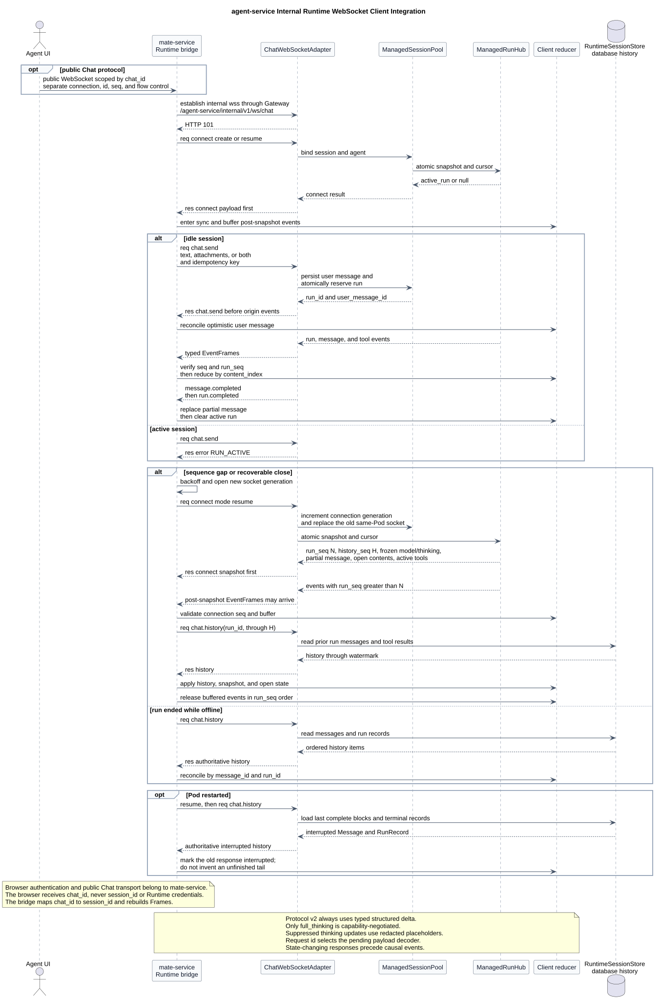

# CampusAgent Chat WebSocket v2 客户端接入指南

| 属性 | 值 |
|---|---|
| 文档版本 | 1.2.0 |
| 状态 | 目标协议接入指南，Java 尚未实现 |
| 更新日期 | 2026-08-03 |
| 协议号 | 2 |
| 规范性 Schema | [`chat-ws-v2.asyncapi.yaml`](chat-ws-v2.asyncapi.yaml)，2.6.0 |
| Manager 设计 | [`README.md`](README.md)，1.8.0 |
| pi-mono-java 基线 | `1f7a5423219edfa4519d8719f1cc8a188ed72873` |

## 1. 先确定谁连接 Runtime

CampusAgent 是 Agent Runtime。直接连接
`wss://api.example.com/agent-service/v1/ws/chat` 的客户端只能是
`mate-service`、其他已授权服务端调用方或服务端 SDK，不是最终
用户浏览器。

```text
browser UI
  -> mate-service
     -> CampusAgent Runtime WebSocket
```

opening handshake 在返回 `101` 前使用公司既有内部网关私钥/JWT
认证能力。本文只规定可观察行为，不复制私有 Header 或 claim；调用方
必须使用公司现有网关客户端生成认证上下文，不得传输私钥原文。
浏览器与 `mate-service` 之间的认证、URL 和协议另行定义，不属于
本规范。

因此，若交付对象是浏览器前端团队，`mate-service` 还必须另外发布“浏览器 URL、
Cookie/Token、Origin、附件上传和 Frame 是否原样透传”的接口文档。缺少该制品
时，Runtime 文档只能指导服务端接入和 UI reducer，不能声称浏览器已经可以
直接联调。

本文后续把直接连接 Runtime 的上层服务或 SDK 统一称为“客户端”。

## 2. 客户端需要实现什么

一个可用的 v2 客户端至少维护以下状态：

```text
connection
  local socket generation
  connection_id
  server connection_generation
  next expected EventFrame.seq
  pending RequestFrame map: id -> method/decoder/promise

session
  session_id
  agent_id
  effective model
  effective thinking level
  methods/events/capabilities

active run
  run_id
  next expected run_seq
  partial messages by message_id
  content blocks by content_index
  active tools by tool_call_id
```

客户端状态机为：

```text
DISCONNECTED
  -> SOCKET_CONNECTING
  -> APP_CONNECTING
  -> SYNCING
  -> READY_IDLE | READY_RUNNING
  -> RECOVERING
  -> CLOSED_FATAL
```

- WebSocket `open` 只进入 `APP_CONNECTING`，还不能发送 Chat 命令；
- `connect` 成功响应写出后进入 `SYNCING`；active run 存在时，先缓冲
  post-snapshot 事件，按快照 `history_seq` 同步已持久化历史，再应用
  partial Message/open contents/active tools，最后释放缓冲事件；
- 快照应用完成后，根据 `active_run` 进入 `READY_IDLE` 或 `READY_RUNNING`；
- 可恢复断线进入 `RECOVERING`；认证永久失败或协议不兼容进入
  `CLOSED_FATAL`；
- 每次新建物理连接都增加本地 socket generation，旧连接迟到的 callback
  必须忽略。



[PlantUML 源码：`frontend_websocket_client_integration`](diagram.puml#L592)

## 3. 最短可运行流程

### 3.1 建立安全 WebSocket

客户端把以下 URI 交给公司现有内部网关 WebSocket 客户端：

```text
wss://api.example.com/agent-service/v1/ws/chat
```

其中 `/agent-service` 是 Gateway 路由前缀，`/v1` 是服务 API 版本，
`/ws/chat` 是 Chat WebSocket 通道。这与首帧协商的 Frame
`protocol: 2` 不是同一个版本号。

以下为行为级伪代码。`internalGateway` 代表公司已有客户端，不是本文
新定义的 SDK：

```ts
const socket = await internalGateway.openWebSocket({
  url: "wss://api.example.com/agent-service/v1/ws/chat",
  audience: "agent-service",
});
```

客户端库建立 TCP/TLS 连接并执行 HTTP WebSocket opening handshake。服务端
返回 HTTP `101 Switching Protocols` 后，WebSocket 才正式建立。`101` 只表示
传输建立，不表示 Runtime Session 已经创建或恢复。

握手失败发生在 `101` 之前，使用 HTTP 状态表达：

| HTTP 状态 | 含义 | 客户端动作 |
|---|---|---|
| `400` | opening handshake 或 URL 不合法 | 修复请求，不自动热重试 |
| `401` | 内部网关认证上下文无效或过期 | 按既有网关客户端流程刷新后重试 |
| `403` | 调用服务无权访问 `agent-service` | 停止重试并修复授权 |
| `426` | 请求不是受支持的 WebSocket Upgrade | 修复代理或客户端配置 |

### 3.2 首帧创建 Session

收到 WebSocket `open` 后五秒内发送一个 UTF-8 Text Message，其中只包含以下
JSON RequestFrame：

```json
{
  "type": "req",
  "id": "connect-1",
  "method": "connect",
  "params": {
    "mode": "create",
    "min_protocol": 2,
    "max_protocol": 2,
    "session_id": "01ARZ3NDEKTSV4RRFFQ69G5FAV",
    "agent_id": "agent-a",
    "model_id": "model-a",
    "client": {
      "id": "mate-service",
      "version": "1.0.0",
      "platform": "service"
    }
  }
}
```

`session_id` 由上层会话服务提前生成，推荐 UUIDv7 或 ULID。`mode=create` 必须
提供 `session_id + agent_id + model_id`。结构化 typed delta 是协议 2 的固定
消息语义，客户端无需为 typed delta 声明 capability。

连接成功响应为：

```json
{
  "type": "res",
  "id": "connect-1",
  "ok": true,
  "payload": {
    "protocol": 2,
    "connection_id": "conn-01",
    "connection_generation": 1,
    "agent_id": "agent-a",
    "session_id": "01ARZ3NDEKTSV4RRFFQ69G5FAV",
    "model": {
      "model_id": "model-a",
      "name": "Model A",
      "reasoning": true,
      "input": {
        "modalities": ["text", "image", "document"],
        "attachment_media_types": [
          "image/png",
          "image/jpeg",
          "application/pdf",
          "text/plain"
        ],
        "max_attachments": 10,
        "max_attachment_bytes": 20971520,
        "max_total_attachment_bytes": 52428800
      }
    },
    "session": {
      "state": "idle",
      "thinking": "hidden"
    },
    "limits": {
      "max_message_bytes": 1048576,
      "max_connection_buffer_bytes": 4194304,
      "heartbeat_seconds": 20,
      "pong_timeout_seconds": 10,
      "connect_timeout_seconds": 5
    },
    "features": {
      "methods": [
        "chat.send",
        "chat.steer",
        "chat.abort",
        "chat.history",
        "session.get",
        "models.list",
        "model.set",
        "thinking.set"
      ],
      "events": [
        "run.started",
        "message.started",
        "message.updated",
        "tool.started",
        "tool.updated",
        "tool.completed",
        "message.completed",
        "run.completed"
      ],
      "capabilities": []
    },
    "active_run": null
  }
}
```

客户端必须检查：

1. ResponseFrame `id` 等于 `connect-1`；
2. `ok=true`；
3. `protocol=2`；
4. 返回的 `agent_id/session_id` 与请求一致；
5. `features.methods` 包含准备调用的方法，并且必须包含恢复所需的
   `chat.history`；
6. `features.events` 按规范顺序包含全部八类 Chat 事件；它是不可拆分的
   协议集合，缺少 `message.completed` 或 `run.completed` 时必须终止连接；
7. `model.input` 至少包含 text；上传前按 MIME、数量、单文件和总字节上限
   预检，但不把客户端预检当作 Runtime 授权；
8. `session.state=idle` 当且仅当 `active_run=null`。

connect 成功前不得发送其他 RequestFrame。connect 失败后，这条未绑定连接会
关闭；客户端不能继续复用它。

### 3.3 发送用户消息

创建一个新的 RequestFrame `id` 和一个可跨重连复用的 `idempotency_key`：

```json
{
  "type": "req",
  "id": "send-1",
  "method": "chat.send",
  "params": {
    "message": "查询订单 20260730001",
    "attachment_ids": [],
    "idempotency_key": "6f46bc26-8a14-4d63-b7b1-8f1f933a0d50"
  }
}
```

另外两种合法形态是仅附件和文字加附件：

```json
{
  "type": "req",
  "id": "send-attachments-only-1",
  "method": "chat.send",
  "params": {
    "attachment_ids": ["attachment-01"],
    "idempotency_key": "b6f3c75f-6c66-4b30-830b-98094365cf84"
  }
}
```

```json
{
  "type": "req",
  "id": "send-text-attachments-1",
  "method": "chat.send",
  "params": {
    "message": "分析附件中的订单数据",
    "attachment_ids": ["attachment-01"],
    "idempotency_key": "78230de7-7f45-454e-955a-61009bc207e0"
  }
}
```

`message` 省略或为空字符串时，`attachment_ids` 必须非空；二者同时为空
返回 `INVALID_REQUEST`。仅附件消息不生成隐藏默认 Prompt。

服务端原子完成“持久化用户消息、分配 run、占用 active-run”后，先向发起连接
发送成功 ResponseFrame：

```json
{
  "type": "res",
  "id": "send-1",
  "ok": true,
  "payload": {
    "run_id": "run-01",
    "user_message_id": "message-user-01",
    "accepted": true
  }
}
```

客户端可以先用临时 ID 乐观展示用户消息，收到响应后必须用
`user_message_id` 替换临时 ID。同一 `idempotency_key` 的等价重试返回相同
`run_id + user_message_id`。

`chat.send` 成功 ResponseFrame 保证先于该 run 的 `run.started`。同样，
所有会改变 Session/run 状态的成功 ResponseFrame 都先于由该请求引起的
EventFrame。同 Pod 中一个 Session 只有一个活动读写连接，没有观察
连接的排序例外。

### 3.4 消费一次完整文本回答

最小无工具回答的事件顺序如下。每一行都是一个独立 WebSocket Text Message：

```jsonl
{"type":"event","event":"run.started","seq":1,"payload":{"agent_id":"agent-a","session_id":"01ARZ3NDEKTSV4RRFFQ69G5FAV","run_id":"run-01","run_seq":1,"timestamp":"2026-07-30T08:00:00Z","model_id":"model-a","thinking":"hidden"}}
{"type":"event","event":"message.started","seq":2,"payload":{"agent_id":"agent-a","session_id":"01ARZ3NDEKTSV4RRFFQ69G5FAV","run_id":"run-01","message_id":"message-01","run_seq":2,"timestamp":"2026-07-30T08:00:00Z","role":"assistant"}}
{"type":"event","event":"message.updated","seq":3,"payload":{"agent_id":"agent-a","session_id":"01ARZ3NDEKTSV4RRFFQ69G5FAV","run_id":"run-01","message_id":"message-01","run_seq":3,"content_index":0,"timestamp":"2026-07-30T08:00:01Z","update":{"type":"text_start"}}}
{"type":"event","event":"message.updated","seq":4,"payload":{"agent_id":"agent-a","session_id":"01ARZ3NDEKTSV4RRFFQ69G5FAV","run_id":"run-01","message_id":"message-01","run_seq":4,"content_index":0,"timestamp":"2026-07-30T08:00:01Z","update":{"type":"text_delta","delta":"订单已发货"}}}
{"type":"event","event":"message.updated","seq":5,"payload":{"agent_id":"agent-a","session_id":"01ARZ3NDEKTSV4RRFFQ69G5FAV","run_id":"run-01","message_id":"message-01","run_seq":5,"content_index":0,"timestamp":"2026-07-30T08:00:02Z","update":{"type":"text_end"}}}
{"type":"event","event":"message.completed","seq":6,"payload":{"agent_id":"agent-a","session_id":"01ARZ3NDEKTSV4RRFFQ69G5FAV","run_id":"run-01","message_id":"message-01","run_seq":6,"timestamp":"2026-07-30T08:00:02Z","message":{"message_id":"message-01","role":"assistant","status":"completed","content":[{"type":"text","text":"订单已发货"}],"created_at":"2026-07-30T08:00:00Z","completed_at":"2026-07-30T08:00:02Z"}}}
{"type":"event","event":"run.completed","seq":7,"payload":{"agent_id":"agent-a","session_id":"01ARZ3NDEKTSV4RRFFQ69G5FAV","run_id":"run-01","run_seq":7,"timestamp":"2026-07-30T08:00:03Z","outcome":"done","stop_reason":"stop","usage":{"input_tokens":230,"output_tokens":48,"total_tokens":278}}}
```

客户端看到 `run.completed` 后清除 active run，并进入 `READY_IDLE`。

## 4. Frame dispatcher

三类 Frame 的职责固定：

```text
RequestFrame  = {type:"req", id, method, params?, traceparent?}
ResponseFrame = {type:"res", id, ok, payload? | error?}
EventFrame    = {type:"event", event, seq, payload}
```

ResponseFrame 没有 `method`。客户端发送请求时，必须把 method 和预期 payload
decoder 保存到 pending map，再根据响应 `id` 找回：

```ts
type PendingRequest = {
  method: string;
  decodePayload: (value: unknown) => unknown;
  resolve: (value: unknown) => void;
  reject: (error: unknown) => void;
};

const pending = new Map<string, PendingRequest>();

function onTextMessage(raw: string, socketGeneration: number) {
  if (socketGeneration !== currentSocketGeneration) return;

  const frame = JSON.parse(raw) as { type: string };
  if (frame.type === "res") {
    const response = frame as ResponseFrame;
    const request = pending.get(response.id);
    if (!request) return protocolFailure("unknown response id");
    pending.delete(response.id);

    if (!response.ok) {
      request.reject(response.error);
      return;
    }
    request.resolve(request.decodePayload(response.payload));
    return;
  }

  if (frame.type === "event") {
    applyEventFrame(frame as EventFrame);
    return;
  }

  protocolFailure("server sent an unexpected frame type");
}
```

约束：

- RequestFrame `id` 在一个物理连接的整个生命周期内唯一；
- connect 成功后可以并发发送多个普通请求；
- ResponseFrame 可以乱序，也可以与 EventFrame 交错；
- ResponseFrame 不占用 `seq`；
- Request 超时不等于服务端没有执行；有副作用请求必须用新 request `id` 和原
  `idempotency_key` 重试。

AsyncAPI 的 `x-method-contracts` 给出 method 到成功 payload Schema 的规范映射。
这是 CampusAgent 扩展：通用 AsyncAPI 生成器只能生成 Frame `oneOf`，要生成
强类型 request 方法，必须使用理解该扩展的模板，或在 SDK 中手工保留
method -> decoder 映射。

## 5. Message reducer

### 5.1 顺序检查必须先于内容归并

连接级 `seq`：

- 新连接第一条 EventFrame 从 `1` 开始；
- 每成功写出一条 EventFrame 恰好增加 `1`；
- 重连后重新从 `1` 开始。

Run 级 `run_seq`：

- `run.started` 从 `1` 开始；
- 同一 run 的 Message 和 Tool 事件共用一条连续序列；
- 跨重连继续，不重新开始；
- 序列属于 canonical run 事件，不因当前连接的 thinking 投影而变化；
- 某条 canonical thinking 更新被当前连接抑制时，服务端在同一
  `run_seq` 位置发送 `thinking_redacted`，不让 hidden/summary 投影出现假缺口。

同一实时连接出现重复、倒退或缺口时，客户端必须停止应用事件并进入
`RECOVERING`，不能猜测缺失文本。恢复快照已经包含 `run_seq=N` 时，初始排流
阶段忽略 `run_seq<=N`，只接受 `N+1`；进入实时阶段后继续要求逐一递增。

```ts
function verifyOrder(event: EventFrame) {
  if (event.seq !== expectedConnectionSeq) throw new RecoverableGap();
  expectedConnectionSeq += 1;

  const runId = event.payload.run_id;
  const expected = expectedRunSeq.get(runId) ?? 1;
  if (event.payload.run_seq !== expected) throw new RecoverableGap();
  expectedRunSeq.set(runId, expected + 1);
}
```

### 5.2 `content_index` 归并规则

`content_index` 是最终 `message.content[]` 的位置。不同位置可以交错更新；每个
位置必须独立遵循对应生命周期：

| update.type | 客户端动作 |
|---|---|
| `text_start` | 在 `content_index` 创建 `{type:"text", text:""}` |
| `text_delta` | 把本帧 `delta` 追加到该文本块 |
| `text_end` | 把该文本块标记为 closed |
| `thinking_start` | 按 `disclosure` 创建 Thinking 块并记录活动状态；hidden 只创建无 `text` 占位，不创建正文 |
| `thinking_delta` | 只在有效 `full_thinking` 下追加原始 thinking |
| `thinking_summary` | 每块最多一次；用 Manager 提供的完整安全摘要替换当前值，不追加、不自行推导 |
| `thinking_redacted` | 只推进序列，不创建或更改可见正文 |
| `thinking_end` | 结束 thinking 活动状态 |
| `toolcall_start` | 创建 ToolCall 块和空的参数文本缓冲 |
| `toolcall_delta` | 追加 JSON 文本片段，不逐帧解析 |
| `toolcall_end` | 以 `arguments` 的脱敏投影收束；`truncated=false` 时用 `value` 完整对象覆盖参数片段，`truncated=true` 时只展示 preview/size/ref |

`message.completed.payload.message` 是权威终态。客户端必须按 `message_id`
整体替换本地 partial Message，而不是再追加一条消息。外层
`payload.message_id` 必须等于内层 `message.message_id`。
为保持 `content_index` 稳定，hidden thinking 在完整 Message 中保留
`{"type":"thinking","disclosure":"hidden"}` 占位块，但绝不包含 `text`；
后续可见文本不会因投影而从 index 1 前移到 index 0。

一个 run 可以产生多个 Assistant Message，例如模型生成 ToolCall、工具执行、
模型继续生成最终回答。每个 Message 都有独立的
`message.started -> message.updated* -> message.completed` 生命周期；
`run.completed` 只出现一次，并且是整个 run 的最后一个事件。

### 5.3 ToolCall 与工具执行不是同一事件

Assistant Message 中的 `toolcall_*` 表示模型正在生成调用参数；
`tool.started/updated/completed` 表示 Tool Manager 实际执行。两条流使用相同
`tool_call_id` 关联：

```text
toolcall_start
  -> toolcall_delta*
  -> toolcall_end
  -> tool.started
  -> tool.updated*
  -> tool.completed
```

客户端用 `tool_call_id` 更新同一张工具卡片。`tool.completed` 的 result/error
负责执行状态；最终 `message.completed` 负责 Assistant Message 对账。
每个已收到 `tool.started` 的 `tool_call_id` 在 `run.completed` 前必须恰好
收到一次 `tool.completed`；run 中止时，尚在运行的 Tool 以
`status="aborted"` 收束，客户端不得在 run 结束后保留 running 工具卡。

Tool 事件返回脱敏后的业务 `parameters/progress/result`，不包含凭据、
内部 Header 或执行器秘密。若完整 result 超过 Frame 预算，客户端收到
截断预览、原始大小、`truncated=true` 和不透明 `result_ref`。v1 没有
读取 `result_ref` 的命令，因此 UI 只能将它作为审计/支持标识展示，
不得拼接为下载 URL。

## 6. Thinking 配置

结构化 delta 是 v2 基线，不是 capability。当前唯一已知的可选 capability 是
`full_thinking`。

普通客户端省略 `capabilities` 或发送空数组：

```json
{"capabilities": []}
```

能够安全展示原始 thinking 的客户端在 connect 中声明：

```json
{"capabilities": ["full_thinking"]}
```

随后必须检查 connect 响应：

```json
{"features": {"capabilities": ["full_thinking"]}}
```

只有服务端有效结果包含该值时，客户端才可以展示 `full` 选项或处理
`thinking_delta`。声明 capability 不会自动把 Session 级别设为 `full`；还需
通过 `thinking.set` 设置，并同时满足调用服务 scope、Agent、Model 和委托上限。

```json
{
  "type": "req",
  "id": "thinking-1",
  "method": "thinking.set",
  "params": {"level": "full"}
}
```

如果有效 capability 不包含 `full_thinking`，该请求返回 `FORBIDDEN`，服务端
不静默降级。`chat.send.params.thinking` 省略时继承当前 Session 默认值；显式
值只能降低，不能提升。

每个 Thinking 块的客户端状态机固定为：

```text
hidden:  thinking_start(hidden)  -> thinking_redacted* -> thinking_end
summary: thinking_start(summary) -> thinking_redacted(delta)*
                                  -> thinking_summary? -> thinking_end
full:    thinking_start(full)    -> thinking_delta*
                                  -> thinking_redacted(summary)? -> thinking_end
```

`thinking_summary?` 只在 Model Manager 提供安全摘要时出现，最多一次。
`thinking_redacted` 仅保留 canonical 事件的 `run_seq` 位置，不携带
原始 thinking 或摘要文本。summary 级别没有安全摘要时，UI 保留无正文
redacted 占位，不显示“正在总结”之类伪内容。
请求级别在 run 开始时冻结，当前唯一连接只能按有效 capability 继续降低；
恢复快照的 `thinking` 是当前连接应当使用的权威投影。

## 7. 其他基础命令

| method | 主要参数 | 成功 payload | 关键状态约束 |
|---|---|---|---|
| `chat.send` | message?、attachment_ids?、idempotency_key、thinking? | run_id、user_message_id、accepted | 文字/附件不能同时为空；active run 存在时返回 `RUN_ACTIVE` |
| `chat.steer` | run_id、非空文本 message、idempotency_key | run_id、user_message_id、accepted、idempotent | v1 不接受附件；只操作当前 active run |
| `chat.abort` | run_id、idempotency_key | run_id、accepted、idempotent | 显式停止；重复调用幂等 |
| `chat.history` | cursor?、limit?、run_id?、through_history_seq? | items、next_cursor?、has_more | 返回权威持久历史；run/水位过滤用于恢复 |
| `session.get` | 无 | Session、Model、active_run | 读取当前权威状态 |
| `models.list` | 无 | models、effective_model_id | 只返回当前 Agent 可用模型 |
| `model.set` | model_id | model | active run 期间拒绝；目标模型不兼容当前有效 transcript 的附件 plan 时返回 ATTACHMENT_NOT_SUPPORTED 并保持原模型 |
| `thinking.set` | level | thinking | active run 期间拒绝；full 还需 capability |

Chat Frame 不提供 `prompt_templates.list` 或 `skills.list`。Skill 展示信息由
`mate-service`/元数据 REST 提供；`chat.send.message` 中的 `/skill:<name>`
仍由 AgentSession 展开。

Steer 示例：

```jsonl
{"type":"req","id":"steer-1","method":"chat.steer","params":{"run_id":"run-01","message":"优先给出物流状态","idempotency_key":"steer-6f46bc26"}}
{"type":"res","id":"steer-1","ok":true,"payload":{"run_id":"run-01","user_message_id":"message-user-02","accepted":true,"idempotent":false}}
```

Abort 示例：

```jsonl
{"type":"req","id":"abort-1","method":"chat.abort","params":{"run_id":"run-01","idempotency_key":"abort-6f46bc26"}}
{"type":"res","id":"abort-1","ok":true,"payload":{"run_id":"run-01","accepted":true,"idempotent":false}}
```

成功 Response 只表示命令已经接受。run 的最终结果仍以
`run.completed(outcome=done|aborted|error|interrupted)` 为准。`interrupted` 表示
Pod 重启等进程故障已使原 run 无法继续，不是可在同一 run 上重试的状态。

## 8. 权威历史

不带 cursor 的 `chat.history` 返回查询时刻最新一页：

```json
{"type":"req","id":"history-1","method":"chat.history","params":{"limit":50}}
```

响应中的 `items` 是 `RuntimeSessionStore` 数据库权威投影，同时包含
Message 和 run 终态，并按 `history_seq` 从旧到新排列：

```json
{
  "type": "res",
  "id": "history-1",
  "ok": true,
  "payload": {
    "items": [
      {
        "type": "message",
        "history_seq": 21,
        "run_id": "run-01",
        "message": {
          "message_id": "message-01",
          "role": "assistant",
          "status": "completed",
          "content": [{"type": "text", "text": "订单已发货"}],
          "created_at": "2026-07-30T08:00:00Z",
          "completed_at": "2026-07-30T08:00:02Z"
        }
      },
      {
        "type": "run",
        "history_seq": 22,
        "run": {
          "run_id": "run-01",
          "outcome": "done",
          "completed_at": "2026-07-30T08:00:03Z"
        }
      }
    ],
    "has_more": false
  }
}
```

- `has_more=true` 时必须携带不透明 `next_cursor`；`has_more=false` 时不得
  携带 cursor；
- cursor 固定首次查询的上界，并发新增记录不会使已开始的分页重叠或漏项；
- 首页可用 `run_id` 只读取一个 run，用 `through_history_seq` 设置包含性
  持久化上界；后续页仅传服务端返回的 cursor；
- 每页内部从旧到新；不同页合并时仍按 `history_seq` 排序；
- Message 按 `message_id` 去重，run 记录按 `run_id` 去重，较新的权威投影覆盖
  本地状态。
- Message `status` 和 RunRecord `outcome` 可为 `interrupted`；这是 Pod 重启后
  的权威终态，客户端应标记“回答被中断”并允许用户新建 `chat.send`，
  不要把它改写为 completed。

## 9. 断线恢复

WebSocket Close 不等于 Abort。普通网络断开时，同 Pod 内 Runtime 只取消
当前连接订阅，active run 继续。若希望停止 run，客户端必须先调用
`chat.abort` 并等待接受响应。

### 9.1 恢复连接

新连接完成 Upgrade 后发送：

```json
{
  "type": "req",
  "id": "connect-resume-1",
  "method": "connect",
  "params": {
    "mode": "resume",
    "min_protocol": 2,
    "max_protocol": 2,
    "session_id": "01ARZ3NDEKTSV4RRFFQ69G5FAV",
    "agent_id": "agent-a",
    "client": {
      "id": "mate-service",
      "version": "1.0.0",
      "platform": "service"
    }
  }
}
```

客户端不提交旧连接的 `seq` 或 `run_seq`。同 Pod 服务端原子递增
`connection_generation`、接管该 Session 唯一读写连接并捕获恢复点。
connect 响应中返回新 generation 与 active-run 快照：

```json
{
  "connection_generation": 2,
  "active_run": {
    "run_id": "run-01",
    "run_seq": 14,
    "history_seq": 41,
    "model_id": "model-a",
    "thinking": "hidden",
    "message_snapshot": {
      "message_id": "message-01",
      "role": "assistant",
      "status": "streaming",
      "content": [{"type": "text", "text": "订单当前状态为"}],
      "created_at": "2026-07-30T08:00:00Z"
    },
    "open_contents": {
      "0": {"type": "text"}
    },
    "active_tools": []
  }
}
```

新 connect Response 成功后，旧 generation 会收到私有关闭语义
`4409 SESSION_REPLACED`。旧 socket 必须停止发送；本地以 socket generation 拒绝它的
迟到 callback。本协议不支持多观察连接。

恢复算法：

1. 清空旧连接的 connection `seq`，新连接期待 `seq=1`；connect Response
   之后可能立即到达 EventFrame，先校验其 connection seq 并放入同步缓冲，
   不立即归并 UI；
2. 记录快照的 `run_seq=N`、`history_seq=H`、`model_id` 和有效
   `thinking`；
3. 发送 `chat.history` 首页：

   ```json
   {"type":"req","id":"history-sync-1","method":"chat.history","params":{"run_id":"run-01","through_history_seq":41,"limit":200}}
   ```

   按 cursor 读完该过滤历史，用其恢复用户消息、已完成 Assistant Message
   和 ToolResult；
4. 用 `message_snapshot` 整体替换当前 active Message；它可以为 `null`，
   表示 run 已开始但 Assistant Message 尚未开始；
5. `open_contents` 是以十进制 `content_index` 字符串为 key 的对象；用它
   初始化已 start、尚未 end 的内容块。开放 ToolCall 的
   `arguments_delta` 只是累计文本，不能提前解析；
6. 用 `active_tools` 整体替换工具执行状态；
7. 历史、partial Message、开放块和 active tools 都应用完成后，再按
   `run_seq` 释放同步缓冲；忽略 `run_seq<=N` 的初始重复，只接受
   `N+1`，后续逐一递增；
8. 发现任何缺口，丢弃本次同步结果并再次恢复。

若 `active_run=null`，但本地此前认为 run 未终止，立即调用 `chat.history`，用
数据库权威 Message 和 RunRecord 对账。不要凭 `active_run=null` 推断旧
run 一定成功，因为它也可能 aborted、error 或 `interrupted`。
其中 Pod 重启中断使用 `RunRecord.outcome=interrupted` 和
`RunRecord.error.code=RUN_INTERRUPTED` 投影。`RUN_INTERRUPTED` 是 history 中的
结构化终态原因，不是 RequestFrame 的 `Error.code`，客户端不应重试
原 `run_id`。

多副本 v1 依赖可信网关按最终用户 IP 粘性路由，不使用 Redis、
Session Header 或跨 Pod 转发。如果网关只看到 `mate-service`/NAT IP、
用户 IP 变化或 Pod 重启，active run 不能跨 Pod 继续。Pod 重启后 Runtime
从数据库重建 Session/Agent，旧 active RunRecord 和已持久完整内容块以
`interrupted` 对外可见；未到 `text_end` 等 end 边界的尾部不承诺保存。

### 9.2 `connect mode=create` 响应丢失

若物理连接在发送 create 后、收到 connect Response 前断开，客户端不知道
Session 是否已经提交。客户端必须建立新连接，用新 RequestFrame `id`
和完全相同的 `session_id + agent_id + model_id` 重试 `mode=create`。
服务端对相同绑定返回同一 Session；不同绑定拒绝。不要直接改用
`mode=resume`，因为原 create 若尚未提交，resume 会正常返回
`SESSION_NOT_FOUND`。

### 9.3 `chat.send` 响应丢失

若连接在发送请求后、收到 Response 前断开：

1. 先用 `mode=resume` 恢复 Session；
2. 使用新的 RequestFrame `id`；
3. 使用原 `idempotency_key` 和完全相同的业务负载重新发送；
4. 服务端返回原 `run_id + user_message_id`，即使原 run 当前仍 active，也不
   返回 `RUN_ACTIVE`。

`traceparent` 和 RequestFrame `id` 不参与幂等负载比较；message、附件 ID 的
顺序和值、thinking 是否省略及其值都参与。

## 10. 错误与关闭处理

业务请求校验失败使用 `ok=false`：

```json
{
  "type": "res",
  "id": "send-2",
  "ok": false,
  "error": {
    "code": "RUN_ACTIVE",
    "message": "当前 Session 已存在 active run。",
    "retryable": true
  }
}
```

- `ok=false` 表示该请求没有创建新的 run；
- 请求已接受后的模型或工具失败通过
  `run.completed(outcome="error")` 表达，不再补发失败 Response；
- `retryable` 省略等价于 `false`；
- `retry_after_ms` 只在 `retryable=true` 时有效；
- 客户端必须为未知 `error.code` 保留通用分支。
- `error.details` 是脱敏且有界的诊断投影；不得按固定内部 Header、凭据
  或 Manager 原始响应结构解析。

常见业务错误处理：

| code | 客户端动作 |
|---|---|
| `INVALID_REQUEST` | 修复字段或状态，不原样重试 |
| `FORBIDDEN` | 隐藏无权限功能并修复授权 |
| `RUN_ACTIVE` | 等待终态，或对返回/已知 run 执行 steer/abort |
| `RUN_NOT_FOUND` | 调用 `session.get` 或 `chat.history` 对账 |
| `INVALID_ATTACHMENT` | 重新上传或重新绑定附件 |
| `ATTACHMENT_NOT_READY` | 按 retry_after_ms 等待上层处理为 READY，再以相同业务负载重试 |
| `ATTACHMENT_NOT_SUPPORTED` | 按当前 ModelSummary.input 更换附件或 Model |
| `MODEL_NOT_ALLOWED` | 调用 `models.list` 后重新选择 |
| `MANAGER_UNAVAILABLE` | 仅在 retryable 时按 retry_after_ms 重试 |

WebSocket Close 处理：

| close code | 客户端动作 |
|---|---|
| `1000` | 正常关闭，默认不自动重连 |
| `1001` | 服务端关闭或心跳超时，退避后 resume |
| `1002` | 协议不兼容，停止重试并升级客户端 |
| `1003` | 客户端错误发送 Binary Message，改为 Text Message |
| `1007` | UTF-8 或 JSON 不合法，修复编码 |
| `1008` | connect 超时或策略错误，修复请求/授权 |
| `1009` | 完整 Message 超过上限，缩小请求 |
| `1011` | 暂时性服务端错误，退避后 resume |
| `1013` | 客户端消费过慢，退避后 resume 并应用快照 |
| 本地观察到 `1006` | 异常断开，退避后 resume；该值不会在线上发送 |
| `4409 SESSION_REPLACED` | 新 generation 已接管；立即停止旧 socket 写入并忽略迟到 callback |

推荐可恢复断线从 500ms 开始做带抖动的指数退避，上限 30s；这是客户端重连
策略，不改变 Session/run 语义。

## 11. Wire、大小和心跳

- 一个完整 WebSocket Text Message 恰好包含一个 JSON Frame；
- 文本编码固定为 UTF-8；Binary Message 使用 `1003` 关闭；
- 非法 UTF-8 或 JSON 使用 `1007` 关闭，此时通常没有可关联 request `id`，
  服务端不发送 ErrorResponseFrame；
- WebSocket fragmentation 允许由协议库透明处理；大小在解压并重组完整 Text
  Message 后按 UTF-8 JSON 字节计算；
- 客户端在发送前应测量 `JSON.stringify(frame)` 的 UTF-8 字节数，并遵守
  `limits.max_message_bytes`；Schema 的字符长度不是最终字节限制；
- 服务端默认每 20 秒发送原生 WebSocket Ping，客户端库应自动回复 Pong；10
  秒内未收到 Pong 时服务端关闭连接，run 继续；
- 不发送应用层 JSON `ping/pong`。

服务端不静默丢弃 `message.updated`。连接缓冲达到上限时使用 `1013` 关闭当前
订阅，客户端通过快照恢复。

## 12. 附件

### 12.1 先上传，再发送引用

CampusAgent Runtime WebSocket 不上传二进制内容。Attachment Service 由
`mate-service` 承载；调用方必须先通过它
完成上传、扫描、最终用户归属和 Session 绑定，再把 `attachment_ids[]` 放入
`chat.send`：

```text
select file
  -> create upload intent for session_id
  -> HTTP multipart upload or Object Storage direct upload
  -> finalize upload
  -> poll or subscribe until READY
  -> WebSocket chat.send with attachment_ids
```

本专题不定义 `mate-service` Attachment REST URL、Header 或鉴权契约，
`agent-service` 也不提供上传端点。`mate-service` 可以接收 HTTP multipart，
也可以发放预签名 URL 让客户端直传 Object Storage 再 finalize。
无论采用哪种上传方式，上层返回的资源状态至少遵循：

```text
UPLOADING -> PROCESSING -> READY
                  |          |
                  +-> BLOCKED+-> EXPIRED or DELETED
                  +-> FAILED
```

只有 `READY` 可以首次发送。上传响应可向 UI 展示 `attachment_id`、display name、
扫描后的 MIME、实际字节数和状态，但 `chat.send` 只提交 ID；不得把 URL、路径、
MIME、文件名、size、hash、凭据或 Base64 复制到 WebSocket Frame。

### 12.2 按有效 Model 输入策略预检

connect、`models.list` 和 `model.set` 返回同一种 `ModelSummary.input`。UI 在选择
或上传前检查：

- `modalities` 是否包含附件所需的 `image` 或 `document`；
- 扫描后的 MIME 是否在 `attachment_media_types`；
- 数量是否不超过 `max_attachments`；
- 单文件和总字节数是否分别不超过两个 byte limit。

这是用户体验预检，不是授权结论。Runtime 仍使用 Attachment Service 返回的
可信元数据重新检查；客户端文件扩展名和浏览器 `File.type` 都不可信。切换
Model 后必须按新的 ModelSummary 重新预检尚未发送的附件。

这些上限实际作用于下一次模型调用的完整 AttachmentContextPlan：当前有效
transcript 中仍会进入 Context 的历史附件，加上本次新附件。`models.list` 可以
列出 Agent 允许但不兼容当前历史的模型；调用 `model.set` 时 Runtime 会重新
计算 plan，不兼容则返回 `ATTACHMENT_NOT_SUPPORTED` 并保持原模型。新
`chat.send` 也会在 accepted 前检查“历史 + 新附件”。客户端不能通过换模型让
Runtime 静默忽略旧附件；需要显式创建分支或使用上层提供的 Context 压缩流程。

### 12.3 发送带附件的消息

选择 READY 附件后，保持现有字符串 `message` 线协议：

```json
{
  "type": "req",
  "id": "send-attachment-1",
  "method": "chat.send",
  "params": {
    "message": "分析附件中的订单数据",
    "attachment_ids": ["attachment-01"],
    "idempotency_key": "6f46bc26-8a14-4d63-b7b1-8f1f933a0d50"
  }
}
```

`attachment_ids` 省略等价于空数组；非空数组的顺序会成为用户 Message 中附件
块的顺序，并参与幂等负载比较。附件引用是协议 2 的标准可选字段，不需要声明
capability。当前版本只有 `chat.send` 接受附件，`chat.steer` 不接受。
仅附件时省略 `message` 或传空字符串；Runtime 不会为模型补隐藏文本。

Runtime 对全部 ID 做一次批量、保序、全有或全无解析。只有全部附件都已授权、
绑定当前 Session、处于 READY、固定为不可变内容版本，并符合当前 Model 输入
策略后，才会持久化用户 Message、分配 run 并返回：

```json
{
  "type": "res",
  "id": "send-attachment-1",
  "ok": true,
  "payload": {
    "run_id": "run-01",
    "user_message_id": "message-user-01",
    "accepted": true
  }
}
```

任一附件失败都不会建立部分 run。若 Response 丢失，建立新连接恢复后，使用新
RequestFrame `id`、原 `idempotency_key` 和完全相同的 message、附件 ID 顺序、
thinking 重新发送。已接受结果优先返回原 `run_id/user_message_id`，即使附件
此后过期或 run 仍 active；接受前错误不占用幂等键。

### 12.4 错误和 UI 动作

| code | UI/调用方动作 |
|---|---|
| `INVALID_ATTACHMENT` | 不区分不存在、无权、未绑定、删除或过期；移除引用并由上层重新上传/绑定，不能探测 ID |
| `ATTACHMENT_NOT_READY` | 保留选择，按 `retry_after_ms` 查询上层状态；只有 READY 后用原业务负载重试 |
| `ATTACHMENT_NOT_SUPPORTED` | 根据当前 ModelSummary 提示 MIME/数量/大小不支持；更换附件或 Model |
| `MANAGER_UNAVAILABLE` | 仅在 `retryable=true` 时退避；不得改为把 URL/Base64 内联发送 |

Runtime 已接受后若内容读取或 Provider 转换失败，不再返回请求错误；客户端会
收到 `run.completed(outcome="error")`，用户消息和附件历史仍保留。

### 12.5 历史和删除

`chat.history` 的 role=user Message 会返回接受时冻结的 AttachmentContent：

```json
{
  "message_id": "message-user-01",
  "role": "user",
  "status": "completed",
  "content": [
    {"type": "text", "text": "分析附件中的订单数据"},
    {
      "type": "attachment",
      "attachment_id": "attachment-01",
      "content_version": "version-01",
      "filename": "orders.pdf",
      "media_type": "application/pdf",
      "size_bytes": 182734,
      "sha256": "3b6f75a86ac2f94c6b20252a66f4d71a7b37b1f48e325ef1698025c813b31c5f"
    }
  ],
  "created_at": "2026-07-30T07:59:59Z",
  "completed_at": "2026-07-30T07:59:59Z"
}
```

用户 Message 的 `content` 只有三种形态：

```text
[TextContent]
[AttachmentContent, ...]
[TextContent, AttachmentContent, ...]
```

文本若存在必须是第一块且非空；附件块顺序与接受时
`attachment_ids` 一致。纯附件历史不包含空 TextContent。

客户端只把 filename 当作显示文本，不能当成本地路径。历史不会返回下载 URL、
read handle、对象存储 key 或 Provider file ID；需要下载时向上层 Attachment
Service 单独申请经过授权的短期下载能力。公开 `sha256` 始终对应原始不可变
内容；OCR、文本抽取或供应商上传等派生制品使用服务端内部的独立版本和摘要，
客户端不能用公开 sha256 校验不同的派生字节。

删除附件选择只影响尚未发送的草稿。已接受 Message 的内容版本至少保留到上层
删除整个 Session；归档/恢复不会释放。Session 删除通过独立控制面发起，不是
WebSocket `chat.send` 命令。紧急安全撤销会显式失败或中止后续 run，客户端
不得把被撤销附件静默从历史中删掉后重新生成不同答案。

## 13. 实现检查表

客户端交付前至少验证：

- WebSocket `open` 后先 connect，connect 成功前没有其他请求；
- `features.events` 不缺少任何一类基础 Chat 事件；
- `features.methods` 只包含规范的八个 Chat/Session/Model 方法，客户端不调用
  `prompt_templates.list` 或 `skills.list`；
- pending map 用 RequestFrame `id` 关联 method 和 payload decoder；
- 并发响应乱序和 EventFrame 插入不会破坏请求关联；
- `chat.send` 响应先建立 `run_id/user_message_id`，再处理 run 事件；所有改变
  Session/run 状态的成功 Response 均先于其因果 Event；
- 纯文字、纯附件、文字加附件三种 `chat.send` 均可发送，二者同空被
  本地阻止；`chat.steer` 只发送非空文本；
- typed delta 无需 capability，客户端没有累计 Message/replace 分支；
- `text/thinking/toolcall` 按 `message_id + content_index` 正确归并；
- hidden Thinking 保留无文本占位，summary 完整替换，被抑制更新只用
  `thinking_redacted` 推进 canonical `run_seq`；
- ToolCall 生成和 Tool 执行按 `tool_call_id` 对账；
- 每个 `tool.started` 在 run 终态前恰好收到一次 `tool.completed`；
- Tool 业务 parameters/result 按投影展示，不渲染凭据/内部 Header；
  `truncated=true` 时显示预览和大小，不尝试读取 `result_ref`；
- `message.completed` 权威替换 partial Message；
- `run.completed` 后清理 active run，且不接受该 run 的后续事件；
- `seq/run_seq` 重复、倒退和缺口都会触发恢复；
- snapshot 为 null、存在开放文本、开放 hidden thinking、开放 ToolCall 和 active
  Tool 的情况都能恢复；Model/Thinking 从快照获取，无需猜测；
- active snapshot 后先缓冲事件，用 `run_id + history_seq` 读完水位历史，
  再应用 partial 快照和释放缓冲；
- `active_run=null` 时能用 history 的 Message/RunRecord 对账；
- 新 resume 的 `connection_generation` 接管后，旧 socket 收到 `4409 SESSION_REPLACED`
  即停止写入，迟到 callback 被本地 generation 忽略；
- Pod 重启后能展示 `interrupted` Message/RunRecord，不假设未完整内容块尾部
  可恢复；客户端不假设 IP 粘性等于跨 Pod run owner；
- Request 超时使用新 request ID 和原 idempotency key；
- 上传状态未到 READY 时不发送；按 ModelSummary.input 预检 MIME、数量和字节，
  WebSocket 只提交 attachment_ids，不提交 URL、MIME、文件名、size 或 Base64；
- 带附件 send 的任一引用失败时不乐观显示为已接受；成功后按
  user_message_id 对齐带 AttachmentContent 的权威历史；
- `INVALID_ATTACHMENT` 不用于探测资源存在性，`ATTACHMENT_NOT_READY` 按建议
  间隔重试，`ATTACHMENT_NOT_SUPPORTED` 要求更换附件或 Model；
- model.set 遇到历史附件不兼容时保持原模型；chat.send 的预检包含有效历史与
  新附件，客户端不假设 Runtime 会为适配模型静默丢弃历史内容；
- 已接受附件的 Response 丢失时用原 ID 顺序和原幂等键重试，不重新上传或改写
  业务负载；历史 filename 只作显示，下载另走上层短期授权接口；
- create connect 响应丢失时用相同 Session/Agent/Model 重试 create，不改用
  resume；
- `full_thinking` 只有在有效 capability 回显后才进入 UI；
- 1001/1006/1011/1013 退避恢复，1002 停止重试；
- 浏览器只连接 `mate-service`；调用方使用既有内部网关客户端，
  任何凭据或私钥原文不进入 Frame、Prompt、数据库或日志。

## 14. 源码事实与目标设计

pi-mono-java 固定基线的当前行为是：

- `ServerMode` 从 Upgrade query 读取 `conversation_id`：
  [`ServerMode.java#L377-L391`](https://github.com/superheromeZzh/pi-mono-java/blob/1f7a5423219edfa4519d8719f1cc8a188ed72873/modules/coding-agent-cli/src/main/java/com/campusclaw/codingagent/mode/server/ServerMode.java#L377-L391)；
- `ChatWebSocketHandler` 使用 v1 命令并在断线时 abort：
  [`ChatWebSocketHandler.java#L168-L227`](https://github.com/superheromeZzh/pi-mono-java/blob/1f7a5423219edfa4519d8719f1cc8a188ed72873/modules/coding-agent-cli/src/main/java/com/campusclaw/codingagent/mode/server/ChatWebSocketHandler.java#L168-L227)；
- `message_update` 发送累计 Message，现有前端用新快照替换旧快照：
  [`ChatWebSocketHandler.java#L422-L459`](https://github.com/superheromeZzh/pi-mono-java/blob/1f7a5423219edfa4519d8719f1cc8a188ed72873/modules/coding-agent-cli/src/main/java/com/campusclaw/codingagent/mode/server/ChatWebSocketHandler.java#L422-L459)、
  [`useChatWs.ts#L439-L448`](https://github.com/superheromeZzh/pi-mono-java/blob/1f7a5423219edfa4519d8719f1cc8a188ed72873/frontend/src/composables/useChatWs.ts#L439-L448)；
- Java 内部已经提供 text/thinking/toolcall 细粒度事件：
  [`AssistantMessageEvent.java#L44-L164`](https://github.com/superheromeZzh/pi-mono-java/blob/1f7a5423219edfa4519d8719f1cc8a188ed72873/modules/ai/src/main/java/com/campusclaw/ai/stream/AssistantMessageEvent.java#L44-L164)；
- 当前 UserMessage 虽接受 ContentBlock 列表，但联合类型只有
  text/image/thinking/toolCall，ImageContent 保存 base64；固定基线没有通用
  attachment ID、不可变版本或读取租约：
  [`UserMessage.java#L20-L31`](https://github.com/superheromeZzh/pi-mono-java/blob/1f7a5423219edfa4519d8719f1cc8a188ed72873/modules/ai/src/main/java/com/campusclaw/ai/types/UserMessage.java#L20-L31)、
  [`ContentBlock.java#L17-L24`](https://github.com/superheromeZzh/pi-mono-java/blob/1f7a5423219edfa4519d8719f1cc8a188ed72873/modules/ai/src/main/java/com/campusclaw/ai/types/ContentBlock.java#L17-L24)、
  [`ImageContent.java#L9-L18`](https://github.com/superheromeZzh/pi-mono-java/blob/1f7a5423219edfa4519d8719f1cc8a188ed72873/modules/ai/src/main/java/com/campusclaw/ai/types/ImageContent.java#L9-L18)；
- 固定基线的 follow-up 文档把 WebSocket attachment input 列为待设计项：
  [`ws-chat-followups.md#L12-L37`](https://github.com/superheromeZzh/pi-mono-java/blob/1f7a5423219edfa4519d8719f1cc8a188ed72873/docs/plans/ws-chat-followups.md#L12-L37)。

本文全部 v2 交互都是目标设计，尚未实现。typed delta、`user_message_id`、
Session-scoped connect、run 独立生命周期、原子快照、历史 RunRecord、附件
解析/租约/输入装配属于架构改造；服务认证、凭据隔离、thinking 投影和附件
控制面/数据面边界属于安全加固。

## 15. 版本历史

| 版本 | 日期 | 变更 |
|---|---|---|
| 1.2.0 | 2026-08-03 | 统一 CampusAgent / agent-service 及规范 URL；将直连边界收窄为 mate-service/已授权服务端，认证复用既有内部网关；将方法集收敛为八个，补齐纯附件、text-only steer、Tool 脱敏/截断、Response-before-Event、单连接 generation 接管、数据库权威历史、IP 粘性限制和 Pod 重启 interrupted 恢复；同步 AsyncAPI 2.6.0 和 Manager 1.8.0 |
| 1.1.0 | 2026-08-03 | 增加可直接实施的附件上传状态机、完整 AttachmentContextPlan/Model 切换预检、仅 ID 的 chat.send、批量原子接受、错误动作、幂等重试、AttachmentContent 历史、source digest 与 Session 保留/删除说明；同步 AsyncAPI 2.5.0 和 Manager 1.7.0 |
| 1.0.0 | 2026-08-03 | 首版；给出客户端角色、建连、connect、chat.send、typed delta reducer、redacted thinking、命令、水位历史、快照恢复、错误、关闭码和 TypeScript dispatcher 的完整接入路径 |
