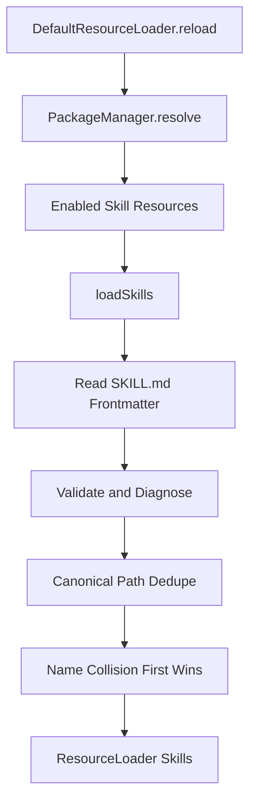
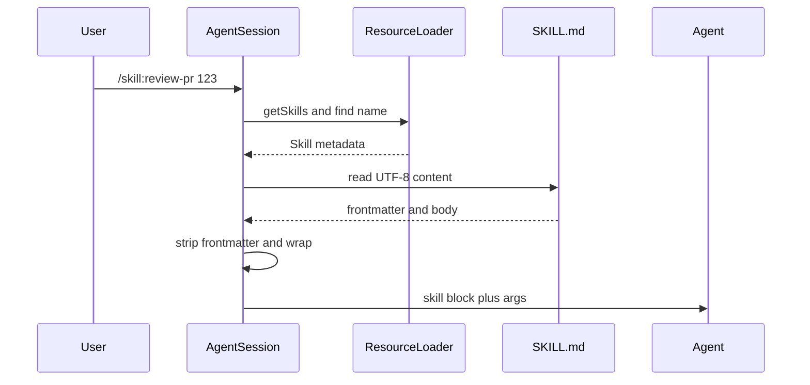
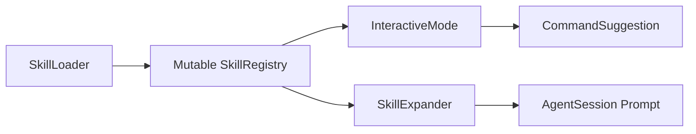
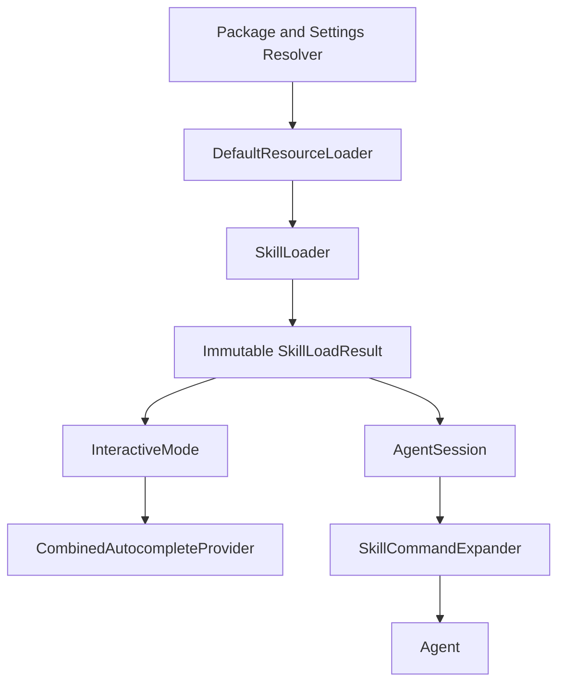
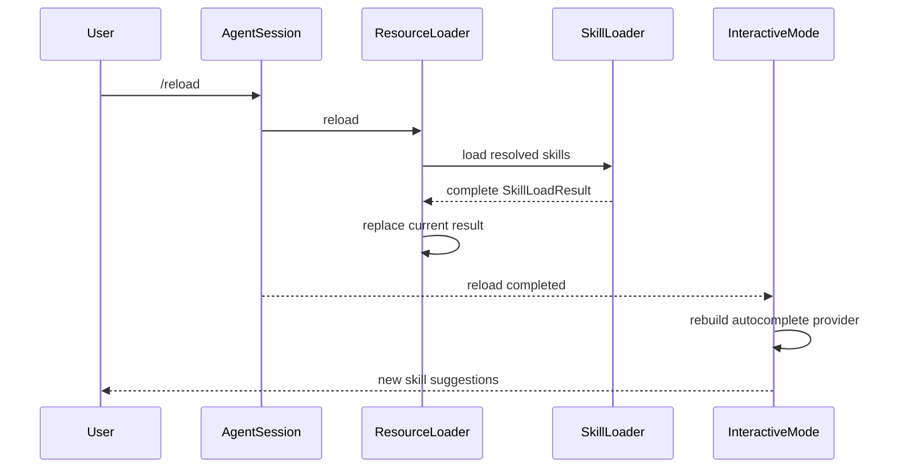
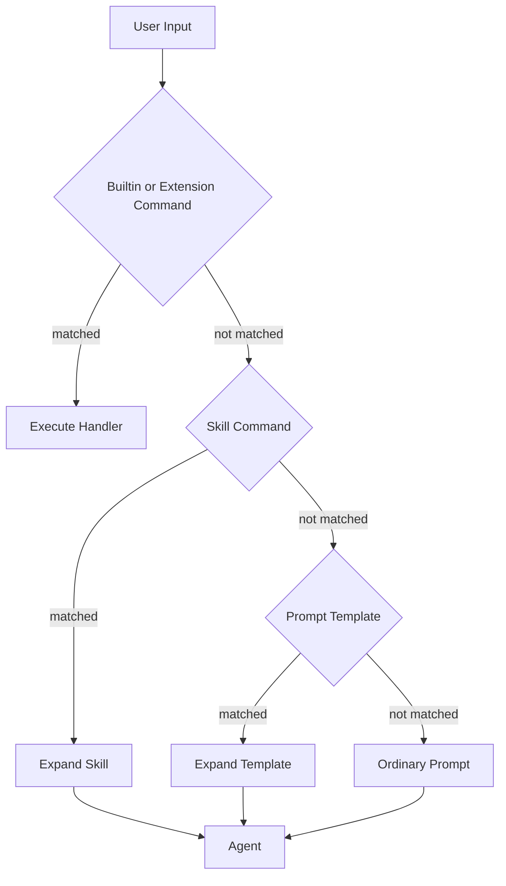
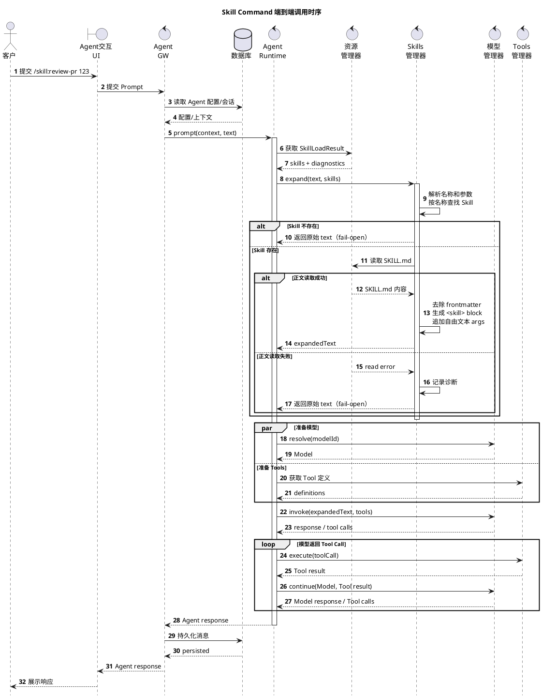
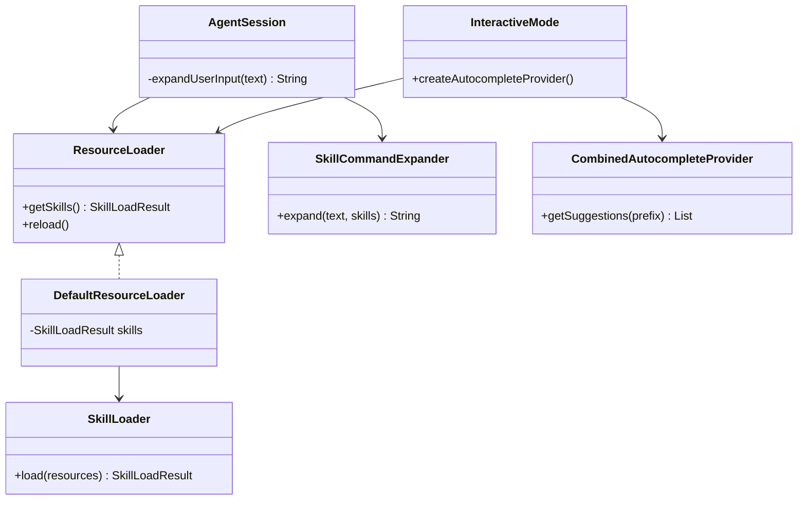

# pi-mono-java Skill Command SR 设计

> 文档编号：SR-SKILL-CMD-001  
> 设计名称：Java Skill Command 发现、动态展示与展开能力  
> 目标工程：`/Users/z/pi-mono-java`  
> 状态：Draft  
> 日期：2026-07-14  
> 版本：v2.4  
> 规范基线：pi TypeScript 当前实现  
> 设计原则：先实现 PI-PARITY，再讨论 Java 扩展  
> 关联设计：`pi-mono-java Extension Command SR 设计 v1.11`

---

## 1. 设计结论

### 1.1 核心定义

Java Skill Command 必须复现 pi 当前实现的行为，而不是重新发明一套 Skill 命令框架。

Skill 是 Resource Loader 管理的资源。Skill Command 是已加载 Skill 在补全层的动态投影，以及用户提交后在 AgentSession 中执行的文本展开规则。

```mermaid
flowchart LR
    A[Resource Loader] --> B[Loaded Skill List]
    B --> C[Autocomplete Mapping]
    C --> D[/skill:name]
    B --> E[Skill Command Expansion]
    E --> F[Expanded User Message]
```

准确链路是：

1. Resource Loader 发现并加载 Skill。
2. Resource Loader 对外提供当前 `SkillLoadResult`。
3. TUI 创建补全 Provider 时遍历 `skills`。
4. 每个 Skill 映射为 `skill:<name>` 补全项。
5. 用户提交 `/skill:<name> [args]`。
6. AgentSession 从当前 Skill 列表按名称查找。
7. 调用时读取 `SKILL.md`，去除 frontmatter 并生成 `<skill>` 块。
8. Prompt、Steer 和 Follow-up 使用相同的 Skill 展开顺序。

整个过程不为每个 Skill 注册 Slash Command Handler。

### 1.2 本期目标

本期只完成 PI-PARITY：

- 对齐 pi 的 Skill 来源优先级、去重和冲突诊断。
- 对齐 `Skill[] -> skill:name` 动态补全。
- 对齐 fuzzy command completion。
- 对齐 Extension、Skill、Prompt Template 的处理顺序。
- 对齐 Prompt、Steer、Follow-up 的 Skill 展开。
- 对齐调用时读取正文和 fail-open 行为。
- 对齐 `enableSkillCommands` 和 `disable-model-invocation` 语义。
- 对齐启动和 `/reload` 后刷新补全。

### 1.3 非目标

以下能力不是 pi 当前 Skill Command 的组成部分，不进入本期核心设计：

- Skill Service 和数据库资源。
- `SkillContentRef`、资源 URI、ETag 或正文版本协议。
- `SkillCatalogSnapshot`、generation 和跨请求版本绑定。
- 未知 Skill 的 fail-closed 协议。
- 独立 `invocationEnabled` 开关。
- Skill 参数级补全。
- Skill 专属 Sandbox 策略。
- Skill Command 专属指标和复杂可观测性平台。

这些能力如有产品需求，应单独立项，不得以“对齐 pi”的名义进入本期。

### 1.4 阅读和决策框架

本文刻意区分事实、现状、选择和未来设想：

| 分类 | 对应章节 | 含义 |
|---|---|---|
| pi 代码事实 | 第 2 章 | TypeScript 当前代码已经实现的行为，是 PI-PARITY 的依据 |
| Java 当前现状 | 第 3 章 | 用于识别迁移差距，不代表目标设计 |
| Java 本期选择 | 第 4～19 章 | 在保持 pi 产品语义的前提下确定 Java 结构和迁移方案 |
| Java 后续扩展 | 第 20 章 | pi 当前没有的能力，必须独立评审 |

第 19 章集中记录每项关键问题的 pi 事实、Java 选择、未选方案和取舍影响。不能从“Java 当前已经这样实现”推导“Java 目标设计应继续这样实现”。

---

## 2. pi 代码基线

### 2.1 Skill 发现

pi 的 Skill Command 不扫描目录。Skill 发现由 `DefaultResourceLoader.reload()` 完成。



代码基线：

| 代码位置 | 行为 |
|---|---|
| `packages/coding-agent/src/core/resource-loader.ts:333-410` | Reload settings、解析 package/CLI 来源、选择 enabled Skill 并合并路径 |
| `packages/coding-agent/src/core/resource-loader.ts:603-624` | 调用 `loadSkills()`，再替换当前 Skill 和 diagnostics |
| `packages/coding-agent/src/core/skills.ts:163-274` | Skill root、根 `.md`、递归、ignore 和符号链接扫描 |
| `packages/coding-agent/src/core/skills.ts:277-325` | 读取 frontmatter、校验并决定是否加载 |
| `packages/coding-agent/src/core/skills.ts:387-486` | canonical path 去重、名称 first-wins 和 collision diagnostic |
| `packages/coding-agent/src/core/package-manager.ts:184-188` | 定义来源优先级 rank |
| `packages/coding-agent/src/core/package-manager.ts:2286-2389` | `.pi`、`.agents` 与 project trust 来源解析 |
| `packages/coding-agent/src/core/package-manager.ts:2465-2489` | 按 rank 稳定排序并按 canonical path 去重 |

pi 来源优先级从高到低：

1. 项目显式配置。
2. 项目自动发现。
3. 用户显式配置。
4. 用户自动发现。
5. 包资源。

排序完成后，`loadSkills()` 采用 first-wins。

### 2.2 Skill 数据

pi 的 Skill 只保存元数据和文件定位：

```typescript
interface Skill {
  name: string;
  description: string;
  filePath: string;
  baseDir: string;
  sourceInfo: SourceInfo;
  disableModelInvocation: boolean;
}
```

Skill 正文不在发现阶段常驻内存，也不进入补全项。

### 2.3 动态展示

pi 在 TUI 创建补全 Provider 时直接映射当前 Skill：

```typescript
const skillCommandList: SlashCommand[] = [];
if (settingsManager.getEnableSkillCommands()) {
  for (const skill of session.resourceLoader.getSkills().skills) {
    skillCommandList.push({
      name: `skill:${skill.name}`,
      description: skill.description,
    });
  }
}
```

这是只读 DTO 映射，不是 `registerCommand()`。

### 2.4 补全匹配

`CombinedAutocompleteProvider` 把 Builtin、Prompt Template、Extension 和 Skill 补全项合并后，对命令名执行 `fuzzyFilter()`。

- 输入必须位于行首并以 `/` 开头。
- 命令名阶段没有空格。
- Skill 没有 `getArgumentCompletions`。
- 选中后插入 `/skill:<name> `。

`getArgumentCompletions` 是 `SlashCommand` 的可选函数。Builtin Command 可以在 TUI 中提供，Extension Command 可以从注册信息透传；Skill DTO 只包含 `name` 和 `description`。输入出现第一个空格后，`CombinedAutocompleteProvider` 只有在目标命令提供该函数时才继续补全，否则返回 `null`。

这不是遗漏，而是 Skill 数据模型的结果：`SKILL.md` 没有参数名称、类型、顺序、枚举或动态候选值协议。AgentSession 只把第一个空格后的文本整体作为 `args`，经过 `trim()` 后追加到展开结果。因此 pi 只能可靠补全 Skill 名称，不能推断参数语义。

代码证据：

| 代码位置 | 证明的行为 |
|---|---|
| `packages/tui/src/autocomplete.ts:227-234` | `getArgumentCompletions` 是 Slash Command 可选字段 |
| `packages/coding-agent/src/modes/interactive/interactive-mode.ts:555-570` | Skill DTO 只有名称和描述，没有参数补全函数 |
| `packages/tui/src/autocomplete.ts:333-358` | 空格后只调用目标命令显式提供的参数补全函数 |
| `packages/coding-agent/src/core/agent-session.ts:1173-1196` | 空格后的内容作为自由文本参数参与 Skill 展开 |

### 2.5 Skill 调用



pi 的展开顺序：

1. 输入必须以 `/skill:` 开头。
2. 第一个 ASCII 空格之前是 Skill name。
3. 在当前 `Skill[]` 中执行大小写敏感的名称查找。
4. 调用时读取 `SKILL.md`。
5. 去除 frontmatter，并对正文执行 `trim()`。
6. 生成 `<skill>` 块。
7. 有参数时使用两个换行追加参数。

展开格式：

```xml
<skill name="review-pr" location="/repo/.pi/skills/review-pr/SKILL.md">
References are relative to /repo/.pi/skills/review-pr.

Skill body...
</skill>

123
```

### 2.6 路由和队列

pi 普通 Prompt 的处理顺序：

```text
Extension Command
  -> input extension hook
  -> Skill Command expansion
  -> Prompt Template expansion
  -> Agent prompt
```

`steer()` 和 `followUp()` 不执行 Extension Command，但都会执行：

```text
Skill Command expansion
  -> Prompt Template expansion
  -> queue message
```

### 2.7 失败语义

pi 采用 fail-open：

| 场景 | pi 行为 |
|---|---|
| 不是 Skill Command | 返回原输入 |
| Skill 不存在 | 返回原输入 |
| 文件读取失败 | 发出 extension error，返回原输入 |
| 展开成功 | 返回 Skill block |

因此未知或读取失败的 `/skill:` 输入最终可能作为普通 Prompt 发送给模型。本期 Java 必须保持该兼容语义。

### 2.8 Reload

`/reload` 完成两件事：

1. `session.reload()` 重新加载 settings、extensions、skills、prompts 和 themes。
2. TUI 调用 `setupAutocompleteProvider()`，根据新的 Skill 列表重建补全。

新建或删除 Skill 不会在每次按键时触发扫描，只在启动或 Reload 后生效。

### 2.9 展示与调用证据

| 代码位置 | 证明的行为 |
|---|---|
| `packages/coding-agent/src/modes/interactive/interactive-mode.ts:555-570` | TUI 遍历 `getSkills().skills` 并创建 `skill:<name>` DTO |
| `packages/tui/src/autocomplete.ts:308-358` | 命令名阶段合并过滤；出现空格后只查询命令自带参数补全 |
| `packages/tui/src/fuzzy.ts:12-136` | fuzzy 评分、token 拆分和字母数字交换 fallback |
| `packages/coding-agent/src/core/agent-session.ts:1003-1028` | input hook 后执行 Skill-first、Template-second |
| `packages/coding-agent/src/core/agent-session.ts:1173-1196` | 名称解析、调用时读取、展开格式和 fail-open |
| `packages/coding-agent/src/core/agent-session.ts:1207-1237` | Steer 和 Follow-up 都展开 Skill 与 Template |
| `packages/coding-agent/src/core/agent-session.ts:2435-2456` | Session Reload 重新加载 Resource Loader |
| `packages/coding-agent/src/modes/interactive/interactive-mode.ts:5099-5125` | Reload 成功后重建 autocomplete provider |

---

## 3. Java 当前实现差距

### 3.1 当前链路



Java 当前已经具备动态投影，但周边语义没有完全对齐 pi。

### 3.2 差距矩阵

| 维度 | Java 当前代码 | pi 基线 | 本期调整 |
|---|---|---|---|
| Skill 存储 | 可变 `SkillRegistry` | Resource Loader 持有 `Skill[]` | Resource Loader 持有不可变 `SkillLoadResult` |
| Reload | `clear()` 后逐条注册 | 完整加载后替换 Skill 结果 | 构建局部结果后一次赋值 |
| 冲突 | 后注册覆盖先注册 | 来源排序后 first-wins，有诊断 | 复用 pi 规则 |
| 补全 | TUI 动态映射 | TUI 动态映射 | 保留动态映射 |
| 匹配 | `startsWith()` | fuzzy filter | 改为 fuzzy |
| 开关 | `enableSkillCommands` 未参与构建 | 只控制补全 | 接入补全构建 |
| Prompt 顺序 | Template 后 Skill | Skill 后 Template | 调整为 Skill 后 Template |
| Steer | 不展开 Skill | 展开 Skill | 调用统一辅助方法 |
| Follow-up | 绕过 Session 展开 | 展开 Skill | 通过 Session 统一展开 |
| 命令解析 | 正则限制 name，先 `trim()` 整个输入 | 只检查前缀，以第一个 ASCII 空格切分 | 改为 pi 的直接切分 |
| 展开换行 | 正文前少一个空行，参数前一个换行 | 正文前两个换行，参数前两个换行 | 输出与 pi 字节级对齐 |
| 未知 Skill | 原文透传 | 原文透传 | 保持 |
| 读取失败 | 原文透传 | 记录错误后原文透传 | 补充统一错误通知 |
| Sandbox | 失败后直接读取 | 直接读取 | 不在 Skill Command SR 定义策略 |

### 3.3 不应继续沿用的 Java 结构

- `AgentSession.getSkillRegistry()` 暴露可变容器。
- TUI、Help、Server 分别遍历 Registry，容易产生不同展示规则。
- `SkillRegistry.register()` 的 last-wins 隐式决定优先级。
- `AgentSession.prompt()` 的 Template-first 顺序与 pi 相反。
- `steer()` 和 Follow-up 绕过 Skill 展开。
- `enableSkillCommands` 只有配置字段，没有控制补全。

### 3.4 Java 现状代码证据

| 代码位置 | 当前行为 |
|---|---|
| `modules/coding-agent-cli/src/main/java/com/campusclaw/codingagent/skill/SkillRegistry.java:22-30` | `LinkedHashMap` 可变保存，`put()` 形成 last-wins |
| `modules/coding-agent-cli/src/main/java/com/campusclaw/codingagent/session/AgentSession.java:176-180` | Prompt Template 先于 Skill 展开 |
| `modules/coding-agent-cli/src/main/java/com/campusclaw/codingagent/session/AgentSession.java:268-272` | Steer 原样进入 Agent |
| `modules/coding-agent-cli/src/main/java/com/campusclaw/codingagent/session/AgentSession.java:545-559` | Reload 先 clear，再按 user、project 注册；project 覆盖 user |
| `modules/coding-agent-cli/src/main/java/com/campusclaw/codingagent/mode/InteractiveMode.java:630` | Follow-up 直接调用底层 Agent |
| `modules/coding-agent-cli/src/main/java/com/campusclaw/codingagent/mode/InteractiveMode.java:1520-1542` | Skill 已经动态映射为补全 DTO，但未读取开关且最终按字母排序 |
| `modules/coding-agent-cli/src/main/java/com/campusclaw/codingagent/mode/tui/EditorContainer.java:271-292` | 命令补全使用 `startsWith()` |
| `modules/coding-agent-cli/src/main/java/com/campusclaw/codingagent/skill/SkillExpander.java:35-115` | 使用严格正则、整体 trim，正文和参数换行与 pi 不同 |
| `modules/coding-agent-cli/src/main/java/com/campusclaw/codingagent/skill/SkillExpander.java:121-149` | Sandbox 失败后静默回退到直接文件读取 |

---

## 4. 设计约束

### 4.1 规范优先级

本 SR 使用以下决策优先级：

1. pi 当前代码行为。
2. Java 类型安全和不可变集合等不改变语义的实现习惯。
3. Java 当前实现的兼容迁移成本。
4. 后续扩展设想。

后续扩展不得反向修改 PI-PARITY 验收结果。

### 4.2 最小抽象

本期只保留五个核心概念：

- `Skill`
- `SkillLoadResult`
- `ResourceLoader`
- `SkillCommandExpander`
- `CombinedAutocompleteProvider`

不引入独立 `SkillCatalog`、`SkillCommandProjector`、`SkillCommandResolver`、`SkillContentRef` 或 `PromptPreprocessor` 公共接口。

Prompt、Steer 和 Follow-up 的复用通过 AgentSession 私有辅助方法完成。

### 4.3 行为兼容

以下行为必须与 pi 一致：

- 新 Skill 仅在启动或 Reload 后进入补全。
- `enableSkillCommands=false` 只隐藏补全，不禁止手工调用。
- `disable-model-invocation=true` 只影响系统提示词。
- 未知 Skill 和读取失败保持 fail-open。
- Skill 在 Prompt Template 之前展开。
- Steer 和 Follow-up 与 Prompt 使用相同 Skill 展开。

---

## 5. Java 目标架构

### 5.1 组件关系



### 5.2 职责

| 组件 | 职责 |
|---|---|
| `DefaultResourceLoader` | 解析来源、加载资源、保存当前 Skill 结果 |
| `SkillLoader` | 读取 frontmatter、校验、去重和冲突处理 |
| `SkillLoadResult` | 不可变保存有序 Skill 和诊断 |
| `InteractiveMode` | 把 Skill 映射为补全 DTO |
| `CombinedAutocompleteProvider` | 合并命令补全并执行 fuzzy filter |
| `SkillCommandExpander` | 按 pi 规则查找、读取并展开 Skill |
| `AgentSession` | 统一 Prompt、Steer、Follow-up 的展开顺序 |

### 5.3 关键边界

```text
SlashCommandRegistry
  - Builtin Command
  - Extension Command

ResourceLoader
  - Skill[]
  - PromptTemplate[]
  - diagnostics

Autocomplete
  - Skill[] -> skill:name DTO

AgentSession
  - Skill expansion
  - Prompt Template expansion
```

Skill 不进入 `SlashCommandRegistry`，但可以使用普通 Java record 作为补全 DTO。

---

## 6. 数据模型

### 6.1 Skill

```java
public record Skill(
        String name,
        String description,
        Path filePath,
        Path baseDir,
        SourceInfo sourceInfo,
        boolean disableModelInvocation) {
}
```

与当前 Java 相比，仅把字符串 `source` 升级为结构化 `SourceInfo`，以支持 pi 的来源标签和优先级。

### 6.2 SkillLoadResult

```java
public record SkillLoadResult(
        List<Skill> skills,
        List<ResourceDiagnostic> diagnostics) {

    public SkillLoadResult {
        skills = List.copyOf(skills);
        diagnostics = List.copyOf(diagnostics);
    }

    public static SkillLoadResult empty() {
        return new SkillLoadResult(List.of(), List.of());
    }
}
```

`skills` 必须保持来源优先级和发现顺序，供补全稳定展示和 first-wins 冲突处理。

### 6.3 ResourceLoader

```java
public interface ResourceLoader {
    SkillLoadResult getSkills();

    List<PromptTemplateEntry> getPrompts();

    void reload();
}
```

默认实现使用整体替换：

```java
public final class DefaultResourceLoader implements ResourceLoader {
    private volatile SkillLoadResult skills = SkillLoadResult.empty();

    @Override
    public SkillLoadResult getSkills() {
        return skills;
    }

    private void reloadSkills(List<ResolvedSkillResource> resources) {
        SkillLoadResult next = skillLoader.load(resources);
        skills = next;
    }
}
```

`volatile` 只用于 Java 安全发布，不增加 generation 或版本协议。

### 6.4 诊断

```java
public record ResourceDiagnostic(
        DiagnosticType type,
        String message,
        Path path,
        ResourceCollision collision) {
}
```

至少支持：

- warning
- error
- collision

---

## 7. Skill 发现和合并

### 7.1 来源

Java 应复用 Extension Resource Resolver 的来源模型，不由 `AgentSession` 写死两个目录。

推荐来源：

- 项目显式配置和项目自动发现目录。
- 用户显式配置和用户自动发现目录。
- 包资源。
- 临时 CLI extension 所贡献的 Skill 路径。
- 显式 additional Skill 路径。

只有 Resource Resolver 标记为 enabled 的资源才传给 Skill Loader。Java 可以继续使用 `.campusclaw` 目录命名，但还应兼容 Agent Skills 的用户级和项目级 `.agents/skills` 来源；来源语义和合并顺序必须对齐 pi。

### 7.2 目录扫描规则

扫描行为对齐 `skills.ts`：

- 目录包含 `SKILL.md` 时，该目录是一个 Skill root，不再向下递归。
- 扫描入口根目录可以加载直接 `.md` 子文件。
- 没有 `SKILL.md` 时递归子目录。
- 跳过隐藏目录和 `node_modules`。
- 读取 `.gitignore`、`.ignore` 和 `.fdignore`。
- 符号链接指向有效文件或目录时可以跟随，最终由 canonical path 去重。

### 7.3 项目信任

项目级 Skill 只在项目被信任后加入 resolved resources。用户级 Skill 不依赖项目信任。

项目未信任时：

- 不加载项目 Skill。
- 不生成项目 Skill 补全。
- 手工输入同名 Skill 只能解析到其他已加载来源。

### 7.4 优先级

```java
private static int precedence(SourceInfo source) {
    if (source.origin() == ResourceOrigin.PACKAGE) {
        return 4;
    }
    int scopeBase = source.scope() == ResourceScope.PROJECT ? 0 : 2;
    return scopeBase + (source.source() == ResourceSource.LOCAL ? 0 : 1);
}
```

资源按 rank 升序排列，名称冲突时先出现者获胜。

临时 CLI extension 贡献的 Skill 路径和 additional Skill 路径不使用上述五级 rank，自身顺序按 Resource Loader 的 merge 顺序处理。Java 必须为这两类来源增加与 pi 相同的顺序回归测试，不能由 Map 遍历顺序隐式决定。

### 7.5 canonical path 去重

每个 Skill 文件在加入名称 Map 前执行真实路径规范化。

```java
Path realPath = skill.filePath().toRealPath();
if (!seenRealPaths.add(realPath)) {
    continue;
}
```

同一文件通过符号链接或不同路径重复发现时静默去重。

### 7.6 名称冲突

```java
Skill existing = byName.putIfAbsent(skill.name(), skill);
if (existing != null) {
    diagnostics.add(ResourceDiagnostic.collision(
            skill.name(),
            existing.filePath(),
            skill.filePath()));
}
```

不得使用 `put()` 覆盖先前 Skill。

### 7.7 校验兼容

PI-PARITY 使用 pi 当前行为：

- description 缺失或为空：不加载 Skill，并产生 warning。
- description 超长：产生 warning，但仍加载。
- name 超长或字符不合法：产生 warning，但仍加载。
- 无 frontmatter name：使用父目录名。
- frontmatter 解析失败或文件读取失败：不加载并产生 warning。

如果 Java 产品决定严格拒绝非法 name，应作为独立兼容性变更评审。

---

## 8. Skill Command 动态补全

### 8.1 映射位置

映射保留在创建补全 Provider 的代码中，与 pi 一致：

```java
private List<CommandSuggestion> buildSkillCommands() {
    if (!settings.getEnableSkillCommands()) {
        return List.of();
    }

    return session.resourceLoader()
            .getSkills()
            .skills()
            .stream()
            .map(skill -> new CommandSuggestion(
                    "skill:" + skill.name(),
                    prefixSource(
                            skill.description(),
                            skill.sourceInfo())))
            .toList();
}
```

不新增每个 Skill 对应的 Handler，也不调用 `SlashCommandRegistry.register()`。

### 8.2 合并顺序

```java
List<CommandSuggestion> commands = Stream.of(
        builtinCommands(),
        promptTemplateCommands(),
        extensionCommands(),
        buildSkillCommands())
        .flatMap(List::stream)
        .toList();
```

该顺序只影响补全数据输入顺序，不代表执行路由优先级。

### 8.3 fuzzy filter

Java 当前 `startsWith()` 必须替换为与 pi 等价的 fuzzy matcher：

```java
List<CommandSuggestion> filtered =
        PiFuzzyMatcher.filter(allCommands, prefix, CommandSuggestion::name);
```

要求：

- 大小写不敏感。
- 连续字符优先于分散字符。
- 单词边界、连续匹配和精确匹配获得更优分数。
- 查询按空白或 `/` 拆分 token，所有 token 都必须命中。
- 支持 pi 的字母数字顺序交换 fallback。
- 同分结果保持输入稳定顺序。

不得只复用现有 Java `FuzzyMatcher` 的名称而假设行为相同；应移植 pi 的评分规则并使用共享 parity fixtures。

### 8.4 参数补全

Skill v1 不提供参数补全。输入出现第一个空格后，Skill Command 不再产生补全项。

---

## 9. Reload 设计

### 9.1 流程



### 9.2 一次替换

Java 不再执行：

```java
skillRegistry.clear();
skillRegistry.registerAll(userSkills);
skillRegistry.registerAll(projectSkills);
```

改为：

```java
SkillLoadResult next = skillLoader.load(resolvedSkills);
this.skills = next;
```

这与 pi 的完整结果替换一致，不需要引入 generation。

### 9.3 刷新时机

补全 Provider 在以下时机重建：

- InteractiveMode 启动。
- `/reload` 成功完成。
- Session 被替换或重新绑定。
- Extension 在运行时扩展资源并完成加载。

普通键入不得扫描 Skill 目录。

### 9.4 Reload 失败

如果 Resource Resolver 或 Skill Loader 抛出不可恢复异常，`reload()` 返回失败，TUI 不重建补全 Provider。

局部无效 Skill 通过 diagnostics 表达，不使整个 Reload 失败，这与 pi 当前加载行为一致。

---

## 10. Skill Command 调用

### 10.1 路由



执行优先级必须是：

1. Builtin 或 Extension Command。
2. Skill Command 展开。
3. Prompt Template 展开。
4. 普通 Prompt。

### 10.2 端到端调用时序

[](./assets/skill-command-invocation.svg)

预览使用 PlantUML 生成的 SVG，保持 GitHub 页面缩放后的文字清晰度；[PNG 兼容版本](./assets/skill-command-invocation.png)同步保留。PlantUML 源码保留如下，修改时应重新生成两个预览文件。

<details>
<summary>PlantUML 源码</summary>



</details>

调用边界：

| 组件 | 在 Skill 调用中的职责 |
|---|---|
| 客户、Agent交互UI | 输入 `/skill:<name> [args]` 并展示最终响应 |
| Agent GW | 加载 Agent/会话上下文，把请求路由到 Agent Runtime，并持久化消息 |
| Agent Runtime | 编排 Skill 展开、模型和 Tool，不实现 Skill 发现或解析规则 |
| Skills管理器 | 解析 Skill Command、按名称匹配、格式化 `<skill>` block，并保持 fail-open |
| 资源管理器 | 提供当前 `SkillLoadResult`，按 `filePath` 读取 Skill 正文 |
| 模型管理器 | 解析模型并执行模型调用 |
| Tools管理器 | 提供 Tool 定义，只在模型返回 Tool Call 后执行 Tool |
| 数据库 | 保存 Agent/会话配置和消息；PI-PARITY 下不保存 Skill 正文 |

关键取舍：Skill 调用不会直接触发数据库查询 Skill，也不会直接调用 Tool。Skill 先展开为用户消息；模型收到展开后的消息和 Tool 定义后，才可能产生 Tool Call。

### 10.3 SkillCommandExpander

```java
public final class SkillCommandExpander {
    private final SkillFileReader fileReader;
    private final SkillExpansionErrorListener errorListener;

    public String expand(String text, List<Skill> skills) {
        if (!text.startsWith("/skill:")) {
            return text;
        }

        int spaceIndex = text.indexOf(' ');
        String skillName = spaceIndex < 0
                ? text.substring(7)
                : text.substring(7, spaceIndex);
        String args = spaceIndex < 0
                ? ""
                : text.substring(spaceIndex + 1).trim();

        Skill skill = skills.stream()
                .filter(candidate -> candidate.name().equals(skillName))
                .findFirst()
                .orElse(null);
        if (skill == null) {
            return text;
        }

        try {
            String content = fileReader.read(skill.filePath());
            String body = Frontmatter.strip(content).trim();
            String block = "<skill name=\"" + skill.name()
                    + "\" location=\"" + skill.filePath() + "\">\n"
                    + "References are relative to " + skill.baseDir() + ".\n\n"
                    + body + "\n</skill>";
            return args.isEmpty() ? block : block + "\n\n" + args;
        } catch (IOException error) {
            errorListener.onError(skill, error);
            return text;
        }
    }
}
```

### 10.4 解析语义

为保持 pi 兼容：

- 只判断字符串是否以 `/skill:` 开头。
- 使用第一个 ASCII 空格分隔命令名和参数。
- 不在调用层重新执行 name 正则校验。
- 名称大小写敏感。
- 参数执行 `trim()`。
- 未找到 Skill 时返回原文本。

### 10.5 正文读取

正文在每次调用时读取，不在补全阶段缓存。

该语义保证：

- Skill 文件在 Reload 后对应新的元数据列表。
- 调用时可以读取文件的当前正文。
- 启动时不加载所有 Skill 正文。

`SkillFileReader` 只是文件读取边界，不引入 URI、版本或服务端协议。

### 10.6 Prompt、Steer 和 Follow-up

AgentSession 使用同一个私有辅助方法：

```java
private String expandUserInput(String text) {
    String expanded = skillCommandExpander.expand(
            text,
            resourceLoader.getSkills().skills());
    return PromptTemplate.expandIfMatched(expanded, promptTemplates);
}
```

三条入口：

```java
public CompletableFuture<Void> prompt(String text) {
    return agent.prompt(expandUserInput(text));
}

public void steer(String text) {
    agent.steer(userMessage(expandUserInput(text)));
}

public void followUp(String text) {
    agent.followUp(userMessage(expandUserInput(text)));
}
```

Extension Command 在进入该辅助方法之前处理；Steer 和 Follow-up 遇到 Extension Command 时保持 pi 的拒绝语义。

---

## 11. Java 类关系

### 11.1 类图



### 11.2 模块落点

```text
com.campusclaw.codingagent.resource
  ResourceLoader
  DefaultResourceLoader
  ResourceDiagnostic
  ResourceCollision
  SourceInfo

com.campusclaw.codingagent.skill
  Skill
  SkillLoadResult
  SkillLoader
  SkillCommandExpander
  SkillFileReader
  SkillExpansionErrorListener

com.campusclaw.codingagent.session
  AgentSession

com.campusclaw.codingagent.mode
  InteractiveMode

com.campusclaw.codingagent.mode.tui
  CombinedAutocompleteProvider
  CommandSuggestion
```

### 11.3 移除和保留

移除：

- `SkillRegistry`
- `AgentSession.getSkillRegistry()`
- TUI 对可变 Registry 的依赖

保留并调整：

- `Skill`
- `SkillLoader`
- `SkillExpander`，重命名或调整为 `SkillCommandExpander`
- `CommandSuggestion`
- `SkillPromptFormatter`

---

## 12. 配置语义

### 12.1 enableSkillCommands

```yaml
enableSkillCommands: true
```

与 pi 完全一致：

| 配置 | 系统提示词 | 补全列表 | 手工调用 |
|---|---:|---:|---:|
| `true` | 不受该字段影响 | 显示 | 允许 |
| `false` | 不受该字段影响 | 隐藏 | 允许 |

不新增 `invocationEnabled`。

### 12.2 disable-model-invocation

| Skill 字段 | 系统提示词 | 补全列表 | 手工调用 |
|---|---:|---:|---:|
| `false` | 显示 | 显示 | 允许 |
| `true` | 隐藏 | 显示 | 允许 |

只有 `SkillPromptFormatter` 过滤 `disableModelInvocation=true` 的 Skill。

### 12.3 noSkills

如果 Java 提供 `noSkills` 启动参数，应与 pi 一致：

- 不加载默认 Skill 来源。
- 显式 CLI Skill 路径是否保留由 CLI 参数语义决定。
- Skill 列表为空时不生成补全和系统提示词 Skill 列表。

---

## 13. 失败和诊断

### 13.1 调用失败

| 场景 | 返回值 | 是否继续后续 Prompt |
|---|---|---:|
| 非 Skill Command | 原文本 | 是 |
| 未知 Skill | 原文本 | 是 |
| 正文读取失败 | 原文本 | 是 |
| 成功 | 展开文本 | 是 |

本期不定义 `SkillCommandResult` sealed hierarchy。

### 13.2 错误通知

文件读取失败应调用统一监听器：

```java
public interface SkillExpansionErrorListener {
    void onError(Skill skill, Exception error);
}
```

Interactive TUI 可把错误交给 Extension 错误通道或统一日志，但不得改变返回原文本的兼容语义。

### 13.3 发现诊断

发现阶段诊断至少包含：

- 错误类型。
- 消息。
- 文件路径。
- 冲突 winner 和 loser。

诊断不影响其他有效 Skill 加载。

---

## 14. 安全边界

### 14.1 与 pi 对齐的安全能力

- 项目信任决定是否解析项目 Skill 来源。
- canonical path 用于同文件去重。
- Skill 正文只在调用时读取。
- `disable-model-invocation` 防止 Skill 自动出现在模型可见列表。
- Skill frontmatter 不直接授予 Tool 权限。

### 14.2 本期不定义的策略

pi 的 Skill Command 直接读取本地文件，因此以下策略不属于 PI-PARITY：

- Sandbox 失败是否回退。
- 服务端正文授权。
- URI scheme allowlist。
- ETag 或正文摘要。
- Skill 正文版本一致性。

当前 Java 如保留 Sandbox，可通过 `SkillFileReader` 适配，但不得把 Sandbox 逻辑写进 Skill Command 路由。

### 14.3 输出兼容

本期展开文本应与 pi 的普通有效路径输出一致。XML attribute 转义等增强如果会改变输出，必须单独增加兼容测试和决策记录。

---

## 15. 功能需求

### 15.1 PI-PARITY：发现

- FR-PI-SC-001：Resource Loader 必须统一提供当前 Skill 列表和诊断。
- FR-PI-SC-002：项目 Skill 必须受项目信任控制。
- FR-PI-SC-003：Skill 来源必须按 pi 优先级排序。
- FR-PI-SC-004：同一 canonical path 只能加载一次。
- FR-PI-SC-005：重名 Skill 必须 first-wins 并记录 collision diagnostic。
- FR-PI-SC-006：description 缺失的 Skill 不得进入列表。
- FR-PI-SC-007：其他 name 和 description 校验错误按 pi 产生 warning。
- FR-PI-SC-008：目录扫描必须支持 Skill root、根目录 `.md`、ignore 文件和符号链接规则。
- FR-PI-SC-009：CLI extension Skill 和 additional Skill 路径必须保持 pi 的 merge 顺序。

### 15.2 PI-PARITY：展示

- FR-PI-SC-101：每个已加载 Skill 映射为 `skill:<name>`。
- FR-PI-SC-102：Skill 补全项不得注册 Slash Command Handler。
- FR-PI-SC-103：补全 description 必须包含来源摘要。
- FR-PI-SC-104：命令补全必须使用 fuzzy filter。
- FR-PI-SC-105：Skill 不提供参数补全。
- FR-PI-SC-106：`enableSkillCommands=false` 时隐藏 Skill 补全。
- FR-PI-SC-107：隐藏补全不得禁止手工调用。

### 15.3 PI-PARITY：调用

- FR-PI-SC-201：系统必须识别行首 `/skill:<name> [args]`。
- FR-PI-SC-202：系统必须从当前 Resource Loader Skill 列表查找。
- FR-PI-SC-203：Skill 正文必须在调用时读取。
- FR-PI-SC-204：正文必须去除 frontmatter 并执行 trim。
- FR-PI-SC-205：参数必须使用两个换行追加。
- FR-PI-SC-206：未知 Skill 必须返回原输入。
- FR-PI-SC-207：读取失败必须通知错误并返回原输入。
- FR-PI-SC-208：Skill 必须先于 Prompt Template 展开。
- FR-PI-SC-209：Prompt、Steer、Follow-up 必须执行相同 Skill 展开。

### 15.4 PI-PARITY：Reload

- FR-PI-SC-301：新 Skill 只在启动或 Reload 后出现。
- FR-PI-SC-302：Reload 成功后必须重建补全 Provider。
- FR-PI-SC-303：普通键入不得触发目录扫描。
- FR-PI-SC-304：Resource Loader 必须在完整加载后一次替换 Skill 结果。

---

## 16. 非功能需求

| ID | 要求 |
|---|---|
| NFR-PI-SC-001 | SkillLoadResult 对外集合不可修改 |
| NFR-PI-SC-002 | Reload 结果通过单次字段赋值安全发布 |
| NFR-PI-SC-003 | 补全映射复杂度为 O(n) |
| NFR-PI-SC-004 | Skill 查找允许 O(n)，与 pi 一致 |
| NFR-PI-SC-005 | 1000 个 Skill 的补全映射和过滤目标小于 50 ms |
| NFR-PI-SC-006 | 补全排序在相同输入下保持稳定 |
| NFR-PI-SC-007 | 诊断不得包含 Skill 完整正文 |
| NFR-PI-SC-008 | Skill 正文不得在补全阶段读取 |

---

## 17. 测试设计

### 17.1 资源加载测试

`SkillLoaderTest`：

- 用户、项目、包来源优先级。
- project explicit 高于 project auto。
- project 高于 user。
- canonical path 去重。
- 重名 first-wins。
- collision diagnostic。
- Skill root、根目录 `.md` 和递归子目录发现。
- `.gitignore`、`.ignore`、`.fdignore` 排除。
- CLI extension Skill 和 additional Skill 的合并顺序。
- description 缺失不加载。
- name 非法产生 warning 但仍加载。
- `disable-model-invocation` 解析。

### 17.2 补全测试

`SkillCommandCompletionTest`：

- 三个 Skill 生成三个 `skill:<name>`。
- description 包含来源标签。
- `enableSkillCommands=false` 返回空 Skill 补全列表。
- `disableModelInvocation=true` 仍生成补全。
- fuzzy prefix、分散字符和大小写场景。
- 多 token 和字母数字顺序交换场景。
- 输入出现空格后不做 Skill 参数补全。
- Skill 不进入 `SlashCommandRegistry`。

### 17.3 展开测试

`SkillCommandExpanderTest`：

- 无参数展开。
- 有参数使用两个换行。
- 多行参数。
- Skill name 大小写敏感。
- 非 Skill 输入返回原文。
- 未知 Skill 返回原文。
- 读取失败通知监听器并返回原文。
- 去除 frontmatter。
- 正文 trim。
- envelope 与 pi 输出一致。

### 17.4 Session 测试

`AgentSessionTest`：

- Extension Command 先执行。
- Skill 先于 Prompt Template。
- Prompt 展开 Skill。
- Steer 展开 Skill。
- Follow-up 展开 Skill。
- Steer 和 Follow-up 拒绝 Extension Command。

### 17.5 Reload 集成测试

1. 启动时加载已有 Skill。
2. 新建 `review-pr/SKILL.md`。
3. 未 Reload 时补全不出现。
4. 执行 `/reload`。
5. 输入 `/skill:r`。
6. fuzzy 补全出现 `/skill:review-pr`。
7. 提交 `/skill:review-pr 123`。
8. 验证 Agent 收到 pi 兼容的 Skill block。
9. 删除 Skill 后 Reload，补全消失。

---

## 18. 迁移方案

### 18.1 M1：Resource Loader 收口

- 新增 `SkillLoadResult`。
- 把用户和项目 Skill 加载从 `AgentSession.loadSkills()` 移入 Resource Loader。
- 复用 Extension Resource Resolver 的来源信息。
- 保留现有 `Skill` record，升级 `source` 为 `SourceInfo`。

### 18.2 M2：移除可变 SkillRegistry

- Resource Loader 保存不可变 `SkillLoadResult`。
- 替换 `AgentSession.getSkillRegistry()`。
- Help、Server、System Prompt 和 TUI 统一读取 `resourceLoader.getSkills()`。
- 删除 `clear()/register()/registerAll()` 链路。

### 18.3 M3：补全对齐

- `InteractiveMode` 直接映射 Resource Loader Skill。
- 接入 `enableSkillCommands`。
- 把 `EditorContainer.startsWith()` 替换为 fuzzy matcher。
- Reload 完成后重建补全 Provider。

### 18.4 M4：调用对齐

- `SkillExpander` 改为接收 `List<Skill>`。
- 展开格式、参数分隔和 fail-open 语义对齐 pi。
- AgentSession 改为 Skill-first、Template-second。
- Prompt、Steer 和 Follow-up 复用 `expandUserInput()`。

### 18.5 M5：删除旧接口

- 删除 `SkillRegistry`。
- 删除 TUI 和测试中的 Registry mock。
- 更新 Help、Reload、Session 和 Server Skill 查询。
- 移除无效的 SkillRegistry 覆盖顺序测试，替换为来源优先级测试。

---

## 19. 设计取舍记录

本章回答的不是“pi 有什么类”，而是“pi 的产品语义约束了什么，以及 Java 还可以选择什么”。

### 19.1 取舍判定规则

| 类型 | Java 的处理原则 |
|---|---|
| PI-PARITY | 直接对齐，除非单独批准兼容性差异 |
| Java 实现选择 | 可以使用 record、不可变集合和安全发布，但不得改变外部行为 |
| Java 扩展 | pi 当前没有，必须说明收益、兼容性和安全代价，并通过独立 SR 评审 |

只有“Java 实现选择”允许在本期自由取舍。PI-PARITY 不是偏好，Java 扩展也不能伪装成 PI-PARITY。

### 19.2 核心取舍矩阵

| ID | 问题 | pi 代码事实 | Java 本期选择 | 未选方案及原因 | 取舍影响 |
|---|---|---|---|---|---|
| TD-SC-01 | Skill 由谁持有 | Resource Loader 持有当前有序 `Skill[]` 和诊断 | Resource Loader 持有不可变 `SkillLoadResult` | 保留可变 `SkillRegistry`；会形成第二个事实源和 last-wins 语义 | 需要迁移 Help、Server、TUI 和 Session；换取单一事实源 |
| TD-SC-02 | Skill 是否注册 Handler | TUI 把 Skill 动态映射为补全 DTO，调用由 AgentSession 展开 | 不向 Slash Command Registry 注册每个 Skill | 每个 Skill 注册 Handler；会复制生命周期、冲突和 Reload 管理 | 新增或删除 Skill 只需替换资源结果并重建补全 |
| TD-SC-03 | 来源和重名如何处理 | 来源排序后 canonical path 去重，名称 first-wins，并记录冲突诊断 | 移植相同优先级和诊断规则 | 沿用 Registry 的注册顺序和 last-wins；结果依赖调用顺序 | 迁移成本较高，但行为可解释、可测试 |
| TD-SC-04 | Reload 如何发布 | 完整加载后替换结果，TUI 随后重建补全 Provider | 局部构建完整结果后单次字段赋值 | `clear()` 后逐条注册；中间状态可见且失败恢复困难 | 每次 Reload 需要重建补全，但不会暴露半加载状态 |
| TD-SC-05 | 命令名如何匹配 | 合并命令后使用 pi `fuzzyFilter()` 评分和稳定排序 | 移植算法并共享 parity fixtures | 保留 `startsWith()`；无法复现缩写和分散字符匹配 | 实现和测试复杂度增加，交互行为与 pi 一致 |
| TD-SC-06 | Skill 参数是否补全 | Skill DTO 没有 `getArgumentCompletions`；空格后内容是自由文本 | PI-PARITY 阶段不提供参数补全 | 猜测文件路径、枚举或参数结构；Skill 没有足够元数据 | 放弃参数级提示，避免错误建议和隐式协议 |
| TD-SC-07 | Skill 正文何时读取 | 发现阶段只保存元数据，调用时读取 `SKILL.md` | 保持调用时读取 | Reload 时缓存正文；会改变修改可见性并增加缓存一致性问题 | 每次调用有文件 I/O，但内存更小且语义一致 |
| TD-SC-08 | 未知 Skill 和读取失败如何处理 | 记录必要错误后返回原输入，继续普通 Prompt | 保持 fail-open | fail-closed；安全边界更严格但改变 pi 行为 | 保持兼容，但原始 `/skill:` 文本可能进入模型 |
| TD-SC-09 | Skill 与 Template 的顺序 | Prompt、Steer、Follow-up 都是 Skill-first、Template-second | AgentSession 私有辅助方法统一三条入口 | 为此新增公共 Pipeline/Preprocessor 框架；本期抽象收益不足 | 需要调整 Java 现有入口，避免引入过度抽象 |
| TD-SC-10 | 两个开关控制什么 | `enableSkillCommands` 只控制补全；`disable-model-invocation` 只控制系统提示词 | 精确保留这两个边界 | 新增 `invocationEnabled` 或复用现有字段禁止调用；pi 无此语义 | 手工调用始终可用；如需权限控制必须另行设计 |
| TD-SC-11 | 是否引入 Service、URI 和版本快照 | pi 使用本地文件 Path，没有正文 URI、generation 或版本绑定 | 本期不引入 | 为未来远程 Skill 预建完整服务协议；会扩大当前问题和状态空间 | 核心实现简单；暂不支持远程正文和跨请求版本一致性 |
| TD-SC-12 | Sandbox 失败策略是什么 | pi Skill Command 直接读取本地文件，没有 Java Sandbox 回退协议 | 只保留 `SkillFileReader` 边界，不在本 SR 决定策略 | 沿用 Java 静默回退或改为强制失败；两者都会新增产品语义 | 安全策略暂不变化，但必须在独立 SR 中明确 |
| TD-SC-13 | Java 是否可以增加类型约束 | pi 约束的是外部行为，不要求复制 TypeScript 可变对象结构 | 使用 record、`List.copyOf()`、结构化 `SourceInfo` 和安全发布 | 逐字段机械复制 TypeScript 结构；不符合 Java 实现习惯 | 提升类型安全，不改变发现、展示和调用结果 |

### 19.3 `getArgumentCompletions` 的专项取舍

pi 的完整链路是：

```text
Skill frontmatter
  -> name、description 等元数据
  -> skill:name 命令名补全
  -> 用户输入第一个空格
  -> 无参数 Completion Provider
  -> 剩余文本整体作为 args
  -> 追加到展开后的 Skill Prompt
```

因此“没有 `getArgumentCompletions`”同时由两个边界决定：

1. Skill 是声明式 Markdown 资源，不是可执行 Extension Command，不能提供回调函数。
2. Skill frontmatter 没有声明式参数 Schema，TUI 不知道应该补全什么。

Java 本期不通过启发式规则补全参数。只有同时满足以下条件，才能在后续 SR 重新评估：

- 已有明确的结构化参数产品场景，而不是只为接口完整性增加能力。
- 定义参数 Schema 的归属、版本和与 Agent Skills 的兼容方式。
- 明确静态枚举、文件路径和动态候选值的来源及权限。
- 保证没有 Schema 的现有 Skill 继续使用自由文本参数。
- 定义补全失败、超时和 Reload 后 Provider 刷新的行为。

可选扩展方案包括声明式 frontmatter Schema，或者由 Extension 为指定 Skill 提供外部 Completion Provider；二者都不是当前 pi 行为。

### 19.4 代码—设计—验收追踪

| pi 代码事实 | Java 设计结论 | 需求和验收 |
|---|---|---|
| `resource-loader.ts:333-410,603-624` | Resource Loader 统一持有完整 Skill 结果 | FR-PI-SC-001、FR-PI-SC-304 |
| `skills.ts:387-486` 与 `package-manager.ts:184-188,2465-2489` | 来源排序、路径去重、名称 first-wins 和冲突诊断 | FR-PI-SC-003～005、AC-PI-SC-05 |
| `interactive-mode.ts:555-570` | Skill 动态映射为补全 DTO，不注册 Handler | FR-PI-SC-101～102 |
| `autocomplete.ts:227-234,333-358` | 参数补全是可选能力，Skill 未提供 | Skill 无参数补全测试、TD-SC-06 |
| `fuzzy.ts:12-136` | Java 必须移植等价 fuzzy 规则 | FR-PI-SC-104、AC-PI-SC-08 |
| `agent-session.ts:1003-1028,1207-1237` | Prompt、Steer、Follow-up 统一 Skill-first | FR-PI-SC-208～209、AC-PI-SC-11～14 |
| `agent-session.ts:1173-1196` | 调用时读取、自由文本参数和 fail-open | FR-PI-SC-201～207、AC-PI-SC-09～10 |
| `agent-session.ts:2435-2456` 与 `interactive-mode.ts:5099-5125` | Reload 完整替换资源并重建补全 | FR-PI-SC-301～304、AC-PI-SC-02～04 |

---

## 20. 后续增强

以下需求必须独立评审，不能改变本期 PI-PARITY：

### 20.1 Fail-closed 模式

如产品要求未知 Skill 不进入 LLM，应新增独立配置和兼容性说明，而不是替换默认 pi 行为。

### 20.2 Skill Service

如 Skill 从服务端加载，需要单独设计资源 URI、权限、正文读取、缓存和版本一致性。

### 20.3 Sandbox

如 Java 必须在 Sandbox 中读取 Skill，应由 `SkillFileReader` 实现，并明确失败策略。

### 20.4 调用权限

如需禁止用户手工调用 Skill，应新增权限模型，不能复用 `disable-model-invocation`。

### 20.5 版本化快照

只有在出现跨线程 Reload 一致性或远端正文版本需求时，才评估 generation 和版本化 Snapshot。

---

## 21. 验收场景

| ID | 场景 | 期望结果 |
|---|---|---|
| AC-PI-SC-01 | 启动时存在三个 Skill | 补全出现三个 `/skill:name` |
| AC-PI-SC-02 | 新增 Skill 未 Reload | 补全不变化 |
| AC-PI-SC-03 | Reload 后新增 Skill | 补全出现且可调用 |
| AC-PI-SC-04 | 删除 Skill 后 Reload | 补全消失 |
| AC-PI-SC-05 | 项目和用户 Skill 重名 | 项目 Skill first-wins，产生诊断 |
| AC-PI-SC-06 | `enableSkillCommands=false` | 补全隐藏，手工调用有效 |
| AC-PI-SC-07 | `disable-model-invocation=true` | 系统提示词隐藏，补全和调用有效 |
| AC-PI-SC-08 | 输入 fuzzy 缩写 | 与 pi 一致匹配 Skill |
| AC-PI-SC-09 | 未知 Skill | 原命令作为普通 Prompt 继续 |
| AC-PI-SC-10 | Skill 文件读取失败 | 通知错误，原命令继续 |
| AC-PI-SC-11 | Prompt 调用 Skill | 展开 Skill 后发送 |
| AC-PI-SC-12 | Steer 调用 Skill | 展开 Skill 后排队 |
| AC-PI-SC-13 | Follow-up 调用 Skill | 展开 Skill 后排队 |
| AC-PI-SC-14 | Skill 与 Template 名称产生竞争 | Skill 按 pi 顺序优先展开 |

---

## 22. 结论

Java Skill Command 的目标结构应保持简单：

```text
Resource Resolver
  -> SkillLoader
  -> immutable SkillLoadResult
  -> TUI dynamic mapping
  -> fuzzy autocomplete

User /skill:name
  -> Extension command check
  -> SkillCommandExpander
  -> Prompt Template expansion
  -> Agent
```

本期设计以 pi 当前代码行为为规范，不再把未来 Skill Service、版本化 Snapshot、结构化失败和严格 Sandbox 混入核心链路。

Java 只增加不可变集合、整体字段替换和类型化 SourceInfo 等不改变产品语义的实现约束。所有行为差异必须通过独立后续 SR 评审。

---

## 23. 版本记录

| 版本 | 日期 | 变更 |
|---|---|---|
| v2.0 | 2026-07-13 | 以 pi 当前代码为规范，重构 Java Skill Command 的发现、展示、调用和 Reload 设计 |
| v2.1 | 2026-07-14 | 明确区分 pi 事实、Java 现状和 Java 选择；新增核心取舍矩阵、参数补全专项取舍和代码到验收的追踪关系 |
| v2.2 | 2026-07-14 | 新增包含客户、Agent交互UI、Agent GW、Agent Runtime、模型、Skills、Tools、资源和数据库管理组件的 Skill 调用 PlantUML 时序图 |
| v2.3 | 2026-07-14 | 保留 PlantUML 源码并嵌入生成的 PNG 预览，兼容不支持 PlantUML fenced block 的 Markdown 侧边栏 |
| v2.4 | 2026-07-14 | 调整 PlantUML 参与者顺序和消息长度，降低 GitHub 页面压缩；使用 SVG 作为主预览并保留 PNG 兼容版本 |
